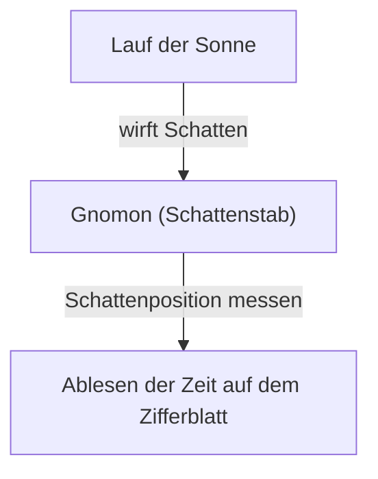
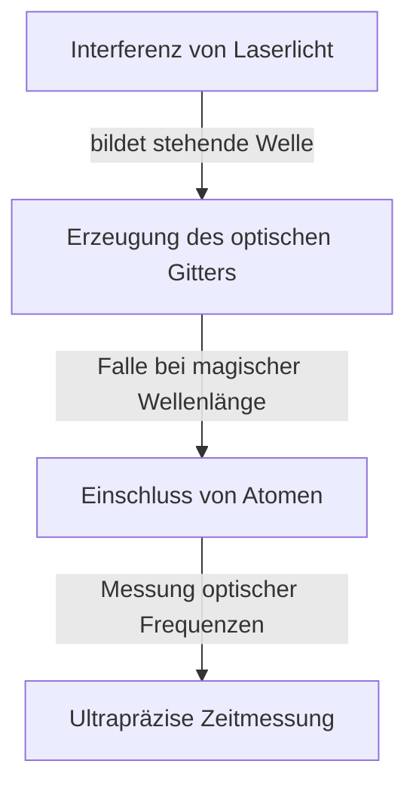

# 1. Die Anfänge der Zeitmessung: Von Himmelskörpern zu Sonnen- und Wasseruhren

Die ersten Mittel, mit denen die Menschheit die Zeit maß, basierten auf der Beobachtung von Himmelskörpern. Der Höchststand der Sonne, die Mondphasen und die Bewegung der Sterne dienten als natürliche Uhren, um die Jahreszeiten und die Tageszeit zu bestimmen.

## Das Prinzip der Sonnenuhr
Um 3500 v. Chr. begannen die Menschen im alten Ägypten und in Babylonien, Sonnenuhren (Obelisken) zu nutzen.
Durch das Messen der Länge des Schattens eines Gnomons (Schattenzeigers) teilten sie den Tag in Zeiteinheiten ein.

# 2. Die Entstehung mechanischer Uhren und der Isochronismus des Pendels

In den Klöstern des mittelalterlichen Europas war es erforderlich, zu festgelegten Zeiten Gebete zu verrichten, weshalb mechanische Uhren erfunden wurden, die durch Gewichte angetrieben wurden. Diese wiesen jedoch noch eine Abweichung von mehreren zehn Minuten pro Tag auf.

## Galilei und Huygens
Galileo Galilei soll den „Isochronismus des Pendels“ entdeckt haben, als er einen schwingenden Kronleuchter im Dom zu Pisa beobachtete. Die Schwingungsdauer $T$ eines Pendels wird durch die Pendellänge $l$ und die Erdbeschleunigung $g$ bestimmt:

$$ T = 2\pi \sqrt{\frac{l}{g}} $$

Im Jahr 1656 wandte Christiaan Huygens dieses Prinzip an und konstruierte die erste Pendeluhr. Dadurch sank die Gangungenauigkeit drastisch auf nur noch wenige Dutzend Sekunden pro Tag.

# 3. Marinechronometer und die Längenbestimmung

Im Zeitalter der Entdeckungen war auf hoher See eine genaue Uhr unerlässlich, um den Längengrad des eigenen Schiffs präzise zu bestimmen. John Harrison entwickelte das federgetriebene Marinechronometer „H4“, das Temperaturschwankungen und den Schiffsbewegungen standhielt, und löste damit das Längengradproblem.

# 4. Die Quarzuhren-Revolution

Zu Beginn des 20. Jahrhunderts kamen Quarzoszillatoren auf, die den piezoelektrischen Effekt nutzten. Wird an einen Quarzkristall eine elektrische Spannung angelegt, schwingt er mit einer äußerst stabilen Frequenz (üblicherweise 32.768 Hz).

$$ f = \frac{1}{2l} \sqrt{\frac{E}{\rho}} $$
($E$ ist der Elastizitätsmodul, $\rho$ ist die Dichte)

# 5. Atomuhren und Relativitätstheorie

Als noch präzisere Uhren als Quarzuhren wurden Atomuhren entwickelt, die Übergänge zwischen den Energieniveaus von Atomen nutzen. Eine Sekunde ist definiert als das 9.192.631.770-Fache der Periodendauer der Strahlung, die dem Übergang zwischen den beiden Hyperfeinstrukturniveaus des Grundzustands von Cäsium-133-Atomen entspricht.

## Einsteins Relativitätstheorie und Zeitdilatation
Atomuhren an Bord von GPS-Satelliten erfordern Korrekturen gemäß der Speziellen Relativitätstheorie (Zeitdilatation durch Geschwindigkeit) und der Allgemeinen Relativitätstheorie (schnellerer Zeitablauf durch geringere Schwerkraft).

Zeitdilatation nach der Speziellen Relativitätstheorie:
$$ \Delta t' = \frac{\Delta t}{\sqrt{1 - \frac{v^2}{c^2}}} $$

# 6. Optische Gitteruhren: Der Zeitstandard der Zukunft

Gegenwärtig schreitet die Forschung an „optischen Gitteruhren“ voran, welche die Grenzen von Cäsium-Atomuhren übertreffen. Bei dieser von Professor Hidetoshi Katori und seinen Kollegen konzipierten Uhr werden Atome wie Strontium in einem durch Laser erzeugten optischen Eierkarton (dem optischen Gitter) gefangen gehalten, und die Übergänge von Zehntausenden von Atomen werden gleichzeitig gemessen.

Die Genauigkeit optischer Gitteruhren ist so hoch, dass sie selbst über das gesamte Alter des Universums (ca. 13,8 Milliarden Jahre) hinweg um weniger als eine Sekunde abweichen würden. Dies ermöglicht relativistische Geodäsie (wie etwa die Bestimmung von Höhenunterschieden im Zentimeterbereich anhand von Schwereunterschieden).
