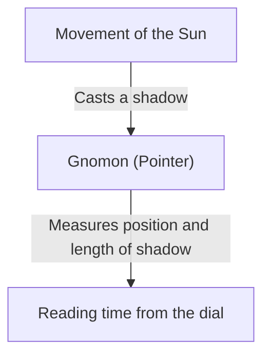
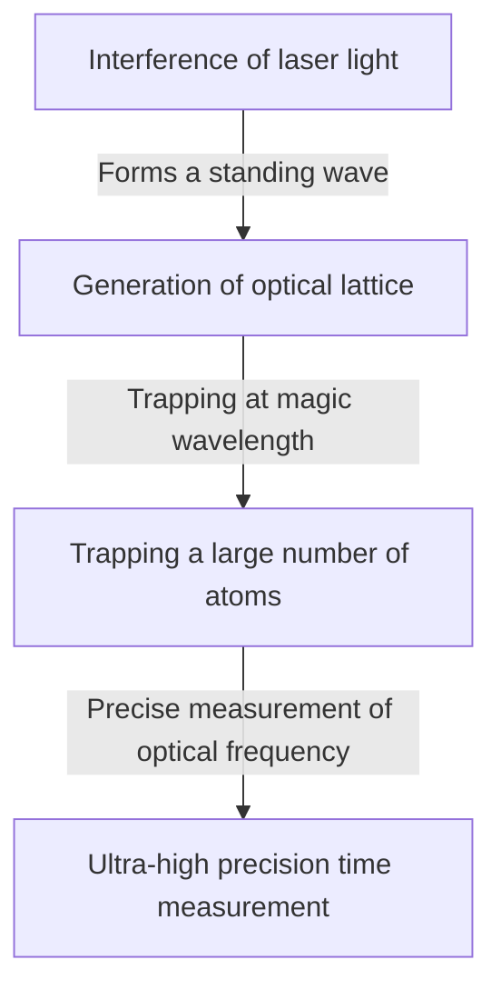

# What is Time: The Endless Quest of Humanity and Clocks

"Time" is one of the most familiar yet mysterious concepts to us humans. Although time is invisible and cannot be touched, our lives are completely governed by it. The history of humanity has been a continuous challenge of how to accurately capture and measure this "time". In this article, we will thoroughly unravel the history of human timekeeping and the development of physics behind it, from ancient sundials to the latest optical lattice clocks utilizing quantum technology.

## 1. The Dawn of Timekeeping: Celestial Movements and Natural Cycles

The first indicators humans used to measure time were the movements of celestial bodies such as the sun, moon, and stars. The movement of the sun from sunrise to sunset, the waxing and waning of the moon, and the changing of the seasons were indispensable information for agriculture, hunting, and religious rituals.

### The Birth of Sundials and Water Clocks
Around 3500 BC in ancient Egypt and Babylonia, "sundials (obelisks)" were already in use. This was a system to divide the time of day by measuring the length and direction of the shadow of a pillar (gnomon) standing vertically on the ground.

However, sundials had a fatal flaw: they "could not be used at night or on cloudy days." To compensate for this, "water clocks (clepsydra)" and "combustion clocks (candle clocks and incense clocks)" were invented. These tools, which measured time by utilizing the property of water dripping at a constant rate or the speed at which objects burn, were groundbreaking inventions unaffected by the weather.

## 2. The Birth of Mechanical Clocks and the "Isochronism of the Pendulum"

Entering the Middle Ages in Europe, "mechanical clocks" powered by weights were invented as alarms to offer prayers at set times in monasteries. Early mechanical clocks controlled the rotation of gears using a mechanism called an escapement, but they were easily affected by friction and temperature changes, resulting in errors of several tens of minutes a day.

### Galileo's Discovery and Huygens' Invention
What dramatically improved the accuracy of time measurement was the discovery of the "isochronism of the pendulum" by the 16th-century physicist Galileo Galilei. This law, stating that the time it takes for a pendulum to swing back and forth is determined solely by the length of the pendulum, regardless of the amplitude or weight, greatly changed the history of clocks. The period $T$ of a pendulum is expressed by the length $l$ and the acceleration of gravity $g$ as follows:

$$ T = 2\pi \sqrt{\frac{l}{g}} $$

In 1656, the Dutch scientist Christiaan Huygens applied this principle to create the world's first "pendulum clock." As a result, the clock's error was drastically reduced to a few tens of seconds per day.

## 3. The Age of Discovery and the Longitude Problem: The Path of the Chronometer

During the Age of Discovery in the 18th century, knowing the exact position of one's ship (especially longitude) to prevent maritime accidents became a national issue. While latitude can be relatively easily measured from the altitude of the sun or Polaris, to know the longitude accurately, it is necessary to compare the "exact time of the departure point" with the "time of the current location." In other words, an extremely accurate portable clock that could withstand the rolling of a ship and severe temperature changes was needed.

British clockmaker John Harrison dedicated his life to solving this problem. He completed the marine chronometer "H4," which used a mainspring and balance wheel (hairspring) instead of a pendulum. This enabled humanity to safely navigate the seas around the world, taking the first step towards globalization.

## 4. The Quartz Clock Revolution: From Mechanical to Electronic

Entering the 20th century, the power source of clocks shifted from mechanical ones like mainsprings to electricity and electronic circuits. The decisive factor was the advent of the "quartz clock."

A crystal oscillator utilizes the "piezoelectric effect," where applying voltage to quartz (rock crystal) causes it to deform, and conversely, deforming it generates voltage. A quartz resonator vibrates extremely stably at a specific frequency (generally 32,768 Hz in clocks).

$$ f = \frac{1}{2l} \sqrt{\frac{E}{\rho}} $$
($E$ is Young's modulus, $\rho$ is density)

In 1969, Japan's Seiko released the world's first commercially available quartz wristwatch, the "Astron." This allowed anyone to afford an ultra-high-precision clock with an error of less than one second per day, causing a paradigm shift in the watch industry.

## 5. Atomic Clocks and the Theory of Relativity: Towards the Truth of the Universe

While quartz clocks are highly accurate, minute errors due to individual differences in crystals and degradation over time are unavoidable. Therefore, scientists sought a standard that absolutely never changes anywhere in the universe. That is the "atom."

Atomic clocks use the frequency of microwaves absorbed and emitted by specific atoms (mainly Cesium-133) as a standard. Currently, the length of one second is strictly defined as "the duration of 9,192,631,770 periods of the radiation corresponding to the transition between the two hyperfine levels of the ground state of the cesium 133 atom." This accuracy is astonishing, drifting only one second in tens of millions of years.

### Correction by the Theory of Relativity
The GPS (Global Positioning System) essential for modern life relies on the accurate time information of atomic clocks mounted on artificial satellites. However, here Einstein's theory of relativity plays an important role.

1. **Special Theory of Relativity (Time dilation due to velocity)**: The clocks on satellites moving at high speed run slower than clocks on the ground.
   $$ \Delta t' = \frac{\Delta t}{\sqrt{1 - \frac{v^2}{c^2}}} $$
2. **General Theory of Relativity (Time advancement due to gravity)**: The clocks on satellites in space, where Earth's gravity is weaker, run faster than clocks on the ground.

If these two effects are not calculated and the progress of the clocks is not constantly corrected, the positioning error of GPS would reach several kilometers in a single day. It is thanks to the theory of relativity that our smartphones can indicate accurate positions.

## 6. Optical Lattice Clocks: Ultimate Precision Pioneering the Future

Currently, research on "Optical Lattice Clocks," which exceed the accuracy of cesium atomic clocks by several orders of magnitude, is progressing worldwide. This groundbreaking clock was devised in 2001 by Professor Hidetoshi Katori of the University of Tokyo and his colleagues.

The mechanism of an optical lattice clock is to trap atoms such as strontium in a microscopic space (optical lattice, so to speak, an egg carton of light) created by interfering laser light, and simultaneously measure the transitions of tens of thousands of atoms.

The accuracy of the optical lattice clock reaches "10 to the minus 18th power," which is the ultimate accuracy of not deviating by even one second even after the age of the universe, about 13.8 billion years, has passed.
This ultra-high precision is expected to be applied not only to measuring time but also as a sensor to detect "differences in gravity due to height (differences in the progress of time)." For example, by measuring the time deviation caused by an altitude difference of just a few centimeters, completely new geodetic technologies (relativistic geodesy) such as monitoring crustal movements, exploring underground resources, and predicting volcanic eruptions are becoming possible.

## Conclusion

The history of human timekeeping has been a journey of exploring for a more stable "period," starting from rough division by sundials to pendulums, mainsprings, quartz, and atoms. And now, with the new innovation of the optical lattice clock, time is about to evolve from merely something "to be ticked" to something "to be explored" that reads the distortion of space-time. Behind the "current time" that we casually check, hides the magnificent drama of thousands of years of human wisdom and physics.
