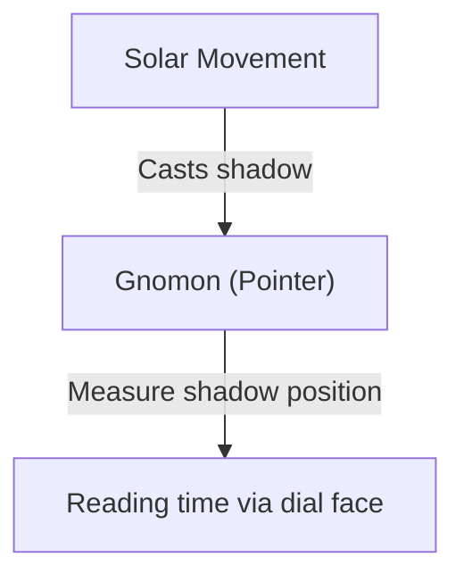
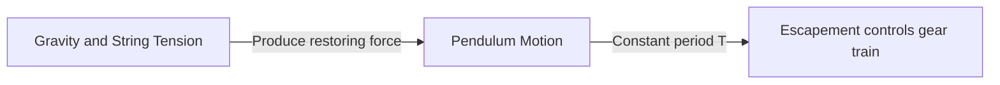
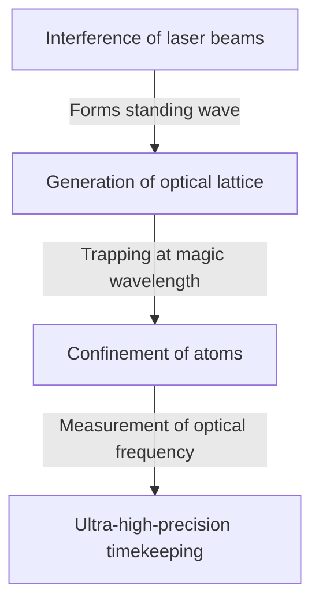

# 1. The Dawn of Timekeeping: From Celestial Bodies to Sundials and Water Clocks

The earliest method humanity used to measure time was observing celestial movements. The sun's culmination, the phases of the moon, and the motion of the stars served as natural clocks to track seasons and the hours of the day.

## The Principle of Sundials
Around 3500 BCE, sundials (obelisks) began to be used in ancient Egypt and Babylonia.
By measuring the length of the shadow cast by a gnomon (pointer), they divided the day into units of time.

# 2. The Birth of Mechanical Clocks and Pendulum Isochronism

In medieval European monasteries, the need to pray at designated hours led to the invention of weight-driven mechanical clocks. However, they were inaccurate by tens of minutes per day.

## Galileo and Huygens
Galileo Galilei is said to have discovered the "isochronism of the pendulum" while watching a swinging chandelier in the Cathedral of Pisa. The period of a pendulum, $T$, is determined by its length $l$ and the gravitational acceleration $g$:

$$ T = 2\pi \sqrt{\frac{l}{g}} $$

In 1656, Christiaan Huygens applied this principle to build the first pendulum clock. This dramatically reduced the error to just tens of seconds per day.

# 3. Marine Chronometers and the Measurement of Longitude

During the Age of Discovery, determining a ship's longitude at sea required an accurate clock. John Harrison solved the longitude problem by developing the spring-driven marine chronometer "H4," which could withstand temperature fluctuations and the rocking motion of ships.

# 4. The Quartz Clock Revolution

In the 20th century, crystal oscillators utilizing the piezoelectric effect (quartz) emerged. Applying a voltage to a quartz crystal resonator causes it to vibrate at a highly stable frequency (typically 32,768 Hz).

$$ f = \frac{1}{2l} \sqrt{\frac{E}{\rho}} $$
($E$ is Young's modulus, $\rho$ is density)

# 5. Atomic Clocks and the Theory of Relativity

To achieve even greater accuracy than quartz, atomic clocks were developed based on transitions between energy levels of atoms. One second is defined as 9,192,631,770 periods of the radiation corresponding to the transition between the two hyperfine levels of the ground state of the caesium-133 atom.

## Einstein's Theory of Relativity and Time Dilation
Atomic clocks aboard GPS satellites require corrections for both special relativity (time dilation due to velocity) and general relativity (time running faster due to weaker gravity).

Time dilation according to special relativity:
$$ \Delta t' = \frac{\Delta t}{\sqrt{1 - \frac{v^2}{c^2}}} $$

# 6. Optical Lattice Clocks: The Future Standard of Time

Today, research is advancing on "optical lattice clocks," which surpass the limits of caesium atomic clocks. Proposed by Professor Hidetoshi Katori and colleagues, this clock traps atoms such as strontium in an optical egg-carton-like grid (an optical lattice) created by laser light, measuring the transitions of tens of thousands of atoms simultaneously.

The precision of optical lattice clocks is so high that they would not gain or lose a single second over the age of the universe (about 13.8 billion years). This unprecedented accuracy enables relativistic geodesy, such as measuring altitude differences down to the centimeter level by detecting differences in gravity.
