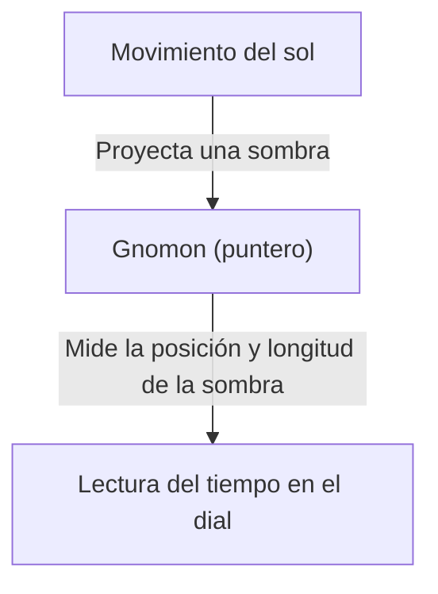
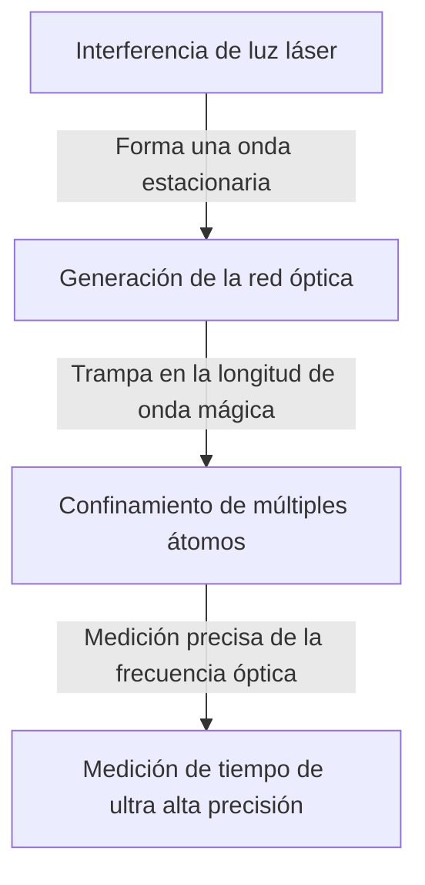

# ¿Qué es el tiempo?: La búsqueda interminable de la humanidad y los relojes

El "tiempo" es uno de los conceptos más familiares pero más misteriosos para nosotros los humanos. El tiempo es invisible e intangible, pero nuestras vidas están completamente dominadas por él. La historia de la humanidad ha sido una serie de desafíos para capturar y medir este "tiempo" con precisión. En este artículo, desentrañaremos en detalle la historia de la medición del tiempo y el desarrollo de la física que hay detrás de ella, desde los antiguos relojes de sol hasta los últimos relojes de red óptica que utilizan tecnología cuántica de vanguardia.

## 1. Los albores de la medición del tiempo: El movimiento de los cuerpos celestes y los ciclos naturales

Los primeros indicadores que la humanidad usó para medir el tiempo fueron los movimientos de cuerpos celestes como el sol, la luna y las estrellas. El movimiento del sol desde el amanecer hasta el atardecer, las fases de la luna y el cambio de las estaciones eran información esencial para la agricultura, la caza y los rituales religiosos.

### El nacimiento del reloj de sol y la clepsidra
Alrededor del 3500 a.C. en el antiguo Egipto y Babilonia, ya se utilizaba el "reloj de sol (obelisco)". Este era un sistema para dividir las horas del día midiendo la longitud y la dirección de la sombra proyectada por un pilar (gnomon) erigido verticalmente en el suelo.

Sin embargo, los relojes de sol tenían el defecto fatal de "no poder usarse de noche o en días nublados". Para compensar esto, se inventaron los "relojes de agua (clepsidra)" y los "relojes de combustión (relojes de vela y relojes de incienso)". Estas herramientas, que medían el tiempo aprovechando la propiedad del agua de gotear a un ritmo constante o la velocidad a la que se queman las cosas, fueron inventos revolucionarios que no se veían afectados por el clima.

## 2. El nacimiento del reloj mecánico y el "isocronismo del péndulo"

Al entrar en la Europa medieval, se inventaron los "relojes mecánicos" impulsados por pesos como alarmas para las oraciones a horas designadas en los monasterios. Los primeros relojes mecánicos usaban un mecanismo llamado escape para controlar la rotación de los engranajes, pero eran susceptibles a la fricción y a los cambios de temperatura, lo que resultaba en errores de decenas de minutos al día.

### El descubrimiento de Galileo y el invento de Huygens
Lo que mejoró drásticamente la precisión de la medición del tiempo fue el descubrimiento del "isocronismo del péndulo" por el físico del siglo XVI, Galileo Galilei. Esta ley, que establece que el tiempo que tarda un péndulo en oscilar hacia adelante y hacia atrás está determinado únicamente por su longitud, independientemente de la amplitud o el peso, cambió enormemente la historia de los relojes. El período $T$ del péndulo se expresa por la longitud $l$ y la aceleración debida a la gravedad $g$ de la siguiente manera:

$$ T = 2\pi \sqrt{\frac{l}{g}} $$

En 1656, el científico holandés Christiaan Huygens aplicó este principio para construir el primer "reloj de péndulo" del mundo. Esto redujo drásticamente el error de los relojes a solo unas pocas docenas de segundos por día.

## 3. La era de los descubrimientos y el problema de la longitud: La trayectoria del cronómetro

Durante la Era de los Descubrimientos en el siglo XVIII, conocer la posición exacta del propio barco (especialmente la longitud) para prevenir accidentes marítimos se convirtió en un problema nacional. Mientras que la latitud se puede medir con relativa facilidad a partir de la altitud del sol o la estrella polar, conocer la longitud con precisión requiere comparar la "hora exacta del punto de partida" con la "hora de la ubicación actual". En otras palabras, se necesitaba un reloj portátil extremadamente preciso que pudiera soportar el balanceo del barco y los drásticos cambios de temperatura.

El relojero inglés John Harrison dedicó su vida a abordar este problema. Completó el "H4", un cronómetro marino que utilizaba un resorte principal y un volante (espiral) en lugar de un péndulo. Esto permitió a la humanidad navegar con seguridad por los océanos del mundo y dio el primer paso hacia la globalización.

## 4. La revolución del reloj de cuarzo: De lo mecánico a lo electrónico

En el siglo XX, la fuente de energía de los relojes pasó de fuentes mecánicas como los resortes principales a la electricidad y los circuitos electrónicos. El golpe decisivo fue la llegada del "reloj de cuarzo".

El oscilador de cristal utiliza el "efecto piezoeléctrico", en el cual el cristal de cuarzo se deforma cuando se le aplica un voltaje, y genera un voltaje cuando se deforma. El oscilador de cristal vibra de manera extremadamente estable a una frecuencia específica (típicamente 32,768 Hz en relojes).

$$ f = \frac{1}{2l} \sqrt{\frac{E}{\rho}} $$
(Donde $E$ es el módulo de Young y $\rho$ es la densidad)

En 1969, la empresa japonesa Seiko lanzó el "Astron", el primer reloj de pulsera de cuarzo comercial del mundo. Esto hizo posible que cualquiera pudiera comprar a un precio asequible un reloj ultrapreciso con un error de menos de 1 segundo por día, provocando un cambio de paradigma en la industria relojera.

## 5. Los relojes atómicos y la teoría de la relatividad: Hacia la verdad del universo

Aunque los relojes de cuarzo son muy precisos, no se pueden evitar pequeños errores debido a las diferencias individuales en los cristales o al deterioro con el tiempo. Por lo tanto, los científicos buscaron un estándar que permaneciera absolutamente inalterado en cualquier parte del universo. Ese fue el "átomo".

Los relojes atómicos se basan en la frecuencia de las microondas absorbidas y emitidas por átomos específicos (principalmente cesio-133). Actualmente, la duración de 1 segundo se define estrictamente como "9,192,631,770 veces el período de la radiación correspondiente a la transición entre dos niveles hiperfinos del estado fundamental del atomo de cesio-133". Esta precisión es asombrosa, con una desviación de solo 1 segundo en decenas de millones de años.

### Corrección mediante la teoría de la relatividad
El GPS (Sistema de Posicionamiento Global), que es indispensable para la vida moderna, depende de la información de tiempo precisa de los relojes atómicos a bordo de los satélites artificiales. Sin embargo, aquí es donde la teoría de la relatividad de Einstein juega un papel importante.

1. **Teoría de la relatividad especial (Dilatación del tiempo debido a la velocidad)**: Los relojes en los satélites que se mueven a altas velocidades marcan el tiempo más lentamente que los relojes en la Tierra.
   $$ \Delta t' = \frac{\Delta t}{\sqrt{1 - \frac{v^2}{c^2}}} $$
2. **Teoría de la relatividad general (Aceleración del tiempo debido a la gravedad)**: Los relojes en los satélites en el espacio exterior, donde la gravedad de la Tierra es más débil, marcan el tiempo más rápido que los relojes en la Tierra.

Si no se calculan estos dos efectos y se corrige constantemente la marcha de los relojes, el error de posicionamiento del GPS alcanzaría varios kilómetros en un solo día. El hecho de que nuestros teléfonos inteligentes puedan mostrar nuestra ubicación exacta se debe a la teoría de la relatividad.

## 6. El reloj de red óptica: La precisión definitiva que abre el futuro

En la actualidad, se están llevando a cabo investigaciones en todo el mundo sobre los "relojes de red óptica", que superan la precisión de los relojes atómicos de cesio en varios órdenes de magnitud. Este reloj innovador fue ideado en 2001 por el profesor Hidetoshi Katori de la Universidad de Tokio y su equipo.

El mecanismo del reloj de red óptica implica atrapar átomos, como el estroncio, en espacios microscópicos (una red óptica, por así decirlo, un cartón de huevos hecho de luz) creados al interferir haces de luz láser, y medir las transiciones de decenas de miles de átomos simultáneamente.

La precisión del reloj de red óptica alcanza "10 a la menos 18", lo que es una precisión tan extrema que no se desviaría ni un segundo incluso si pasara la edad del universo, unos 13.800 millones de años.
Se espera que esta ultra alta precisión se aplique no solo para medir el tiempo, sino también como un sensor para detectar "diferencias en la gravedad debido a la altura (diferencias en cómo avanza el tiempo)". Por ejemplo, al medir los cambios de tiempo causados por una diferencia de elevación de solo unos pocos centímetros, una tecnología geodésica completamente nueva (geodesia relativista) para monitorear movimientos de la corteza, explorar recursos subterráneos y predecir erupciones volcánicas se está volviendo posible.

## Conclusión

La historia de la medición del tiempo por parte de la humanidad comenzó con divisiones aproximadas usando relojes de sol, y fue un viaje de exploración en busca de "períodos" más estables: péndulos, resortes, cuarzo y luego átomos. Y ahora, con la nueva innovación del reloj de red óptica, el tiempo está a punto de evolucionar de algo que simplemente "marca el paso" a algo que "explora" para leer las distorsiones del espacio-tiempo. Detrás de la "hora actual" que consultamos casualmente, se esconde la sabiduría de miles de años de humanidad y el magnífico drama de la física.
