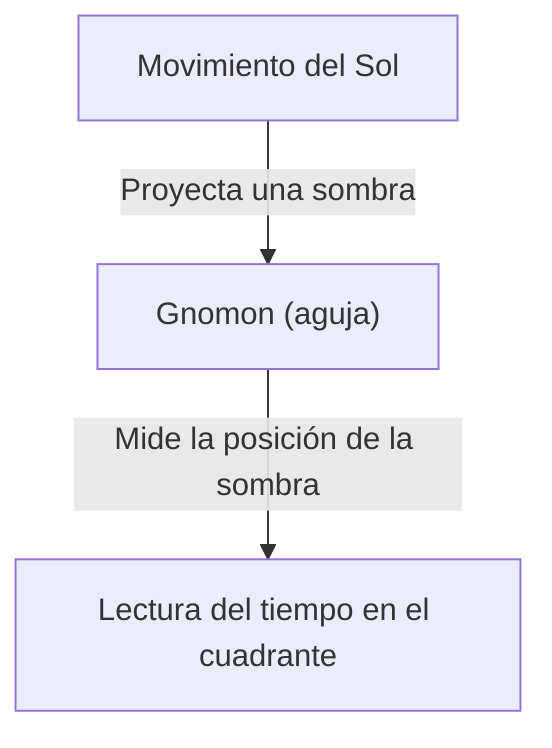
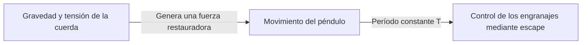
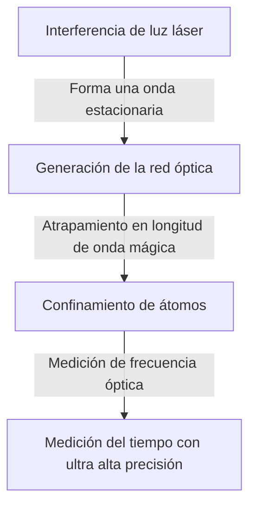

# 1. El amanecer de la medición del tiempo: De los cuerpos celestes a los relojes de sol y de agua

El primer método que empleó la humanidad para medir el tiempo consistió en observar el movimiento de los cuerpos celestes. El paso del sol por el cenit, las fases lunares y el movimiento de las estrellas constituían relojes naturales para conocer las estaciones y las horas del día.

## El principio del reloj de sol
Hacia el 3500 a. C., en el antiguo Egipto y Babilonia comenzaron a utilizarse relojes de sol (obeliscos).
El tiempo se dividía midiendo la longitud de la sombra proyectada por un gnomon (aguja o estilete).

# 2. El nacimiento del reloj mecánico y el isocronismo del péndulo

En los monasterios de la Europa medieval, la necesidad de elevar oraciones a horas determinadas motivó la invención de relojes mecánicos accionados por pesas. Sin embargo, presentaban un error de varias decenas de minutos al día.

## Galileo y Huygens
Se atribuye a Galileo Galilei el descubrimiento del «isocronismo del péndulo» tras observar la oscilación de una lámpara colgante en la catedral de Pisa. El período $T$ de un péndulo está determinado por su longitud $l$ y la aceleración de la gravedad $g$.

$$ T = 2\pi \sqrt{\frac{l}{g}} $$

En 1656, Christiaan Huygens aplicó este principio para construir el primer reloj de péndulo. Gracias a ello, el error diario se redujo drásticamente a solo unas decenas de segundos.

# 3. El cronómetro marino y la medición de la longitud

Durante la era de los grandes descubrimientos de la navegación, para determinar con exactitud la longitud geográfica de un navío en alta mar era imprescindible contar con un reloj muy preciso. John Harrison resolvió el problema de la longitud al crear el cronómetro marino con mecanismo de muelle «H4», capaz de soportar las variaciones térmicas y el balanceo del barco.

# 4. La revolución del reloj de cuarzo

Al llegar el siglo XX, surgieron los osciladores de cuarzo basados en el efecto piezoeléctrico. Al aplicar una diferencia de potencial a un resonador de cuarzo, este oscila a una frecuencia sumamente estable (habitualmente 32.768 Hz).

$$ f = \frac{1}{2l} \sqrt{\frac{E}{\rho}} $$
($E$ es el módulo de Young, $\rho$ es la densidad)

# 5. El reloj atómico y la teoría de la relatividad

Como instrumentos todavía más precisos que el cuarzo, se desarrollaron los relojes atómicos, que aprovechan las transiciones entre niveles de energía de los átomos. Un segundo se define oficialmente como la duración de 9.192.631.770 períodos de la radiación correspondiente a la transición entre los dos niveles hiperfinos del estado fundamental del átomo de cesio-133.

## La teoría de la relatividad de Einstein y la dilatación del tiempo
Los relojes atómicos a bordo de los satélites GPS precisan correcciones tanto por la relatividad especial (dilatación del tiempo debida a la velocidad) como por la relatividad general (avance más rápido del tiempo por la menor intensidad del campo gravitatorio).

Dilatación del tiempo según la relatividad especial:
$$ \Delta t' = \frac{\Delta t}{\sqrt{1 - \frac{v^2}{c^2}}} $$

# 6. El reloj de red óptica: El futuro estándar del tiempo

En la actualidad, se desarrolla activamente la investigación sobre los «relojes de red óptica», destinados a superar los límites del reloj atómico de cesio. Diseñado por el equipo del profesor Hidetoshi Katori, este reloj confina átomos (como el estroncio) en una estructura óptica formada por láser similar a un cartón de huevos (red óptica), midiendo simultáneamente las transiciones de decenas de miles de átomos.

La precisión del reloj de red óptica es tan extraordinaria que no presentaría una desviación de un segundo ni siquiera tras la edad total del universo (aproximadamente 13.800 millones de años). Esto hace posible la geodesia relativista (por ejemplo, medir variaciones de altitud a nivel de centímetros a partir de las diferencias gravitatorias asociadas a la cota).
