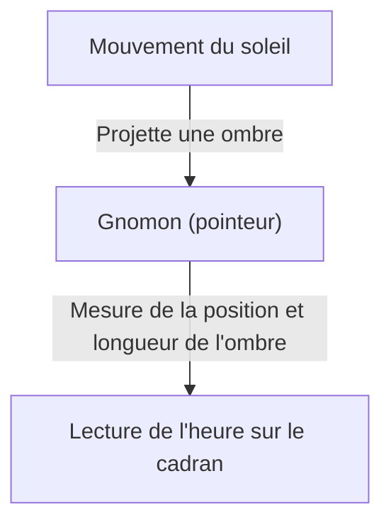
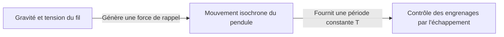
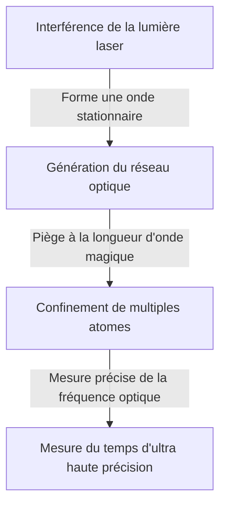

# Qu'est-ce que le temps ? : La quête interminable de l'humanité et des horloges

Le « temps » est l'un des concepts les plus familiers mais aussi les plus mystérieux pour nous, les humains. Le temps est invisible et intangible, mais nos vies sont complètement dominées par le temps. L'histoire de l'humanité a été une série de défis pour capturer et mesurer ce « temps » avec précision. Dans cet article, nous démêlerons en détail l'histoire de la mesure du temps et le développement de la physique qui l'accompagne, des anciens cadrans solaires jusqu'aux horloges à réseau optique de pointe utilisant la technologie quantique.

## 1. Les débuts de la mesure du temps : Les mouvements célestes et les cycles naturels

Le premier indicateur utilisé par l'humanité pour mesurer le temps fut le mouvement des corps célestes tels que le soleil, la lune et les étoiles. Le mouvement du soleil de l'aube au crépuscule, les phases de la lune et les changements de saisons étaient des informations essentielles pour l'agriculture, la chasse et les rituels religieux.

### La naissance du cadran solaire et de la clepsydre
Vers 3500 av. J.-C. dans l'Égypte ancienne et en Babylonie, le « cadran solaire (obélisque) » était déjà utilisé. Il s'agissait d'un système pour diviser les heures de la journée en mesurant la longueur et la direction de l'ombre d'un pilier (gnomon) érigé verticalement sur le sol.

Cependant, le cadran solaire présentait le défaut fatal de « ne pas pouvoir être utilisé la nuit ou par temps couvert ». Pour pallier cela, on inventa la « clepsydre (horloge à eau) » et les « horloges à combustion (horloges à bougie et à encens) ». Ces outils, qui mesuraient le temps en utilisant la propriété de l'eau de s'écouler à un rythme constant ou la vitesse de combustion des objets, étaient des inventions révolutionnaires insensibles aux conditions météorologiques.

## 2. La naissance de l'horloge mécanique et « l'isochronisme du pendule »

En Europe, au Moyen Âge, on a inventé des « horloges mécaniques » actionnées par des poids, qui servaient d'alarmes pour les prières à des heures précises dans les monastères. Les premières horloges mécaniques utilisaient un mécanisme appelé échappement pour contrôler la rotation des engrenages, mais elles étaient sensibles aux frottements et aux changements de température, ce qui entraînait des erreurs de plusieurs dizaines de minutes par jour.

### La découverte de Galilée et l'invention de Huygens
Ce qui a considérablement amélioré la précision de la mesure du temps, c'est la découverte de « l'isochronisme du pendule » par le physicien du XVIe siècle Galileo Galilei. Cette loi, qui stipule que le temps mis par un pendule pour osciller est déterminé uniquement par la longueur du pendule, indépendamment de son amplitude ou de son poids, a grandement changé l'histoire des horloges. La période $T$ du pendule est exprimée par la longueur $l$ et l'accélération de la pesanteur $g$ de la manière suivante :

$$ T = 2\pi \sqrt{\frac{l}{g}} $$

En 1656, le scientifique néerlandais Christiaan Huygens a appliqué ce principe pour construire la première « horloge à pendule » au monde. Grâce à cela, l'erreur des horloges a été drastiquement réduite à quelques dizaines de secondes par jour.

## 3. L'ère des grandes découvertes et le problème de la longitude : La trajectoire du chronomètre

Au XVIIIe siècle, pendant l'ère des grandes découvertes, connaître la position exacte de son propre navire (en particulier la longitude) pour prévenir les accidents maritimes est devenu un enjeu national. Si la latitude peut être mesurée relativement facilement à partir de l'altitude du soleil ou de l'étoile polaire, connaître la longitude avec précision nécessite de comparer « l'heure exacte du point de départ » avec « l'heure de la position actuelle ». En d'autres termes, il fallait une horloge portable extrêmement précise, capable de résister aux mouvements du navire et aux changements brusques de température.

L'horloger anglais John Harrison a consacré sa vie à résoudre ce problème. Il a achevé le « H4 », un chronomètre de marine qui utilisait un ressort moteur et un balancier-spiral au lieu d'un pendule. Cela a permis à l'humanité de naviguer en toute sécurité sur les mers du monde entier et a marqué le premier pas vers la mondialisation.

## 4. La révolution de l'horloge à quartz : De la mécanique à l'électronique

Au XXe siècle, la source d'énergie des horloges est passée d'éléments mécaniques comme les ressorts à l'électricité et aux circuits électroniques. Le coup décisif a été l'apparition de l'« horloge à quartz ».

L'oscillateur à cristal utilise « l'effet piézoélectrique », où un cristal de quartz se déforme lorsqu'une tension lui est appliquée, et génère une tension lorsqu'il est déformé. L'oscillateur à cristal vibre de manière extrêmement stable à une fréquence spécifique (généralement 32 768 Hz pour les horloges).

$$ f = \frac{1}{2l} \sqrt{\frac{E}{\rho}} $$
(où $E$ est le module de Young et $\rho$ est la densité)

En 1969, l'entreprise japonaise Seiko a lancé l'« Astron », la première montre-bracelet à quartz commerciale au monde. Cela a permis à quiconque d'acquérir à un prix abordable une montre ultra-précise avec une erreur de moins d'une seconde par jour, provoquant un changement de paradigme dans l'industrie horlogère.

## 5. Les horloges atomiques et la théorie de la relativité : Vers la vérité de l'univers

Bien que les horloges à quartz soient très précises, de petites erreurs dues aux différences individuelles des cristaux ou à leur détérioration au fil du temps sont inévitables. Par conséquent, les scientifiques ont cherché une norme qui resterait absolument inchangée partout dans l'univers. C'est l'« atome ».

Les horloges atomiques sont basées sur la fréquence des micro-ondes absorbées et émises par des atomes spécifiques (principalement le césium 133). Actuellement, la durée d'une seconde est strictement définie comme « 9 192 631 770 fois la période du rayonnement correspondant à la transition entre les deux niveaux hyperfins de l'état fondamental de l'atome de césium 133 ». Cette précision est stupéfiante, avec un écart de seulement 1 seconde en des dizaines de millions d'années.

### Correction par la théorie de la relativité
Le GPS (Global Positioning System), indispensable à la vie moderne, dépend des informations temporelles précises des horloges atomiques à bord des satellites artificiels. Cependant, c'est ici que la théorie de la relativité d'Einstein joue un rôle important.

1. **Théorie de la relativité restreinte (Dilatation du temps due à la vitesse)** : Les horloges des satellites se déplaçant à grande vitesse avancent plus lentement que les horloges sur Terre.
   $$ \Delta t' = \frac{\Delta t}{\sqrt{1 - \frac{v^2}{c^2}}} $$
2. **Théorie de la relativité générale (Avancement du temps dû à la gravité)** : Les horloges des satellites dans l'espace, où la gravité terrestre est plus faible, avancent plus rapidement que les horloges sur Terre.

Si l'on ne calcule pas ces deux effets et que l'on ne corrige pas constamment la marche de l'horloge, l'erreur de positionnement du GPS atteindrait plusieurs kilomètres en une seule journée. C'est grâce à la théorie de la relativité que nos smartphones peuvent indiquer notre position exacte.

## 6. L'horloge à réseau optique : La précision ultime pour ouvrir l'avenir

Actuellement, des recherches sont menées dans le monde entier sur les « horloges à réseau optique », qui dépassent la précision des horloges atomiques au césium de plusieurs ordres de grandeur. Cette horloge révolutionnaire a été conçue en 2001 par le professeur Hidetoshi Katori de l'Université de Tokyo et son équipe.

Le mécanisme de l'horloge à réseau optique consiste à piéger des atomes, tels que le strontium, dans des espaces microscopiques (un réseau optique, pour ainsi dire une boîte à œufs faite de lumière) créés par l'interférence de faisceaux laser, et à mesurer simultanément les transitions de dizaines de milliers d'atomes.

La précision de l'horloge à réseau optique atteint « 10 à la puissance moins 18 », ce qui est une précision si ultime qu'elle ne dévierait pas d'une seule seconde même après l'âge de l'univers, soit environ 13,8 milliards d'années.
Cette ultra-haute précision devrait trouver des applications non seulement pour mesurer le temps, mais aussi comme capteur pour détecter « les différences de gravité dues à la hauteur (différences dans l'écoulement du temps) ». Par exemple, en mesurant le décalage temporel causé par une différence d'altitude de seulement quelques centimètres, une toute nouvelle technologie géodésique (géodésie relativiste) pour surveiller les mouvements de la croûte terrestre, explorer les ressources souterraines et prévoir les éruptions volcaniques est en train de devenir possible.

## Conclusion

L'histoire de la mesure du temps par l'humanité a commencé par des divisions approximatives à l'aide de cadrans solaires, et a été un voyage d'exploration à la recherche de « périodes » plus stables : pendules, ressorts, quartz, puis atomes. Et maintenant, avec la nouvelle innovation qu'est l'horloge à réseau optique, le temps est sur le point d'évoluer de quelque chose qui simplement « s'écoule » vers quelque chose que l'on « explore » pour lire les distorsions de l'espace-temps. Derrière « l'heure actuelle » que nous vérifions nonchalamment se cachent des milliers d'années de sagesse humaine et le drame grandiose de la physique.
