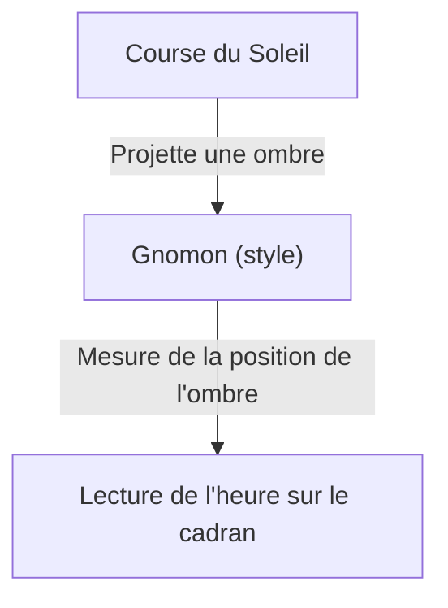
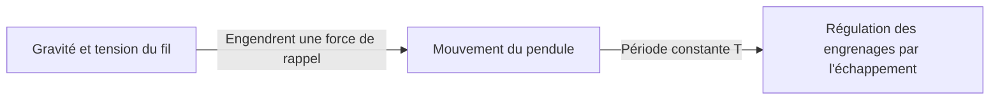
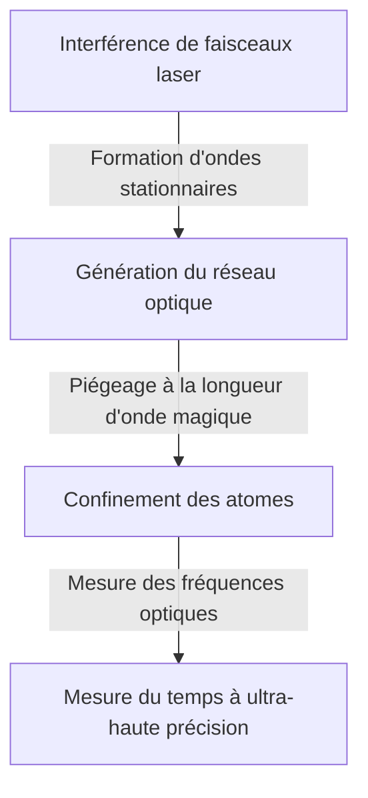

# 1. L'aube de la mesure du temps : des corps célestes aux cadrans solaires et horloges à eau

Le premier moyen par lequel l'humanité a commencé à mesurer le temps fut l'observation des mouvements célestes. Le passage du Soleil au méridien, les phases de la Lune et la course des étoiles constituaient des horloges naturelles pour appréhender les saisons et le rythme de la journée.

## Le principe du cadran solaire
Vers 3500 avant J.-C., des cadrans solaires (obélisques) ont commencé à être utilisés en Égypte ancienne et en Babylonie.
En mesurant la longueur et la direction de l'ombre portée par un gnomon (style), on divisait la journée en intervalles de temps.

# 2. Naissance de l'horloge mécanique et isochronisme du pendule

Dans les monastères de l'Europe médiévale, où il était indispensable de prier à des heures fixes, des horloges mécaniques mues par des poids ont été inventées. Cependant, elles accumulaient une dérive de plusieurs dizaines de minutes par jour.

## Galilée et Huygens
Galilée (Galileo Galilei) aurait découvert « l'isochronisme du pendule » en observant les oscillations d'un lustre dans la cathédrale de Pise. La période $T$ d'un pendule dépend de sa longueur $l$ et de l'accélération de la pesanteur $g$ :

$$ T = 2\pi \sqrt{\frac{l}{g}} $$

En 1656, Christiaan Huygens appliqua ce principe pour concevoir la première horloge à pendule. Grâce à cette invention, l'erreur quotidienne chuta de façon spectaculaire à quelques dizaines de secondes par jour.

# 3. Le chronomètre de marine et la mesure de la longitude

À l'époque des Grandes Découvertes, une horloge d'une extrême précision était indispensable pour déterminer la longitude d'un navire en mer. John Harrison résolut le problème de la longitude en mettant au point le « H4 », un chronomètre de marine à ressort capable de résister aux variations thermiques et au roulis des navires.

# 4. La révolution de la montre à quartz

Au XXe siècle apparaît l'oscillateur à quartz exploitant l'effet piézoélectrique. Lorsqu'une tension électrique est appliquée à un résonateur en cristal de quartz, celui-ci vibre à une fréquence d'une remarquable stabilité (habituellement 32 768 Hz).

$$ f = \frac{1}{2l} \sqrt{\frac{E}{\rho}} $$
($E$ étant le module d'Young et $\rho$ la masse volumique)

# 5. Horloges atomiques et théorie de la relativité

Pour surpasser encore la précision du quartz, les horloges atomiques exploitant les transitions entre niveaux d'énergie atomiques ont été créées. La seconde est définie comme la durée de 9 192 631 770 périodes de la radiation correspondant à la transition entre les deux niveaux hyperfins de l'état fondamental de l'atome de césium 133.

## La théorie de la relativité d'Einstein et la dilatation du temps
Les horloges atomiques embarquées à bord des satellites GPS doivent intégrer des corrections issues de la relativité restreinte (ralentissement du temps dû à la vitesse) et de la relativité générale (accélération du temps due à une gravité plus faible).

Dilatation du temps selon la relativité restreinte :
$$ \Delta t' = \frac{\Delta t}{\sqrt{1 - \frac{v^2}{c^2}}} $$

# 6. L'horloge à réseau optique : le futur étalon du temps

Aujourd'hui, les recherches progressent sur « l'horloge à réseau optique », appelée à dépasser les limites des horloges atomiques au césium. Imaginée par l'équipe du professeur Hidetoshi Katori, cette horloge piège des atomes (comme le strontium) dans une boîte d'œufs lumineuse (le réseau optique) créée par des faisceaux laser, permettant de mesurer simultanément la transition de plusieurs dizaines de milliers d'atomes.

La précision de l'horloge à réseau optique est telle qu'elle ne dériverait pas d'une seule seconde sur une durée équivalente à l'âge de l'Univers (environ 13,8 milliards d'années). Elle ouvre ainsi la voie à la géodésie relativiste (permettant par exemple de mesurer des dénivelés de l'ordre du centimètre à partir des infimes variations de la pesanteur).
