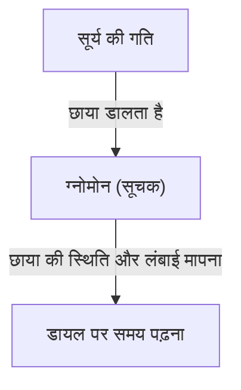
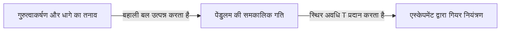
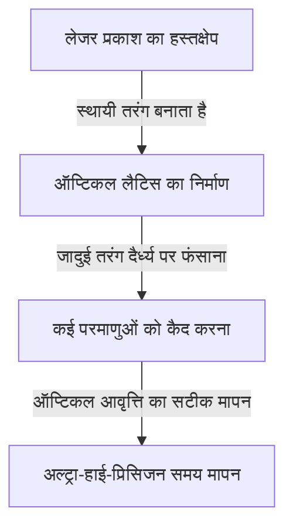

# समय क्या है: मानवता और घड़ियों की अंतहीन खोज

"समय" हम इंसानों के लिए सबसे परिचित लेकिन सबसे रहस्यमय अवधारणाओं में से एक है। समय अदृश्य और अमूर्त है, लेकिन हमारा जीवन पूरी तरह से समय के नियंत्रण में है। मानवता का इतिहास इस "समय" को सटीक रूप से पकड़ने और मापने की चुनौतियों की एक श्रृंखला रहा है। इस लेख में, हम प्राचीन धूपघड़ियों से लेकर नवीनतम क्वांटम तकनीक का उपयोग करने वाली ऑप्टिकल लैटिस घड़ियों तक, समय मापन के इतिहास और इसके पीछे भौतिकी के विकास को विस्तार से उजागर करेंगे।

## 1. समय मापन की शुरुआत: खगोलीय पिंडों की गति और प्राकृतिक चक्र

मानवता ने समय मापने के लिए सूर्य, चंद्रमा और तारों जैसे खगोलीय पिंडों की गति को अपने पहले संकेतक के रूप में इस्तेमाल किया। सूर्योदय से सूर्यास्त तक सूर्य की गति, चंद्रमा की कलाएं और बदलते मौसम कृषि, शिकार और धार्मिक अनुष्ठानों के लिए आवश्यक जानकारी थे।

### धूपघड़ी और जलघड़ी का जन्म
3500 ईसा पूर्व के आसपास प्राचीन मिस्र और बेबीलोनिया में "धूपघड़ी (ओबिलिस्क)" का उपयोग पहले से ही किया जा रहा था। यह जमीन पर लंबवत खड़े एक खंभे (ग्नोमोन) की छाया की लंबाई और दिशा को मापकर दिन के समय को विभाजित करने की एक प्रणाली थी।

हालांकि, धूपघड़ियों में "रात में या बादल वाले दिनों में उपयोग न कर पाने" की बड़ी खामी थी। इसकी भरपाई के लिए "जलघड़ी (क्लीप्सिड्रा)" और "दहन घड़ियों (मोमबत्ती घड़ियां और अगरबत्ती घड़ियां)" का आविष्कार किया गया। ये उपकरण, जो पानी की स्थिर गति से टपकने या चीजों के जलने की गति का उपयोग करके समय मापते थे, ऐसे क्रांतिकारी आविष्कार थे जो मौसम से प्रभावित नहीं होते थे।

## 2. यांत्रिक घड़ियों का जन्म और "पेंडुलम की समकालिकता"

मध्ययुगीन यूरोप में, वजन से चलने वाली "यांत्रिक घड़ियों" का आविष्कार मठों में निर्धारित समय पर प्रार्थना के लिए अलार्म के रूप में किया गया था। शुरुआती यांत्रिक घड़ियां गियर के घुमाव को नियंत्रित करने के लिए एस्केपमेंट नामक तंत्र का उपयोग करती थीं, लेकिन वे घर्षण और तापमान में बदलाव के प्रति संवेदनशील थीं, जिसके कारण दिन में कई दसियों मिनट की त्रुटि होती थी।

### गैलीलियो की खोज और ह्यूजेंस का आविष्कार
समय मापन की सटीकता में नाटकीय सुधार 16वीं सदी के भौतिक विज्ञानी गैलीलियो गैलीली द्वारा "पेंडुलम की समकालिकता (आइसोक्रोनिज़्म)" की खोज से हुआ। यह नियम, जो बताता है कि पेंडुलम के आगे-पीछे झूलने में लगने वाला समय केवल पेंडुलम की लंबाई से निर्धारित होता है, चाहे आयाम या वजन कुछ भी हो, इसने घड़ियों के इतिहास को बहुत बदल दिया। पेंडुलम की अवधि $T$ लंबाई $l$ और गुरुत्वाकर्षण के कारण त्वरण $g$ द्वारा इस प्रकार व्यक्त की जाती है:

$$ T = 2\pi \sqrt{\frac{l}{g}} $$

1656 में, डच वैज्ञानिक क्रिस्टियान ह्यूजेंस ने इस सिद्धांत को लागू करके दुनिया की पहली "पेंडुलम घड़ी" बनाई। इससे घड़ियों की त्रुटि काफी कम होकर दिन में केवल कुछ दर्जन सेकंड रह गई।

## 3. खोज का युग और देशांतर की समस्या: क्रोनोमीटर का प्रक्षेपवक्र

18वीं सदी में खोज के युग के दौरान, समुद्री दुर्घटनाओं को रोकने के लिए अपने जहाज की सटीक स्थिति (विशेष रूप से देशांतर) जानना एक राष्ट्रीय मुद्दा बन गया। जबकि अक्षांश को सूर्य या ध्रुव तारे की ऊंचाई से अपेक्षाकृत आसानी से मापा जा सकता है, देशांतर को सटीक रूप से जानने के लिए "प्रस्थान बिंदु के सटीक समय" और "वर्तमान स्थान के समय" की तुलना करने की आवश्यकता होती है। दूसरे शब्दों में, एक अत्यंत सटीक पोर्टेबल घड़ी की आवश्यकता थी जो जहाज के हिलने-डुलने और कठोर तापमान परिवर्तन को सहन कर सके।

अंग्रेजी घड़ीसाज़ जॉन हैरिसन ने इस समस्या को हल करने के लिए अपना जीवन समर्पित कर दिया। उन्होंने "H4" पूरा किया, जो एक समुद्री क्रोनोमीटर था जिसमें पेंडुलम के बजाय मेनस्प्रिंग और बैलेंस व्हील (हेयरस्प्रिंग) का उपयोग किया गया था। इससे मानवता के लिए दुनिया के महासागरों को सुरक्षित रूप से नेविगेट करना संभव हो गया और वैश्वीकरण की दिशा में पहला कदम उठाया गया।

## 4. क्वार्ट्ज घड़ी की क्रांति: यांत्रिक से इलेक्ट्रॉनिक तक

20वीं सदी में, घड़ियों का ऊर्जा स्रोत यांत्रिक चीजों जैसे मेनस्प्रिंग से हटकर बिजली और इलेक्ट्रॉनिक सर्किट में बदल गया। इसका निर्णायक कदम "क्वार्ट्ज (स्फटिक) घड़ी" का आगमन था।

क्रिस्टल ऑसिलेटर "पीजोइलेक्ट्रिक प्रभाव" का उपयोग करता है, जिसमें वोल्टेज लागू होने पर क्वार्ट्ज क्रिस्टल विकृत हो जाता है, और विकृत होने पर वोल्टेज उत्पन्न करता है। क्रिस्टल ऑसिलेटर एक विशिष्ट आवृत्ति (घड़ियों में आमतौर पर 32,768 हर्ट्ज) पर अत्यंत स्थिरता से कंपन करता है।

$$ f = \frac{1}{2l} \sqrt{\frac{E}{\rho}} $$
(जहाँ $E$ यंग का मापांक है, और $\rho$ घनत्व है)

1969 में, जापान की सेको ने दुनिया की पहली व्यावसायिक क्वार्ट्ज कलाई घड़ी "एस्ट्रोन" लॉन्च की। इसने किसी के लिए भी एक दिन में 1 सेकंड से कम की त्रुटि वाली अल्ट्रा-सटीक घड़ी सस्ते में प्राप्त करना संभव बना दिया, जिससे घड़ी उद्योग में एक आदर्श बदलाव आया।

## 5. परमाणु घड़ियां और सापेक्षता का सिद्धांत: ब्रह्मांड के सत्य की ओर

हालांकि क्वार्ट्ज घड़ियां बहुत सटीक होती हैं, लेकिन क्रिस्टल में व्यक्तिगत अंतर या समय के साथ गिरावट के कारण होने वाली छोटी त्रुटियों से बचा नहीं जा सकता है। इसलिए वैज्ञानिकों ने एक ऐसे मानक की खोज की जो ब्रह्मांड में कहीं भी बिल्कुल न बदले। वह "परमाणु" था।

परमाणु घड़ियां विशिष्ट परमाणुओं (मुख्य रूप से सीज़ियम-133) द्वारा अवशोषित और उत्सर्जित माइक्रोवेव की आवृत्ति पर आधारित होती हैं। वर्तमान में, 1 सेकंड की लंबाई को "सीज़ियम-133 परमाणु के ग्राउंड स्टेट के दो अतिसूक्ष्म ऊर्जा स्तरों के बीच संक्रमण के अनुरूप विकिरण की अवधि के 9,192,631,770 गुना" के रूप में कड़ाई से परिभाषित किया गया है। यह सटीकता आश्चर्यजनक है, जो करोड़ों वर्षों में केवल 1 सेकंड ही विचलित होती है।

### सापेक्षता के सिद्धांत द्वारा सुधार
आधुनिक जीवन के लिए अपरिहार्य GPS (ग्लोबल पोजिशनिंग सिस्टम) कृत्रिम उपग्रहों पर मौजूद परमाणु घड़ियों की सटीक समय जानकारी पर निर्भर करता है। हालांकि, यहीं पर आइंस्टीन का सापेक्षता का सिद्धांत एक महत्वपूर्ण भूमिका निभाता है।

1. **विशेष सापेक्षता का सिद्धांत (गति के कारण समय का फैलाव)**: तेज गति से चलने वाले उपग्रहों की घड़ियां पृथ्वी पर मौजूद घड़ियों की तुलना में धीमी चलती हैं।
   $$ \Delta t' = \frac{\Delta t}{\sqrt{1 - \frac{v^2}{c^2}}} $$
2. **सामान्य सापेक्षता का सिद्धांत (गुरुत्वाकर्षण के कारण समय का आगे बढ़ना)**: अंतरिक्ष में उपग्रहों की घड़ियां, जहां पृथ्वी का गुरुत्वाकर्षण कमजोर है, पृथ्वी पर मौजूद घड़ियों की तुलना में तेज चलती हैं।

यदि इन दोनों प्रभावों की गणना नहीं की जाती है और घड़ी की गति को लगातार सुधारा नहीं जाता है, तो GPS की स्थिति त्रुटि एक ही दिन में कई किलोमीटर तक पहुँच जाएगी। यह सापेक्षता के सिद्धांत की बदौलत ही है कि हमारे स्मार्टफोन सटीक स्थान दिखा पाते हैं।

## 6. ऑप्टिकल लैटिस घड़ी: भविष्य को खोलने वाली अंतिम सटीकता

वर्तमान में, दुनिया भर में "ऑप्टिकल लैटिस घड़ियों" पर शोध चल रहा है, जो सीज़ियम परमाणु घड़ियों की सटीकता को कई गुना पीछे छोड़ देती हैं। इस क्रांतिकारी घड़ी की कल्पना 2001 में टोक्यो विश्वविद्यालय के प्रोफेसर हिदेतोशी कटोरी और उनकी टीम ने की थी।

ऑप्टिकल लैटिस घड़ी का तंत्र स्ट्रोंटियम जैसे परमाणुओं को लेजर प्रकाश के हस्तक्षेप से बनाए गए सूक्ष्म स्थानों (ऑप्टिकल लैटिस, मान लीजिए प्रकाश से बना एक अंडे का डिब्बा) में फंसाना और एक साथ हजारों परमाणुओं के संक्रमण को मापना है।

ऑप्टिकल लैटिस घड़ी की सटीकता "10 की घात माइनस 18" तक पहुँच जाती है, जो इतनी चरम सटीकता है कि यदि ब्रह्मांड की आयु, लगभग 13.8 बिलियन वर्ष भी बीत जाए, तो भी यह 1 सेकंड नहीं भटकेगी।
इस अति-उच्च सटीकता के केवल समय मापने के लिए ही नहीं, बल्कि "ऊंचाई के कारण गुरुत्वाकर्षण में अंतर (समय के बीतने के तरीके में अंतर)" का पता लगाने वाले सेंसर के रूप में भी लागू होने की उम्मीद है। उदाहरण के लिए, केवल कुछ सेंटीमीटर की ऊंचाई के अंतर के कारण होने वाले समय के बदलाव को मापकर, क्रस्टल गतिविधियों की निगरानी, भूमिगत संसाधनों की खोज और ज्वालामुखी विस्फोट की भविष्यवाणी जैसी पूरी तरह से नई जियोडेटिक तकनीक (सापेक्षतावादी जियोडेसी) संभव हो रही है।

## निष्कर्ष

मानवता के समय मापन का इतिहास धूपघड़ियों का उपयोग करके मोटे विभाजनों के साथ शुरू हुआ, और यह अधिक स्थिर "अवधि" की तलाश में अन्वेषण की एक यात्रा थी: पेंडुलम, स्प्रिंग्स, क्वार्ट्ज और फिर परमाणु। और अब, ऑप्टिकल लैटिस घड़ी के नए नवाचार के साथ, समय केवल "टिक-टिक करने" वाली चीज से विकसित होकर अंतरिक्ष-समय की विकृतियों को पढ़ने के लिए "अन्वेषण" करने वाली चीज बनने के कगार पर है। जिस "वर्तमान समय" को हम यूं ही देख लेते हैं, उसके पीछे मानवता की हजारों वर्षों की बुद्धिमत्ता और भौतिकी का एक शानदार नाटक छिपा है।
