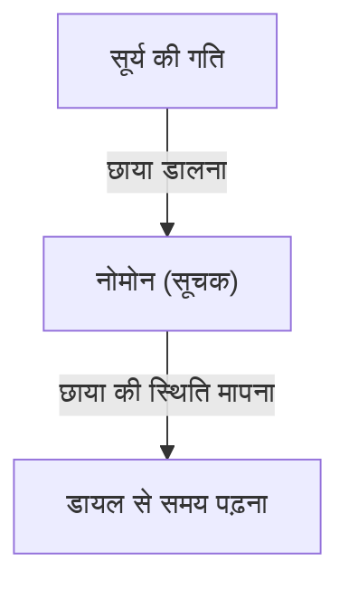
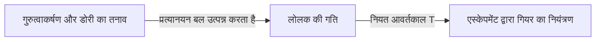
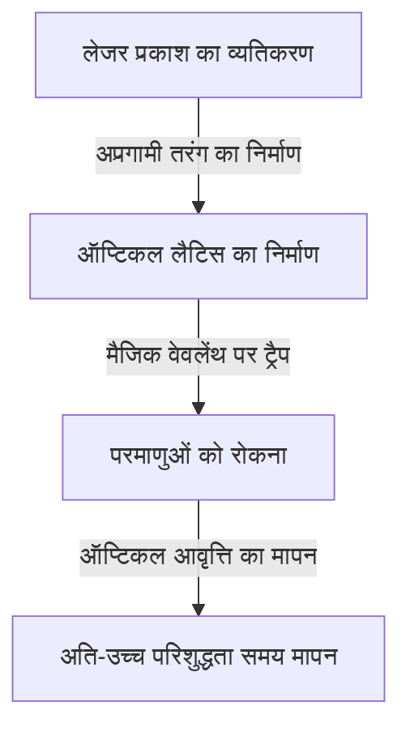

# 1. समय मापन का प्रारंभिक युग: खगोलीय पिंडों से धूपघड़ी और जल घड़ी तक

मानव जाति द्वारा समय मापने का पहला साधन खगोलीय पिंडों की गति का अवलोकन करना था। सूर्य का मध्याह्न, चंद्रमा की कलाएं और तारों की गति, मौसम और दिन के समय को जानने के लिए प्राकृतिक घड़ियाँ थीं।

## धूपघड़ी का सिद्धांत
लगभग 3500 ईसा पूर्व में, प्राचीन मिस्र और बेबीलोनिया में धूपघड़ियों (ओबिलिस्क) का उपयोग शुरू हुआ था।
नोमोन (सूचक) की छाया की लंबाई को मापकर, समय को विभाजित किया जाता था।

# 2. यांत्रिक घड़ियों का जन्म और लोलक की समकालिकता

मध्यकालीन यूरोपीय मठों में, एक निश्चित समय पर प्रार्थना करना आवश्यक था, जिसके लिए भार (वजन) द्वारा संचालित यांत्रिक घड़ियों का आविष्कार किया गया था। हालाँकि, इनमें प्रतिदिन कई दसियों मिनटों की त्रुटि होती थी।

## गैलीलियो और हाइगेंस
माना जाता है कि गैलीलियो गैलीली ने पीसा के कैथेड्रल में झूलते हुए झूमर को देखकर "लोलक की समकालिकता" की खोज की थी। लोलक का आवर्तकाल $T$, लंबाई $l$ और गुरुत्वीय त्वरण $g$ द्वारा निर्धारित होता है।

$$ T = 2\pi \sqrt{\frac{l}{g}} $$

1656 में, क्रिस्टियान हाइगेंस ने इस सिद्धांत को लागू किया और पहली लोलक घड़ी का निर्माण किया। इससे प्रतिदिन की त्रुटि घटकर कुछ दसियों सेकंड रह गई।

# 3. समुद्री क्रोनोमीटर और देशांतर का मापन

महान अन्वेषण युग के दौरान, समुद्र में अपने जहाज के देशांतर को सटीक रूप से जानने के लिए एक सटीक घड़ी की आवश्यकता थी। जॉन हैरिसन ने तापमान परिवर्तन और जहाज के हिलने-डुलने को सहन करने वाला स्प्रिंग-चालित समुद्री क्रोनोमीटर "H4" विकसित किया और देशांतर की समस्या का समाधान किया।

# 4. क्वार्ट्ज घड़ियों की क्रांति

20वीं सदी में, पीजोइलेक्ट्रिक प्रभाव का उपयोग करने वाले क्वार्ट्ज ऑसिलेटर (क्वार्ट्ज) सामने आए। जब क्वार्ट्ज क्रिस्टल पर वोल्टेज लगाया जाता है, तो यह अत्यधिक स्थिर आवृत्ति (आमतौर पर 32,768 Hz) पर कंपन करता है।

$$ f = \frac{1}{2l} \sqrt{\frac{E}{\rho}} $$
($E$ यंग मापांक है, $\rho$ घनत्व है)

# 5. परमाणु घड़ियाँ और सापेक्षता का सिद्धांत

क्वार्ट्ज से भी अधिक सटीक घड़ी के रूप में, परमाणुओं के ऊर्जा स्तर के संक्रमण का उपयोग करने वाली परमाणु घड़ियों का विकास किया गया। सीज़ियम-133 परमाणु की मूल अवस्था के दो अतिसूक्ष्म स्तरों के बीच संक्रमण के अनुरूप विकिरण की 9,192,631,770 अवधियों को 1 सेकंड के रूप में परिभाषित किया गया है।

## आइंस्टीन का सापेक्षता का सिद्धांत और समय फैलाव
जीपीएस (GPS) उपग्रहों पर स्थापित परमाणु घड़ियों के लिए विशेष सापेक्षता (गति के कारण समय का धीमा होना) और सामान्य सापेक्षता (गुरुत्वाकर्षण के कारण समय का तेज़ होना) के सुधार की आवश्यकता होती है।

विशेष सापेक्षता के अनुसार समय फैलाव:
$$ \Delta t' = \frac{\Delta t}{\sqrt{1 - \frac{v^2}{c^2}}} $$

# 6. ऑप्टिकल लैटिस क्लॉक: भविष्य का समय मानक

वर्तमान में, सीज़ियम परमाणु घड़ियों की सीमाओं से परे जाने वाली "ऑप्टिकल लैटिस क्लॉक" पर शोध चल रहा है। प्रोफेसर हिदेतोशी कातोरी और उनके सहयोगियों द्वारा तैयार की गई यह घड़ी, लेजर द्वारा निर्मित प्रकाश के अंडे के कार्टन जैसी जाली (ऑप्टिकल लैटिस) में स्ट्रोंशियम जैसे परमाणुओं को फंसाती है और एक साथ हजारों परमाणुओं के संक्रमण को मापती है।

ऑप्टिकल लैटिस क्लॉक की सटीकता इतनी अधिक है कि ब्रह्मांड की आयु (लगभग 13.8 अरब वर्ष) बीत जाने के बाद भी इसमें 1 सेकंड का भी अंतर नहीं आएगा, जिससे सापेक्षतावादी भूगणित (ऊंचाई के कारण गुरुत्वाकर्षण में अंतर से कुछ सेंटीमीटर के स्तर तक ऊंचाई मापना आदि) संभव हो गया है।
