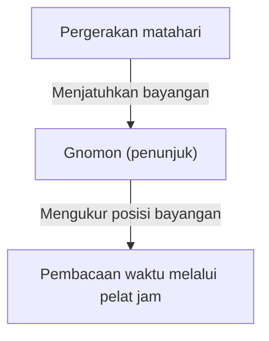
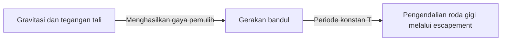
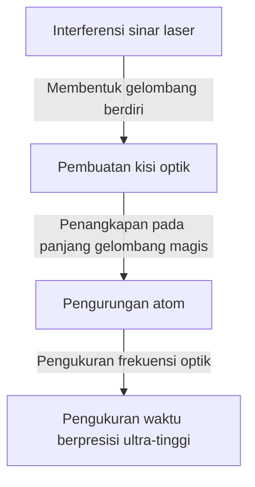

# 1. Fajar Pengukuran Waktu: Dari Benda Langit hingga Jam Matahari dan Jam Air

Metode paling awal yang digunakan umat manusia untuk mengukur waktu adalah dengan mengamati pergerakan benda-benda langit. Kulminasi matahari, fase-fase bulan, dan pergerakan bintang-bintang merupakan jam alami untuk mengetahui pergantian musim dan waktu dalam sehari.

## Prinsip Jam Matahari
Sekitar tahun 3500 SM, jam matahari (obelisk) mulai digunakan di Mesir Kuno dan Babilonia.
Waktu dibagi dengan cara mengukur panjang bayangan dari gnomon (penunjuk).

# 2. Lahirnya Jam Mekanis dan Isokronisme Bandul

Di biara-biara Eropa abad pertengahan, doa harus dipanjatkan pada waktu-waktu yang telah ditentukan, sehingga jam mekanis bertenaga beban pemberat pun diciptakan. Namun, jam tersebut masih memiliki simpangan kesalahan hingga puluhan menit per hari.

## Galileo dan Huygens
Galileo Galilei konon menemukan "isokronisme bandul" saat mengamati ayunan lampu gantung di Katedral Pisa. Periode bandul $T$ ditentukan oleh panjang $l$ dan percepatan gravitasi $g$.

$$ T = 2\pi \sqrt{\frac{l}{g}} $$

Pada tahun 1656, Christiaan Huygens menerapkan prinsip ini untuk membuat jam bandul pertama. Berkat penemuan ini, tingkat kesalahan berkurang drastis menjadi hanya puluhan detik per hari.

# 3. Kronometer Marinir dan Pengukuran Bujur

Pada Era Penjelajahan Samudra, jam yang akurat sangat dibutuhkan untuk menentukan garis bujur kapal di laut lepas secara tepat. John Harrison memecahkan masalah garis bujur ini dengan mengembangkan "H4", sebuah kronometer marinir bertenaga pegas yang tahan terhadap perubahan suhu dan guncangan kapal.

# 4. Revolusi Jam Kuarsa

Memasuki abad ke-20, osilator kristal kuarsa yang memanfaatkan efek piezoelektrik mulai diperkenalkan. Ketika tegangan listrik diterapkan pada resonator kuarsa, kristal tersebut bergetar pada frekuensi yang sangat stabil (umumnya 32.768 Hz).

$$ f = \frac{1}{2l} \sqrt{\frac{E}{\rho}} $$
($E$ adalah modulus Young, $\rho$ adalah massa jenis)

# 5. Jam Atom dan Teori Relativitas

Sebagai jam yang jauh lebih akurat daripada jam kuarsa, jam atom yang memanfaatkan transisi tingkat energi atom pun dikembangkan. Satu detik didefinisikan sebagai durasi dari 9.192.631.770 kali periode radiasi yang berkaitan dengan transisi antara dua tingkat hiperhalus pada keadaan dasar atom Sesium-133.

## Teori Relativitas Einstein dan Dilatasi Waktu
Jam atom yang terpasang pada satelit GPS memerlukan koreksi berdasarkan teori relativitas khusus (dilatasi waktu akibat kecepatan) dan teori relativitas umum (percepatan waktu akibat gravitasi yang lebih lemah).

Dilatasi waktu menurut teori relativitas khusus:
$$ \Delta t' = \frac{\Delta t}{\sqrt{1 - \frac{v^2}{c^2}}} $$

# 6. Jam Kisi Optik: Standar Waktu Masa Depan

Saat ini, penelitian mengenai "jam kisi optik" yang melampaui batas kemampuan jam atom sesium sedang berkembang pesat. Jam yang digagas oleh Profesor Hidetoshi Katori dan rekan-rekannya ini mengurung atom seperti strontium di dalam wadah optik berbentuk wadah telur (kisi optik) yang dibentuk oleh sinar laser, lalu mengukur transisi puluhan ribu atom secara bersamaan.

Tingkat presisi jam kisi optik begitu tinggi hingga tidak akan bergeser satu detik pun bahkan setelah berlalunya usia alam semesta (sekitar 13,8 miliar tahun). Hal ini memungkinkan geodesi relativistik, seperti mengukur ketinggian tanah hingga satuan sentimeter berdasarkan perbedaan gravitasi pada ketinggian yang berbeda.
