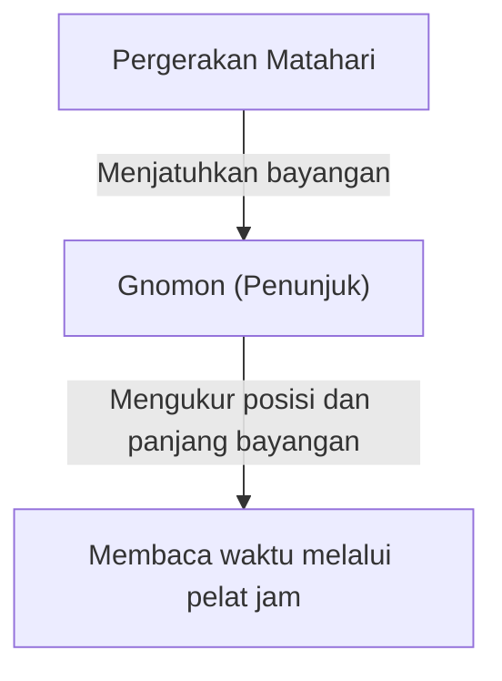
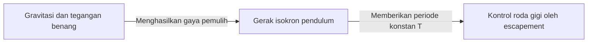
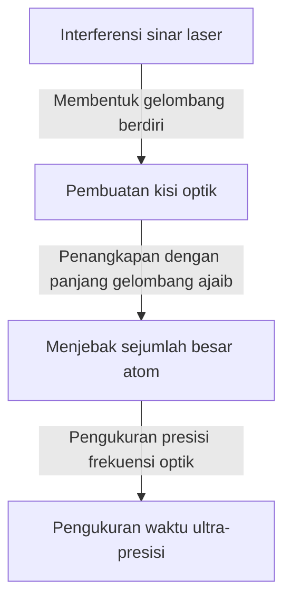

# Apa Itu Waktu: Pencarian Tak Berujung Umat Manusia dan Jam

"Waktu" adalah salah satu konsep yang paling dekat dengan kita namun paling penuh misteri. Waktu tidak terlihat dan tidak dapat disentuh, namun kehidupan kita sepenuhnya dikendalikan oleh waktu. Sejarah umat manusia adalah rangkaian tantangan tentang bagaimana menangkap dan mengukur "waktu" ini secara akurat. Dalam artikel ini, kita akan mengungkap secara rinci sejarah pengukuran waktu umat manusia dan perkembangan fisika di baliknya, mulai dari jam matahari kuno hingga jam kisi optik terbaru yang memanfaatkan teknologi kuantum.

## 1. Awal Mula Pengukuran Waktu: Pergerakan Benda Langit dan Siklus Alam

Indikator pertama yang digunakan manusia untuk mengukur waktu adalah pergerakan benda langit seperti matahari, bulan, dan bintang. Pergerakan matahari dari matahari terbit hingga terbenam, fase bulan, serta pergantian musim merupakan informasi penting untuk pertanian, perburuan, dan ritual keagamaan.

### Lahirnya Jam Matahari dan Jam Air
Di Mesir kuno dan Babilonia sekitar tahun 3500 SM, "jam matahari (obelisk)" sudah digunakan. Jam ini membagi waktu dalam sehari dengan mengukur panjang dan arah bayangan tiang (gnomon) yang ditancapkan tegak lurus di tanah.

Namun, jam matahari memiliki kelemahan fatal yaitu "tidak bisa digunakan di malam hari atau saat berawan". Untuk mengatasi hal ini, diciptakanlah "jam air (clepsydra)" dan "jam pembakaran (jam lilin dan jam dupa)". Alat-alat ini memanfaatkan sifat air yang menetes dengan kecepatan konstan atau kecepatan pembakaran benda, menjadikannya penemuan revolusioner yang tidak bergantung pada cuaca.

## 2. Lahirnya Jam Mekanik dan "Isokronisme Pendulum"

Memasuki Abad Pertengahan di Eropa, "jam mekanik" dengan tenaga pemberat diciptakan sebagai alarm untuk berdoa pada waktu-waktu tertentu di biara. Jam mekanik awal menggunakan mekanisme yang disebut *escapement* (mekanisme pelepasan) untuk mengontrol rotasi roda gigi, tetapi rentan terhadap gesekan dan perubahan suhu, sehingga menghasilkan kesalahan hingga puluhan menit sehari.

### Penemuan Galileo dan Invensi Huygens
Ketepatan pengukuran waktu meningkat drastis berkat penemuan "isokronisme pendulum" oleh fisikawan abad ke-16, Galileo Galilei. Hukum bahwa waktu ayunan pendulum bolak-balik hanya ditentukan oleh panjang pendulum, tanpa dipengaruhi oleh amplitudo atau beratnya, telah mengubah sejarah jam secara besar-besaran. Periode pendulum $T$ dinyatakan sebagai berikut berdasarkan panjang $l$ dan percepatan gravitasi $g$:

$$ T = 2\pi \sqrt{\frac{l}{g}} $$

Pada tahun 1656, ilmuwan Belanda Christiaan Huygens menerapkan prinsip ini dan menciptakan "jam pendulum" pertama di dunia. Hal ini secara drastis mengurangi tingkat kesalahan jam menjadi hanya beberapa puluh detik per hari.

## 3. Era Penjelajahan Samudra dan Masalah Garis Bujur: Jejak Kronometer

Pada Era Penjelajahan Samudra abad ke-18, mengetahui posisi kapal yang akurat (terutama garis bujur) menjadi isu nasional untuk mencegah kecelakaan laut. Garis lintang relatif mudah diukur dari ketinggian matahari atau Bintang Utara, tetapi untuk mengetahui garis bujur secara akurat, perlu membandingkan "waktu akurat di titik keberangkatan" dengan "waktu di lokasi saat ini". Artinya, dibutuhkan jam portabel yang sangat akurat dan tahan terhadap guncangan kapal serta perubahan suhu ekstrem.

Pembuat jam asal Inggris, John Harrison, mendedikasikan hidupnya untuk memecahkan masalah ini. Alih-alih pendulum, ia menyempurnakan kronometer laut "H4" yang menggunakan pegas utama dan *balance wheel* (pegas rambut). Berkat hal ini, umat manusia dapat berlayar dengan aman di lautan seluruh dunia, mengambil langkah pertama menuju globalisasi.

## 4. Revolusi Jam Kuarsa: Dari Mekanik ke Elektronik

Memasuki abad ke-20, sumber tenaga jam beralih dari tenaga mekanik seperti pegas utama ke listrik dan sirkuit elektronik. Puncaknya adalah kemunculan "jam kuarsa (kristal)".

Osilator kristal memanfaatkan "efek piezoelektrik", di mana kristal kuarsa berubah bentuk saat diberi tegangan listrik, dan sebaliknya menghasilkan tegangan saat diubah bentuknya. Resonator kristal bergetar dengan sangat stabil pada frekuensi tertentu (umumnya 32.768 Hz untuk jam).

$$ f = \frac{1}{2l} \sqrt{\frac{E}{\rho}} $$
($E$ adalah Modulus Young, $\rho$ adalah massa jenis)

Pada tahun 1969, Seiko dari Jepang merilis jam tangan kuarsa komersial pertama di dunia, "Astron". Hal ini memungkinkan siapa saja untuk memiliki jam tangan ultra-presisi dengan tingkat kesalahan kurang dari 1 detik per hari dengan harga terjangkau, memicu pergeseran paradigma dalam industri jam tangan.

## 5. Jam Atom dan Teori Relativitas: Menuju Kebenaran Alam Semesta

Meskipun jam kuarsa sangat akurat, kesalahan mikroskopis akibat perbedaan karakteristik individu kristal dan penuaan tidak dapat dihindari. Oleh karena itu, para ilmuwan mencari standar yang tidak akan pernah berubah di mana pun di alam semesta, yaitu "atom".

Jam atom menggunakan frekuensi gelombang mikro yang diserap atau dipancarkan oleh atom tertentu (terutama Cesium-133) sebagai standar. Saat ini, durasi 1 detik didefinisikan secara ketat sebagai "9.192.631.770 kali periode radiasi yang sesuai dengan transisi antara dua tingkat hiperhalus dari status dasar atom Cesium-133". Presisi ini sangat menakjubkan, dengan pergeseran hanya 1 detik dalam puluhan juta tahun.

### Koreksi Berdasarkan Teori Relativitas
GPS (Sistem Pemosisian Global) yang sangat penting untuk kehidupan modern bergantung pada informasi waktu yang akurat dari jam atom di satelit buatan. Namun, di sinilah Teori Relativitas Einstein memainkan peran penting.

1. **Teori Relativitas Khusus (Dilatasi waktu karena kecepatan)**: Jam di satelit yang bergerak cepat berjalan lebih lambat daripada jam di Bumi.
   $$ \Delta t' = \frac{\Delta t}{\sqrt{1 - \frac{v^2}{c^2}}} $$
2. **Teori Relativitas Umum (Percepatan waktu karena gravitasi)**: Jam di satelit yang berada di luar angkasa dengan gravitasi Bumi yang lebih lemah berjalan lebih cepat daripada jam di Bumi.

Jika kedua efek ini tidak dihitung dan laju jam tidak dikoreksi secara terus-menerus, kesalahan posisi GPS dapat mencapai beberapa kilometer dalam sehari. Ponsel pintar kita dapat menunjukkan lokasi yang akurat berkat Teori Relativitas.

## 6. Jam Kisi Optik: Akurasi Tertinggi untuk Membuka Masa Depan

Saat ini, penelitian tentang "Jam Kisi Optik (Optical Lattice Clock)", yang melampaui presisi jam atom cesium hingga beberapa digit, sedang dikembangkan di seluruh dunia. Jam revolusioner ini digagas oleh Profesor Hidetoshi Katori dkk. dari Universitas Tokyo pada tahun 2001.

Mekanisme jam kisi optik adalah menjebak atom seperti stronsium di dalam ruang mikroskopis (kisi optik, ibarat karton telur yang terbuat dari cahaya) yang dibuat dengan menginterferensikan sinar laser, dan secara bersamaan mengukur transisi puluhan ribu atom.

Akurasi jam kisi optik mencapai "10 pangkat minus 18", akurasi tertinggi di mana jam ini tidak akan meleset 1 detik pun bahkan jika usia alam semesta, yaitu sekitar 13,8 miliar tahun, telah berlalu.
Presisi sangat tinggi ini diharapkan tidak hanya untuk mengukur waktu, tetapi juga untuk digunakan sebagai sensor yang mendeteksi "perbedaan gravitasi berdasarkan ketinggian (perbedaan laju waktu)". Misalnya, dengan mengukur pergeseran waktu akibat perbedaan ketinggian hanya beberapa sentimeter, teknologi geodesi yang sama sekali baru (geodesi relativistik) sedang dimungkinkan, seperti pemantauan pergerakan kerak bumi, eksplorasi sumber daya bawah tanah, dan prediksi letusan gunung berapi.

## Kesimpulan

Sejarah pengukuran waktu umat manusia adalah perjalanan pencarian "siklus" yang lebih stabil, mulai dari pembagian kasar dengan jam matahari, hingga pendulum, pegas, kristal kuarsa, dan akhirnya atom. Dan sekarang, melalui inovasi baru yang disebut jam kisi optik, waktu berevolusi dari sekadar "sesuatu yang berdetak" menjadi "sesuatu yang mengeksplorasi" untuk membaca distorsi ruang dan waktu. Di balik "waktu saat ini" yang biasa kita periksa, tersembunyi kearifan umat manusia dan drama spektakuler fisika yang membentang selama ribuan tahun.
