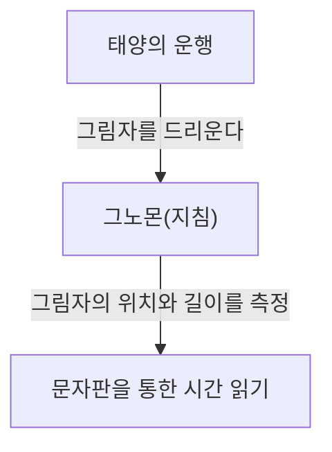
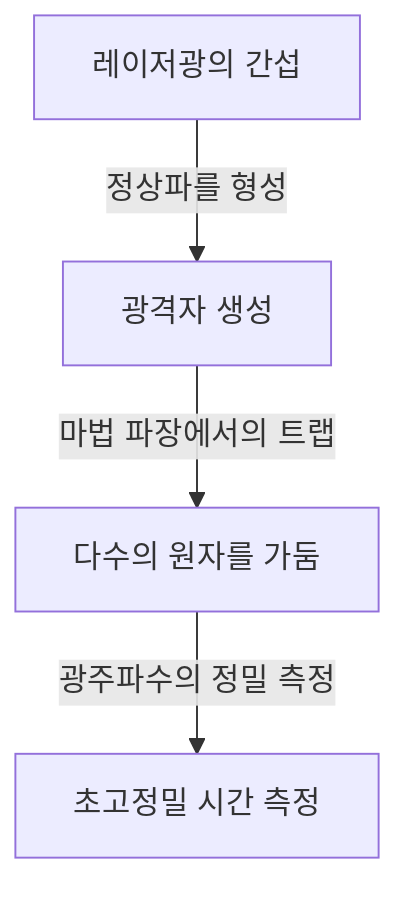

# 시간이란 무엇인가: 인류와 시계의 끝없는 탐구

'시간'은 우리 인류에게 가장 친숙하면서도 가장 수수께끼로 가득 찬 개념 중 하나입니다. 시간은 눈에 보이지도, 만질 수도 없지만, 우리의 삶은 완전히 시간에 지배받고 있습니다. 인류의 역사는 이 '시간'을 어떻게 정확하게 파악하고 측정할 것인가 하는 도전의 연속이었습니다. 본 기사에서는 고대의 해시계부터 최신 양자 기술을 구사한 광격자 시계에 이르기까지, 인류의 시간 측정 역사와 그 이면에 있는 물리학의 발전을 자세히 풀어봅니다.

## 1. 시간 측정의 여명기: 천체의 운행과 자연의 주기

인류가 시간을 측정하기 위한 최초의 지표로 삼은 것은 태양, 달, 별과 같은 천체의 운행이었습니다. 일출부터 일몰까지의 태양의 움직임, 달의 위상 변화, 그리고 계절의 변화는 농경이나 수렵, 종교적인 의식에 있어서 필수불가결한 정보였습니다.

### 해시계와 물시계의 탄생
기원전 3500년경의 고대 이집트나 바빌로니아에서는 이미 '해시계(오벨리스크)'가 사용되고 있었습니다. 이것은 지면에 수직으로 세운 기둥(그노몬)의 그림자 길이와 방향을 측정함으로써 하루의 시간을 분할하는 원리입니다.

그러나 해시계에는 '야간이나 흐린 날에는 사용할 수 없다'는 치명적인 단점이 있었습니다. 이를 보완하기 위해 발명된 것이 '물시계(클렙시드라)'나 '연소 시계(양초 시계나 향 시계)'입니다. 일정한 속도로 물이 떨어지는 성질이나 물건이 타는 속도를 이용하여 시간을 측정하는 이러한 도구들은 날씨에 좌우되지 않는 획기적인 발명품이었습니다.

## 2. 기계식 시계의 탄생과 '진자의 등시성'

중세 유럽에 접어들면서 수도원에서 정해진 시간에 기도를 올리기 위한 알람으로, 무거운 추를 동력으로 하는 '기계식 시계'가 발명되었습니다. 초기의 기계식 시계는 탈진기(escapement)라고 불리는 기구를 이용하여 톱니바퀴의 회전을 제어했지만, 마찰이나 온도 변화의 영향을 받기 쉬워 하루에 수십 분의 오차가 발생했습니다.

### 갈릴레오의 발견과 하위헌스의 발명
시간 측정의 정밀도를 비약적으로 높인 것은 16세기 물리학자 갈릴레오 갈릴레이의 '진자의 등시성' 발견입니다. 진자가 왕복하는 시간은 진폭이나 무게에 관계없이 오직 진자의 길이에 의해서만 결정된다는 이 법칙은 시계의 역사를 크게 바꾸어 놓았습니다. 진자의 주기 $T$ 는 길이 $l$ 과 중력가속도 $g$ 에 의해 다음과 같이 나타납니다.

$$ T = 2\pi \sqrt{\frac{l}{g}} $$

1656년, 네덜란드의 과학자 크리스티안 하위헌스(호이헨스)는 이 원리를 응용하여 세계 최초의 '진자 시계'를 제작했습니다. 이로 인해 시계의 오차는 하루 수십 초로 극적으로 감소했습니다.

## 3. 대항해시대와 경도 문제: 크로노미터의 궤적

18세기의 대항해시대, 해난 사고를 방지하기 위해 자기 배의 정확한 위치(특히 경도)를 아는 것이 국가적인 과제가 되었습니다. 위도는 태양이나 북극성의 고도로부터 비교적 쉽게 측정할 수 있지만, 경도를 정확히 알기 위해서는 '출발지의 정확한 시간'과 '현재 위치의 시간'을 비교할 필요가 있습니다. 즉, 배의 흔들림이나 극심한 온도 변화를 견딜 수 있는 매우 정확한 휴대용 시계가 필요했던 것입니다.

영국의 시계 장인 존 해리슨은 평생을 바쳐 이 문제에 매달렸습니다. 그는 진자 대신 태엽과 템프(헤어스프링)를 이용한 항해용 크로노미터 'H4'를 완성했습니다. 이로써 인류는 전 세계의 바다를 안전하게 항해할 수 있게 되었고, 세계화의 첫걸음을 내디뎠습니다.

## 4. 쿼츠 시계의 혁명: 기계에서 전자로

20세기에 접어들면서 시계의 동력원은 태엽과 같은 기계적인 것에서 전기와 전자 회로로 이동합니다. 그 결정타가 된 것이 '쿼츠(수정) 시계'의 등장입니다.

수정(석영)에 전압을 가하면 변형되고, 반대로 변형시키면 전압이 발생하는 '압전 효과'를 이용한 것이 수정 발진기입니다. 수정 진동자는 특정 주파수(시계에서는 일반적으로 32,768 Hz)로 매우 안정적으로 진동합니다.

$$ f = \frac{1}{2l} \sqrt{\frac{E}{\rho}} $$
($E$ 는 영률, $\rho$ 는 밀도)

1969년, 일본의 세이코가 세계 최초의 시판용 쿼츠식 손목시계 '아스트론'을 발매했습니다. 이로 인해 누구나 하루 1초 이하의 오차라는 초고정밀 시계를 저렴하게 손에 넣을 수 있게 되었고, 시계 산업에 패러다임 시프트가 일어났습니다.

## 5. 원자시계와 상대성이론: 우주의 진리로

쿼츠 시계는 매우 정확하지만, 수정의 개체 차이나 경년 열화로 인한 미세한 오차는 피할 수 없습니다. 그래서 과학자들은 우주 어디에서든 절대 변하지 않는 기준을 찾았습니다. 그것이 '원자'입니다.

원자시계는 특정 원자(주로 세슘-133)가 흡수·방출하는 마이크로파의 주파수를 기준으로 합니다. 현재 1초의 길이는 '세슘-133 원자의 바닥 상태에 있는 두 초미세 준위 사이의 전이에 대응하는 방사 주기의 9,192,631,770배'로 엄밀하게 정의되어 있습니다. 이 정밀도는 수천만 년에 1초밖에 틀리지 않는다는 경이로운 수준입니다.

### 상대성이론에 의한 보정
현대 생활에 필수적인 GPS(전 지구 위성 항법 시스템)는 인공위성에 탑재된 원자시계의 정확한 시각 정보에 의존하고 있습니다. 그러나 여기서 아인슈타인의 상대성이론이 중요한 역할을 합니다.

1. **특수 상대성이론(속도에 의한 시간 지연)**: 고속으로 이동하는 위성의 시계는 지상의 시계보다 느리게 갑니다.
   $$ \Delta t' = \frac{\Delta t}{\sqrt{1 - \frac{v^2}{c^2}}} $$
2. **일반 상대성이론(중력에 의한 시간의 흐름)**: 지구의 중력이 약한 우주 공간에 있는 위성의 시계는 지상의 시계보다 빠르게 갑니다.

이 두 가지 효과를 계산하여 항상 시계의 진행 속도를 보정하지 않으면, GPS의 측위 오차는 하루에 수 킬로미터에 달하게 됩니다. 우리의 스마트폰이 정확한 위치를 표시할 수 있는 것은 상대성이론 덕분입니다.

## 6. 광격자 시계: 미래를 여는 궁극의 정밀도

현재 세슘 원자시계의 정밀도를 몇 자릿수 더 뛰어넘는 '광격자 시계(Optical Lattice Clock)'의 연구가 전 세계적으로 진행되고 있습니다. 이 획기적인 시계는 2001년 도쿄대학의 카토리 히데토시 교수 연구팀에 의해 고안되었습니다.

광격자 시계의 원리는 레이저광을 간섭시켜 만든 미세한 공간(광격자, 말하자면 빛의 달걀판)에 스트론튬 등의 원자를 가두고, 수만 개의 원자 전이를 동시에 측정하는 것입니다.

광격자 시계의 정밀도는 '10의 마이너스 18승'에 달하며, 이는 우주의 나이인 약 138억 년이 지나도 1초도 어긋나지 않는다는 궁극의 정밀도입니다.
이 초고정밀도는 단순히 시간을 측정하는 것뿐만 아니라, '높이에 따른 중력의 차이(시간이 흐르는 속도의 차이)'를 검출하는 센서로서의 응용이 기대되고 있습니다. 예를 들어, 불과 수 센티미터의 표고 차이에 의한 시간의 어긋남을 측정함으로써 지각 변동의 감시나 지하자원 탐사, 화산 폭발 예측 등 전혀 새로운 측지 기술(상대론적 측지학)이 가능해지고 있습니다.

## 요약

인류의 시간 측정 역사는 해시계에 의한 대략적인 분할에서 시작하여 진자, 태엽, 수정, 그리고 원자로 더욱 안정적인 '주기'를 찾는 탐구의 여정이었습니다. 그리고 지금, 광격자 시계라는 새로운 혁신을 통해 시간은 단순한 '새기는 것'에서 시공간의 왜곡을 읽어내는 '탐구하는 것'으로 진화하려 하고 있습니다. 우리가 무심코 확인하는 '지금 시간'의 이면에는 수천 년에 걸친 인류의 지혜와 물리학의 장대한 드라마가 숨겨져 있는 것입니다.
