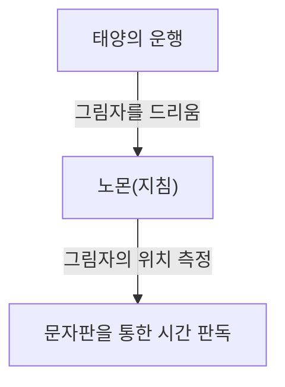
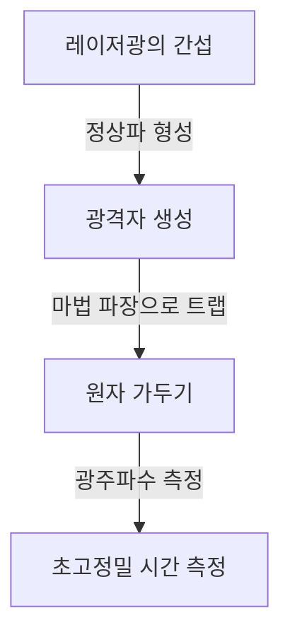

# 1. 시간 측정의 여명기: 천체에서 해시계·물시계로

인류가 시간을 측정하기 시작한 최초의 수단은 천체의 움직임을 관찰하는 것이었습니다. 태양의 남중, 달의 위상 변화, 별들의 운행은 계절이나 하루의 시간을 알기 위한 자연의 시계였습니다.

## 해시계의 원리
기원전 3500년경, 고대 이집트와 바빌로니아에서 해시계(오벨리스크)가 사용되기 시작했습니다.
노몬(지침)의 그림자 길이를 측정하여 시간을 분할했습니다.

# 2. 기계식 시계의 탄생과 진자의 등시성

중세 유럽의 수도원에서는 정해진 시간에 기도를 드릴 필요가 있었기 때문에, 추(무게추)를 동력으로 하는 기계식 시계가 발명되었습니다. 그러나 하루에 수십 분의 오차가 있었습니다.

## 갈릴레오와 하위헌스
갈릴레오 갈릴레이는 피사 대성당에서 흔들리는 샹들리에를 보고 '진자의 등시성'을 발견했다고 전해집니다. 진자의 주기 $T$는 길이 $l$과 중력가속도 $g$에 의해 결정됩니다.

$$ T = 2\pi \sqrt{\frac{l}{g}} $$

1656년, 크리스티안 하위헌스는 이 원리를 응용하여 최초의 진자시계를 제작했습니다. 이로 인해 오차는 하루 수십 초 수준으로 급감했습니다.

# 3. 항해용 크로노미터와 경도 측정

대항해시대, 바다 위에서 자선의 경도를 정확히 파악하기 위해서는 정확한 시계가 필수적이었습니다. 존 해리슨은 온도 변화와 배의 흔들림을 견뎌내는 태엽식 항해용 크로노미터 'H4'를 개발하여 경도 문제를 해결했습니다.

# 4. 쿼츠 시계의 혁명

20세기에 들어서며 압전 효과를 이용한 수정 발진기(쿼츠)가 등장합니다. 수정 진동자에 전압을 가하면 매우 안정된 주파수(일반적으로 32,768 Hz)로 진동합니다.

$$ f = \frac{1}{2l} \sqrt{\frac{E}{\rho}} $$
（$E$는 영률, $\rho$는 밀도）

# 5. 원자시계와 상대성이론

쿼츠보다 훨씬 더 정밀한 시계로, 원자의 에너지 준위 전이를 이용하는 원자시계가 개발되었습니다. 세슘-133 원자의 바닥상태에 있는 두 초미세 준위 사이의 전이에 해당하는 방사 주기의 9,192,631,770배를 1초로 정의하고 있습니다.

## 아인슈타인의 상대성이론과 시간 지연
GPS 위성에 탑재된 원자시계는 특수 상대성이론(속도에 의한 시간 지연)과 일반 상대성이론(중력에 의한 시간 빨라짐)의 보정이 필요합니다.

특수 상대성이론에 의한 시간 지연:
$$ \Delta t' = \frac{\Delta t}{\sqrt{1 - \frac{v^2}{c^2}}} $$

# 6. 광격자 시계: 미래의 시간 기준

현재 세슘 원자시계의 한계를 뛰어넘는 '광격자 시계' 연구가 진행되고 있습니다. 가토리 히데토시 교수 등에 의해 고안된 이 시계는 레이저로 만든 빛의 계란판(광격자)에 스트론튬 등의 원자를 가두고, 수만 개의 원자 전이를 동시에 측정하는 방식입니다.

광격자 시계의 정밀도는 우주의 나이(약 138억 년)가 지나도 1초의 오차조차 생기지 않을 정도이며, 이를 통해 상대론적 측지(높이에 따른 중력 차이로부터 해발 고도를 수 센티미터 단위로 측정하는 등)가 가능해지고 있습니다.
