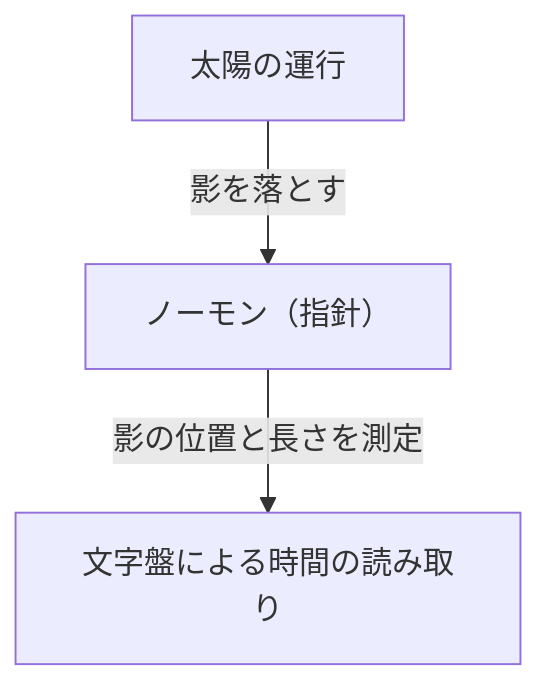
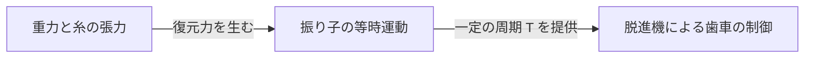
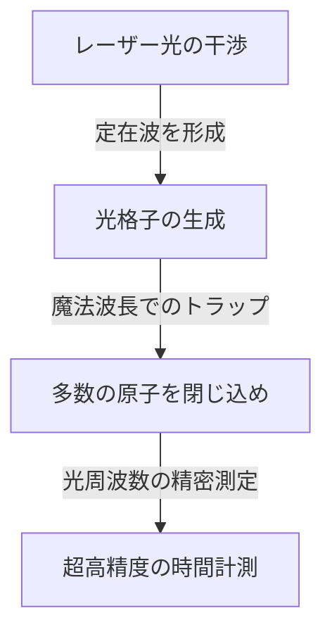

# 時間とは何か：人類と時計の終わりなき探求

「時間」は、私たち人類にとって最も身近でありながら、最も謎に満ちた概念の一つです。時間は目に見えず、触れることもできませんが、私たちの生活は完全に時間に支配されています。人類の歴史は、この「時間」をいかに正確に捉え、計測するかという挑戦の連続でした。本記事では、古代の日時計から最新の量子技術を駆使した光格子時計に至るまで、人類の時間計測の歴史とその背後にある物理学の発展を詳しく紐解いていきます。

## 1. 時間計測の黎明期：天体の運行と自然の周期

人類が時間を測るための最初の指標としたのは、太陽、月、星々といった天体の運行でした。日の出から日の入りまでの太陽の動き、月の満ち欠け、そして季節の移り変わりは、農耕や狩猟、宗教的な儀式において不可欠な情報でした。

### 日時計と水時計の誕生
紀元前3500年頃の古代エジプトやバビロニアでは、すでに「日時計（オベリスク）」が使用されていました。これは、地面に垂直に立てた柱（ノーモン）の影の長さや方角を測ることで、一日の時間を分割する仕組みです。

しかし、日時計には「夜間や曇りの日には使えない」という致命的な欠点がありました。これを補うために発明されたのが「水時計（クレプシドラ）」や「燃焼時計（ろうそく時計や線香時計）」です。一定の速度で水が滴り落ちる性質や、物が燃える速度を利用して時間を測るこれらの道具は、天候に左右されない画期的な発明でした。

## 2. 機械式時計の誕生と「振り子の等時性」

中世ヨーロッパに入ると、修道院で決まった時間に祈りを捧げるためのアラームとして、重錘（おもり）を動力とする「機械式時計」が発明されました。初期の機械式時計は、脱進機と呼ばれる機構を用いて歯車の回転を制御していましたが、摩擦や温度変化の影響を受けやすく、一日に数十分もの誤差が生じていました。

### ガリレオの発見とホイヘンスの発明
時間計測の精度を飛躍的に高めたのが、16世紀の物理学者ガリレオ・ガリレイによる「振り子の等時性」の発見です。振り子が往復する時間は、振れ幅や重さに関係なく、振り子の長さのみによって決まるというこの法則は、時計の歴史を大きく変えました。振り子の周期 $T$ は、長さ $l$ と重力加速度 $g$ によって以下のように表されます。

$$ T = 2\pi \sqrt{\frac{l}{g}} $$

1656年、オランダの科学者クリスティアーン・ホイヘンスは、この原理を応用して世界初の「振り子時計」を製作しました。これにより、時計の誤差は1日数十秒にまで劇的に減少しました。

## 3. 大航海時代と経度問題：クロノメーターの軌跡

18世紀の大航海時代、海難事故を防ぐために自船の正確な位置（特に経度）を知ることが国家的な課題となりました。緯度は太陽や北極星の高度から比較的容易に測定できますが、経度を正確に知るには、「出発地の正確な時間」と「現在地の時間」を比較する必要があります。つまり、船の揺れや激しい温度変化に耐えうる、極めて正確な携帯用時計が必要だったのです。

イギリスの時計技師ジョン・ハリソンは、生涯をかけてこの問題に取り組みました。彼は振り子の代わりにゼンマイとテンプ（ヒゲゼンマイ）を用いた航海用クロノメーター「H4」を完成させました。これにより、人類は世界中の海を安全に航行できるようになり、グローバル化の第一歩を踏み出しました。

## 4. クォーツ時計の革命：機械から電子へ

20世紀に入ると、時計の動力源はゼンマイなどの機械的なものから、電気と電子回路へと移行します。その決定打となったのが「クォーツ（水晶）時計」の登場です。

水晶（石英）に電圧をかけると変形し、逆に変形させると電圧が生じる「圧電効果」を利用したのが水晶発振器です。水晶振動子は、特定の周波数（時計では一般的に 32,768 Hz）で極めて安定して振動します。

$$ f = \frac{1}{2l} \sqrt{\frac{E}{\rho}} $$
（$E$ はヤング率、$\rho$ は密度）

1969年、日本のセイコーが世界初の市販クォーツ式腕時計「アストロン」を発売しました。これにより、誰もが1日1秒以下の誤差という超高精度な時計を安価に手に入れられるようになり、時計産業にパラダイムシフトが起きました。

## 5. 原子時計と相対性理論：宇宙の真理へ

クォーツ時計は非常に正確ですが、水晶の個体差や経年劣化による微小な誤差は避けられません。そこで科学者たちは、宇宙のどこでも絶対に変わらない基準を求めました。それが「原子」です。

原子時計は、特定の原子（主にセシウム133）が吸収・放出するマイクロ波の周波数を基準とします。現在、1秒の長さは「セシウム133原子の基底状態の2つの超微細準位間の遷移に対応する放射の周期の9,192,631,770倍」と厳密に定義されています。この精度は、数千万年に1秒しか狂わないという驚異的なものです。

### 相対性理論による補正
現代の生活に欠かせないGPS（全地球測位システム）は、人工衛星に搭載された原子時計の正確な時刻情報に依存しています。しかし、ここでアインシュタインの相対性理論が重要な役割を果たします。

1. **特殊相対性理論（速度による時間の遅れ）**：高速で移動する衛星の時計は、地上の時計よりも遅く進みます。
   $$ \Delta t' = \frac{\Delta t}{\sqrt{1 - \frac{v^2}{c^2}}} $$
2. **一般相対性理論（重力による時間の進み）**：地球の重力が弱い宇宙空間にある衛星の時計は、地上の時計よりも早く進みます。

これら2つの効果を計算し、常に時計の進み具合を補正しなければ、GPSの測位誤差は1日で数キロメートルにも達してしまいます。私たちのスマートフォンが正確な位置を示せるのは、相対性理論のおかげなのです。

## 6. 光格子時計：未来を拓く究極の精度

現在、セシウム原子時計の精度をさらに数桁上回る「光格子時計（Optical Lattice Clock）」の研究が世界中で進められています。この画期的な時計は、2001年に東京大学の香取秀俊教授らによって考案されました。

光格子時計の仕組みは、レーザー光を干渉させて作った微小な空間（光格子、いわば光の卵パック）にストロンチウムなどの原子を閉じ込め、数万個の原子の遷移を同時に測定するというものです。

光格子時計の精度は「10のマイナス18乗」に達し、これは宇宙の年齢である約138億年が経過しても1秒もずれないという究極の精度です。
この超高精度は、単に時間を測るだけでなく、「高さによる重力の違い（時間の進み方の違い）」を検出するセンサーとしての応用が期待されています。例えば、わずか数センチの標高差による時間のズレを測定することで、地殻変動の監視や地下資源の探査、火山の噴火予知など、全く新しい測地技術（相対論的測地学）が可能になりつつあります。

## まとめ

人類の時間計測の歴史は、日時計による大まかな分割から始まり、振り子、ゼンマイ、水晶、そして原子へと、より安定した「周期」を求める探求の旅でした。そして今、光格子時計という新たなイノベーションによって、時間は単なる「刻むもの」から、時空の歪みを読み取る「探るもの」へと進化しようとしています。私たちが何気なく確認している「今の時間」の背後には、何千年にもわたる人類の叡智と物理学の壮大なドラマが隠されているのです。
