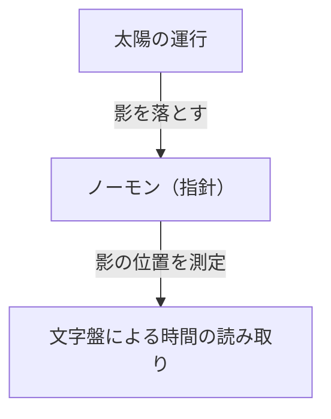
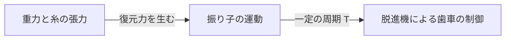
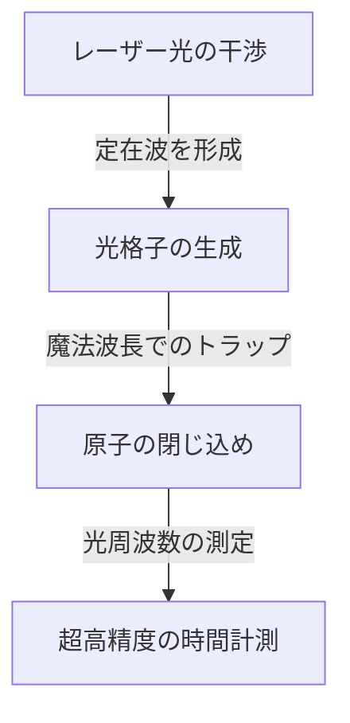

# 1. 時間計測の黎明期：天体から日時計・水時計へ

人類が時間を測り始めた最初の手段は、天体の動きを観察することでした。太陽の南中、月の満ち欠け、星々の運行は、季節や一日の時間を知るための自然の時計でした。

## 日時計の原理
紀元前3500年頃、古代エジプトやバビロニアで日時計（オベリスク）が使われ始めました。
ノーモン（指針）の影の長さを測ることで、時間を分割しました。

# 2. 機械式時計の誕生と振り子の等時性

中世ヨーロッパの修道院では、決まった時間に祈りを捧げる必要があり、重錘（おもり）を動力とした機械式時計が発明されました。しかし、一日に数十分の誤差がありました。

## ガリレオとホイヘンス
ガリレオ・ガリレイはピサの大聖堂で揺れるシャンデリアを見て、「振り子の等時性」を発見したとされています。振り子の周期 $T$ は、長さ $l$ と重力加速度 $g$ によって決まります。

$$ T = 2\pi \sqrt{\frac{l}{g}} $$

1656年、クリスティアーン・ホイヘンスはこの原理を応用し、最初の振り子時計を製作しました。これにより、誤差は1日数十秒へと激減しました。

# 3. 航海用クロノメーターと経度の測定

大航海時代、海上で自船の経度を正確に知るためには、正確な時計が必要でした。ジョン・ハリソンは、温度変化や船の揺れに耐えるゼンマイ式の航海用クロノメーター「H4」を開発し、経度問題を解決しました。

# 4. クォーツ時計の革命

20世紀に入ると、圧電効果を利用した水晶発振器（クォーツ）が登場します。水晶振動子に電圧をかけると、非常に安定した周波数（通常32,768 Hz）で振動します。

$$ f = \frac{1}{2l} \sqrt{\frac{E}{\rho}} $$
（$E$ はヤング率、$\rho$ は密度）

# 5. 原子時計と相対性理論

クォーツよりもさらに正確な時計として、原子のエネルギー準位の遷移を利用する原子時計が開発されました。セシウム133原子の基底状態の2つの超微細準位間の遷移に対応する放射の周期の9,192,631,770倍を1秒と定義しています。

## アインシュタインの相対性理論と時間の遅れ
GPS衛星に搭載された原子時計は、特殊相対性理論（速度による時間の遅れ）と一般相対性理論（重力による時間の進み）の補正が必要です。

特殊相対性理論による時間の遅れ：
$$ \Delta t' = \frac{\Delta t}{\sqrt{1 - \frac{v^2}{c^2}}} $$

# 6. 光格子時計：未来の時間基準

現在、セシウム原子時計の限界を超える「光格子時計」の研究が進んでいます。香取秀俊教授らによって考案されたこの時計は、レーザーによって作られた光の卵パック（光格子）にストロンチウムなどの原子を閉じ込め、数万個の原子の遷移を同時に測定するものです。

光格子時計の精度は、宇宙年齢（約138億年）経っても1秒もずれないほどであり、これにより相対論的な測地（高さによる重力の違いから標高を数センチ単位で測るなど）が可能になっています。
