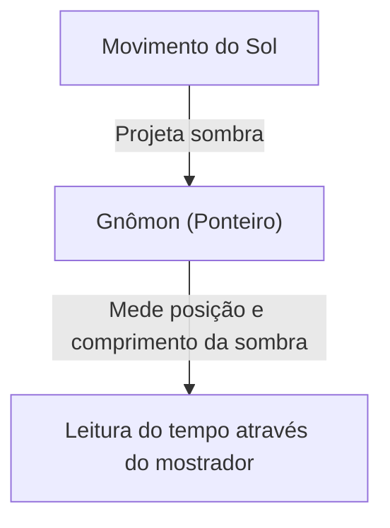
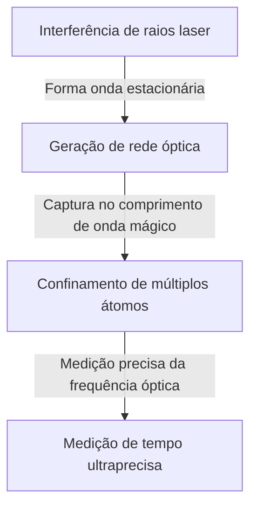

# O Que É o Tempo: A Busca Interminável da Humanidade e dos Relógios

O "tempo" é um dos conceitos mais familiares e, ao mesmo tempo, mais cheios de mistério para nós, humanos. O tempo é invisível e intocável, mas nossas vidas são completamente controladas por ele. A história da humanidade foi uma série contínua de desafios sobre como capturar e medir esse "tempo" com precisão. Neste artigo, desvendaremos detalhadamente a história da medição do tempo pela humanidade e o desenvolvimento da física por trás dela, desde os antigos relógios de sol até os mais recentes relógios de rede óptica que utilizam a tecnologia quântica.

## 1. O Alvorecer da Medição do Tempo: Movimentos Celestiais e Ciclos Naturais

O primeiro indicador que os humanos usaram para medir o tempo foi o movimento de corpos celestes como o sol, a lua e as estrelas. O movimento do sol do nascer ao pôr do sol, as fases da lua e a mudança das estações eram informações indispensáveis para a agricultura, a caça e rituais religiosos.

### O Nascimento do Relógio de Sol e da Clepsidra
No antigo Egito e na Babilônia por volta de 3500 a.C., o "relógio de sol (obelisco)" já era utilizado. Era um sistema que dividia o tempo do dia medindo o comprimento e a direção da sombra de um pilar (gnômon) colocado verticalmente no chão.



No entanto, o relógio de sol tinha a falha fatal de "não poder ser usado à noite ou em dias nublados". Para compensar isso, inventaram-se a "clepsidra (relógio de água)" e o "relógio de combustão (relógio de vela e relógio de incenso)". Essas ferramentas, que usavam a propriedade de gotas de água caindo a uma taxa constante ou a taxa de queima de objetos para medir o tempo, foram invenções revolucionárias que não dependiam do clima.

## 2. O Nascimento do Relógio Mecânico e o "Isocronismo do Pêndulo"

Na Idade Média na Europa, inventou-se o "relógio mecânico", alimentado por pesos pesados, como um alarme para as orações nos mosteiros em horários programados. Os primeiros relógios mecânicos usavam um mecanismo chamado escape para controlar a rotação das engrenagens, mas eram facilmente afetados por fricção e mudanças de temperatura, resultando em erros de dezenas de minutos por dia.

### A Descoberta de Galileu e a Invenção de Huygens
O que aumentou dramaticamente a precisão da medição do tempo foi a descoberta do "isocronismo do pêndulo" pelo físico do século 16, Galileu Galilei. A lei de que o tempo de oscilação de um pêndulo é determinado apenas pelo seu comprimento, independentemente da amplitude ou do peso, mudou significativamente a história dos relógios. O período $T$ de um pêndulo é expresso da seguinte forma com base no seu comprimento $l$ e na aceleração da gravidade $g$:

$$ T = 2\pi \sqrt{\frac{l}{g}} $$

Em 1656, o cientista holandês Christiaan Huygens aplicou este princípio para criar o primeiro "relógio de pêndulo" do mundo. Com isso, o erro dos relógios foi reduzido drasticamente para apenas algumas dezenas de segundos por dia.


## 3. A Era dos Descobrimentos e o Problema da Longitude: A Trajetória do Cronômetro

No século 18, durante a Era dos Descobrimentos, conhecer a localização exata de um navio (especialmente a longitude) tornou-se uma questão nacional para evitar desastres marítimos. A latitude pode ser medida com relativa facilidade a partir da altitude do sol ou da Estrela Polar, mas para determinar a longitude com precisão, é necessário comparar o "tempo exato no ponto de partida" com o "tempo no local atual". Em outras palavras, era necessário um relógio portátil extremamente preciso que pudesse suportar o balanço do navio e grandes variações de temperatura.

O relojoeiro inglês John Harrison dedicou sua vida a esse problema. Em vez de um pêndulo, ele completou o cronômetro marítimo "H4" usando uma mola principal e um volante (mola espiral). Graças a isso, a humanidade pôde navegar pelos oceanos do mundo com segurança, dando o primeiro passo rumo à globalização.

## 4. A Revolução do Relógio de Quartzo: Do Mecânico ao Eletrônico

Entrando no século 20, a fonte de energia dos relógios muda das mecânicas, como a mola principal, para a eletricidade e os circuitos eletrônicos. O fator decisivo para isso foi o surgimento do "relógio de quartzo (cristal)".

O oscilador de cristal aproveita o "efeito piezoelétrico", onde um cristal de quartzo se deforma quando uma voltagem é aplicada a ele e, inversamente, produz voltagem quando deformado. O oscilador de cristal vibra com extrema estabilidade em uma frequência específica (geralmente 32.768 Hz para relógios).

$$ f = \frac{1}{2l} \sqrt{\frac{E}{\rho}} $$
(onde $E$ é o Módulo de Young e $\rho$ é a densidade)

Em 1969, a empresa japonesa Seiko lançou o "Astron", o primeiro relógio de pulso de quartzo comercial do mundo. Isso permitiu que qualquer pessoa comprasse um relógio ultrapreciso com erro de menos de 1 segundo por dia a um preço acessível, causando uma mudança de paradigma na indústria relojoeira.

## 5. O Relógio Atômico e a Teoria da Relatividade: Em Direção à Verdade do Universo

Embora o relógio de quartzo seja extremamente preciso, pequenos erros devidos a diferenças individuais nos cristais e envelhecimento são inevitáveis. Portanto, os cientistas buscaram um padrão que nunca mudaria em lugar nenhum do universo. Esse padrão é o "átomo".

O relógio atômico usa como padrão a frequência das micro-ondas absorvidas e emitidas por átomos específicos (principalmente o Césio-133). Atualmente, a duração de 1 segundo é estritamente definida como "9.192.631.770 vezes o período da radiação correspondente à transição entre dois níveis hiperfinos do estado fundamental do átomo de Césio-133". Essa precisão é surpreendente, desviando apenas 1 segundo a cada dezenas de milhões de anos.

### Correções pela Teoria da Relatividade
O GPS (Sistema de Posicionamento Global), essencial para a vida moderna, depende de informações de tempo precisas dos relógios atômicos a bordo de satélites artificiais. No entanto, é aqui que a Teoria da Relatividade de Einstein desempenha um papel importante.

1. **Teoria da Relatividade Restrita (Dilatação do tempo devido à velocidade)**: Relógios em satélites que se move em alta velocidade andam mais devagar que os relógios na Terra.
   $$ \Delta t' = \frac{\Delta t}{\sqrt{1 - \frac{v^2}{c^2}}} $$
2. **Teoria da Relatividade Geral (Aceleração do tempo devido à gravidade)**: Relógios em satélites no espaço sideral, onde a gravidade da Terra é mais fraca, andam mais rápido que os relógios na Terra.

Se esses dois efeitos não fossem calculados para corrigir constantemente o avanço do relógio, o erro de posicionamento do GPS alcançaria vários quilômetros em um único dia. Nossos smartphones podem mostrar nossa localização precisa graças à Teoria da Relatividade.

## 6. Relógio de Rede Óptica: A Precisão Definitiva Que Abre o Futuro

Atualmente, pesquisas em todo o mundo estão avançando no "Relógio de Rede Óptica (Optical Lattice Clock)", que supera a precisão do relógio atômico de césio em várias ordens de grandeza. Este relógio revolucionário foi idealizado em 2001 pelo Professor Hidetoshi Katori e sua equipe da Universidade de Tóquio.

O mecanismo do relógio de rede óptica é prender átomos, como estrôncio, em um espaço microscópico (uma rede óptica, semelhante a uma caixa de ovos feita de luz) criado pela interferência de raios laser, e medir simultaneamente a transição de dezenas de milhares de átomos.



A precisão do relógio de rede óptica atinge "10 elevado a menos 18", uma precisão definitiva onde o relógio não perderia nem 1 segundo mesmo se a idade do universo, cerca de 13,8 bilhões de anos, já tivesse passado.
Essa ultraprecisão é esperada não apenas para medir o tempo, mas também para ser usada como um sensor que detecta "diferenças na gravidade dependendo da altitude (diferenças na taxa de passagem do tempo)". Por exemplo, ao medir a mudança de tempo devido a uma diferença de altitude de apenas alguns centímetros, uma tecnologia geodésica completamente nova (geodésia relativística) está se tornando possível, como monitorar movimentos crustais, explorar recursos subterrâneos e prever erupções vulcânicas.

## Conclusão

A história da medição do tempo pela humanidade foi uma jornada para encontrar um "ciclo" mais estável, começando pelas divisões grosseiras feitas pelo relógio de sol, passando pelo pêndulo, mola, quartzo e finalmente o átomo. E agora, com a nova inovação do relógio de rede óptica, o tempo está prestes a evoluir de apenas "algo que tiquetaqueia" para "algo que explora" a distorção do espaço e do tempo. Por trás do "tempo atual" que verificamos casualmente, esconde-se a sabedoria da humanidade e o grande drama da física que se estende por milhares de anos.
```
