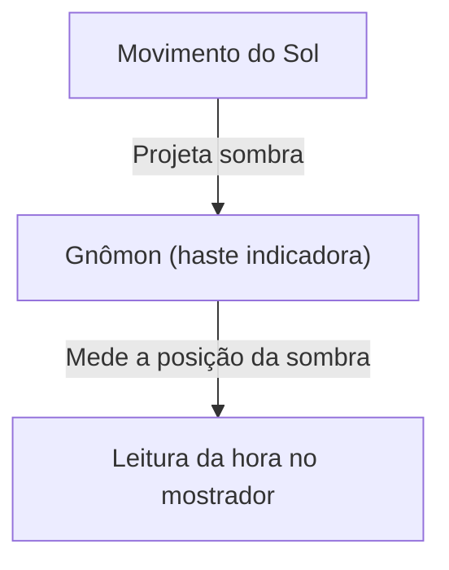
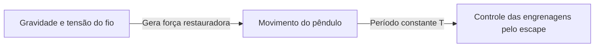
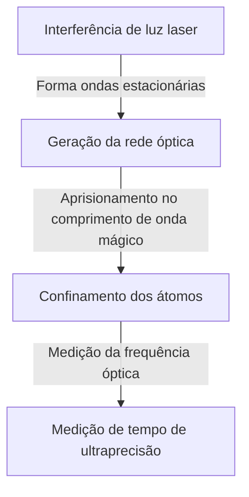

# 1. Os primórdios da medição do tempo: dos corpos celestes aos relógios de sol e de água

O primeiro método que a humanidade utilizou para medir o tempo foi a observação do movimento dos corpos celestes. A culminação solar, as fases da lua e o movimento das estrelas serviram como relógios naturais para determinar as estações e as horas do dia.

## O princípio do relógio de sol
Por volta de 3500 a.C., relógios de sol (obeliscos) começaram a ser utilizados no Antigo Egito e na Babilônia.
Ao medir o comprimento e a posição da sombra do gnômon (haste indicadora), dividia-se o tempo.

# 2. O nascimento dos relógios mecânicos e o isocronismo do pêndulo

Nos mosteiros da Europa medieval, havia a necessidade de realizar orações em horários determinados, o que levou à invenção dos relógios mecânicos movidos por pesos. No entanto, eles apresentavam uma margem de erro de várias dezenas de minutos por dia.

## Galileu e Huygens
Diz-se que Galileu Galilei descobriu o "isocronismo do pêndulo" ao observar o balanço de um candelabro na Catedral de Pisa. O período do pêndulo $T$ é determinado pelo seu comprimento $l$ e pela aceleração da gravidade $g$.

$$ T = 2\pi \sqrt{\frac{l}{g}} $$

Em 1656, Christiaan Huygens aplicou esse princípio para construir o primeiro relógio de pêndulo. Com isso, o erro diário foi drasticamente reduzido para algumas dezenas de segundos.

# 3. O cronômetro marítimo e a medição da longitude

Na Era dos Descobrimentos, para determinar com precisão a longitude de um navio no mar, era imprescindível dispor de um relógio altamente preciso. John Harrison desenvolveu o cronômetro marítimo a corda "H4", resistente às variações de temperatura e ao balanço do navio, solucionando assim o problema da longitude.

# 4. A revolução do relógio de quartzo

No século XX, surgiram os osciladores de cristal (quartzo), baseados no efeito piezoelétrico. Quando uma tensão elétrica é aplicada a um ressonador de quartzo, ele vibra a uma frequência extremamente estável (tipicamente 32.768 Hz).

$$ f = \frac{1}{2l} \sqrt{\frac{E}{\rho}} $$
($E$ é o módulo de Young, $\rho$ é a densidade)

# 5. Relógios atômicos e a teoria da relatividade

Como uma alternativa ainda mais precisa que o quartzo, foram desenvolvidos relógios atômicos que utilizam as transições entre níveis de energia dos átomos. O segundo é definido como a duração de 9.192.631.770 períodos da radiação correspondente à transição entre os dois níveis hiperfinos do estado fundamental do átomo de césio-133.

## A teoria da relatividade de Einstein e a dilatação do tempo
Os relógios atômicos a bordo dos satélites GPS requerem correções devido à relatividade especial (dilatação do tempo causada pela velocidade) e à relatividade geral (avanço do tempo devido ao menor potencial gravitacional).

Dilatação do tempo segundo a relatividade especial:
$$ \Delta t' = \frac{\Delta t}{\sqrt{1 - \frac{v^2}{c^2}}} $$

# 6. Relógios de rede óptica: o padrão de tempo do futuro

Atualmente, avançam as pesquisas sobre os "relógios de rede óptica", capazes de superar os limites dos relógios atômicos de césio. Proposto pelo professor Hidetoshi Katori e sua equipe, este tipo de relógio confina átomos como o estrôncio em uma estrutura óptica semelhante a uma "cartela de ovos" feita de luz (rede óptica), medindo simultaneamente a transição de dezenas de milhares de átomos.

A precisão de um relógio de rede óptica é tão extraordinária que ele não se desvia nem um segundo sequer ao longo da idade do universo (aproximadamente 13,8 bilhões de anos). Isso possibilita a chamada geodésia relativística, permitindo medir diferenças de altitude na escala de poucos centímetros através da variação da gravidade com a altura.
