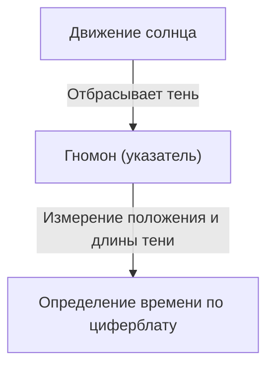
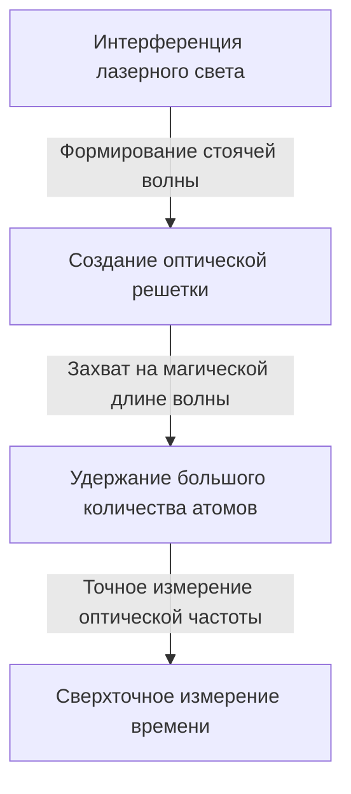

# Что такое время: бесконечный поиск человечества и часов

«Время» — одно из самых близких, но в то же время самых загадочных понятий для нас, людей. Время невидимо, его нельзя коснуться, но наша жизнь полностью подчинена ему. История человечества — это череда попыток точно уловить и измерить это «время». В этой статье мы подробно рассмотрим историю измерения времени человечеством и развитие физики, стоящей за этим, — от древних солнечных часов до новейших оптических часов на оптической решетке, использующих квантовые технологии.

## 1. Зарождение измерения времени: движение небесных тел и природные циклы

Первыми ориентирами, которые люди использовали для измерения времени, были движения небесных тел, таких как солнце, луна и звезды. Движение солнца от восхода до заката, фазы луны и смена времен года были жизненно важной информацией для сельского хозяйства, охоты и религиозных ритуалов.

### Появление солнечных и водяных часов
Около 3500 г. до н.э. в Древнем Египте и Вавилоне уже использовались «солнечные часы (обелиски)». Это система, разделявшая день на части путем измерения длины и направления тени от столба (гномона), установленного вертикально на земле.

Однако у солнечных часов был фатальный недостаток: «их нельзя использовать ночью или в пасмурные дни». Чтобы компенсировать это, были изобретены «водяные часы (клепсидра)» и «огневые часы (свечные или благовонные часы)». Эти инструменты, измерявшие время за счет постоянной скорости капания воды или скорости горения предметов, стали революционными изобретениями, не зависящими от погоды.

## 2. Появление механических часов и «изохронность маятника»

В средневековой Европе были изобретены «механические часы», приводимые в движение гирями, в качестве будильника для монахов, чтобы они молились в определенное время. Ранние механические часы использовали механизм, называемый спуском, для управления вращением шестерен, но они были сильно подвержены трению и изменениям температуры, что приводило к погрешностям до нескольких десятков минут в день.

### Открытие Галилея и изобретение Гюйгенса
Точность измерения времени резко возросла благодаря открытию в 16 веке физиком Галилео Галилеем «изохронности маятника». Этот закон гласит, что время, за которое маятник совершает колебание, зависит только от длины маятника, независимо от амплитуды или веса, и он навсегда изменил историю часов. Период маятника $T$ выражается через длину $l$ и ускорение свободного падения $g$ следующим образом:

$$ T = 2\pi \sqrt{\frac{l}{g}} $$

В 1656 году голландский ученый Христиан Гюйгенс применил этот принцип и создал первые в мире «маятниковые часы». В результате погрешность часов резко сократилась до нескольких десятков секунд в день.

## 3. Эпоха великих географических открытий и проблема долготы: путь хронометра

В 18 веке, в Эпоху великих географических открытий, точное определение местоположения своего корабля (особенно долготы) для предотвращения кораблекрушений стало национальной задачей. Широту можно было относительно легко измерить по высоте солнца или Полярной звезды, но для точного определения долготы нужно было сравнить «точное время в точке отправления» с «текущим временем на месте». Другими словами, нужны были чрезвычайно точные портативные часы, способные выдерживать качку корабля и резкие перепады температур.

Британский часовщик Джон Харрисон посвятил решению этой проблемы всю свою жизнь. Он создал морской хронометр "H4", в котором вместо маятника использовались заводная пружина и баланс (волосковая пружина). Благодаря этому человечество смогло безопасно перемещаться по морям всего мира, сделав первый шаг к глобализации.

## 4. Революция кварцевых часов: от механики к электронике

В 20 веке источник питания часов перешел от механических устройств, таких как заводные пружины, к электричеству и электронным схемам. Решающим фактором стало появление «кварцевых часов».

Кварцевый генератор использует «пьезоэлектрический эффект», при котором кварц деформируется при приложении напряжения и, наоборот, генерирует напряжение при деформации. Кварцевый резонатор чрезвычайно стабильно вибрирует на определенной частоте (обычно 32 768 Гц для часов).

$$ f = \frac{1}{2l} \sqrt{\frac{E}{\rho}} $$
（$E$ — модуль Юнга, $\rho$ — плотность）

В 1969 году японская компания Seiko выпустила первые в мире коммерческие кварцевые наручные часы "Astron". Это позволило любому человеку дешево приобрести сверхточные часы с погрешностью менее 1 секунды в день, что вызвало сдвиг парадигмы в часовой индустрии.

## 5. Атомные часы и теория относительности: к истине Вселенной

Кварцевые часы очень точны, но неизбежны небольшие погрешности из-за индивидуальных различий кристаллов и их деградации со временем. Поэтому ученые начали искать стандарт, который был бы абсолютно неизменным где угодно во Вселенной. И этим стандартом стал «атом».

Атомные часы используют в качестве эталона частоту микроволнового излучения, поглощаемого и излучаемого определенными атомами (в основном цезием-133). В настоящее время длина 1 секунды строго определена как «9 192 631 770 периодов излучения, соответствующего переходу между двумя сверхтонкими уровнями основного состояния атома цезия-133». Эта точность поразительна: она отклоняется всего на 1 секунду за десятки миллионов лет.

### Поправки с учетом теории относительности
GPS (глобальная система позиционирования), без которой невозможно представить современную жизнь, зависит от точной информации о времени от атомных часов на искусственных спутниках. Однако здесь важную роль играет теория относительности Эйнштейна.

1. **Специальная теория относительности (замедление времени из-за скорости)**: Часы на спутниках, движущихся с высокой скоростью, идут медленнее, чем часы на Земле.
   $$ \Delta t' = \frac{\Delta t}{\sqrt{1 - \frac{v^2}{c^2}}} $$
2. **Общая теория относительности (ускорение времени из-за гравитации)**: Часы на спутниках в космосе, где гравитация Земли слабее, идут быстрее, чем часы на Земле.

Если не рассчитывать эти два эффекта и не корректировать ход часов постоянно, ошибка позиционирования GPS достигнет нескольких километров в день. Благодаря теории относительности наши смартфоны могут показывать точное местоположение.

## 6. Оптические часы на оптической решетке: предельная точность, открывающая будущее

В настоящее время по всему миру ведутся исследования «оптических часов на оптической решетке» (Optical Lattice Clock), точность которых на несколько порядков превышает точность цезиевых атомных часов. Эти революционные часы были изобретены в 2001 году профессором Хидетоси Катори и его коллегами из Токийского университета.

Принцип работы таких часов заключается в захвате атомов стронция и других элементов в микроскопические пространства (оптическую решетку, своеобразную световую коробку для яиц), созданные интерференцией лазерного излучения, и одновременном измерении переходов десятков тысяч атомов.

Точность оптических часов на оптической решетке достигает «10 в минус 18-й степени», что является предельной точностью, при которой часы не отстанут ни на секунду, даже если пройдет возраст Вселенной (около 13,8 миллиарда лет).
Ожидается, что эта сверхвысокая точность будет применяться не только для измерения времени, но и в качестве датчика для обнаружения «разницы в гравитации из-за высоты (разницы в ходе времени)». Например, измеряя разницу во времени, вызванную разницей высот всего в несколько сантиметров, становятся возможными совершенно новые геодезические технологии (релятивистская геодезия), такие как мониторинг движений земной коры, разведка подземных ресурсов и предсказание извержений вулканов.

## Заключение

История измерения времени человечеством началась с грубого разделения с помощью солнечных часов и превратилась в поиск более стабильного «периода», переходя от маятников к пружинам, кварцу и, наконец, атомам. А теперь, благодаря новым инновациям — оптическим часам на оптической решетке, время из того, что просто «отсчитывается», превращается в инструмент «исследования», считывающий искривление пространства-времени. За «текущим временем», которое мы небрежно проверяем, скрывается грандиозная драма многовековой человеческой мудрости и физики.
