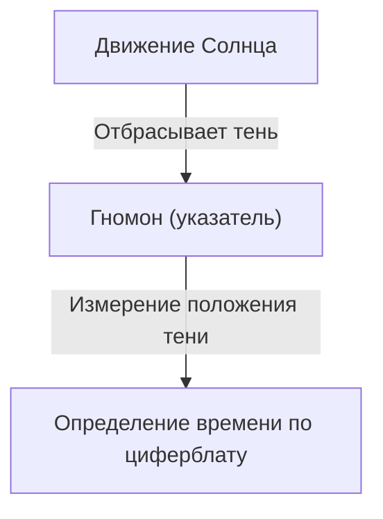
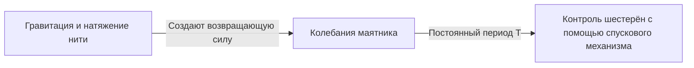
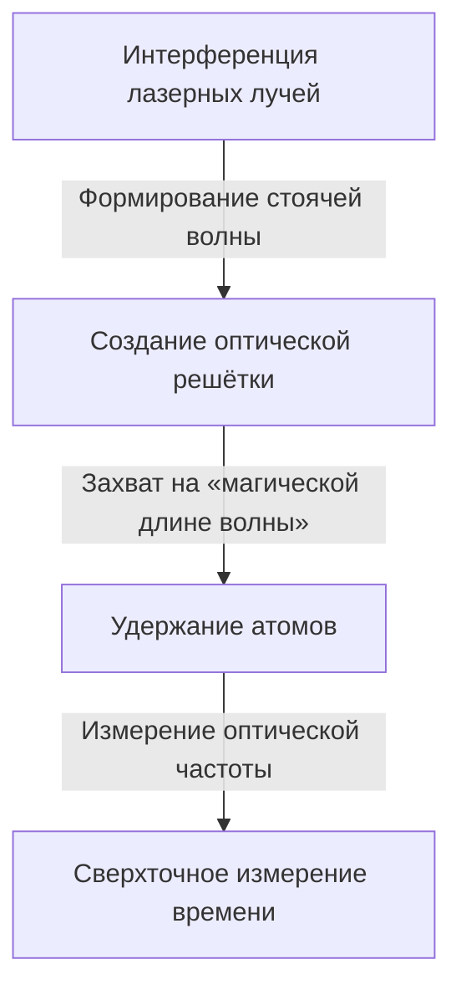

# 1. Зарождение измерения времени: от небесных светил к солнечным и водяным часам

Первым способом измерения времени для человечества стало наблюдение за движением небесных тел. Кульминация Солнца, фазы Луны и перемещение звёзд служили природными часами, позволявшими определять смену сезонов и время суток.

## Принцип действия солнечных часов
Около 3500 года до н. э. в Древнем Египте и Вавилоне начали использовать солнечные часы (обелиски).
Измеряя длину тени от гномона (указателя), люди делили день на отрезки времени.

# 2. Рождение механических часов и изохронизм маятника

В монастырях средневековой Европы молитвы совершались в строго установленные часы, что привело к изобретению механических часов с гиревым приводом. Однако их погрешность составляла несколько десятков минут в сутки.

## Галилей и Гюйгенс
Считается, что Галилео Галилей открыл свойство «изохронизма маятника», наблюдая за раскачиванием люстры в Пизанском соборе. Период колебаний маятника $T$ определяется его длиной $l$ и ускорением свободного падения $g$:

$$ T = 2\pi \sqrt{\frac{l}{g}} $$

В 1656 году Христиан Гюйгенс применил этот принцип на практике и создал первые маятниковые часы. Благодаря этому погрешность сократилась до нескольких десятков секунд в день.

# 3. Морской хронометр и определение долготы

В эпоху Великих географических открытий для точного определения долготы корабля в открытом море требовались высокоточные часы. Джон Гаррисон решил проблему долготы, разработав пружинный морской хронометр «H4», устойчивый к перепадам температур и качке корабля.

# 4. Революция кварцевых часов

В XX веке появились кварцевые генераторы, использующие пьезоэлектрический эффект. При подаче электрического напряжения на кварцевый резонатор он начинает колебаться с крайне стабильной частотой (обычно 32 768 Гц).

$$ f = \frac{1}{2l} \sqrt{\frac{E}{\rho}} $$
(где $E$ — модуль Юнга, $\rho$ — плотность)

# 5. Атомные часы и теория относительности

В качестве ещё более точных часов были разработаны атомные часы, использующие квантовые переходы между энергетическими уровнями атомов. Секунда была определена как интервал времени, равный 9 192 631 770 периодам излучения, соответствующего переходу между двумя сверхтонкими уровнями основного состояния атома цезия-133.

## Теория относительности Эйнштейна и замедление времени
Атомные часы, установленные на спутниках GPS, требуют внесения поправок на основе специальной теории относительности (замедление времени из-за скорости) и общей теории относительности (ускорение хода времени из-за более слабой гравитации).

Замедление времени в специальной теории относительности:
$$ \Delta t' = \frac{\Delta t}{\sqrt{1 - \frac{v^2}{c^2}}} $$

# 6. Оптические решёточные часы: будущий эталон времени

В настоящее время активно ведутся исследования «оптических решёточных часов», превосходящих возможности цезиевых атомных часов. В этих часах, предложенных профессором Хидэтоси Катори и его коллегами, атомы (например, стронция) удерживаются в оптической решётке («световом лотке для яиц»), сформированной лазерными лучами, что позволяет одновременно измерять переходы десятков тысяч атомов.

Точность оптических решёточных часов настолько высока, что их погрешность составит не более одной секунды за время, сравнимое с возрастом Вселенной (около 13,8 миллиарда лет). Это открывает возможности для релятивистской геодезии — например, измерения высоты над уровнем моря с точностью до сантиметров по изменению гравитационного потенциала.
