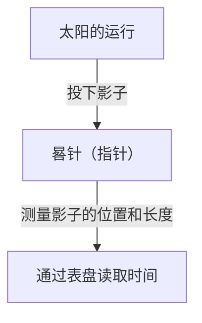
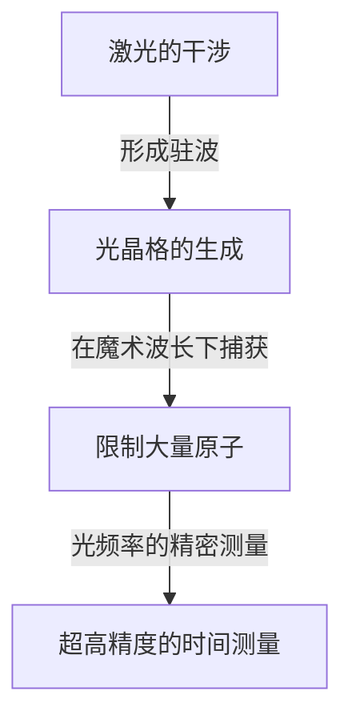

# 时间是什么：人类与钟表无止境的探索

“时间”对我们人类来说，是既最亲密又充满最多谜团的概念之一。时间看不见、摸不着，但我们的生活却完全被时间所支配。人类的历史，就是一部不断挑战如何精确捕捉和测量这“时间”的连续剧。本文将从古代的日晷讲起，直到运用最新量子技术的光晶格钟，为您详细解读人类时间测量的历史及其背后物理学的发展。

## 1. 时间测量的黎明期：天体运行与自然周期

人类测量时间最初的参考标准，是太阳、月亮和星星等天体的运行。从日出到日落的太阳轨迹、月亮的阴晴圆缺，以及季节的更替，对于农耕、狩猎和宗教仪式来说，都是不可或缺的信息。

### 日晷与水钟的诞生
大约在公元前3500年的古埃及和巴比伦，就已经开始使用“日晷（方尖碑）”。它的原理是通过测量垂直立在地面上的柱子（晷针）的影子长度和方向，来分割一天的时长。

然而，日晷有一个致命的缺点，即“在夜间或阴天无法使用”。为了弥补这一点而被发明出来的，是“水钟（漏壶）”和“燃烧钟（蜡烛钟和线香钟）”。这些工具利用水滴以恒定速度滴落的特性，或者物体燃烧的速度来测量时间，是不受天气影响的革命性发明。

## 2. 机械钟的诞生与“单摆的等时性”

进入中世纪的欧洲，为了在修道院规定的时间进行祈祷作为闹钟使用，发明了以重物（砝码）为动力的“机械钟”。早期的机械钟使用称为擒纵机构的装置来控制齿轮的转动，但它们很容易受到摩擦和温度变化的影响，每天会产生多达几十分钟的误差。

### 伽利略的发现与惠更斯的发明
使时间测量精度发生飞跃性提高的，是16世纪物理学家伽利略·伽利莱发现的“单摆的等时性”。单摆往复一次的时间，与摆幅和重量无关，仅由单摆的长度决定的这一法则，极大地改变了钟表的历史。单摆的周期 $T$ 由长度 $l$ 和重力加速度 $g$ 表示如下：

$$ T = 2\pi \sqrt{\frac{l}{g}} $$

1656年，荷兰科学家克里斯蒂安·惠更斯应用这一原理制作了世界上第一台“摆钟”。由此，钟表的误差急剧减少到每天几十秒。

## 3. 大航海时代与经度问题：航海天文钟的轨迹

18世纪的大航海时代，为了防止海难事故，了解自己船只的准确位置（特别是经度）成为了国家级课题。纬度相对容易从太阳或北极星的高度测量得出，但要准确知道经度，就必须比较“出发地的准确时间”和“当前所在地的时间”。也就是说，需要一种能够经受住船体摇晃和剧烈温度变化、极其精确的便携式钟表。

英国钟表匠约翰·哈里森倾尽一生致力于解决这个问题。他完成了用发条和摆轮（游丝）代替单摆的航海天文钟“H4”。这使人类能够安全地航行于世界各地的海洋，迈出了全球化的第一步。

## 4. 石英钟革命：从机械到电子

进入20世纪，钟表的动力源从发条等机械装置，转变为电力和电子电路。起到决定性作用的是“石英钟”的出现。

石英振荡器利用了“压电效应”，即对石英施加电压会使其变形，反之使其变形则会产生电压。石英振子可以在特定频率（钟表通常为 32,768 Hz）下极其稳定地振动。

$$ f = \frac{1}{2l} \sqrt{\frac{E}{\rho}} $$
（$E$ 是杨氏模量，$\rho$ 是密度）

1969年，日本精工（Seiko）推出了世界上第一款市售石英腕表“Astron”。这使得任何人都能以低廉的价格买到每天误差在1秒以下的超高精度钟表，引发了钟表产业的范式转换。

## 5. 原子钟与相对论：通向宇宙真理

石英钟非常精确，但由于石英的个体差异和老化造成的微小误差是不可避免的。于是科学家们开始寻找在宇宙任何地方都绝对不变的标准。那就是“原子”。

原子钟以特定原子（主要是铯-133）吸收和释放的微波频率作为基准。目前，1秒的长度被严格定义为“铯-133原子基态的两个超精细能级之间跃迁所对应的辐射周期的9,192,631,770倍”。这种精度令人惊叹，数千万年才会产生1秒的误差。

### 相对论的修正
现代生活不可或缺的GPS（全球定位系统）依赖于人造卫星上搭载的原子钟的精确时间信息。然而，在这里，爱因斯坦的相对论发挥了重要作用。

1. **狭义相对论（速度导致的时间膨胀）**：高速移动的卫星上的时钟，比地面上的时钟走得慢。
   $$ \Delta t' = \frac{\Delta t}{\sqrt{1 - \frac{v^2}{c^2}}} $$
2. **广义相对论（重力导致的时间加快）**：处于地球重力较弱的太空中的卫星上的时钟，比地面上的时钟走得快。

如果不计算这两种效应并不断修正时钟的运行，GPS的定位误差在一天内就会达到几公里。我们的智能手机能够显示准确的位置，都要归功于相对论。

## 6. 光晶格钟：开拓未来的极限精度

目前，精度比铯原子钟还要高出几个数量级的“光晶格钟（Optical Lattice Clock）”的研究正在世界各地推进。这种革命性的时钟是由东京大学的香取秀俊教授等人于2001年提出的。

光晶格钟的原理是，将锶等原子捕获在通过干涉激光产生的光的微小空间（光晶格，也就是光的鸡蛋盒）中，并同时测量数万个原子的跃迁。

光晶格钟的精度达到了“10的负18次方”，这是一种即使经过宇宙年龄约138亿年也不会有1秒偏差的极限精度。
这种超高精度不仅用于测量时间，还有望被应用作探测“由高度引起的重力差异（时间流逝速度差异）”的传感器。例如，通过测量仅几厘米的海拔差带来的时间偏差，地壳变动监测、地下资源勘探、火山喷发预测等全新的大地测量技术（相对论大地测量学）正在成为可能。

## 总结

人类时间测量的历史，从使用日晷进行粗略分割开始，经历单摆、发条、石英再到原子，是一场寻求更稳定“周期”的探索之旅。而现在，随着光晶格钟这一新的创新，时间正从单纯的“被刻画之物”，进化为读取时空扭曲的“被探索之物”。在我们不经意间确认的“现在的时间”背后，隐藏着几千年来人类的智慧与物理学宏大的戏剧。
