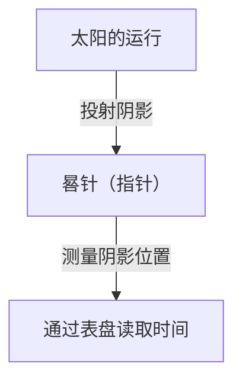
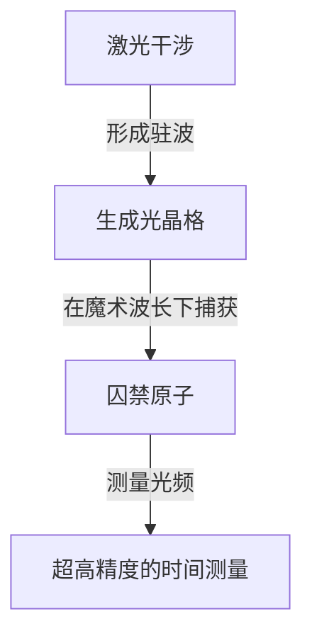

# 1. 计时技术的黎明期：从天体到日晷与水钟

人类最初测量时间的手段是观测天体的运动。太阳的中天（正午直射）、月亮的阴晴圆缺、繁星的运行，都是用于了解季节和一天中时间的自然时钟。

## 日晷的原理
大约在公元前3500年，古埃及和巴比伦开始使用日晷（方尖碑）。
通过测量晷针（指针）的阴影长度来划分时间。

# 2. 机械钟的诞生与单摆的等时性

在中世纪欧洲的修道院中，由于需要在固定时间进行祈祷，人们发明了以重锤（砝码）为动力的机械钟。然而，这种机械钟每天会产生数十分钟的误差。

## 伽利略与惠更斯
据说伽利略·伽利莱在比萨大教堂观察摇晃的吊灯时，发现了“单摆的等时性”。单摆的周期 $T$ 由摆长 $l$ 和重力加速度 $g$ 决定：

$$ T = 2\pi \sqrt{\frac{l}{g}} $$

1656年，克里斯蒂安·惠更斯应用这一原理制造了第一台摆钟。这使得每天的误差大幅缩减至数十秒。

# 3. 航海精密计时器与经度测量

在大航海时代，为了在海上准确测定船只所在的经度，必须拥有极其精准的时钟。约翰·哈里森研发出了能够抵御温度变化和船只颠簸的发条式航海天文钟（航海精密计时器）“H4”，从而解决了经度测量难题。

# 4. 石英钟的革命

进入20世纪后，利用压电效应的石英晶体振荡器问世。当向石英晶体施加电压时，它会以极为稳定的频率（通常为 32,768 Hz）发生振动。

$$ f = \frac{1}{2l} \sqrt{\frac{E}{\rho}} $$
（$E$ 为杨氏模量，$\rho$ 为密度）

# 5. 原子钟与相对论

为了获得比石英钟更高的精度，人们开发了利用原子能级跃迁的原子钟。国际单位制将铯-133原子基态的两个超精细能级之间跃迁所对应辐射周期的 9,192,631,770 倍定义为 1 秒。

## 爱因斯坦的相对论与时间膨胀
搭载在 GPS 卫星上的原子钟，必须考虑狭义相对论（速度导致时间变慢）和广义相对论（重力较弱导致时间变快）的效应并进行校正。

狭义相对论引起的时间膨胀：
$$ \Delta t' = \frac{\Delta t}{\sqrt{1 - \frac{v^2}{c^2}}} $$

# 6. 光晶格钟：未来的时间基准

目前，超越铯原子钟极限的“光晶格钟”研究正在积极推进中。这一时钟由香取秀俊教授等人提出，它利用激光构建的“光之蛋托”（光晶格）捕获锶等原子，并同时测量数万个原子的能级跃迁。

光晶格钟的精度极高，即使经历宇宙年龄（约138亿年）误差也不会超过1秒。借助这一精度，相对论大地测量学（例如利用高度引起的引力差异以厘米级精度测量海拔）成为了可能。
