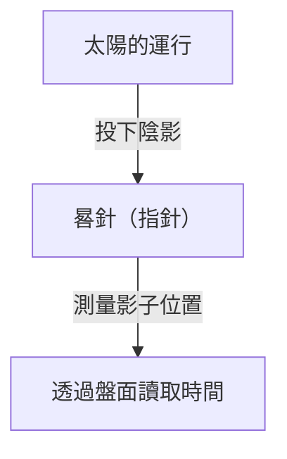
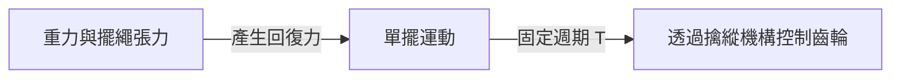
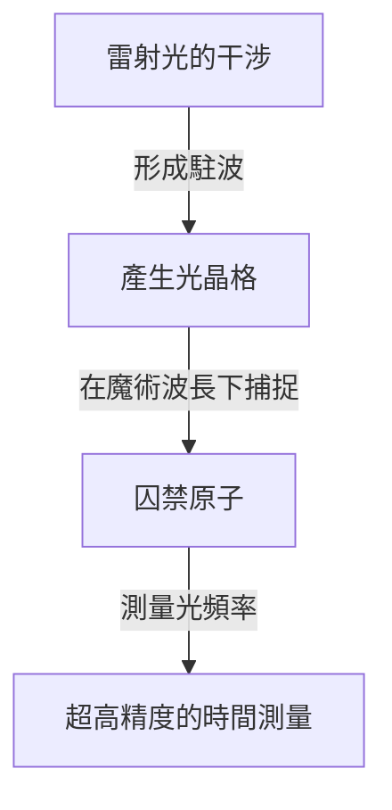

# 1. 時間測量的黎明期：從天體到日晷與水鐘

人類開始測量時間的最早手段，是觀察天體的運行。太陽的中天、月相的盈虧與群星的運行，都是用來掌握季節與一天時間的天然時鐘。

## 日晷的原理
大約在西元前3500年，古埃及與巴比倫開始使用日晷（方尖碑）。
藉由測量晷針（指針）的影子長度來劃分時間。

# 2. 機械鐘的誕生與單擺的等時性

在中世紀歐洲的修道院中，由於必須在固定的時間進行祈禱，因而發明了以重錘為動力的機械鐘。然而，當時一天的誤差仍高達數十分鐘。

## 伽利略與惠更斯
據說伽利略・伽利萊是在比薩大教堂看著晃動的吊燈時，發現了「單擺的等時性」。單擺的週期 $T$ 是由擺長 $l$ 與重力加速度 $g$ 決定：

$$ T = 2\pi \sqrt{\frac{l}{g}} $$

1656年，克里斯蒂安・惠更斯應用此原理，製作了第一座擺鐘。這使得每日誤差大幅縮減至數十秒以內。

# 3. 航海精密時計與經度的測量

在大航海時代，為了在海上準確得知自己船隻所在的經度，需要精準的時鐘。約翰・哈里森研發出能承受溫度變化與船隻搖晃的發條式航海精密時計「H4」，成功解決了經度問題。

# 4. 石英鐘的革命

進入20世紀後，利用壓電效應的水晶振盪器（石英）登場。當對石英晶體施加電壓時，它會以極為穩定的頻率（通常為 32,768 Hz）震動。

$$ f = \frac{1}{2l} \sqrt{\frac{E}{\rho}} $$
（$E$ 為楊氏模數，$\rho$ 為密度）

# 5. 原子鐘與相對論

作為比石英鐘更加精確的時鐘，利用原子能階躍遷的原子鐘被開發了出來。銫-133原子基態的兩個超精細能階之間躍遷所對應之輻射週期的 9,192,631,770 倍被定義為 1 秒。

## 愛因斯坦的相對論與時間膨脹
搭載於 GPS 衛星上的原子鐘，必須校正狹義相對論（因速度導致的時間變慢）與廣義相對論（因重力減弱導致的時間變快）的效應。

狹義相對論所造成的時間變慢：
$$ \Delta t' = \frac{\Delta t}{\sqrt{1 - \frac{v^2}{c^2}}} $$

# 6. 光晶格鐘：未來的時間基準

目前，超越銫原子鐘極限的「光晶格鐘」研究正在蓬勃發展。由香取秀俊教授等人構想出的這種時鐘，是將鍶等原子囚禁於由雷射構成的「光蛋盒」（光晶格）中，並同時測量數萬個原子的躍遷。

光晶格鐘的精度極高，即使經過宇宙年齡（約138億年）也不會產生1秒以上的誤差，這使得相對論大地測量（例如利用高度差異造成的重力變化，以數公分精度測量海拔標高等）成為可能。
