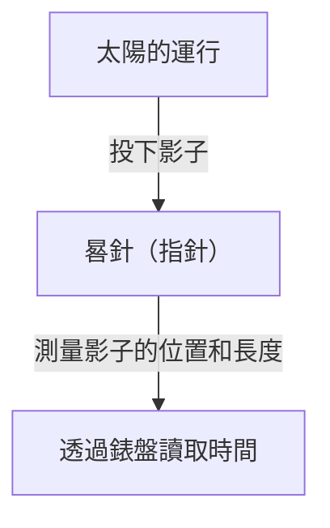
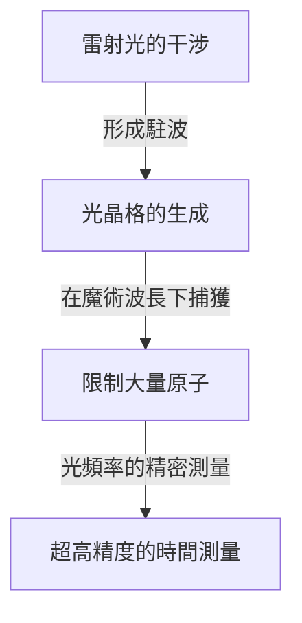

# 時間是什麼：人類與鐘錶無止境的探索

「時間」對我們人類來說，是既最親密又充滿最多謎團的概念之一。時間看不見、摸不著，但我們的生活卻完全被時間所支配。人類的歷史，就是一部不斷挑戰如何精確捕捉和測量這「時間」的連續劇。本文將從古代的日晷講起，直到運用最新量子技術的光晶格鐘，為您詳細解讀人類時間測量的歷史及其背後物理學的發展。

## 1. 時間測量的黎明期：天體運行與自然週期

人類測量時間最初的參考標準，是太陽、月亮和星星等天體的運行。從日出到日落的太陽軌跡、月亮的陰晴圓缺，以及季節的更替，對於農耕、狩獵和宗教儀式來說，都是不可或缺的資訊。

### 日晷與水鐘的誕生
大約在西元前3500年的古埃及和巴比倫，就已經開始使用「日晷（方尖碑）」。它的原理是透過測量垂直立在地面上的柱子（晷針）的影子長度和方向，來分割一天的時長。

然而，日晷有一個致命的缺點，即「在夜間或陰天無法使用」。為了彌補這一點而被發明出來的，是「水鐘（漏壺）」和「燃燒鐘（蠟燭鐘和線香鐘）」。這些工具利用水滴以恆定速度滴落的特性，或者物體燃燒的速度來測量時間，是不受天氣影響的革命性發明。

## 2. 機械鐘的誕生與「單擺的等時性」

進入中世紀的歐洲，為了在修道院規定的時間進行祈禱作為鬧鐘使用，發明了以重物（砝碼）為動力的「機械鐘」。早期的機械鐘使用稱為擒縱機構的裝置來控制齒輪的轉動，但它們很容易受到摩擦和溫度變化的影響，每天會產生多達幾十分鐘的誤差。

### 伽利略的發現與惠更斯的發明
使時間測量精度發生飛躍性提高的，是16世紀物理學家伽利略·伽利萊發現的「單擺的等時性」。單擺往復一次的時間，與擺幅和重量無關，僅由單擺的長度決定的這一法則，極大地改變了鐘錶的歷史。單擺的週期 $T$ 由長度 $l$ 和重力加速度 $g$ 表示如下：

$$ T = 2\pi \sqrt{\frac{l}{g}} $$

1656年，荷蘭科學家克里斯蒂安·惠更斯應用這一原理製作了世界上第一台「擺鐘」。由此，鐘錶的誤差急劇減少到每天幾十秒。

## 3. 大航海時代與經度問題：航海天文鐘的軌跡

18世紀的大航海時代，為了防止海難事故，了解自己船隻的準確位置（特別是經度）成為了國家級課題。緯度相對容易從太陽或北極星的高度測量得出，但要準確知道經度，就必須比較「出發地的準確時間」和「當前所在地的時間」。也就是說，需要一種能夠經受住船體搖晃和劇烈溫度變化、極其精確的便攜式鐘錶。

英國鐘錶匠約翰·哈里森傾盡一生致力於解決這個問題。他完成了用發條和擺輪（游絲）代替單擺的航海天文鐘「H4」。這使人類能夠安全地航行於世界各地的海洋，邁出了全球化的第一步。

## 4. 石英鐘革命：從機械到電子

進入20世紀，鐘錶的動力源從發條等機械裝置，轉變為電力和電子電路。起到決定性作用的是「石英鐘」的出現。

石英振盪器利用了「壓電效應」，即對石英施加電壓會使其變形，反之使其變形則會產生電壓。石英振子可以在特定頻率（鐘錶通常為 32,768 Hz）下極其穩定地振動。

$$ f = \frac{1}{2l} \sqrt{\frac{E}{\rho}} $$
（$E$ 是楊氏模量，$\rho$ 是密度）

1969年，日本精工（Seiko）推出了世界上第一款市售石英腕錶「Astron」。這使得任何人都能以低廉的價格買到每天誤差在1秒以下的超高精度鐘錶，引發了鐘錶產業的典範轉移。

## 5. 原子鐘與相對論：通向宇宙真理

石英鐘非常精確，但由於石英的個體差異和老化造成的微小誤差是不可避免的。於是科學家們開始尋找在宇宙任何地方都絕對不變的標準。那就是「原子」。

原子鐘以特定原子（主要是銫-133）吸收和釋放的微波頻率作為基準。目前，1秒的長度被嚴格定義為「銫-133原子基態的兩個超精細能階之間躍遷所對應的輻射週期的9,192,631,770倍」。這種精度令人驚嘆，數千萬年才會產生1秒的誤差。

### 相對論的修正
現代生活不可或缺的GPS（全球定位系統）依賴於人造衛星上搭載的原子鐘的精確時間資訊。然而，在這裡，愛因斯坦的相對論發揮了重要作用。

1. **狹義相對論（速度導致的時間膨脹）**：高速移動的衛星上的時鐘，比地面上的時鐘走得慢。
   $$ \Delta t' = \frac{\Delta t}{\sqrt{1 - \frac{v^2}{c^2}}} $$
2. **廣義相對論（重力導致的時間加快）**：處於地球重力較弱的太空中的衛星上的時鐘，比地面上的時鐘走得快。

如果不計算這兩種效應並不斷修正時鐘的運行，GPS的定位誤差在一天內就會達到幾公里。我們的智慧型手機夠顯示準確的位置，都要歸功於相對論。

## 6. 光晶格鐘：開拓未來的極限精度

目前，精度比銫原子鐘還要高出幾個數量級的「光晶格鐘（Optical Lattice Clock）」的研究正在世界各地推進。這種革命性的時鐘是由東京大學的香取秀俊教授等人於2001年提出的。

光晶格鐘的原理是，將鍶等原子捕獲在透過干涉雷射產生的光的微小空間（光晶格，也就是光的雞蛋盒）中，並同時測量數萬個原子的躍遷。

光晶格鐘的精度達到了「10的負18次方」，這是一種即使經過宇宙年齡約138億年也不會有1秒偏差的極限精度。
這種超高精度不僅用於測量時間，還有望被應用作探測「由高度引起的重力差異（時間流逝速度差異）」的感測器。例如，透過測量僅幾公分的海拔差帶來的時間偏差，地殼變動監測、地下資源勘探、火山噴發預測等全新的大地測量技術（相對論大地測量學）正在成為可能。

## 總結

人類時間測量的歷史，從使用日晷進行粗略分割開始，經歷單擺、發條、石英再到原子，是一場尋求更穩定「週期」的探索之旅。而現在，隨著光晶格鐘這一新的創新，時間正從單純的「被刻畫之物」，進化為讀取時空扭曲的「被探索之物」。在我們不經意間確認的「現在的時間」背後，隱藏著幾千年來人類的智慧與物理學宏大的戲劇。
