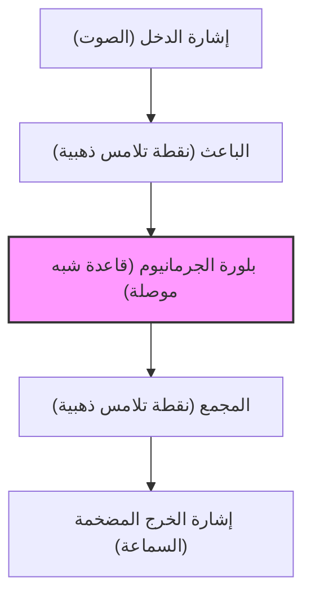

تحيط بنا الأجهزة الإلكترونية في كل مكان في حياتنا العصرية، من الهواتف الذكية إلى الحواسيب الفائقة، والسيارات، والأجهزة المنزلية. وفي قلب كل هذا توجد المكونات الإلكترونية الدقيقة لمعالجة وتخزين المعلومات، وهي "الترانزستورات". بدون الترانزستور، لم يكن ليوجد الإنترنت، ولا الذكاء الاصطناعي، ولا استكشاف الفضاء، ولا الطب الحديث المتقدم.

في هذا المقال، سنتعمق في التاريخ العظيم لكيفية نشأة هذا الترانزستور، والذي يُعد واحداً من أهم الاختراعات في تاريخ البشرية، وكيف تطور، وكيف أدى إلى ظهور "وادي السيليكون" الحالي كمركز للابتكار.

## 1. حدود الأنابيب المفرغة وحاجز شبكة الهاتف

قبل اختراع الترانزستور، كان "الأنبوب المفرغ" هو العنصر الأساسي في الأجهزة الإلكترونية. الأنبوب المفرغ هو جهاز يقوم بتضخيم التيار أو التبديل عن طريق تفريغ أنبوب زجاجي وتسخين فتيلة لإطلاق الإلكترونات. لعب الأنبوب المفرغ الثلاثي (أوديون)، الذي اخترعه لي دي فورست في عام 1906، دوراً مركزياً في البث الإذاعي والاتصالات الهاتفية المبكرة، وفي "ENIAC"، أول حاسوب إلكتروني للأغراض العامة في العالم.

ومع ذلك، كان للأنابيب المفرغة نقاط ضعف قاتلة:

1. **قصر العمر الافتراضي**: نظراً لاحتراق الفتيلة، كان الاستبدال الدوري أمراً ضرورياً. استخدم حاسوب ENIAC حوالي 18000 أنبوب مفرغ، لكنه كان يواجه مشكلة تعطل أحد الأنابيب المفرغة كل بضعة أيام، مما يؤدي إلى توقف النظام بأكمله.
2. **استهلاك هائل للطاقة**: كان من الضروري إبقاء الفتيلة مسخنة في درجة حرارة عالية طوال الوقت لإطلاق الإلكترونات الحرارية، مما يستهلك قدراً هائلاً من الطاقة.
3. **توليد الحرارة والحجم**: ولأنها كانت تولد كمية كبيرة من الحرارة، كانت هناك حاجة إلى معدات تبريد ضخمة. كما أن حجمها الفعلي كان كبيراً، وكان هناك حد لمدى إمكانية تصغير الأجهزة.

كان أكثر من عانى من قيود الأنابيب المفرغة هذه هي شركة AT&T (شركة الهاتف والتلغراف الأمريكية)، التي كانت تسيطر على شبكة الاتصالات الهاتفية في أمريكا، وقسم البحث والتطوير الخاص بها، **مختبرات بيل (Bell Laboratories)**.

في ذلك الوقت، استخدمت مقسمات الهاتف عشرات الآلاف من المرحلات الميكانيكية (مفاتيح الكهرومغناطيسية) لتوجيه الصوت، لكنها كانت بطيئة وكثيراً ما تعطلت بسبب تآكل نقاط التلامس. بالإضافة إلى ذلك، كانت هناك حاجة إلى العديد من مكررات الأنابيب المفرغة لتضخيم إشارات الهاتف بعيدة المدى، لكن دمج الأنابيب المفرغة في الكابلات البحرية كان صعباً للغاية بسبب مشاكل العمر الافتراضي واستهلاك الطاقة.

أدرك والتر جيفورد، رئيس شركة AT&T آنذاك، بشدة الحاجة إلى "مضخمات في "الحالة الصلبة" (Solid state) صغيرة ومتينة ومنخفضة استهلاك الطاقة لتحل محل المرحلات الميكانيكية والأنابيب المفرغة". كان هذا هو الدافع المباشر لتطوير الترانزستور.

## 2. مختبرات بيل والعباقرة الثلاثة

في عام 1945، مع نهاية الحرب العالمية الثانية، شكل مارفين كيلي، رئيس قسم الأبحاث في مختبرات بيل، فريقاً خاصاً، وهو "مجموعة فيزياء الحالة الصلبة"، لتطوير مضخم جديد. كان قلب هذا الفريق ثلاثة علماء سيحصلون لاحقاً على جائزة نوبل في الفيزياء.

*   **ويليام شوكلي (William Shockley)**: قائد الفريق. عالم فيزياء نظرية، ورغم تمتعه بحدس ورؤية استثنائيين، إلا أنه كان طموحاً ومحباً للظهور، وكان ذا شخصية تميل إلى إثارة المشاكل في العلاقات الإنسانية. قبل الحرب، كان قد بدأ في التفكير بفكرة مضخم باستخدام أشباه الموصلات (خاصة الجرمانيوم والسيليكون).
*   **جون باردين (John Bardeen)**: عالم فيزياء نظرية هادئ ومفكر. كان يمتلك معرفة عميقة بميكانيكا الكم وفيزياء الحالة الصلبة، وهو عبقري فاز لاحقاً بجائزة نوبل في الفيزياء ليس فقط لاختراعه الترانزستور، ولكن أيضاً لنظرية BCS للموصلية الفائقة (وهو الشخص الوحيد في التاريخ الذي فاز بجائزة نوبل في الفيزياء مرتين).
*   **والتر براتين (Walter Brattain)**: عالم فيزياء تجريبية ممتاز. كان خبيراً في تجميع النظريات وتحويلها إلى أجهزة فعلية، وكان ماهراً جداً بيده. بفضل شخصيته المشرقة والاجتماعية، أصبح شريكاً جيداً لباردين في العمل والحياة الخاصة.

في البداية، ابتكر شوكلي مضخماً من أشباه الموصلات يستخدم "تأثير المجال" (Field Effect). اعتقد أنه إذا تم تطبيق مجال كهربائي على سطح شبه موصل، فسيكون من الممكن التحكم في التيار الداخلي. ومع ذلك، وبغض النظر عن عدد المرات التي كرر فيها التجربة، لم يتم تضخيم التيار كما هو محسوب.

كان باردين هو من حل هذا اللغز. ففي ربيع عام 1947، اقترح مفهوماً جديداً يسمى "الحالات السطحية" (Surface States). وافترض أن هناك حالات تميل فيها الإلكترونات إلى الوقوع في فخاخ على سطح شبه الموصل، وهذا يعمل كدرع لإلغاء المجال الكهربائي الخارجي، بحيث لا يمكن أن يؤثر على الداخل.

## 3. شهر المعجزات: ولادة ترانزستور التلامس النقطي

بمجرد أن أوضحت نظرية باردين سبب الفشل، بدأت التجارب تتحرك في اتجاه جديد. يُطلق على الفترة التي استمرت لمدة شهر تقريباً من أواخر نوفمبر إلى ديسمبر 1947 اسم "شهر المعجزات". انغمس الثنائي باردين وبراتين في التجارب ليلاً ونهاراً.

لقد اعتقدوا أنه إذا اقتربت إبرتان معدنيتان (نقطتا تلامس) من بعضهما البعض للغاية وتلامستا مع سطح بلورة الجرمانيوم، فسيكون من الممكن التحكم في التيار مع تجنب تأثير الحالات السطحية.

في 16 ديسمبر 1947، قام براتين بتجميع جهاز تجريبي تاريخي. قام بربط رقائق الذهب بطرف إسفين بلاستيكي مثلث الشكل. ثم استخدم شفرة حلاقة لعمل شق في طرف رقاقة الذهب لإنشاء فجوة دقيقة جداً (حوالي 0.05 ملم)، مما أدى إلى إنشاء نقطتي تلامس. ثم تم ضغط هذا الإسفين على كتلة من الجرمانيوم بواسطة زنبرك (مشبك ورق معدل).

عندما تم إدخال إشارة صوتية في هذا الجهاز الذي يبدو خاماً، كانت إشارة الخرج أكبر بشكل واضح من إشارة الدخل. **تم تأكيد تأثير التضخيم.**

في 23 ديسمبر 1947، أقيم عرض توضيحي للمديرين التنفيذيين في مختبرات بيل. عندما تحدث براتين في الميكروفون، تم تشغيل الصوت الذي يمر عبر بلورة الجرمانيوم بصوت عالٍ وواضح من السماعة. كانت هذه هي اللحظة التي وُلد فيها أول "**ترانزستور تلامس نقطي**" (Point-contact transistor) في العالم.

هذا الجهاز الصغير لم يسخن مثل الأنابيب المفرغة، ولم يتطلب أي وقت إحماء، وكان يعمل على الفور. هذا الاختراع، الذي أُطلق عليه اسم "الترانزستور" اختصاراً لـ "مقاومة النقل"، سيغير تاريخ الإلكترونيات إلى الأبد.

## 4. هوس شوكلي: التطور إلى ترانزستور الوصلة

كان اختراع ترانزستور التلامس النقطي إنجازاً عظيماً لباردين وبراتين. ومع ذلك، لم يتمكن شوكلي، زعيم المجموعة، من أن يفرح بصدق بهذا النجاح. شعر بالغيرة الشديدة والعزلة لأنه لم يشارك بشكل مباشر في لحظة الاختراع الأكثر أهمية، ولأن باردين وبراتين أصبحا المخترعين الرئيسيين في براءة الاختراع.

"يجب أن أكون قادراً على صنع ترانزستور أفضل". عزل شوكلي نفسه في فندق وبدأ في بناء نظريته بتركيز كاد يصل إلى حد الجنون.

كان لترانزستور التلامس النقطي عيوب تتمثل في صعوبة الإنتاج الضخم وكثرة الضوضاء لأن الأداء يختلف اختلافاً كبيراً اعتماداً على ملامسة الإبر. ابتكر شوكلي هيكلاً جديداً يستخدم "الوصلة" داخل شبه الموصل، وليس تلامساً سطحياً.

وهو "**ترانزستور الوصلة**" (Junction transistor). أثبت رياضياً أنه من خلال وضع شبه موصل من النوع p (الشحنة الموجبة = الثقوب تحمل الكهرباء) وشبه موصل من النوع n (الشحنة السالبة = الإلكترونات تحمل الكهرباء) فوق بعضها البعض مثل الشطيرة (هيكل p-n-p أو n-p-n)، فمن الممكن تحقيق تضخيم أكثر استقراراً وعالي الكفاءة.

في عام 1951، وبفضل جهود جوردون تيل وآخرين في مختبرات بيل، تم تطوير تقنية لرفع بلورات أشباه الموصلات عالية النقاء، وتم تحقيق ترانزستور الوصلة كما كانت نظرية شوكلي. نظراً لأن ترانزستور الوصلة هذا كان منخفض الضوضاء ومناسباً للإنتاج الضخم، فقد حل بسرعة محل ترانزستور التلامس النقطي وأصبح منتشراً على نطاق واسع.

في عام 1956، حصل شوكلي وباردين وبراتين معاً على جائزة نوبل في الفيزياء "لأبحاثهم في أشباه الموصلات واكتشافهم لتأثير الترانزستور". ومع ذلك، خلف هذا المجد، كانت العلاقة بين الثلاثة قد تدهورت بالفعل لدرجة لا يمكن إصلاحها. لم يتمكن باردين وبراتين من تحمل موقف شوكلي المتغطرس وتركا العمل إلى قسم أبحاث آخر.

## 5. من الجرمانيوم إلى السيليكون: تحدي جوردون تيل

صُنعت كل الترانزستورات المبكرة من "الجرمانيوم". كان الجرمانيوم يتميز بسهولة المعالجة لأنه يذوب في درجات حرارة منخفضة نسبياً.

ومع ذلك، كان للجرمانيوم عيب قاتل. لقد كان "ضعيفاً أمام الحرارة". عندما تصل درجة الحرارة إلى حوالي 75 درجة مئوية، يفقد خصائصه كشبه موصل ويصبح مجرد موصل (معدن يسمح بتسرب التيار). نتيجة لذلك، ظهرت مشكلة حيث أصبحت أجهزة راديو الترانزستور المبكرة غير صالحة للاستعمال تماماً إذا تركت في سيارة في يوم صيفي حار. بالإضافة إلى ذلك، في التطبيقات العسكرية (مثل التحكم في الصواريخ)، كانت هذه الخاصية الحرارية السيئة قاتلة.

ولحل هذه المشكلة، لم يكن هناك خيار سوى تغيير المادة إلى "**السيليكون**"، والذي يمكنه تحمل درجات حرارة أعلى. السيليكون هو عنصر شائع جداً (المكون الرئيسي للرمل والكوارتز)، وهو الثاني بعد الأكسجين من حيث الوفرة في القشرة الأرضية، ولكن باستخدام تكنولوجيا ذلك الوقت، كان من الصعب للغاية إنشاء بلورات مفردة من السيليكون النقي بما يكفي لاستخدامها في الترانزستورات.

تصدى لهذا التحدي **جوردون تيل**، الذي كان قد انتقل إلى شركة تكساس إنسترومنتس (TI). بفضل استخدام تقنية نمو البلورات التي طورها خلال فترة وجوده في مختبرات بيل، نجح تيل أخيراً في إنشاء بلورات مفردة من السيليكون.

في عام 1954، في مؤتمر علمي، بينما كانت ترانزستورات الجرمانيوم من الشركات الأخرى توضع في الماء المغلي وتتوقف عن العمل واحداً تلو الآخر، أدهش تيل الحضور من خلال إظهار أن ترانزستور السيليكون الذي طورته شركته استمر في تشغيل الموسيقى بشكل طبيعي حتى في الماء المغلي. ومن هنا، انتقل الدور القيادي في أشباه الموصلات تماماً من الجرمانيوم إلى السيليكون، مما يمثل بداية "عصر السيليكون".

## 6. اختراع MOSFET والطريق إلى الدوائر المتكاملة (IC)

مع ظهور ترانزستورات الوصلة السيليكونية، تقدم تصغير الأجهزة الإلكترونية بشكل كبير، ولكن مع زيادة عدد الترانزستورات إلى المئات والآلاف، وصل العمل على لحامها بالأسلاك إلى حدوده (جدار الأسلاك).

تم حل هذا في عام 1958 عن طريق "**الدوائر المتكاملة (IC)**"، والتي تم اختراعها بشكل مستقل بواسطة جاك كيلبي (TI) وروبرت نويس (فيرتشايلد). كانت تقنية تقوم بدمج عدة ترانزستورات ومقاومات على شريحة سيليكون واحدة.

ومع ذلك، كانت الدوائر المتكاملة المبكرة لا تزال تستخدم ترانزستورات الوصلة (ثنائية القطب)، وبدأت تظهر حدود استهلاك الطاقة والتصغير.

وهنا عادت فكرة "ترانزستور تأثير المجال (FET)" التي حلم بها شوكلي في البداية ولكنها لم تتحقق بسبب جدار "الحالات السطحية" الذي اكتشفه باردين.

في عام 1959، اكتشف **محمد عطا الله (Mohamed Atalla)** و**داون كانج (Dawon Kahng)** من مختبرات بيل أنه من خلال الأكسدة الحرارية لسطح السيليكون لإنشاء طبقة عازلة رقيقة جداً من "ثاني أكسيد السيليكون (الزجاج)"، يمكن إبطال تأثير الحالات السطحية.

باستخدام هذه التقنية، اخترعوا "**MOSFET (ترانزستور تأثير المجال من أشباه الموصلات بأكسيد المعدن)**"، والذي يحتوي على بنية تتكون من طبقات من المعدن (Metal)، وطبقة الأكسيد (Oxide)، وشبه الموصل (Semiconductor).

مقارنة بترانزستورات الوصلة التقليدية، كان لدى MOSFET عملية تصنيع أبسط، واستهلاك طاقة أقل بكثير، وقبل كل شيء، خاصية رائعة تتمثل في أنه "يمكن تصغيره إلى الحد الأقصى". اليوم، تحتوي وحدات المعالجة المركزية (CPU) في هواتفنا الذكية وأجهزة الكمبيوتر الشخصية على مليارات بل وعشرات المليارات من أجهزة MOSFET هذه. لقد أصبح اختراع عطا الله وكانج بالفعل الأساس الحقيقي لمجتمعنا الرقمي الحديث.

## 7. "الخونة الثمانية" ونشأة وادي السيليكون

عند الحديث عن تاريخ تطور الترانزستور، لا تقل "دراما البشر" الذين حوّلوا هذه التقنيات إلى أعمال تجارية أهمية عن التقنية نفسها. كان مسرح ذلك وادي سانتا كلارا في كاليفورنيا، وهو ما يُعرف الآن باسم "**وادي السيليكون**".

في عام 1956، أسس شوكلي، الحائز على جائزة نوبل، شركته الخاصة "مختبر شوكلي لأشباه الموصلات"، وجعل من مسقط رأسه مدينة بالو ألتو بولاية كاليفورنيا مقراً لها. وقد استقطب العديد من العلماء والمهندسين الشباب البارزين من جميع أنحاء الولايات المتحدة. وكان من بينهم **روبرت نويس** و**جوردون مور**، اللذان أسسا شركة إنتل لاحقاً.

ومع ذلك، فبينما كان شوكلي عبقرياً كعالم، فقد كان الأسوأ كمدير. وبسبب شخصيته بجنون العظمة (الارتياب)، وإدارته الغريبة مثل محاولة وضع مرؤوسيه، الذين لم يثق بهم على الإطلاق، على جهاز كشف الكذب، وتضارب سياسات البحث (تمسكه بصمام ثنائي رباعي الطبقات معقد بدلاً من ترانزستورات السيليكون الواعدة)، أصبح جو العمل في أسوأ حالاته.

في سبتمبر 1957، قرر ثمانية من الباحثين الشباب المتميزين الذين نفد صبرهم أخيراً (بما في ذلك نويس ومور) ترك شوكلي. أطلق عليهم شوكلي غاضباً اسم "**الخونة الثمانية**" (Traitorous Eight).

بدعم من المستثمر آرثر روك، وتمويل من شركة فيرتشايلد للكاميرات والأجهزة، أسس الثمانية شركة "**فيرتشايلد لأشباه الموصلات**" (Fairchild Semiconductor).

وبفضل اختراع جان هورني لـ "**التقنية المستوية**" (Planar process) (وهي تقنية تستخدم طبقة أكسيد لحماية سطح السيليكون بشكل مسطح وطباعة الدائرة كما لو كانت صورة)، نمت فيرتشايلد بسرعة لتصبح أكبر شركة لأشباه الموصلات في العالم. كانت هذه التقنية المستوية هي طريقة التصنيع الثورية التي جعلت الإنتاج الضخم للدوائر المتكاملة اللاحقة أمراً ممكناً.

أصبحت فيرتشايلد لأشباه الموصلات الانفجار العظيم (Big Bang) الذي أدى إلى ظهور وادي السيليكون. وذلك لأن المهندسين المتميزين الذين اكتسبوا خبرة في فيرتشايلد، انفصلوا عنها واحداً تلو الآخر وأسسوا شركات ناشئة جديدة. ويطلق على هؤلاء اسم "أطفال فيرتشايلد" (Fairchildren).

العديد من الشركات التي تمثل وادي السيليكون اليوم، مثل شركة **Intel** التي أسسها روبرت نويس وجوردون مور، وشركة **AMD** التي أسسها جيري ساندرز، ترجع جذورها إلى "الخونة الثمانية" وشركة فيرتشايلد.

## 8. الخاتمة: ثورة هائلة أحدثتها قطعة صغيرة

في إحدى زوايا مختبرات بيل، من مشبك ورق، ورقاقة ذهب، وشظية جرمانيوم، وُلد "ترانزستور التلامس النقطي" الخشن، والذي تطور في غضون بضعة عقود فقط وبشكل مذهل إلى ترانزستورات الوصلة، والسيليكون، والدوائر المتكاملة، ثم MOSFET.

لقد حرر البشرية من اللعنة الحارة والضخمة للأنابيب المفرغة، وفتح عالماً يتم فيه معالجة المعلومات بسرعات عالية جداً وبتكلفة منخفضة كإشارات رقمية تتمثل في مفاتيح تشغيل/إيقاف (0 و 1).

لولا طموح شوكلي، وبريق نظرية باردين، والمهارات التجريبية الإلهية لبراتين، ولولا استقلال "الخونة الثمانية" الذين زرعوا بذور السيليكون في أرض كاليفورنيا، لكان المجتمع الرقمي الذي نتمتع به اليوم مختلفاً تماماً، أو ربما متأخراً بعقود.

إن تاريخ الترانزستور ليس مجرد تاريخ لتطور التكنولوجيا. إنه التاريخ الفعلي للغيرة، والطموح، والتمرد، وسعي الإنسان اللامتناهي لاختراق الحدود.

(تم)
