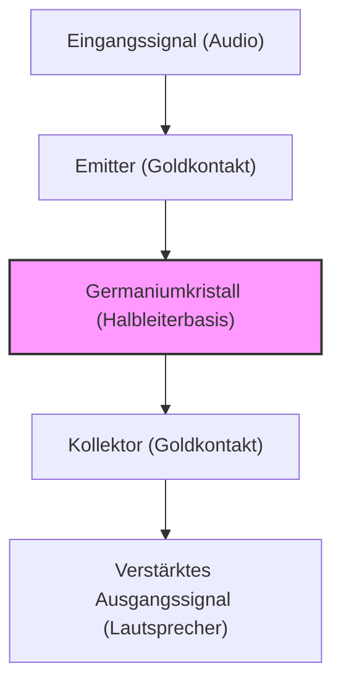

Unser modernes Leben ist von allen möglichen elektronischen Geräten umgeben, von Smartphones über Supercomputer und Autos bis hin zu Haushaltsgeräten. Im Zentrum all dieser Geräte steht der "Transistor", ein winziges elektronisches Bauteil zur Verarbeitung und Speicherung von Informationen. Ohne den Transistor gäbe es kein Internet, keine KI, keine Raumfahrt und keine hoch entwickelte moderne Medizin.

In diesem Artikel werden wir tief in die epische Geschichte eintauchen, wie der Transistor, eine der wichtigsten Erfindungen in der Geschichte der Menschheit, geboren wurde, wie er sich entwickelte und wie er das heutige "Silicon Valley", das Zentrum der Innovation, hervorbrachte.

## 1. Die Grenzen der Vakuumröhre und die Wand des Telefonnetzes

Vor der Erfindung des Transistors waren "Vakuumröhren" die Hauptakteure in elektronischen Geräten. Eine Vakuumröhre ist ein Gerät, das den Strom verstärkt oder schaltet, indem es in einem Glasrohr ein Vakuum erzeugt und einen Glühfaden erhitzt, um Elektronen zu emittieren. Die von Lee de Forest 1906 erfundene Trioden-Vakuumröhre (Audion) spielte eine zentrale Rolle im Rundfunk, in der frühen Telefonkommunikation und im "ENIAC", dem ersten universellen elektronischen Computer der Welt.

Die Vakuumröhre hatte jedoch entscheidende Schwächen:

1. **Kurze Lebensdauer**: Da der Glühfaden durchbrennt, war ein regelmäßiger Austausch unerlässlich. Der ENIAC verwendete etwa 18.000 Vakuumröhren, litt jedoch unter dem Problem, dass alle paar Tage irgendwo eine Vakuumröhre ausfiel und das gesamte System zum Stillstand kam.
2. **Enormer Stromverbrauch**: Um thermionische Elektronen zu emittieren, musste der Glühfaden ständig auf einer hohen Temperatur gehalten werden, was enorme Mengen an Strom verbrauchte.
3. **Wärmeentwicklung und Größe**: Da eine große Menge an Wärme erzeugt wurde, waren riesige Kühlanlagen erforderlich. Außerdem war die physikalische Größe groß, was der Miniaturisierung von Geräten Grenzen setzte.

Diejenigen, die sich am meisten über die Grenzen dieser Vakuumröhre ärgerten, waren AT&T (American Telephone and Telegraph Company), die das amerikanische Telefonnetz kontrollierte, und ihre Forschungs- und Entwicklungsabteilung, die **Bell Laboratories (Bell Labs)**.

Die damaligen Telefonvermittlungen verwendeten Zehntausende von mechanischen Relais (elektromagnetische Schalter), um Sprache zu leiten, aber sie waren langsam und fielen häufig aufgrund von Kontaktverschleiß aus. Außerdem wurden viele Vakuumröhren-Repeater benötigt, um Ferngesprächssignale zu verstärken, aber der Einbau von Vakuumröhren in U-Boot-Kabel war aufgrund von Lebensdauer- und Energieproblemen extrem schwierig.

Walter Gifford, der damalige Präsident von AT&T, erkannte stark die Notwendigkeit eines "Festkörper"-Verstärkers (Solid State), der klein, robust und stromsparend sein sollte, um mechanische Relais und Vakuumröhren zu ersetzen. Dies war die direkte Motivation für die Entwicklung des Transistors.

## 2. Bell Labs und drei Genies

1945, nach dem Ende des Zweiten Weltkriegs, stellte Mervin Kelly, der Leiter der Forschungsabteilung der Bell Labs, ein spezielles Team, die "Solid State Physics Group", zusammen, um einen neuen Verstärker zu entwickeln. Den Kern dieses Teams bildeten drei Wissenschaftler, die später gemeinsam den Nobelpreis für Physik erhalten sollten.

*   **William Shockley**: Der Leiter des Teams. Er war ein theoretischer Physiker mit außergewöhnlicher Intuition und Einsicht, aber er war auch ehrgeizig, geltungsbedürftig und hatte eine Persönlichkeit, die in menschlichen Beziehungen leicht Wellen schlug. Er hatte schon vor dem Krieg an der Idee eines Verstärkers mit Halbleitern (insbesondere Germanium und Silizium) gearbeitet.
*   **John Bardeen**: Ein schweigsamer und nachdenklicher theoretischer Physiker. Er verfügte über tiefgreifende Kenntnisse der Quantenmechanik und Festkörperphysik und ist ein Genie, das später nicht nur für die Erfindung des Transistors, sondern auch für die BCS-Theorie der Supraleitung den Nobelpreis für Physik erhielt (der einzige Mensch in der Geschichte, der den Physikpreis zweimal gewann).
*   **Walter Brattain**: Ein brillanter Experimentalphysiker. Er war ein Meister darin, Theorien zu realen Geräten zusammenzubauen, und hatte sehr geschickte Hände. Mit seiner fröhlichen und geselligen Art wurde er ein guter Partner für Bardeen, sowohl beruflich als auch privat.

Shockley entwarf zunächst einen Halbleiterverstärker, der den "Feldeffekt" (Field Effect) nutzte. Er dachte, dass er durch Anlegen eines elektrischen Feldes an die Oberfläche eines Halbleiters den Strom im Inneren steuern könnte. Doch egal, wie oft er das Experiment wiederholte, der Strom wurde nie so verstärkt wie berechnet.

Es war Bardeen, der dieses Rätsel löste. Im Frühjahr 1947 schlug er das neue Konzept der "Oberflächenzustände" (Surface States) vor. Er theoretisierte, dass es auf der Oberfläche von Halbleitern Zustände gibt, in denen Elektronen leicht eingefangen werden können, die wie ein Schild wirken und äußere elektrische Felder aufheben, sodass sie das Innere nicht beeinflussen können.

## 3. Der wundersame Monat: Die Geburt des Spitzentransistors

Mit Bardeens Theorie, die die Ursache des Fehlers aufdeckte, begannen die Experimente in eine neue Richtung zu gehen. Der etwa einmonatige Zeitraum von Ende November bis Dezember 1947 wird als "der wundersame Monat" bezeichnet. Das Duo Bardeen und Brattain vertiefte sich Tag und Nacht in Experimente.

Sie dachten, dass sie durch das extrem nahe Aneinanderbringen und Berühren von zwei Metallnadeln (Kontakten) auf der Oberfläche eines Germaniumkristalls den Einfluss der Oberflächenzustände umgehen und den Strom steuern könnten.

Am 16. Dezember 1947 baute Brattain eine historische Versuchsanordnung zusammen. Er befestigte Goldfolie an der Spitze eines dreieckigen Kunststoffkeils. Dann machte er mit einer Rasierklinge einen Schnitt in die Spitze der Goldfolie, um einen sehr feinen Spalt (etwa 0,05 Millimeter) zu schaffen, und stellte so zwei Kontakte her. Er drückte diesen Keil mit einer Feder (einer modifizierten Büroklammer) gegen einen Germaniumblock.

Als ein Audiosignal in dieses primitiv aussehende Gerät eingespeist wurde, war das Signal auf der Ausgangsseite deutlich größer als am Eingang. **Die Verstärkungswirkung war bestätigt.**

Am 23. Dezember 1947 fand eine Vorführung für die Führungskräfte der Bell Labs statt. Als Brattain in ein Mikrofon sprach, wurde die durch den Germaniumkristall geleitete Stimme laut und deutlich aus dem Lautsprecher wiedergegeben. Dies war der Moment, in dem der weltweit erste "**Spitzentransistor**" (Point-contact transistor) geboren wurde.

Dieses kleine Gerät wurde nicht heiß wie eine Vakuumröhre, benötigte keine Aufwärmzeit und funktionierte sofort. Diese Erfindung, die als Abkürzung für "Transfer Resistor" (Übertragungswiderstand) "Transistor" genannt wurde, sollte die Geschichte der Elektronik für immer verändern.

## 4. Shockleys Besessenheit: Die Entwicklung zum Flächentransistor

Die Erfindung des Spitzentransistors war eine großartige Leistung von Bardeen und Brattain. Doch Shockley, der Leiter der Gruppe, konnte sich über diesen Erfolg nicht ehrlich freuen. Er empfand starke Eifersucht und Entfremdung darüber, dass er im wichtigsten Moment der Erfindung nicht direkt involviert war und dass Bardeen und Brattain die Haupterfinder auf dem Patent wurden.

"Ich sollte in der Lage sein, einen noch besseren Transistor zu bauen." Shockley schloss sich in ein Hotel ein und begann mit fast schon wahnsinniger Konzentration, eine Theorie zu konstruieren.

Der Spitzentransistor hatte die Nachteile, dass seine Leistung je nach Kontakt der Nadeln stark variierte, was die Massenproduktion erschwerte, und dass er rauschte. Shockley entwarf eine neue Struktur, die nicht den Oberflächenkontakt, sondern den "Übergang" (Junction) im Inneren des Halbleiters nutzte.

Dies ist der "**Flächentransistor**" (Junction transistor). Er bewies mathematisch, dass durch sandwichartiges Übereinanderschichten von p-Typ-Halbleitern (positive Ladung = Löcher leiten Strom) und n-Typ-Halbleitern (negative Ladung = Elektronen leiten Strom) (p-n-p- oder n-p-n-Struktur) eine viel stabilere und hocheffizientere Verstärkung möglich wäre.

1951 wurde dank der Bemühungen von Gordon Teal und anderen in den Bell Labs eine Technologie entwickelt, um hochreine Halbleiterkristalle zu ziehen, und der Flächentransistor wurde genau nach Shockleys Theorie realisiert. Dieser Flächentransistor war rauscharm und für die Massenproduktion geeignet, sodass er den Spitzentransistor rasch ersetzte und sich weit verbreitete.

1956 erhielten die drei Männer Shockley, Bardeen und Brattain gemeinsam den Nobelpreis für Physik für "Forschungen an Halbleitern und die Entdeckung des Transistoreffekts". Hinter diesem Ruhm war die Beziehung zwischen den dreien jedoch bereits irreparabel abgekühlt. Bardeen und Brattain konnten Shockleys selbstgerechte Haltung nicht mehr ertragen und verließen das Unternehmen, um in andere Forschungsabteilungen zu gehen.

## 5. Von Germanium zu Silizium: Gordon Teals Herausforderung

Frühe Transistoren wurden alle aus dem Material "Germanium" hergestellt. Germanium hatte den Vorteil, dass es relativ leicht zu verarbeiten war, da es bei einer relativ niedrigen Temperatur schmolz.

Germanium hatte jedoch eine fatale Schwäche. Es ist "hitzeempfindlich". Bei Temperaturen von etwa 75 Grad Celsius verliert es seine Halbleitereigenschaften und wird zu einem einfachen Leiter (einem Metall, das Strom durchlässt). Dies führte zu dem Problem, dass frühe Transistorradios völlig unbrauchbar wurden, wenn sie an einem heißen Sommertag im Auto liegen gelassen wurden. Auch bei militärischen Anwendungen (wie der Raketensteuerung) war diese schlechte Temperaturcharakteristik fatal.

Um dieses Problem zu lösen, blieb nichts anderes übrig, als das Material auf "**Silizium**" (Silicon) umzustellen, das höheren Temperaturen standhalten konnte. Silizium ist ein häufiges Element (der Hauptbestandteil von Sand und Quarz), das nach Sauerstoff in großen Mengen in der Erdkruste vorkommt, aber mit der damaligen Technologie war es extrem schwierig, extrem reine Siliziumeinkristalle herzustellen, die für Transistoren verwendet werden konnten.

Dieser Herausforderung stellte sich **Gordon Teal**, der zu Texas Instruments (TI) gewechselt war. Teal nutzte die in seiner Zeit bei Bell Labs entwickelten Kristallzüchtungstechnologien in vollem Umfang und schaffte es schließlich, einen Siliziumeinkristall herzustellen.

Als 1954 auf einer Konferenz Germaniumtransistoren verschiedener Unternehmen in kochendes Wasser gelegt wurden und einer nach dem anderen den Betrieb einstellte, verblüffte Teal das Publikum mit einer Demonstration, bei der die selbst entwickelten Siliziumtransistoren seines Unternehmens selbst in kochendem Wasser ruhig weiter Musik spielten. Ab hier verlagerte sich die Hauptrolle der Halbleiter vollständig von Germanium zu Silizium, und das "Siliziumzeitalter" brach an.

## 6. Die Erfindung des MOSFET und der Weg zum IC

Mit dem Aufkommen der Silizium-Flächentransistoren schritt die Miniaturisierung elektronischer Geräte stark voran, aber als die Anzahl der Transistoren auf Hunderte oder Tausende anstieg, stieß das Verlöten mit Drähten an seine Grenzen (die Wand der Verdrahtung).

Dieses Problem wurde durch den "**Integrierte Schaltkreis**" (IC, Integrated Circuit) gelöst, der 1958 unabhängig voneinander von Jack Kilby (TI) und Robert Noyce (Fairchild) erfunden wurde. Es war eine Technologie, um mehrere Transistoren und Widerstände in einem Rutsch auf einem einzigen Siliziumchip zu bauen.

Allerdings verwendeten frühe ICs immer noch (bipolare) Flächentransistoren, und die Grenzen des Stromverbrauchs und der Miniaturisierung begannen sich abzuzeichnen.

Hier wird die Idee des "Feldeffekttransistors (FET)" wiederbelebt, von der Shockley ursprünglich geträumt hatte, die aber an der Wand von Bardeens "Oberflächenzuständen" gescheitert war.

1959 entdeckten **Mohamed Atalla** und **Dawon Kahng** an den Bell Labs, dass der Effekt der Oberflächenzustände neutralisiert werden konnte, indem die Oberfläche des Siliziums thermisch oxidiert wurde, um einen ultradünnen Isolierfilm aus "Siliziumdioxid (Glas)" zu erzeugen.

Mit dieser Technologie erfanden sie den "**MOSFET**" (Metall-Oxid-Halbleiter-Feldeffekttransistor) mit einer Struktur, in der Metall (Metal), Oxidfilm (Oxide) und Halbleiter (Semiconductor) übereinander geschichtet sind.

Im Vergleich zu herkömmlichen Flächentransistoren hat der MOSFET einen einfacheren Herstellungsprozess, einen um Größenordnungen geringeren Stromverbrauch und vor allem die wunderbare Eigenschaft, "bis an die Grenze miniaturisiert werden zu können". Heutzutage sind Milliarden oder Zehnmilliarden dieser MOSFETs in den CPUs unserer Smartphones und PCs untergebracht. Die Erfindung von Atalla und Kahng wurde zum wahren Fundament der modernen digitalen Gesellschaft.

## 7. Die "Traitorous Eight" und die Geburt des Silicon Valley

Wenn man über die Geschichte der Entwicklung des Transistors spricht, ist das Drama der "Menschen", die diese Technologien zum Geschäft gemacht haben, genauso wichtig wie die Technologie selbst. Die Bühne dafür war das Santa Clara Valley in Kalifornien, das heutige "**Silicon Valley**".

Der Nobelpreisträger Shockley gründete 1956 sein eigenes Unternehmen, das "Shockley Semiconductor Laboratory", mit Sitz in Palo Alto, Kalifornien, seiner Heimatstadt. Er rekrutierte nach und nach brillante junge Wissenschaftler und Ingenieure aus den ganzen Vereinigten Staaten. Unter ihnen waren **Robert Noyce** und **Gordon Moore**, die später Intel gründen sollten.

Doch so sehr Shockley ein Genie als Wissenschaftler war, so sehr war er ein schrecklicher Manager. Seine paranoide Persönlichkeit, sein exzentrisches Management, das versuchte, Untergebene an Lügendetektoren anzuschließen, ohne ihnen überhaupt zu vertrauen, und sein Konflikt über die Forschungsrichtung (er beharrte auf einer komplexen Vierschichtdiode anstelle des vielversprechenden Siliziumtransistors) brachten die Arbeitsatmosphäre auf einen absoluten Tiefpunkt.

Im September 1957 riss acht brillanten jungen Forschern (darunter Noyce und Moore) schließlich der Geduldsfaden und sie beschlossen, Shockley zu verlassen. Shockley war wütend und nannte sie die "**Acht Verräter**" (Traitorous Eight).

Die acht Männer gründeten mit Unterstützung des Investors Arthur Rock und Finanzierung durch die Fairchild Camera and Instrument Corporation "**Fairchild Semiconductor**".

Fairchild wuchs im Handumdrehen zum weltbesten Halbleiterunternehmen heran, bewaffnet mit dem von Jean Hoerni erfundenen "**Planarprozess**" (Planar process) (eine Technologie, die einen Oxidfilm verwendet, um die Siliziumoberfläche flach zu schützen und Schaltkreise wie beim Fotodruck einzubrennen). Genau diese Planartechnologie war die revolutionäre Herstellungsmethode, die die spätere Massenproduktion von ICs ermöglichte.

Und Fairchild Semiconductor war der "Urknall" des Silicon Valley. Die brillanten Ingenieure, die bei Fairchild Erfahrungen sammelten, gliederten sich nach und nach aus und gründeten neue Start-up-Unternehmen. Diese werden die "Fairchildren" genannt.

Viele der Unternehmen, die heute das Silicon Valley repräsentieren, wie **Intel**, gegründet von Robert Noyce und Gordon Moore, und **AMD**, gegründet von Jerry Sanders, haben ihre Wurzeln in den "Acht Verrätern" und Fairchild.

## 8. Fazit: Eine gigantische Revolution, ausgelöst durch ein winziges Bauteil

Der ungeschickte "Spitzentransistor", der aus einer Büroklammer, Goldfolie und einem Stück Germanium in einer Ecke der Bell Labs geboren wurde, hat in nur wenigen Jahrzehnten eine erstaunliche Entwicklung zu Flächentransistoren, Silizium, ICs und MOSFETs durchlaufen.

Er befreite die Menschheit von dem heißen, riesigen Fluch der Vakuumröhren und eröffnete eine Welt, in der Informationen als digitale Signale von "Schalter EIN/AUS (0 und 1)" extrem schnell und kostengünstig verarbeitet werden.

Ohne Shockleys Ehrgeiz, ohne Bardeens theoretische Brillanz, ohne Brattains göttliches experimentelles Geschick und ohne die "acht Verräter", die sich unabhängig machten und den Samen des Siliziums in Kalifornien säten, wäre die digitale Gesellschaft, die wir heute genießen, völlig anders verlaufen oder vielleicht um Jahrzehnte verzögert worden.

Die Geschichte des Transistors ist nicht nur die Geschichte der technologischen Evolution. Es ist die Geschichte der endlosen Suche der Menschheit, getrieben von Eifersucht, Ehrgeiz, Rebellion und dem Drang, Grenzen zu überschreiten.

(Ende)
