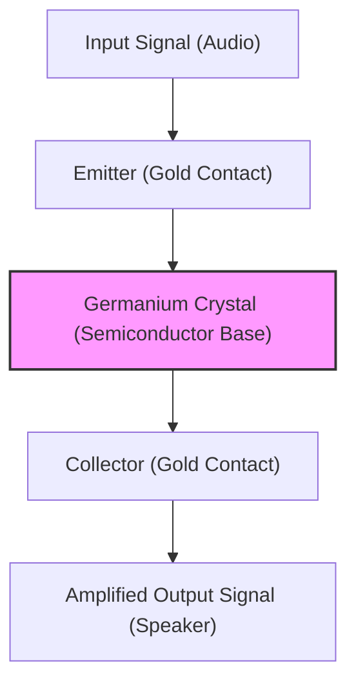

Modern life is surrounded by electronic devices, from smartphones to supercomputers, automobiles, and home appliances. At the center of all these is the "transistor," a microscopic electronic component for processing and storing information. Without transistors, the internet, AI, space exploration, and modern advanced medicine would not exist.

In this article, we will delve deep into the epic history of how the transistor—one of the most important inventions in human history—was born, how it developed, and how it created "Silicon Valley," today's epicenter of innovation.

## 1. The Limits of Vacuum Tubes and the Wall of the Telephone Network

Before the invention of the transistor, the stars of electronic equipment were "vacuum tubes." A vacuum tube is a device that amplifies current or acts as a switch by evacuating a glass tube and heating a filament to emit electrons. The triode vacuum tube (Audion), invented by Lee de Forest in 1906, played a central role in radio broadcasting, early telephone communications, and "ENIAC," the world's first general-purpose electronic computer.

However, vacuum tubes had fatal weaknesses.

1. **Short Lifespan**: Since the filaments would burn out, regular replacement was essential. ENIAC used about 18,000 vacuum tubes, but it suffered from the problem that every few days a vacuum tube somewhere would fail, bringing the entire system to a halt.
2. **Huge Power Consumption**: Filaments had to be kept hot at all times to emit thermionic electrons, consuming a massive amount of power.
3. **Heat Generation and Size**: Because they emitted a large amount of heat, massive cooling equipment was required. Additionally, their physical size was large, which limited the miniaturization of devices.

The organizations most troubled by the limits of these vacuum tubes were AT&T (American Telephone and Telegraph Company), which dominated the American telephone communications network, and its research and development division, **Bell Laboratories**.

Telephone exchanges of the time used tens of thousands of mechanical relays (electromagnetic switches) to route audio, but they were slow and frequently failed due to contact wear. In addition, many vacuum tube repeaters were needed to amplify signals for long-distance telephone calls, but incorporating vacuum tubes into submarine cables and the like was extremely difficult due to lifespan and power issues.

Walter Gifford, then president of AT&T, was acutely aware of the need for a "small, robust, and low-power 'solid-state' amplifier to replace mechanical relays and vacuum tubes." This became the direct motivation for transistor development.

## 2. Bell Labs and the Three Geniuses

In 1945, at the end of World War II, Mervin Kelly, head of research at Bell Labs, formed a special team called the "Solid State Physics Group" to develop a new amplifier. The core of this team was three scientists who would later jointly receive the Nobel Prize in Physics.

*   **William Shockley**: The leader of the team. A theoretical physicist with extraordinary intuition and insight, but he was also ambitious, egotistical, and had a personality prone to creating friction in relationships. Since before the war, he had been harboring the idea of an amplifier using semiconductors (especially germanium and silicon).
*   **John Bardeen**: A quiet and thoughtful theoretical physicist. A genius with deep knowledge of quantum mechanics and solid-state physics, who would later win the Nobel Prize in Physics not only for the invention of the transistor but also for the BCS theory of superconductivity (the only person in history to win the Physics Prize twice).
*   **Walter Brattain**: An outstanding experimental physicist. A master at assembling theory into real-world devices, and extremely dexterous. With his bright and sociable personality, he became a good partner for Bardeen both publicly and privately.

Shockley initially devised a semiconductor amplifier that utilized the "Field Effect." He thought that if an electric field was applied to the surface of a semiconductor, the internal current could be controlled. However, no matter how many times he repeated the experiments, the current was never amplified as calculated.

It was Bardeen who solved this mystery. In the spring of 1947, he proposed a new concept called "Surface States." He theorized that there is a state on the surface of a semiconductor where electrons are easily captured, and this acts as a shield, canceling out external electric fields so they cannot affect the inside.

## 3. A Month of Miracles: The Birth of the Point-Contact Transistor

With the cause of failure revealed by Bardeen's theory, the experiments began to move in a new direction. The period of about a month from late November to December 1947 is known as the "Month of Miracles." The duo of Bardeen and Brattain devoted themselves to experiments day and night.

They thought that if two metal needles (contacts) were brought extremely close together and placed in contact with the surface of a germanium crystal, they might be able to bypass the effects of the surface states and control the current.

On December 16, 1947, Brattain assembled a historic experimental apparatus. He glued gold foil to the tip of a plastic triangular wedge. He then used a razor blade to cut a slit at the tip of the gold foil, leaving an extremely narrow gap (about 0.05 millimeters), creating two contacts. He pressed this wedge against a block of germanium using a spring (a modified paper clip).

When an audio signal was input into this primitive-looking device, the signal on the output side was clearly larger than the input. **Amplification had been confirmed.**

On December 23, 1947, a demonstration was held for Bell Labs executives. When Brattain spoke into a microphone, the audio that passed through the germanium crystal was played back loudly and clearly from a speaker. This was the moment the world's first "**Point-contact transistor**" was born.

This tiny device didn't get hot like a vacuum tube, required no warm-up time, and operated instantly. Named "transistor" as an abbreviation for "transfer resistor," this invention would forever change the history of electronics.

## 4. Shockley's Tenacity: Evolution to the Junction Transistor

The invention of the point-contact transistor was a great achievement for Bardeen and Brattain. However, Shockley, the group's leader, could not simply rejoice in this success. He felt an intense jealousy and sense of alienation because he was not directly involved in the most important moment of the invention, and because Bardeen and Brattain became the lead inventors on the patent.

"I can make a better transistor." Shockley locked himself in a hotel room and began constructing theories with an almost madness-like concentration.

The point-contact transistor had the drawback of its performance varying greatly depending on the contact condition of the needles, making it difficult to mass-produce and prone to noise. Shockley devised a new structure that utilized the internal "junction" of the semiconductor rather than surface contact.

That was the "**Junction transistor**". He mathematically proved that by sandwiching p-type semiconductors (where positive charges = holes carry electricity) and n-type semiconductors (where negative charges = electrons carry electricity) together like a sandwich (p-n-p or n-p-n structure), much more stable and highly efficient amplification would be possible.

In 1951, through the efforts of Gordon Teal and others at Bell Labs, technology for pulling high-purity semiconductor crystals was developed, and the junction transistor was realized just as Shockley had theorized. Because this junction transistor had low noise and was suitable for mass production, it rapidly replaced the point-contact type and spread.

In 1956, the three men, Shockley, Bardeen, and Brattain, jointly received the Nobel Prize in Physics "for their researches on semiconductors and their discovery of the transistor effect." Behind this glory, however, the relationship among the three had already cooled beyond repair. Unable to stand Shockley's self-righteous attitude, Bardeen and Brattain left for other research departments.

## 5. From Germanium to Silicon: Gordon Teal's Challenge

Early transistors were all made using "germanium" as the material. Germanium had the advantage of melting at relatively low temperatures, making it easy to process.

However, germanium had a fatal weakness. It is "vulnerable to heat." When the temperature reaches about 75 degrees Celsius, it loses its properties as a semiconductor and becomes a mere conductor (a metal that leaks current profusely). Because of this, a problem arose where early transistor radios left inside a car on a hot summer day would become completely useless. Also, in military applications (such as missile control), this poor temperature characteristic was fatal.

To solve this problem, there was no choice but to change the material to "**Silicon**", which can withstand higher temperatures. Silicon is an abundant element that exists in huge quantities in the Earth's crust, second only to oxygen (the main component of sand and quartz), but with the technology of the time, creating a single crystal of extremely high-purity silicon suitable for transistors was a daunting task.

Taking on this challenge was **Gordon Teal**, who had transferred to Texas Instruments (TI). Teal made full use of the crystal growth technology he had cultivated during his time at Bell Labs and finally succeeded in creating a silicon single crystal.

In 1954, at an academic conference where other companies' germanium transistors stopped working one after another when placed in hot water, Teal astounded the audience by demonstrating his company's newly developed silicon transistor continuing to play music unbothered even in hot water. From this point on, the leading role in semiconductors completely switched from germanium to silicon, and the "Silicon Age" began.

## 6. The Invention of MOSFET and the Path to the IC

The advent of the junction silicon transistor greatly advanced the miniaturization of electronic devices, but as the number of transistors grew to hundreds and thousands, the task of soldering them with wiring reached its limit (the tyranny of numbers).

This was solved by the "**Integrated Circuit (IC)**", invented independently by Jack Kilby (TI) and Robert Noyce (Fairchild) in 1958. It was a technology for fabricating multiple transistors and resistors together on a single silicon chip.

However, the early ICs still used junction (bipolar) transistors, and the limits of power consumption and miniaturization were beginning to show.

Here, Shockley's idea of the "Field Effect Transistor (FET)," which he had dreamed of at first but could not realize due to the wall of Bardeen's "surface states," was revived.

In 1959, **Mohamed Atalla** and **Dawon Kahng** of Bell Labs discovered that by thermally oxidizing the surface of silicon to create an ultra-thin insulating film of "silicon dioxide (glass)", the influence of surface states could be neutralized.

Using this technology, they invented the "**MOSFET (Metal-Oxide-Semiconductor Field-Effect Transistor)**", which has a structure layering metal, oxide, and semiconductor.

Compared to conventional junction transistors, MOSFETs had a simpler manufacturing process, used orders of magnitude less power, and above all, had the wonderful characteristic of being able to be "miniaturized to the limit." Today, the CPUs in our smartphones and PCs are packed with tens of billions, even hundreds of billions of these MOSFETs. The invention by Atalla and Kahng became the true foundation of modern digital society.

## 7. The "Traitorous Eight" and the Birth of Silicon Valley

When talking about the history of transistor evolution, the drama of the "people" who elevated these technologies into businesses is just as important as the technology itself. The stage for this was the Santa Clara Valley in California, today's "**Silicon Valley**".

Nobel laureate Shockley established his own company, "Shockley Semiconductor Laboratory," in 1956 and set up its base in his hometown of Palo Alto, California. He scouted brilliant young scientists and engineers from all over the United States one after another. Among them were **Robert Noyce** and **Gordon Moore**, who would later found Intel.

However, while Shockley was a genius as a scientist, he was terrible as a manager. His paranoid personality, his eccentric management such as not trusting his subordinates at all and trying to put them on lie detectors, and conflicts over research direction (sticking to complex four-layer diodes instead of promising silicon transistors) caused the workplace atmosphere to plunge into the worst possible state.

In September 1957, having finally reached the end of their patience, eight brilliant young researchers (including Noyce and Moore) decided to leave Shockley. Shockley was furious and called them the "**Traitorous Eight**".

With the backing of investor Arthur Rock and funding from Fairchild Camera and Instrument Corporation, these eight men established "**Fairchild Semiconductor**".

Fairchild, armed with the "**Planar process**" invented by Jean Hoerni (a technology that uses an oxide film to protect and flatten the silicon surface and print circuits onto it like photographic printing), grew into a world-leading semiconductor company in the blink of an eye. This planar technology was the revolutionary manufacturing method that enabled the subsequent mass production of ICs.

And Fairchild Semiconductor became the "Big Bang" of Silicon Valley. This is because the brilliant engineers who gained experience at Fairchild subsequently spun out one after another to launch new venture companies. They are called the "Fairchildren".

Many of the companies that represent Silicon Valley today, such as **Intel**, founded by Robert Noyce and Gordon Moore, and **AMD**, founded by Jerry Sanders, trace their roots back to the "Traitorous Eight" and Fairchild.

## 8. Conclusion: A Giant Revolution Brought by a Tiny Component

In a corner of Bell Labs, the clumsy "point-contact transistor" born from a paperclip, gold foil, and a shard of germanium underwent astonishing evolution over just a few decades—into the junction type, silicon, ICs, and MOSFETs.

It liberated humanity from the hot, gigantic curse of the vacuum tube and opened up a world where information is processed extremely fast and cheaply as digital signals of "switch ON/OFF (0 and 1)".

If it were not for Shockley's ambition, if not for Bardeen's theoretical flash of genius, if not for Brattain's god-like experimental skills, and if the "Traitorous Eight" had not independently sown the seeds of silicon in the land of California, the digital society we enjoy today would have been completely different, or perhaps decades delayed.

The history of the transistor is not simply a history of technological evolution. It is the very history of jealousy, ambition, rebellion, and humanity's endless quest to break through limits.

(End)
