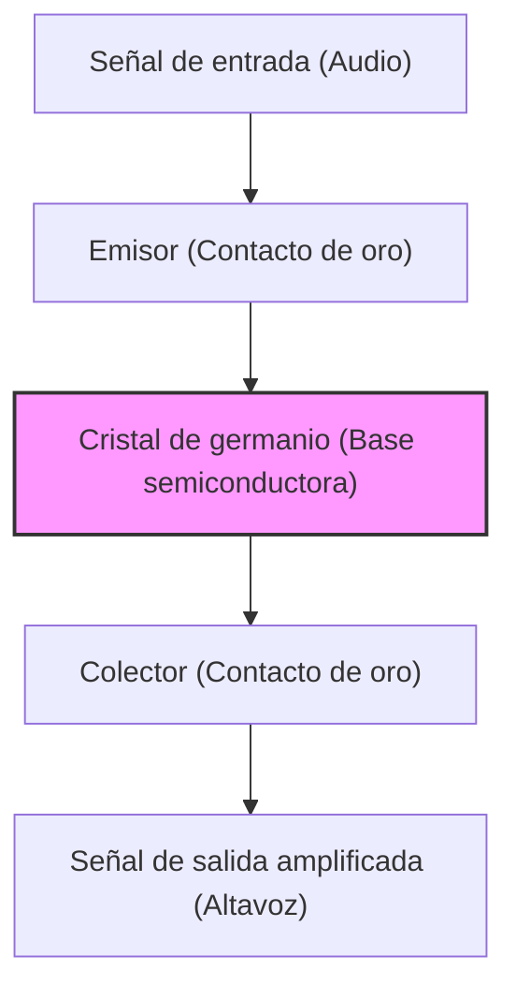

Nuestra vida moderna está rodeada de todo tipo de dispositivos electrónicos, desde teléfonos inteligentes hasta supercomputadoras, automóviles y electrodomésticos. En el centro de todo esto se encuentra el "transistor", un componente electrónico microscópico para procesar y almacenar información. Sin el transistor, el Internet, la IA, la exploración espacial y la medicina avanzada moderna no existirían.

En este artículo, profundizaremos en la épica historia de cómo nació el transistor, uno de los inventos más importantes en la historia de la humanidad, y cómo evolucionó para crear el actual "Silicon Valley", el centro de la innovación.

## 1. Los límites del tubo de vacío y el muro de la red telefónica

Antes de la invención del transistor, el protagonista de los dispositivos electrónicos era el "tubo de vacío". El tubo de vacío es un dispositivo que amplifica la corriente o hace de interruptor creando un vacío en un tubo de vidrio y calentando un filamento para emitir electrones. El tubo de vacío de tres electrodos (Audion), inventado por Lee De Forest en 1906, jugó un papel central en la radiodifusión, las primeras comunicaciones telefónicas y la "ENIAC", la primera computadora electrónica de propósito general del mundo.

Sin embargo, el tubo de vacío tenía debilidades críticas.

1. **Corta vida útil**: Debido a que el filamento se quemaba, el reemplazo regular era esencial. La ENIAC utilizaba alrededor de 18,000 tubos de vacío, pero sufría el problema de que un tubo de vacío fallaba en alguna parte cada pocos días, deteniendo todo el sistema.
2. **Enorme consumo de energía**: Era necesario mantener siempre el filamento calentado a altas temperaturas para emitir electrones térmicos, lo que consumía una enorme cantidad de energía.
3. **Generación de calor y tamaño**: Debido a que emitía una gran cantidad de calor, requería un sistema de enfriamiento masivo. Además, el tamaño físico era grande, limitando la miniaturización del equipo.

Los que más sufrían por estas limitaciones de los tubos de vacío eran AT&T (American Telephone and Telegraph Company), que controlaba la red de comunicaciones telefónicas estadounidense, y su división de investigación y desarrollo, **Laboratorios Bell (Bell Laboratories)**.

Las centrales telefónicas de la época utilizaban decenas de miles de relés mecánicos (interruptores electromagnéticos) para enrutar las voces, pero operaban lentamente y fallaban con frecuencia debido al desgaste de los contactos. Además, se necesitaban muchos repetidores de tubos de vacío para amplificar las señales telefónicas de larga distancia, pero incorporar tubos de vacío en cables submarinos era extremadamente difícil debido a problemas de vida útil y energía.

Walter Gifford, el presidente de AT&T en ese momento, reconoció firmemente la necesidad de un "amplificador de 'estado sólido (solid state)' pequeño, resistente y de bajo consumo que reemplazara a los relés mecánicos y los tubos de vacío". Esta fue la motivación directa para el desarrollo del transistor.

## 2. Los Laboratorios Bell y los tres genios

En 1945, tras el fin de la Segunda Guerra Mundial, Mervin Kelly, director de investigación de los Laboratorios Bell, formó un equipo especial de "Física del Estado Sólido" para desarrollar un nuevo amplificador. El núcleo de este equipo fueron tres científicos que más tarde compartirían el Premio Nobel de Física.

*   **William Shockley**: El líder del equipo. Un físico teórico con extraordinaria intuición y perspicacia, pero por otro lado, era ambicioso, con un fuerte deseo de destacar, y tenía una personalidad propensa a causar fricciones en las relaciones humanas. Había estado madurando la idea de un amplificador usando semiconductores (especialmente germanio o silicio) desde antes de la guerra.
*   **John Bardeen**: Un físico teórico reservado y reflexivo. Un genio con un profundo conocimiento de la mecánica cuántica y la física del estado sólido, que más tarde ganaría el Premio Nobel de Física no solo por la invención del transistor, sino también por la teoría BCS de la superconductividad (la única persona en la historia en ganar el premio de física dos veces).
*   **Walter Brattain**: Un excelente físico experimental. Un maestro en ensamblar la teoría en dispositivos reales y muy hábil con sus manos. Con su personalidad brillante y sociable, se convirtió en un buen compañero para Bardeen, tanto en el trabajo como en privado.

Al principio, Shockley ideó un amplificador de semiconductores utilizando el "Efecto de Campo (Field Effect)". Pensó que al aplicar un campo eléctrico a la superficie de un semiconductor, se debería poder controlar la corriente en su interior. Sin embargo, no importaba cuántas veces se repitiera el experimento, la corriente nunca se amplificó como se calculó.

Bardeen fue quien resolvió este misterio. En la primavera de 1947, propuso un nuevo concepto llamado "Estados Superficiales (Surface States)". Teorizó que existen estados en la superficie de un semiconductor donde los electrones se capturan fácilmente, y que esto actúa como un escudo, anulando el campo eléctrico externo para que no pueda afectar el interior.

## 3. El mes milagroso: El nacimiento del transistor de contacto puntual

Dado que la causa del fallo fue revelada por la teoría de Bardeen, el experimento comenzó a moverse en una nueva dirección. El período de aproximadamente un mes desde finales de noviembre hasta diciembre de 1947 se llama "El mes milagroso". El dúo Bardeen y Brattain se sumergió en experimentos día y noche.

Pensaron que si acercaban y ponían en contacto dos agujas de metal (contactos) de manera extremadamente cercana en la superficie de un cristal de germanio, podrían evitar la influencia de los estados superficiales y controlar la corriente.

El 16 de diciembre de 1947, Brattain construyó un dispositivo experimental histórico. Pegó papel de oro en la punta de una cuña triangular de plástico. Luego, hizo una hendidura en la punta de ese papel de oro con una hoja de afeitar para crear un espacio ultrafino (aproximadamente 0.05 milímetros), creando dos contactos. Presionó esta cuña contra un bloque de germanio usando un resorte (un clip de papel modificado).

Al introducir una señal de audio en este dispositivo de aspecto crudo, la señal del lado de salida era claramente mayor que la entrada. **Se confirmó el efecto de amplificación.**

El 23 de diciembre de 1947, se llevó a cabo una demostración reuniendo a los ejecutivos de los Laboratorios Bell. Cuando Brattain habló por el micrófono, la voz que pasó a través del cristal de germanio se reprodujo fuerte y clara a través de un altavoz. Este fue el momento en que nació el primer "**transistor de contacto puntual (Point-contact transistor)**" del mundo.

Este pequeño dispositivo funcionaba instantáneamente, no se calentaba como un tubo de vacío y no requería tiempo de calentamiento. Este invento, llamado "transistor" como abreviatura de "resistor de transferencia (transfer resistor)", cambiaría la historia de la electrónica para siempre.

## 4. La obsesión de Shockley: La evolución hacia el transistor de unión

La invención del transistor de contacto puntual fue el gran logro de Bardeen y Brattain. Sin embargo, Shockley, el líder del grupo, no podía alegrarse sinceramente de este éxito. Sintió intensos celos y alienación de que no estuviera directamente involucrado en el momento del invento más importante y que Bardeen y Brattain se convirtieran en los principales inventores en la patente.

"Debería poder hacer un transistor mucho mejor yo mismo". Shockley se encerró en un hotel y comenzó a construir una teoría con una concentración casi loca.

El transistor de contacto puntual tenía la desventaja de que su rendimiento variaba enormemente dependiendo de cómo las agujas hicieran contacto, lo que dificultaba su producción en masa y generaba mucho ruido. Shockley ideó una nueva estructura que no utilizaba contacto superficial, sino las "uniones (junctions)" dentro del semiconductor.

Ese es el "**transistor de unión (Junction transistor)**". Demostró matemáticamente que al superponer un semiconductor de tipo p (las cargas positivas = los huecos transportan electricidad) y un semiconductor de tipo n (las cargas negativas = los electrones transportan electricidad) como un sándwich (estructura p-n-p o n-p-n), sería posible una amplificación mucho más estable y altamente eficiente.

En 1951, gracias a los esfuerzos de Gordon Teal y otros en los Laboratorios Bell, se desarrolló la tecnología para extraer cristales de semiconductores de alta pureza, y el transistor de unión se realizó tal como lo teorizó Shockley. Este transistor de unión tenía menos ruido y era adecuado para la producción en masa, por lo que reemplazó rápidamente al tipo de contacto puntual y se generalizó.

En 1956, Shockley, Bardeen y Brattain compartieron el Premio Nobel de Física por sus "investigaciones sobre semiconductores y el descubrimiento del efecto transistor". Sin embargo, detrás de esta gloria, la relación de los tres ya se había enfriado más allá de la reparación. Bardeen y Brattain, incapaces de soportar la actitud moralista de Shockley, se marcharon a otros departamentos de investigación.

## 5. Del germanio al silicio: El desafío de Gordon Teal

Los primeros transistores estaban todos hechos de "germanio" como material. El germanio tenía la ventaja de ser fácil de procesar porque se derretía a una temperatura relativamente baja.

Sin embargo, el germanio tenía una debilidad fatal. Era "sensible al calor". Cuando la temperatura alcanzaba unos 75 grados centígrados, perdía sus propiedades como semiconductor y se convertía en un simple conductor (un metal que dejaba escapar la corriente por todas partes). Por esta razón, ocurrió el problema de que, si una de las primeras radios de transistores se dejaba dentro de un automóvil en un caluroso día de verano, se volvía completamente inútil. Además, en aplicaciones militares (como el control de misiles), esta pobre característica térmica era fatal.

Para resolver este problema, la única opción era cambiar el material a "**silicio (silicon)**", que podía soportar temperaturas más altas. El silicio es un elemento común y abundante en la corteza terrestre después del oxígeno (el componente principal de la arena y el cuarzo), pero con la tecnología de la época, crear monocristales de silicio con una pureza extremadamente alta que pudiera usarse para transistores era una tarea sumamente difícil.

Quien asumió este difícil desafío fue **Gordon Teal**, que se había mudado a Texas Instruments (TI). Utilizando la tecnología de crecimiento de cristales que cultivó durante sus días en los Laboratorios Bell, Teal finalmente logró crear un monocristal de silicio.

En 1954, en una conferencia académica donde los transistores de germanio de varias compañías se colocaron en agua hirviendo y dejaron de funcionar uno tras otro, Teal realizó una demostración donde su transistor de silicio desarrollado internamente continuó reproduciendo música tranquilamente incluso en agua hirviendo, asombrando a la audiencia. A partir de aquí, el papel principal de los semiconductores cambió por completo del germanio al silicio, marcando el inicio de la "era del silicio".

## 6. La invención del MOSFET y el camino hacia el circuito integrado (CI)

Con la aparición de los transistores de unión de silicio, la miniaturización de los equipos electrónicos avanzó considerablemente, pero a medida que el número de transistores aumentaba a cientos o miles, el trabajo de soldarlos con cables alcanzó su límite (el muro del cableado).

Esto fue resuelto por el "**circuito integrado (CI / IC)**", inventado de forma independiente por Jack Kilby (TI) y Robert Noyce (Fairchild) en 1958. Era una tecnología para fabricar múltiples transistores y resistencias de forma conjunta en un solo chip de silicio.

Sin embargo, los primeros CI todavía usaban transistores de unión (bipolares), y los límites del consumo de energía y la miniaturización comenzaron a ser visibles.

Aquí de nuevo, revivió la idea del "Transistor de Efecto de Campo (FET)", con la que Shockley había soñado primero pero que no pudo realizar, bloqueado por el muro de los "estados superficiales" de Bardeen.

En 1959, **Mohamed Atalla** y **Dawon Kahng** de los Laboratorios Bell descubrieron que el efecto de los estados superficiales podía anularse mediante la oxidación térmica de la superficie del silicio para crear una película aislante ultrafina de "dióxido de silicio (vidrio)".

Usando esta tecnología, inventaron el "**MOSFET (Transistor de Efecto de Campo de Semiconductor de Óxido Metálico)**", que tenía una estructura de capas de metal, óxido y semiconductor.

En comparación con los transistores de unión convencionales, el MOSFET tenía un proceso de fabricación más simple, consumía una magnitud de energía mucho menor y, sobre todo, tenía la maravillosa característica de poder hacerse "extremadamente pequeño". Hoy en día, miles de millones o decenas de miles de millones de estos MOSFETs están empaquetados dentro de las CPU de nuestros teléfonos inteligentes y PC. El invento de Atalla y Kahng se convirtió en la verdadera base de la sociedad digital moderna.

## 7. Los "8 traidores" y el nacimiento de Silicon Valley

Al contar la historia de la evolución del transistor, el drama de las "personas" que elevaron estas tecnologías a negocios es tan importante como la tecnología en sí. El escenario de esto fue el Valle de Santa Clara en California, el actual "**Silicon Valley**".

El ganador del Premio Nobel, Shockley, estableció su propia empresa, "Shockley Semiconductor Laboratory", en 1956 y basó sus operaciones en su ciudad natal de Palo Alto, California. Reclutó a jóvenes científicos e ingenieros brillantes de todo Estados Unidos, uno tras otro. Entre ellos se encontraban **Robert Noyce** y **Gordon Moore**, quienes más tarde fundarían Intel.

Sin embargo, mientras Shockley era un genio como científico, era un desastre como gerente. Su personalidad paranoica, su gestión anormal como tratar de poner a sus subordinados en detectores de mentiras sin confiar en ellos en absoluto, y el conflicto sobre las políticas de investigación (su obsesión con diodos complejos de 4 capas en lugar de prometedores transistores de silicio), causaron que el ambiente en el lugar de trabajo cayera en el peor estado.

En septiembre de 1957, la paciencia finalmente se agotó y ocho brillantes jóvenes investigadores (incluyendo a Noyce y Moore) decidieron dejar a Shockley. Shockley se enfureció y los llamó los "**8 traidores (Traitorous Eight)**".

Estos ocho hombres, con el apoyo del inversor Arthur Rock y fondos de Fairchild Camera and Instrument Corporation, fundaron "**Fairchild Semiconductor**".

Fairchild, armada con el "**proceso Planar (Planar process)**" inventado por Jean Hoerni (una tecnología que usa una película de óxido para aplanar y proteger la superficie de silicio, y quemar el circuito como en la impresión fotográfica), creció rápidamente para convertirse en la principal empresa de semiconductores del mundo en un abrir y cerrar de ojos. Este proceso Planar fue el revolucionario método de fabricación que permitió la posterior producción masiva de CI.

Y Fairchild Semiconductor se convirtió en el "Big Bang" de Silicon Valley. Esto se debió a que los brillantes ingenieros que ganaron experiencia en Fairchild se independizaron uno tras otro para iniciar nuevas empresas. A estos se les llama "Fairchildren".

Muchas de las empresas que representan a Silicon Valley en la actualidad, como **Intel** fundada por Robert Noyce y Gordon Moore, y **AMD** fundada por Jerry Sanders, tienen sus raíces en los "8 traidores" y Fairchild.

## 8. Conclusión: La gigantesca revolución provocada por un componente diminuto

En un rincón de los Laboratorios Bell, el torpe "transistor de contacto puntual" nacido de un clip, pan de oro y un fragmento de germanio, experimentó una evolución asombrosa al tipo de unión, silicio, CI y luego MOSFET en tan solo unas pocas décadas.

Liberó a la humanidad de la maldición ardiente y masiva de los tubos de vacío y abrió un mundo donde la información se procesa de manera extremadamente rápida y barata como señales digitales de "ENCENDIDO/APAGADO de un interruptor (0 y 1)".

Si no hubiera sido por la ambición de Shockley, la inspiración teórica de Bardeen, las milagrosas habilidades experimentales de Brattain, y si los "8 traidores" no se hubieran independizado y plantado las semillas de silicio en la tierra de California, la sociedad digital que disfrutamos hoy habría sido completamente diferente, o se habría retrasado décadas.

La historia del transistor no es solo una historia de evolución tecnológica. Es la historia en sí de los celos, la ambición, la rebelión y el espíritu inquisitivo e interminable humano que intenta superar sus límites.

(Fin)
