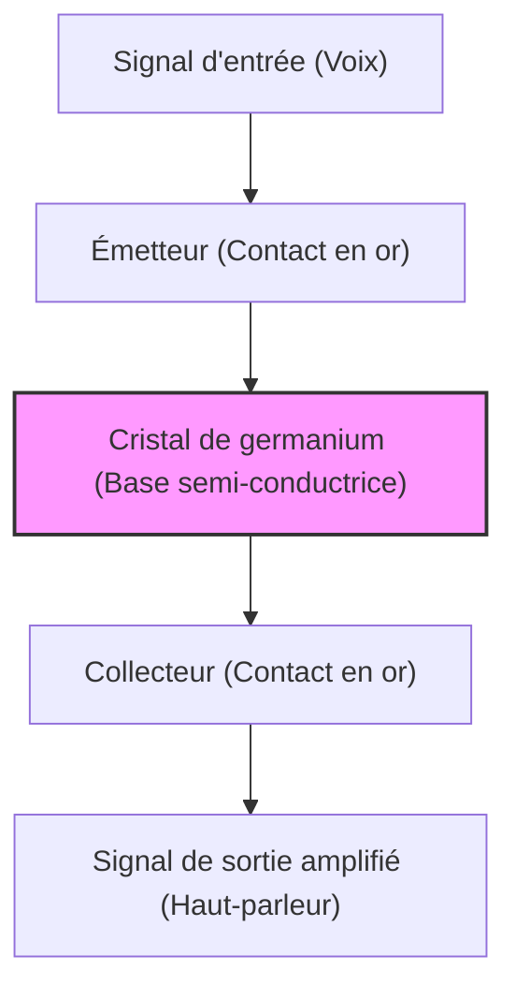

Notre vie moderne, des smartphones aux superordinateurs, en passant par les voitures et les appareils électroménagers, est entourée d'équipements électroniques. Au cœur de tout cela se trouve le "transistor", un minuscule composant électronique qui traite et mémorise l'information. Sans le transistor, il n'y aurait ni Internet, ni IA, ni exploration spatiale, ni médecine moderne avancée.

Dans cet article, nous allons explorer en profondeur l'histoire épique de l'une des inventions les plus importantes de l'histoire de l'humanité, le transistor, de sa naissance à son développement et à la création de la "Silicon Valley" moderne, centre mondial de l'innovation.

## 1. Les limites des tubes à vide et le mur du réseau téléphonique

Avant l'invention du transistor, les "tubes à vide" étaient les vedettes de l'électronique. Un tube à vide est un dispositif qui permet d'amplifier et de commuter le courant en faisant le vide dans un tube de verre et en chauffant un filament pour émettre des électrons. Le tube à vide triode (Audion), inventé par Lee De Forest en 1906, a joué un rôle central dans les émissions de radio, les premières communications téléphoniques et le premier ordinateur électronique universel au monde, l'"ENIAC".

Cependant, les tubes à vide présentaient des faiblesses rédhibitoires.

1. **Durée de vie courte** : Le filament brûlait, rendant un remplacement régulier indispensable. L'ENIAC utilisait environ 18 000 tubes à vide, mais souffrait du fait que tous les quelques jours, un tube tombait en panne quelque part, arrêtant le système entier.
2. **Consommation d'énergie énorme** : Il fallait maintenir en permanence le filament à haute température pour émettre des électrons thermiques, ce qui consommait une quantité massive d'énergie.
3. **Génération de chaleur et taille** : Émettant beaucoup de chaleur, d'énormes équipements de refroidissement étaient nécessaires. De plus, leur taille physique importante limitait la miniaturisation des appareils.

Ceux qui étaient les plus préoccupés par ces limites des tubes à vide étaient AT&T (American Telephone & Telegraph), qui dominait le réseau téléphonique américain, et son département de recherche et développement, les **Laboratoires Bell (Bell Laboratories)**.

Les centraux téléphoniques de l'époque utilisaient des dizaines de milliers de relais mécaniques (interrupteurs électromagnétiques) pour acheminer la voix, mais ils étaient lents et tombaient fréquemment en panne à cause de l'usure des contacts. De plus, de nombreux répéteurs à tubes à vide étaient nécessaires pour amplifier les signaux téléphoniques à longue distance, mais intégrer des tubes à vide dans des câbles sous-marins était extrêmement difficile en raison des problèmes de durée de vie et d'alimentation.

Walter Gifford, le président d'AT&T de l'époque, était fortement conscient de la nécessité d'un amplificateur "à l'état solide (solid-state)" compact, robuste et à faible consommation, pour remplacer les relais mécaniques et les tubes à vide. Ce fut la motivation directe du développement du transistor.

## 2. Les Laboratoires Bell et les trois génies

En 1945, à la fin de la Seconde Guerre mondiale, Mervin Kelly, directeur de recherche aux Laboratoires Bell, forma un groupe spécial "Physique de l'état solide" pour développer un nouvel amplificateur. Au cœur de cette équipe se trouvaient trois scientifiques qui allaient plus tard partager le prix Nobel de physique.

*   **William Shockley** : Le chef de l'équipe. Physicien théoricien doté d'une intuition et d'une perspicacité exceptionnelles, il était cependant d'un tempérament ambitieux, avide d'attention et prompt à créer des conflits interpersonnels. Il mûrissait l'idée d'un amplificateur utilisant des semi-conducteurs (en particulier le germanium et le silicium) depuis avant la guerre.
*   **John Bardeen** : Un physicien théoricien taciturne et réfléchi. Doté de profondes connaissances en mécanique quantique et en physique de l'état solide, c'était un génie qui a plus tard remporté le prix Nobel de physique non seulement pour l'invention du transistor, mais aussi pour la théorie BCS de la supraconductivité (la seule personne de l'histoire à avoir remporté le prix de physique deux fois).
*   **Walter Brattain** : Un physicien expérimental exceptionnel. Maître dans l'art d'assembler des théories en dispositifs réels, il était extrêmement adroit. D'un tempérament joyeux et sociable, il est devenu un excellent partenaire pour Bardeen, tant sur le plan professionnel que personnel.

Shockley a d'abord conçu un amplificateur à semi-conducteur utilisant l'"effet de champ (Field Effect)". Il pensait qu'en appliquant un champ électrique à la surface d'un semi-conducteur, il pourrait contrôler le courant interne. Cependant, malgré de nombreuses expériences, le courant n'était jamais amplifié comme calculé.

C'est Bardeen qui a résolu ce mystère. Au printemps 1947, il a proposé le nouveau concept d'"états de surface (Surface States)". Il a théorisé qu'il existe un état à la surface du semi-conducteur où les électrons sont facilement capturés, agissant comme un bouclier qui annule le champ électrique externe, l'empêchant d'affecter l'intérieur.

## 3. Le mois des miracles : La naissance du transistor à contact ponctuel

La théorie de Bardeen ayant clarifié la cause de l'échec, les expériences ont pris une nouvelle direction. La période d'environ un mois, de fin novembre à décembre 1947, est appelée le "mois des miracles". Le duo Bardeen et Brattain s'est plongé dans les expériences jour et nuit.

Ils ont pensé qu'en rapprochant extrêmement près deux pointes métalliques (contacts) sur la surface d'un cristal de germanium, ils pourraient éviter l'influence des états de surface et contrôler le courant.

Le 16 décembre 1947, Brattain assemble un dispositif expérimental historique. Il colle une feuille d'or à la pointe d'un coin en plastique triangulaire. Ensuite, avec une lame de rasoir, il incise la pointe de la feuille d'or pour créer un espace extrêmement fin (environ 0,05 millimètre), formant deux contacts. Il presse ce coin contre un bloc de germanium à l'aide d'un ressort (un trombone modifié).

Lorsqu'un signal vocal était entré dans ce dispositif d'apparence rudimentaire, le signal de sortie était clairement plus important que l'entrée. **L'effet d'amplification était confirmé.**

Le 23 décembre 1947, une démonstration a eu lieu en présence des dirigeants des Laboratoires Bell. Lorsque Brattain a parlé dans le microphone, la voix qui avait traversé le cristal de germanium a été reproduite de manière forte et claire par le haut-parleur. Ce fut le moment de la naissance du premier "**transistor à contact ponctuel (Point-contact transistor)**" au monde.

Ce petit dispositif fonctionnait instantanément, sans chauffer comme un tube à vide et sans nécessiter de temps de préchauffage. Abrégé de "transfer resistor" (résistance de transfert) en "transistor", cette invention allait changer l'histoire de l'électronique à jamais.

## 4. L'obsession de Shockley : L'évolution vers le transistor à jonction

L'invention du transistor à contact ponctuel était une grande réussite pour Bardeen et Brattain. Cependant, Shockley, le chef du groupe, ne pouvait pas se réjouir sincèrement de ce succès. Il éprouvait une intense jalousie et un sentiment d'aliénation du fait qu'il n'avait pas été directement impliqué au moment de l'invention la plus importante, et que les principaux inventeurs du brevet étaient Bardeen et Brattain.

"Je devrais être capable de fabriquer un transistor encore meilleur." Shockley s'est enfermé dans un hôtel et a commencé à élaborer des théories avec une concentration frisant la folie.

Le transistor à contact ponctuel présentait des inconvénients : il était difficile à produire en série et très bruyant car ses performances variaient considérablement selon le contact de la pointe. Shockley a conçu une nouvelle structure qui n'utilisait pas le contact de surface, mais la "jonction" interne du semi-conducteur.

C'est le "**transistor à jonction (Junction transistor)**". Il a prouvé mathématiquement qu'en superposant un semi-conducteur de type p (charges positives = trous transportant l'électricité) et un semi-conducteur de type n (charges négatives = électrons transportant l'électricité) comme un sandwich (structure p-n-p ou n-p-n), une amplification beaucoup plus stable et très efficace devenait possible.

En 1951, grâce aux efforts de Gordon Teal et d'autres aux Laboratoires Bell, la technologie d'étirage de cristaux semi-conducteurs de haute pureté a été développée, réalisant le transistor à jonction tel que théorisé par Shockley. Comme ce transistor à jonction était peu bruyant et adapté à la production de masse, il a rapidement remplacé le type à contact ponctuel.

En 1956, Shockley, Bardeen et Brattain ont partagé le prix Nobel de physique "pour leurs recherches sur les semi-conducteurs et leur découverte de l'effet transistor". Cependant, derrière cette gloire, la relation entre les trois hommes s'était déjà refroidie au-delà de toute réparation. Incapables de supporter l'attitude dominatrice de Shockley, Bardeen et Brattain sont partis vers d'autres départements de recherche.

## 5. Du germanium au silicium : Le défi de Gordon Teal

Tous les premiers transistors étaient fabriqués avec du "germanium" comme matériau. Le germanium présentait l'avantage d'être facile à traiter car il fond à une température relativement basse.

Cependant, le germanium avait une faiblesse fatale : il était "sensible à la chaleur". Lorsque la température atteignait environ 75 degrés, il perdait ses propriétés de semi-conducteur et devenait un simple conducteur (un métal laissant fuir le courant). De ce fait, si une des premières radios à transistors était laissée dans une voiture par une chaude journée d'été, elle devenait complètement inutilisable. De plus, pour les applications militaires (comme le contrôle des missiles), ces mauvaises caractéristiques thermiques étaient fatales.

Pour résoudre ce problème, il fallait changer de matériau pour le "**silicium (silicon)**", capable de supporter des températures plus élevées. Le silicium est l'élément le plus abondant dans la croûte terrestre après l'oxygène (composant principal du sable et du quartz), mais avec la technologie de l'époque, il était extrêmement difficile de produire un monocristal de silicium d'une pureté suffisante pour être utilisé dans un transistor.

Ce défi a été relevé par **Gordon Teal**, qui avait rejoint Texas Instruments (TI). En utilisant la technologie de croissance cristalline qu'il avait cultivée aux Laboratoires Bell, Teal a finalement réussi à créer un monocristal de silicium.

En 1954, lors d'une conférence scientifique où les transistors en germanium des différentes entreprises cessaient de fonctionner les uns après les autres lorsqu'ils étaient plongés dans l'eau bouillante, Teal a stupéfié l'auditoire en faisant une démonstration où le transistor en silicium développé par son entreprise continuait à jouer de la musique calmement même dans l'eau bouillante. C'est à partir de là que le rôle principal des semi-conducteurs est complètement passé du germanium au silicium, marquant le début de l'"ère du silicium".

## 6. L'invention du MOSFET et la route vers le circuit intégré (CI)

L'avènement du transistor à jonction au silicium a grandement favorisé la miniaturisation des appareils électroniques, mais à mesure que le nombre de transistors passait à des centaines et des milliers, le travail consistant à les souder avec des fils atteignait ses limites (le mur du câblage).

Ce problème a été résolu par le "**circuit intégré (CI)**", inventé indépendamment en 1958 par Jack Kilby (TI) et Robert Noyce (Fairchild). Il s'agissait d'une technologie permettant de fabriquer simultanément plusieurs transistors et résistances sur une seule puce de silicium.

Cependant, les premiers CI utilisaient encore des transistors à jonction (bipolaires), et les limites en termes de consommation d'énergie et de miniaturisation commençaient à se faire sentir.

C'est là que l'idée du "transistor à effet de champ (FET)", dont Shockley avait initialement rêvé mais qui n'avait pu être réalisée à cause du mur des "états de surface" de Bardeen, a refait surface.

En 1959, **Mohamed Atalla** et **Dawon Kahng** des Laboratoires Bell ont découvert qu'en oxydant thermiquement la surface du silicium pour créer un film isolant ultrafin de "dioxyde de silicium (verre)", l'influence des états de surface pouvait être neutralisée.

Ils ont utilisé cette technologie pour inventer le "**MOSFET (transistor à effet de champ à structure métal-oxyde-semi-conducteur)**", qui possède une structure superposant du métal (Metal), un film d'oxyde (Oxide) et un semi-conducteur (Semiconductor).

Par rapport au transistor à jonction conventionnel, le MOSFET avait un processus de fabrication plus simple, une consommation d'énergie considérablement plus faible et, surtout, la caractéristique fantastique de pouvoir être "réduit à l'extrême". Aujourd'hui, les processeurs de nos smartphones et de nos PC contiennent des milliards, voire des dizaines de milliards de ces MOSFET. L'invention d'Atalla et Kahng est le véritable fondement de notre société numérique moderne.

## 7. Les "Huit Traîtres" et la naissance de la Silicon Valley

Lorsqu'on parle de l'histoire de l'évolution du transistor, le drame humain de ceux qui ont transformé ces technologies en affaires est tout aussi important que la technologie elle-même. Le théâtre de ce drame fut la vallée de Santa Clara en Californie, aujourd'hui connue sous le nom de "**Silicon Valley**".

Le lauréat du prix Nobel Shockley a fondé sa propre entreprise, le "Shockley Semiconductor Laboratory", en 1956, et a établi son siège à Palo Alto, en Californie, sa ville natale. Il a recruté de jeunes scientifiques et ingénieurs brillants de tous les États-Unis. Parmi eux se trouvaient **Robert Noyce** et **Gordon Moore**, qui fonderont plus tard Intel.

Cependant, bien que Shockley fût un scientifique de génie, il était un piètre manager. Sa personnalité paranoïaque, sa gestion aberrante allant jusqu'à vouloir soumettre ses subordonnés au détecteur de mensonges car il ne leur faisait pas confiance, et ses conflits sur l'orientation de la recherche (son obstination pour une diode complexe à 4 couches plutôt que pour le prometteur transistor au silicium) ont créé une ambiance de travail exécrable.

En septembre 1957, la patience de huit jeunes chercheurs brillants (dont Noyce et Moore) a finalement atteint ses limites et ils ont décidé de quitter Shockley. Furieux, Shockley les a appelés les "**Huit Traîtres (Traitorous Eight)**".

Ces huit hommes, avec le soutien de l'investisseur Arthur Rock et le financement de Fairchild Camera and Instrument, ont fondé "**Fairchild Semiconductor**".

Grâce au "**processus planaire (Planar process)**" (une technologie utilisant un film d'oxyde pour protéger à plat la surface du silicium et "imprimer" les circuits comme en photographie) inventé par Jean Hoerni, Fairchild est rapidement devenue la première entreprise de semi-conducteurs au monde. Ce processus planaire fut la méthode de fabrication révolutionnaire qui a rendu possible la production de masse ultérieure de CI.

Et Fairchild Semiconductor a été le véritable "Big Bang" de la Silicon Valley. Des ingénieurs talentueux qui avaient acquis de l'expérience chez Fairchild sont ensuite partis fonder de nouvelles start-ups les unes après les autres. On les appelle les "Fairchildren".

**Intel**, fondée par Robert Noyce et Gordon Moore, **AMD**, fondée par Jerry Sanders, et bon nombre des entreprises les plus représentatives de la Silicon Valley d'aujourd'hui ont leurs racines chez les "Huit Traîtres" et Fairchild.

## 8. Conclusion : La gigantesque révolution née d'un petit composant

Le modeste "transistor à contact ponctuel", né d'un trombone, d'une feuille d'or et d'un morceau de germanium dans un coin des Laboratoires Bell, a connu une évolution stupéfiante en quelques décennies seulement, passant au type à jonction, au silicium, au CI, puis au MOSFET.

Il a libéré l'humanité de la malédiction brûlante et encombrante des tubes à vide, et a ouvert la voie à un monde où l'information est traitée de manière extrêmement rapide et bon marché sous forme de signaux numériques "ON/OFF (0 et 1)".

S'il n'y avait pas eu l'ambition de Shockley, les éclairs de génie théoriques de Bardeen, les compétences expérimentales divines de Brattain, et si les "Huit Traîtres" n'avaient pas semé les graines du silicium en Californie en prenant leur indépendance, la société numérique dont nous profitons aujourd'hui aurait été complètement différente, ou retardée de plusieurs décennies.

L'histoire du transistor n'est pas seulement l'histoire de l'évolution technologique. C'est l'histoire même de la jalousie, de l'ambition, de la rébellion et de la quête sans fin de l'être humain pour repousser ses limites.

(Fin)
