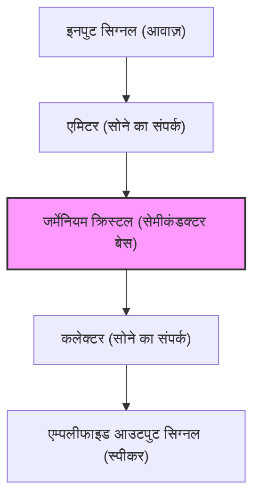

हमारा आधुनिक जीवन स्मार्टफोन से लेकर सुपर कंप्यूटर, ऑटोमोबाइल और घरेलू उपकरणों तक हर तरह के इलेक्ट्रॉनिक उपकरणों से घिरा हुआ है। इन सबके केंद्र में "ट्रांजिस्टर" है, जो सूचनाओं को संसाधित करने और याद रखने के लिए एक छोटा इलेक्ट्रॉनिक घटक है। ट्रांजिस्टर के बिना न इंटरनेट होता, न एआई, न अंतरिक्ष अन्वेषण, न ही आधुनिक उन्नत चिकित्सा।

इस लेख में, हम इस बात के विस्तृत इतिहास में गहराई से उतरेंगे कि ट्रांजिस्टर, जो मानव इतिहास के सबसे महत्वपूर्ण आविष्कारों में से एक है, का जन्म कैसे हुआ, यह कैसे विकसित हुआ और इसने "सिलिकॉन वैली" को कैसे जन्म दिया, जो आज नवाचार का केंद्र है।

## 1. वैक्यूम ट्यूब की सीमाएं और टेलीफोन नेटवर्क की बाधाएं

ट्रांजिस्टर के आविष्कार से पहले, इलेक्ट्रॉनिक उपकरणों में मुख्य भूमिका "वैक्यूम ट्यूब" की थी। वैक्यूम ट्यूब एक उपकरण है जो कांच की ट्यूब के अंदर वैक्यूम बनाकर और इलेक्ट्रॉनों का उत्सर्जन करने के लिए एक फिलामेंट को गर्म करके करंट को एम्पलीफाई और स्विच करता है। 1906 में ली डी फॉरेस्ट द्वारा आविष्कृत ट्रायोड वैक्यूम ट्यूब (ऑडियन) ने रेडियो प्रसारण, प्रारंभिक टेलीफोन संचार और दुनिया के पहले सामान्य-उद्देश्य वाले इलेक्ट्रॉनिक कंप्यूटर "ENIAC" में केंद्रीय भूमिका निभाई।

हालाँकि, वैक्यूम ट्यूब की कुछ गंभीर कमजोरियाँ थीं।

1. **छोटा जीवनकाल**: चूंकि फिलामेंट जल जाता था, इसलिए इसे नियमित रूप से बदलना आवश्यक था। ENIAC में लगभग 18,000 वैक्यूम ट्यूबों का उपयोग किया गया था, लेकिन समस्या यह थी कि हर कुछ दिनों में एक वैक्यूम ट्यूब विफल हो जाती थी, जिससे पूरा सिस्टम रुक जाता था।
2. **भारी बिजली की खपत**: थर्मिओनिक इलेक्ट्रॉनों का उत्सर्जन करने के लिए फिलामेंट को हमेशा उच्च तापमान पर गर्म रखने की आवश्यकता थी, जिससे भारी मात्रा में बिजली की खपत होती थी।
3. **गर्मी का उत्पादन और आकार**: चूंकि यह भारी मात्रा में गर्मी पैदा करता था, इसलिए विशाल शीतलन उपकरण की आवश्यकता थी। इसके अलावा, इनका भौतिक आकार बड़ा था, जिससे उपकरणों को छोटा करने की एक सीमा थी।

इन वैक्यूम ट्यूबों की सीमाओं से सबसे ज्यादा परेशान AT&T (अमेरिकन टेलीफोन एंड टेलीग्राफ कंपनी) और उसका अनुसंधान और विकास विभाग, **बेल लैब्स (Bell Laboratories)** थे, जो उस समय अमेरिका के टेलीफोन संचार नेटवर्क को नियंत्रित करते थे।

उस समय के टेलीफोन एक्सचेंज आवाज़ों को रूट करने के लिए दसियों हज़ारों मैकेनिकल रिले (इलेक्ट्रोमैग्नेटिक स्विच) का उपयोग करते थे, लेकिन वे धीमे थे और संपर्कों के घिसने के कारण बार-बार टूट-फूट का शिकार होते थे। इसके अलावा, लंबी दूरी के टेलीफोन सिग्नलों को एम्पलीफाई करने के लिए कई वैक्यूम ट्यूब रिपिटर्स की आवश्यकता होती थी, लेकिन जीवनकाल और बिजली की समस्याओं के कारण पनडुब्बी केबलों जैसी चीजों में वैक्यूम ट्यूबों को शामिल करना बेहद मुश्किल था।

तत्कालीन AT&T अध्यक्ष वाल्टर गिफोर्ड ने "एक छोटे, मजबूत और कम-शक्ति वाले 'सॉलिड स्टेट' एम्पलीफायर की आवश्यकता को दृढ़ता से पहचाना, जो मैकेनिकल रिले और वैक्यूम ट्यूबों की जगह ले सके"। यही ट्रांजिस्टर के विकास की प्रत्यक्ष प्रेरणा बनी।

## 2. बेल लैब्स और 3 प्रतिभाशाली वैज्ञानिक

1945 में द्वितीय विश्व युद्ध की समाप्ति के बाद, बेल लैब्स के अनुसंधान प्रमुख मार्विन केली ने एक नया एम्पलीफायर विकसित करने के लिए एक विशेष टीम, "सॉलिड स्टेट फिजिक्स ग्रुप" का गठन किया। इस टीम के केंद्र में तीन वैज्ञानिक थे जो बाद में संयुक्त रूप से भौतिकी का नोबेल पुरस्कार जीतेंगे।

*   **विलियम शॉकली (William Shockley)**: टीम लीडर। एक सैद्धांतिक भौतिक विज्ञानी जो असाधारण अंतर्ज्ञान और अंतर्दृष्टि रखते थे, लेकिन दूसरी ओर वे महत्वाकांक्षी, ध्यान आकर्षित करने वाले स्वभाव के थे और अक्सर मानवीय संबंधों में टकराव पैदा करते थे। युद्ध के पहले से ही वे अर्धचालकों (विशेष रूप से जर्मेनियम और सिलिकॉन) का उपयोग करने वाले एम्पलीफायर के विचारों पर विचार कर रहे थे।
*   **जॉन बर्डीन (John Bardeen)**: एक शांत और विचारशील सैद्धांतिक भौतिक विज्ञानी। क्वांटम यांत्रिकी और ठोस अवस्था भौतिकी के गहन ज्ञान के साथ, वे एक प्रतिभाशाली व्यक्ति थे जिन्होंने बाद में न केवल ट्रांजिस्टर के आविष्कार के लिए बल्कि अतिचालकता के BCS सिद्धांत के लिए भी भौतिकी में नोबेल पुरस्कार जीता (इतिहास में एकमात्र व्यक्ति जिसने भौतिकी का पुरस्कार दो बार जीता)।
*   **वाल्टर ब्रैटन (Walter Brattain)**: एक उत्कृष्ट प्रायोगिक भौतिक विज्ञानी। वे सिद्धांत को वास्तविक उपकरण में बदलने में माहिर थे और अपने हाथों से काम करने में बहुत कुशल थे। अपने हंसमुख और मिलनसार स्वभाव के कारण वे काम और निजी जीवन दोनों में बर्डीन के लिए एक अच्छे साथी बन गए।

शॉकली ने शुरू में "फील्ड इफेक्ट (Field Effect)" का उपयोग करते हुए एक सेमीकंडक्टर एम्पलीफायर का आविष्कार किया। उन्होंने सोचा कि यदि वे अर्धचालक की सतह पर विद्युत क्षेत्र लागू करते हैं, तो वे इसके अंदर के करंट को नियंत्रित करने में सक्षम होंगे। हालाँकि, उन्होंने कितनी भी बार प्रयोग किया हो, करंट की गणना के अनुसार वृद्धि नहीं हुई।

इस रहस्य को सुलझाने वाले बर्डीन थे। उन्होंने वसंत 1947 में "सरफेस स्टेट्स (Surface States)" की एक नई अवधारणा प्रस्तावित की। उन्होंने सिद्धांत दिया कि अर्धचालक की सतह पर एक ऐसी अवस्था मौजूद होती है जहाँ इलेक्ट्रॉन आसानी से फंस जाते हैं, जो एक ढाल की तरह काम करता है और बाहरी विद्युत क्षेत्र को रद्द कर देता है, जिससे यह अंदरूनी हिस्से को प्रभावित नहीं कर पाता।

## 3. चमत्कारिक एक महीना: पॉइंट-कांटेक्ट ट्रांजिस्टर का जन्म

जब बर्डीन के सिद्धांत ने विफलता के कारण को स्पष्ट किया, तो प्रयोग ने एक नई दिशा लेना शुरू कर दिया। नवंबर के अंत से दिसंबर 1947 तक लगभग एक महीने के समय को "चमत्कारिक एक महीना" कहा जाता है। बर्डीन और ब्रैटन की जोड़ी दिन-रात प्रयोगों में डूबी रही।

उन्होंने सोचा कि यदि वे जर्मेनियम क्रिस्टल की सतह के बहुत करीब दो धातु की सुइयों (संपर्कों) को लाते हैं, तो वे सरफेस स्टेट के प्रभाव से बच सकते हैं और करंट को नियंत्रित कर सकते हैं।

16 दिसंबर, 1947 को, ब्रैटन ने एक ऐतिहासिक प्रायोगिक सेटअप तैयार किया। उन्होंने एक प्लास्टिक त्रिकोणीय पच्चर (वेज) के सिरे पर सोने की पन्नी (गोल्ड फॉयल) चिपकाई। फिर, उन्होंने रेजर ब्लेड का उपयोग करके सोने की पन्नी के सिरे पर एक बहुत महीन अंतर (लगभग 0.05 मिलीमीटर) बनाया, जिससे दो संपर्क बन गए। इस पच्चर को एक स्प्रिंग (एक संशोधित पेपर क्लिप) द्वारा जर्मेनियम ब्लॉक पर दबाया गया था।

जब इस कच्चे दिखने वाले उपकरण में कोई ऑडियो सिग्नल डाला गया, तो आउटपुट सिग्नल स्पष्ट रूप से इनपुट से बड़ा था। **प्रवर्धन (एम्प्लीफिकेशन) प्रभाव की पुष्टि हुई।**

23 दिसंबर, 1947 को बेल लैब्स के अधिकारियों के लिए एक प्रदर्शन आयोजित किया गया। जब ब्रैटन ने माइक्रोफ़ोन में बात की, तो जर्मेनियम क्रिस्टल से गुज़रने वाली आवाज़ स्पीकर से ज़ोर से और स्पष्ट रूप से निकली। यह वह क्षण था जब दुनिया का पहला "**पॉइंट-कांटेक्ट ट्रांजिस्टर (Point-contact transistor)**" पैदा हुआ था।

यह छोटा उपकरण वैक्यूम ट्यूब की तरह गर्म नहीं होता था, इसे वार्म-अप समय की आवश्यकता नहीं थी, और यह तुरंत काम करता था। इस आविष्कार, जिसे "ट्रांसफर रेसिस्टर" का संक्षिप्त रूप "ट्रांजिस्टर" नाम दिया गया, ने इलेक्ट्रॉनिक्स के इतिहास को हमेशा के लिए बदल दिया।

## 4. शॉकली का जुनून: जंक्शन ट्रांजिस्टर का विकास

पॉइंट-कांटेक्ट ट्रांजिस्टर का आविष्कार बर्डीन और ब्रैटन की एक महान उपलब्धि थी। हालाँकि, समूह के नेता शॉकली इस सफलता से ईमानदारी से खुश नहीं हो सके। उन्हें इस बात से तीव्र ईर्ष्या और अलगाव महसूस हुआ कि वे सबसे महत्वपूर्ण आविष्कार के क्षण में सीधे तौर पर शामिल नहीं थे, और यह कि बर्डीन और ब्रैटन पेटेंट के प्रमुख आविष्कारक बन गए।

"मैं इससे बेहतर ट्रांजिस्टर बना सकता हूं।" शॉकली ने खुद को एक होटल में बंद कर लिया और लगभग पागलपन जैसी एकाग्रता के साथ सिद्धांतों का निर्माण शुरू कर दिया।

पॉइंट-कांटेक्ट ट्रांजिस्टर में नुकसान यह था कि सुइयों के संपर्क के आधार पर उनका प्रदर्शन काफी भिन्न होता था, जिससे उन्हें बड़े पैमाने पर उत्पादन करना मुश्किल हो जाता था और उनमें बहुत अधिक शोर होता था। शॉकली ने एक नई संरचना का आविष्कार किया जो सतह संपर्क के बजाय अर्धचालक के अंदर एक "जंक्शन" का उपयोग करती थी।

यह "**जंक्शन ट्रांजिस्टर (Junction transistor)**" था। उन्होंने गणितीय रूप से साबित किया कि p-प्रकार के अर्धचालक (धनात्मक आवेश = होल बिजली ले जाते हैं) और n-प्रकार के अर्धचालक (ऋणात्मक आवेश = इलेक्ट्रॉन बिजली ले जाते हैं) को सैंडविच की तरह (p-n-p या n-p-n संरचना) एक साथ रखकर, बहुत अधिक स्थिर और उच्च दक्षता प्रवर्धन संभव है।

1951 में, बेल लैब्स में गॉर्डन टील और अन्य के प्रयासों की बदौलत, उच्च शुद्धता वाले अर्धचालक क्रिस्टल को खींचने की तकनीक विकसित की गई, और शॉकली के सिद्धांत के अनुसार जंक्शन ट्रांजिस्टर को साकार किया गया। चूँकि इस जंक्शन ट्रांजिस्टर में कम शोर था और यह बड़े पैमाने पर उत्पादन के लिए उपयुक्त था, इसने तेज़ी से पॉइंट-कांटेक्ट प्रकार को बदल दिया और व्यापक हो गया।

1956 में, शॉकली, बर्डीन और ब्रैटन को "अर्धचालकों पर उनके शोध और ट्रांजिस्टर प्रभाव की खोज" के लिए संयुक्त रूप से भौतिकी का नोबेल पुरस्कार दिया गया था। हालाँकि, इस महिमा के पीछे, तीनों के बीच का रिश्ता पहले ही अपूरणीय रूप से ठंडा हो चुका था। बर्डीन और ब्रैटन शॉकली के आत्म-धर्मी रवैये को बर्दाश्त नहीं कर सके और अन्य शोध विभागों में चले गए।

## 5. जर्मेनियम से सिलिकॉन तक: गॉर्डन टील की चुनौती

शुरुआती ट्रांजिस्टर सभी एक सामग्री के रूप में "जर्मेनियम" का उपयोग करके बनाए गए थे। जर्मेनियम का यह फायदा था कि इसे संसाधित करना आसान था क्योंकि यह अपेक्षाकृत कम तापमान पर पिघल जाता था।

हालाँकि, जर्मेनियम की एक घातक कमजोरी थी। यह था "गर्मी के प्रति संवेदनशीलता"। जब तापमान लगभग 75 डिग्री तक पहुँच जाता है, तो यह अपने अर्धचालक गुणों को खो देता है और केवल एक संवाहक (एक धातु जो वर्तमान रिसाव की अनुमति देता है) बन जाता है। इस कारण से, एक समस्या यह थी कि यदि आप शुरुआती ट्रांजिस्टर रेडियो को गर्मी के गर्म दिन में कार में छोड़ देते, तो वे पूरी तरह से बेकार हो जाते। इसके अलावा, सैन्य अनुप्रयोगों (जैसे मिसाइल नियंत्रण) के लिए, यह खराब तापमान विशेषता घातक थी।

इस समस्या को हल करने का एकमात्र तरीका सामग्री को "**सिलिकॉन (Silicon)**" में बदलना था, जो उच्च तापमान का सामना कर सके। सिलिकॉन पृथ्वी की पपड़ी में ऑक्सीजन के बाद दूसरा सबसे प्रचुर तत्व (रेत और क्वार्ट्ज का मुख्य घटक) है, लेकिन उस समय की तकनीक के साथ, ट्रांजिस्टर में उपयोग किए जाने वाले अत्यधिक शुद्ध सिलिकॉन एकल क्रिस्टल का उत्पादन करना अत्यंत कठिन काम था।

इस चुनौती का सामना **गॉर्डन टील** ने किया, जो टेक्सास इंस्ट्रूमेंट्स (TI) में चले गए थे। बेल लैब्स में अपने समय के दौरान विकसित की गई क्रिस्टल विकास तकनीक का उपयोग करके टील आखिरकार सिलिकॉन के एकल क्रिस्टल बनाने में सफल रहे।

1954 में, एक वैज्ञानिक सम्मेलन में, जब उबलते पानी में रखे जाने पर अन्य कंपनियों के जर्मेनियम ट्रांजिस्टर ने एक-एक करके काम करना बंद कर दिया, तो टील ने यह प्रदर्शित करके दर्शकों को आश्चर्यचकित कर दिया कि कंपनी द्वारा विकसित सिलिकॉन ट्रांजिस्टर उबलते पानी में भी शांति से संगीत बजाते रहे। यहीं से अर्धचालकों की मुख्य भूमिका जर्मेनियम से पूरी तरह से सिलिकॉन में बदल गई, और "सिलिकॉन युग" की शुरुआत हुई।

## 6. MOSFET का आविष्कार और IC का मार्ग

जंक्शन सिलिकॉन ट्रांजिस्टर के आगमन के साथ इलेक्ट्रॉनिक उपकरणों का लघुकरण (छोटा होना) बहुत आगे बढ़ गया, लेकिन जैसे-जैसे ट्रांजिस्टरों की संख्या सैकड़ों और हजारों तक बढ़ गई, तारों के साथ उन्हें सोल्डरिंग करने का काम अपनी सीमा (वायरिंग की दीवार) तक पहुंच गया।

इस समस्या को "**एकीकृत सर्किट (Integrated Circuit - IC)**" द्वारा हल किया गया था, जिसका आविष्कार 1958 में जैक किल्बी (TI) और रॉबर्ट नॉयस (फेयरचाइल्ड) ने स्वतंत्र रूप से किया था। यह एक एकल सिलिकॉन चिप पर एक साथ कई ट्रांजिस्टर और प्रतिरोधक (रेसिस्टर्स) बनाने की एक तकनीक थी।

हालाँकि, शुरुआती ICs अभी भी जंक्शन (द्विध्रुवी - बाइपोलर) ट्रांजिस्टर का उपयोगচেতন करते थे, और बिजली की खपत और लघुकरण की सीमाएँ स्पष्ट होने लगी थीं।

यहाँ, "फील्ड इफेक्ट ट्रांजिस्टर (FET)" का विचार एक बार फिर पुनर्जीवित हो गया, जिसका शॉकली ने शुरू में सपना देखा था, लेकिन बर्डीन की "सरफेस स्टेट" दीवार से बाधित होने के कारण इसे महसूस नहीं किया जा सका।

1959 में, बेल लैब्स के **मोहम्मद अताल्ला (Mohamed Atalla)** और **दावोन काहंग (Dawon Kahng)** ने पाया कि वे सिलिकॉन की सतह को थर्मल रूप से ऑक्सीकरण करके एक अति-पतली "सिलिकॉन डाइऑक्साइड (कांच)" इन्सुलेटिंग फिल्म बनाकर सरफेस स्टेट के प्रभाव को रद्द कर सकते हैं।

इस तकनीक का उपयोग करते हुए, उन्होंने एक ऐसी संरचना वाले "**MOSFET (मेटल-ऑक्साइड-सेमीकंडक्टर फील्ड-इफेक्ट ट्रांजिस्टर)**" का आविष्कार किया, जिसमें धातु (Metal), ऑक्साइड (Oxide), और अर्धचालक (Semiconductor) एक दूसरे के ऊपर स्टैक किए गए थे।

पारंपरिक जंक्शन ट्रांजिस्टर की तुलना में, MOSFET की विनिर्माण प्रक्रिया बहुत सरल थी, इसकी बिजली की खपत बहुत कम थी, और सबसे महत्वपूर्ण बात यह थी कि इसमें "इसे अत्यधिक छोटा करने में सक्षम होने" की अद्भुत विशेषता थी। आज, हमारे स्मार्टफोन और पीसी के सीपीयू के अंदर अरबों और दसों अरबों की संख्या में ये MOSFET भरे हुए हैं। अताल्ला और काहंग का आविष्कार आधुनिक डिजिटल समाज की सच्ची नींव बन गया है।

## 7. "देशद्रोही आठ (Traitorous Eight)" और सिलिकॉन वैली का जन्म

ट्रांजिस्टर के विकास के इतिहास की बात करें तो इन तकनीकों को व्यवसाय में बदलने वाले "लोगों" का नाटक उतना ही महत्वपूर्ण है जितनी खुद तकनीकें। इसका मंच कैलिफोर्निया की सांता क्लारा वैली थी, जिसे अब "**सिलिकॉन वैली**" कहा जाता है।

नोबेल पुरस्कार जीतने वाले शॉकली ने 1956 में अपनी कंपनी, शॉकली सेमीकंडक्टर लेबोरेटरी की स्थापना की और पालो ऑल्टो, कैलिफोर्निया में अपने गृहनगर में एक बेस स्थापित किया। उन्होंने पूरे अमेरिका से कई प्रतिभाशाली युवा वैज्ञानिकों और इंजीनियरों की भर्ती की। इनमें **रॉबर्ट नॉयस** और **गॉर्डन मूर** शामिल थे, जिन्होंने बाद में इंटेल की स्थापना की।

हालाँकि, शॉकली एक वैज्ञानिक के रूप में तो प्रतिभाशाली थे, लेकिन प्रबंधक (मैनेजर) के रूप में वे सबसे खराब थे। उनके पागल (पैरानॉयड) व्यक्तित्व, उनके सनकी प्रबंधन (जैसे अपने अधीनस्थों पर बिल्कुल भरोसा न करना और उन्हें लाई डिटेक्टर टेस्ट देने की कोशिश करना), और शोध नीति पर संघर्ष (होनहार सिलिकॉन ट्रांजिस्टर के बजाय एक जटिल 4-परत डायोड पर चिपके रहना) के कारण, कार्यस्थल का माहौल बहुत खराब हो गया था।

सितंबर 1957 में, आठ प्रतिभाशाली युवा शोधकर्ताओं (नॉयस और मूर सहित) ने अपना धैर्य खो दिया और शॉकली को छोड़ने का फैसला किया। शॉकली ने उन्हें "**देशद्रोही आठ (Traitorous Eight)**" कहकर अपना गुस्सा निकाला।

निवेशक आर्थर रॉक के समर्थन और फेयरचाइल्ड कैमरा एंड इंस्ट्रूमेंट के वित्तपोषण के साथ, उन आठ ने "**फेयरचाइल्ड सेमीकंडक्टर (Fairchild Semiconductor)**" की स्थापना की।

जीन होर्नी द्वारा आविष्कृत "**प्लानर प्रक्रिया (Planar process)**" (एक तकनीक जो सिलिकॉन सतह को सपाट रूप से सुरक्षित रखने के लिए ऑक्साइड फिल्म का उपयोग करती है और सर्किट को इस तरह प्रिंट करती है जैसे कि वे तस्वीरें हों) का उपयोग करते हुए, फेयरचाइल्ड तुरंत दुनिया की शीर्ष सेमीकंडक्टर कंपनी बन गई। यह प्लानर तकनीक वह क्रांतिकारी निर्माण विधि थी जिसने ICs के बाद के बड़े पैमाने पर उत्पादन को सक्षम किया।

और फेयरचाइल्ड सेमीकंडक्टर सिलिकॉन वैली का "बिग बैंग" बन गया। ऐसा इसलिए था क्योंकि फेयरचाइल्ड में अनुभव प्राप्त करने वाले कई प्रतिभाशाली इंजीनियरों ने बाद में नई उद्यम कंपनियां स्थापित करने के लिए स्पिन आउट किया। इन्हें "फेयरचिल्ड्रेन (Fairchildren)" कहा जाता है।

आज सिलिकॉन वैली का प्रतिनिधित्व करने वाली कई कंपनियों, जैसे कि रॉबर्ट नॉयस और गॉर्डन मूर द्वारा स्थापित **Intel**, और जेरी सैंडर्स द्वारा स्थापित **AMD**, की जड़ें "देशद्रोही आठ" और फेयरचाइल्ड में हैं।

## 8. निष्कर्ष: एक छोटे से हिस्से द्वारा लाई गई एक विशाल क्रांति

बेल लैब्स के एक कोने में क्लिप, सोने की पन्नी और जर्मेनियम के टुकड़ों से पैदा हुए अनाड़ी "पॉइंट-कांटेक्ट ट्रांजिस्टर" ने कुछ ही दशकों में जंक्शन-प्रकार, सिलिकॉन, IC और MOSFET में आश्चर्यजनक रूप से विकास किया।

इसने मानवता को वैक्यूम ट्यूबों के गर्म और विशाल अभिशाप से मुक्त किया, और एक ऐसी दुनिया को खोल दिया जहां जानकारी को "स्विच ऑन/ऑफ (0 और 1)" के डिजिटल सिग्नल के रूप में अत्यधिक उच्च गति और कम लागत पर संसाधित किया जाता है।

यदि यह शॉकली की महत्वाकांक्षा, बर्डीन की सैद्धांतिक चमक, ब्रैटन के जादुई प्रायोगिक कौशल के लिए नहीं होता, और यदि "देशद्रोही आठ" ने स्वतंत्र रूप से कैलिफोर्निया में सिलिकॉन के बीज नहीं बोए होते, तो आज हम जिस डिजिटल समाज का आनंद ले रहे हैं, वह पूरी तरह से अलग होता या शायद दशकों पीछे होता।

ट्रांजिस्टर का इतिहास केवल तकनीकी विकास का इतिहास नहीं है। यह ईर्ष्या, महत्वाकांक्षा, विद्रोह और सीमाओं को पार करने की अंतहीन मानवीय खोज का इतिहास है।

(समाप्त)
