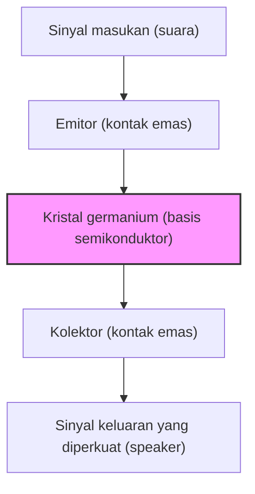

Kehidupan modern kita saat ini dikelilingi oleh segala jenis perangkat elektronik, mulai dari ponsel pintar hingga superkomputer, mobil, dan peralatan rumah tangga. Di pusat semua ini adalah komponen elektronik mungil yang memproses dan mengingat informasi: "transistor". Tanpa transistor, internet, AI, eksplorasi luar angkasa, dan pengobatan medis tingkat lanjut modern tidak akan pernah ada.

Dalam artikel ini, kita akan mendalami sejarah epik dari salah satu penemuan terpenting dalam sejarah umat manusia, bagaimana transistor diciptakan, bagaimana ia berkembang, dan bagaimana hal itu melahirkan "Silicon Valley" saat ini sebagai pusat inovasi.

## 1. Keterbatasan Tabung Vakum dan Tembok Jaringan Telepon

Sebelum transistor ditemukan, bintang utama dalam perangkat elektronik adalah "tabung vakum". Tabung vakum adalah perangkat yang memperkuat arus atau melakukan switching dengan membuat ruang hampa di dalam tabung kaca dan memanaskan filamen untuk melepaskan elektron. Tabung vakum triode (Audion), yang ditemukan oleh Lee De Forest pada tahun 1906, memainkan peran sentral dalam siaran radio, komunikasi telepon awal, dan "ENIAC", komputer elektronik serbaguna pertama di dunia.

Namun, tabung vakum memiliki kelemahan yang fatal.

1. **Umur yang pendek**: Karena filamen sering terbakar, penggantian rutin sangat diperlukan. ENIAC menggunakan sekitar 18.000 tabung vakum, dan mengalami masalah di mana salah satu tabung rusak setiap beberapa hari, menyebabkan seluruh sistem berhenti beroperasi.
2. **Konsumsi daya yang sangat besar**: Filamen harus selalu dipanaskan pada suhu tinggi untuk melepaskan elektron termionik, yang mengonsumsi daya dalam jumlah yang sangat besar.
3. **Panas dan ukuran**: Karena memancarkan panas dalam jumlah besar, diperlukan peralatan pendingin yang besar. Selain itu, ukuran fisiknya besar, sehingga ada batasan dalam memperkecil ukuran perangkat.

Yang paling pusing dengan keterbatasan tabung vakum ini adalah AT&T (American Telephone and Telegraph Company), yang menguasai jaringan komunikasi telepon Amerika, beserta divisi riset dan pengembangannya, **Bell Laboratories**.

Pusat pertukaran telepon saat itu menggunakan puluhan ribu relai mekanik (sakelar berbasis elektromagnet) untuk mengarahkan suara, namun operasinya lambat dan sering rusak karena ausnya titik kontak. Selain itu, diperlukan sejumlah besar repeater tabung vakum untuk memperkuat sinyal telepon jarak jauh, namun memasukkan tabung vakum ke dalam kabel bawah laut sangat sulit karena masalah umur dan daya.

Walter Gifford, yang saat itu menjabat sebagai presiden AT&T, sangat menyadari perlunya sebuah penguat (amplifier) "solid-state" (benda padat) yang kecil, kokoh, dan berdaya rendah untuk menggantikan relai mekanik dan tabung vakum. Inilah yang menjadi motivasi langsung bagi pengembangan transistor.

## 2. Bell Labs dan Tiga Jenius

Pada tahun 1945, setelah Perang Dunia II berakhir, Mervin Kelly, direktur divisi penelitian di Bell Labs, membentuk tim khusus "Kelompok Fisika Solid-State" untuk mengembangkan penguat baru. Inti dari tim ini adalah tiga ilmuwan yang nantinya akan menerima Penghargaan Nobel Fisika bersama-sama.

*   **William Shockley**: Pemimpin tim. Seorang fisikawan teoretis dengan intuisi dan wawasan luar biasa, namun memiliki ambisi besar, haus pengakuan, dan kepribadian yang mudah memicu konflik antarpribadi. Sejak sebelum perang, ia telah menyimpan ide tentang penguat menggunakan semikonduktor (khususnya germanium dan silikon).
*   **John Bardeen**: Seorang fisikawan teoretis yang pendiam dan penuh pemikiran. Ia memiliki pengetahuan mendalam tentang mekanika kuantum dan fisika benda padat, seorang jenius yang kemudian tidak hanya memenangkan Penghargaan Nobel Fisika untuk penemuan transistor, tetapi juga untuk teori superkonduktivitas BCS (menjadikannya satu-satunya orang dalam sejarah yang memenangkan Penghargaan Nobel Fisika dua kali).
*   **Walter Brattain**: Seorang fisikawan eksperimental yang luar biasa. Ia ahli dalam merakit teori menjadi perangkat nyata dan sangat terampil menggunakan tangannya. Ia memiliki kepribadian yang ceria dan ramah, menjadi mitra yang baik bagi Bardeen baik secara profesional maupun pribadi.

Awalnya, Shockley merancang sebuah penguat semikonduktor menggunakan "Efek Medan (Field Effect)". Ia berpikir bahwa dengan menerapkan medan listrik pada permukaan semikonduktor, ia dapat mengontrol arus internal. Namun, tidak peduli berapa kali eksperimen diulang, arus tidak pernah menguat seperti yang dihitung.

Bardeen-lah yang memecahkan misteri ini. Pada musim semi 1947, ia mengusulkan konsep baru yang disebut "Surface States" (Keadaan Permukaan). Ia berteori bahwa ada keadaan di permukaan semikonduktor di mana elektron mudah terperangkap, dan ini bertindak seperti perisai yang membatalkan medan listrik dari luar, sehingga mencegahnya memengaruhi bagian dalam.

## 3. Satu Bulan Keajaiban: Lahirnya Transistor Titik Kontak (Point-contact transistor)

Dengan penyebab kegagalan yang dijelaskan oleh teori Bardeen, eksperimen mulai bergerak ke arah yang baru. Periode sekitar satu bulan dari akhir November hingga Desember 1947 dikenal sebagai "Satu Bulan Keajaiban". Duo Bardeen dan Brattain membenamkan diri dalam eksperimen siang dan malam.

Mereka menyadari bahwa jika dua jarum logam (titik kontak) dibawa sangat berdekatan dan disentuhkan ke permukaan kristal germanium, mereka mungkin dapat menghindari efek keadaan permukaan dan mengendalikan arus.

Pada tanggal 16 Desember 1947, Brattain merakit alat eksperimen bersejarah tersebut. Ia menempelkan kertas emas pada ujung baji segitiga plastik. Kemudian, ia membuat celah sangat halus (sekitar 0,05 milimeter) di ujung kertas emas menggunakan pisau cukur, menciptakan dua titik kontak. Baji ini ditekan pada balok germanium menggunakan pegas (terbuat dari penjepit kertas yang dimodifikasi).

Ketika sinyal suara dimasukkan ke dalam perangkat yang tampak sederhana ini, sinyal keluaran jelas lebih besar daripada masukannya. **Efek penguatan (amplifikasi) telah dikonfirmasi.**

Pada 23 Desember 1947, sebuah demonstrasi diadakan untuk para eksekutif Bell Labs. Saat Brattain berbicara melalui mikrofon, suara yang melewati kristal germanium diputar melalui speaker dengan keras dan jelas. Inilah momen ketika "**Point-contact transistor (Transistor titik kontak)**" pertama di dunia lahir.

Perangkat kecil ini bekerja seketika, tanpa perlu memanas seperti tabung vakum, dan tidak memerlukan waktu pemanasan. Diberi nama "transistor", kependekan dari "transfer resistor" (resistor transfer), penemuan ini akan mengubah sejarah elektronik selamanya.

## 4. Obsesi Shockley: Evolusi menuju Transistor Pertemuan (Junction transistor)

Penemuan transistor titik kontak merupakan pencapaian luar biasa dari Bardeen dan Brattain. Namun, Shockley, sang pemimpin kelompok, tidak dapat bersuka cita atas keberhasilan ini dengan tulus. Ia merasa sangat cemburu dan terasing karena tidak terlibat langsung pada momen terpenting penemuan tersebut, dan karena nama Bardeen serta Brattain menjadi penemu utama di hak paten.

"Saya pasti bisa membuat transistor yang jauh lebih baik." Shockley mengunci dirinya di hotel dan mulai membangun teori dengan tingkat konsentrasi yang bisa disebut gila.

Transistor titik kontak memiliki kelemahan yaitu kinerjanya sangat bervariasi tergantung pada bagaimana jarum tersebut bersentuhan, sehingga sulit untuk diproduksi massal dan memiliki banyak noise (gangguan). Shockley merancang struktur baru yang menggunakan "pertemuan (junction)" di dalam semikonduktor, bukan kontak di permukaan.

Itulah "**Junction transistor (Transistor pertemuan)**". Ia membuktikan secara matematis bahwa amplifikasi yang jauh lebih stabil dan sangat efisien dapat dicapai dengan menyusun semikonduktor tipe-p (muatan positif = lubang membawa listrik) dan semikonduktor tipe-n (muatan negatif = elektron membawa listrik) seperti roti lapis (struktur p-n-p atau n-p-n).

Pada tahun 1951, berkat upaya Gordon Teal dan rekan-rekannya di Bell Labs, sebuah teknologi untuk menarik kristal semikonduktor dengan kemurnian tinggi berhasil dikembangkan, dan transistor pertemuan direalisasikan sesuai dengan teori Shockley. Transistor pertemuan ini memiliki noise yang rendah dan cocok untuk produksi massal, sehingga dengan cepat menggantikan tipe titik kontak.

Pada tahun 1956, Shockley, Bardeen, dan Brattain bersama-sama menerima Penghargaan Nobel Fisika untuk "penelitian semikonduktor dan penemuan efek transistor". Namun, di balik kejayaan ini, hubungan ketiga orang tersebut sudah sangat dingin hingga tidak bisa diperbaiki lagi. Tidak tahan dengan sikap Shockley yang merasa selalu benar, Bardeen dan Brattain akhirnya pergi ke departemen penelitian lain.

## 5. Dari Germanium ke Silikon: Tantangan Gordon Teal

Semua transistor awal dibuat dengan bahan "germanium". Germanium memiliki keuntungan karena mudah diproses karena meleleh pada suhu yang relatif rendah.

Namun, germanium memiliki kelemahan yang fatal: "rentan terhadap panas". Ketika suhunya mencapai sekitar 75 derajat Celcius, ia kehilangan sifat semikonduktornya dan hanya menjadi konduktor (logam yang membocorkan arus). Oleh karena itu, ada masalah di mana radio transistor awal menjadi sama sekali tidak berguna jika ditinggalkan di dalam mobil pada hari musim panas yang terik. Selain itu, untuk keperluan militer (seperti kontrol rudal), karakteristik suhu yang buruk ini sangat berakibat fatal.

Satu-satunya cara untuk memecahkan masalah ini adalah mengubah material ke "**silikon**", yang dapat menahan suhu yang lebih tinggi. Silikon adalah elemen melimpah (komponen utama pasir dan kuarsa) yang ada dalam jumlah besar di kerak bumi kedua setelah oksigen, tetapi dengan teknologi pada saat itu, menciptakan kristal tunggal silikon dengan kemurnian sangat tinggi yang dapat digunakan untuk transistor merupakan tantangan yang sangat sulit.

Orang yang menerima tantangan ini adalah **Gordon Teal**, yang telah pindah ke Texas Instruments (TI). Teal menggunakan sepenuhnya teknologi pertumbuhan kristal yang ia asah semasa di Bell Labs dan akhirnya berhasil menciptakan kristal tunggal silikon.

Pada tahun 1954, pada sebuah konferensi di mana transistor germanium milik perusahaan lain dimasukkan ke dalam air mendidih dan satu demi satu berhenti beroperasi, Teal memukau hadirin dengan mendemonstrasikan transistor silikon buatan perusahaannya yang terus memainkan musik dengan tenang bahkan di dalam air mendidih. Sejak saat itu, peran utama semikonduktor sepenuhnya beralih dari germanium ke silikon, dan "Era Silikon" pun dimulai.

## 6. Penemuan MOSFET dan Jalan Menuju IC

Kemunculan transistor silikon pertemuan (junction transistor) sangat memajukan miniaturisasi perangkat elektronik, namun seiring bertambahnya jumlah transistor menjadi ratusan dan ribuan, tugas menyoldernya dengan kabel mencapai batasnya (tembok kabel).

Ini diselesaikan oleh "**Sirkuit Terpadu (IC / Integrated Circuit)**", yang ditemukan secara independen pada tahun 1958 oleh Jack Kilby (TI) dan Robert Noyce (Fairchild). Itu adalah teknologi untuk membuat banyak transistor dan resistor secara bersamaan pada satu cip silikon.

Namun, IC awal masih menggunakan transistor tipe pertemuan (bipolar), dan batas konsumsi daya dan miniaturisasinya mulai terlihat.

Di sini, ide "Field Effect Transistor (FET / Transistor Efek Medan)", yang awalnya diimpikan oleh Shockley namun gagal terwujud karena terhalang oleh keadaan permukaan (surface states) yang diteorikan Bardeen, muncul kembali.

Pada tahun 1959, **Mohamed Atalla** dan **Dawon Kahng** di Bell Labs menemukan bahwa mereka dapat menetralkan efek keadaan permukaan dengan mengoksidasi permukaan silikon secara termal untuk menciptakan film isolasi "silikon dioksida (kaca)" yang sangat tipis.

Menggunakan teknologi ini, mereka menemukan "**MOSFET (Metal-Oxide-Semiconductor Field-Effect Transistor)**" yang memiliki struktur lapisan Logam (Metal), Film oksida (Oxide), dan Semikonduktor (Semiconductor).

Dibandingkan dengan transistor pertemuan konvensional, MOSFET memiliki proses manufaktur yang lebih sederhana, konsumsi daya yang jauh lebih sedikit, dan di atas segalanya, karakteristik luar biasa yaitu "bisa dikecilkan secara ekstrem". Saat ini, di dalam CPU ponsel pintar dan PC kita, MOSFET ini dikemas dalam jumlah miliaran dan puluhan miliar. Penemuan Atalla dan Kahng ini merupakan fondasi sesungguhnya dari masyarakat digital modern.

## 7. "Delapan Pengkhianat" dan Lahirnya Silicon Valley

Saat menceritakan sejarah evolusi transistor, drama "orang-orang" yang mengangkat teknologi ini menjadi bisnis sama pentingnya dengan teknologi itu sendiri. Panggungnya adalah Santa Clara Valley di California, yang saat ini dikenal sebagai "**Silicon Valley**".

Peraih Hadiah Nobel Shockley mendirikan perusahaannya sendiri, "Shockley Semiconductor Laboratory", pada tahun 1956 dan mendirikan markasnya di kampung halamannya di Palo Alto, California. Ia merekrut ilmuwan dan insinyur muda berbakat dari seluruh Amerika secara beruntun. Di antara mereka adalah **Robert Noyce** dan **Gordon Moore**, yang kemudian akan mendirikan Intel.

Namun, meskipun Shockley jenius sebagai ilmuwan, ia adalah manajer yang sangat buruk. Sikapnya yang paranoid, manajemennya yang eksentrik seperti tidak memercayai bawahannya sama sekali dan mencoba melakukan tes poligraf (alat pendeteksi kebohongan) pada mereka, serta konflik kebijakan penelitian (bersikeras pada dioda 4 lapis yang kompleks alih-alih transistor silikon yang menjanjikan), membuat suasana tempat kerja jatuh ke kondisi terburuk.

Pada bulan September 1957, delapan peneliti muda berbakat yang pada akhirnya kehilangan kesabaran (termasuk Noyce dan Moore) memutuskan untuk meninggalkan Shockley. Shockley sangat marah dan menyebut mereka "**Delapan Pengkhianat (Traitorous Eight)**".

Dengan dukungan dari investor Arthur Rock dan pendanaan dari Fairchild Camera and Instrument, kedelapan orang tersebut mendirikan "**Fairchild Semiconductor**".

Fairchild dengan cepat tumbuh menjadi perusahaan semikonduktor terkemuka di dunia berbekal "**Proses Planar (Planar process)**" yang ditemukan oleh Jean Hoerni (sebuah teknologi untuk meratakan dan melindungi permukaan silikon menggunakan film oksida dan mencetak sirkuit padanya seperti pencetakan foto). Proses planar ini merupakan metode manufaktur revolusioner yang memungkinkan produksi massal IC di kemudian hari.

Dan Fairchild Semiconductor menjadi "Big Bang" dari Silicon Valley. Insinyur luar biasa yang mendapatkan pengalaman di Fairchild kemudian keluar secara beruntun dan memulai perusahaan ventura baru. Mereka disebut "Fairchildren".

Banyak perusahaan terkemuka di Silicon Valley saat ini, seperti **Intel** yang didirikan oleh Robert Noyce dan Gordon Moore, dan **AMD** yang didirikan oleh Jerry Sanders, berakar pada "Delapan Pengkhianat" dan Fairchild.

## 8. Kesimpulan: Revolusi Besar yang Dibawa oleh Komponen Kecil

Dilahirkan di sudut Bell Labs dari klip kertas, kertas emas, dan sepotong germanium, "transistor titik kontak" yang kikuk mengalami evolusi yang menakjubkan hanya dalam beberapa dekade, menuju tipe pertemuan, silikon, IC, dan MOSFET.

Hal ini membebaskan umat manusia dari tabung vakum yang panas dan besar, serta membuka dunia di mana informasi diproses sebagai sinyal digital ("ON/OFF dari sakelar" atau 0 dan 1) dengan kecepatan sangat tinggi dan murah.

Seandainya tidak ada ambisi Shockley, kilasan teoretis Bardeen, keterampilan eksperimental Brattain yang luar biasa, dan kemandirian "Delapan Pengkhianat" yang menyebarkan benih silikon di tanah California, masyarakat digital yang kita nikmati saat ini akan sama sekali berbeda, atau tertunda hingga puluhan tahun.

Sejarah transistor bukan sekadar sejarah evolusi teknologi. Ini adalah sejarah kecemburuan, ambisi, pemberontakan, dan pencarian manusia yang tak ada habisnya untuk menembus batas.

(Selesai)
