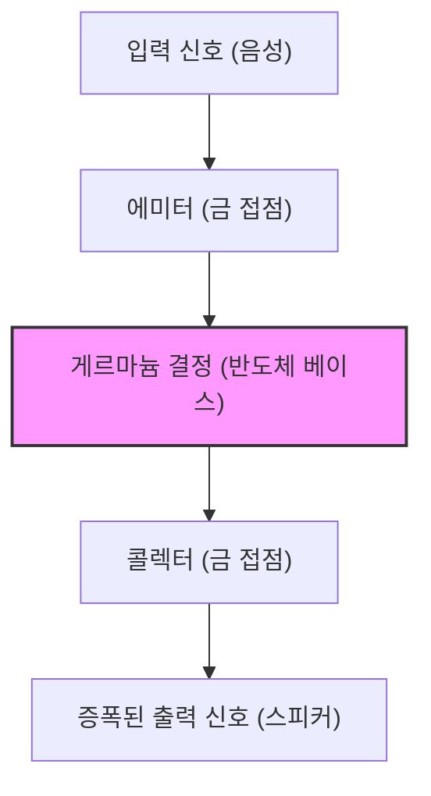

현대 우리의 생활은 스마트폰부터 슈퍼컴퓨터, 자동차, 가전에 이르기까지 모든 전자기기에 둘러싸여 있습니다. 이 모든 것의 중심에는 정보를 처리하고 기억하기 위한 미세한 전자 부품 '트랜지스터'가 있습니다. 트랜지스터가 없었다면 인터넷도, AI도, 우주 개발도, 현대의 고도화된 의료도 존재하지 않았을 것입니다.

본 기사에서는 이 인류 역사상 가장 중요한 발명 중 하나인 트랜지스터가 어떻게 탄생했는지, 그리고 그것이 어떻게 발전하여 현재 '실리콘 밸리'라는 혁신의 중심지를 만들어냈는지, 그 장대한 역사를 깊이 파헤쳐 보겠습니다.

## 1. 진공관의 한계와 전화망의 장벽

트랜지스터가 발명되기 이전, 전자기기의 주역은 '진공관'이었습니다. 진공관은 유리관 속을 진공으로 만들고 필라멘트를 가열해 전자를 방출시켜 전류를 증폭하거나 스위칭하는 소자입니다. 1906년 리 드 포레스트가 발명한 3극 진공관(오디온)은 라디오 방송과 초기 전화 통신, 그리고 세계 최초의 범용 전자계산기 'ENIAC'에서 중심적인 역할을 수행했습니다.

그러나 진공관에는 결정적인 약점이 있었습니다.

1. **수명이 짧다**: 필라멘트가 타버리기 때문에 정기적인 교체가 필수적이었습니다. ENIAC에는 약 18,000개의 진공관이 사용되었으나, 며칠에 한 번은 어딘가의 진공관이 고장나 시스템 전체가 멈추는 문제를 안고 있었습니다.
2. **전력 소비가 엄청나다**: 열전자를 방출하기 위해 항상 필라멘트를 고온으로 가열해 두어야 했기 때문에 막대한 전력을 소비했습니다.
3. **발열과 크기**: 대량의 열을 발생시키므로 거대한 냉각 설비가 필요했습니다. 또한 물리적인 크기도 커서 기기 소형화에 한계가 있었습니다.

이 진공관의 한계로 가장 골머리를 앓던 곳이 바로 미국의 전화 통신망을 지배하던 AT&T(미국 전신 전화 회사)와 그 연구개발 부서인 **벨 연구소(Bell Laboratories)**였습니다.

당시 전화 교환기는 수만 개의 기계식 릴레이(전자석 스위치)를 사용해 음성을 라우팅했지만 동작이 느리고 접점 마모로 인한 고장이 빈번했습니다. 또한 장거리 전화 신호를 증폭하기 위해 진공관 중계기가 다수 필요했으나 해저 케이블 등에 진공관을 내장하는 것은 수명과 전력 문제 때문에 극히 어려웠습니다.

당시 AT&T 사장이었던 월터 기포드는 "기계식 릴레이와 진공관을 대체할, 작고 튼튼하며 소비 전력이 적은 '고체(솔리드 스테이트)' 증폭기"의 필요성을 강하게 인식하고 있었습니다. 이것이 트랜지스터 개발의 직접적인 동기가 되었습니다.

## 2. 벨 연구소와 세 명의 천재들

1945년 제2차 세계대전이 끝나자 벨 연구소의 연구부문장이었던 마빈 켈리는 새로운 증폭기를 개발하기 위한 특별 팀 '고체 물리 그룹'을 편성했습니다. 이 팀의 중심이 된 것이 훗날 노벨 물리학상을 공동 수상하게 되는 세 명의 과학자입니다.

*   **윌리엄 쇼클리(William Shockley)**: 팀의 리더. 이론 물리학자로서 뛰어난 직관력과 통찰력을 가진 반면, 야심 차고 자기 과시욕이 강해 인간관계에서 마찰을 일으키기 쉬운 성격이었습니다. 그는 전쟁 전부터 반도체(특히 게르마늄이나 실리콘)를 이용한 증폭기 아이디어를 품고 있었습니다.
*   **존 바딘(John Bardeen)**: 과묵하고 사려 깊은 이론 물리학자. 양자역학과 고체물리학에 대한 깊은 지식을 가졌으며, 훗날 트랜지스터의 발명뿐만 아니라 초전도의 BCS 이론으로도 노벨 물리학상을 수상하는(역사상 유일하게 물리학상을 두 번 수상한 인물) 천재입니다.
*   **월터 브래튼(Walter Brattain)**: 뛰어난 실험 물리학자. 이론을 실제 장치로 조립하는 명인이었으며 손재주가 매우 뛰어났습니다. 밝고 사교적인 성격으로 바딘과는 공사 양면으로 훌륭한 파트너가 되었습니다.

쇼클리는 당초 '전계 효과(Field Effect)'를 이용한 반도체 증폭기를 고안했습니다. 반도체 표면에 전계를 가하면 내부의 전류를 제어할 수 있을 것이라 생각한 것입니다. 그러나 실험을 여러 번 반복해도 계산대로 전류가 증폭되지는 않았습니다.

이 수수께끼를 해명한 것이 바딘이었습니다. 그는 1947년 봄, '표면 준위(Surface States)'라는 새로운 개념을 제창했습니다. 반도체 표면에는 전자가 포획되기 쉬운 상태가 존재하며, 이것이 실드처럼 작용해 외부의 전계를 상쇄해버리기 때문에 내부에 영향을 미치지 못한다고 이론화한 것입니다.

## 3. 기적의 1개월: 점접촉형 트랜지스터의 탄생

바딘의 이론으로 실패 원인이 밝혀지면서 실험은 새로운 방향으로 나아가기 시작했습니다. 1947년 11월 하순부터 12월에 걸친 약 1개월은 '기적의 1개월'로 불립니다. 바딘과 브래튼 콤비는 밤낮을 가리지 않고 실험에 몰두했습니다.

그들은 게르마늄 결정 표면에 두 개의 금속 바늘(접점)을 극히 가깝게 접근시켜 접촉시키면, 표면 준위의 영향을 회피하여 전류를 제어할 수 있지 않을까 생각했습니다.

1947년 12월 16일, 브래튼은 역사적인 실험 장치를 조립했습니다. 그는 플라스틱 삼각형 쐐기의 끝에 금박을 붙였습니다. 그리고 그 금박의 끝을 면도날로 아주 미세한 틈(약 0.05밀리미터)이 생기도록 잘라내어 두 개의 접점을 만들었습니다. 이 쐐기를 스프링(종이 클립을 개조한 것)으로 게르마늄 블록에 눌러 붙인 것입니다.

이 조잡해 보이는 장치에 음성 신호를 입력하자 출력 측 신호가 명백히 입력보다 커져 있었습니다. **증폭 작용이 확인된 것입니다.**

1947년 12월 23일, 벨 연구소 간부들을 모아놓고 데모가 진행되었습니다. 브래튼이 마이크에 대고 말을 하자 게르마늄 결정을 통과한 음성이 스피커에서 크고 또렷하게 재생되었습니다. 이것이 세계 최초의 '**점접촉형 트랜지스터(Point-contact transistor)**'가 탄생한 순간이었습니다.

이 작은 장치는 진공관처럼 뜨거워지지도 않고 워밍업 시간도 필요 없었으며 순식간에 작동했습니다. '트랜스퍼 레지스터(전달 저항기)'를 줄여 '트랜지스터'라고 이름 붙여진 이 발명은 전자공학의 역사를 영원히 바꾸게 됩니다.

## 4. 쇼클리의 집념: 접합형 트랜지스터로의 진화

점접촉형 트랜지스터의 발명은 바딘과 브래튼의 위대한 업적이었습니다. 그러나 그룹의 리더였던 쇼클리는 이 성공을 순순히 기뻐할 수 없었습니다. 가장 중요한 발명의 순간에 자신이 직접 관여하지 않았다는 것, 그리고 특허의 대표 발명자가 바딘과 브래튼이 된 것에 그는 강렬한 질투와 소외감을 느꼈습니다.

"나라면 더 뛰어난 트랜지스터를 만들 수 있을 텐데." 쇼클리는 호텔에 틀어박혀 광기에 가까운 집중력으로 이론을 구축하기 시작했습니다.

점접촉형 트랜지스터는 바늘의 접촉 상태에 따라 성능이 크게 달라지기 때문에 양산이 어렵고 노이즈가 많다는 단점이 있었습니다. 쇼클리는 표면 접촉이 아닌 반도체 내부의 '접합부'를 이용하는 새로운 구조를 고안했습니다.

그것이 '**접합형 트랜지스터(Junction transistor)**'입니다. 그는 p형 반도체(양전하=정공이 전기를 운반함)와 n형 반도체(음전하=전자가 전기를 운반함)를 샌드위치처럼 겹쳐(p-n-p 또는 n-p-n 구조) 훨씬 안정적이고 고효율의 증폭이 가능해짐을 수학적으로 증명했습니다.

1951년 벨 연구소의 고든 틸 등의 노력으로 고순도 반도체 결정을 끌어올리는 기술이 개발되어, 쇼클리의 이론대로 접합형 트랜지스터가 실현되었습니다. 이 접합형 트랜지스터는 노이즈가 적고 대량 생산에도 적합했기 때문에 점접촉형을 대체하며 급속히 보급되었습니다.

1956년 쇼클리, 바딘, 브래튼 세 사람은 '반도체 연구 및 트랜지스터 효과의 발견'으로 노벨 물리학상을 공동 수상했습니다. 그러나 이 영광의 이면에서 세 사람의 관계는 이미 회복 불가능할 정도로 식어 있었습니다. 바딘과 브래튼은 쇼클리의 독선적인 태도를 견디지 못하고 다른 연구 부서로 떠나버렸습니다.

## 5. 게르마늄에서 실리콘으로: 고든 틸의 도전

초기 트랜지스터는 모두 '게르마늄'을 재료로 만들어졌습니다. 게르마늄은 비교적 낮은 온도에서 녹기 때문에 가공하기 쉽다는 장점이 있었습니다.

그러나 게르마늄에는 치명적인 약점이 있었습니다. 바로 '열에 약하다'는 것입니다. 온도가 75도 정도가 되면 반도체로서의 성질을 잃고 단순한 도체(전류를 마구 흘려보내는 금속)가 되어버리는 것입니다. 이 때문에 초기 트랜지스터 라디오를 여름철 더운 차 안에 방치하면 전혀 쓸모없어지는 문제가 발생했습니다. 또한 군사 용도(미사일 제어 등)에 있어서 이 나쁜 온도 특성은 치명적이었습니다.

이 문제를 해결하려면 재료를 더 높은 온도에 견딜 수 있는 '**실리콘(규소)**'으로 바꾸는 수밖에 없었습니다. 실리콘은 지구상의 지각에 산소 다음으로 대량으로 존재하는 흔한 원소(모래나 석영의 주성분)지만, 당시 기술로는 트랜지스터에 쓸 수 있을 만큼 극히 순도 높은 실리콘 단결정을 만들어내는 것은 지극히 어려운 일이었습니다.

이 난제에 도전한 사람이 텍사스 인스트루먼트(TI)사로 이적해 있던 **고든 틸**입니다. 틸은 벨 연구소 시절에 쌓은 결정 성장 기술을 활용해 마침내 실리콘 단결정을 만드는 데 성공했습니다.

1954년 학회장에서 각 회사의 게르마늄 트랜지스터가 뜨거운 물에 들어가 차례차례 작동을 멈추는 가운데, 틸은 자체 개발한 실리콘 트랜지스터가 뜨거운 물 속에서도 태연하게 음악을 계속 울리는 데모를 선보여 청중을 경탄하게 했습니다. 이로부터 반도체의 주역은 게르마늄에서 실리콘으로 완전히 교체되었고 '실리콘 시대'가 막을 올렸습니다.

## 6. MOSFET의 발명과 IC로의 길

접합형 실리콘 트랜지스터의 등장으로 전자기기의 소형화는 크게 진전되었지만 트랜지스터의 수가 수백, 수천 개로 늘어나면서 그것들을 배선으로 납땜하는 작업이 한계에 다다르고 있었습니다(배선의 장벽).

이를 해결한 것이 1958년 잭 킬비(TI)와 로버트 노이스(페어차일드)가 각각 독립적으로 발명한 '**집적회로(IC)**'입니다. 여러 개의 트랜지스터와 저항을 하나의 실리콘 칩 위에 일괄적으로 만들어 넣는 기술이었습니다.

그러나 초기 IC에 사용된 것은 여전히 접합형(바이폴라형) 트랜지스터였으며 소비 전력이나 미세화의 한계가 보이기 시작했습니다.

여기서 다시 쇼클리가 처음에 꿈꿨으나 바딘의 '표면 준위' 장벽에 막혀 실현하지 못했던 '전계 효과 트랜지스터(FET)' 아이디어가 되살아납니다.

1959년 벨 연구소의 **모하메드 아탈라(Mohamed Atalla)**와 **다원 칸(Dawon Kahng)**은 실리콘 표면을 열산화시켜 극초박형 '이산화실리콘(유리)' 절연막을 만듦으로써 표면 준위의 영향을 무효화할 수 있음을 발견했습니다.

그들은 이 기술을 사용하여 금속(Metal), 산화막(Oxide), 반도체(Semiconductor)를 겹친 구조의 '**MOSFET(금속 산화막 반도체 전계 효과 트랜지스터)**'을 발명했습니다.

MOSFET은 기존 접합형 트랜지스터에 비해 제조 공정이 단순하고 소비 전력이 자릿수 단위로 적으며 무엇보다 '극한까지 작게 만들 수 있다'는 훌륭한 특성을 가지고 있었습니다. 현재 우리의 스마트폰이나 PC의 CPU 안에는 이 MOSFET이 수십억, 수백억 개 단위로 채워져 있습니다. 아탈라와 칸의 발명이야말로 현대 디지털 사회의 진정한 토대가 된 것입니다.

## 7. '8인의 반역자'와 실리콘 밸리의 탄생

트랜지스터의 진화 역사를 이야기할 때 기술 그 자체만큼이나 중요한 것이 이러한 기술을 비즈니스로 승화시킨 '사람들'의 드라마입니다. 그 무대가 된 곳이 캘리포니아주 산타클라라 밸리, 현재의 '**실리콘 밸리**'입니다.

노벨상을 수상한 쇼클리는 1956년 자신의 회사 '쇼클리 반도체 연구소'를 설립하고 고향인 캘리포니아주 팔로알토에 거점을 마련했습니다. 그는 미국 전역에서 우수한 젊은 과학자와 엔지니어를 차례로 스카우트했습니다. 그중에는 훗날 인텔을 창립하는 **로버트 노이스**나 **고든 무어**도 포함되어 있었습니다.

그러나 쇼클리는 과학자로서는 천재였지만 경영자로서는 최악이었습니다. 그의 편집광적인 성격, 부하를 전혀 신용하지 않아 거짓말 탐지기에 걸려고 하는 등의 상식을 벗어난 매니지먼트, 그리고 연구 방침의 대립(유망한 실리콘 트랜지스터가 아닌 복잡한 4층 다이오드를 고집함)으로 인해 직장 분위기는 최악의 상태에 빠졌습니다.

1957년 9월, 마침내 참을성의 한계를 느낀 8명의 우수한 젊은 연구자들(노이스, 무어 포함)은 쇼클리를 떠나기로 결심합니다. 쇼클리는 이들을 '**8인의 반역자(Traitorous Eight)**'라고 부르며 격노했습니다.

이들 8명은 투자자 아서 록의 지원과 페어차일드 카메라 앤 인스트루먼트사의 자금 제공을 받아 '**페어차일드 반도체(Fairchild Semiconductor)**'를 설립했습니다.

페어차일드는 장 오에르니가 발명한 '**플래너 기술(Planar process)**'(산화막을 사용해 실리콘 표면을 평탄하게 보호하고 사진 인화처럼 회로를 새겨 넣는 기술)을 무기로 눈 깜짝할 사이에 세계 최고의 반도체 기업으로 성장했습니다. 이 플래너 기술이야말로 이후 IC의 대량 생산을 가능하게 한 혁명적인 제조 방법이었습니다.

그리고 페어차일드 반도체야말로 실리콘 밸리의 '빅뱅'이 되었습니다. 페어차일드에서 경험을 쌓은 우수한 엔지니어들이 이후 차례로 스핀아웃하여 새로운 벤처 기업을 세웠기 때문입니다. 이를 '페어칠드런(Fairchildren)'이라고 부릅니다.

로버트 노이스와 고든 무어가 설립한 **Intel**, 제리 샌더스가 설립한 **AMD** 등 현재의 실리콘 밸리를 대표하는 기업의 상당수가 그 뿌리를 '8인의 반역자'와 페어차일드에 두고 있습니다.

## 8. 결론: 작은 부품이 가져온 거대한 혁명

벨 연구소 한구석에서 클립과 금박, 게르마늄 조각으로부터 탄생한 볼품없는 '점접촉형 트랜지스터'는 불과 수십 년이라는 기간 동안 접합형, 실리콘, IC, 그리고 MOSFET으로 경이로운 진화를 이뤘습니다.

그것은 진공관이라는 뜨겁고 거대한 주박에서 인류를 해방시켰고, 정보를 '스위치의 ON/OFF(0과 1)'라는 디지털 신호로서 극히 빠르고 저렴하게 처리하는 세계를 열었습니다.

만약 쇼클리의 야심이 없었다면, 바딘의 이론적인 번뜩임이 없었다면, 브래튼의 신기(神技)에 가까운 실험 기술이 없었다면, 그리고 '8인의 반역자'들이 독립하여 캘리포니아 땅에 실리콘의 씨앗을 뿌리지 않았다면 우리가 지금 누리고 있는 디지털 사회는 전혀 다른 모습이 되었거나 혹은 수십 년은 지연되었을 것입니다.

트랜지스터의 역사는 단순한 기술 진화의 역사가 아닙니다. 그것은 질투, 야심, 반역, 그리고 한계를 돌파하려는 인간의 끝없는 탐구심의 역사 그 자체입니다.

(끝)
