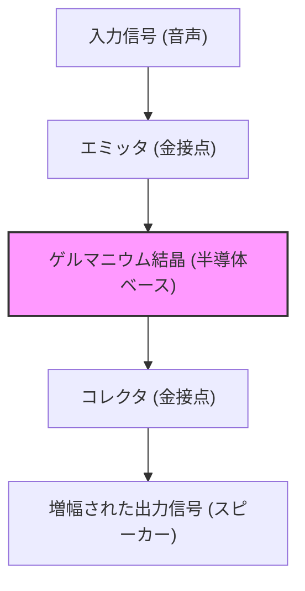

現代の私たちの生活は、スマートフォンからスーパーコンピュータ、自動車、家電に至るまで、あらゆる電子機器に囲まれています。これらすべての中心にあるのは、情報を処理し、記憶するための微小な電子部品「トランジスタ」です。トランジスタがなければ、インターネットも、AIも、宇宙開発も、現代の高度な医療も存在しませんでした。

本記事では、この人類史上最も重要な発明の一つであるトランジスタがどのようにして生まれたのか、そしてそれがどのように発展し、現在の「シリコンバレー」というイノベーションの中心地を生み出したのか、その壮大な歴史を深く掘り下げていきます。

## 1. 真空管の限界と電話網の壁

トランジスタが発明される以前、電子機器の主役は「真空管」でした。真空管は、ガラスの管の中を真空にし、フィラメントを加熱して電子を放出させることで、電流の増幅やスイッチングを行うデバイスです。1906年にリー・ド・フォレストによって発明された三極真空管（オーディオン）は、ラジオ放送や初期の電話通信、そして世界初の汎用電子計算機「ENIAC」において中心的な役割を果たしました。

しかし、真空管には決定的な弱点がありました。

1. **寿命が短い**: フィラメントが焼き切れるため、定期的な交換が不可欠でした。ENIACには約18,000本の真空管が使われていましたが、数日に一度はどこかの真空管が故障し、システム全体が停止するという問題を抱えていました。
2. **消費電力が膨大**: 熱電子を放出するために常にフィラメントを高温に熱しておく必要があり、莫大な電力を消費しました。
3. **発熱とサイズ**: 大量の熱を発するため、巨大な冷却設備が必要でした。また、物理的なサイズも大きく、機器の小型化には限界がありました。

この真空管の限界に最も頭を悩ませていたのが、アメリカの電話通信網を支配していたAT&T（アメリカ電信電話会社）とその研究開発部門である**ベル研究所（Bell Laboratories）**でした。

当時の電話交換機は、何万もの機械式リレー（電磁石によるスイッチ）を使って音声をルーティングしていましたが、動作が遅く、接点の摩耗による故障が頻発していました。また、長距離電話の信号を増幅するためには真空管中継器が多数必要でしたが、海底ケーブルなどに真空管を組み込むことは、寿命と電力の問題から極めて困難でした。

当時のAT&T社長であったウォルター・ギフォードは、「機械式リレーと真空管に代わる、小型で頑丈、かつ消費電力の少ない『固体（ソリッドステート）』の増幅器」の必要性を強く認識していました。これが、トランジスタ開発の直接的な動機となったのです。

## 2. ベル研究所と3人の天才たち

1945年、第二次世界大戦が終結すると、ベル研究所の研究部門長であったマーヴィン・ケリーは、新しい増幅器を開発するための特別チーム「固体物理学グループ」を編成しました。このチームの中心となったのが、後にノーベル物理学賞を共同受賞することになる3人の科学者です。

*   **ウィリアム・ショックレー (William Shockley)**: チームのリーダー。理論物理学者であり、並外れた直感と洞察力を持つ一方で、野心的で自己顕示欲が強く、人間関係に波風を立てやすい性格でした。彼は戦前から半導体（特にゲルマニウムやシリコン）を用いた増幅器のアイデアを温めていました。
*   **ジョン・バーディーン (John Bardeen)**: 寡黙で思慮深い理論物理学者。量子力学と固体物理学の深い知識を持ち、後にトランジスタの発明だけでなく、超伝導のBCS理論でもノーベル物理学賞を受賞する（史上唯一、物理学賞を2度受賞した人物）天才です。
*   **ウォルター・ブラッテン (Walter Brattain)**: 優れた実験物理学者。理論を現実の装置として組み立てる名人であり、手先が非常に器用でした。明るく社交的な性格で、バーディーンとは公私ともに良きパートナーとなりました。

ショックレーは当初、「電界効果（Field Effect）」を利用した半導体増幅器を考案しました。半導体の表面に電界をかければ、内部の電流を制御できるはずだと考えたのです。しかし、何度実験を繰り返しても、計算通りに電流が増幅されることはありませんでした。

この謎を解明したのがバーディーンでした。彼は1947年春、「表面準位（Surface States）」という新しい概念を提唱しました。半導体の表面には電子が捕獲されやすい状態が存在し、これがシールドのように働いて外部からの電界を打ち消してしまうため、内部に影響を及ぼせないのだと理論づけたのです。

## 3. 奇跡の1ヶ月：点接触型トランジスタの誕生

バーディーンの理論によって失敗の原因が明らかになったことで、実験は新たな方向へと進み始めました。1947年11月下旬から12月にかけての約1ヶ月間は、「奇跡の1ヶ月」と呼ばれています。バーディーンとブラッテンのコンビは、昼夜を問わず実験に没頭しました。

彼らは、ゲルマニウムの結晶表面に2つの金属針（接点）を極めて接近させて接触させれば、表面準位の影響を回避して電流を制御できるのではないかと考えました。

1947年12月16日、ブラッテンは歴史的な実験装置を組み上げました。彼はプラスチックの三角形のくさびの先端に、金箔を貼り付けました。そして、その金箔の先端をカミソリの刃で極細の隙間（約0.05ミリメートル）ができるように切り込みを入れ、2つの接点を作りました。このくさびをバネ（ペーパークリップを改造したもの）でゲルマニウムのブロックに押し付けたのです。

この粗末に見える装置に音声信号を入力すると、出力側の信号が明らかに入力よりも大きくなっていました。**増幅作用が確認されたのです。**

1947年12月23日、ベル研究所の幹部たちを集めたデモンストレーションが行われました。ブラッテンがマイクに向かって話しかけると、ゲルマニウムの結晶を通った音声がスピーカーから大きく、そしてはっきりと再生されました。これが、世界初の「**点接触型トランジスタ（Point-contact transistor）**」が産声を上げた瞬間でした。

この小さな装置は、真空管のように熱くなることもなく、ウォームアップの時間も不要で、瞬時に動作しました。「トランスファ・レジスタ（伝達抵抗器）」を略して「トランジスタ」と名付けられたこの発明は、電子工学の歴史を永遠に変えることになります。

## 4. ショックレーの執念：接合型トランジスタへの進化

点接触型トランジスタの発明は、バーディーンとブラッテンの偉大な功績でした。しかし、グループのリーダーであったショックレーは、この成功を素直に喜ぶことができませんでした。最も重要な発明の瞬間に自分が直接関わっていなかったこと、そして特許の筆頭発明者がバーディーンとブラッテンになったことに、彼は強烈な嫉妬と疎外感を覚えました。

「自分ならもっと優れたトランジスタを作れるはずだ」。ショックレーはホテルに閉じこもり、狂気とも言える集中力で理論を構築し始めました。

点接触型トランジスタは、針の接触具合によって性能が大きくばらつくため、量産が難しく、ノイズが多いという欠点がありました。ショックレーは、表面の接触ではなく、半導体の内部の「接合部」を利用する新しい構造を考案しました。

それが「**接合型トランジスタ（Junction transistor）**」です。彼は、p型半導体（正の電荷＝正孔が電気を運ぶ）とn型半導体（負の電荷＝電子が電気を運ぶ）をサンドイッチのように重ね合わせる（p-n-pまたはn-p-n構造）ことで、はるかに安定して高効率な増幅が可能になることを数学的に証明しました。

1951年、ベル研究所のゴードン・ティールらの尽力により、高純度な半導体結晶を引き上げる技術が開発され、ショックレーの理論通りに接合型トランジスタが実現しました。この接合型トランジスタは、ノイズが少なく、大量生産にも向いていたため、点接触型に代わって急速に普及していくことになります。

1956年、ショックレー、バーディーン、ブラッテンの3人は「半導体の研究およびトランジスタ効果の発見」により、ノーベル物理学賞を共同受賞しました。しかし、この栄光の裏で、3人の関係は既に修復不可能なほどに冷え切っていました。バーディーンとブラッテンは、ショックレーの独善的な態度に耐えかね、別の研究部署へと去っていったのです。

## 5. ゲルマニウムからシリコンへ：ゴードン・ティールの挑戦

初期のトランジスタは、すべて「ゲルマニウム」を材料として作られていました。ゲルマニウムは比較的低い温度で溶けるため加工しやすいという利点がありました。

しかし、ゲルマニウムには致命的な弱点がありました。それは「熱に弱い」ことです。温度が75度程度になると、半導体としての性質が失われ、ただの導体（電流をダダ漏れにする金属）になってしまうのです。このため、初期のトランジスタラジオを夏の暑い日の車内に放置すると、全く使い物にならなくなるという問題が起きていました。また、軍事用途（ミサイルの制御など）においては、この温度特性の悪さは致命的でした。

この問題を解決するには、材料をより高温に耐えられる「**シリコン（ケイ素）**」に変更するしかありませんでした。シリコンは地球上の地殻に酸素に次いで大量に存在するありふれた元素（砂や石英の主成分）ですが、当時の技術では、トランジスタに使えるほどの極めて純度の高いシリコンの単結晶を作り出すことは至難の業でした。

この難題に挑んだのが、テキサス・インスツルメンツ（TI）社に移籍していた**ゴードン・ティール**です。ティールはベル研究所時代に培った結晶成長の技術を駆使し、ついにシリコンの単結晶を作ることに成功しました。

1954年、学会の場で各社のゲルマニウムトランジスタが熱湯に入れられて次々と動作を停止していく中、ティールは自社開発のシリコントランジスタが熱湯の中でも平然と音楽を鳴らし続けるデモンストレーションを行い、会場を驚嘆させました。ここから、半導体の主役はゲルマニウムからシリコンへと完全に交代し、「シリコン時代」が幕を開けたのです。

## 6. MOSFETの発明とICへの道

接合型シリコントランジスタの登場によって電子機器の小型化は大きく進みましたが、トランジスタの数が数百、数千と増えるにつれて、それらを配線ではんだ付けする作業が限界に達していました（配線の壁）。

これを解決したのが、1958年にジャック・キルビー（TI）とロバート・ノイス（フェアチャイルド）がそれぞれ独立に発明した「**集積回路（IC）**」です。複数のトランジスタや抵抗を一つのシリコンチップの上に一括して作り込む技術でした。

しかし、初期のICで使われていたのは依然として接合型（バイポーラ型）トランジスタであり、消費電力や微細化の限界が見え始めていました。

ここで再び、ショックレーが最初に夢見ながらもバーディーンの「表面準位」の壁に阻まれて実現できなかった「電界効果トランジスタ（FET）」のアイデアが蘇ります。

1959年、ベル研究所の**モハメド・アタラ（Mohamed Atalla）**と**ダウォン・カーン（Dawon Kahng）**は、シリコンの表面を熱酸化させて極薄の「二酸化シリコン（ガラス）」の絶縁膜を作ることで、表面準位の影響を無効化できることを発見しました。

彼らはこの技術を使い、金属（Metal）、酸化膜（Oxide）、半導体（Semiconductor）を重ねた構造の「**MOSFET（金属酸化膜半導体電界効果トランジスタ）**」を発明しました。

MOSFETは、従来の接合型トランジスタに比べて製造プロセスがシンプルで、消費電力が桁違いに少なく、何より「極限まで小さくできる」という素晴らしい特性を持っていました。現在、私たちのスマートフォンやPCのCPUの中には、このMOSFETが数十億個、数百億個という単位で詰め込まれています。アタラとカーンの発明こそが、現代のデジタル社会の真の土台となったのです。

## 7. 「8人の反逆者」とシリコンバレーの誕生

トランジスタの進化の歴史を語る上で、技術そのものと同じくらい重要なのが、これらの技術をビジネスへと昇華させた「人々」のドラマです。その舞台となったのが、カリフォルニア州のサンタクララバレー、現在の「**シリコンバレー**」です。

ノーベル賞を受賞したショックレーは1956年、自らの会社「ショックレー半導体研究所」を設立し、故郷であるカリフォルニア州パロアルトに拠点を構えました。彼は全米から優秀な若手科学者やエンジニアを次々とスカウトしました。その中には、後にインテルを創設する**ロバート・ノイス**や**ゴードン・ムーア**も含まれていました。

しかし、ショックレーは科学者としては天才でしたが、経営者としては最悪でした。彼のパラノイア的（偏執狂的）な性格、部下を全く信用せずに嘘発見器にかけようとするなどの常軌を逸したマネジメント、そして研究方針の対立（有望なシリコントランジスタではなく、複雑な4層ダイオードに固執したこと）により、職場の空気は最悪の状態に陥りました。

1957年9月、ついに堪忍袋の緒が切れた8人の優秀な若手研究者たち（ノイス、ムーアを含む）は、ショックレーの元を去る決意をします。ショックレーは彼らを「**8人の反逆者（Traitorous Eight）**」と呼んで激怒しました。

彼ら8人は、投資家アーサー・ロックの支援と、フェアチャイルド・カメラ・アンド・インストルメント社の資金提供を受け、「**フェアチャイルドセミコンダクター（Fairchild Semiconductor）**」を設立しました。

フェアチャイルドは、ジャン・ヘルニが発明した「**プレーナ技術（Planar process）**」（酸化膜を使ってシリコン表面を平坦に保護し、写真印刷のように回路を焼き付ける技術）を武器に、瞬く間に世界トップの半導体企業へと成長しました。このプレーナ技術こそが、その後のICの大量生産を可能にした革命的な製造方法でした。

そして、フェアチャイルドセミコンダクターこそが、シリコンバレーの「ビッグバン」となりました。フェアチャイルドで経験を積んだ優秀なエンジニアたちが、その後次々とスピンアウトして新しいベンチャー企業を立ち上げたからです。これを「フェアチルドレン（Fairchildren）」と呼びます。

ロバート・ノイスとゴードン・ムーアが設立した**Intel**、ジェリー・サンダースが設立した**AMD**など、現在のシリコンバレーを代表する企業の多くが、そのルーツを「8人の反逆者」とフェアチャイルドに持っています。

## 8. 結論：小さな部品がもたらした巨大な革命

ベル研究所の片隅で、クリップと金箔とゲルマニウムの破片から生まれた不格好な「点接触型トランジスタ」は、わずか数十年という期間で、接合型、シリコン、IC、そしてMOSFETへと驚異的な進化を遂げました。

それは、真空管という熱くて巨大な呪縛から人類を解放し、情報を「スイッチのON/OFF（0と1）」というデジタル信号として、極めて高速かつ安価に処理する世界を切り開きました。

もし、ショックレーの野心がなければ、バーディーンの理論的な閃きがなければ、ブラッテンの神業のような実験技術がなければ、そして「8人の反逆者」たちが独立してカリフォルニアの地にシリコンの種を蒔かなければ、私たちが今享受しているデジタル社会は、全く違ったものになっていたか、あるいは何十年も遅れていたことでしょう。

トランジスタの歴史は、単なる技術の進化の歴史ではありません。それは、嫉妬、野心、反逆、そして限界を突破しようとする人間の果てしない探求心の歴史そのものなのです。

（了）
