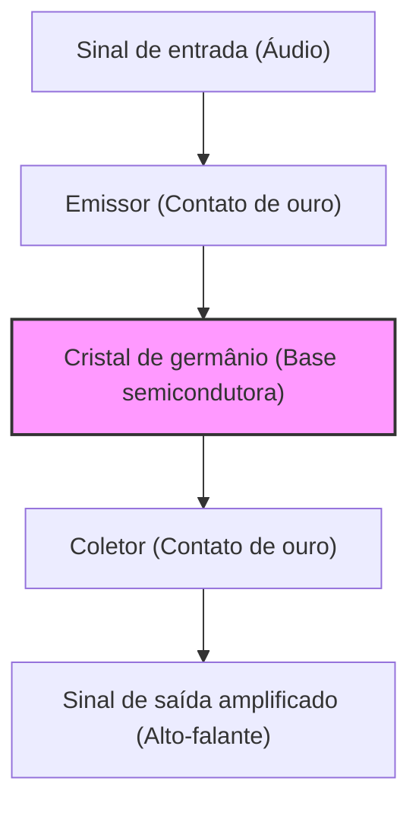

A nossa vida moderna é cercada por dispositivos eletrônicos de todos os tipos, desde smartphones até supercomputadores, automóveis e eletrodomésticos. No centro de tudo isso está o "transistor", um minúsculo componente eletrônico responsável por processar e armazenar informações. Sem o transistor, a internet, a IA, a exploração espacial e a medicina avançada moderna não existiriam.

Neste artigo, vamos explorar profundamente a história épica de como nasceu o transistor, uma das invenções mais importantes da história da humanidade, como ele evoluiu e como deu origem ao atual centro de inovação conhecido como "Vale do Silício".

## 1. Os Limites das Válvulas e a Barreira da Rede Telefônica

Antes da invenção do transistor, os protagonistas dos dispositivos eletrônicos eram as "válvulas" (tubos de vácuo). A válvula é um dispositivo que realiza amplificação e chaveamento de corrente, criando um vácuo dentro de um tubo de vidro e aquecendo um filamento para emitir elétrons. A válvula triodo (Audion), inventada por Lee De Forest em 1906, desempenhou um papel central nas transmissões de rádio, nas comunicações telefônicas iniciais e no "ENIAC", o primeiro computador eletrônico de uso geral do mundo.

No entanto, as válvulas tinham desvantagens cruciais:

1. **Vida útil curta**: Como o filamento queimava, substituições regulares eram indispensáveis. O ENIAC usava cerca de 18.000 válvulas e sofria com o problema de uma válvula falhar a cada poucos dias, fazendo todo o sistema parar.
2. **Enorme consumo de energia**: O filamento precisava ser mantido constantemente em alta temperatura para emitir os elétrons, consumindo muita eletricidade.
3. **Geração de calor e tamanho**: Por gerarem muito calor, necessitavam de equipamentos de refrigeração massivos. Além disso, eram fisicamente grandes, o que limitava a miniaturização dos aparelhos.

Quem mais sofria com os limites das válvulas era a AT&T (American Telephone & Telegraph), que dominava a rede de comunicações telefônicas dos EUA, e o seu departamento de pesquisa e desenvolvimento, o **Bell Labs (Bell Laboratories)**.

As centrais telefônicas da época usavam dezenas de milhares de relés mecânicos (interruptores eletromagnéticos) para rotear o som, mas eles eram lentos e quebravam com frequência devido ao desgaste dos contatos. Além disso, eram necessários muitos repetidores a válvula para amplificar os sinais das chamadas de longa distância, mas incorporar válvulas em cabos submarinos era extremamente difícil devido a problemas de vida útil e energia.

O então presidente da AT&T, Walter Gifford, reconheceu fortemente a necessidade de um "amplificador de 'estado sólido (solid state)', pequeno, robusto e de baixo consumo, para substituir relés mecânicos e válvulas". Esse foi o motivo direto para o desenvolvimento do transistor.

## 2. O Bell Labs e os 3 Gênios

Em 1945, com o fim da Segunda Guerra Mundial, Mervin Kelly, diretor do departamento de pesquisa do Bell Labs, formou uma equipe especial, o "Grupo de Física de Estado Sólido", para desenvolver um novo amplificador. O núcleo desta equipe era formado por três cientistas que mais tarde dividiriam o Prêmio Nobel de Física:

*   **William Shockley**: O líder da equipe. Físico teórico, possuía uma intuição e visão extraordinárias, mas, ao mesmo tempo, era ambicioso, exibicionista e tinha uma personalidade que facilmente criava conflitos interpessoais. Desde antes da guerra, ele nutria a ideia de um amplificador usando semicondutores (especialmente germânio e silício).
*   **John Bardeen**: Um físico teórico quieto e atencioso. Ele tinha um profundo conhecimento da mecânica quântica e da física do estado sólido e mais tarde tornou-se um gênio que ganhou o Prêmio Nobel não apenas pela invenção do transistor, mas também pela teoria BCS da supercondutividade (sendo a única pessoa na história a ganhar o Prêmio Nobel de Física duas vezes).
*   **Walter Brattain**: Um físico experimental brilhante. Mestre em transformar teorias em dispositivos reais, ele era extremamente habilidoso com as mãos. Com uma personalidade alegre e sociável, tornou-se um grande parceiro de Bardeen, tanto no trabalho quanto na vida pessoal.

Inicialmente, Shockley idealizou um amplificador semicondutor baseado no "Efeito de Campo (Field Effect)". Ele pensava que, ao aplicar um campo elétrico à superfície de um semicondutor, seria possível controlar a corrente interna. No entanto, por mais que repetissem as experiências, a corrente nunca era amplificada como nos cálculos.

Quem desvendou esse mistério foi Bardeen. Na primavera de 1947, ele propôs um novo conceito chamado "Estados de Superfície (Surface States)". Ele teorizou que existem estados na superfície dos semicondutores onde os elétrons são facilmente capturados, agindo como um escudo que anula os campos elétricos externos, impossibilitando assim afetar o interior.

## 3. O Mês dos Milagres: O Nascimento do Transistor de Contato de Ponto

Com a causa do fracasso esclarecida pela teoria de Bardeen, os experimentos tomaram um novo rumo. O período de cerca de um mês, entre o final de novembro e dezembro de 1947, ficou conhecido como o "Mês dos Milagres". A dupla Bardeen e Brattain mergulhou nos experimentos dia e noite.

Eles pensaram que, se aproximassem extremamente duas pontas de metal (contatos) da superfície de um cristal de germânio, poderiam contornar os efeitos dos estados de superfície e controlar a corrente.

Em 16 de dezembro de 1947, Brattain montou o dispositivo experimental histórico. Ele anexou folha de ouro à ponta de uma cunha de plástico triangular. Em seguida, fez um corte na ponta da folha de ouro com uma lâmina de barbear para criar uma fenda extremamente fina (cerca de 0,05 milímetros), formando dois contatos. Ele pressionou essa cunha contra um bloco de germânio usando uma mola (feita de um clipe de papel modificado).

Ao inserir um sinal de áudio nesse dispositivo de aparência tosca, o sinal no lado da saída era claramente maior que o de entrada. **O efeito de amplificação havia sido confirmado.**

No dia 23 de dezembro de 1947, foi realizada uma demonstração para os executivos do Bell Labs. Quando Brattain falou ao microfone, sua voz, que passou pelo cristal de germânio, foi reproduzida em alto e bom som pelo alto-falante. Este foi o momento em que nasceu o primeiro "**Transistor de contato de ponto (Point-contact transistor)**" do mundo.

Este pequeno dispositivo não esquentava como uma válvula, não precisava de tempo de aquecimento e funcionava instantaneamente. A invenção, nomeada "transistor" (uma abreviação de "transfer resistor" - resistor de transferência), mudaria para sempre a história da engenharia eletrônica.

## 4. A Obsessão de Shockley: Evolução para o Transistor de Junção

A invenção do transistor de contato de ponto foi uma grande conquista de Bardeen e Brattain. No entanto, o líder do grupo, Shockley, não conseguiu se alegrar sinceramente com esse sucesso. Ele sentiu uma forte inveja e exclusão por não ter estado diretamente envolvido no momento da invenção mais importante, e por Bardeen e Brattain serem os inventores principais da patente.

"Eu poderia fazer um transistor ainda melhor". Shockley trancou-se num hotel e, com uma concentração beirando a loucura, começou a formular teorias.

O transistor de contato de ponto tinha a desvantagem de que seu desempenho variava muito dependendo do contato das pontas, o que dificultava a produção em massa e gerava muito ruído. Shockley idealizou uma nova estrutura que usava "junções" no interior do semicondutor, em vez de contatos na superfície.

Esse foi o "**Transistor de junção (Junction transistor)**". Ele provou matematicamente que ao empilhar semicondutores do tipo p (cargas positivas = buracos carregam eletricidade) e do tipo n (cargas negativas = elétrons carregam eletricidade) como um sanduíche (estruturas p-n-p ou n-p-n), seria possível obter uma amplificação muito mais estável e eficiente.

Em 1951, graças aos esforços de Gordon Teal e outros no Bell Labs, foi desenvolvida a tecnologia para criar cristais semicondutores de alta pureza, concretizando o transistor de junção exatamente como na teoria de Shockley. Como este transistor de junção produzia menos ruído e era mais adequado para produção em massa, rapidamente substituiu o tipo de contato de ponto e se popularizou.

Em 1956, os três, Shockley, Bardeen e Brattain, ganharam conjuntamente o Prêmio Nobel de Física por "pesquisas em semicondutores e pela descoberta do efeito transistor". Porém, por trás dessa glória, o relacionamento dos três já estava irreparavelmente desgastado. Bardeen e Brattain, incapazes de tolerar a atitude autoritária de Shockley, haviam partido para outros departamentos de pesquisa.

## 5. Do Germânio ao Silício: O Desafio de Gordon Teal

Os primeiros transistores eram todos feitos de "germânio". O germânio tinha a vantagem de ser fácil de processar porque derretia a uma temperatura relativamente baixa.

No entanto, o germânio tinha um ponto fraco fatal: "era vulnerável ao calor". Quando a temperatura atingia cerca de 75 graus, ele perdia as propriedades de semicondutor e se tornava um mero condutor (um metal que vaza corrente elétrica). Por isso, se um dos primeiros rádios transistores fosse deixado dentro de um carro num dia quente de verão, ele ficava completamente inutilizável. Além disso, para aplicações militares (como controle de mísseis), essas más características térmicas eram fatais.

A única solução para este problema era mudar o material para o "**silício**", que poderia suportar temperaturas mais altas. O silício é um elemento comum (o principal componente da areia e do quartzo), existindo em grande abundância na crosta terrestre logo atrás do oxigênio, mas com a tecnologia da época, produzir um monocristal de silício de pureza extrema, suficiente para ser usado em transistores, era uma tarefa hercúlea.

Quem enfrentou esse desafio foi **Gordon Teal**, que havia se transferido para a Texas Instruments (TI). Utilizando as técnicas de crescimento de cristais que desenvolveu no Bell Labs, Teal finalmente conseguiu criar um monocristal de silício.

Em 1954, numa conferência em que os transistores de germânio de várias empresas paravam de funcionar um após o outro ao serem colocados em água fervente, Teal surpreendeu a plateia com uma demonstração de que o transistor de silício desenvolvido pela sua empresa continuava tocando música tranquilamente, mesmo em água fervente. A partir daí, o papel principal dos semicondutores mudou completamente do germânio para o silício, e começou a "Era do Silício".

## 6. A Invenção do MOSFET e o Caminho para o CI

Embora o surgimento do transistor de junção de silício tenha avançado muito a miniaturização dos eletrônicos, conforme o número de transistores aumentava para centenas e milhares, o trabalho de soldá-los com fios estava chegando ao seu limite (a barreira da fiação).

O que resolveu isso foi o "**Circuito Integrado (CI)**", inventado independentemente por Jack Kilby (da TI) e Robert Noyce (da Fairchild) em 1958. Era uma tecnologia para construir múltiplos transistores e resistores todos juntos em um único chip de silício.

No entanto, os primeiros CIs ainda utilizavam transistores de junção (bipolares), e os limites de consumo de energia e miniaturização já começavam a ser percebidos.

Aqui ressurge a ideia do "transistor de efeito de campo (FET)", que Shockley havia sonhado no início, mas não conseguiu realizar devido à barreira dos "estados de superfície" apontada por Bardeen.

Em 1959, **Mohamed Atalla** e **Dawon Kahng** do Bell Labs descobriram que os efeitos dos estados de superfície poderiam ser anulados através da oxidação térmica da superfície de silício, para criar uma película isolante ultrafina de "dióxido de silício (vidro)".

Usando essa tecnologia, eles inventaram o "**MOSFET (Transistor de Efeito de Campo Semicondutor de Óxido Metálico)**", que tinha uma estrutura com camadas de metal, óxido e semicondutor.

O MOSFET tinha um processo de fabricação mais simples que os transistores de junção tradicionais, consumia significativamente menos energia e, o mais importante, tinha a incrível propriedade de poder ser "miniaturizado ao extremo". Hoje, dezenas de bilhões de MOSFETs estão empacotados nas CPUs dos nossos smartphones e PCs. A invenção de Atalla e Kahng tornou-se o verdadeiro alicerce da sociedade digital moderna.

## 7. Os "8 Traidores" e o Nascimento do Vale do Silício

Ao falar da história da evolução do transistor, o drama das "pessoas" que transformaram essas tecnologias em negócios é tão importante quanto a tecnologia em si. O palco disso foi o Vale de Santa Clara na Califórnia, o atual "**Vale do Silício**".

O Prêmio Nobel Shockley fundou a sua própria empresa, o "Shockley Semiconductor Laboratory", em 1956, e estabeleceu-se em Palo Alto, Califórnia, a sua cidade natal. Ele recrutou um após o outro jovens cientistas e engenheiros brilhantes de todos os EUA. Entre eles estavam **Robert Noyce** e **Gordon Moore**, que mais tarde fundariam a Intel.

No entanto, enquanto Shockley era um gênio como cientista, era um péssimo gestor. Sua personalidade paranoica, suas práticas de gestão bizarras como tentar colocar os funcionários no detector de mentiras por não confiar neles, e divergências de pesquisa (sua insistência em diodos complexos de 4 camadas, em vez dos promissores transistores de silício) tornaram o ambiente de trabalho o pior possível.

Em setembro de 1957, oito jovens investigadores brilhantes (incluindo Noyce e Moore), que finalmente chegaram ao limite, decidiram deixar Shockley. Shockley ficou furioso e chamou-os de "Os **8 Traidores (Traitorous Eight)**".

Esses oito, com o apoio do investidor Arthur Rock e financiamento da Fairchild Camera and Instrument Corporation, fundaram a "**Fairchild Semiconductor**".

A Fairchild cresceu num piscar de olhos e tornou-se a maior empresa de semicondutores do mundo, armada com a "**Tecnologia Planar (Planar process)**" inventada por Jean Hoerni (uma tecnologia que usava um filme de óxido para proteger de forma plana a superfície de silício e imprimir os circuitos como numa impressão fotográfica). Esta tecnologia Planar foi o método de fabrico revolucionário que possibilitou a posterior produção em massa de CIs.

E a Fairchild Semiconductor tornou-se o "Big Bang" do Vale do Silício. Isso ocorreu porque excelentes engenheiros que ganharam experiência na Fairchild posteriormente saíram em sucessão para lançar novas empresas iniciantes. Estes são conhecidos como "Fairchildren".

Muitas das empresas de hoje que representam o Vale do Silício, como a **Intel**, fundada por Robert Noyce e Gordon Moore, e a **AMD**, fundada por Jerry Sanders, têm as suas raízes nos "8 Traidores" e na Fairchild.

## 8. Conclusão: Uma Gigantesca Revolução Trazida por um Pequeno Componente

No canto do Bell Labs, o desajeitado "transistor de contato de ponto", nascido de um clipe, folha de ouro e um fragmento de germânio, sofreu uma evolução incrível para o tipo de junção, silício, CIs e MOSFET em apenas algumas décadas.

Ele libertou a humanidade da maldição massiva e quente das válvulas, abrindo as portas para um mundo onde a informação é processada em velocidades extremamente altas e a baixo custo como sinais digitais de "LIGA/DESLIGA dos interruptores (0 e 1)".

Se não fosse pela ambição de Shockley, a inspiração teórica de Bardeen, a miraculosa técnica experimental de Brattain e se os "8 Traidores" não tivessem se tornado independentes para plantar as sementes do silício na Califórnia, a sociedade digital de que desfrutamos hoje seria completamente diferente, ou teria atrasado muitas décadas.

A história dos transistores não é apenas uma história de evolução tecnológica. É a própria história do ciúme, ambição, rebelião e a infinita busca humana para ultrapassar os seus limites.

(Fim)
