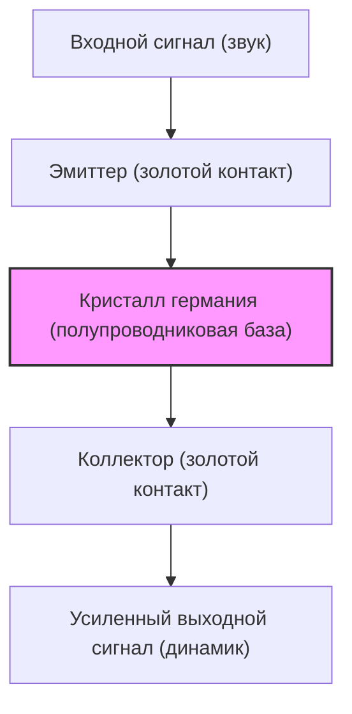

В нашей современной жизни мы окружены всевозможными электронными устройствами, от смартфонов и суперкомпьютеров до автомобилей и бытовой техники. В основе всего этого лежит крошечный электронный компонент — «транзистор», предназначенный для обработки и хранения информации. Без транзисторов не было бы ни интернета, ни искусственного интеллекта, ни освоения космоса, ни современной передовой медицины.

В этой статье мы подробно рассмотрим грандиозную историю одного из самых важных изобретений в истории человечества — транзистора: как он был создан, как развивался и как породил сегодняшний центр инноваций, известный как «Кремниевая долина».

## 1. Пределы вакуумных ламп и барьеры телефонных сетей

До изобретения транзистора главную роль в электронике играли «вакуумные лампы». Вакуумная лампа — это устройство, которое усиливает или переключает электрический ток за счет откачивания воздуха из стеклянной колбы и нагрева нити накаливания для испускания электронов. Изобретенный в 1906 году Ли де Форестом вакуумный триод (аудион) сыграл центральную роль в радиовещании, ранней телефонной связи и первом в мире универсальном электронном компьютере «ЭНИАК» (ENIAC).

Однако у вакуумных ламп были фатальные недостатки.

1. **Короткий срок службы**: Нити накаливания перегорали, поэтому регулярная замена была неизбежной. В ЭНИАКе использовалось около 18 000 вакуумных ламп, но раз в несколько дней какая-нибудь из них выходила из строя, что приводило к остановке всей системы.
2. **Огромное энергопотребление**: Для испускания термоэлектронов нить накаливания должна была постоянно нагреваться до высоких температур, потребляя колоссальное количество энергии.
3. **Выделение тепла и размеры**: Поскольку они выделяли много тепла, требовалось огромное охлаждающее оборудование. Кроме того, физические размеры ламп были большими, что ограничивало миниатюризацию устройств.

Больше всего эти ограничения вакуумных ламп беспокоили компанию AT&T (Американская телефонная и телеграфная компания), которая доминировала в телефонной сети США, и ее научно-исследовательский отдел — **Bell Laboratories** (Лаборатории Белла).

В то время телефонные станции использовали десятки тысяч механических реле (переключателей на электромагнитах) для маршрутизации голоса, но они работали медленно и часто выходили из строя из-за износа контактов. Кроме того, для усиления сигналов при междугородных звонках требовалось множество вакуумных ретрансляторов, но встраивать вакуумные лампы в подводные кабели и другие подобные места было крайне сложно из-за проблем со сроком службы и электропитанием.

Тогдашний президент AT&T Уолтер Гиффорд остро осознавал необходимость создания «твердотельного» (solid-state) усилителя на замену механическим реле и вакуумным лампам: компактного, прочного и с низким энергопотреблением. Это и стало непосредственным мотивом для разработки транзистора.

## 2. Лаборатории Белла и три гения

В 1945 году, после окончания Второй мировой войны, руководитель исследовательского отдела Bell Labs Мервин Келли сформировал специальную команду — «Группу физики твердого тела» — для разработки нового усилителя. В центре этой команды оказались три ученых, которые впоследствии совместно получили Нобелевскую премию по физике.

*   **Уильям Шокли (William Shockley)**: Лидер команды. Физик-теоретик, обладающий выдающейся интуицией и проницательностью, но в то же время амбициозный, любящий быть в центре внимания и склонный к конфликтам. Еще до войны он вынашивал идею создания усилителя на основе полупроводников (особенно германия и кремния).
*   **Джон Бардин (John Bardeen)**: Молчаливый и вдумчивый физик-теоретик. Обладая глубокими знаниями в области квантовой механики и физики твердого тела, он стал гением, получившим впоследствии Нобелевскую премию не только за изобретение транзистора, но и за теорию сверхпроводимости БКШ (единственный человек в истории, дважды удостоенный Нобелевской премии по физике).
*   **Уолтер Браттейн (Walter Brattain)**: Выдающийся физик-экспериментатор. Мастер воплощения теории в реальные устройства с невероятно ловкими руками. Будучи жизнерадостным и общительным человеком, он стал отличным партнером Бардина как на работе, так и в жизни.

Шокли изначально задумал полупроводниковый усилитель, использующий «эффект поля» (Field Effect). Он полагал, что если приложить электрическое поле к поверхности полупроводника, можно будет управлять током внутри него. Однако сколько бы они ни повторяли эксперименты, ток не усиливался так, как было рассчитано.

Разгадал эту загадку Бардин. Весной 1947 года он предложил новую концепцию «поверхностных состояний» (Surface States). Он теоретически обосновал, что на поверхности полупроводника существуют состояния, в которых электроны легко захватываются, и это работает как щит, нейтрализующий внешнее электрическое поле, тем самым не позволяя ему воздействовать на внутреннюю часть.

## 3. Чудесный месяц: рождение точечного контактного транзистора

Когда благодаря теории Бардина стала ясна причина неудач, эксперименты приняли новое направление. Период примерно в один месяц с конца ноября по декабрь 1947 года называют «Чудесным месяцем». Дуэт Бардина и Браттейна погрузился в эксперименты днем и ночью.

Они предположили, что если две металлические иглы (контакты) расположить очень близко друг к другу на поверхности кристалла германия, можно будет управлять током, избегая влияния поверхностных состояний.

16 декабря 1947 года Браттейн собрал историческую экспериментальную установку. Он прикрепил золотую фольгу к кончику пластикового треугольного клина. Затем с помощью лезвия бритвы он сделал надрез на кончике фольги, создав чрезвычайно тонкий зазор (около 0,05 мм), образовав таким образом два контакта. Этот клин он прижал к блоку германия с помощью пружины (переделанной из канцелярской скрепки).

Когда на это на первый взгляд примитивное устройство подали звуковой сигнал, сигнал на выходе оказался явно громче, чем на входе. **Был подтвержден эффект усиления.**

23 декабря 1947 года состоялась демонстрация для руководства Bell Labs. Когда Браттейн заговорил в микрофон, его голос, прошедший через кристалл германия, был громко и четко воспроизведен из динамика. Это был момент, когда на свет появился первый в мире «**точечный контактный транзистор (Point-contact transistor)**».

Это крошечное устройство не нагревалось, как вакуумные лампы, не требовало времени на прогрев и работало мгновенно. Это изобретение, названное «транзистором» — сокращением от «трансфер-резистор» (transfer resistor - резистор передачи), — навсегда изменит историю электроники.

## 4. Одержимость Шокли: эволюция к плоскостному транзистору

Изобретение точечного контактного транзистора было великим достижением Бардина и Браттейна. Однако руководитель группы Шокли не мог искренне радоваться этому успеху. Тот факт, что он не принимал непосредственного участия в самый важный момент изобретения, а главными изобретателями в патенте стали Бардин и Браттейн, вызвал у него сильную ревность и чувство отчужденности.

«Я смогу создать еще более совершенный транзистор», — подумал он. Шокли заперся в гостиничном номере и с маниакальной сосредоточенностью начал разрабатывать новую теорию.

Недостатками точечного контактного транзистора были сильные колебания характеристик в зависимости от контакта игл, сложность массового производства и высокий уровень шума. Шокли придумал новую структуру, использующую не поверхностный контакт, а «переходы» внутри полупроводника.

Так появился «**плоскостной транзистор (Junction transistor)**». Он математически доказал, что наложение полупроводников p-типа (электричество переносят положительные заряды = дырки) и полупроводников n-типа (отрицательные заряды = электроны) подобно сэндвичу (структуры p-n-p или n-p-n) сделает возможным гораздо более стабильное и высокоэффективное усиление.

В 1951 году благодаря усилиям Гордона Тила и других сотрудников Bell Labs была разработана технология выращивания полупроводниковых кристаллов высокой чистоты, и плоскостной транзистор воплотился в жизнь в точном соответствии с теорией Шокли. Эти транзисторы производили меньше шума и больше подходили для массового производства, поэтому они быстро вытеснили точечные контактные транзисторы.

В 1956 году Шокли, Бардин и Браттейн совместно получили Нобелевскую премию по физике за «исследования полупроводников и открытие транзисторного эффекта». Однако за этой славой скрывалось то, что отношения между ними уже безнадежно испортились. Не выдержав эгоцентричного поведения Шокли, Бардин и Браттейн ушли в другие исследовательские отделы.

## 5. От германия к кремнию: вызов Гордона Тила

Все первые транзисторы изготавливались из «германия». Преимуществом германия было то, что он плавился при относительно низкой температуре и, следовательно, легко поддавался обработке.

Однако у германия был фатальный недостаток: он был «чувствителен к теплу». При температуре около 75 градусов он терял свои полупроводниковые свойства и превращался в обычный проводник (металл, пропускающий ток). Из-за этого ранние транзисторные радиоприемники, оставленные в машине в жаркий летний день, становились абсолютно бесполезными. Более того, для военных целей (например, в управлении ракетами) такие плохие температурные характеристики были критичными.

Единственным способом решить эту проблему было сменить материал на «**кремний (силиций)**», способный выдерживать более высокие температуры. Кремний — очень распространенный элемент на Земле (второй по распространенности в земной коре после кислорода, основной компонент песка и кварца), но при технологиях того времени создание монокристаллов кремния сверхвысокой чистоты, пригодных для транзисторов, было крайне сложной задачей.

Этот вызов принял **Гордон Тил**, который к тому времени перешел на работу в компанию Texas Instruments (TI). Используя методы выращивания кристаллов, разработанные еще в Bell Labs, Тил наконец-то преуспел в создании монокристалла кремния.

В 1954 году на научной конференции, когда германиевые транзисторы разных компаний один за другим переставали работать при погружении в кипящую воду, Тил продемонстрировал кремниевый транзистор собственной разработки, который продолжал невозмутимо играть музыку даже в кипятке, чем поразил всех присутствующих. С этого момента кремний полностью сменил германий в качестве главного материала для полупроводников, и началась «кремниевая эра».

## 6. Изобретение MOSFET и путь к интегральным схемам (IC)

С появлением кремниевых плоскостных транзисторов миниатюризация электронных устройств шагнула далеко вперед. Однако по мере того, как количество транзисторов возрастало до сотен и тысяч, процесс их пайки проводами достиг своего предела («барьер межсоединений»).

Решением стала «**интегральная схема (IC)**», изобретенная независимо друг от друга Джеком Килби (TI) и Робертом Нойсом (Fairchild) в 1958 году. Это была технология создания множества транзисторов и резисторов вместе на одном кремниевом чипе.

Однако в первых микросхемах по-прежнему использовались плоскостные (биполярные) транзисторы, и пределы энергопотребления и миниатюризации уже начали давать о себе знать.

И тут вновь возродилась идея «полевого транзистора (FET)», о котором изначально мечтал Шокли, но так и не смог реализовать из-за барьера «поверхностных состояний», открытого Бардиным.

В 1959 году **Мохамед Аталла (Mohamed Atalla)** и **Давон Кан (Dawon Kahng)** из Bell Labs обнаружили, что влияние поверхностных состояний можно нейтрализовать, создав ультратонкую изолирующую пленку из «диоксида кремния (стекла)» путем термического окисления поверхности кремния.

Используя эту технологию, они изобрели «**MOSFET (полевой транзистор со структурой металл-оксид-полупроводник)**» — структуру, в которой слоями накладывались металл (Metal), оксид (Oxide) и полупроводник (Semiconductor).

Процесс производства MOSFET был проще, чем у традиционных плоскостных транзисторов, их энергопотребление было на порядки меньше, а главное — они обладали удивительным свойством: их можно было «сделать невероятно маленькими». Сегодня в процессорах наших смартфонов и ПК упакованы миллиарды и десятки миллиардов таких MOSFET. Именно изобретение Аталлы и Кана стало истинным фундаментом современного цифрового общества.

## 7. «Вероломная восьмерка» и рождение Кремниевой долины

В истории эволюции транзисторов не менее важной, чем сама технология, является драма «людей», которые превратили эти технологии в бизнес. Ареной для этого стала долина Санта-Клара в Калифорнии — нынешняя «**Кремниевая долина**».

В 1956 году нобелевский лауреат Шокли основал собственную компанию — «Полупроводниковую лабораторию Шокли» — и обосновался в своем родном городе Пало-Альто, штат Калифорния. Он переманивал одного за другим талантливых молодых ученых и инженеров со всех уголков США. Среди них были **Роберт Нойс** и **Гордон Мур**, которые впоследствии основали компанию Intel.

Однако, будучи гениальным ученым, Шокли оказался ужасным менеджером. Из-за его параноидального характера, эксцентричных методов управления, таких как совершенно безосновательное недоверие к подчиненным и попытки проверять их на детекторе лжи, а также разногласий в направлениях исследований (он упрямо настаивал на разработке сложных четырехслойных диодов вместо перспективных кремниевых транзисторов), атмосфера на рабочем месте стала невыносимой.

В сентябре 1957 года чаша терпения переполнилась: восемь талантливых молодых исследователей (включая Нойса и Мура) решили уйти от Шокли. Шокли был в ярости и назвал их «**вероломной восьмеркой (Traitorous Eight)**».

Эти восемь человек, при поддержке инвестора Артура Рока и финансировании от компании Fairchild Camera and Instrument, основали компанию «**Fairchild Semiconductor**».

Вооружившись «**планарной технологией (Planar process)**», изобретенной Жаном Эрни (технология, использующая оксидную пленку для плоской защиты поверхности кремния и «впечатывания» схем, подобно фотопечати), компания Fairchild в мгновение ока превратилась в ведущую мировую полупроводниковую компанию. Именно эта планарная технология стала революционным методом производства, сделавшим возможным последующий массовый выпуск микросхем (IC).

И именно Fairchild Semiconductor стала «Большим взрывом» Кремниевой долины. Талантливые инженеры, набравшиеся опыта в Fairchild, впоследствии один за другим откалывались и создавали новые венчурные компании. Их стали называть «Fairchildren» («Дети Фэйрчайлд»).

Компания **Intel**, основанная Робертом Нойсом и Гордоном Муром, **AMD**, основанная Джерри Сандерсом, и многие другие компании, которые сегодня представляют Кремниевую долину, берут свое начало от «вероломной восьмерки» и Fairchild.

## 8. Заключение: гигантская революция, вызванная крошечной деталью

Неуклюжий «точечный контактный транзистор», родившийся в уголке Bell Labs из скрепки, золотой фольги и кусочка германия, всего за несколько десятилетий прошел потрясающий путь эволюции — к плоскостному транзистору, кремнию, интегральным схемам и MOSFET.

Это освободило человечество от проклятия горячих и гигантских вакуумных ламп и открыло мир, в котором информация обрабатывается в виде цифровых сигналов «переключателей ВКЛ/ВЫКЛ (0 и 1)» с невероятной скоростью и низкими затратами.

Если бы не амбиции Шокли, если бы не теоретические озарения Бардина, если бы не божественное экспериментальное мастерство Браттейна, и если бы «вероломная восьмерка» не стала независимой и не посеяла кремниевые семена на калифорнийской земле, то цифровое общество, которым мы сейчас наслаждаемся, было бы совершенно иным или задержалось бы на долгие десятилетия.

История транзистора — это не просто история технологической эволюции. Это история самой человеческой натуры: ревности, амбиций, бунтарства и бесконечной жажды познания в стремлении преодолеть пределы возможного.

(Конец)
