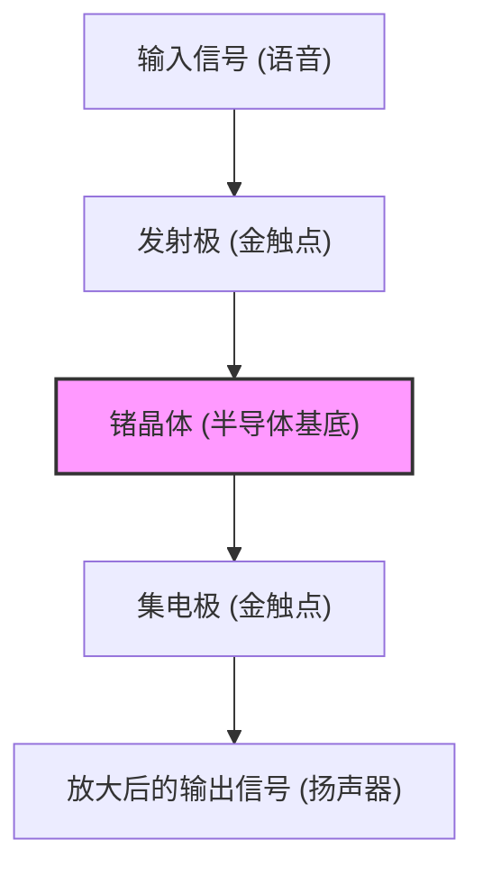

现代人的生活，从智能手机到超级计算机、汽车、家用电器，被各种电子设备所包围。所有这些的核心，都是用于处理和存储信息的微小电子元件——“晶体管”。如果没有晶体管，互联网、人工智能、太空开发以及现代的高级医疗技术都将不复存在。

本文将深入探讨晶体管这个人类历史上最重要的发明之一是如何诞生的，它又是如何发展的，以及它是如何孕育出今天被称为创新中心的“硅谷”的，为您讲述这段宏大的历史。

## 1. 真空管的局限性与电话网的壁垒

在晶体管发明之前，电子设备的主角是“真空管”。真空管是一种将玻璃管内部抽成真空，通过加热灯丝发射电子来进行电流放大和开关的器件。1906年由李·德富雷斯特发明的真空中三极管（Audion），在无线电广播、早期电话通信以及世界首台通用电子计算机“ENIAC”中都发挥了核心作用。

然而，真空管有着致命的弱点：

1. **寿命短**：因为灯丝会被烧断，所以必须定期更换。ENIAC使用了约18,000个真空管，每隔几天就会有某处的真空管发生故障，从而面临整个系统停止运行的问题。
2. **耗电量巨大**：为了发射热电子，必须始终将灯丝加热至高温，消耗了大量的电力。
3. **发热与体积**：由于散发大量热量，需要庞大的冷却设备。而且物理尺寸也很大，限制了设备的微型化。

对这种真空管的局限性最感头痛的，是当时控制着美国电话通信网的AT&T（美国电话电报公司）及其研发部门——**贝尔实验室（Bell Laboratories）**。

当时的电话交换机使用数以万计的机械继电器（电磁开关）来路由语音，但运行速度慢，且常因触点磨损而频繁故障。此外，为了放大长途电话的信号需要大量的真空管中继器，但由于寿命和电力问题，将真空管安装在海底电缆等地是极其困难的。

时任AT&T总裁的沃尔特·吉福德强烈认识到，需要一种“能够替代机械继电器和真空管，体积小、坚固且耗电量低的‘固态（solid-state）’放大器”。这成为了开发晶体管的直接动机。

## 2. 贝尔实验室与三位天才

1945年第二次世界大战结束后，贝尔实验室的研究部门主管马文·凯利组建了一个名为“固体物理学组”的特别团队，旨在开发新型放大器。这个团队的核心是后来共同获得诺贝尔物理学奖的三位科学家：

*   **威廉·肖克利 (William Shockley)**：团队的领导者。他是一位理论物理学家，拥有超凡的直觉和洞察力，但同时野心勃勃、自我表现欲极强，性格上容易在人际关系中挑起波澜。他从战前就开始酝酿使用半导体（特别是锗和硅）制作放大器的构想。
*   **约翰·巴丁 (John Bardeen)**：沉默寡言、思想深邃的理论物理学家。他对量子力学和固体物理学有着深厚的了解，后来不仅因发明晶体管，还因提出超导的BCS理论而再次获得诺贝尔物理学奖，是史上唯一一位两次获得诺贝尔物理学奖的天才。
*   **沃尔特·布拉顿 (Walter Brattain)**：杰出的实验物理学家。他是将理论组装成实际装置的能手，双手极其灵巧。性格开朗善于交际，在工作和生活中都成为了巴丁的良好合作伙伴。

肖克利最初构想了一种利用“场效应（Field Effect）”的半导体放大器。他认为，如果在半导体表面施加电场，就能控制内部的电流。然而，无论重复多少次实验，电流都未能按照计算那样被放大。

解开这个谜团的是巴丁。1947年春，他提出了一个名为“表面态（Surface States）”的新概念。他从理论上证明，半导体表面存在一种容易捕获电子的状态，这种状态像盾牌一样起作用，抵消了外部施加的电场，因此无法对内部产生影响。

## 3. 奇迹的一个月：点接触型晶体管的诞生

由于巴丁的理论揭示了失败的原因，实验开始朝着新的方向推进。1947年11月下旬到12月的大约一个月时间被称为“奇迹的一个月”。巴丁和布拉顿的组合夜以继日地沉浸在实验中。

他们设想，如果在锗晶体表面使两根金属针（触点）极其靠近地接触，也许就能避开表面态的影响，从而控制电流。

1947年12月16日，布拉顿组装了一台具有历史意义的实验装置。他在一个塑料三角形楔子的尖端贴上金箔，然后用剃须刀片在金箔尖端切开一条极细的缝隙（约0.05毫米），制造出两个触点。他用一个弹簧（由回形针改造而成）将这个楔子压在一块锗块上。

当输入语音信号到这个看起来很简陋的装置时，输出端的信号明显比输入端变大了。**放大作用被确认了。**

1947年12月23日，在贝尔实验室高管们面前进行了一场演示。当布拉顿对着麦克风说话时，通过锗晶体的声音从扬声器中响亮而清晰地播放出来。这就是世界上第一个“**点接触型晶体管（Point-contact transistor）**”诞生的一刻。

这个小装置不需要像真空管那样发热，也不需要预热时间，瞬间就能工作。这个被命名为“晶体管（Transistor，由Transfer resistor传输电阻器缩写而来）”的发明，永远地改变了电子工程的历史。

## 4. 肖克利的执念：向结型晶体管的进化

点接触型晶体管的发明是巴丁和布拉顿的伟大功绩。然而，作为团队领导的肖克利却无法坦然为这一成功感到高兴。在最重要的发明时刻，自己没有直接参与其中，而且专利的首席发明人也成了巴丁和布拉顿，这让他感到了强烈的嫉妒和被排斥感。

“如果是我，一定能造出更优秀的晶体管。”肖克利把自己关在酒店里，以近乎疯狂的专注力开始构建理论。

点接触型晶体管的性能受针尖接触状态的影响极大，因此存在难以量产和噪声大的缺点。肖克利构想了一种不利用表面接触，而是利用半导体内部“结（Junction）”的新结构。

这就是“**结型晶体管（Junction transistor）**”。他用数学证明，将p型半导体（正电荷即空穴传导电流）和n型半导体（负电荷即电子传导电流）像三明治一样层叠起来（p-n-p或n-p-n结构），可以实现更加稳定和高效的放大。

1951年，得益于贝尔实验室的戈登·蒂尔（Gordon Teal）等人的努力，开发出了拉制高纯度半导体晶体的技术，结型晶体管按照肖克利的理论得以实现。这种结型晶体管由于噪声低且适合大量生产，迅速取代了点接触型晶体管而得到普及。

1956年，肖克利、巴丁和布拉顿三人因“对半导体的研究和发现晶体管效应”而共同获得了诺贝尔物理学奖。然而，在这份荣耀的背后，三人的关系已经冷淡到了无法修复的地步。巴丁和布拉顿无法忍受肖克利独断专行的态度，纷纷离开去了其他的研发部门。

## 5. 从锗到硅：戈登·蒂尔的挑战

早期的晶体管全部都是以“锗”为材料制造的。锗具有熔点较低、易于加工的优点。

但是，锗有一个致命的弱点，那就是“怕热”。当温度达到75度左右时，它就会失去半导体的性质，变成普通的导体（使电流完全泄漏的金属）。因此，如果把早期的晶体管收音机放在夏日炎热的车内，就会出现完全无法使用的问题。此外，在军事用途（如导弹控制等）中，这种糟糕的温度特性也是致命的。

为了解决这个问题，唯一的办法就是将材料更换为能耐受更高温度的“**硅（Silicon）**”。硅是地球地壳中含量仅次于氧的常见元素（沙子和石英的主要成分），但在当时的技术条件下，要制造出纯度极高、能够用于晶体管的硅单晶是一项极其艰巨的任务。

挑战这个难题的是当时已跳槽到德州仪器（TI）公司的**戈登·蒂尔**。蒂尔运用在贝尔实验室积累的晶体生长技术，终于成功制造出了硅单晶。

1954年，在一次学术会议上，当其他公司的锗晶体管被放入热水中接连停止工作时，蒂尔演示了他公司开发的硅晶体管在热水中依然泰然自若地播放音乐，让全场为之惊叹。从此，半导体的主角从锗彻底交替给了硅，“硅时代”拉开了帷幕。

## 6. MOSFET的发明与通往IC之路

随着硅结型晶体管的出现，电子设备的微型化取得了巨大进展。但是，随着晶体管数量增加到成百上千个，通过布线将它们焊接起来的工作达到了极限（互连的壁垒）。

解决这一问题的是“**集成电路（IC）**”，它是由杰克·基尔比（TI）和罗伯特·诺伊斯（仙童半导体）在1958年分别独立发明的。这是一种将多个晶体管和电阻一次性制造在同一块硅片上的技术。

然而，早期的IC依然使用的是结型（双极型）晶体管，其功耗和微细化的极限已经开始显现。

此时，肖克利最初梦想过，但被巴丁的“表面态”壁垒阻碍未能实现的“场效应晶体管（FET）”构想再次复苏。

1959年，贝尔实验室的**穆罕默德·阿塔拉 (Mohamed Atalla)** 和 **姜大元 (Dawon Kahng)** 发现，通过在硅表面进行热氧化，形成极薄的“二氧化硅（玻璃）”绝缘膜，就可以消除表面态的影响。

他们利用这项技术，发明了将金属（Metal）、氧化膜（Oxide）和半导体（Semiconductor）层叠结构的“**MOSFET（金属氧化物半导体场效应晶体管）**”。

与传统的结型晶体管相比，MOSFET的制造工艺更简单，功耗低了几个数量级，最重要的是，它具有“可以做到极致微小”的绝佳特性。现在，在我们的智能手机和PC的CPU中，塞满了数以十亿、百亿计的这种MOSFET。阿塔拉和姜大元的发明，才是现代数字社会真正的基石。

## 7. “八叛逆”与硅谷的诞生

在讲述晶体管进化史时，与技术本身同等重要的是那些将这些技术升华为商业的“人”的戏剧性故事。而这个舞台，就是加利福尼亚州的圣克拉拉谷，即现在的“**硅谷**”。

获得诺贝尔奖的肖克利在1956年创立了自己的公司“肖克利半导体实验室”，并将总部设在故乡加利福尼亚州的帕洛阿尔托。他从全美各地招募了一批又一批优秀的年轻科学家和工程师。其中就包括后来创立英特尔（Intel）的**罗伯特·诺伊斯**和**戈登·摩尔**。

然而，肖克利虽然是一位天才科学家，但却是一个最糟糕的管理者。他偏执狂般的性格、完全不信任下属甚至要求他们使用测谎仪等异乎寻常的管理方式，以及在研究方向上的分歧（固执地坚持研究复杂的四层二极管，而不是更有前景的硅晶体管），导致工作氛围降至冰点。

1957年9月，8位忍无可忍的优秀年轻研究员（包括诺伊斯和摩尔）决定离开肖克利。肖克利暴怒，称他们为“**八叛逆（Traitorous Eight）**”。

这8人在投资者阿瑟·洛克的支持和仙童摄影器材公司的资金援助下，创立了“**仙童半导体（Fairchild Semiconductor）**”。

仙童半导体以让·赫尔尼发明的“**平面工艺（Planar process）**”（一种使用氧化膜平坦地保护硅表面，并像照片印刷一样将电路印制在上面的技术）为武器，瞬间成长为世界顶级的半导体企业。这种平面工艺正是后来使IC能够大规模生产的革命性制造方法。

而仙童半导体本身，也成为了硅谷的“大爆炸”。在仙童半导体积累了经验的优秀工程师们，后来纷纷脱离出来，创立了新的风险企业。他们被称为“仙童（Fairchildren）”。

由罗伯特·诺伊斯和戈登·摩尔创立的**Intel**、由杰里·桑德斯创立的**AMD**等，现在代表硅谷的许多企业，其根源都可以追溯到“八叛逆”和仙童半导体。

## 8. 结论：小小零件带来的巨大革命

在贝尔实验室的一个角落里，由回形针、金箔和锗碎片诞生出的那笨拙的“点接触型晶体管”，在短短几十年的时间里，经历了向结型、硅、IC以及MOSFET的惊人进化。

它将人类从真空管那种发烫且庞大的诅咒中解放出来，开创了一个将信息作为“开关（0和1）”的数字信号、以极高速度且廉价地进行处理的世界。

如果没有肖克利的野心，如果没有巴丁在理论上的闪光，如果没有布拉顿神乎其技的实验技术，如果不是“八叛逆”们独立出来并在加利福尼亚的土地上播下硅的种子，我们今天所享受的数字社会将会截然不同，或者会推迟几十年。

晶体管的历史，不仅仅是一部单纯的技术进化史。它也是嫉妒、野心、反叛，以及人类为了突破极限而无尽探索的历史。

（完）
