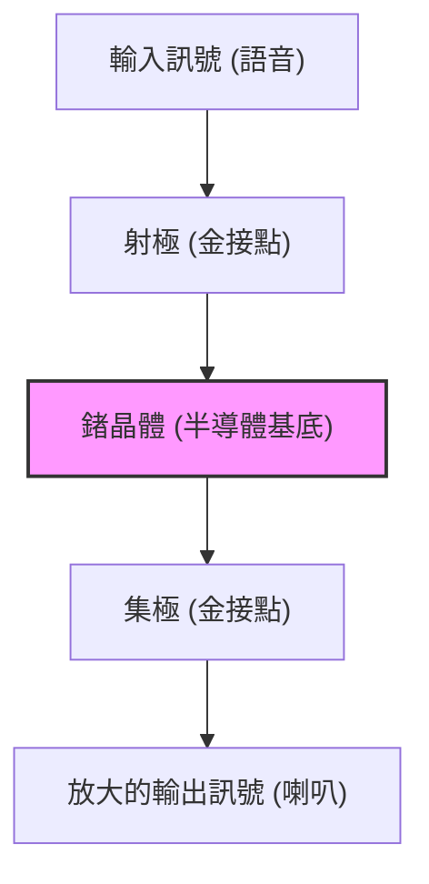

現代我們的生活，從智慧型手機到超級電腦、汽車、家電，被各種電子設備所包圍。在所有這些設備的核心，是用於處理與記憶資訊的微小電子零件「電晶體」。如果沒有電晶體，網際網路、人工智慧、太空開發，以及現代先進的醫療技術都不會存在。

本文將深入探討這項人類歷史上最重要發明之一的電晶體是如何誕生的，以及它是如何發展，並孕育出現在被稱為「矽谷」的創新中心，為您詳細解析這段波瀾壯闊的歷史。

## 1. 真空管的極限與電話網的壁壘

在電晶體發明之前，電子設備的主角是「真空管」。真空管是一種將玻璃管內部抽成真空，並加熱燈絲使其發射電子，從而進行電流放大或開關的元件。1906年由李·德富雷斯特（Lee de Forest）發明的三極真空管（Audion），在廣播、早期電話通訊以及世界第一台通用電子計算機「ENIAC」中扮演了核心角色。

然而，真空管有著致命的弱點。

1. **壽命短暫**：由於燈絲會燒斷，因此必須定期更換。ENIAC使用了約18,000根真空管，但每隔幾天就會有某處的真空管故障，導致整個系統停機，這是它面臨的一大問題。
2. **耗電量巨大**：為了發射熱電子，必須始終將燈絲加熱至高溫，消耗了大量的電力。
3. **發熱與體積**：由於會散發大量熱能，需要龐大的冷卻設備。此外，物理尺寸也很大，限制了設備的小型化。

對真空管的極限感到最頭痛的，是當時掌控美國電話通訊網的AT&T（美國電話電報公司）及其研發部門**貝爾實驗室（Bell Laboratories）**。

當時的電話交換機使用數萬個機械式繼電器（利用電磁鐵運作的開關）來路由語音，但其動作緩慢，且經常因接點磨損而故障。此外，為了放大長途電話的訊號，需要大量的真空管中繼器，但考量到壽命與電力問題，將真空管安裝在海底電纜等地方極為困難。

當時AT&T的總裁華特·吉佛特（Walter Gifford）強烈意識到需要一種「能取代機械式繼電器與真空管，體積小、堅固且耗電量低的『固態（Solid-state）』放大器」。這成為了開發電晶體最直接的動機。

## 2. 貝爾實驗室與三位天才

1945年第二次世界大戰結束後，貝爾實驗室的研究部門主管馬文·凱利（Mervin Kelly）組成了一個名為「固態物理學小組」的特別團隊，旨在開發新型放大器。這個團隊的核心，是後來共同獲得諾貝爾物理學獎的三位科學家。

*   **威廉·肖克利 (William Shockley)**：團隊負責人。他是一位理論物理學家，擁有非凡的直覺與洞察力，但同時也極具野心、表現慾強，性格容易在人際關係中引發摩擦。他在戰前就已開始構思使用半導體（特別是鍺或矽）來製作放大器的想法。
*   **約翰·巴丁 (John Bardeen)**：沉默寡言且深思熟慮的理論物理學家。對量子力學與固態物理學有著深刻的了解，後來不僅因為發明電晶體，還因為超導體的BCS理論再次獲得諾貝爾物理學獎（史上唯一兩度獲得物理學獎的人），是一位真正的天才。
*   **華特·布拉頓 (Walter Brattain)**：傑出的實驗物理學家。他是將理論組裝成實際裝置的高手，雙手極為靈巧。性格開朗善於交際，無論在公在私都是巴丁的良好合作夥伴。

肖克利最初構思了一種利用「場效應（Field Effect）」的半導體放大器。他認為，如果對半導體表面施加電場，應該就能控制內部的電流。然而，無論重複多少次實驗，電流始終無法如計算般被放大。

解開這個謎團的是巴丁。1947年春天，他提出了一個名為「表面能階（Surface States）」的新概念。他從理論上指出，半導體表面存在著容易捕獲電子的狀態，這就像是一層屏蔽，抵消了來自外部的電場，因此無法對內部產生影響。

## 3. 奇蹟的一個月：點接觸型電晶體的誕生

由於巴丁的理論揭示了失敗的原因，實驗開始朝著新的方向邁進。1947年11月下旬到12月的約一個月期間，被稱為「奇蹟的一個月」。巴丁與布拉頓這對搭檔不分晝夜地投入實驗。

他們認為，如果將兩根金屬針（接點）極度靠近並接觸在鍺晶體的表面，或許就能避開表面能階的影響來控制電流。

1947年12月16日，布拉頓組裝出了一個具歷史意義的實驗裝置。他在一個塑膠三角形楔子的頂端貼上金箔，接著用刮鬍刀片在金箔頂端切出一道極細的縫隙（約0.05毫米），形成了兩個接點。他用彈簧（由迴紋針改造而成）將這個楔子壓在鍺塊上。

當他們將語音訊號輸入這個看似簡陋的裝置時，輸出端的訊號明顯比輸入端大。**放大作用被證實了。**

1947年12月23日，貝爾實驗室的高層們齊聚一堂觀看示範。當布拉頓對著麥克風說話時，穿過鍺晶體的語音從喇叭中響亮且清晰地播放出來。這就是世界第一個「**點接觸型電晶體（Point-contact transistor）**」誕生的瞬間。

這個小裝置不像真空管那樣會發熱，不需要預熱時間，且能瞬間運作。這項被命名為「電晶體（Transistor，即傳輸電阻 Transfer resistor 的縮寫）」的發明，將永遠改變電子工程的歷史。

## 4. 肖克利的執念：接面型電晶體的進化

點接觸型電晶體的發明是巴丁與布拉頓的偉大功績。然而，作為團隊負責人的肖克利，卻無法坦然為此成功感到高興。對於自己未能在最重要的發明瞬間直接參與，以及專利的首要發明人變成了巴丁與布拉頓，他感到強烈的嫉妒與被排擠感。

「換作是我，一定能做出更優秀的電晶體。」肖克利把自己關在旅館裡，以近乎瘋狂的專注力開始建構理論。

點接觸型電晶體會因為針的接觸狀況而導致性能有很大差異，因此難以量產，且存在雜訊大的缺點。肖克利構思了一種不依賴表面接觸，而是利用半導體內部「接面」的新結構。

這就是「**接面型電晶體（Junction transistor）**」。他在數學上證明，透過將 p 型半導體（正電荷＝電洞負責導電）與 n 型半導體（負電荷＝電子負責導電）像三明治一樣疊加起來（p-n-p 或 n-p-n 結構），就能實現更加穩定且高效率的放大作用。

1951年，在貝爾實驗室的高登·提爾（Gordon Teal）等人的努力下，開發出了拉拔高純度半導體晶體的技術，如肖克利理論所預測的接面型電晶體得以實現。這種接面型電晶體雜訊小，且適合大量生產，因此迅速取代了點接觸型。

1956年，肖克利、巴丁、布拉頓三人因「對半導體的研究以及發現電晶體效應」，共同獲得了諾貝爾物理學獎。但在這份榮耀背後，三人的關係已冷淡到無法修復的地步。巴丁與布拉頓無法忍受肖克利獨斷專行的態度，雙雙離開去了其他研究部門。

## 5. 從鍺到矽：高登·提爾的挑戰

早期的電晶體全部都是使用「鍺」作為材料製造的。鍺的優點是在較低的溫度下就會熔化，易於加工。

然而，鍺有一個致命的弱點，那就是「怕熱」。當溫度達到約75度時，就會失去半導體的特性，變成單純的導體（讓電流直接漏過的金屬）。因此，如果把早期的電晶體收音機放在夏日炎熱的車內，就會發生完全無法使用的問題。此外，在軍事用途（如飛彈控制等）上，這種糟糕的溫度特性是致命的。

為了解決這個問題，唯一的辦法就是將材料更換為能耐更高溫的「**矽 (Silicon)**」。矽是地球地殼中含量僅次於氧的常見元素（沙子和石英的主要成分），但以當時的技術，要製造出純度極高、足以用於電晶體的矽單晶，是一項極其艱鉅的任務。

挑戰這個難題的，是當時已跳槽至德州儀器（TI）的**高登·提爾**。提爾充分運用在貝爾實驗室時期培養的晶體生長技術，終於成功製造出矽的單晶。

1954年，在一個學會的場合上，當其他公司的鍺電晶體被放入熱水中紛紛停止運作時，提爾展示了自家開發的矽電晶體在熱水中依然泰然自若地播放著音樂，讓全場驚嘆不已。從此，半導體的主角從鍺完全交棒給矽，「矽時代」正式揭開序幕。

## 6. MOSFET 的發明與邁向 IC 之路

接面型矽電晶體的出現雖然大幅推動了電子設備的小型化，但隨著電晶體數量增加到數百、數千個，用導線將它們焊接在一起的作業已達到極限（佈線壁壘）。

解決這個問題的，是1958年由傑克·基爾比（德州儀器）與羅伯特·諾伊斯（仙童半導體）各自獨立發明的「**積體電路 (IC)**」。這是一項將多個電晶體與電阻一次性製作在同一塊矽晶片上的技術。

然而，早期 IC 使用的依然是接面型（雙極性）電晶體，在耗電量與微縮化方面已開始顯露出極限。

此時，肖克利最初夢想卻被巴丁的「表面能階」壁壘阻擋而無法實現的「場效應電晶體 (FET)」概念，再次浮出檯面。

1959年，貝爾實驗室的**穆罕默德·阿塔拉 (Mohamed Atalla)** 與**大衛·康 (Dawon Kahng)** 發現，透過將矽表面熱氧化，形成極薄的「二氧化矽（玻璃）」絕緣膜，就能消除表面能階的影響。

他們利用這項技術，發明了由金屬 (Metal)、氧化膜 (Oxide)、半導體 (Semiconductor) 疊加而成的「**MOSFET（金屬氧化物半導體場效電晶體）**」。

與傳統的接面型電晶體相比，MOSFET 的製造過程更簡單，耗電量低了好幾個數量級，最重要的是它具有「能縮小至極限」的絕佳特性。現在，在我們智慧型手機與電腦的 CPU 中，動輒塞入數十億、數百億個這種 MOSFET。阿塔拉與康的發明，才是現代數位社會真正的基石。

## 7. 「八叛將」與矽谷的誕生

在講述電晶體的進化史時，將這些技術昇華為商業的「人們」的故事，與技術本身同樣重要。而這個故事的舞台，就是加州的聖塔克拉拉谷，也就是現在的「**矽谷**」。

獲得諾貝爾獎的肖克利於1956年創立了自己的公司「肖克利半導體實驗室」，並將總部設在他的故鄉加州帕羅奧圖。他從全美各地挖角了許多優秀的年輕科學家與工程師，其中也包括後來創立 Intel 的**羅伯特·諾伊斯**與**高登·摩爾**。

然而，肖克利雖然是天才科學家，卻是最糟糕的管理者。他患有偏執狂般的性格，完全不信任下屬，甚至試圖對他們使用測謊機，這種脫軌的管理方式，加上研究方向的衝突（固執於複雜的四層二極體，而非更有前景的矽電晶體），使得職場氣氛降至冰點。

1957年9月，忍無可忍的8位優秀年輕研究員（包括諾伊斯與摩爾）終於決定離開肖克利。肖克利暴跳如雷，稱他們為「**八叛將 (Traitorous Eight)**」。

這8人在投資人亞瑟·洛克 (Arthur Rock) 的支持與仙童攝影器材公司的資金援助下，成立了「**仙童半導體 (Fairchild Semiconductor)**」。

仙童半導體以尚·霍爾尼 (Jean Hoerni) 發明的「**平面工藝 (Planar process)**」（利用氧化膜將矽表面平坦化保護，像照片沖印般將電路印製上去的技術）為武器，轉眼間便成長為全球頂尖的半導體企業。這項平面工藝，正是後來讓 IC 得以大量生產的革命性製造方法。

而仙童半導體，正是引發矽谷「大爆炸」的起源。因為在仙童累積了經驗的優秀工程師們，後來紛紛自立門戶創辦新的新創公司。這些人被稱為「仙童之子 (Fairchildren)」。

羅伯特·諾伊斯與高登·摩爾創立的 **Intel**、傑瑞·桑德斯 (Jerry Sanders) 創立的 **AMD** 等，現今代表矽谷的許多企業，其根源都能追溯至「八叛將」與仙童半導體。

## 8. 結論：小零件帶來的大革命

在貝爾實驗室的角落，用迴紋針、金箔與鍺碎片拼湊出那粗糙的「點接觸型電晶體」，在短短幾十年間，經歷了接面型、矽、IC，乃至 MOSFET 的驚人進化。

它將人類從真空管那炙熱且龐大的束縛中解放出來，開創了一個將資訊化為「開關 ON/OFF（0 與 1）」的數位訊號，並能以極快速度且低廉成本進行處理的世界。

如果沒有肖克利的野心，沒有巴丁理論上的靈光一閃，沒有布拉頓神乎其技的實驗技術，以及「八叛將」們獨立在加州土地上播下矽的種子，我們如今享受的數位社會，可能會呈現完全不同的面貌，或者晚了幾十年才到來。

電晶體的歷史，不僅僅是技術進化的歷史。它本身就是一部充滿嫉妒、野心、叛逆，以及人類為了突破極限而無盡探索的歷史。

（完）
