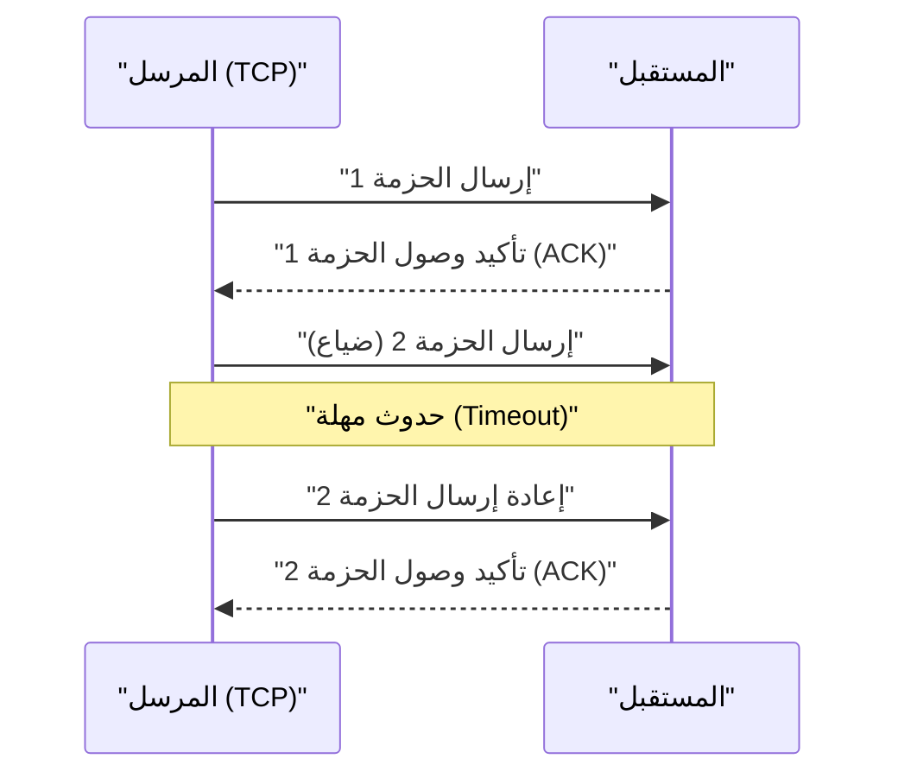

## 1. السرعة أم الدقة. الخيار النهائي للإنترنت

عندما نتبادل البيانات عبر الإنترنت، يوجد لاعبان رئيسيان في البروتوكولات (قواعد الاتصال) التي تعمل في الأساس (طبقة النقل).
أحدهما هو "**TCP (Transmission Control Protocol)**" الذي يتولى الجزء الأكبر من اتصالات الإنترنت مثل تصفح مواقع الويب وتنزيل الملفات.
والآخر، وهو بطل هذا المقال، هو "**UDP (User Datagram Protocol)**".

إذا كان TCP يمثل "ساعي البريد الدقيق الذي يشبه البريد المسجل والذي لا يفقد أي طرد أبداً"، فإن UDP يشبه "آلة رمي الكرات فائقة السرعة التي ترمي الطرود واحداً تلو الآخر ولا تلتفت للخلف حتى لو لم تصل".

لماذا يحتاج الإنترنت إلى بروتوكول "لا يضمن الوصول"؟

## 2. حدود TCP: التأخير الذي تجلبه "الدقة"

لفهم الحاجة إلى UDP، دعونا نلقي نظرة أولاً على كيفية عمل منافسه TCP.

بروتوكول TCP هو بروتوكول "**موجه للاتصال (Connection-oriented)**". قبل إرسال البيانات، يقوم دائماً بتأكيد مسبق (مصافحة ثلاثية أو 3-way handshake) مع الطرف الآخر بقوله "هل يمكنني الإرسال الآن؟" فيرد "نعم، يمكنك ذلك".
علاوة على ذلك، عند تقسيم البيانات إلى قطع صغيرة (حزم أو packets) لإرسالها، يقوم بتعيين أرقام تسلسلية لجميع الحزم وينتظر تأكيد الاستلام (ACK) من الطرف الآخر مثل "وصلني رقم 1" و"وصلني رقم 2". إذا تاهت الحزمة رقم 3 في الشبكة في منتصف الطريق ولم يصل تأكيد الاستلام، يكتشف TCP ذلك باستخدام مؤقت ويعيد المحاولة قائلاً "سأعيد إرسال رقم 3".

بفضل هذه الآلية، يمكننا مشاهدة صور واضحة أو تنزيل برامج دون فقدان أي بايت واحد.
ولكن، عملية "التأكيد" و"إعادة الإرسال" هذه تخلق **تأخيراً زمنياً قاتلاً (Latency)**.

## 3. فلسفة UDP: "لا يهم إن لم تصل، أرسلها الآن"

في التطبيقات التي تكون فيها الفورية (Real-time) في غاية الأهمية، مثل "الألعاب عبر الإنترنت (FPS أو ألعاب القتال)"، و"مكالمات الفيديو مثل Zoom"، و"البث المباشر للرياضة"، تصبح دقة TCP عقبة.

لنفترض أن بيانات الصوت انقطعت للحظة أثناء مكالمة فيديو. إذا كنا نستخدم TCP، فسيقوم النظام بالمعالجة التالية: "لم تصل بيانات الصوت الخاصة بـ 0.5 ثانية الماضية، لذا سأقوم بإعادة إرسالها. سأقوم بإيقاف الفيديو بأكمله مؤقتاً حتى ذلك الحين". ونتيجة لذلك، ستتوقف الشاشة وتصبح متقطعة.
بالنسبة للبشر، في المكالمات الفورية، من الأهم بكثير "الاستمرار في تشغيل الصوت الحالي كما هو، حتى لو كان هناك بعض التشويش"، بدلاً من "وصول الصوت الماضي من قبل 0.5 ثانية بوضوح ولكن متأخراً".

هنا يأتي دور UDP، وهو من النوع "**عديم الاتصال (Connectionless)**".

لا يتحقق UDP أبداً مما إذا كان الطرف الآخر مستعداً للاستلام أم لا. لا يقوم بتعيين أرقام للحزم، ولا يتحقق مما إذا كانت قد وصلت، ولا يقوم بمعالجة إعادة الإرسال.
إنه ببساطة يأخذ البيانات المستلمة من التطبيق، ويضيف إليها رأساً (Header) فقط (بيانات وصفية قليلة مثل معلومات الوجهة)، ويرميها ببساطة في بحر الشبكة دون اكتراث.

### رأس UDP خفيف للغاية
بينما يحتوي رأس TCP عادةً على 20 بايت من معلومات التحكم المختلفة، فإن رأس UDP يتكون من "**8 بايت**" فقط.
1. رقم منفذ المصدر (2 بايت)
2. رقم منفذ الوجهة (2 بايت)
3. طول الحزمة (2 بايت)
4. المجموع الاختباري أو Checksum (2 بايت: الحد الأدنى من التحقق للتأكد من عدم تلف البيانات)

هذه الخفة الهائلة والبساطة في المعالجة تقلل من زمن انتقال الاتصال إلى أقصى حد، مما يجعل التجربة الفورية ممكنة.

## 4. مجالات استخدام UDP

تُستخدم خاصية UDP المتمثلة في كونه "خفيفاً وسريعاً، ولكنه غير موثوق" في كل مكان في البنية التحتية لإنترنت اليوم.

* **DNS (Domain Name System)**
  إنه نظام يحول عناوين URL (مثل: google.com) إلى عناوين IP. نظراً لأن الاستعلام إلى DNS عبارة عن بيانات صغيرة جداً، وإذا لم يأتِ الرد، يكفي الاستعلام مرة أخرى، لذلك يُستخدم بروتوكول UDP السريع.
* **NTP (Network Time Protocol)**
  هو اتصال لضبط ساعات أجهزة الكمبيوتر والهواتف الذكية بدقة. بما أن معلومات الوقت تصبح بلا معنى إذا أصبحت قديمة، فإن UDP، الذي يكره التأخير الناتج عن إعادة الإرسال، هو الأنسب.
* **البث المباشر (Streaming) وتقنية VoIP**
  يحقق البث المباشر على YouTube، ومكالمات LINE، والمكالمات الصوتية على Discord، اتصالات UDP بدون تأخير من خلال قيام البرنامج بتعويض (توقع وملء) بعض فقدان الحزم.

## 5. تطور جديد: بروتوكول "QUIC"

لسنوات عديدة، تم تقسيم الإنترنت إلى "TCP الدقيق" و"UDP السريع"، ولكن في السنوات الأخيرة، حدثت ثورة غيرت هذا التاريخ.
وهو بروتوكول "**QUIC (كويك)**" الذي طورته Google، والذي يعد أساس "HTTP/3" الحالي.

أدركت Google، التي أرادت تسريع عرض مواقع الويب بشكل أكبر، أن "التأخير الناجم عن التحية الأولى (Handshake)" في TCP قد وصل إلى حدوده. لذا، بدلاً من تحسين TCP، **قاموا بإنشاء "إجراء اتصال سريع ودقيق" فريد من نوعه يعتمد على بروتوكول UDP، ويتم التحكم فيه بواسطة البرمجيات**.

نظراً لأن QUIC يعتمد على UDP، فيمكنه تجاوز تحكم TCP المعقد لنواة نظام التشغيل (OS kernel)، ومن خلال إجراء مصافحة للاتصال المشفر الخاص به (TLS) في نفس الوقت، قلل بشكل كبير من الوقت المستغرق لبدء الاتصال. حالياً، عندما نشاهد YouTube أو نستخدم خدمات Google، ففي الخلفية لا نستخدم TCP، بل QUIC المعتمد على UDP لنقل البيانات بسرعة فائقة.

حقيقة أن UDP، الذي طالما قيل عنه أنه "غير موثوق"، قد أصبح، من خلال البراعة، أساساً لأحدث البنى التحتية للويب اليوم، يخبرنا بمدى قوة "الخفة والبساطة" كسلاح في تصميم شبكات الكمبيوتر.
