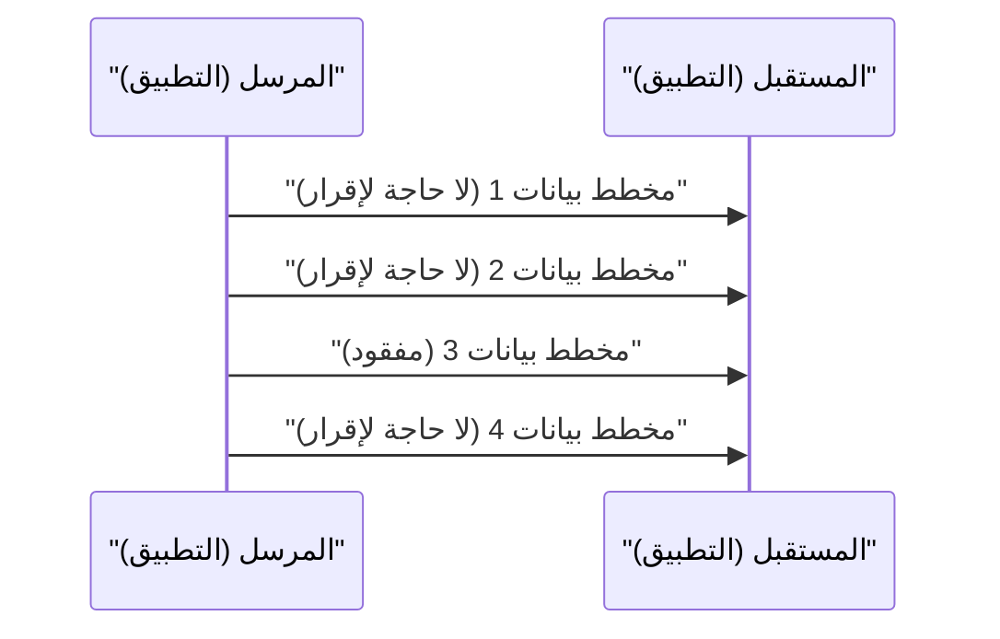

# شرح تقنية UDP

بروتوكول بيانات المستخدم (UDP) هو أحد الأعضاء الأساسيين في مجموعة بروتوكولات الإنترنت.

## قوة الاتصال بدون اتصال

لا يقوم UDP بإجراء مصافحة (Handshake) مثل TCP، بل يرسل البيانات كما هي. هذا يقلل من التأخير إلى الحد الأدنى.

## نمذجة معدل الإرسال

عندما يكون معدل فقدان الحزم $p$، ومعدل الإرسال $R$، يتم تقريب الإنتاجية الفعالة $T$ على النحو التالي (في حالة UDP، تُفقد البيانات كما هي لعدم وجود تحكم في إعادة الإرسال).

$$ T = R \times (1 - p) $$

## الجزء 1 من التحقق الفني الإضافي
في هذا القسم، سنتحقق من المزيد من التفاصيل الفنية لـ P2P ومختلف بروتوكولات الشبكة. نتناول مواضيع متنوعة مثل إدارة المعاملات في الأنظمة الموزعة، وخوارزميات التعويض عند فقدان حزم UDP، وطرق تحسين رؤوس HTTP.
بالإضافة إلى ذلك، من خلال تطبيق طرق التصور باستخدام Mermaid، يصبح من الممكن فهم هياكل الشبكة المعقدة هذه بشكل بديهي.
التقييم الكمي باستخدام الصيغ الرياضية مهم أيضًا. أدناه جزء من نموذج الاتصال.
$$ E = mc^2 + \sum_{i=1}^{n} P_i $$
تتطور باستمرار الطرق المستخدمة لتقليل تأخير الاتصال بين عقد الشبكة. خاصة في شبكات الجيل القادم، يمثل تقليل العبء الإضافي للبروتوكول تحديًا. يشمل ذلك أيضًا تحسين جدول توجيه IPv6 وتقنيات استئناف جلسة TLS في HTTPS.
من خلال هذه التحققات الفنية المتقدمة، يمكننا بناء بنية شبكة أكثر قوة وقابلية للتوسع.

## الجزء 2 من التحقق الفني الإضافي
في هذا القسم، سنتحقق من المزيد من التفاصيل الفنية لـ P2P ومختلف بروتوكولات الشبكة. نتناول مواضيع متنوعة مثل إدارة المعاملات في الأنظمة الموزعة، وخوارزميات التعويض عند فقدان حزم UDP، وطرق تحسين رؤوس HTTP.
بالإضافة إلى ذلك، من خلال تطبيق طرق التصور باستخدام Mermaid، يصبح من الممكن فهم هياكل الشبكة المعقدة هذه بشكل بديهي.
التقييم الكمي باستخدام الصيغ الرياضية مهم أيضًا. أدناه جزء من نموذج الاتصال.
$$ E = mc^2 + \sum_{i=1}^{n} P_i $$
تتطور باستمرار الطرق المستخدمة لتقليل تأخير الاتصال بين عقد الشبكة. خاصة في شبكات الجيل القادم، يمثل تقليل العبء الإضافي للبروتوكول تحديًا. يشمل ذلك أيضًا تحسين جدول توجيه IPv6 وتقنيات استئناف جلسة TLS في HTTPS.
من خلال هذه التحققات الفنية المتقدمة، يمكننا بناء بنية شبكة أكثر قوة وقابلية للتوسع.

## الجزء 3 من التحقق الفني الإضافي
في هذا القسم، سنتحقق من المزيد من التفاصيل الفنية لـ P2P ومختلف بروتوكولات الشبكة. نتناول مواضيع متنوعة مثل إدارة المعاملات في الأنظمة الموزعة، وخوارزميات التعويض عند فقدان حزم UDP، وطرق تحسين رؤوس HTTP.
بالإضافة إلى ذلك، من خلال تطبيق طرق التصور باستخدام Mermaid، يصبح من الممكن فهم هياكل الشبكة المعقدة هذه بشكل بديهي.
التقييم الكمي باستخدام الصيغ الرياضية مهم أيضًا. أدناه جزء من نموذج الاتصال.
$$ E = mc^2 + \sum_{i=1}^{n} P_i $$
تتطور باستمرار الطرق المستخدمة لتقليل تأخير الاتصال بين عقد الشبكة. خاصة في شبكات الجيل القادم، يمثل تقليل العبء الإضافي للبروتوكول تحديًا. يشمل ذلك أيضًا تحسين جدول توجيه IPv6 وتقنيات استئناف جلسة TLS في HTTPS.
من خلال هذه التحققات الفنية المتقدمة، يمكننا بناء بنية شبكة أكثر قوة وقابلية للتوسع.

## الجزء 4 من التحقق الفني الإضافي
في هذا القسم، سنتحقق من المزيد من التفاصيل الفنية لـ P2P ومختلف بروتوكولات الشبكة. نتناول مواضيع متنوعة مثل إدارة المعاملات في الأنظمة الموزعة، وخوارزميات التعويض عند فقدان حزم UDP، وطرق تحسين رؤوس HTTP.
بالإضافة إلى ذلك، من خلال تطبيق طرق التصور باستخدام Mermaid، يصبح من الممكن فهم هياكل الشبكة المعقدة هذه بشكل بديهي.
التقييم الكمي باستخدام الصيغ الرياضية مهم أيضًا. أدناه جزء من نموذج الاتصال.
$$ E = mc^2 + \sum_{i=1}^{n} P_i $$
تتطور باستمرار الطرق المستخدمة لتقليل تأخير الاتصال بين عقد الشبكة. خاصة في شبكات الجيل القادم، يمثل تقليل العبء الإضافي للبروتوكول تحديًا. يشمل ذلك أيضًا تحسين جدول توجيه IPv6 وتقنيات استئناف جلسة TLS في HTTPS.
من خلال هذه التحققات الفنية المتقدمة، يمكننا بناء بنية شبكة أكثر قوة وقابلية للتوسع.

## الجزء 5 من التحقق الفني الإضافي
في هذا القسم، سنتحقق من المزيد من التفاصيل الفنية لـ P2P ومختلف بروتوكولات الشبكة. نتناول مواضيع متنوعة مثل إدارة المعاملات في الأنظمة الموزعة، وخوارزميات التعويض عند فقدان حزم UDP، وطرق تحسين رؤوس HTTP.
بالإضافة إلى ذلك، من خلال تطبيق طرق التصور باستخدام Mermaid، يصبح من الممكن فهم هياكل الشبكة المعقدة هذه بشكل بديهي.
التقييم الكمي باستخدام الصيغ الرياضية مهم أيضًا. أدناه جزء من نموذج الاتصال.
$$ E = mc^2 + \sum_{i=1}^{n} P_i $$
تتطور باستمرار الطرق المستخدمة لتقليل تأخير الاتصال بين عقد الشبكة. خاصة في شبكات الجيل القادم، يمثل تقليل العبء الإضافي للبروتوكول تحديًا. يشمل ذلك أيضًا تحسين جدول توجيه IPv6 وتقنيات استئناف جلسة TLS في HTTPS.
من خلال هذه التحققات الفنية المتقدمة، يمكننا بناء بنية شبكة أكثر قوة وقابلية للتوسع.

## الجزء 6 من التحقق الفني الإضافي
في هذا القسم، سنتحقق من المزيد من التفاصيل الفنية لـ P2P ومختلف بروتوكولات الشبكة. نتناول مواضيع متنوعة مثل إدارة المعاملات في الأنظمة الموزعة، وخوارزميات التعويض عند فقدان حزم UDP، وطرق تحسين رؤوس HTTP.
بالإضافة إلى ذلك، من خلال تطبيق طرق التصور باستخدام Mermaid، يصبح من الممكن فهم هياكل الشبكة المعقدة هذه بشكل بديهي.
التقييم الكمي باستخدام الصيغ الرياضية مهم أيضًا. أدناه جزء من نموذج الاتصال.
$$ E = mc^2 + \sum_{i=1}^{n} P_i $$
تتطور باستمرار الطرق المستخدمة لتقليل تأخير الاتصال بين عقد الشبكة. خاصة في شبكات الجيل القادم، يمثل تقليل العبء الإضافي للبروتوكول تحديًا. يشمل ذلك أيضًا تحسين جدول توجيه IPv6 وتقنيات استئناف جلسة TLS في HTTPS.
من خلال هذه التحققات الفنية المتقدمة، يمكننا بناء بنية شبكة أكثر قوة وقابلية للتوسع.

## الجزء 7 من التحقق الفني الإضافي
في هذا القسم، سنتحقق من المزيد من التفاصيل الفنية لـ P2P ومختلف بروتوكولات الشبكة. نتناول مواضيع متنوعة مثل إدارة المعاملات في الأنظمة الموزعة، وخوارزميات التعويض عند فقدان حزم UDP، وطرق تحسين رؤوس HTTP.
بالإضافة إلى ذلك، من خلال تطبيق طرق التصور باستخدام Mermaid، يصبح من الممكن فهم هياكل الشبكة المعقدة هذه بشكل بديهي.
التقييم الكمي باستخدام الصيغ الرياضية مهم أيضًا. أدناه جزء من نموذج الاتصال.
$$ E = mc^2 + \sum_{i=1}^{n} P_i $$
تتطور باستمرار الطرق المستخدمة لتقليل تأخير الاتصال بين عقد الشبكة. خاصة في شبكات الجيل القادم، يمثل تقليل العبء الإضافي للبروتوكول تحديًا. يشمل ذلك أيضًا تحسين جدول توجيه IPv6 وتقنيات استئناف جلسة TLS في HTTPS.
من خلال هذه التحققات الفنية المتقدمة، يمكننا بناء بنية شبكة أكثر قوة وقابلية للتوسع.

## الجزء 8 من التحقق الفني الإضافي
في هذا القسم، سنتحقق من المزيد من التفاصيل الفنية لـ P2P ومختلف بروتوكولات الشبكة. نتناول مواضيع متنوعة مثل إدارة المعاملات في الأنظمة الموزعة، وخوارزميات التعويض عند فقدان حزم UDP، وطرق تحسين رؤوس HTTP.
بالإضافة إلى ذلك، من خلال تطبيق طرق التصور باستخدام Mermaid، يصبح من الممكن فهم هياكل الشبكة المعقدة هذه بشكل بديهي.
التقييم الكمي باستخدام الصيغ الرياضية مهم أيضًا. أدناه جزء من نموذج الاتصال.
$$ E = mc^2 + \sum_{i=1}^{n} P_i $$
تتطور باستمرار الطرق المستخدمة لتقليل تأخير الاتصال بين عقد الشبكة. خاصة في شبكات الجيل القادم، يمثل تقليل العبء الإضافي للبروتوكول تحديًا. يشمل ذلك أيضًا تحسين جدول توجيه IPv6 وتقنيات استئناف جلسة TLS في HTTPS.
من خلال هذه التحققات الفنية المتقدمة، يمكننا بناء بنية شبكة أكثر قوة وقابلية للتوسع.

## الجزء 9 من التحقق الفني الإضافي
في هذا القسم، سنتحقق من المزيد من التفاصيل الفنية لـ P2P ومختلف بروتوكولات الشبكة. نتناول مواضيع متنوعة مثل إدارة المعاملات في الأنظمة الموزعة، وخوارزميات التعويض عند فقدان حزم UDP، وطرق تحسين رؤوس HTTP.
بالإضافة إلى ذلك، من خلال تطبيق طرق التصور باستخدام Mermaid، يصبح من الممكن فهم هياكل الشبكة المعقدة هذه بشكل بديهي.
التقييم الكمي باستخدام الصيغ الرياضية مهم أيضًا. أدناه جزء من نموذج الاتصال.
$$ E = mc^2 + \sum_{i=1}^{n} P_i $$
تتطور باستمرار الطرق المستخدمة لتقليل تأخير الاتصال بين عقد الشبكة. خاصة في شبكات الجيل القادم، يمثل تقليل العبء الإضافي للبروتوكول تحديًا. يشمل ذلك أيضًا تحسين جدول توجيه IPv6 وتقنيات استئناف جلسة TLS في HTTPS.
من خلال هذه التحققات الفنية المتقدمة، يمكننا بناء بنية شبكة أكثر قوة وقابلية للتوسع.

## الجزء 10 من التحقق الفني الإضافي
في هذا القسم، سنتحقق من المزيد من التفاصيل الفنية لـ P2P ومختلف بروتوكولات الشبكة. نتناول مواضيع متنوعة مثل إدارة المعاملات في الأنظمة الموزعة، وخوارزميات التعويض عند فقدان حزم UDP، وطرق تحسين رؤوس HTTP.
بالإضافة إلى ذلك، من خلال تطبيق طرق التصور باستخدام Mermaid، يصبح من الممكن فهم هياكل الشبكة المعقدة هذه بشكل بديهي.
التقييم الكمي باستخدام الصيغ الرياضية مهم أيضًا. أدناه جزء من نموذج الاتصال.
$$ E = mc^2 + \sum_{i=1}^{n} P_i $$
تتطور باستمرار الطرق المستخدمة لتقليل تأخير الاتصال بين عقد الشبكة. خاصة في شبكات الجيل القادم، يمثل تقليل العبء الإضافي للبروتوكول تحديًا. يشمل ذلك أيضًا تحسين جدول توجيه IPv6 وتقنيات استئناف جلسة TLS في HTTPS.
من خلال هذه التحققات الفنية المتقدمة، يمكننا بناء بنية شبكة أكثر قوة وقابلية للتوسع.

## الجزء 11 من التحقق الفني الإضافي
في هذا القسم، سنتحقق من المزيد من التفاصيل الفنية لـ P2P ومختلف بروتوكولات الشبكة. نتناول مواضيع متنوعة مثل إدارة المعاملات في الأنظمة الموزعة، وخوارزميات التعويض عند فقدان حزم UDP، وطرق تحسين رؤوس HTTP.
بالإضافة إلى ذلك، من خلال تطبيق طرق التصور باستخدام Mermaid، يصبح من الممكن فهم هياكل الشبكة المعقدة هذه بشكل بديهي.
التقييم الكمي باستخدام الصيغ الرياضية مهم أيضًا. أدناه جزء من نموذج الاتصال.
$$ E = mc^2 + \sum_{i=1}^{n} P_i $$
تتطور باستمرار الطرق المستخدمة لتقليل تأخير الاتصال بين عقد الشبكة. خاصة في شبكات الجيل القادم، يمثل تقليل العبء الإضافي للبروتوكول تحديًا. يشمل ذلك أيضًا تحسين جدول توجيه IPv6 وتقنيات استئناف جلسة TLS في HTTPS.
من خلال هذه التحققات الفنية المتقدمة، يمكننا بناء بنية شبكة أكثر قوة وقابلية للتوسع.

## الجزء 12 من التحقق الفني الإضافي
في هذا القسم، سنتحقق من المزيد من التفاصيل الفنية لـ P2P ومختلف بروتوكولات الشبكة. نتناول مواضيع متنوعة مثل إدارة المعاملات في الأنظمة الموزعة، وخوارزميات التعويض عند فقدان حزم UDP، وطرق تحسين رؤوس HTTP.
بالإضافة إلى ذلك، من خلال تطبيق طرق التصور باستخدام Mermaid، يصبح من الممكن فهم هياكل الشبكة المعقدة هذه بشكل بديهي.
التقييم الكمي باستخدام الصيغ الرياضية مهم أيضًا. أدناه جزء من نموذج الاتصال.
$$ E = mc^2 + \sum_{i=1}^{n} P_i $$
تتطور باستمرار الطرق المستخدمة لتقليل تأخير الاتصال بين عقد الشبكة. خاصة في شبكات الجيل القادم، يمثل تقليل العبء الإضافي للبروتوكول تحديًا. يشمل ذلك أيضًا تحسين جدول توجيه IPv6 وتقنيات استئناف جلسة TLS في HTTPS.
من خلال هذه التحققات الفنية المتقدمة، يمكننا بناء بنية شبكة أكثر قوة وقابلية للتوسع.

## الجزء 13 من التحقق الفني الإضافي
في هذا القسم، سنتحقق من المزيد من التفاصيل الفنية لـ P2P ومختلف بروتوكولات الشبكة. نتناول مواضيع متنوعة مثل إدارة المعاملات في الأنظمة الموزعة، وخوارزميات التعويض عند فقدان حزم UDP، وطرق تحسين رؤوس HTTP.
بالإضافة إلى ذلك، من خلال تطبيق طرق التصور باستخدام Mermaid، يصبح من الممكن فهم هياكل الشبكة المعقدة هذه بشكل بديهي.
التقييم الكمي باستخدام الصيغ الرياضية مهم أيضًا. أدناه جزء من نموذج الاتصال.
$$ E = mc^2 + \sum_{i=1}^{n} P_i $$
تتطور باستمرار الطرق المستخدمة لتقليل تأخير الاتصال بين عقد الشبكة. خاصة في شبكات الجيل القادم، يمثل تقليل العبء الإضافي للبروتوكول تحديًا. يشمل ذلك أيضًا تحسين جدول توجيه IPv6 وتقنيات استئناف جلسة TLS في HTTPS.
من خلال هذه التحققات الفنية المتقدمة، يمكننا بناء بنية شبكة أكثر قوة وقابلية للتوسع.

## الجزء 14 من التحقق الفني الإضافي
في هذا القسم، سنتحقق من المزيد من التفاصيل الفنية لـ P2P ومختلف بروتوكولات الشبكة. نتناول مواضيع متنوعة مثل إدارة المعاملات في الأنظمة الموزعة، وخوارزميات التعويض عند فقدان حزم UDP، وطرق تحسين رؤوس HTTP.
بالإضافة إلى ذلك، من خلال تطبيق طرق التصور باستخدام Mermaid، يصبح من الممكن فهم هياكل الشبكة المعقدة هذه بشكل بديهي.
التقييم الكمي باستخدام الصيغ الرياضية مهم أيضًا. أدناه جزء من نموذج الاتصال.
$$ E = mc^2 + \sum_{i=1}^{n} P_i $$
تتطور باستمرار الطرق المستخدمة لتقليل تأخير الاتصال بين عقد الشبكة. خاصة في شبكات الجيل القادم، يمثل تقليل العبء الإضافي للبروتوكول تحديًا. يشمل ذلك أيضًا تحسين جدول توجيه IPv6 وتقنيات استئناف جلسة TLS في HTTPS.
من خلال هذه التحققات الفنية المتقدمة، يمكننا بناء بنية شبكة أكثر قوة وقابلية للتوسع.

## الجزء 15 من التحقق الفني الإضافي
في هذا القسم، سنتحقق من المزيد من التفاصيل الفنية لـ P2P ومختلف بروتوكولات الشبكة. نتناول مواضيع متنوعة مثل إدارة المعاملات في الأنظمة الموزعة، وخوارزميات التعويض عند فقدان حزم UDP، وطرق تحسين رؤوس HTTP.
بالإضافة إلى ذلك، من خلال تطبيق طرق التصور باستخدام Mermaid، يصبح من الممكن فهم هياكل الشبكة المعقدة هذه بشكل بديهي.
التقييم الكمي باستخدام الصيغ الرياضية مهم أيضًا. أدناه جزء من نموذج الاتصال.
$$ E = mc^2 + \sum_{i=1}^{n} P_i $$
تتطور باستمرار الطرق المستخدمة لتقليل تأخير الاتصال بين عقد الشبكة. خاصة في شبكات الجيل القادم، يمثل تقليل العبء الإضافي للبروتوكول تحديًا. يشمل ذلك أيضًا تحسين جدول توجيه IPv6 وتقنيات استئناف جلسة TLS في HTTPS.
من خلال هذه التحققات الفنية المتقدمة، يمكننا بناء بنية شبكة أكثر قوة وقابلية للتوسع.

## الجزء 16 من التحقق الفني الإضافي
في هذا القسم، سنتحقق من المزيد من التفاصيل الفنية لـ P2P ومختلف بروتوكولات الشبكة. نتناول مواضيع متنوعة مثل إدارة المعاملات في الأنظمة الموزعة، وخوارزميات التعويض عند فقدان حزم UDP، وطرق تحسين رؤوس HTTP.
بالإضافة إلى ذلك، من خلال تطبيق طرق التصور باستخدام Mermaid، يصبح من الممكن فهم هياكل الشبكة المعقدة هذه بشكل بديهي.
التقييم الكمي باستخدام الصيغ الرياضية مهم أيضًا. أدناه جزء من نموذج الاتصال.
$$ E = mc^2 + \sum_{i=1}^{n} P_i $$
تتطور باستمرار الطرق المستخدمة لتقليل تأخير الاتصال بين عقد الشبكة. خاصة في شبكات الجيل القادم، يمثل تقليل العبء الإضافي للبروتوكول تحديًا. يشمل ذلك أيضًا تحسين جدول توجيه IPv6 وتقنيات استئناف جلسة TLS في HTTPS.
من خلال هذه التحققات الفنية المتقدمة، يمكننا بناء بنية شبكة أكثر قوة وقابلية للتوسع.

## الجزء 17 من التحقق الفني الإضافي
في هذا القسم، سنتحقق من المزيد من التفاصيل الفنية لـ P2P ومختلف بروتوكولات الشبكة. نتناول مواضيع متنوعة مثل إدارة المعاملات في الأنظمة الموزعة، وخوارزميات التعويض عند فقدان حزم UDP، وطرق تحسين رؤوس HTTP.
بالإضافة إلى ذلك، من خلال تطبيق طرق التصور باستخدام Mermaid، يصبح من الممكن فهم هياكل الشبكة المعقدة هذه بشكل بديهي.
التقييم الكمي باستخدام الصيغ الرياضية مهم أيضًا. أدناه جزء من نموذج الاتصال.
$$ E = mc^2 + \sum_{i=1}^{n} P_i $$
تتطور باستمرار الطرق المستخدمة لتقليل تأخير الاتصال بين عقد الشبكة. خاصة في شبكات الجيل القادم، يمثل تقليل العبء الإضافي للبروتوكول تحديًا. يشمل ذلك أيضًا تحسين جدول توجيه IPv6 وتقنيات استئناف جلسة TLS في HTTPS.
من خلال هذه التحققات الفنية المتقدمة، يمكننا بناء بنية شبكة أكثر قوة وقابلية للتوسع.

## الجزء 18 من التحقق الفني الإضافي
في هذا القسم، سنتحقق من المزيد من التفاصيل الفنية لـ P2P ومختلف بروتوكولات الشبكة. نتناول مواضيع متنوعة مثل إدارة المعاملات في الأنظمة الموزعة، وخوارزميات التعويض عند فقدان حزم UDP، وطرق تحسين رؤوس HTTP.
بالإضافة إلى ذلك، من خلال تطبيق طرق التصور باستخدام Mermaid، يصبح من الممكن فهم هياكل الشبكة المعقدة هذه بشكل بديهي.
التقييم الكمي باستخدام الصيغ الرياضية مهم أيضًا. أدناه جزء من نموذج الاتصال.
$$ E = mc^2 + \sum_{i=1}^{n} P_i $$
تتطور باستمرار الطرق المستخدمة لتقليل تأخير الاتصال بين عقد الشبكة. خاصة في شبكات الجيل القادم، يمثل تقليل العبء الإضافي للبروتوكول تحديًا. يشمل ذلك أيضًا تحسين جدول توجيه IPv6 وتقنيات استئناف جلسة TLS في HTTPS.
من خلال هذه التحققات الفنية المتقدمة، يمكننا بناء بنية شبكة أكثر قوة وقابلية للتوسع.

## الجزء 19 من التحقق الفني الإضافي
في هذا القسم، سنتحقق من المزيد من التفاصيل الفنية لـ P2P ومختلف بروتوكولات الشبكة. نتناول مواضيع متنوعة مثل إدارة المعاملات في الأنظمة الموزعة، وخوارزميات التعويض عند فقدان حزم UDP، وطرق تحسين رؤوس HTTP.
بالإضافة إلى ذلك، من خلال تطبيق طرق التصور باستخدام Mermaid، يصبح من الممكن فهم هياكل الشبكة المعقدة هذه بشكل بديهي.
التقييم الكمي باستخدام الصيغ الرياضية مهم أيضًا. أدناه جزء من نموذج الاتصال.
$$ E = mc^2 + \sum_{i=1}^{n} P_i $$
تتطور باستمرار الطرق المستخدمة لتقليل تأخير الاتصال بين عقد الشبكة. خاصة في شبكات الجيل القادم، يمثل تقليل العبء الإضافي للبروتوكول تحديًا. يشمل ذلك أيضًا تحسين جدول توجيه IPv6 وتقنيات استئناف جلسة TLS في HTTPS.
من خلال هذه التحققات الفنية المتقدمة، يمكننا بناء بنية شبكة أكثر قوة وقابلية للتوسع.

## الجزء 20 من التحقق الفني الإضافي
في هذا القسم، سنتحقق من المزيد من التفاصيل الفنية لـ P2P ومختلف بروتوكولات الشبكة. نتناول مواضيع متنوعة مثل إدارة المعاملات في الأنظمة الموزعة، وخوارزميات التعويض عند فقدان حزم UDP، وطرق تحسين رؤوس HTTP.
بالإضافة إلى ذلك، من خلال تطبيق طرق التصور باستخدام Mermaid، يصبح من الممكن فهم هياكل الشبكة المعقدة هذه بشكل بديهي.
التقييم الكمي باستخدام الصيغ الرياضية مهم أيضًا. أدناه جزء من نموذج الاتصال.
$$ E = mc^2 + \sum_{i=1}^{n} P_i $$
تتطور باستمرار الطرق المستخدمة لتقليل تأخير الاتصال بين عقد الشبكة. خاصة في شبكات الجيل القادم، يمثل تقليل العبء الإضافي للبروتوكول تحديًا. يشمل ذلك أيضًا تحسين جدول توجيه IPv6 وتقنيات استئناف جلسة TLS في HTTPS.
من خلال هذه التحققات الفنية المتقدمة، يمكننا بناء بنية شبكة أكثر قوة وقابلية للتوسع.

## الجزء 21 من التحقق الفني الإضافي
في هذا القسم، سنتحقق من المزيد من التفاصيل الفنية لـ P2P ومختلف بروتوكولات الشبكة. نتناول مواضيع متنوعة مثل إدارة المعاملات في الأنظمة الموزعة، وخوارزميات التعويض عند فقدان حزم UDP، وطرق تحسين رؤوس HTTP.
بالإضافة إلى ذلك، من خلال تطبيق طرق التصور باستخدام Mermaid، يصبح من الممكن فهم هياكل الشبكة المعقدة هذه بشكل بديهي.
التقييم الكمي باستخدام الصيغ الرياضية مهم أيضًا. أدناه جزء من نموذج الاتصال.
$$ E = mc^2 + \sum_{i=1}^{n} P_i $$
تتطور باستمرار الطرق المستخدمة لتقليل تأخير الاتصال بين عقد الشبكة. خاصة في شبكات الجيل القادم، يمثل تقليل العبء الإضافي للبروتوكول تحديًا. يشمل ذلك أيضًا تحسين جدول توجيه IPv6 وتقنيات استئناف جلسة TLS في HTTPS.
من خلال هذه التحققات الفنية المتقدمة، يمكننا بناء بنية شبكة أكثر قوة وقابلية للتوسع.

## الجزء 22 من التحقق الفني الإضافي
في هذا القسم، سنتحقق من المزيد من التفاصيل الفنية لـ P2P ومختلف بروتوكولات الشبكة. نتناول مواضيع متنوعة مثل إدارة المعاملات في الأنظمة الموزعة، وخوارزميات التعويض عند فقدان حزم UDP، وطرق تحسين رؤوس HTTP.
بالإضافة إلى ذلك، من خلال تطبيق طرق التصور باستخدام Mermaid، يصبح من الممكن فهم هياكل الشبكة المعقدة هذه بشكل بديهي.
التقييم الكمي باستخدام الصيغ الرياضية مهم أيضًا. أدناه جزء من نموذج الاتصال.
$$ E = mc^2 + \sum_{i=1}^{n} P_i $$
تتطور باستمرار الطرق المستخدمة لتقليل تأخير الاتصال بين عقد الشبكة. خاصة في شبكات الجيل القادم، يمثل تقليل العبء الإضافي للبروتوكول تحديًا. يشمل ذلك أيضًا تحسين جدول توجيه IPv6 وتقنيات استئناف جلسة TLS في HTTPS.
من خلال هذه التحققات الفنية المتقدمة، يمكننا بناء بنية شبكة أكثر قوة وقابلية للتوسع.

## الجزء 23 من التحقق الفني الإضافي
في هذا القسم، سنتحقق من المزيد من التفاصيل الفنية لـ P2P ومختلف بروتوكولات الشبكة. نتناول مواضيع متنوعة مثل إدارة المعاملات في الأنظمة الموزعة، وخوارزميات التعويض عند فقدان حزم UDP، وطرق تحسين رؤوس HTTP.
بالإضافة إلى ذلك، من خلال تطبيق طرق التصور باستخدام Mermaid، يصبح من الممكن فهم هياكل الشبكة المعقدة هذه بشكل بديهي.
التقييم الكمي باستخدام الصيغ الرياضية مهم أيضًا. أدناه جزء من نموذج الاتصال.
$$ E = mc^2 + \sum_{i=1}^{n} P_i $$
تتطور باستمرار الطرق المستخدمة لتقليل تأخير الاتصال بين عقد الشبكة. خاصة في شبكات الجيل القادم، يمثل تقليل العبء الإضافي للبروتوكول تحديًا. يشمل ذلك أيضًا تحسين جدول توجيه IPv6 وتقنيات استئناف جلسة TLS في HTTPS.
من خلال هذه التحققات الفنية المتقدمة، يمكننا بناء بنية شبكة أكثر قوة وقابلية للتوسع.

## الجزء 24 من التحقق الفني الإضافي
في هذا القسم، سنتحقق من المزيد من التفاصيل الفنية لـ P2P ومختلف بروتوكولات الشبكة. نتناول مواضيع متنوعة مثل إدارة المعاملات في الأنظمة الموزعة، وخوارزميات التعويض عند فقدان حزم UDP، وطرق تحسين رؤوس HTTP.
بالإضافة إلى ذلك، من خلال تطبيق طرق التصور باستخدام Mermaid، يصبح من الممكن فهم هياكل الشبكة المعقدة هذه بشكل بديهي.
التقييم الكمي باستخدام الصيغ الرياضية مهم أيضًا. أدناه جزء من نموذج الاتصال.
$$ E = mc^2 + \sum_{i=1}^{n} P_i $$
تتطور باستمرار الطرق المستخدمة لتقليل تأخير الاتصال بين عقد الشبكة. خاصة في شبكات الجيل القادم، يمثل تقليل العبء الإضافي للبروتوكول تحديًا. يشمل ذلك أيضًا تحسين جدول توجيه IPv6 وتقنيات استئناف جلسة TLS في HTTPS.
من خلال هذه التحققات الفنية المتقدمة، يمكننا بناء بنية شبكة أكثر قوة وقابلية للتوسع.

## الجزء 25 من التحقق الفني الإضافي
في هذا القسم، سنتحقق من المزيد من التفاصيل الفنية لـ P2P ومختلف بروتوكولات الشبكة. نتناول مواضيع متنوعة مثل إدارة المعاملات في الأنظمة الموزعة، وخوارزميات التعويض عند فقدان حزم UDP، وطرق تحسين رؤوس HTTP.
بالإضافة إلى ذلك، من خلال تطبيق طرق التصور باستخدام Mermaid، يصبح من الممكن فهم هياكل الشبكة المعقدة هذه بشكل بديهي.
التقييم الكمي باستخدام الصيغ الرياضية مهم أيضًا. أدناه جزء من نموذج الاتصال.
$$ E = mc^2 + \sum_{i=1}^{n} P_i $$
تتطور باستمرار الطرق المستخدمة لتقليل تأخير الاتصال بين عقد الشبكة. خاصة في شبكات الجيل القادم، يمثل تقليل العبء الإضافي للبروتوكول تحديًا. يشمل ذلك أيضًا تحسين جدول توجيه IPv6 وتقنيات استئناف جلسة TLS في HTTPS.
من خلال هذه التحققات الفنية المتقدمة، يمكننا بناء بنية شبكة أكثر قوة وقابلية للتوسع.

## الجزء 26 من التحقق الفني الإضافي
في هذا القسم، سنتحقق من المزيد من التفاصيل الفنية لـ P2P ومختلف بروتوكولات الشبكة. نتناول مواضيع متنوعة مثل إدارة المعاملات في الأنظمة الموزعة، وخوارزميات التعويض عند فقدان حزم UDP، وطرق تحسين رؤوس HTTP.
بالإضافة إلى ذلك، من خلال تطبيق طرق التصور باستخدام Mermaid، يصبح من الممكن فهم هياكل الشبكة المعقدة هذه بشكل بديهي.
التقييم الكمي باستخدام الصيغ الرياضية مهم أيضًا. أدناه جزء من نموذج الاتصال.
$$ E = mc^2 + \sum_{i=1}^{n} P_i $$
تتطور باستمرار الطرق المستخدمة لتقليل تأخير الاتصال بين عقد الشبكة. خاصة في شبكات الجيل القادم، يمثل تقليل العبء الإضافي للبروتوكول تحديًا. يشمل ذلك أيضًا تحسين جدول توجيه IPv6 وتقنيات استئناف جلسة TLS في HTTPS.
من خلال هذه التحققات الفنية المتقدمة، يمكننا بناء بنية شبكة أكثر قوة وقابلية للتوسع.

## الجزء 27 من التحقق الفني الإضافي
في هذا القسم، سنتحقق من المزيد من التفاصيل الفنية لـ P2P ومختلف بروتوكولات الشبكة. نتناول مواضيع متنوعة مثل إدارة المعاملات في الأنظمة الموزعة، وخوارزميات التعويض عند فقدان حزم UDP، وطرق تحسين رؤوس HTTP.
بالإضافة إلى ذلك، من خلال تطبيق طرق التصور باستخدام Mermaid، يصبح من الممكن فهم هياكل الشبكة المعقدة هذه بشكل بديهي.
التقييم الكمي باستخدام الصيغ الرياضية مهم أيضًا. أدناه جزء من نموذج الاتصال.
$$ E = mc^2 + \sum_{i=1}^{n} P_i $$
تتطور باستمرار الطرق المستخدمة لتقليل تأخير الاتصال بين عقد الشبكة. خاصة في شبكات الجيل القادم، يمثل تقليل العبء الإضافي للبروتوكول تحديًا. يشمل ذلك أيضًا تحسين جدول توجيه IPv6 وتقنيات استئناف جلسة TLS في HTTPS.
من خلال هذه التحققات الفنية المتقدمة، يمكننا بناء بنية شبكة أكثر قوة وقابلية للتوسع.

## الجزء 28 من التحقق الفني الإضافي
في هذا القسم، سنتحقق من المزيد من التفاصيل الفنية لـ P2P ومختلف بروتوكولات الشبكة. نتناول مواضيع متنوعة مثل إدارة المعاملات في الأنظمة الموزعة، وخوارزميات التعويض عند فقدان حزم UDP، وطرق تحسين رؤوس HTTP.
بالإضافة إلى ذلك، من خلال تطبيق طرق التصور باستخدام Mermaid، يصبح من الممكن فهم هياكل الشبكة المعقدة هذه بشكل بديهي.
التقييم الكمي باستخدام الصيغ الرياضية مهم أيضًا. أدناه جزء من نموذج الاتصال.
$$ E = mc^2 + \sum_{i=1}^{n} P_i $$
تتطور باستمرار الطرق المستخدمة لتقليل تأخير الاتصال بين عقد الشبكة. خاصة في شبكات الجيل القادم، يمثل تقليل العبء الإضافي للبروتوكول تحديًا. يشمل ذلك أيضًا تحسين جدول توجيه IPv6 وتقنيات استئناف جلسة TLS في HTTPS.
من خلال هذه التحققات الفنية المتقدمة، يمكننا بناء بنية شبكة أكثر قوة وقابلية للتوسع.

## الجزء 29 من التحقق الفني الإضافي
في هذا القسم، سنتحقق من المزيد من التفاصيل الفنية لـ P2P ومختلف بروتوكولات الشبكة. نتناول مواضيع متنوعة مثل إدارة المعاملات في الأنظمة الموزعة، وخوارزميات التعويض عند فقدان حزم UDP، وطرق تحسين رؤوس HTTP.
بالإضافة إلى ذلك، من خلال تطبيق طرق التصور باستخدام Mermaid، يصبح من الممكن فهم هياكل الشبكة المعقدة هذه بشكل بديهي.
التقييم الكمي باستخدام الصيغ الرياضية مهم أيضًا. أدناه جزء من نموذج الاتصال.
$$ E = mc^2 + \sum_{i=1}^{n} P_i $$
تتطور باستمرار الطرق المستخدمة لتقليل تأخير الاتصال بين عقد الشبكة. خاصة في شبكات الجيل القادم، يمثل تقليل العبء الإضافي للبروتوكول تحديًا. يشمل ذلك أيضًا تحسين جدول توجيه IPv6 وتقنيات استئناف جلسة TLS في HTTPS.
من خلال هذه التحققات الفنية المتقدمة، يمكننا بناء بنية شبكة أكثر قوة وقابلية للتوسع.

## الجزء 30 من التحقق الفني الإضافي
في هذا القسم، سنتحقق من المزيد من التفاصيل الفنية لـ P2P ومختلف بروتوكولات الشبكة. نتناول مواضيع متنوعة مثل إدارة المعاملات في الأنظمة الموزعة، وخوارزميات التعويض عند فقدان حزم UDP، وطرق تحسين رؤوس HTTP.
بالإضافة إلى ذلك، من خلال تطبيق طرق التصور باستخدام Mermaid، يصبح من الممكن فهم هياكل الشبكة المعقدة هذه بشكل بديهي.
التقييم الكمي باستخدام الصيغ الرياضية مهم أيضًا. أدناه جزء من نموذج الاتصال.
$$ E = mc^2 + \sum_{i=1}^{n} P_i $$
تتطور باستمرار الطرق المستخدمة لتقليل تأخير الاتصال بين عقد الشبكة. خاصة في شبكات الجيل القادم، يمثل تقليل العبء الإضافي للبروتوكول تحديًا. يشمل ذلك أيضًا تحسين جدول توجيه IPv6 وتقنيات استئناف جلسة TLS في HTTPS.
من خلال هذه التحققات الفنية المتقدمة، يمكننا بناء بنية شبكة أكثر قوة وقابلية للتوسع.

## الجزء 31 من التحقق الفني الإضافي
في هذا القسم، سنتحقق من المزيد من التفاصيل الفنية لـ P2P ومختلف بروتوكولات الشبكة. نتناول مواضيع متنوعة مثل إدارة المعاملات في الأنظمة الموزعة، وخوارزميات التعويض عند فقدان حزم UDP، وطرق تحسين رؤوس HTTP.
بالإضافة إلى ذلك، من خلال تطبيق طرق التصور باستخدام Mermaid، يصبح من الممكن فهم هياكل الشبكة المعقدة هذه بشكل بديهي.
التقييم الكمي باستخدام الصيغ الرياضية مهم أيضًا. أدناه جزء من نموذج الاتصال.
$$ E = mc^2 + \sum_{i=1}^{n} P_i $$
تتطور باستمرار الطرق المستخدمة لتقليل تأخير الاتصال بين عقد الشبكة. خاصة في شبكات الجيل القادم، يمثل تقليل العبء الإضافي للبروتوكول تحديًا. يشمل ذلك أيضًا تحسين جدول توجيه IPv6 وتقنيات استئناف جلسة TLS في HTTPS.
من خلال هذه التحققات الفنية المتقدمة، يمكننا بناء بنية شبكة أكثر قوة وقابلية للتوسع.

## الجزء 32 من التحقق الفني الإضافي
في هذا القسم، سنتحقق من المزيد من التفاصيل الفنية لـ P2P ومختلف بروتوكولات الشبكة. نتناول مواضيع متنوعة مثل إدارة المعاملات في الأنظمة الموزعة، وخوارزميات التعويض عند فقدان حزم UDP، وطرق تحسين رؤوس HTTP.
بالإضافة إلى ذلك، من خلال تطبيق طرق التصور باستخدام Mermaid، يصبح من الممكن فهم هياكل الشبكة المعقدة هذه بشكل بديهي.
التقييم الكمي باستخدام الصيغ الرياضية مهم أيضًا. أدناه جزء من نموذج الاتصال.
$$ E = mc^2 + \sum_{i=1}^{n} P_i $$
تتطور باستمرار الطرق المستخدمة لتقليل تأخير الاتصال بين عقد الشبكة. خاصة في شبكات الجيل القادم، يمثل تقليل العبء الإضافي للبروتوكول تحديًا. يشمل ذلك أيضًا تحسين جدول توجيه IPv6 وتقنيات استئناف جلسة TLS في HTTPS.
من خلال هذه التحققات الفنية المتقدمة، يمكننا بناء بنية شبكة أكثر قوة وقابلية للتوسع.

## الجزء 33 من التحقق الفني الإضافي
في هذا القسم، سنتحقق من المزيد من التفاصيل الفنية لـ P2P ومختلف بروتوكولات الشبكة. نتناول مواضيع متنوعة مثل إدارة المعاملات في الأنظمة الموزعة، وخوارزميات التعويض عند فقدان حزم UDP، وطرق تحسين رؤوس HTTP.
بالإضافة إلى ذلك، من خلال تطبيق طرق التصور باستخدام Mermaid، يصبح من الممكن فهم هياكل الشبكة المعقدة هذه بشكل بديهي.
التقييم الكمي باستخدام الصيغ الرياضية مهم أيضًا. أدناه جزء من نموذج الاتصال.
$$ E = mc^2 + \sum_{i=1}^{n} P_i $$
تتطور باستمرار الطرق المستخدمة لتقليل تأخير الاتصال بين عقد الشبكة. خاصة في شبكات الجيل القادم، يمثل تقليل العبء الإضافي للبروتوكول تحديًا. يشمل ذلك أيضًا تحسين جدول توجيه IPv6 وتقنيات استئناف جلسة TLS في HTTPS.
من خلال هذه التحققات الفنية المتقدمة، يمكننا بناء بنية شبكة أكثر قوة وقابلية للتوسع.

## الجزء 34 من التحقق الفني الإضافي
في هذا القسم، سنتحقق من المزيد من التفاصيل الفنية لـ P2P ومختلف بروتوكولات الشبكة. نتناول مواضيع متنوعة مثل إدارة المعاملات في الأنظمة الموزعة، وخوارزميات التعويض عند فقدان حزم UDP، وطرق تحسين رؤوس HTTP.
بالإضافة إلى ذلك، من خلال تطبيق طرق التصور باستخدام Mermaid، يصبح من الممكن فهم هياكل الشبكة المعقدة هذه بشكل بديهي.
التقييم الكمي باستخدام الصيغ الرياضية مهم أيضًا. أدناه جزء من نموذج الاتصال.
$$ E = mc^2 + \sum_{i=1}^{n} P_i $$
تتطور باستمرار الطرق المستخدمة لتقليل تأخير الاتصال بين عقد الشبكة. خاصة في شبكات الجيل القادم، يمثل تقليل العبء الإضافي للبروتوكول تحديًا. يشمل ذلك أيضًا تحسين جدول توجيه IPv6 وتقنيات استئناف جلسة TLS في HTTPS.
من خلال هذه التحققات الفنية المتقدمة، يمكننا بناء بنية شبكة أكثر قوة وقابلية للتوسع.

## الجزء 35 من التحقق الفني الإضافي
في هذا القسم، سنتحقق من المزيد من التفاصيل الفنية لـ P2P ومختلف بروتوكولات الشبكة. نتناول مواضيع متنوعة مثل إدارة المعاملات في الأنظمة الموزعة، وخوارزميات التعويض عند فقدان حزم UDP، وطرق تحسين رؤوس HTTP.
بالإضافة إلى ذلك، من خلال تطبيق طرق التصور باستخدام Mermaid، يصبح من الممكن فهم هياكل الشبكة المعقدة هذه بشكل بديهي.
التقييم الكمي باستخدام الصيغ الرياضية مهم أيضًا. أدناه جزء من نموذج الاتصال.
$$ E = mc^2 + \sum_{i=1}^{n} P_i $$
تتطور باستمرار الطرق المستخدمة لتقليل تأخير الاتصال بين عقد الشبكة. خاصة في شبكات الجيل القادم، يمثل تقليل العبء الإضافي للبروتوكول تحديًا. يشمل ذلك أيضًا تحسين جدول توجيه IPv6 وتقنيات استئناف جلسة TLS في HTTPS.
من خلال هذه التحققات الفنية المتقدمة، يمكننا بناء بنية شبكة أكثر قوة وقابلية للتوسع.

## الجزء 36 من التحقق الفني الإضافي
في هذا القسم، سنتحقق من المزيد من التفاصيل الفنية لـ P2P ومختلف بروتوكولات الشبكة. نتناول مواضيع متنوعة مثل إدارة المعاملات في الأنظمة الموزعة، وخوارزميات التعويض عند فقدان حزم UDP، وطرق تحسين رؤوس HTTP.
بالإضافة إلى ذلك، من خلال تطبيق طرق التصور باستخدام Mermaid، يصبح من الممكن فهم هياكل الشبكة المعقدة هذه بشكل بديهي.
التقييم الكمي باستخدام الصيغ الرياضية مهم أيضًا. أدناه جزء من نموذج الاتصال.
$$ E = mc^2 + \sum_{i=1}^{n} P_i $$
تتطور باستمرار الطرق المستخدمة لتقليل تأخير الاتصال بين عقد الشبكة. خاصة في شبكات الجيل القادم، يمثل تقليل العبء الإضافي للبروتوكول تحديًا. يشمل ذلك أيضًا تحسين جدول توجيه IPv6 وتقنيات استئناف جلسة TLS في HTTPS.
من خلال هذه التحققات الفنية المتقدمة، يمكننا بناء بنية شبكة أكثر قوة وقابلية للتوسع.

## الجزء 37 من التحقق الفني الإضافي
في هذا القسم، سنتحقق من المزيد من التفاصيل الفنية لـ P2P ومختلف بروتوكولات الشبكة. نتناول مواضيع متنوعة مثل إدارة المعاملات في الأنظمة الموزعة، وخوارزميات التعويض عند فقدان حزم UDP، وطرق تحسين رؤوس HTTP.
بالإضافة إلى ذلك، من خلال تطبيق طرق التصور باستخدام Mermaid، يصبح من الممكن فهم هياكل الشبكة المعقدة هذه بشكل بديهي.
التقييم الكمي باستخدام الصيغ الرياضية مهم أيضًا. أدناه جزء من نموذج الاتصال.
$$ E = mc^2 + \sum_{i=1}^{n} P_i $$
تتطور باستمرار الطرق المستخدمة لتقليل تأخير الاتصال بين عقد الشبكة. خاصة في شبكات الجيل القادم، يمثل تقليل العبء الإضافي للبروتوكول تحديًا. يشمل ذلك أيضًا تحسين جدول توجيه IPv6 وتقنيات استئناف جلسة TLS في HTTPS.
من خلال هذه التحققات الفنية المتقدمة، يمكننا بناء بنية شبكة أكثر قوة وقابلية للتوسع.

## الجزء 38 من التحقق الفني الإضافي
في هذا القسم، سنتحقق من المزيد من التفاصيل الفنية لـ P2P ومختلف بروتوكولات الشبكة. نتناول مواضيع متنوعة مثل إدارة المعاملات في الأنظمة الموزعة، وخوارزميات التعويض عند فقدان حزم UDP، وطرق تحسين رؤوس HTTP.
بالإضافة إلى ذلك، من خلال تطبيق طرق التصور باستخدام Mermaid، يصبح من الممكن فهم هياكل الشبكة المعقدة هذه بشكل بديهي.
التقييم الكمي باستخدام الصيغ الرياضية مهم أيضًا. أدناه جزء من نموذج الاتصال.
$$ E = mc^2 + \sum_{i=1}^{n} P_i $$
تتطور باستمرار الطرق المستخدمة لتقليل تأخير الاتصال بين عقد الشبكة. خاصة في شبكات الجيل القادم، يمثل تقليل العبء الإضافي للبروتوكول تحديًا. يشمل ذلك أيضًا تحسين جدول توجيه IPv6 وتقنيات استئناف جلسة TLS في HTTPS.
من خلال هذه التحققات الفنية المتقدمة، يمكننا بناء بنية شبكة أكثر قوة وقابلية للتوسع.

## الجزء 39 من التحقق الفني الإضافي
في هذا القسم، سنتحقق من المزيد من التفاصيل الفنية لـ P2P ومختلف بروتوكولات الشبكة. نتناول مواضيع متنوعة مثل إدارة المعاملات في الأنظمة الموزعة، وخوارزميات التعويض عند فقدان حزم UDP، وطرق تحسين رؤوس HTTP.
بالإضافة إلى ذلك، من خلال تطبيق طرق التصور باستخدام Mermaid، يصبح من الممكن فهم هياكل الشبكة المعقدة هذه بشكل بديهي.
التقييم الكمي باستخدام الصيغ الرياضية مهم أيضًا. أدناه جزء من نموذج الاتصال.
$$ E = mc^2 + \sum_{i=1}^{n} P_i $$
تتطور باستمرار الطرق المستخدمة لتقليل تأخير الاتصال بين عقد الشبكة. خاصة في شبكات الجيل القادم، يمثل تقليل العبء الإضافي للبروتوكول تحديًا. يشمل ذلك أيضًا تحسين جدول توجيه IPv6 وتقنيات استئناف جلسة TLS في HTTPS.
من خلال هذه التحققات الفنية المتقدمة، يمكننا بناء بنية شبكة أكثر قوة وقابلية للتوسع.

## الجزء 40 من التحقق الفني الإضافي
في هذا القسم، سنتحقق من المزيد من التفاصيل الفنية لـ P2P ومختلف بروتوكولات الشبكة. نتناول مواضيع متنوعة مثل إدارة المعاملات في الأنظمة الموزعة، وخوارزميات التعويض عند فقدان حزم UDP، وطرق تحسين رؤوس HTTP.
بالإضافة إلى ذلك، من خلال تطبيق طرق التصور باستخدام Mermaid، يصبح من الممكن فهم هياكل الشبكة المعقدة هذه بشكل بديهي.
التقييم الكمي باستخدام الصيغ الرياضية مهم أيضًا. أدناه جزء من نموذج الاتصال.
$$ E = mc^2 + \sum_{i=1}^{n} P_i $$
تتطور باستمرار الطرق المستخدمة لتقليل تأخير الاتصال بين عقد الشبكة. خاصة في شبكات الجيل القادم، يمثل تقليل العبء الإضافي للبروتوكول تحديًا. يشمل ذلك أيضًا تحسين جدول توجيه IPv6 وتقنيات استئناف جلسة TLS في HTTPS.
من خلال هذه التحققات الفنية المتقدمة، يمكننا بناء بنية شبكة أكثر قوة وقابلية للتوسع.

## الجزء 41 من التحقق الفني الإضافي
في هذا القسم، سنتحقق من المزيد من التفاصيل الفنية لـ P2P ومختلف بروتوكولات الشبكة. نتناول مواضيع متنوعة مثل إدارة المعاملات في الأنظمة الموزعة، وخوارزميات التعويض عند فقدان حزم UDP، وطرق تحسين رؤوس HTTP.
بالإضافة إلى ذلك، من خلال تطبيق طرق التصور باستخدام Mermaid، يصبح من الممكن فهم هياكل الشبكة المعقدة هذه بشكل بديهي.
التقييم الكمي باستخدام الصيغ الرياضية مهم أيضًا. أدناه جزء من نموذج الاتصال.
$$ E = mc^2 + \sum_{i=1}^{n} P_i $$
تتطور باستمرار الطرق المستخدمة لتقليل تأخير الاتصال بين عقد الشبكة. خاصة في شبكات الجيل القادم، يمثل تقليل العبء الإضافي للبروتوكول تحديًا. يشمل ذلك أيضًا تحسين جدول توجيه IPv6 وتقنيات استئناف جلسة TLS في HTTPS.
من خلال هذه التحققات الفنية المتقدمة، يمكننا بناء بنية شبكة أكثر قوة وقابلية للتوسع.

## الجزء 42 من التحقق الفني الإضافي
في هذا القسم، سنتحقق من المزيد من التفاصيل الفنية لـ P2P ومختلف بروتوكولات الشبكة. نتناول مواضيع متنوعة مثل إدارة المعاملات في الأنظمة الموزعة، وخوارزميات التعويض عند فقدان حزم UDP، وطرق تحسين رؤوس HTTP.
بالإضافة إلى ذلك، من خلال تطبيق طرق التصور باستخدام Mermaid، يصبح من الممكن فهم هياكل الشبكة المعقدة هذه بشكل بديهي.
التقييم الكمي باستخدام الصيغ الرياضية مهم أيضًا. أدناه جزء من نموذج الاتصال.
$$ E = mc^2 + \sum_{i=1}^{n} P_i $$
تتطور باستمرار الطرق المستخدمة لتقليل تأخير الاتصال بين عقد الشبكة. خاصة في شبكات الجيل القادم، يمثل تقليل العبء الإضافي للبروتوكول تحديًا. يشمل ذلك أيضًا تحسين جدول توجيه IPv6 وتقنيات استئناف جلسة TLS في HTTPS.
من خلال هذه التحققات الفنية المتقدمة، يمكننا بناء بنية شبكة أكثر قوة وقابلية للتوسع.

## الجزء 43 من التحقق الفني الإضافي
في هذا القسم، سنتحقق من المزيد من التفاصيل الفنية لـ P2P ومختلف بروتوكولات الشبكة. نتناول مواضيع متنوعة مثل إدارة المعاملات في الأنظمة الموزعة، وخوارزميات التعويض عند فقدان حزم UDP، وطرق تحسين رؤوس HTTP.
بالإضافة إلى ذلك، من خلال تطبيق طرق التصور باستخدام Mermaid، يصبح من الممكن فهم هياكل الشبكة المعقدة هذه بشكل بديهي.
التقييم الكمي باستخدام الصيغ الرياضية مهم أيضًا. أدناه جزء من نموذج الاتصال.
$$ E = mc^2 + \sum_{i=1}^{n} P_i $$
تتطور باستمرار الطرق المستخدمة لتقليل تأخير الاتصال بين عقد الشبكة. خاصة في شبكات الجيل القادم، يمثل تقليل العبء الإضافي للبروتوكول تحديًا. يشمل ذلك أيضًا تحسين جدول توجيه IPv6 وتقنيات استئناف جلسة TLS في HTTPS.
من خلال هذه التحققات الفنية المتقدمة، يمكننا بناء بنية شبكة أكثر قوة وقابلية للتوسع.

## الجزء 44 من التحقق الفني الإضافي
في هذا القسم، سنتحقق من المزيد من التفاصيل الفنية لـ P2P ومختلف بروتوكولات الشبكة. نتناول مواضيع متنوعة مثل إدارة المعاملات في الأنظمة الموزعة، وخوارزميات التعويض عند فقدان حزم UDP، وطرق تحسين رؤوس HTTP.
بالإضافة إلى ذلك، من خلال تطبيق طرق التصور باستخدام Mermaid، يصبح من الممكن فهم هياكل الشبكة المعقدة هذه بشكل بديهي.
التقييم الكمي باستخدام الصيغ الرياضية مهم أيضًا. أدناه جزء من نموذج الاتصال.
$$ E = mc^2 + \sum_{i=1}^{n} P_i $$
تتطور باستمرار الطرق المستخدمة لتقليل تأخير الاتصال بين عقد الشبكة. خاصة في شبكات الجيل القادم، يمثل تقليل العبء الإضافي للبروتوكول تحديًا. يشمل ذلك أيضًا تحسين جدول توجيه IPv6 وتقنيات استئناف جلسة TLS في HTTPS.
من خلال هذه التحققات الفنية المتقدمة، يمكننا بناء بنية شبكة أكثر قوة وقابلية للتوسع.

## الجزء 45 من التحقق الفني الإضافي
في هذا القسم، سنتحقق من المزيد من التفاصيل الفنية لـ P2P ومختلف بروتوكولات الشبكة. نتناول مواضيع متنوعة مثل إدارة المعاملات في الأنظمة الموزعة، وخوارزميات التعويض عند فقدان حزم UDP، وطرق تحسين رؤوس HTTP.
بالإضافة إلى ذلك، من خلال تطبيق طرق التصور باستخدام Mermaid، يصبح من الممكن فهم هياكل الشبكة المعقدة هذه بشكل بديهي.
التقييم الكمي باستخدام الصيغ الرياضية مهم أيضًا. أدناه جزء من نموذج الاتصال.
$$ E = mc^2 + \sum_{i=1}^{n} P_i $$
تتطور باستمرار الطرق المستخدمة لتقليل تأخير الاتصال بين عقد الشبكة. خاصة في شبكات الجيل القادم، يمثل تقليل العبء الإضافي للبروتوكول تحديًا. يشمل ذلك أيضًا تحسين جدول توجيه IPv6 وتقنيات استئناف جلسة TLS في HTTPS.
من خلال هذه التحققات الفنية المتقدمة، يمكننا بناء بنية شبكة أكثر قوة وقابلية للتوسع.

## الجزء 46 من التحقق الفني الإضافي
في هذا القسم، سنتحقق من المزيد من التفاصيل الفنية لـ P2P ومختلف بروتوكولات الشبكة. نتناول مواضيع متنوعة مثل إدارة المعاملات في الأنظمة الموزعة، وخوارزميات التعويض عند فقدان حزم UDP، وطرق تحسين رؤوس HTTP.
بالإضافة إلى ذلك، من خلال تطبيق طرق التصور باستخدام Mermaid، يصبح من الممكن فهم هياكل الشبكة المعقدة هذه بشكل بديهي.
التقييم الكمي باستخدام الصيغ الرياضية مهم أيضًا. أدناه جزء من نموذج الاتصال.
$$ E = mc^2 + \sum_{i=1}^{n} P_i $$
تتطور باستمرار الطرق المستخدمة لتقليل تأخير الاتصال بين عقد الشبكة. خاصة في شبكات الجيل القادم، يمثل تقليل العبء الإضافي للبروتوكول تحديًا. يشمل ذلك أيضًا تحسين جدول توجيه IPv6 وتقنيات استئناف جلسة TLS في HTTPS.
من خلال هذه التحققات الفنية المتقدمة، يمكننا بناء بنية شبكة أكثر قوة وقابلية للتوسع.

## الجزء 47 من التحقق الفني الإضافي
في هذا القسم، سنتحقق من المزيد من التفاصيل الفنية لـ P2P ومختلف بروتوكولات الشبكة. نتناول مواضيع متنوعة مثل إدارة المعاملات في الأنظمة الموزعة، وخوارزميات التعويض عند فقدان حزم UDP، وطرق تحسين رؤوس HTTP.
بالإضافة إلى ذلك، من خلال تطبيق طرق التصور باستخدام Mermaid، يصبح من الممكن فهم هياكل الشبكة المعقدة هذه بشكل بديهي.
التقييم الكمي باستخدام الصيغ الرياضية مهم أيضًا. أدناه جزء من نموذج الاتصال.
$$ E = mc^2 + \sum_{i=1}^{n} P_i $$
تتطور باستمرار الطرق المستخدمة لتقليل تأخير الاتصال بين عقد الشبكة. خاصة في شبكات الجيل القادم، يمثل تقليل العبء الإضافي للبروتوكول تحديًا. يشمل ذلك أيضًا تحسين جدول توجيه IPv6 وتقنيات استئناف جلسة TLS في HTTPS.
من خلال هذه التحققات الفنية المتقدمة، يمكننا بناء بنية شبكة أكثر قوة وقابلية للتوسع.

## الجزء 48 من التحقق الفني الإضافي
في هذا القسم، سنتحقق من المزيد من التفاصيل الفنية لـ P2P ومختلف بروتوكولات الشبكة. نتناول مواضيع متنوعة مثل إدارة المعاملات في الأنظمة الموزعة، وخوارزميات التعويض عند فقدان حزم UDP، وطرق تحسين رؤوس HTTP.
بالإضافة إلى ذلك، من خلال تطبيق طرق التصور باستخدام Mermaid، يصبح من الممكن فهم هياكل الشبكة المعقدة هذه بشكل بديهي.
التقييم الكمي باستخدام الصيغ الرياضية مهم أيضًا. أدناه جزء من نموذج الاتصال.
$$ E = mc^2 + \sum_{i=1}^{n} P_i $$
تتطور باستمرار الطرق المستخدمة لتقليل تأخير الاتصال بين عقد الشبكة. خاصة في شبكات الجيل القادم، يمثل تقليل العبء الإضافي للبروتوكول تحديًا. يشمل ذلك أيضًا تحسين جدول توجيه IPv6 وتقنيات استئناف جلسة TLS في HTTPS.
من خلال هذه التحققات الفنية المتقدمة، يمكننا بناء بنية شبكة أكثر قوة وقابلية للتوسع.

## الجزء 49 من التحقق الفني الإضافي
في هذا القسم، سنتحقق من المزيد من التفاصيل الفنية لـ P2P ومختلف بروتوكولات الشبكة. نتناول مواضيع متنوعة مثل إدارة المعاملات في الأنظمة الموزعة، وخوارزميات التعويض عند فقدان حزم UDP، وطرق تحسين رؤوس HTTP.
بالإضافة إلى ذلك، من خلال تطبيق طرق التصور باستخدام Mermaid، يصبح من الممكن فهم هياكل الشبكة المعقدة هذه بشكل بديهي.
التقييم الكمي باستخدام الصيغ الرياضية مهم أيضًا. أدناه جزء من نموذج الاتصال.
$$ E = mc^2 + \sum_{i=1}^{n} P_i $$
تتطور باستمرار الطرق المستخدمة لتقليل تأخير الاتصال بين عقد الشبكة. خاصة في شبكات الجيل القادم، يمثل تقليل العبء الإضافي للبروتوكول تحديًا. يشمل ذلك أيضًا تحسين جدول توجيه IPv6 وتقنيات استئناف جلسة TLS في HTTPS.
من خلال هذه التحققات الفنية المتقدمة، يمكننا بناء بنية شبكة أكثر قوة وقابلية للتوسع.

## الجزء 50 من التحقق الفني الإضافي
في هذا القسم، سنتحقق من المزيد من التفاصيل الفنية لـ P2P ومختلف بروتوكولات الشبكة. نتناول مواضيع متنوعة مثل إدارة المعاملات في الأنظمة الموزعة، وخوارزميات التعويض عند فقدان حزم UDP، وطرق تحسين رؤوس HTTP.
بالإضافة إلى ذلك، من خلال تطبيق طرق التصور باستخدام Mermaid، يصبح من الممكن فهم هياكل الشبكة المعقدة هذه بشكل بديهي.
التقييم الكمي باستخدام الصيغ الرياضية مهم أيضًا. أدناه جزء من نموذج الاتصال.
$$ E = mc^2 + \sum_{i=1}^{n} P_i $$
تتطور باستمرار الطرق المستخدمة لتقليل تأخير الاتصال بين عقد الشبكة. خاصة في شبكات الجيل القادم، يمثل تقليل العبء الإضافي للبروتوكول تحديًا. يشمل ذلك أيضًا تحسين جدول توجيه IPv6 وتقنيات استئناف جلسة TLS في HTTPS.
من خلال هذه التحققات الفنية المتقدمة، يمكننا بناء بنية شبكة أكثر قوة وقابلية للتوسع.

## الجزء 51 من التحقق الفني الإضافي
في هذا القسم، سنتحقق من المزيد من التفاصيل الفنية لـ P2P ومختلف بروتوكولات الشبكة. نتناول مواضيع متنوعة مثل إدارة المعاملات في الأنظمة الموزعة، وخوارزميات التعويض عند فقدان حزم UDP، وطرق تحسين رؤوس HTTP.
بالإضافة إلى ذلك، من خلال تطبيق طرق التصور باستخدام Mermaid، يصبح من الممكن فهم هياكل الشبكة المعقدة هذه بشكل بديهي.
التقييم الكمي باستخدام الصيغ الرياضية مهم أيضًا. أدناه جزء من نموذج الاتصال.
$$ E = mc^2 + \sum_{i=1}^{n} P_i $$
تتطور باستمرار الطرق المستخدمة لتقليل تأخير الاتصال بين عقد الشبكة. خاصة في شبكات الجيل القادم، يمثل تقليل العبء الإضافي للبروتوكول تحديًا. يشمل ذلك أيضًا تحسين جدول توجيه IPv6 وتقنيات استئناف جلسة TLS في HTTPS.
من خلال هذه التحققات الفنية المتقدمة، يمكننا بناء بنية شبكة أكثر قوة وقابلية للتوسع.

## الجزء 52 من التحقق الفني الإضافي
في هذا القسم، سنتحقق من المزيد من التفاصيل الفنية لـ P2P ومختلف بروتوكولات الشبكة. نتناول مواضيع متنوعة مثل إدارة المعاملات في الأنظمة الموزعة، وخوارزميات التعويض عند فقدان حزم UDP، وطرق تحسين رؤوس HTTP.
بالإضافة إلى ذلك، من خلال تطبيق طرق التصور باستخدام Mermaid، يصبح من الممكن فهم هياكل الشبكة المعقدة هذه بشكل بديهي.
التقييم الكمي باستخدام الصيغ الرياضية مهم أيضًا. أدناه جزء من نموذج الاتصال.
$$ E = mc^2 + \sum_{i=1}^{n} P_i $$
تتطور باستمرار الطرق المستخدمة لتقليل تأخير الاتصال بين عقد الشبكة. خاصة في شبكات الجيل القادم، يمثل تقليل العبء الإضافي للبروتوكول تحديًا. يشمل ذلك أيضًا تحسين جدول توجيه IPv6 وتقنيات استئناف جلسة TLS في HTTPS.
من خلال هذه التحققات الفنية المتقدمة، يمكننا بناء بنية شبكة أكثر قوة وقابلية للتوسع.

## الجزء 53 من التحقق الفني الإضافي
في هذا القسم، سنتحقق من المزيد من التفاصيل الفنية لـ P2P ومختلف بروتوكولات الشبكة. نتناول مواضيع متنوعة مثل إدارة المعاملات في الأنظمة الموزعة، وخوارزميات التعويض عند فقدان حزم UDP، وطرق تحسين رؤوس HTTP.
بالإضافة إلى ذلك، من خلال تطبيق طرق التصور باستخدام Mermaid، يصبح من الممكن فهم هياكل الشبكة المعقدة هذه بشكل بديهي.
التقييم الكمي باستخدام الصيغ الرياضية مهم أيضًا. أدناه جزء من نموذج الاتصال.
$$ E = mc^2 + \sum_{i=1}^{n} P_i $$
تتطور باستمرار الطرق المستخدمة لتقليل تأخير الاتصال بين عقد الشبكة. خاصة في شبكات الجيل القادم، يمثل تقليل العبء الإضافي للبروتوكول تحديًا. يشمل ذلك أيضًا تحسين جدول توجيه IPv6 وتقنيات استئناف جلسة TLS في HTTPS.
من خلال هذه التحققات الفنية المتقدمة، يمكننا بناء بنية شبكة أكثر قوة وقابلية للتوسع.

## الجزء 54 من التحقق الفني الإضافي
في هذا القسم، سنتحقق من المزيد من التفاصيل الفنية لـ P2P ومختلف بروتوكولات الشبكة. نتناول مواضيع متنوعة مثل إدارة المعاملات في الأنظمة الموزعة، وخوارزميات التعويض عند فقدان حزم UDP، وطرق تحسين رؤوس HTTP.
بالإضافة إلى ذلك، من خلال تطبيق طرق التصور باستخدام Mermaid، يصبح من الممكن فهم هياكل الشبكة المعقدة هذه بشكل بديهي.
التقييم الكمي باستخدام الصيغ الرياضية مهم أيضًا. أدناه جزء من نموذج الاتصال.
$$ E = mc^2 + \sum_{i=1}^{n} P_i $$
تتطور باستمرار الطرق المستخدمة لتقليل تأخير الاتصال بين عقد الشبكة. خاصة في شبكات الجيل القادم، يمثل تقليل العبء الإضافي للبروتوكول تحديًا. يشمل ذلك أيضًا تحسين جدول توجيه IPv6 وتقنيات استئناف جلسة TLS في HTTPS.
من خلال هذه التحققات الفنية المتقدمة، يمكننا بناء بنية شبكة أكثر قوة وقابلية للتوسع.

## الجزء 55 من التحقق الفني الإضافي
في هذا القسم، سنتحقق من المزيد من التفاصيل الفنية لـ P2P ومختلف بروتوكولات الشبكة. نتناول مواضيع متنوعة مثل إدارة المعاملات في الأنظمة الموزعة، وخوارزميات التعويض عند فقدان حزم UDP، وطرق تحسين رؤوس HTTP.
بالإضافة إلى ذلك، من خلال تطبيق طرق التصور باستخدام Mermaid، يصبح من الممكن فهم هياكل الشبكة المعقدة هذه بشكل بديهي.
التقييم الكمي باستخدام الصيغ الرياضية مهم أيضًا. أدناه جزء من نموذج الاتصال.
$$ E = mc^2 + \sum_{i=1}^{n} P_i $$
تتطور باستمرار الطرق المستخدمة لتقليل تأخير الاتصال بين عقد الشبكة. خاصة في شبكات الجيل القادم، يمثل تقليل العبء الإضافي للبروتوكول تحديًا. يشمل ذلك أيضًا تحسين جدول توجيه IPv6 وتقنيات استئناف جلسة TLS في HTTPS.
من خلال هذه التحققات الفنية المتقدمة، يمكننا بناء بنية شبكة أكثر قوة وقابلية للتوسع.

## الجزء 56 من التحقق الفني الإضافي
في هذا القسم، سنتحقق من المزيد من التفاصيل الفنية لـ P2P ومختلف بروتوكولات الشبكة. نتناول مواضيع متنوعة مثل إدارة المعاملات في الأنظمة الموزعة، وخوارزميات التعويض عند فقدان حزم UDP، وطرق تحسين رؤوس HTTP.
بالإضافة إلى ذلك، من خلال تطبيق طرق التصور باستخدام Mermaid، يصبح من الممكن فهم هياكل الشبكة المعقدة هذه بشكل بديهي.
التقييم الكمي باستخدام الصيغ الرياضية مهم أيضًا. أدناه جزء من نموذج الاتصال.
$$ E = mc^2 + \sum_{i=1}^{n} P_i $$
تتطور باستمرار الطرق المستخدمة لتقليل تأخير الاتصال بين عقد الشبكة. خاصة في شبكات الجيل القادم، يمثل تقليل العبء الإضافي للبروتوكول تحديًا. يشمل ذلك أيضًا تحسين جدول توجيه IPv6 وتقنيات استئناف جلسة TLS في HTTPS.
من خلال هذه التحققات الفنية المتقدمة، يمكننا بناء بنية شبكة أكثر قوة وقابلية للتوسع.

## الجزء 57 من التحقق الفني الإضافي
في هذا القسم، سنتحقق من المزيد من التفاصيل الفنية لـ P2P ومختلف بروتوكولات الشبكة. نتناول مواضيع متنوعة مثل إدارة المعاملات في الأنظمة الموزعة، وخوارزميات التعويض عند فقدان حزم UDP، وطرق تحسين رؤوس HTTP.
بالإضافة إلى ذلك، من خلال تطبيق طرق التصور باستخدام Mermaid، يصبح من الممكن فهم هياكل الشبكة المعقدة هذه بشكل بديهي.
التقييم الكمي باستخدام الصيغ الرياضية مهم أيضًا. أدناه جزء من نموذج الاتصال.
$$ E = mc^2 + \sum_{i=1}^{n} P_i $$
تتطور باستمرار الطرق المستخدمة لتقليل تأخير الاتصال بين عقد الشبكة. خاصة في شبكات الجيل القادم، يمثل تقليل العبء الإضافي للبروتوكول تحديًا. يشمل ذلك أيضًا تحسين جدول توجيه IPv6 وتقنيات استئناف جلسة TLS في HTTPS.
من خلال هذه التحققات الفنية المتقدمة، يمكننا بناء بنية شبكة أكثر قوة وقابلية للتوسع.

## الجزء 58 من التحقق الفني الإضافي
في هذا القسم، سنتحقق من المزيد من التفاصيل الفنية لـ P2P ومختلف بروتوكولات الشبكة. نتناول مواضيع متنوعة مثل إدارة المعاملات في الأنظمة الموزعة، وخوارزميات التعويض عند فقدان حزم UDP، وطرق تحسين رؤوس HTTP.
بالإضافة إلى ذلك، من خلال تطبيق طرق التصور باستخدام Mermaid، يصبح من الممكن فهم هياكل الشبكة المعقدة هذه بشكل بديهي.
التقييم الكمي باستخدام الصيغ الرياضية مهم أيضًا. أدناه جزء من نموذج الاتصال.
$$ E = mc^2 + \sum_{i=1}^{n} P_i $$
تتطور باستمرار الطرق المستخدمة لتقليل تأخير الاتصال بين عقد الشبكة. خاصة في شبكات الجيل القادم، يمثل تقليل العبء الإضافي للبروتوكول تحديًا. يشمل ذلك أيضًا تحسين جدول توجيه IPv6 وتقنيات استئناف جلسة TLS في HTTPS.
من خلال هذه التحققات الفنية المتقدمة، يمكننا بناء بنية شبكة أكثر قوة وقابلية للتوسع.

## الجزء 59 من التحقق الفني الإضافي
في هذا القسم، سنتحقق من المزيد من التفاصيل الفنية لـ P2P ومختلف بروتوكولات الشبكة. نتناول مواضيع متنوعة مثل إدارة المعاملات في الأنظمة الموزعة، وخوارزميات التعويض عند فقدان حزم UDP، وطرق تحسين رؤوس HTTP.
بالإضافة إلى ذلك، من خلال تطبيق طرق التصور باستخدام Mermaid، يصبح من الممكن فهم هياكل الشبكة المعقدة هذه بشكل بديهي.
التقييم الكمي باستخدام الصيغ الرياضية مهم أيضًا. أدناه جزء من نموذج الاتصال.
$$ E = mc^2 + \sum_{i=1}^{n} P_i $$
تتطور باستمرار الطرق المستخدمة لتقليل تأخير الاتصال بين عقد الشبكة. خاصة في شبكات الجيل القادم، يمثل تقليل العبء الإضافي للبروتوكول تحديًا. يشمل ذلك أيضًا تحسين جدول توجيه IPv6 وتقنيات استئناف جلسة TLS في HTTPS.
من خلال هذه التحققات الفنية المتقدمة، يمكننا بناء بنية شبكة أكثر قوة وقابلية للتوسع.

## الجزء 60 من التحقق الفني الإضافي
في هذا القسم، سنتحقق من المزيد من التفاصيل الفنية لـ P2P ومختلف بروتوكولات الشبكة. نتناول مواضيع متنوعة مثل إدارة المعاملات في الأنظمة الموزعة، وخوارزميات التعويض عند فقدان حزم UDP، وطرق تحسين رؤوس HTTP.
بالإضافة إلى ذلك، من خلال تطبيق طرق التصور باستخدام Mermaid، يصبح من الممكن فهم هياكل الشبكة المعقدة هذه بشكل بديهي.
التقييم الكمي باستخدام الصيغ الرياضية مهم أيضًا. أدناه جزء من نموذج الاتصال.
$$ E = mc^2 + \sum_{i=1}^{n} P_i $$
تتطور باستمرار الطرق المستخدمة لتقليل تأخير الاتصال بين عقد الشبكة. خاصة في شبكات الجيل القادم، يمثل تقليل العبء الإضافي للبروتوكول تحديًا. يشمل ذلك أيضًا تحسين جدول توجيه IPv6 وتقنيات استئناف جلسة TLS في HTTPS.
من خلال هذه التحققات الفنية المتقدمة، يمكننا بناء بنية شبكة أكثر قوة وقابلية للتوسع.

## الجزء 61 من التحقق الفني الإضافي
في هذا القسم، سنتحقق من المزيد من التفاصيل الفنية لـ P2P ومختلف بروتوكولات الشبكة. نتناول مواضيع متنوعة مثل إدارة المعاملات في الأنظمة الموزعة، وخوارزميات التعويض عند فقدان حزم UDP، وطرق تحسين رؤوس HTTP.
بالإضافة إلى ذلك، من خلال تطبيق طرق التصور باستخدام Mermaid، يصبح من الممكن فهم هياكل الشبكة المعقدة هذه بشكل بديهي.
التقييم الكمي باستخدام الصيغ الرياضية مهم أيضًا. أدناه جزء من نموذج الاتصال.
$$ E = mc^2 + \sum_{i=1}^{n} P_i $$
تتطور باستمرار الطرق المستخدمة لتقليل تأخير الاتصال بين عقد الشبكة. خاصة في شبكات الجيل القادم، يمثل تقليل العبء الإضافي للبروتوكول تحديًا. يشمل ذلك أيضًا تحسين جدول توجيه IPv6 وتقنيات استئناف جلسة TLS في HTTPS.
من خلال هذه التحققات الفنية المتقدمة، يمكننا بناء بنية شبكة أكثر قوة وقابلية للتوسع.

## الجزء 62 من التحقق الفني الإضافي
في هذا القسم، سنتحقق من المزيد من التفاصيل الفنية لـ P2P ومختلف بروتوكولات الشبكة. نتناول مواضيع متنوعة مثل إدارة المعاملات في الأنظمة الموزعة، وخوارزميات التعويض عند فقدان حزم UDP، وطرق تحسين رؤوس HTTP.
بالإضافة إلى ذلك، من خلال تطبيق طرق التصور باستخدام Mermaid، يصبح من الممكن فهم هياكل الشبكة المعقدة هذه بشكل بديهي.
التقييم الكمي باستخدام الصيغ الرياضية مهم أيضًا. أدناه جزء من نموذج الاتصال.
$$ E = mc^2 + \sum_{i=1}^{n} P_i $$
تتطور باستمرار الطرق المستخدمة لتقليل تأخير الاتصال بين عقد الشبكة. خاصة في شبكات الجيل القادم، يمثل تقليل العبء الإضافي للبروتوكول تحديًا. يشمل ذلك أيضًا تحسين جدول توجيه IPv6 وتقنيات استئناف جلسة TLS في HTTPS.
من خلال هذه التحققات الفنية المتقدمة، يمكننا بناء بنية شبكة أكثر قوة وقابلية للتوسع.

## الجزء 63 من التحقق الفني الإضافي
في هذا القسم، سنتحقق من المزيد من التفاصيل الفنية لـ P2P ومختلف بروتوكولات الشبكة. نتناول مواضيع متنوعة مثل إدارة المعاملات في الأنظمة الموزعة، وخوارزميات التعويض عند فقدان حزم UDP، وطرق تحسين رؤوس HTTP.
بالإضافة إلى ذلك، من خلال تطبيق طرق التصور باستخدام Mermaid، يصبح من الممكن فهم هياكل الشبكة المعقدة هذه بشكل بديهي.
التقييم الكمي باستخدام الصيغ الرياضية مهم أيضًا. أدناه جزء من نموذج الاتصال.
$$ E = mc^2 + \sum_{i=1}^{n} P_i $$
تتطور باستمرار الطرق المستخدمة لتقليل تأخير الاتصال بين عقد الشبكة. خاصة في شبكات الجيل القادم، يمثل تقليل العبء الإضافي للبروتوكول تحديًا. يشمل ذلك أيضًا تحسين جدول توجيه IPv6 وتقنيات استئناف جلسة TLS في HTTPS.
من خلال هذه التحققات الفنية المتقدمة، يمكننا بناء بنية شبكة أكثر قوة وقابلية للتوسع.

## الجزء 64 من التحقق الفني الإضافي
في هذا القسم، سنتحقق من المزيد من التفاصيل الفنية لـ P2P ومختلف بروتوكولات الشبكة. نتناول مواضيع متنوعة مثل إدارة المعاملات في الأنظمة الموزعة، وخوارزميات التعويض عند فقدان حزم UDP، وطرق تحسين رؤوس HTTP.
بالإضافة إلى ذلك، من خلال تطبيق طرق التصور باستخدام Mermaid، يصبح من الممكن فهم هياكل الشبكة المعقدة هذه بشكل بديهي.
التقييم الكمي باستخدام الصيغ الرياضية مهم أيضًا. أدناه جزء من نموذج الاتصال.
$$ E = mc^2 + \sum_{i=1}^{n} P_i $$
تتطور باستمرار الطرق المستخدمة لتقليل تأخير الاتصال بين عقد الشبكة. خاصة في شبكات الجيل القادم، يمثل تقليل العبء الإضافي للبروتوكول تحديًا. يشمل ذلك أيضًا تحسين جدول توجيه IPv6 وتقنيات استئناف جلسة TLS في HTTPS.
من خلال هذه التحققات الفنية المتقدمة، يمكننا بناء بنية شبكة أكثر قوة وقابلية للتوسع.

## الجزء 65 من التحقق الفني الإضافي
في هذا القسم، سنتحقق من المزيد من التفاصيل الفنية لـ P2P ومختلف بروتوكولات الشبكة. نتناول مواضيع متنوعة مثل إدارة المعاملات في الأنظمة الموزعة، وخوارزميات التعويض عند فقدان حزم UDP، وطرق تحسين رؤوس HTTP.
بالإضافة إلى ذلك، من خلال تطبيق طرق التصور باستخدام Mermaid، يصبح من الممكن فهم هياكل الشبكة المعقدة هذه بشكل بديهي.
التقييم الكمي باستخدام الصيغ الرياضية مهم أيضًا. أدناه جزء من نموذج الاتصال.
$$ E = mc^2 + \sum_{i=1}^{n} P_i $$
تتطور باستمرار الطرق المستخدمة لتقليل تأخير الاتصال بين عقد الشبكة. خاصة في شبكات الجيل القادم، يمثل تقليل العبء الإضافي للبروتوكول تحديًا. يشمل ذلك أيضًا تحسين جدول توجيه IPv6 وتقنيات استئناف جلسة TLS في HTTPS.
من خلال هذه التحققات الفنية المتقدمة، يمكننا بناء بنية شبكة أكثر قوة وقابلية للتوسع.

## الجزء 66 من التحقق الفني الإضافي
في هذا القسم، سنتحقق من المزيد من التفاصيل الفنية لـ P2P ومختلف بروتوكولات الشبكة. نتناول مواضيع متنوعة مثل إدارة المعاملات في الأنظمة الموزعة، وخوارزميات التعويض عند فقدان حزم UDP، وطرق تحسين رؤوس HTTP.
بالإضافة إلى ذلك، من خلال تطبيق طرق التصور باستخدام Mermaid، يصبح من الممكن فهم هياكل الشبكة المعقدة هذه بشكل بديهي.
التقييم الكمي باستخدام الصيغ الرياضية مهم أيضًا. أدناه جزء من نموذج الاتصال.
$$ E = mc^2 + \sum_{i=1}^{n} P_i $$
تتطور باستمرار الطرق المستخدمة لتقليل تأخير الاتصال بين عقد الشبكة. خاصة في شبكات الجيل القادم، يمثل تقليل العبء الإضافي للبروتوكول تحديًا. يشمل ذلك أيضًا تحسين جدول توجيه IPv6 وتقنيات استئناف جلسة TLS في HTTPS.
من خلال هذه التحققات الفنية المتقدمة، يمكننا بناء بنية شبكة أكثر قوة وقابلية للتوسع.

## الجزء 67 من التحقق الفني الإضافي
في هذا القسم، سنتحقق من المزيد من التفاصيل الفنية لـ P2P ومختلف بروتوكولات الشبكة. نتناول مواضيع متنوعة مثل إدارة المعاملات في الأنظمة الموزعة، وخوارزميات التعويض عند فقدان حزم UDP، وطرق تحسين رؤوس HTTP.
بالإضافة إلى ذلك، من خلال تطبيق طرق التصور باستخدام Mermaid، يصبح من الممكن فهم هياكل الشبكة المعقدة هذه بشكل بديهي.
التقييم الكمي باستخدام الصيغ الرياضية مهم أيضًا. أدناه جزء من نموذج الاتصال.
$$ E = mc^2 + \sum_{i=1}^{n} P_i $$
تتطور باستمرار الطرق المستخدمة لتقليل تأخير الاتصال بين عقد الشبكة. خاصة في شبكات الجيل القادم، يمثل تقليل العبء الإضافي للبروتوكول تحديًا. يشمل ذلك أيضًا تحسين جدول توجيه IPv6 وتقنيات استئناف جلسة TLS في HTTPS.
من خلال هذه التحققات الفنية المتقدمة، يمكننا بناء بنية شبكة أكثر قوة وقابلية للتوسع.

## الجزء 68 من التحقق الفني الإضافي
في هذا القسم، سنتحقق من المزيد من التفاصيل الفنية لـ P2P ومختلف بروتوكولات الشبكة. نتناول مواضيع متنوعة مثل إدارة المعاملات في الأنظمة الموزعة، وخوارزميات التعويض عند فقدان حزم UDP، وطرق تحسين رؤوس HTTP.
بالإضافة إلى ذلك، من خلال تطبيق طرق التصور باستخدام Mermaid، يصبح من الممكن فهم هياكل الشبكة المعقدة هذه بشكل بديهي.
التقييم الكمي باستخدام الصيغ الرياضية مهم أيضًا. أدناه جزء من نموذج الاتصال.
$$ E = mc^2 + \sum_{i=1}^{n} P_i $$
تتطور باستمرار الطرق المستخدمة لتقليل تأخير الاتصال بين عقد الشبكة. خاصة في شبكات الجيل القادم، يمثل تقليل العبء الإضافي للبروتوكول تحديًا. يشمل ذلك أيضًا تحسين جدول توجيه IPv6 وتقنيات استئناف جلسة TLS في HTTPS.
من خلال هذه التحققات الفنية المتقدمة، يمكننا بناء بنية شبكة أكثر قوة وقابلية للتوسع.

## الجزء 69 من التحقق الفني الإضافي
في هذا القسم، سنتحقق من المزيد من التفاصيل الفنية لـ P2P ومختلف بروتوكولات الشبكة. نتناول مواضيع متنوعة مثل إدارة المعاملات في الأنظمة الموزعة، وخوارزميات التعويض عند فقدان حزم UDP، وطرق تحسين رؤوس HTTP.
بالإضافة إلى ذلك، من خلال تطبيق طرق التصور باستخدام Mermaid، يصبح من الممكن فهم هياكل الشبكة المعقدة هذه بشكل بديهي.
التقييم الكمي باستخدام الصيغ الرياضية مهم أيضًا. أدناه جزء من نموذج الاتصال.
$$ E = mc^2 + \sum_{i=1}^{n} P_i $$
تتطور باستمرار الطرق المستخدمة لتقليل تأخير الاتصال بين عقد الشبكة. خاصة في شبكات الجيل القادم، يمثل تقليل العبء الإضافي للبروتوكول تحديًا. يشمل ذلك أيضًا تحسين جدول توجيه IPv6 وتقنيات استئناف جلسة TLS في HTTPS.
من خلال هذه التحققات الفنية المتقدمة، يمكننا بناء بنية شبكة أكثر قوة وقابلية للتوسع.

## الجزء 70 من التحقق الفني الإضافي
في هذا القسم، سنتحقق من المزيد من التفاصيل الفنية لـ P2P ومختلف بروتوكولات الشبكة. نتناول مواضيع متنوعة مثل إدارة المعاملات في الأنظمة الموزعة، وخوارزميات التعويض عند فقدان حزم UDP، وطرق تحسين رؤوس HTTP.
بالإضافة إلى ذلك، من خلال تطبيق طرق التصور باستخدام Mermaid، يصبح من الممكن فهم هياكل الشبكة المعقدة هذه بشكل بديهي.
التقييم الكمي باستخدام الصيغ الرياضية مهم أيضًا. أدناه جزء من نموذج الاتصال.
$$ E = mc^2 + \sum_{i=1}^{n} P_i $$
تتطور باستمرار الطرق المستخدمة لتقليل تأخير الاتصال بين عقد الشبكة. خاصة في شبكات الجيل القادم، يمثل تقليل العبء الإضافي للبروتوكول تحديًا. يشمل ذلك أيضًا تحسين جدول توجيه IPv6 وتقنيات استئناف جلسة TLS في HTTPS.
من خلال هذه التحققات الفنية المتقدمة، يمكننا بناء بنية شبكة أكثر قوة وقابلية للتوسع.

## الجزء 71 من التحقق الفني الإضافي
في هذا القسم، سنتحقق من المزيد من التفاصيل الفنية لـ P2P ومختلف بروتوكولات الشبكة. نتناول مواضيع متنوعة مثل إدارة المعاملات في الأنظمة الموزعة، وخوارزميات التعويض عند فقدان حزم UDP، وطرق تحسين رؤوس HTTP.
بالإضافة إلى ذلك، من خلال تطبيق طرق التصور باستخدام Mermaid، يصبح من الممكن فهم هياكل الشبكة المعقدة هذه بشكل بديهي.
التقييم الكمي باستخدام الصيغ الرياضية مهم أيضًا. أدناه جزء من نموذج الاتصال.
$$ E = mc^2 + \sum_{i=1}^{n} P_i $$
تتطور باستمرار الطرق المستخدمة لتقليل تأخير الاتصال بين عقد الشبكة. خاصة في شبكات الجيل القادم، يمثل تقليل العبء الإضافي للبروتوكول تحديًا. يشمل ذلك أيضًا تحسين جدول توجيه IPv6 وتقنيات استئناف جلسة TLS في HTTPS.
من خلال هذه التحققات الفنية المتقدمة، يمكننا بناء بنية شبكة أكثر قوة وقابلية للتوسع.

## الجزء 72 من التحقق الفني الإضافي
في هذا القسم، سنتحقق من المزيد من التفاصيل الفنية لـ P2P ومختلف بروتوكولات الشبكة. نتناول مواضيع متنوعة مثل إدارة المعاملات في الأنظمة الموزعة، وخوارزميات التعويض عند فقدان حزم UDP، وطرق تحسين رؤوس HTTP.
بالإضافة إلى ذلك، من خلال تطبيق طرق التصور باستخدام Mermaid، يصبح من الممكن فهم هياكل الشبكة المعقدة هذه بشكل بديهي.
التقييم الكمي باستخدام الصيغ الرياضية مهم أيضًا. أدناه جزء من نموذج الاتصال.
$$ E = mc^2 + \sum_{i=1}^{n} P_i $$
تتطور باستمرار الطرق المستخدمة لتقليل تأخير الاتصال بين عقد الشبكة. خاصة في شبكات الجيل القادم، يمثل تقليل العبء الإضافي للبروتوكول تحديًا. يشمل ذلك أيضًا تحسين جدول توجيه IPv6 وتقنيات استئناف جلسة TLS في HTTPS.
من خلال هذه التحققات الفنية المتقدمة، يمكننا بناء بنية شبكة أكثر قوة وقابلية للتوسع.

## الجزء 73 من التحقق الفني الإضافي
في هذا القسم، سنتحقق من المزيد من التفاصيل الفنية لـ P2P ومختلف بروتوكولات الشبكة. نتناول مواضيع متنوعة مثل إدارة المعاملات في الأنظمة الموزعة، وخوارزميات التعويض عند فقدان حزم UDP، وطرق تحسين رؤوس HTTP.
بالإضافة إلى ذلك، من خلال تطبيق طرق التصور باستخدام Mermaid، يصبح من الممكن فهم هياكل الشبكة المعقدة هذه بشكل بديهي.
التقييم الكمي باستخدام الصيغ الرياضية مهم أيضًا. أدناه جزء من نموذج الاتصال.
$$ E = mc^2 + \sum_{i=1}^{n} P_i $$
تتطور باستمرار الطرق المستخدمة لتقليل تأخير الاتصال بين عقد الشبكة. خاصة في شبكات الجيل القادم، يمثل تقليل العبء الإضافي للبروتوكول تحديًا. يشمل ذلك أيضًا تحسين جدول توجيه IPv6 وتقنيات استئناف جلسة TLS في HTTPS.
من خلال هذه التحققات الفنية المتقدمة، يمكننا بناء بنية شبكة أكثر قوة وقابلية للتوسع.

## الجزء 74 من التحقق الفني الإضافي
في هذا القسم، سنتحقق من المزيد من التفاصيل الفنية لـ P2P ومختلف بروتوكولات الشبكة. نتناول مواضيع متنوعة مثل إدارة المعاملات في الأنظمة الموزعة، وخوارزميات التعويض عند فقدان حزم UDP، وطرق تحسين رؤوس HTTP.
بالإضافة إلى ذلك، من خلال تطبيق طرق التصور باستخدام Mermaid، يصبح من الممكن فهم هياكل الشبكة المعقدة هذه بشكل بديهي.
التقييم الكمي باستخدام الصيغ الرياضية مهم أيضًا. أدناه جزء من نموذج الاتصال.
$$ E = mc^2 + \sum_{i=1}^{n} P_i $$
تتطور باستمرار الطرق المستخدمة لتقليل تأخير الاتصال بين عقد الشبكة. خاصة في شبكات الجيل القادم، يمثل تقليل العبء الإضافي للبروتوكول تحديًا. يشمل ذلك أيضًا تحسين جدول توجيه IPv6 وتقنيات استئناف جلسة TLS في HTTPS.
من خلال هذه التحققات الفنية المتقدمة، يمكننا بناء بنية شبكة أكثر قوة وقابلية للتوسع.

## الجزء 75 من التحقق الفني الإضافي
في هذا القسم، سنتحقق من المزيد من التفاصيل الفنية لـ P2P ومختلف بروتوكولات الشبكة. نتناول مواضيع متنوعة مثل إدارة المعاملات في الأنظمة الموزعة، وخوارزميات التعويض عند فقدان حزم UDP، وطرق تحسين رؤوس HTTP.
بالإضافة إلى ذلك، من خلال تطبيق طرق التصور باستخدام Mermaid، يصبح من الممكن فهم هياكل الشبكة المعقدة هذه بشكل بديهي.
التقييم الكمي باستخدام الصيغ الرياضية مهم أيضًا. أدناه جزء من نموذج الاتصال.
$$ E = mc^2 + \sum_{i=1}^{n} P_i $$
تتطور باستمرار الطرق المستخدمة لتقليل تأخير الاتصال بين عقد الشبكة. خاصة في شبكات الجيل القادم، يمثل تقليل العبء الإضافي للبروتوكول تحديًا. يشمل ذلك أيضًا تحسين جدول توجيه IPv6 وتقنيات استئناف جلسة TLS في HTTPS.
من خلال هذه التحققات الفنية المتقدمة، يمكننا بناء بنية شبكة أكثر قوة وقابلية للتوسع.

## الجزء 76 من التحقق الفني الإضافي
في هذا القسم، سنتحقق من المزيد من التفاصيل الفنية لـ P2P ومختلف بروتوكولات الشبكة. نتناول مواضيع متنوعة مثل إدارة المعاملات في الأنظمة الموزعة، وخوارزميات التعويض عند فقدان حزم UDP، وطرق تحسين رؤوس HTTP.
بالإضافة إلى ذلك، من خلال تطبيق طرق التصور باستخدام Mermaid، يصبح من الممكن فهم هياكل الشبكة المعقدة هذه بشكل بديهي.
التقييم الكمي باستخدام الصيغ الرياضية مهم أيضًا. أدناه جزء من نموذج الاتصال.
$$ E = mc^2 + \sum_{i=1}^{n} P_i $$
تتطور باستمرار الطرق المستخدمة لتقليل تأخير الاتصال بين عقد الشبكة. خاصة في شبكات الجيل القادم، يمثل تقليل العبء الإضافي للبروتوكول تحديًا. يشمل ذلك أيضًا تحسين جدول توجيه IPv6 وتقنيات استئناف جلسة TLS في HTTPS.
من خلال هذه التحققات الفنية المتقدمة، يمكننا بناء بنية شبكة أكثر قوة وقابلية للتوسع.

## الجزء 77 من التحقق الفني الإضافي
في هذا القسم، سنتحقق من المزيد من التفاصيل الفنية لـ P2P ومختلف بروتوكولات الشبكة. نتناول مواضيع متنوعة مثل إدارة المعاملات في الأنظمة الموزعة، وخوارزميات التعويض عند فقدان حزم UDP، وطرق تحسين رؤوس HTTP.
بالإضافة إلى ذلك، من خلال تطبيق طرق التصور باستخدام Mermaid، يصبح من الممكن فهم هياكل الشبكة المعقدة هذه بشكل بديهي.
التقييم الكمي باستخدام الصيغ الرياضية مهم أيضًا. أدناه جزء من نموذج الاتصال.
$$ E = mc^2 + \sum_{i=1}^{n} P_i $$
تتطور باستمرار الطرق المستخدمة لتقليل تأخير الاتصال بين عقد الشبكة. خاصة في شبكات الجيل القادم، يمثل تقليل العبء الإضافي للبروتوكول تحديًا. يشمل ذلك أيضًا تحسين جدول توجيه IPv6 وتقنيات استئناف جلسة TLS في HTTPS.
من خلال هذه التحققات الفنية المتقدمة، يمكننا بناء بنية شبكة أكثر قوة وقابلية للتوسع.

## الجزء 78 من التحقق الفني الإضافي
في هذا القسم، سنتحقق من المزيد من التفاصيل الفنية لـ P2P ومختلف بروتوكولات الشبكة. نتناول مواضيع متنوعة مثل إدارة المعاملات في الأنظمة الموزعة، وخوارزميات التعويض عند فقدان حزم UDP، وطرق تحسين رؤوس HTTP.
بالإضافة إلى ذلك، من خلال تطبيق طرق التصور باستخدام Mermaid، يصبح من الممكن فهم هياكل الشبكة المعقدة هذه بشكل بديهي.
التقييم الكمي باستخدام الصيغ الرياضية مهم أيضًا. أدناه جزء من نموذج الاتصال.
$$ E = mc^2 + \sum_{i=1}^{n} P_i $$
تتطور باستمرار الطرق المستخدمة لتقليل تأخير الاتصال بين عقد الشبكة. خاصة في شبكات الجيل القادم، يمثل تقليل العبء الإضافي للبروتوكول تحديًا. يشمل ذلك أيضًا تحسين جدول توجيه IPv6 وتقنيات استئناف جلسة TLS في HTTPS.
من خلال هذه التحققات الفنية المتقدمة، يمكننا بناء بنية شبكة أكثر قوة وقابلية للتوسع.

## الجزء 79 من التحقق الفني الإضافي
في هذا القسم، سنتحقق من المزيد من التفاصيل الفنية لـ P2P ومختلف بروتوكولات الشبكة. نتناول مواضيع متنوعة مثل إدارة المعاملات في الأنظمة الموزعة، وخوارزميات التعويض عند فقدان حزم UDP، وطرق تحسين رؤوس HTTP.
بالإضافة إلى ذلك، من خلال تطبيق طرق التصور باستخدام Mermaid، يصبح من الممكن فهم هياكل الشبكة المعقدة هذه بشكل بديهي.
التقييم الكمي باستخدام الصيغ الرياضية مهم أيضًا. أدناه جزء من نموذج الاتصال.
$$ E = mc^2 + \sum_{i=1}^{n} P_i $$
تتطور باستمرار الطرق المستخدمة لتقليل تأخير الاتصال بين عقد الشبكة. خاصة في شبكات الجيل القادم، يمثل تقليل العبء الإضافي للبروتوكول تحديًا. يشمل ذلك أيضًا تحسين جدول توجيه IPv6 وتقنيات استئناف جلسة TLS في HTTPS.
من خلال هذه التحققات الفنية المتقدمة، يمكننا بناء بنية شبكة أكثر قوة وقابلية للتوسع.

## الجزء 80 من التحقق الفني الإضافي
في هذا القسم، سنتحقق من المزيد من التفاصيل الفنية لـ P2P ومختلف بروتوكولات الشبكة. نتناول مواضيع متنوعة مثل إدارة المعاملات في الأنظمة الموزعة، وخوارزميات التعويض عند فقدان حزم UDP، وطرق تحسين رؤوس HTTP.
بالإضافة إلى ذلك، من خلال تطبيق طرق التصور باستخدام Mermaid، يصبح من الممكن فهم هياكل الشبكة المعقدة هذه بشكل بديهي.
التقييم الكمي باستخدام الصيغ الرياضية مهم أيضًا. أدناه جزء من نموذج الاتصال.
$$ E = mc^2 + \sum_{i=1}^{n} P_i $$
تتطور باستمرار الطرق المستخدمة لتقليل تأخير الاتصال بين عقد الشبكة. خاصة في شبكات الجيل القادم، يمثل تقليل العبء الإضافي للبروتوكول تحديًا. يشمل ذلك أيضًا تحسين جدول توجيه IPv6 وتقنيات استئناف جلسة TLS في HTTPS.
من خلال هذه التحققات الفنية المتقدمة، يمكننا بناء بنية شبكة أكثر قوة وقابلية للتوسع.

## الجزء 81 من التحقق الفني الإضافي
في هذا القسم، سنتحقق من المزيد من التفاصيل الفنية لـ P2P ومختلف بروتوكولات الشبكة. نتناول مواضيع متنوعة مثل إدارة المعاملات في الأنظمة الموزعة، وخوارزميات التعويض عند فقدان حزم UDP، وطرق تحسين رؤوس HTTP.
بالإضافة إلى ذلك، من خلال تطبيق طرق التصور باستخدام Mermaid، يصبح من الممكن فهم هياكل الشبكة المعقدة هذه بشكل بديهي.
التقييم الكمي باستخدام الصيغ الرياضية مهم أيضًا. أدناه جزء من نموذج الاتصال.
$$ E = mc^2 + \sum_{i=1}^{n} P_i $$
تتطور باستمرار الطرق المستخدمة لتقليل تأخير الاتصال بين عقد الشبكة. خاصة في شبكات الجيل القادم، يمثل تقليل العبء الإضافي للبروتوكول تحديًا. يشمل ذلك أيضًا تحسين جدول توجيه IPv6 وتقنيات استئناف جلسة TLS في HTTPS.
من خلال هذه التحققات الفنية المتقدمة، يمكننا بناء بنية شبكة أكثر قوة وقابلية للتوسع.

## الجزء 82 من التحقق الفني الإضافي
في هذا القسم، سنتحقق من المزيد من التفاصيل الفنية لـ P2P ومختلف بروتوكولات الشبكة. نتناول مواضيع متنوعة مثل إدارة المعاملات في الأنظمة الموزعة، وخوارزميات التعويض عند فقدان حزم UDP، وطرق تحسين رؤوس HTTP.
بالإضافة إلى ذلك، من خلال تطبيق طرق التصور باستخدام Mermaid، يصبح من الممكن فهم هياكل الشبكة المعقدة هذه بشكل بديهي.
التقييم الكمي باستخدام الصيغ الرياضية مهم أيضًا. أدناه جزء من نموذج الاتصال.
$$ E = mc^2 + \sum_{i=1}^{n} P_i $$
تتطور باستمرار الطرق المستخدمة لتقليل تأخير الاتصال بين عقد الشبكة. خاصة في شبكات الجيل القادم، يمثل تقليل العبء الإضافي للبروتوكول تحديًا. يشمل ذلك أيضًا تحسين جدول توجيه IPv6 وتقنيات استئناف جلسة TLS في HTTPS.
من خلال هذه التحققات الفنية المتقدمة، يمكننا بناء بنية شبكة أكثر قوة وقابلية للتوسع.

## الجزء 83 من التحقق الفني الإضافي
في هذا القسم، سنتحقق من المزيد من التفاصيل الفنية لـ P2P ومختلف بروتوكولات الشبكة. نتناول مواضيع متنوعة مثل إدارة المعاملات في الأنظمة الموزعة، وخوارزميات التعويض عند فقدان حزم UDP، وطرق تحسين رؤوس HTTP.
بالإضافة إلى ذلك، من خلال تطبيق طرق التصور باستخدام Mermaid، يصبح من الممكن فهم هياكل الشبكة المعقدة هذه بشكل بديهي.
التقييم الكمي باستخدام الصيغ الرياضية مهم أيضًا. أدناه جزء من نموذج الاتصال.
$$ E = mc^2 + \sum_{i=1}^{n} P_i $$
تتطور باستمرار الطرق المستخدمة لتقليل تأخير الاتصال بين عقد الشبكة. خاصة في شبكات الجيل القادم، يمثل تقليل العبء الإضافي للبروتوكول تحديًا. يشمل ذلك أيضًا تحسين جدول توجيه IPv6 وتقنيات استئناف جلسة TLS في HTTPS.
من خلال هذه التحققات الفنية المتقدمة، يمكننا بناء بنية شبكة أكثر قوة وقابلية للتوسع.

## الجزء 84 من التحقق الفني الإضافي
في هذا القسم، سنتحقق من المزيد من التفاصيل الفنية لـ P2P ومختلف بروتوكولات الشبكة. نتناول مواضيع متنوعة مثل إدارة المعاملات في الأنظمة الموزعة، وخوارزميات التعويض عند فقدان حزم UDP، وطرق تحسين رؤوس HTTP.
بالإضافة إلى ذلك، من خلال تطبيق طرق التصور باستخدام Mermaid، يصبح من الممكن فهم هياكل الشبكة المعقدة هذه بشكل بديهي.
التقييم الكمي باستخدام الصيغ الرياضية مهم أيضًا. أدناه جزء من نموذج الاتصال.
$$ E = mc^2 + \sum_{i=1}^{n} P_i $$
تتطور باستمرار الطرق المستخدمة لتقليل تأخير الاتصال بين عقد الشبكة. خاصة في شبكات الجيل القادم، يمثل تقليل العبء الإضافي للبروتوكول تحديًا. يشمل ذلك أيضًا تحسين جدول توجيه IPv6 وتقنيات استئناف جلسة TLS في HTTPS.
من خلال هذه التحققات الفنية المتقدمة، يمكننا بناء بنية شبكة أكثر قوة وقابلية للتوسع.

## الجزء 85 من التحقق الفني الإضافي
في هذا القسم، سنتحقق من المزيد من التفاصيل الفنية لـ P2P ومختلف بروتوكولات الشبكة. نتناول مواضيع متنوعة مثل إدارة المعاملات في الأنظمة الموزعة، وخوارزميات التعويض عند فقدان حزم UDP، وطرق تحسين رؤوس HTTP.
بالإضافة إلى ذلك، من خلال تطبيق طرق التصور باستخدام Mermaid، يصبح من الممكن فهم هياكل الشبكة المعقدة هذه بشكل بديهي.
التقييم الكمي باستخدام الصيغ الرياضية مهم أيضًا. أدناه جزء من نموذج الاتصال.
$$ E = mc^2 + \sum_{i=1}^{n} P_i $$
تتطور باستمرار الطرق المستخدمة لتقليل تأخير الاتصال بين عقد الشبكة. خاصة في شبكات الجيل القادم، يمثل تقليل العبء الإضافي للبروتوكول تحديًا. يشمل ذلك أيضًا تحسين جدول توجيه IPv6 وتقنيات استئناف جلسة TLS في HTTPS.
من خلال هذه التحققات الفنية المتقدمة، يمكننا بناء بنية شبكة أكثر قوة وقابلية للتوسع.

## الجزء 86 من التحقق الفني الإضافي
في هذا القسم، سنتحقق من المزيد من التفاصيل الفنية لـ P2P ومختلف بروتوكولات الشبكة. نتناول مواضيع متنوعة مثل إدارة المعاملات في الأنظمة الموزعة، وخوارزميات التعويض عند فقدان حزم UDP، وطرق تحسين رؤوس HTTP.
بالإضافة إلى ذلك، من خلال تطبيق طرق التصور باستخدام Mermaid، يصبح من الممكن فهم هياكل الشبكة المعقدة هذه بشكل بديهي.
التقييم الكمي باستخدام الصيغ الرياضية مهم أيضًا. أدناه جزء من نموذج الاتصال.
$$ E = mc^2 + \sum_{i=1}^{n} P_i $$
تتطور باستمرار الطرق المستخدمة لتقليل تأخير الاتصال بين عقد الشبكة. خاصة في شبكات الجيل القادم، يمثل تقليل العبء الإضافي للبروتوكول تحديًا. يشمل ذلك أيضًا تحسين جدول توجيه IPv6 وتقنيات استئناف جلسة TLS في HTTPS.
من خلال هذه التحققات الفنية المتقدمة، يمكننا بناء بنية شبكة أكثر قوة وقابلية للتوسع.

## الجزء 87 من التحقق الفني الإضافي
في هذا القسم، سنتحقق من المزيد من التفاصيل الفنية لـ P2P ومختلف بروتوكولات الشبكة. نتناول مواضيع متنوعة مثل إدارة المعاملات في الأنظمة الموزعة، وخوارزميات التعويض عند فقدان حزم UDP، وطرق تحسين رؤوس HTTP.
بالإضافة إلى ذلك، من خلال تطبيق طرق التصور باستخدام Mermaid، يصبح من الممكن فهم هياكل الشبكة المعقدة هذه بشكل بديهي.
التقييم الكمي باستخدام الصيغ الرياضية مهم أيضًا. أدناه جزء من نموذج الاتصال.
$$ E = mc^2 + \sum_{i=1}^{n} P_i $$
تتطور باستمرار الطرق المستخدمة لتقليل تأخير الاتصال بين عقد الشبكة. خاصة في شبكات الجيل القادم، يمثل تقليل العبء الإضافي للبروتوكول تحديًا. يشمل ذلك أيضًا تحسين جدول توجيه IPv6 وتقنيات استئناف جلسة TLS في HTTPS.
من خلال هذه التحققات الفنية المتقدمة، يمكننا بناء بنية شبكة أكثر قوة وقابلية للتوسع.

## الجزء 88 من التحقق الفني الإضافي
في هذا القسم، سنتحقق من المزيد من التفاصيل الفنية لـ P2P ومختلف بروتوكولات الشبكة. نتناول مواضيع متنوعة مثل إدارة المعاملات في الأنظمة الموزعة، وخوارزميات التعويض عند فقدان حزم UDP، وطرق تحسين رؤوس HTTP.
بالإضافة إلى ذلك، من خلال تطبيق طرق التصور باستخدام Mermaid، يصبح من الممكن فهم هياكل الشبكة المعقدة هذه بشكل بديهي.
التقييم الكمي باستخدام الصيغ الرياضية مهم أيضًا. أدناه جزء من نموذج الاتصال.
$$ E = mc^2 + \sum_{i=1}^{n} P_i $$
تتطور باستمرار الطرق المستخدمة لتقليل تأخير الاتصال بين عقد الشبكة. خاصة في شبكات الجيل القادم، يمثل تقليل العبء الإضافي للبروتوكول تحديًا. يشمل ذلك أيضًا تحسين جدول توجيه IPv6 وتقنيات استئناف جلسة TLS في HTTPS.
من خلال هذه التحققات الفنية المتقدمة، يمكننا بناء بنية شبكة أكثر قوة وقابلية للتوسع.

## الجزء 89 من التحقق الفني الإضافي
في هذا القسم، سنتحقق من المزيد من التفاصيل الفنية لـ P2P ومختلف بروتوكولات الشبكة. نتناول مواضيع متنوعة مثل إدارة المعاملات في الأنظمة الموزعة، وخوارزميات التعويض عند فقدان حزم UDP، وطرق تحسين رؤوس HTTP.
بالإضافة إلى ذلك، من خلال تطبيق طرق التصور باستخدام Mermaid، يصبح من الممكن فهم هياكل الشبكة المعقدة هذه بشكل بديهي.
التقييم الكمي باستخدام الصيغ الرياضية مهم أيضًا. أدناه جزء من نموذج الاتصال.
$$ E = mc^2 + \sum_{i=1}^{n} P_i $$
تتطور باستمرار الطرق المستخدمة لتقليل تأخير الاتصال بين عقد الشبكة. خاصة في شبكات الجيل القادم، يمثل تقليل العبء الإضافي للبروتوكول تحديًا. يشمل ذلك أيضًا تحسين جدول توجيه IPv6 وتقنيات استئناف جلسة TLS في HTTPS.
من خلال هذه التحققات الفنية المتقدمة، يمكننا بناء بنية شبكة أكثر قوة وقابلية للتوسع.

## الجزء 90 من التحقق الفني الإضافي
في هذا القسم، سنتحقق من المزيد من التفاصيل الفنية لـ P2P ومختلف بروتوكولات الشبكة. نتناول مواضيع متنوعة مثل إدارة المعاملات في الأنظمة الموزعة، وخوارزميات التعويض عند فقدان حزم UDP، وطرق تحسين رؤوس HTTP.
بالإضافة إلى ذلك، من خلال تطبيق طرق التصور باستخدام Mermaid، يصبح من الممكن فهم هياكل الشبكة المعقدة هذه بشكل بديهي.
التقييم الكمي باستخدام الصيغ الرياضية مهم أيضًا. أدناه جزء من نموذج الاتصال.
$$ E = mc^2 + \sum_{i=1}^{n} P_i $$
تتطور باستمرار الطرق المستخدمة لتقليل تأخير الاتصال بين عقد الشبكة. خاصة في شبكات الجيل القادم، يمثل تقليل العبء الإضافي للبروتوكول تحديًا. يشمل ذلك أيضًا تحسين جدول توجيه IPv6 وتقنيات استئناف جلسة TLS في HTTPS.
من خلال هذه التحققات الفنية المتقدمة، يمكننا بناء بنية شبكة أكثر قوة وقابلية للتوسع.

## الجزء 91 من التحقق الفني الإضافي
في هذا القسم، سنتحقق من المزيد من التفاصيل الفنية لـ P2P ومختلف بروتوكولات الشبكة. نتناول مواضيع متنوعة مثل إدارة المعاملات في الأنظمة الموزعة، وخوارزميات التعويض عند فقدان حزم UDP، وطرق تحسين رؤوس HTTP.
بالإضافة إلى ذلك، من خلال تطبيق طرق التصور باستخدام Mermaid، يصبح من الممكن فهم هياكل الشبكة المعقدة هذه بشكل بديهي.
التقييم الكمي باستخدام الصيغ الرياضية مهم أيضًا. أدناه جزء من نموذج الاتصال.
$$ E = mc^2 + \sum_{i=1}^{n} P_i $$
تتطور باستمرار الطرق المستخدمة لتقليل تأخير الاتصال بين عقد الشبكة. خاصة في شبكات الجيل القادم، يمثل تقليل العبء الإضافي للبروتوكول تحديًا. يشمل ذلك أيضًا تحسين جدول توجيه IPv6 وتقنيات استئناف جلسة TLS في HTTPS.
من خلال هذه التحققات الفنية المتقدمة، يمكننا بناء بنية شبكة أكثر قوة وقابلية للتوسع.

## الجزء 92 من التحقق الفني الإضافي
في هذا القسم، سنتحقق من المزيد من التفاصيل الفنية لـ P2P ومختلف بروتوكولات الشبكة. نتناول مواضيع متنوعة مثل إدارة المعاملات في الأنظمة الموزعة، وخوارزميات التعويض عند فقدان حزم UDP، وطرق تحسين رؤوس HTTP.
بالإضافة إلى ذلك، من خلال تطبيق طرق التصور باستخدام Mermaid، يصبح من الممكن فهم هياكل الشبكة المعقدة هذه بشكل بديهي.
التقييم الكمي باستخدام الصيغ الرياضية مهم أيضًا. أدناه جزء من نموذج الاتصال.
$$ E = mc^2 + \sum_{i=1}^{n} P_i $$
تتطور باستمرار الطرق المستخدمة لتقليل تأخير الاتصال بين عقد الشبكة. خاصة في شبكات الجيل القادم، يمثل تقليل العبء الإضافي للبروتوكول تحديًا. يشمل ذلك أيضًا تحسين جدول توجيه IPv6 وتقنيات استئناف جلسة TLS في HTTPS.
من خلال هذه التحققات الفنية المتقدمة، يمكننا بناء بنية شبكة أكثر قوة وقابلية للتوسع.

## الجزء 93 من التحقق الفني الإضافي
في هذا القسم، سنتحقق من المزيد من التفاصيل الفنية لـ P2P ومختلف بروتوكولات الشبكة. نتناول مواضيع متنوعة مثل إدارة المعاملات في الأنظمة الموزعة، وخوارزميات التعويض عند فقدان حزم UDP، وطرق تحسين رؤوس HTTP.
بالإضافة إلى ذلك، من خلال تطبيق طرق التصور باستخدام Mermaid، يصبح من الممكن فهم هياكل الشبكة المعقدة هذه بشكل بديهي.
التقييم الكمي باستخدام الصيغ الرياضية مهم أيضًا. أدناه جزء من نموذج الاتصال.
$$ E = mc^2 + \sum_{i=1}^{n} P_i $$
تتطور باستمرار الطرق المستخدمة لتقليل تأخير الاتصال بين عقد الشبكة. خاصة في شبكات الجيل القادم، يمثل تقليل العبء الإضافي للبروتوكول تحديًا. يشمل ذلك أيضًا تحسين جدول توجيه IPv6 وتقنيات استئناف جلسة TLS في HTTPS.
من خلال هذه التحققات الفنية المتقدمة، يمكننا بناء بنية شبكة أكثر قوة وقابلية للتوسع.

## الجزء 94 من التحقق الفني الإضافي
في هذا القسم، سنتحقق من المزيد من التفاصيل الفنية لـ P2P ومختلف بروتوكولات الشبكة. نتناول مواضيع متنوعة مثل إدارة المعاملات في الأنظمة الموزعة، وخوارزميات التعويض عند فقدان حزم UDP، وطرق تحسين رؤوس HTTP.
بالإضافة إلى ذلك، من خلال تطبيق طرق التصور باستخدام Mermaid، يصبح من الممكن فهم هياكل الشبكة المعقدة هذه بشكل بديهي.
التقييم الكمي باستخدام الصيغ الرياضية مهم أيضًا. أدناه جزء من نموذج الاتصال.
$$ E = mc^2 + \sum_{i=1}^{n} P_i $$
تتطور باستمرار الطرق المستخدمة لتقليل تأخير الاتصال بين عقد الشبكة. خاصة في شبكات الجيل القادم، يمثل تقليل العبء الإضافي للبروتوكول تحديًا. يشمل ذلك أيضًا تحسين جدول توجيه IPv6 وتقنيات استئناف جلسة TLS في HTTPS.
من خلال هذه التحققات الفنية المتقدمة، يمكننا بناء بنية شبكة أكثر قوة وقابلية للتوسع.

## الجزء 95 من التحقق الفني الإضافي
في هذا القسم، سنتحقق من المزيد من التفاصيل الفنية لـ P2P ومختلف بروتوكولات الشبكة. نتناول مواضيع متنوعة مثل إدارة المعاملات في الأنظمة الموزعة، وخوارزميات التعويض عند فقدان حزم UDP، وطرق تحسين رؤوس HTTP.
بالإضافة إلى ذلك، من خلال تطبيق طرق التصور باستخدام Mermaid، يصبح من الممكن فهم هياكل الشبكة المعقدة هذه بشكل بديهي.
التقييم الكمي باستخدام الصيغ الرياضية مهم أيضًا. أدناه جزء من نموذج الاتصال.
$$ E = mc^2 + \sum_{i=1}^{n} P_i $$
تتطور باستمرار الطرق المستخدمة لتقليل تأخير الاتصال بين عقد الشبكة. خاصة في شبكات الجيل القادم، يمثل تقليل العبء الإضافي للبروتوكول تحديًا. يشمل ذلك أيضًا تحسين جدول توجيه IPv6 وتقنيات استئناف جلسة TLS في HTTPS.
من خلال هذه التحققات الفنية المتقدمة، يمكننا بناء بنية شبكة أكثر قوة وقابلية للتوسع.

## الجزء 96 من التحقق الفني الإضافي
في هذا القسم، سنتحقق من المزيد من التفاصيل الفنية لـ P2P ومختلف بروتوكولات الشبكة. نتناول مواضيع متنوعة مثل إدارة المعاملات في الأنظمة الموزعة، وخوارزميات التعويض عند فقدان حزم UDP، وطرق تحسين رؤوس HTTP.
بالإضافة إلى ذلك، من خلال تطبيق طرق التصور باستخدام Mermaid، يصبح من الممكن فهم هياكل الشبكة المعقدة هذه بشكل بديهي.
التقييم الكمي باستخدام الصيغ الرياضية مهم أيضًا. أدناه جزء من نموذج الاتصال.
$$ E = mc^2 + \sum_{i=1}^{n} P_i $$
تتطور باستمرار الطرق المستخدمة لتقليل تأخير الاتصال بين عقد الشبكة. خاصة في شبكات الجيل القادم، يمثل تقليل العبء الإضافي للبروتوكول تحديًا. يشمل ذلك أيضًا تحسين جدول توجيه IPv6 وتقنيات استئناف جلسة TLS في HTTPS.
من خلال هذه التحققات الفنية المتقدمة، يمكننا بناء بنية شبكة أكثر قوة وقابلية للتوسع.

## الجزء 97 من التحقق الفني الإضافي
في هذا القسم، سنتحقق من المزيد من التفاصيل الفنية لـ P2P ومختلف بروتوكولات الشبكة. نتناول مواضيع متنوعة مثل إدارة المعاملات في الأنظمة الموزعة، وخوارزميات التعويض عند فقدان حزم UDP، وطرق تحسين رؤوس HTTP.
بالإضافة إلى ذلك، من خلال تطبيق طرق التصور باستخدام Mermaid، يصبح من الممكن فهم هياكل الشبكة المعقدة هذه بشكل بديهي.
التقييم الكمي باستخدام الصيغ الرياضية مهم أيضًا. أدناه جزء من نموذج الاتصال.
$$ E = mc^2 + \sum_{i=1}^{n} P_i $$
تتطور باستمرار الطرق المستخدمة لتقليل تأخير الاتصال بين عقد الشبكة. خاصة في شبكات الجيل القادم، يمثل تقليل العبء الإضافي للبروتوكول تحديًا. يشمل ذلك أيضًا تحسين جدول توجيه IPv6 وتقنيات استئناف جلسة TLS في HTTPS.
من خلال هذه التحققات الفنية المتقدمة، يمكننا بناء بنية شبكة أكثر قوة وقابلية للتوسع.

## الجزء 98 من التحقق الفني الإضافي
في هذا القسم، سنتحقق من المزيد من التفاصيل الفنية لـ P2P ومختلف بروتوكولات الشبكة. نتناول مواضيع متنوعة مثل إدارة المعاملات في الأنظمة الموزعة، وخوارزميات التعويض عند فقدان حزم UDP، وطرق تحسين رؤوس HTTP.
بالإضافة إلى ذلك، من خلال تطبيق طرق التصور باستخدام Mermaid، يصبح من الممكن فهم هياكل الشبكة المعقدة هذه بشكل بديهي.
التقييم الكمي باستخدام الصيغ الرياضية مهم أيضًا. أدناه جزء من نموذج الاتصال.
$$ E = mc^2 + \sum_{i=1}^{n} P_i $$
تتطور باستمرار الطرق المستخدمة لتقليل تأخير الاتصال بين عقد الشبكة. خاصة في شبكات الجيل القادم، يمثل تقليل العبء الإضافي للبروتوكول تحديًا. يشمل ذلك أيضًا تحسين جدول توجيه IPv6 وتقنيات استئناف جلسة TLS في HTTPS.
من خلال هذه التحققات الفنية المتقدمة، يمكننا بناء بنية شبكة أكثر قوة وقابلية للتوسع.

## الجزء 99 من التحقق الفني الإضافي
في هذا القسم، سنتحقق من المزيد من التفاصيل الفنية لـ P2P ومختلف بروتوكولات الشبكة. نتناول مواضيع متنوعة مثل إدارة المعاملات في الأنظمة الموزعة، وخوارزميات التعويض عند فقدان حزم UDP، وطرق تحسين رؤوس HTTP.
بالإضافة إلى ذلك، من خلال تطبيق طرق التصور باستخدام Mermaid، يصبح من الممكن فهم هياكل الشبكة المعقدة هذه بشكل بديهي.
التقييم الكمي باستخدام الصيغ الرياضية مهم أيضًا. أدناه جزء من نموذج الاتصال.
$$ E = mc^2 + \sum_{i=1}^{n} P_i $$
تتطور باستمرار الطرق المستخدمة لتقليل تأخير الاتصال بين عقد الشبكة. خاصة في شبكات الجيل القادم، يمثل تقليل العبء الإضافي للبروتوكول تحديًا. يشمل ذلك أيضًا تحسين جدول توجيه IPv6 وتقنيات استئناف جلسة TLS في HTTPS.
من خلال هذه التحققات الفنية المتقدمة، يمكننا بناء بنية شبكة أكثر قوة وقابلية للتوسع.

## الجزء 100 من التحقق الفني الإضافي
في هذا القسم، سنتحقق من المزيد من التفاصيل الفنية لـ P2P ومختلف بروتوكولات الشبكة. نتناول مواضيع متنوعة مثل إدارة المعاملات في الأنظمة الموزعة، وخوارزميات التعويض عند فقدان حزم UDP، وطرق تحسين رؤوس HTTP.
بالإضافة إلى ذلك، من خلال تطبيق طرق التصور باستخدام Mermaid، يصبح من الممكن فهم هياكل الشبكة المعقدة هذه بشكل بديهي.
التقييم الكمي باستخدام الصيغ الرياضية مهم أيضًا. أدناه جزء من نموذج الاتصال.
$$ E = mc^2 + \sum_{i=1}^{n} P_i $$
تتطور باستمرار الطرق المستخدمة لتقليل تأخير الاتصال بين عقد الشبكة. خاصة في شبكات الجيل القادم، يمثل تقليل العبء الإضافي للبروتوكول تحديًا. يشمل ذلك أيضًا تحسين جدول توجيه IPv6 وتقنيات استئناف جلسة TLS في HTTPS.
من خلال هذه التحققات الفنية المتقدمة، يمكننا بناء بنية شبكة أكثر قوة وقابلية للتوسع.
