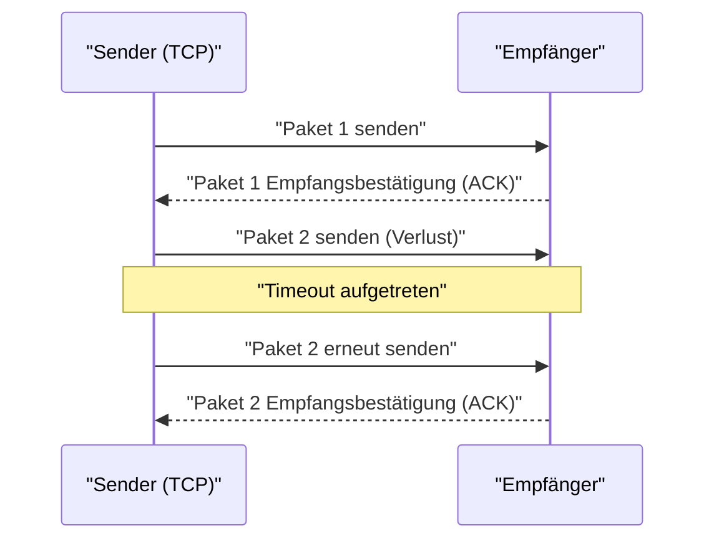

## 1. Geschwindigkeit oder Genauigkeit? Das ultimative Dilemma des Internets

Wenn wir Daten über das Internet austauschen, gibt es hauptsächlich zwei Akteure unter den Protokollen, die auf der Basisebene (Transportschicht) arbeiten.
Der eine ist **TCP (Transmission Control Protocol)**, das den Großteil der Internetkommunikation übernimmt, wie das Durchsuchen von Websites oder das Herunterladen von Dateien.
Und der andere ist der Protagonist dieses Artikels, **UDP (User Datagram Protocol)**.

Wenn TCP ein "höflicher Zusteller wie bei einem Einschreiben ist, der niemals ein Paket verliert", dann ist UDP wie eine "superschnelle Ballwurfmaschine, die Pakete nacheinander abwirft und nicht zurückblickt, selbst wenn sie nicht ankommen".

Warum braucht das Internet ein Protokoll, das "keine Zustellungsgarantie" bietet?

## 2. Die Grenzen von TCP: Die durch "Genauigkeit" verursachte Verzögerung

Um die Notwendigkeit von UDP zu verstehen, werfen wir zunächst einen Blick auf das Verhalten seines Rivalen TCP.

TCP ist ein **verbindungsorientiertes** Protokoll. Bevor Daten gesendet werden, führt es immer eine Vorabprüfung (Drei-Wege-Handshake) mit der Gegenseite durch: "Darf ich jetzt senden?" - "Ja, das dürfen Sie."
Darüber hinaus weist TCP beim Senden von Daten in kleinen Stücken (Paketen) jedem Paket eine Sequenznummer zu und wartet auf eine Empfangsbestätigung (ACK) von der Gegenseite, z. B. "Nummer 1 ist angekommen", "Nummer 2 ist angekommen". Wenn Paket Nummer 3 unterwegs im Netzwerk verloren geht und keine Empfangsbestätigung eintrifft, erkennt TCP dies über einen Timer und startet den Prozess neu: "Ich sende Nummer 3 erneut."

Dank dieses Mechanismus können wir wunderschöne Bilder ohne einen einzigen fehlenden Byte betrachten oder Programme herunterladen.
Dieser Prozess von "Bestätigung" und "Erneutes Senden" führt jedoch zu einer **fatalen zeitlichen Verzögerung (Latenz)**.

## 3. Die Philosophie von UDP: "Egal, ob es ankommt, sende es jetzt"

In Anwendungen, bei denen Echtzeitfähigkeit von entscheidender Bedeutung ist, wie z. B. "Online-Spiele (FPS oder Kampfspiele)", "Videoanrufe wie Zoom" und "Live-Sportübertragungen", wird die Höflichkeit von TCP stattdessen zu einem Nachteil.

Angenommen, die Audiodaten werden während eines Videoanrufs für einen Moment unterbrochen. Wenn TCP verwendet würde, würde das System Folgendes verarbeiten: "Die Audiodaten von vor 0,5 Sekunden sind nicht angekommen, also werden sie erneut gesendet. Bis dahin wird das gesamte Video angehalten." Infolgedessen würde das Bild ruckeln und einfrieren.
Für Menschen ist es bei Echtzeitanrufen viel wichtiger, dass "das aktuelle Audio so weiterläuft, auch wenn es ein wenig Rauschen gibt", als dass "das vergangene Audio von vor 0,5 Sekunden verspätet, aber perfekt ankommt".

Hier kommt das **verbindungslose** UDP ins Spiel.

UDP prüft überhaupt nicht, ob die Gegenseite bereit ist, etwas zu empfangen. Es weist den Paketen keine Sequenznummern zu, prüft nicht, ob sie angekommen sind, und führt keine erneuten Sendeversuche durch.
Es nimmt einfach die von der Anwendung übergebenen Daten, fügt einen Header (minimale Metadaten wie Zielinformationen) hinzu und "wirft" sie in den Ozean des Netzwerks.

### Der UDP-Header ist extrem leicht
Während der TCP-Header normalerweise 20 Bytes an verschiedenen Steuerinformationen enthält, hat der UDP-Header nur **8 Bytes**.
1. Quellportnummer (2 Bytes)
2. Zielportnummer (2 Bytes)
3. Paketlänge (2 Bytes)
4. Prüfsumme (2 Bytes: minimale Prüfung, um Datenkorruption zu verhindern)

Diese überwältigende Leichtigkeit und Einfachheit der Verarbeitung reduzieren die Kommunikationslatenz auf ein absolutes Minimum und ermöglichen ein Echtzeiterlebnis.

## 4. Einsatzgebiete von UDP

Die Eigenschaft von UDP, "leicht und schnell, aber unzuverlässig" zu sein, wird in der modernen Internetinfrastruktur überall genutzt.

* **DNS (Domain Name System)**
  Ein System, das URLs (z. B. google.com) in IP-Adressen umwandelt. Anfragen an DNS sind sehr kleine Datenmengen, und wenn keine Antwort zurückkommt, reicht es aus, einfach noch einmal anzufragen. Daher wird das schnelle UDP verwendet.
* **NTP (Network Time Protocol)**
  Kommunikation, um die Uhren von PCs und Smartphones genau zu synchronisieren. Da Zeitinformationen nutzlos sind, wenn sie veraltet sind, ist UDP, das Verzögerungen durch erneutes Senden vermeidet, optimal.
* **Streaming-Dienste und VoIP**
  Live-Übertragungen auf YouTube, LINE-Anrufe und Discord-Sprachanrufe realisieren verzögerungsfreie UDP-Kommunikation, indem die Software einen Teil der fehlenden Pakete interpoliert (vorhersagt und ausfüllt).

## 5. Eine neue Evolution: Das "QUIC"-Protokoll

Lange Zeit war das Internet in das "genaue TCP" und das "schnelle UDP" gespalten, aber in den letzten Jahren hat eine Revolution stattgefunden, die diese Geschichte verändert.
Das ist das **QUIC**-Protokoll, das von Google entwickelt wurde und die Grundlage des heutigen "HTTP/3" bildet.

Google, das die Anzeige von Websites weiter beschleunigen wollte, erkannte, dass die "Verzögerung bei der ersten Begrüßung (Handshake)" von TCP ihre Grenzen erreicht hatte. Anstatt also TCP zu verbessern, haben sie **überraschenderweise auf Basis von UDP ihre eigene "schnelle und genaue Kommunikationsprozedur" durch Softwaresteuerung entwickelt**.

Da QUIC auf UDP basiert, kann es die komplexe TCP-Steuerung des Betriebssystem-Kernels umgehen, und durch die gleichzeitige Durchführung eines eigenen verschlüsselten Kommunikations-Handshakes (TLS) wird die Zeit bis zum Beginn der Kommunikation drastisch verkürzt. Wenn wir heute YouTube schauen oder Google-Dienste nutzen, transportiert im Hintergrund nicht TCP, sondern das UDP-basierte QUIC Daten mit explosiver Geschwindigkeit.

Die Tatsache, dass UDP, das immer als "unzuverlässig" bezeichnet wurde, mit etwas Einfallsreichtum zur Grundlage der modernsten Web-Infrastruktur von heute aufgestiegen ist, zeigt, wie mächtig "Leichtigkeit und Einfachheit" beim Entwurf von Computernetzwerken sein können.
