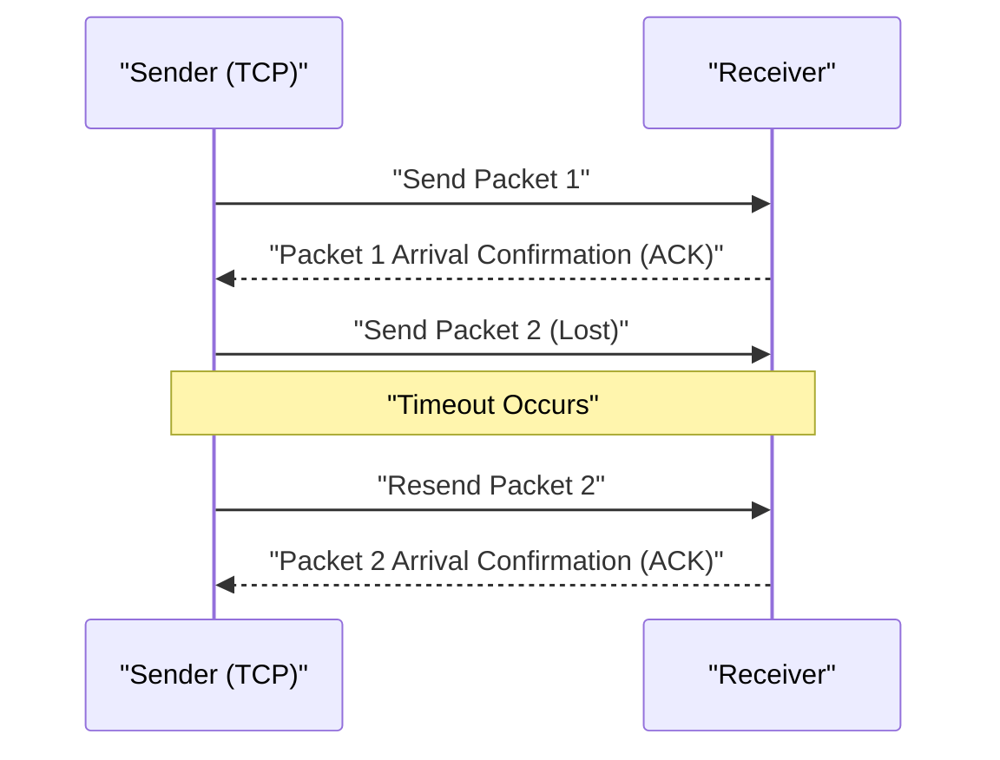

## 1. Speed or Accuracy? The Ultimate Choice of the Internet

When we exchange data over the Internet, there are broadly two main protocols (communication rules) working at its foundation (the transport layer).
One is **TCP (Transmission Control Protocol)**, which handles the vast majority of Internet communication, such as browsing websites and downloading files.
And the other is the main subject of this article, **UDP (User Datagram Protocol)**.

If TCP is a "polite delivery person like registered mail who absolutely never loses a package," UDP is like a "super high-speed pitching machine that constantly throws packages and never looks back even if they don't arrive."

Why does the Internet need a protocol with "no guarantee of delivery"?

## 2. The Limits of TCP: The Delay Caused by "Accuracy"

To understand the necessity of UDP, let's first look at the behavior of its rival, TCP.

TCP is a **connection-oriented** protocol. Before sending data, it always checks with the other party beforehand, saying, "Can I send it now?" and receiving the reply, "Yes, you can" (the 3-way handshake).
Furthermore, when sending data chopped into small pieces (packets), it assigns sequential numbers to all packets and waits for an acknowledgment of receipt (ACK) from the other party saying, "Number 1 has arrived," "Number 2 has arrived." If packet number 3 gets lost on the network along the way and no acknowledgment of receipt comes, TCP detects it with a timer and starts over, saying, "I will resend number 3."

Thanks to this mechanism, we can view beautiful images or download programs without a single byte missing.
However, this process of "confirmation" and "resending" creates a **fatal time delay (latency)**.

## 3. The Philosophy of UDP: "It doesn't matter if it doesn't arrive, just send it now"

In applications where real-time performance is extremely important, such as "online games (FPS and fighting games)," "video calls like Zoom," and "live sports streaming," the politeness of TCP actually works against it.

Imagine if the audio data during a video call was interrupted for just a moment. If TCP were used, the system would process this as: "The audio data from 0.5 seconds ago has not arrived, so we will resend it. Until then, we will temporarily pause the entire video." As a result, the screen would freeze up.
For humans in a real-time call, it is far more important to "keep playing the current audio as it is, even if there is a little noise," than to have "the past audio from 0.5 seconds ago arrive clearly but delayed."

This is where the **connectionless** UDP comes into play.

UDP makes absolutely no checks to see if the other party is ready to receive. It does not assign sequential numbers to packets, nor does it check whether they arrived, or perform resend processing.
It just simply attaches a header (a tiny amount of metadata such as destination information) to the data handed over by the application, and "throws" it into the sea of the network.

### The UDP Header is Extremely Light
While a TCP header normally has 20 bytes of various control information, a UDP header is merely **8 bytes**.
1. Source Port Number (2 bytes)
2. Destination Port Number (2 bytes)
3. Packet Length (2 bytes)
4. Checksum (2 bytes: minimum check for data corruption)

This overwhelming lightness and simplicity of processing trim the communication latency to the absolute minimum, enabling a real-time experience.

## 4. Where UDP Shines

The characteristic of UDP being "light and fast, but lacking reliability" is utilized all over modern Internet infrastructure.

* **DNS (Domain Name System)**
  A system that converts URLs (e.g., google.com) into IP addresses. Queries to DNS are very small data, and if a reply does not come back, it is fine to just query again, so high-speed UDP is used.
* **NTP (Network Time Protocol)**
  Communication to accurately set the clocks of PCs and smartphones. Time information is meaningless if it is old, so UDP, which avoids delays caused by resending, is optimal.
* **Streaming Delivery and VoIP**
  YouTube live streaming, LINE calls, and Discord voice calls realize delay-free UDP communication by having the software side interpolate (predict and fill in) partial packet losses.

## 5. A New Evolution: The "QUIC" Protocol

For many years, the Internet was divided between "accurate TCP" and "fast UDP," but in recent years, a revolution occurred that changed this history.
That is the **QUIC** protocol, developed by Google, which serves as the foundation of the current "HTTP/3."

Google, wanting to speed up website display even more, realized that the delay caused by TCP's "initial greeting (handshake)" had reached its limit. So, instead of improving TCP, **they actually used UDP as a base and built their own "fast and accurate communication procedure" via software control on top of it**.

Because QUIC is based on UDP, it can bypass the complex TCP control of the OS kernel, and by simultaneously performing the handshake of its own encrypted communication (TLS), it dramatically shortened the time to start communication. Currently, when we watch YouTube or use Google services, it is not TCP but the UDP-based QUIC that is carrying data at explosive speeds behind the scenes.

The fact that UDP, which was constantly called "unreliable," has achieved a great promotion to the foundation of the most advanced modern Web infrastructure through ingenuity, tells the story of just how powerful a weapon "lightness and simplicity" can be in computer network design.
