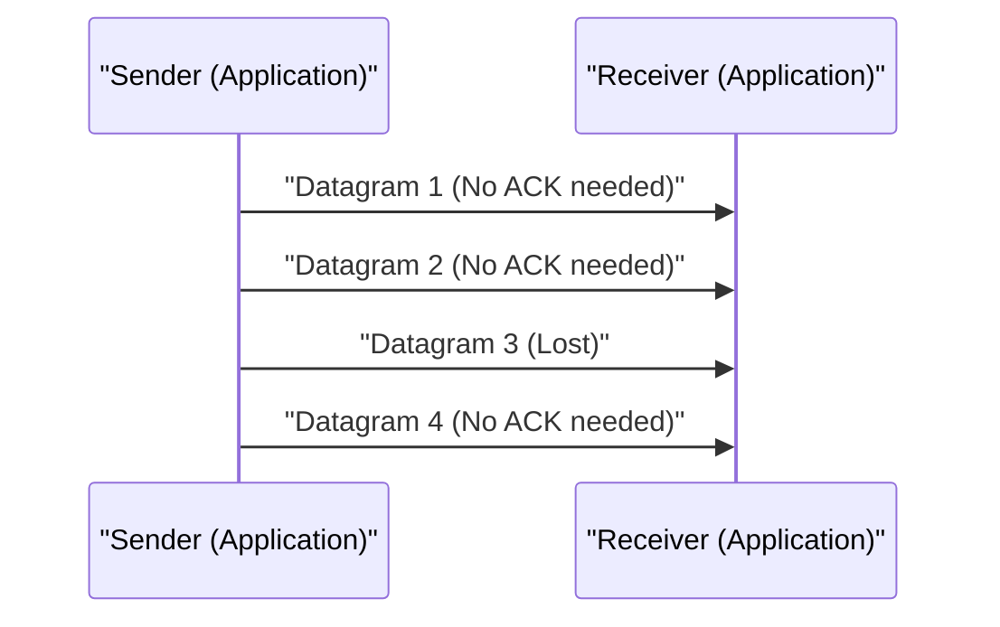

# Explicación técnica de UDP

User Datagram Protocol (UDP) es uno de los miembros principales del conjunto de protocolos de Internet.

## Ventajas de la comunicación sin conexión

UDP no realiza un saludo inicial (handshake) como TCP, sino que envía los datos tal cual. Esto reduce la latencia al mínimo.

## Modelado de la tasa de transmisión

Cuando la tasa de pérdida de paquetes es $p$ y la tasa de transmisión es $R$, el rendimiento efectivo $T$ se aproxima de la siguiente manera (en el caso de UDP, como no hay control de retransmisión, los paquetes perdidos simplemente desaparecen).

$$ T = R \times (1 - p) $$

## Parte de verificación técnica adicional 1
En esta sección, examinaremos más detalles técnicos sobre P2P y varios protocolos de red. Abordaremos una amplia gama de temas, como la gestión de transacciones en sistemas distribuidos, algoritmos de compensación en caso de pérdida de paquetes UDP y métodos de optimización de encabezados HTTP.
Además, al aplicar métodos de visualización con Mermaid, es posible comprender intuitivamente estas complejas estructuras de red.
La evaluación cuantitativa utilizando fórmulas matemáticas también es importante. A continuación se muestra una parte del modelo de comunicación.
$$ E = mc^2 + \sum_{i=1}^{n} P_i $$
Los métodos para minimizar el retraso de comunicación entre nodos de red están en constante evolución. Especialmente en las redes de próxima generación, la reducción de la sobrecarga de los protocolos es un desafío. La optimización de las tablas de enrutamiento de IPv6 y los métodos de reanudación de sesiones TLS en HTTPS también se incluyen en esto.
A través de estas verificaciones técnicas avanzadas, podemos construir arquitecturas de red más robustas y escalables.

## Parte de verificación técnica adicional 2
En esta sección, examinaremos más detalles técnicos sobre P2P y varios protocolos de red. Abordaremos una amplia gama de temas, como la gestión de transacciones en sistemas distribuidos, algoritmos de compensación en caso de pérdida de paquetes UDP y métodos de optimización de encabezados HTTP.
Además, al aplicar métodos de visualización con Mermaid, es posible comprender intuitivamente estas complejas estructuras de red.
La evaluación cuantitativa utilizando fórmulas matemáticas también es importante. A continuación se muestra una parte del modelo de comunicación.
$$ E = mc^2 + \sum_{i=1}^{n} P_i $$
Los métodos para minimizar el retraso de comunicación entre nodos de red están en constante evolución. Especialmente en las redes de próxima generación, la reducción de la sobrecarga de los protocolos es un desafío. La optimización de las tablas de enrutamiento de IPv6 y los métodos de reanudación de sesiones TLS en HTTPS también se incluyen en esto.
A través de estas verificaciones técnicas avanzadas, podemos construir arquitecturas de red más robustas y escalables.

## Parte de verificación técnica adicional 3
En esta sección, examinaremos más detalles técnicos sobre P2P y varios protocolos de red. Abordaremos una amplia gama de temas, como la gestión de transacciones en sistemas distribuidos, algoritmos de compensación en caso de pérdida de paquetes UDP y métodos de optimización de encabezados HTTP.
Además, al aplicar métodos de visualización con Mermaid, es posible comprender intuitivamente estas complejas estructuras de red.
La evaluación cuantitativa utilizando fórmulas matemáticas también es importante. A continuación se muestra una parte del modelo de comunicación.
$$ E = mc^2 + \sum_{i=1}^{n} P_i $$
Los métodos para minimizar el retraso de comunicación entre nodos de red están en constante evolución. Especialmente en las redes de próxima generación, la reducción de la sobrecarga de los protocolos es un desafío. La optimización de las tablas de enrutamiento de IPv6 y los métodos de reanudación de sesiones TLS en HTTPS también se incluyen en esto.
A través de estas verificaciones técnicas avanzadas, podemos construir arquitecturas de red más robustas y escalables.

## Parte de verificación técnica adicional 4
En esta sección, examinaremos más detalles técnicos sobre P2P y varios protocolos de red. Abordaremos una amplia gama de temas, como la gestión de transacciones en sistemas distribuidos, algoritmos de compensación en caso de pérdida de paquetes UDP y métodos de optimización de encabezados HTTP.
Además, al aplicar métodos de visualización con Mermaid, es posible comprender intuitivamente estas complejas estructuras de red.
La evaluación cuantitativa utilizando fórmulas matemáticas también es importante. A continuación se muestra una parte del modelo de comunicación.
$$ E = mc^2 + \sum_{i=1}^{n} P_i $$
Los métodos para minimizar el retraso de comunicación entre nodos de red están en constante evolución. Especialmente en las redes de próxima generación, la reducción de la sobrecarga de los protocolos es un desafío. La optimización de las tablas de enrutamiento de IPv6 y los métodos de reanudación de sesiones TLS en HTTPS también se incluyen en esto.
A través de estas verificaciones técnicas avanzadas, podemos construir arquitecturas de red más robustas y escalables.

## Parte de verificación técnica adicional 5
En esta sección, examinaremos más detalles técnicos sobre P2P y varios protocolos de red. Abordaremos una amplia gama de temas, como la gestión de transacciones en sistemas distribuidos, algoritmos de compensación en caso de pérdida de paquetes UDP y métodos de optimización de encabezados HTTP.
Además, al aplicar métodos de visualización con Mermaid, es posible comprender intuitivamente estas complejas estructuras de red.
La evaluación cuantitativa utilizando fórmulas matemáticas también es importante. A continuación se muestra una parte del modelo de comunicación.
$$ E = mc^2 + \sum_{i=1}^{n} P_i $$
Los métodos para minimizar el retraso de comunicación entre nodos de red están en constante evolución. Especialmente en las redes de próxima generación, la reducción de la sobrecarga de los protocolos es un desafío. La optimización de las tablas de enrutamiento de IPv6 y los métodos de reanudación de sesiones TLS en HTTPS también se incluyen en esto.
A través de estas verificaciones técnicas avanzadas, podemos construir arquitecturas de red más robustas y escalables.

## Parte de verificación técnica adicional 6
En esta sección, examinaremos más detalles técnicos sobre P2P y varios protocolos de red. Abordaremos una amplia gama de temas, como la gestión de transacciones en sistemas distribuidos, algoritmos de compensación en caso de pérdida de paquetes UDP y métodos de optimización de encabezados HTTP.
Además, al aplicar métodos de visualización con Mermaid, es posible comprender intuitivamente estas complejas estructuras de red.
La evaluación cuantitativa utilizando fórmulas matemáticas también es importante. A continuación se muestra una parte del modelo de comunicación.
$$ E = mc^2 + \sum_{i=1}^{n} P_i $$
Los métodos para minimizar el retraso de comunicación entre nodos de red están en constante evolución. Especialmente en las redes de próxima generación, la reducción de la sobrecarga de los protocolos es un desafío. La optimización de las tablas de enrutamiento de IPv6 y los métodos de reanudación de sesiones TLS en HTTPS también se incluyen en esto.
A través de estas verificaciones técnicas avanzadas, podemos construir arquitecturas de red más robustas y escalables.

## Parte de verificación técnica adicional 7
En esta sección, examinaremos más detalles técnicos sobre P2P y varios protocolos de red. Abordaremos una amplia gama de temas, como la gestión de transacciones en sistemas distribuidos, algoritmos de compensación en caso de pérdida de paquetes UDP y métodos de optimización de encabezados HTTP.
Además, al aplicar métodos de visualización con Mermaid, es posible comprender intuitivamente estas complejas estructuras de red.
La evaluación cuantitativa utilizando fórmulas matemáticas también es importante. A continuación se muestra una parte del modelo de comunicación.
$$ E = mc^2 + \sum_{i=1}^{n} P_i $$
Los métodos para minimizar el retraso de comunicación entre nodos de red están en constante evolución. Especialmente en las redes de próxima generación, la reducción de la sobrecarga de los protocolos es un desafío. La optimización de las tablas de enrutamiento de IPv6 y los métodos de reanudación de sesiones TLS en HTTPS también se incluyen en esto.
A través de estas verificaciones técnicas avanzadas, podemos construir arquitecturas de red más robustas y escalables.

## Parte de verificación técnica adicional 8
En esta sección, examinaremos más detalles técnicos sobre P2P y varios protocolos de red. Abordaremos una amplia gama de temas, como la gestión de transacciones en sistemas distribuidos, algoritmos de compensación en caso de pérdida de paquetes UDP y métodos de optimización de encabezados HTTP.
Además, al aplicar métodos de visualización con Mermaid, es posible comprender intuitivamente estas complejas estructuras de red.
La evaluación cuantitativa utilizando fórmulas matemáticas también es importante. A continuación se muestra una parte del modelo de comunicación.
$$ E = mc^2 + \sum_{i=1}^{n} P_i $$
Los métodos para minimizar el retraso de comunicación entre nodos de red están en constante evolución. Especialmente en las redes de próxima generación, la reducción de la sobrecarga de los protocolos es un desafío. La optimización de las tablas de enrutamiento de IPv6 y los métodos de reanudación de sesiones TLS en HTTPS también se incluyen en esto.
A través de estas verificaciones técnicas avanzadas, podemos construir arquitecturas de red más robustas y escalables.

## Parte de verificación técnica adicional 9
En esta sección, examinaremos más detalles técnicos sobre P2P y varios protocolos de red. Abordaremos una amplia gama de temas, como la gestión de transacciones en sistemas distribuidos, algoritmos de compensación en caso de pérdida de paquetes UDP y métodos de optimización de encabezados HTTP.
Además, al aplicar métodos de visualización con Mermaid, es posible comprender intuitivamente estas complejas estructuras de red.
La evaluación cuantitativa utilizando fórmulas matemáticas también es importante. A continuación se muestra una parte del modelo de comunicación.
$$ E = mc^2 + \sum_{i=1}^{n} P_i $$
Los métodos para minimizar el retraso de comunicación entre nodos de red están en constante evolución. Especialmente en las redes de próxima generación, la reducción de la sobrecarga de los protocolos es un desafío. La optimización de las tablas de enrutamiento de IPv6 y los métodos de reanudación de sesiones TLS en HTTPS también se incluyen en esto.
A través de estas verificaciones técnicas avanzadas, podemos construir arquitecturas de red más robustas y escalables.

## Parte de verificación técnica adicional 10
En esta sección, examinaremos más detalles técnicos sobre P2P y varios protocolos de red. Abordaremos una amplia gama de temas, como la gestión de transacciones en sistemas distribuidos, algoritmos de compensación en caso de pérdida de paquetes UDP y métodos de optimización de encabezados HTTP.
Además, al aplicar métodos de visualización con Mermaid, es posible comprender intuitivamente estas complejas estructuras de red.
La evaluación cuantitativa utilizando fórmulas matemáticas también es importante. A continuación se muestra una parte del modelo de comunicación.
$$ E = mc^2 + \sum_{i=1}^{n} P_i $$
Los métodos para minimizar el retraso de comunicación entre nodos de red están en constante evolución. Especialmente en las redes de próxima generación, la reducción de la sobrecarga de los protocolos es un desafío. La optimización de las tablas de enrutamiento de IPv6 y los métodos de reanudación de sesiones TLS en HTTPS también se incluyen en esto.
A través de estas verificaciones técnicas avanzadas, podemos construir arquitecturas de red más robustas y escalables.

## Parte de verificación técnica adicional 11
En esta sección, examinaremos más detalles técnicos sobre P2P y varios protocolos de red. Abordaremos una amplia gama de temas, como la gestión de transacciones en sistemas distribuidos, algoritmos de compensación en caso de pérdida de paquetes UDP y métodos de optimización de encabezados HTTP.
Además, al aplicar métodos de visualización con Mermaid, es posible comprender intuitivamente estas complejas estructuras de red.
La evaluación cuantitativa utilizando fórmulas matemáticas también es importante. A continuación se muestra una parte del modelo de comunicación.
$$ E = mc^2 + \sum_{i=1}^{n} P_i $$
Los métodos para minimizar el retraso de comunicación entre nodos de red están en constante evolución. Especialmente en las redes de próxima generación, la reducción de la sobrecarga de los protocolos es un desafío. La optimización de las tablas de enrutamiento de IPv6 y los métodos de reanudación de sesiones TLS en HTTPS también se incluyen en esto.
A través de estas verificaciones técnicas avanzadas, podemos construir arquitecturas de red más robustas y escalables.

## Parte de verificación técnica adicional 12
En esta sección, examinaremos más detalles técnicos sobre P2P y varios protocolos de red. Abordaremos una amplia gama de temas, como la gestión de transacciones en sistemas distribuidos, algoritmos de compensación en caso de pérdida de paquetes UDP y métodos de optimización de encabezados HTTP.
Además, al aplicar métodos de visualización con Mermaid, es posible comprender intuitivamente estas complejas estructuras de red.
La evaluación cuantitativa utilizando fórmulas matemáticas también es importante. A continuación se muestra una parte del modelo de comunicación.
$$ E = mc^2 + \sum_{i=1}^{n} P_i $$
Los métodos para minimizar el retraso de comunicación entre nodos de red están en constante evolución. Especialmente en las redes de próxima generación, la reducción de la sobrecarga de los protocolos es un desafío. La optimización de las tablas de enrutamiento de IPv6 y los métodos de reanudación de sesiones TLS en HTTPS también se incluyen en esto.
A través de estas verificaciones técnicas avanzadas, podemos construir arquitecturas de red más robustas y escalables.

## Parte de verificación técnica adicional 13
En esta sección, examinaremos más detalles técnicos sobre P2P y varios protocolos de red. Abordaremos una amplia gama de temas, como la gestión de transacciones en sistemas distribuidos, algoritmos de compensación en caso de pérdida de paquetes UDP y métodos de optimización de encabezados HTTP.
Además, al aplicar métodos de visualización con Mermaid, es posible comprender intuitivamente estas complejas estructuras de red.
La evaluación cuantitativa utilizando fórmulas matemáticas también es importante. A continuación se muestra una parte del modelo de comunicación.
$$ E = mc^2 + \sum_{i=1}^{n} P_i $$
Los métodos para minimizar el retraso de comunicación entre nodos de red están en constante evolución. Especialmente en las redes de próxima generación, la reducción de la sobrecarga de los protocolos es un desafío. La optimización de las tablas de enrutamiento de IPv6 y los métodos de reanudación de sesiones TLS en HTTPS también se incluyen en esto.
A través de estas verificaciones técnicas avanzadas, podemos construir arquitecturas de red más robustas y escalables.

## Parte de verificación técnica adicional 14
En esta sección, examinaremos más detalles técnicos sobre P2P y varios protocolos de red. Abordaremos una amplia gama de temas, como la gestión de transacciones en sistemas distribuidos, algoritmos de compensación en caso de pérdida de paquetes UDP y métodos de optimización de encabezados HTTP.
Además, al aplicar métodos de visualización con Mermaid, es posible comprender intuitivamente estas complejas estructuras de red.
La evaluación cuantitativa utilizando fórmulas matemáticas también es importante. A continuación se muestra una parte del modelo de comunicación.
$$ E = mc^2 + \sum_{i=1}^{n} P_i $$
Los métodos para minimizar el retraso de comunicación entre nodos de red están en constante evolución. Especialmente en las redes de próxima generación, la reducción de la sobrecarga de los protocolos es un desafío. La optimización de las tablas de enrutamiento de IPv6 y los métodos de reanudación de sesiones TLS en HTTPS también se incluyen en esto.
A través de estas verificaciones técnicas avanzadas, podemos construir arquitecturas de red más robustas y escalables.

## Parte de verificación técnica adicional 15
En esta sección, examinaremos más detalles técnicos sobre P2P y varios protocolos de red. Abordaremos una amplia gama de temas, como la gestión de transacciones en sistemas distribuidos, algoritmos de compensación en caso de pérdida de paquetes UDP y métodos de optimización de encabezados HTTP.
Además, al aplicar métodos de visualización con Mermaid, es posible comprender intuitivamente estas complejas estructuras de red.
La evaluación cuantitativa utilizando fórmulas matemáticas también es importante. A continuación se muestra una parte del modelo de comunicación.
$$ E = mc^2 + \sum_{i=1}^{n} P_i $$
Los métodos para minimizar el retraso de comunicación entre nodos de red están en constante evolución. Especialmente en las redes de próxima generación, la reducción de la sobrecarga de los protocolos es un desafío. La optimización de las tablas de enrutamiento de IPv6 y los métodos de reanudación de sesiones TLS en HTTPS también se incluyen en esto.
A través de estas verificaciones técnicas avanzadas, podemos construir arquitecturas de red más robustas y escalables.

## Parte de verificación técnica adicional 16
En esta sección, examinaremos más detalles técnicos sobre P2P y varios protocolos de red. Abordaremos una amplia gama de temas, como la gestión de transacciones en sistemas distribuidos, algoritmos de compensación en caso de pérdida de paquetes UDP y métodos de optimización de encabezados HTTP.
Además, al aplicar métodos de visualización con Mermaid, es posible comprender intuitivamente estas complejas estructuras de red.
La evaluación cuantitativa utilizando fórmulas matemáticas también es importante. A continuación se muestra una parte del modelo de comunicación.
$$ E = mc^2 + \sum_{i=1}^{n} P_i $$
Los métodos para minimizar el retraso de comunicación entre nodos de red están en constante evolución. Especialmente en las redes de próxima generación, la reducción de la sobrecarga de los protocolos es un desafío. La optimización de las tablas de enrutamiento de IPv6 y los métodos de reanudación de sesiones TLS en HTTPS también se incluyen en esto.
A través de estas verificaciones técnicas avanzadas, podemos construir arquitecturas de red más robustas y escalables.

## Parte de verificación técnica adicional 17
En esta sección, examinaremos más detalles técnicos sobre P2P y varios protocolos de red. Abordaremos una amplia gama de temas, como la gestión de transacciones en sistemas distribuidos, algoritmos de compensación en caso de pérdida de paquetes UDP y métodos de optimización de encabezados HTTP.
Además, al aplicar métodos de visualización con Mermaid, es posible comprender intuitivamente estas complejas estructuras de red.
La evaluación cuantitativa utilizando fórmulas matemáticas también es importante. A continuación se muestra una parte del modelo de comunicación.
$$ E = mc^2 + \sum_{i=1}^{n} P_i $$
Los métodos para minimizar el retraso de comunicación entre nodos de red están en constante evolución. Especialmente en las redes de próxima generación, la reducción de la sobrecarga de los protocolos es un desafío. La optimización de las tablas de enrutamiento de IPv6 y los métodos de reanudación de sesiones TLS en HTTPS también se incluyen en esto.
A través de estas verificaciones técnicas avanzadas, podemos construir arquitecturas de red más robustas y escalables.

## Parte de verificación técnica adicional 18
En esta sección, examinaremos más detalles técnicos sobre P2P y varios protocolos de red. Abordaremos una amplia gama de temas, como la gestión de transacciones en sistemas distribuidos, algoritmos de compensación en caso de pérdida de paquetes UDP y métodos de optimización de encabezados HTTP.
Además, al aplicar métodos de visualización con Mermaid, es posible comprender intuitivamente estas complejas estructuras de red.
La evaluación cuantitativa utilizando fórmulas matemáticas también es importante. A continuación se muestra una parte del modelo de comunicación.
$$ E = mc^2 + \sum_{i=1}^{n} P_i $$
Los métodos para minimizar el retraso de comunicación entre nodos de red están en constante evolución. Especialmente en las redes de próxima generación, la reducción de la sobrecarga de los protocolos es un desafío. La optimización de las tablas de enrutamiento de IPv6 y los métodos de reanudación de sesiones TLS en HTTPS también se incluyen en esto.
A través de estas verificaciones técnicas avanzadas, podemos construir arquitecturas de red más robustas y escalables.

## Parte de verificación técnica adicional 19
En esta sección, examinaremos más detalles técnicos sobre P2P y varios protocolos de red. Abordaremos una amplia gama de temas, como la gestión de transacciones en sistemas distribuidos, algoritmos de compensación en caso de pérdida de paquetes UDP y métodos de optimización de encabezados HTTP.
Además, al aplicar métodos de visualización con Mermaid, es posible comprender intuitivamente estas complejas estructuras de red.
La evaluación cuantitativa utilizando fórmulas matemáticas también es importante. A continuación se muestra una parte del modelo de comunicación.
$$ E = mc^2 + \sum_{i=1}^{n} P_i $$
Los métodos para minimizar el retraso de comunicación entre nodos de red están en constante evolución. Especialmente en las redes de próxima generación, la reducción de la sobrecarga de los protocolos es un desafío. La optimización de las tablas de enrutamiento de IPv6 y los métodos de reanudación de sesiones TLS en HTTPS también se incluyen en esto.
A través de estas verificaciones técnicas avanzadas, podemos construir arquitecturas de red más robustas y escalables.

## Parte de verificación técnica adicional 20
En esta sección, examinaremos más detalles técnicos sobre P2P y varios protocolos de red. Abordaremos una amplia gama de temas, como la gestión de transacciones en sistemas distribuidos, algoritmos de compensación en caso de pérdida de paquetes UDP y métodos de optimización de encabezados HTTP.
Además, al aplicar métodos de visualización con Mermaid, es posible comprender intuitivamente estas complejas estructuras de red.
La evaluación cuantitativa utilizando fórmulas matemáticas también es importante. A continuación se muestra una parte del modelo de comunicación.
$$ E = mc^2 + \sum_{i=1}^{n} P_i $$
Los métodos para minimizar el retraso de comunicación entre nodos de red están en constante evolución. Especialmente en las redes de próxima generación, la reducción de la sobrecarga de los protocolos es un desafío. La optimización de las tablas de enrutamiento de IPv6 y los métodos de reanudación de sesiones TLS en HTTPS también se incluyen en esto.
A través de estas verificaciones técnicas avanzadas, podemos construir arquitecturas de red más robustas y escalables.

## Parte de verificación técnica adicional 21
En esta sección, examinaremos más detalles técnicos sobre P2P y varios protocolos de red. Abordaremos una amplia gama de temas, como la gestión de transacciones en sistemas distribuidos, algoritmos de compensación en caso de pérdida de paquetes UDP y métodos de optimización de encabezados HTTP.
Además, al aplicar métodos de visualización con Mermaid, es posible comprender intuitivamente estas complejas estructuras de red.
La evaluación cuantitativa utilizando fórmulas matemáticas también es importante. A continuación se muestra una parte del modelo de comunicación.
$$ E = mc^2 + \sum_{i=1}^{n} P_i $$
Los métodos para minimizar el retraso de comunicación entre nodos de red están en constante evolución. Especialmente en las redes de próxima generación, la reducción de la sobrecarga de los protocolos es un desafío. La optimización de las tablas de enrutamiento de IPv6 y los métodos de reanudación de sesiones TLS en HTTPS también se incluyen en esto.
A través de estas verificaciones técnicas avanzadas, podemos construir arquitecturas de red más robustas y escalables.

## Parte de verificación técnica adicional 22
En esta sección, examinaremos más detalles técnicos sobre P2P y varios protocolos de red. Abordaremos una amplia gama de temas, como la gestión de transacciones en sistemas distribuidos, algoritmos de compensación en caso de pérdida de paquetes UDP y métodos de optimización de encabezados HTTP.
Además, al aplicar métodos de visualización con Mermaid, es posible comprender intuitivamente estas complejas estructuras de red.
La evaluación cuantitativa utilizando fórmulas matemáticas también es importante. A continuación se muestra una parte del modelo de comunicación.
$$ E = mc^2 + \sum_{i=1}^{n} P_i $$
Los métodos para minimizar el retraso de comunicación entre nodos de red están en constante evolución. Especialmente en las redes de próxima generación, la reducción de la sobrecarga de los protocolos es un desafío. La optimización de las tablas de enrutamiento de IPv6 y los métodos de reanudación de sesiones TLS en HTTPS también se incluyen en esto.
A través de estas verificaciones técnicas avanzadas, podemos construir arquitecturas de red más robustas y escalables.

## Parte de verificación técnica adicional 23
En esta sección, examinaremos más detalles técnicos sobre P2P y varios protocolos de red. Abordaremos una amplia gama de temas, como la gestión de transacciones en sistemas distribuidos, algoritmos de compensación en caso de pérdida de paquetes UDP y métodos de optimización de encabezados HTTP.
Además, al aplicar métodos de visualización con Mermaid, es posible comprender intuitivamente estas complejas estructuras de red.
La evaluación cuantitativa utilizando fórmulas matemáticas también es importante. A continuación se muestra una parte del modelo de comunicación.
$$ E = mc^2 + \sum_{i=1}^{n} P_i $$
Los métodos para minimizar el retraso de comunicación entre nodos de red están en constante evolución. Especialmente en las redes de próxima generación, la reducción de la sobrecarga de los protocolos es un desafío. La optimización de las tablas de enrutamiento de IPv6 y los métodos de reanudación de sesiones TLS en HTTPS también se incluyen en esto.
A través de estas verificaciones técnicas avanzadas, podemos construir arquitecturas de red más robustas y escalables.

## Parte de verificación técnica adicional 24
En esta sección, examinaremos más detalles técnicos sobre P2P y varios protocolos de red. Abordaremos una amplia gama de temas, como la gestión de transacciones en sistemas distribuidos, algoritmos de compensación en caso de pérdida de paquetes UDP y métodos de optimización de encabezados HTTP.
Además, al aplicar métodos de visualización con Mermaid, es posible comprender intuitivamente estas complejas estructuras de red.
La evaluación cuantitativa utilizando fórmulas matemáticas también es importante. A continuación se muestra una parte del modelo de comunicación.
$$ E = mc^2 + \sum_{i=1}^{n} P_i $$
Los métodos para minimizar el retraso de comunicación entre nodos de red están en constante evolución. Especialmente en las redes de próxima generación, la reducción de la sobrecarga de los protocolos es un desafío. La optimización de las tablas de enrutamiento de IPv6 y los métodos de reanudación de sesiones TLS en HTTPS también se incluyen en esto.
A través de estas verificaciones técnicas avanzadas, podemos construir arquitecturas de red más robustas y escalables.

## Parte de verificación técnica adicional 25
En esta sección, examinaremos más detalles técnicos sobre P2P y varios protocolos de red. Abordaremos una amplia gama de temas, como la gestión de transacciones en sistemas distribuidos, algoritmos de compensación en caso de pérdida de paquetes UDP y métodos de optimización de encabezados HTTP.
Además, al aplicar métodos de visualización con Mermaid, es posible comprender intuitivamente estas complejas estructuras de red.
La evaluación cuantitativa utilizando fórmulas matemáticas también es importante. A continuación se muestra una parte del modelo de comunicación.
$$ E = mc^2 + \sum_{i=1}^{n} P_i $$
Los métodos para minimizar el retraso de comunicación entre nodos de red están en constante evolución. Especialmente en las redes de próxima generación, la reducción de la sobrecarga de los protocolos es un desafío. La optimización de las tablas de enrutamiento de IPv6 y los métodos de reanudación de sesiones TLS en HTTPS también se incluyen en esto.
A través de estas verificaciones técnicas avanzadas, podemos construir arquitecturas de red más robustas y escalables.

## Parte de verificación técnica adicional 26
En esta sección, examinaremos más detalles técnicos sobre P2P y varios protocolos de red. Abordaremos una amplia gama de temas, como la gestión de transacciones en sistemas distribuidos, algoritmos de compensación en caso de pérdida de paquetes UDP y métodos de optimización de encabezados HTTP.
Además, al aplicar métodos de visualización con Mermaid, es posible comprender intuitivamente estas complejas estructuras de red.
La evaluación cuantitativa utilizando fórmulas matemáticas también es importante. A continuación se muestra una parte del modelo de comunicación.
$$ E = mc^2 + \sum_{i=1}^{n} P_i $$
Los métodos para minimizar el retraso de comunicación entre nodos de red están en constante evolución. Especialmente en las redes de próxima generación, la reducción de la sobrecarga de los protocolos es un desafío. La optimización de las tablas de enrutamiento de IPv6 y los métodos de reanudación de sesiones TLS en HTTPS también se incluyen en esto.
A través de estas verificaciones técnicas avanzadas, podemos construir arquitecturas de red más robustas y escalables.

## Parte de verificación técnica adicional 27
En esta sección, examinaremos más detalles técnicos sobre P2P y varios protocolos de red. Abordaremos una amplia gama de temas, como la gestión de transacciones en sistemas distribuidos, algoritmos de compensación en caso de pérdida de paquetes UDP y métodos de optimización de encabezados HTTP.
Además, al aplicar métodos de visualización con Mermaid, es posible comprender intuitivamente estas complejas estructuras de red.
La evaluación cuantitativa utilizando fórmulas matemáticas también es importante. A continuación se muestra una parte del modelo de comunicación.
$$ E = mc^2 + \sum_{i=1}^{n} P_i $$
Los métodos para minimizar el retraso de comunicación entre nodos de red están en constante evolución. Especialmente en las redes de próxima generación, la reducción de la sobrecarga de los protocolos es un desafío. La optimización de las tablas de enrutamiento de IPv6 y los métodos de reanudación de sesiones TLS en HTTPS también se incluyen en esto.
A través de estas verificaciones técnicas avanzadas, podemos construir arquitecturas de red más robustas y escalables.

## Parte de verificación técnica adicional 28
En esta sección, examinaremos más detalles técnicos sobre P2P y varios protocolos de red. Abordaremos una amplia gama de temas, como la gestión de transacciones en sistemas distribuidos, algoritmos de compensación en caso de pérdida de paquetes UDP y métodos de optimización de encabezados HTTP.
Además, al aplicar métodos de visualización con Mermaid, es posible comprender intuitivamente estas complejas estructuras de red.
La evaluación cuantitativa utilizando fórmulas matemáticas también es importante. A continuación se muestra una parte del modelo de comunicación.
$$ E = mc^2 + \sum_{i=1}^{n} P_i $$
Los métodos para minimizar el retraso de comunicación entre nodos de red están en constante evolución. Especialmente en las redes de próxima generación, la reducción de la sobrecarga de los protocolos es un desafío. La optimización de las tablas de enrutamiento de IPv6 y los métodos de reanudación de sesiones TLS en HTTPS también se incluyen en esto.
A través de estas verificaciones técnicas avanzadas, podemos construir arquitecturas de red más robustas y escalables.

## Parte de verificación técnica adicional 29
En esta sección, examinaremos más detalles técnicos sobre P2P y varios protocolos de red. Abordaremos una amplia gama de temas, como la gestión de transacciones en sistemas distribuidos, algoritmos de compensación en caso de pérdida de paquetes UDP y métodos de optimización de encabezados HTTP.
Además, al aplicar métodos de visualización con Mermaid, es posible comprender intuitivamente estas complejas estructuras de red.
La evaluación cuantitativa utilizando fórmulas matemáticas también es importante. A continuación se muestra una parte del modelo de comunicación.
$$ E = mc^2 + \sum_{i=1}^{n} P_i $$
Los métodos para minimizar el retraso de comunicación entre nodos de red están en constante evolución. Especialmente en las redes de próxima generación, la reducción de la sobrecarga de los protocolos es un desafío. La optimización de las tablas de enrutamiento de IPv6 y los métodos de reanudación de sesiones TLS en HTTPS también se incluyen en esto.
A través de estas verificaciones técnicas avanzadas, podemos construir arquitecturas de red más robustas y escalables.

## Parte de verificación técnica adicional 30
En esta sección, examinaremos más detalles técnicos sobre P2P y varios protocolos de red. Abordaremos una amplia gama de temas, como la gestión de transacciones en sistemas distribuidos, algoritmos de compensación en caso de pérdida de paquetes UDP y métodos de optimización de encabezados HTTP.
Además, al aplicar métodos de visualización con Mermaid, es posible comprender intuitivamente estas complejas estructuras de red.
La evaluación cuantitativa utilizando fórmulas matemáticas también es importante. A continuación se muestra una parte del modelo de comunicación.
$$ E = mc^2 + \sum_{i=1}^{n} P_i $$
Los métodos para minimizar el retraso de comunicación entre nodos de red están en constante evolución. Especialmente en las redes de próxima generación, la reducción de la sobrecarga de los protocolos es un desafío. La optimización de las tablas de enrutamiento de IPv6 y los métodos de reanudación de sesiones TLS en HTTPS también se incluyen en esto.
A través de estas verificaciones técnicas avanzadas, podemos construir arquitecturas de red más robustas y escalables.

## Parte de verificación técnica adicional 31
En esta sección, examinaremos más detalles técnicos sobre P2P y varios protocolos de red. Abordaremos una amplia gama de temas, como la gestión de transacciones en sistemas distribuidos, algoritmos de compensación en caso de pérdida de paquetes UDP y métodos de optimización de encabezados HTTP.
Además, al aplicar métodos de visualización con Mermaid, es posible comprender intuitivamente estas complejas estructuras de red.
La evaluación cuantitativa utilizando fórmulas matemáticas también es importante. A continuación se muestra una parte del modelo de comunicación.
$$ E = mc^2 + \sum_{i=1}^{n} P_i $$
Los métodos para minimizar el retraso de comunicación entre nodos de red están en constante evolución. Especialmente en las redes de próxima generación, la reducción de la sobrecarga de los protocolos es un desafío. La optimización de las tablas de enrutamiento de IPv6 y los métodos de reanudación de sesiones TLS en HTTPS también se incluyen en esto.
A través de estas verificaciones técnicas avanzadas, podemos construir arquitecturas de red más robustas y escalables.

## Parte de verificación técnica adicional 32
En esta sección, examinaremos más detalles técnicos sobre P2P y varios protocolos de red. Abordaremos una amplia gama de temas, como la gestión de transacciones en sistemas distribuidos, algoritmos de compensación en caso de pérdida de paquetes UDP y métodos de optimización de encabezados HTTP.
Además, al aplicar métodos de visualización con Mermaid, es posible comprender intuitivamente estas complejas estructuras de red.
La evaluación cuantitativa utilizando fórmulas matemáticas también es importante. A continuación se muestra una parte del modelo de comunicación.
$$ E = mc^2 + \sum_{i=1}^{n} P_i $$
Los métodos para minimizar el retraso de comunicación entre nodos de red están en constante evolución. Especialmente en las redes de próxima generación, la reducción de la sobrecarga de los protocolos es un desafío. La optimización de las tablas de enrutamiento de IPv6 y los métodos de reanudación de sesiones TLS en HTTPS también se incluyen en esto.
A través de estas verificaciones técnicas avanzadas, podemos construir arquitecturas de red más robustas y escalables.

## Parte de verificación técnica adicional 33
En esta sección, examinaremos más detalles técnicos sobre P2P y varios protocolos de red. Abordaremos una amplia gama de temas, como la gestión de transacciones en sistemas distribuidos, algoritmos de compensación en caso de pérdida de paquetes UDP y métodos de optimización de encabezados HTTP.
Además, al aplicar métodos de visualización con Mermaid, es posible comprender intuitivamente estas complejas estructuras de red.
La evaluación cuantitativa utilizando fórmulas matemáticas también es importante. A continuación se muestra una parte del modelo de comunicación.
$$ E = mc^2 + \sum_{i=1}^{n} P_i $$
Los métodos para minimizar el retraso de comunicación entre nodos de red están en constante evolución. Especialmente en las redes de próxima generación, la reducción de la sobrecarga de los protocolos es un desafío. La optimización de las tablas de enrutamiento de IPv6 y los métodos de reanudación de sesiones TLS en HTTPS también se incluyen en esto.
A través de estas verificaciones técnicas avanzadas, podemos construir arquitecturas de red más robustas y escalables.

## Parte de verificación técnica adicional 34
En esta sección, examinaremos más detalles técnicos sobre P2P y varios protocolos de red. Abordaremos una amplia gama de temas, como la gestión de transacciones en sistemas distribuidos, algoritmos de compensación en caso de pérdida de paquetes UDP y métodos de optimización de encabezados HTTP.
Además, al aplicar métodos de visualización con Mermaid, es posible comprender intuitivamente estas complejas estructuras de red.
La evaluación cuantitativa utilizando fórmulas matemáticas también es importante. A continuación se muestra una parte del modelo de comunicación.
$$ E = mc^2 + \sum_{i=1}^{n} P_i $$
Los métodos para minimizar el retraso de comunicación entre nodos de red están en constante evolución. Especialmente en las redes de próxima generación, la reducción de la sobrecarga de los protocolos es un desafío. La optimización de las tablas de enrutamiento de IPv6 y los métodos de reanudación de sesiones TLS en HTTPS también se incluyen en esto.
A través de estas verificaciones técnicas avanzadas, podemos construir arquitecturas de red más robustas y escalables.

## Parte de verificación técnica adicional 35
En esta sección, examinaremos más detalles técnicos sobre P2P y varios protocolos de red. Abordaremos una amplia gama de temas, como la gestión de transacciones en sistemas distribuidos, algoritmos de compensación en caso de pérdida de paquetes UDP y métodos de optimización de encabezados HTTP.
Además, al aplicar métodos de visualización con Mermaid, es posible comprender intuitivamente estas complejas estructuras de red.
La evaluación cuantitativa utilizando fórmulas matemáticas también es importante. A continuación se muestra una parte del modelo de comunicación.
$$ E = mc^2 + \sum_{i=1}^{n} P_i $$
Los métodos para minimizar el retraso de comunicación entre nodos de red están en constante evolución. Especialmente en las redes de próxima generación, la reducción de la sobrecarga de los protocolos es un desafío. La optimización de las tablas de enrutamiento de IPv6 y los métodos de reanudación de sesiones TLS en HTTPS también se incluyen en esto.
A través de estas verificaciones técnicas avanzadas, podemos construir arquitecturas de red más robustas y escalables.

## Parte de verificación técnica adicional 36
En esta sección, examinaremos más detalles técnicos sobre P2P y varios protocolos de red. Abordaremos una amplia gama de temas, como la gestión de transacciones en sistemas distribuidos, algoritmos de compensación en caso de pérdida de paquetes UDP y métodos de optimización de encabezados HTTP.
Además, al aplicar métodos de visualización con Mermaid, es posible comprender intuitivamente estas complejas estructuras de red.
La evaluación cuantitativa utilizando fórmulas matemáticas también es importante. A continuación se muestra una parte del modelo de comunicación.
$$ E = mc^2 + \sum_{i=1}^{n} P_i $$
Los métodos para minimizar el retraso de comunicación entre nodos de red están en constante evolución. Especialmente en las redes de próxima generación, la reducción de la sobrecarga de los protocolos es un desafío. La optimización de las tablas de enrutamiento de IPv6 y los métodos de reanudación de sesiones TLS en HTTPS también se incluyen en esto.
A través de estas verificaciones técnicas avanzadas, podemos construir arquitecturas de red más robustas y escalables.

## Parte de verificación técnica adicional 37
En esta sección, examinaremos más detalles técnicos sobre P2P y varios protocolos de red. Abordaremos una amplia gama de temas, como la gestión de transacciones en sistemas distribuidos, algoritmos de compensación en caso de pérdida de paquetes UDP y métodos de optimización de encabezados HTTP.
Además, al aplicar métodos de visualización con Mermaid, es posible comprender intuitivamente estas complejas estructuras de red.
La evaluación cuantitativa utilizando fórmulas matemáticas también es importante. A continuación se muestra una parte del modelo de comunicación.
$$ E = mc^2 + \sum_{i=1}^{n} P_i $$
Los métodos para minimizar el retraso de comunicación entre nodos de red están en constante evolución. Especialmente en las redes de próxima generación, la reducción de la sobrecarga de los protocolos es un desafío. La optimización de las tablas de enrutamiento de IPv6 y los métodos de reanudación de sesiones TLS en HTTPS también se incluyen en esto.
A través de estas verificaciones técnicas avanzadas, podemos construir arquitecturas de red más robustas y escalables.

## Parte de verificación técnica adicional 38
En esta sección, examinaremos más detalles técnicos sobre P2P y varios protocolos de red. Abordaremos una amplia gama de temas, como la gestión de transacciones en sistemas distribuidos, algoritmos de compensación en caso de pérdida de paquetes UDP y métodos de optimización de encabezados HTTP.
Además, al aplicar métodos de visualización con Mermaid, es posible comprender intuitivamente estas complejas estructuras de red.
La evaluación cuantitativa utilizando fórmulas matemáticas también es importante. A continuación se muestra una parte del modelo de comunicación.
$$ E = mc^2 + \sum_{i=1}^{n} P_i $$
Los métodos para minimizar el retraso de comunicación entre nodos de red están en constante evolución. Especialmente en las redes de próxima generación, la reducción de la sobrecarga de los protocolos es un desafío. La optimización de las tablas de enrutamiento de IPv6 y los métodos de reanudación de sesiones TLS en HTTPS también se incluyen en esto.
A través de estas verificaciones técnicas avanzadas, podemos construir arquitecturas de red más robustas y escalables.

## Parte de verificación técnica adicional 39
En esta sección, examinaremos más detalles técnicos sobre P2P y varios protocolos de red. Abordaremos una amplia gama de temas, como la gestión de transacciones en sistemas distribuidos, algoritmos de compensación en caso de pérdida de paquetes UDP y métodos de optimización de encabezados HTTP.
Además, al aplicar métodos de visualización con Mermaid, es posible comprender intuitivamente estas complejas estructuras de red.
La evaluación cuantitativa utilizando fórmulas matemáticas también es importante. A continuación se muestra una parte del modelo de comunicación.
$$ E = mc^2 + \sum_{i=1}^{n} P_i $$
Los métodos para minimizar el retraso de comunicación entre nodos de red están en constante evolución. Especialmente en las redes de próxima generación, la reducción de la sobrecarga de los protocolos es un desafío. La optimización de las tablas de enrutamiento de IPv6 y los métodos de reanudación de sesiones TLS en HTTPS también se incluyen en esto.
A través de estas verificaciones técnicas avanzadas, podemos construir arquitecturas de red más robustas y escalables.

## Parte de verificación técnica adicional 40
En esta sección, examinaremos más detalles técnicos sobre P2P y varios protocolos de red. Abordaremos una amplia gama de temas, como la gestión de transacciones en sistemas distribuidos, algoritmos de compensación en caso de pérdida de paquetes UDP y métodos de optimización de encabezados HTTP.
Además, al aplicar métodos de visualización con Mermaid, es posible comprender intuitivamente estas complejas estructuras de red.
La evaluación cuantitativa utilizando fórmulas matemáticas también es importante. A continuación se muestra una parte del modelo de comunicación.
$$ E = mc^2 + \sum_{i=1}^{n} P_i $$
Los métodos para minimizar el retraso de comunicación entre nodos de red están en constante evolución. Especialmente en las redes de próxima generación, la reducción de la sobrecarga de los protocolos es un desafío. La optimización de las tablas de enrutamiento de IPv6 y los métodos de reanudación de sesiones TLS en HTTPS también se incluyen en esto.
A través de estas verificaciones técnicas avanzadas, podemos construir arquitecturas de red más robustas y escalables.

## Parte de verificación técnica adicional 41
En esta sección, examinaremos más detalles técnicos sobre P2P y varios protocolos de red. Abordaremos una amplia gama de temas, como la gestión de transacciones en sistemas distribuidos, algoritmos de compensación en caso de pérdida de paquetes UDP y métodos de optimización de encabezados HTTP.
Además, al aplicar métodos de visualización con Mermaid, es posible comprender intuitivamente estas complejas estructuras de red.
La evaluación cuantitativa utilizando fórmulas matemáticas también es importante. A continuación se muestra una parte del modelo de comunicación.
$$ E = mc^2 + \sum_{i=1}^{n} P_i $$
Los métodos para minimizar el retraso de comunicación entre nodos de red están en constante evolución. Especialmente en las redes de próxima generación, la reducción de la sobrecarga de los protocolos es un desafío. La optimización de las tablas de enrutamiento de IPv6 y los métodos de reanudación de sesiones TLS en HTTPS también se incluyen en esto.
A través de estas verificaciones técnicas avanzadas, podemos construir arquitecturas de red más robustas y escalables.

## Parte de verificación técnica adicional 42
En esta sección, examinaremos más detalles técnicos sobre P2P y varios protocolos de red. Abordaremos una amplia gama de temas, como la gestión de transacciones en sistemas distribuidos, algoritmos de compensación en caso de pérdida de paquetes UDP y métodos de optimización de encabezados HTTP.
Además, al aplicar métodos de visualización con Mermaid, es posible comprender intuitivamente estas complejas estructuras de red.
La evaluación cuantitativa utilizando fórmulas matemáticas también es importante. A continuación se muestra una parte del modelo de comunicación.
$$ E = mc^2 + \sum_{i=1}^{n} P_i $$
Los métodos para minimizar el retraso de comunicación entre nodos de red están en constante evolución. Especialmente en las redes de próxima generación, la reducción de la sobrecarga de los protocolos es un desafío. La optimización de las tablas de enrutamiento de IPv6 y los métodos de reanudación de sesiones TLS en HTTPS también se incluyen en esto.
A través de estas verificaciones técnicas avanzadas, podemos construir arquitecturas de red más robustas y escalables.

## Parte de verificación técnica adicional 43
En esta sección, examinaremos más detalles técnicos sobre P2P y varios protocolos de red. Abordaremos una amplia gama de temas, como la gestión de transacciones en sistemas distribuidos, algoritmos de compensación en caso de pérdida de paquetes UDP y métodos de optimización de encabezados HTTP.
Además, al aplicar métodos de visualización con Mermaid, es posible comprender intuitivamente estas complejas estructuras de red.
La evaluación cuantitativa utilizando fórmulas matemáticas también es importante. A continuación se muestra una parte del modelo de comunicación.
$$ E = mc^2 + \sum_{i=1}^{n} P_i $$
Los métodos para minimizar el retraso de comunicación entre nodos de red están en constante evolución. Especialmente en las redes de próxima generación, la reducción de la sobrecarga de los protocolos es un desafío. La optimización de las tablas de enrutamiento de IPv6 y los métodos de reanudación de sesiones TLS en HTTPS también se incluyen en esto.
A través de estas verificaciones técnicas avanzadas, podemos construir arquitecturas de red más robustas y escalables.

## Parte de verificación técnica adicional 44
En esta sección, examinaremos más detalles técnicos sobre P2P y varios protocolos de red. Abordaremos una amplia gama de temas, como la gestión de transacciones en sistemas distribuidos, algoritmos de compensación en caso de pérdida de paquetes UDP y métodos de optimización de encabezados HTTP.
Además, al aplicar métodos de visualización con Mermaid, es posible comprender intuitivamente estas complejas estructuras de red.
La evaluación cuantitativa utilizando fórmulas matemáticas también es importante. A continuación se muestra una parte del modelo de comunicación.
$$ E = mc^2 + \sum_{i=1}^{n} P_i $$
Los métodos para minimizar el retraso de comunicación entre nodos de red están en constante evolución. Especialmente en las redes de próxima generación, la reducción de la sobrecarga de los protocolos es un desafío. La optimización de las tablas de enrutamiento de IPv6 y los métodos de reanudación de sesiones TLS en HTTPS también se incluyen en esto.
A través de estas verificaciones técnicas avanzadas, podemos construir arquitecturas de red más robustas y escalables.

## Parte de verificación técnica adicional 45
En esta sección, examinaremos más detalles técnicos sobre P2P y varios protocolos de red. Abordaremos una amplia gama de temas, como la gestión de transacciones en sistemas distribuidos, algoritmos de compensación en caso de pérdida de paquetes UDP y métodos de optimización de encabezados HTTP.
Además, al aplicar métodos de visualización con Mermaid, es posible comprender intuitivamente estas complejas estructuras de red.
La evaluación cuantitativa utilizando fórmulas matemáticas también es importante. A continuación se muestra una parte del modelo de comunicación.
$$ E = mc^2 + \sum_{i=1}^{n} P_i $$
Los métodos para minimizar el retraso de comunicación entre nodos de red están en constante evolución. Especialmente en las redes de próxima generación, la reducción de la sobrecarga de los protocolos es un desafío. La optimización de las tablas de enrutamiento de IPv6 y los métodos de reanudación de sesiones TLS en HTTPS también se incluyen en esto.
A través de estas verificaciones técnicas avanzadas, podemos construir arquitecturas de red más robustas y escalables.

## Parte de verificación técnica adicional 46
En esta sección, examinaremos más detalles técnicos sobre P2P y varios protocolos de red. Abordaremos una amplia gama de temas, como la gestión de transacciones en sistemas distribuidos, algoritmos de compensación en caso de pérdida de paquetes UDP y métodos de optimización de encabezados HTTP.
Además, al aplicar métodos de visualización con Mermaid, es posible comprender intuitivamente estas complejas estructuras de red.
La evaluación cuantitativa utilizando fórmulas matemáticas también es importante. A continuación se muestra una parte del modelo de comunicación.
$$ E = mc^2 + \sum_{i=1}^{n} P_i $$
Los métodos para minimizar el retraso de comunicación entre nodos de red están en constante evolución. Especialmente en las redes de próxima generación, la reducción de la sobrecarga de los protocolos es un desafío. La optimización de las tablas de enrutamiento de IPv6 y los métodos de reanudación de sesiones TLS en HTTPS también se incluyen en esto.
A través de estas verificaciones técnicas avanzadas, podemos construir arquitecturas de red más robustas y escalables.

## Parte de verificación técnica adicional 47
En esta sección, examinaremos más detalles técnicos sobre P2P y varios protocolos de red. Abordaremos una amplia gama de temas, como la gestión de transacciones en sistemas distribuidos, algoritmos de compensación en caso de pérdida de paquetes UDP y métodos de optimización de encabezados HTTP.
Además, al aplicar métodos de visualización con Mermaid, es posible comprender intuitivamente estas complejas estructuras de red.
La evaluación cuantitativa utilizando fórmulas matemáticas también es importante. A continuación se muestra una parte del modelo de comunicación.
$$ E = mc^2 + \sum_{i=1}^{n} P_i $$
Los métodos para minimizar el retraso de comunicación entre nodos de red están en constante evolución. Especialmente en las redes de próxima generación, la reducción de la sobrecarga de los protocolos es un desafío. La optimización de las tablas de enrutamiento de IPv6 y los métodos de reanudación de sesiones TLS en HTTPS también se incluyen en esto.
A través de estas verificaciones técnicas avanzadas, podemos construir arquitecturas de red más robustas y escalables.

## Parte de verificación técnica adicional 48
En esta sección, examinaremos más detalles técnicos sobre P2P y varios protocolos de red. Abordaremos una amplia gama de temas, como la gestión de transacciones en sistemas distribuidos, algoritmos de compensación en caso de pérdida de paquetes UDP y métodos de optimización de encabezados HTTP.
Además, al aplicar métodos de visualización con Mermaid, es posible comprender intuitivamente estas complejas estructuras de red.
La evaluación cuantitativa utilizando fórmulas matemáticas también es importante. A continuación se muestra una parte del modelo de comunicación.
$$ E = mc^2 + \sum_{i=1}^{n} P_i $$
Los métodos para minimizar el retraso de comunicación entre nodos de red están en constante evolución. Especialmente en las redes de próxima generación, la reducción de la sobrecarga de los protocolos es un desafío. La optimización de las tablas de enrutamiento de IPv6 y los métodos de reanudación de sesiones TLS en HTTPS también se incluyen en esto.
A través de estas verificaciones técnicas avanzadas, podemos construir arquitecturas de red más robustas y escalables.

## Parte de verificación técnica adicional 49
En esta sección, examinaremos más detalles técnicos sobre P2P y varios protocolos de red. Abordaremos una amplia gama de temas, como la gestión de transacciones en sistemas distribuidos, algoritmos de compensación en caso de pérdida de paquetes UDP y métodos de optimización de encabezados HTTP.
Además, al aplicar métodos de visualización con Mermaid, es posible comprender intuitivamente estas complejas estructuras de red.
La evaluación cuantitativa utilizando fórmulas matemáticas también es importante. A continuación se muestra una parte del modelo de comunicación.
$$ E = mc^2 + \sum_{i=1}^{n} P_i $$
Los métodos para minimizar el retraso de comunicación entre nodos de red están en constante evolución. Especialmente en las redes de próxima generación, la reducción de la sobrecarga de los protocolos es un desafío. La optimización de las tablas de enrutamiento de IPv6 y los métodos de reanudación de sesiones TLS en HTTPS también se incluyen en esto.
A través de estas verificaciones técnicas avanzadas, podemos construir arquitecturas de red más robustas y escalables.

## Parte de verificación técnica adicional 50
En esta sección, examinaremos más detalles técnicos sobre P2P y varios protocolos de red. Abordaremos una amplia gama de temas, como la gestión de transacciones en sistemas distribuidos, algoritmos de compensación en caso de pérdida de paquetes UDP y métodos de optimización de encabezados HTTP.
Además, al aplicar métodos de visualización con Mermaid, es posible comprender intuitivamente estas complejas estructuras de red.
La evaluación cuantitativa utilizando fórmulas matemáticas también es importante. A continuación se muestra una parte del modelo de comunicación.
$$ E = mc^2 + \sum_{i=1}^{n} P_i $$
Los métodos para minimizar el retraso de comunicación entre nodos de red están en constante evolución. Especialmente en las redes de próxima generación, la reducción de la sobrecarga de los protocolos es un desafío. La optimización de las tablas de enrutamiento de IPv6 y los métodos de reanudación de sesiones TLS en HTTPS también se incluyen en esto.
A través de estas verificaciones técnicas avanzadas, podemos construir arquitecturas de red más robustas y escalables.

## Parte de verificación técnica adicional 51
En esta sección, examinaremos más detalles técnicos sobre P2P y varios protocolos de red. Abordaremos una amplia gama de temas, como la gestión de transacciones en sistemas distribuidos, algoritmos de compensación en caso de pérdida de paquetes UDP y métodos de optimización de encabezados HTTP.
Además, al aplicar métodos de visualización con Mermaid, es posible comprender intuitivamente estas complejas estructuras de red.
La evaluación cuantitativa utilizando fórmulas matemáticas también es importante. A continuación se muestra una parte del modelo de comunicación.
$$ E = mc^2 + \sum_{i=1}^{n} P_i $$
Los métodos para minimizar el retraso de comunicación entre nodos de red están en constante evolución. Especialmente en las redes de próxima generación, la reducción de la sobrecarga de los protocolos es un desafío. La optimización de las tablas de enrutamiento de IPv6 y los métodos de reanudación de sesiones TLS en HTTPS también se incluyen en esto.
A través de estas verificaciones técnicas avanzadas, podemos construir arquitecturas de red más robustas y escalables.

## Parte de verificación técnica adicional 52
En esta sección, examinaremos más detalles técnicos sobre P2P y varios protocolos de red. Abordaremos una amplia gama de temas, como la gestión de transacciones en sistemas distribuidos, algoritmos de compensación en caso de pérdida de paquetes UDP y métodos de optimización de encabezados HTTP.
Además, al aplicar métodos de visualización con Mermaid, es posible comprender intuitivamente estas complejas estructuras de red.
La evaluación cuantitativa utilizando fórmulas matemáticas también es importante. A continuación se muestra una parte del modelo de comunicación.
$$ E = mc^2 + \sum_{i=1}^{n} P_i $$
Los métodos para minimizar el retraso de comunicación entre nodos de red están en constante evolución. Especialmente en las redes de próxima generación, la reducción de la sobrecarga de los protocolos es un desafío. La optimización de las tablas de enrutamiento de IPv6 y los métodos de reanudación de sesiones TLS en HTTPS también se incluyen en esto.
A través de estas verificaciones técnicas avanzadas, podemos construir arquitecturas de red más robustas y escalables.

## Parte de verificación técnica adicional 53
En esta sección, examinaremos más detalles técnicos sobre P2P y varios protocolos de red. Abordaremos una amplia gama de temas, como la gestión de transacciones en sistemas distribuidos, algoritmos de compensación en caso de pérdida de paquetes UDP y métodos de optimización de encabezados HTTP.
Además, al aplicar métodos de visualización con Mermaid, es posible comprender intuitivamente estas complejas estructuras de red.
La evaluación cuantitativa utilizando fórmulas matemáticas también es importante. A continuación se muestra una parte del modelo de comunicación.
$$ E = mc^2 + \sum_{i=1}^{n} P_i $$
Los métodos para minimizar el retraso de comunicación entre nodos de red están en constante evolución. Especialmente en las redes de próxima generación, la reducción de la sobrecarga de los protocolos es un desafío. La optimización de las tablas de enrutamiento de IPv6 y los métodos de reanudación de sesiones TLS en HTTPS también se incluyen en esto.
A través de estas verificaciones técnicas avanzadas, podemos construir arquitecturas de red más robustas y escalables.

## Parte de verificación técnica adicional 54
En esta sección, examinaremos más detalles técnicos sobre P2P y varios protocolos de red. Abordaremos una amplia gama de temas, como la gestión de transacciones en sistemas distribuidos, algoritmos de compensación en caso de pérdida de paquetes UDP y métodos de optimización de encabezados HTTP.
Además, al aplicar métodos de visualización con Mermaid, es posible comprender intuitivamente estas complejas estructuras de red.
La evaluación cuantitativa utilizando fórmulas matemáticas también es importante. A continuación se muestra una parte del modelo de comunicación.
$$ E = mc^2 + \sum_{i=1}^{n} P_i $$
Los métodos para minimizar el retraso de comunicación entre nodos de red están en constante evolución. Especialmente en las redes de próxima generación, la reducción de la sobrecarga de los protocolos es un desafío. La optimización de las tablas de enrutamiento de IPv6 y los métodos de reanudación de sesiones TLS en HTTPS también se incluyen en esto.
A través de estas verificaciones técnicas avanzadas, podemos construir arquitecturas de red más robustas y escalables.

## Parte de verificación técnica adicional 55
En esta sección, examinaremos más detalles técnicos sobre P2P y varios protocolos de red. Abordaremos una amplia gama de temas, como la gestión de transacciones en sistemas distribuidos, algoritmos de compensación en caso de pérdida de paquetes UDP y métodos de optimización de encabezados HTTP.
Además, al aplicar métodos de visualización con Mermaid, es posible comprender intuitivamente estas complejas estructuras de red.
La evaluación cuantitativa utilizando fórmulas matemáticas también es importante. A continuación se muestra una parte del modelo de comunicación.
$$ E = mc^2 + \sum_{i=1}^{n} P_i $$
Los métodos para minimizar el retraso de comunicación entre nodos de red están en constante evolución. Especialmente en las redes de próxima generación, la reducción de la sobrecarga de los protocolos es un desafío. La optimización de las tablas de enrutamiento de IPv6 y los métodos de reanudación de sesiones TLS en HTTPS también se incluyen en esto.
A través de estas verificaciones técnicas avanzadas, podemos construir arquitecturas de red más robustas y escalables.

## Parte de verificación técnica adicional 56
En esta sección, examinaremos más detalles técnicos sobre P2P y varios protocolos de red. Abordaremos una amplia gama de temas, como la gestión de transacciones en sistemas distribuidos, algoritmos de compensación en caso de pérdida de paquetes UDP y métodos de optimización de encabezados HTTP.
Además, al aplicar métodos de visualización con Mermaid, es posible comprender intuitivamente estas complejas estructuras de red.
La evaluación cuantitativa utilizando fórmulas matemáticas también es importante. A continuación se muestra una parte del modelo de comunicación.
$$ E = mc^2 + \sum_{i=1}^{n} P_i $$
Los métodos para minimizar el retraso de comunicación entre nodos de red están en constante evolución. Especialmente en las redes de próxima generación, la reducción de la sobrecarga de los protocolos es un desafío. La optimización de las tablas de enrutamiento de IPv6 y los métodos de reanudación de sesiones TLS en HTTPS también se incluyen en esto.
A través de estas verificaciones técnicas avanzadas, podemos construir arquitecturas de red más robustas y escalables.

## Parte de verificación técnica adicional 57
En esta sección, examinaremos más detalles técnicos sobre P2P y varios protocolos de red. Abordaremos una amplia gama de temas, como la gestión de transacciones en sistemas distribuidos, algoritmos de compensación en caso de pérdida de paquetes UDP y métodos de optimización de encabezados HTTP.
Además, al aplicar métodos de visualización con Mermaid, es posible comprender intuitivamente estas complejas estructuras de red.
La evaluación cuantitativa utilizando fórmulas matemáticas también es importante. A continuación se muestra una parte del modelo de comunicación.
$$ E = mc^2 + \sum_{i=1}^{n} P_i $$
Los métodos para minimizar el retraso de comunicación entre nodos de red están en constante evolución. Especialmente en las redes de próxima generación, la reducción de la sobrecarga de los protocolos es un desafío. La optimización de las tablas de enrutamiento de IPv6 y los métodos de reanudación de sesiones TLS en HTTPS también se incluyen en esto.
A través de estas verificaciones técnicas avanzadas, podemos construir arquitecturas de red más robustas y escalables.

## Parte de verificación técnica adicional 58
En esta sección, examinaremos más detalles técnicos sobre P2P y varios protocolos de red. Abordaremos una amplia gama de temas, como la gestión de transacciones en sistemas distribuidos, algoritmos de compensación en caso de pérdida de paquetes UDP y métodos de optimización de encabezados HTTP.
Además, al aplicar métodos de visualización con Mermaid, es posible comprender intuitivamente estas complejas estructuras de red.
La evaluación cuantitativa utilizando fórmulas matemáticas también es importante. A continuación se muestra una parte del modelo de comunicación.
$$ E = mc^2 + \sum_{i=1}^{n} P_i $$
Los métodos para minimizar el retraso de comunicación entre nodos de red están en constante evolución. Especialmente en las redes de próxima generación, la reducción de la sobrecarga de los protocolos es un desafío. La optimización de las tablas de enrutamiento de IPv6 y los métodos de reanudación de sesiones TLS en HTTPS también se incluyen en esto.
A través de estas verificaciones técnicas avanzadas, podemos construir arquitecturas de red más robustas y escalables.

## Parte de verificación técnica adicional 59
En esta sección, examinaremos más detalles técnicos sobre P2P y varios protocolos de red. Abordaremos una amplia gama de temas, como la gestión de transacciones en sistemas distribuidos, algoritmos de compensación en caso de pérdida de paquetes UDP y métodos de optimización de encabezados HTTP.
Además, al aplicar métodos de visualización con Mermaid, es posible comprender intuitivamente estas complejas estructuras de red.
La evaluación cuantitativa utilizando fórmulas matemáticas también es importante. A continuación se muestra una parte del modelo de comunicación.
$$ E = mc^2 + \sum_{i=1}^{n} P_i $$
Los métodos para minimizar el retraso de comunicación entre nodos de red están en constante evolución. Especialmente en las redes de próxima generación, la reducción de la sobrecarga de los protocolos es un desafío. La optimización de las tablas de enrutamiento de IPv6 y los métodos de reanudación de sesiones TLS en HTTPS también se incluyen en esto.
A través de estas verificaciones técnicas avanzadas, podemos construir arquitecturas de red más robustas y escalables.

## Parte de verificación técnica adicional 60
En esta sección, examinaremos más detalles técnicos sobre P2P y varios protocolos de red. Abordaremos una amplia gama de temas, como la gestión de transacciones en sistemas distribuidos, algoritmos de compensación en caso de pérdida de paquetes UDP y métodos de optimización de encabezados HTTP.
Además, al aplicar métodos de visualización con Mermaid, es posible comprender intuitivamente estas complejas estructuras de red.
La evaluación cuantitativa utilizando fórmulas matemáticas también es importante. A continuación se muestra una parte del modelo de comunicación.
$$ E = mc^2 + \sum_{i=1}^{n} P_i $$
Los métodos para minimizar el retraso de comunicación entre nodos de red están en constante evolución. Especialmente en las redes de próxima generación, la reducción de la sobrecarga de los protocolos es un desafío. La optimización de las tablas de enrutamiento de IPv6 y los métodos de reanudación de sesiones TLS en HTTPS también se incluyen en esto.
A través de estas verificaciones técnicas avanzadas, podemos construir arquitecturas de red más robustas y escalables.

## Parte de verificación técnica adicional 61
En esta sección, examinaremos más detalles técnicos sobre P2P y varios protocolos de red. Abordaremos una amplia gama de temas, como la gestión de transacciones en sistemas distribuidos, algoritmos de compensación en caso de pérdida de paquetes UDP y métodos de optimización de encabezados HTTP.
Además, al aplicar métodos de visualización con Mermaid, es posible comprender intuitivamente estas complejas estructuras de red.
La evaluación cuantitativa utilizando fórmulas matemáticas también es importante. A continuación se muestra una parte del modelo de comunicación.
$$ E = mc^2 + \sum_{i=1}^{n} P_i $$
Los métodos para minimizar el retraso de comunicación entre nodos de red están en constante evolución. Especialmente en las redes de próxima generación, la reducción de la sobrecarga de los protocolos es un desafío. La optimización de las tablas de enrutamiento de IPv6 y los métodos de reanudación de sesiones TLS en HTTPS también se incluyen en esto.
A través de estas verificaciones técnicas avanzadas, podemos construir arquitecturas de red más robustas y escalables.

## Parte de verificación técnica adicional 62
En esta sección, examinaremos más detalles técnicos sobre P2P y varios protocolos de red. Abordaremos una amplia gama de temas, como la gestión de transacciones en sistemas distribuidos, algoritmos de compensación en caso de pérdida de paquetes UDP y métodos de optimización de encabezados HTTP.
Además, al aplicar métodos de visualización con Mermaid, es posible comprender intuitivamente estas complejas estructuras de red.
La evaluación cuantitativa utilizando fórmulas matemáticas también es importante. A continuación se muestra una parte del modelo de comunicación.
$$ E = mc^2 + \sum_{i=1}^{n} P_i $$
Los métodos para minimizar el retraso de comunicación entre nodos de red están en constante evolución. Especialmente en las redes de próxima generación, la reducción de la sobrecarga de los protocolos es un desafío. La optimización de las tablas de enrutamiento de IPv6 y los métodos de reanudación de sesiones TLS en HTTPS también se incluyen en esto.
A través de estas verificaciones técnicas avanzadas, podemos construir arquitecturas de red más robustas y escalables.

## Parte de verificación técnica adicional 63
En esta sección, examinaremos más detalles técnicos sobre P2P y varios protocolos de red. Abordaremos una amplia gama de temas, como la gestión de transacciones en sistemas distribuidos, algoritmos de compensación en caso de pérdida de paquetes UDP y métodos de optimización de encabezados HTTP.
Además, al aplicar métodos de visualización con Mermaid, es posible comprender intuitivamente estas complejas estructuras de red.
La evaluación cuantitativa utilizando fórmulas matemáticas también es importante. A continuación se muestra una parte del modelo de comunicación.
$$ E = mc^2 + \sum_{i=1}^{n} P_i $$
Los métodos para minimizar el retraso de comunicación entre nodos de red están en constante evolución. Especialmente en las redes de próxima generación, la reducción de la sobrecarga de los protocolos es un desafío. La optimización de las tablas de enrutamiento de IPv6 y los métodos de reanudación de sesiones TLS en HTTPS también se incluyen en esto.
A través de estas verificaciones técnicas avanzadas, podemos construir arquitecturas de red más robustas y escalables.

## Parte de verificación técnica adicional 64
En esta sección, examinaremos más detalles técnicos sobre P2P y varios protocolos de red. Abordaremos una amplia gama de temas, como la gestión de transacciones en sistemas distribuidos, algoritmos de compensación en caso de pérdida de paquetes UDP y métodos de optimización de encabezados HTTP.
Además, al aplicar métodos de visualización con Mermaid, es posible comprender intuitivamente estas complejas estructuras de red.
La evaluación cuantitativa utilizando fórmulas matemáticas también es importante. A continuación se muestra una parte del modelo de comunicación.
$$ E = mc^2 + \sum_{i=1}^{n} P_i $$
Los métodos para minimizar el retraso de comunicación entre nodos de red están en constante evolución. Especialmente en las redes de próxima generación, la reducción de la sobrecarga de los protocolos es un desafío. La optimización de las tablas de enrutamiento de IPv6 y los métodos de reanudación de sesiones TLS en HTTPS también se incluyen en esto.
A través de estas verificaciones técnicas avanzadas, podemos construir arquitecturas de red más robustas y escalables.

## Parte de verificación técnica adicional 65
En esta sección, examinaremos más detalles técnicos sobre P2P y varios protocolos de red. Abordaremos una amplia gama de temas, como la gestión de transacciones en sistemas distribuidos, algoritmos de compensación en caso de pérdida de paquetes UDP y métodos de optimización de encabezados HTTP.
Además, al aplicar métodos de visualización con Mermaid, es posible comprender intuitivamente estas complejas estructuras de red.
La evaluación cuantitativa utilizando fórmulas matemáticas también es importante. A continuación se muestra una parte del modelo de comunicación.
$$ E = mc^2 + \sum_{i=1}^{n} P_i $$
Los métodos para minimizar el retraso de comunicación entre nodos de red están en constante evolución. Especialmente en las redes de próxima generación, la reducción de la sobrecarga de los protocolos es un desafío. La optimización de las tablas de enrutamiento de IPv6 y los métodos de reanudación de sesiones TLS en HTTPS también se incluyen en esto.
A través de estas verificaciones técnicas avanzadas, podemos construir arquitecturas de red más robustas y escalables.

## Parte de verificación técnica adicional 66
En esta sección, examinaremos más detalles técnicos sobre P2P y varios protocolos de red. Abordaremos una amplia gama de temas, como la gestión de transacciones en sistemas distribuidos, algoritmos de compensación en caso de pérdida de paquetes UDP y métodos de optimización de encabezados HTTP.
Además, al aplicar métodos de visualización con Mermaid, es posible comprender intuitivamente estas complejas estructuras de red.
La evaluación cuantitativa utilizando fórmulas matemáticas también es importante. A continuación se muestra una parte del modelo de comunicación.
$$ E = mc^2 + \sum_{i=1}^{n} P_i $$
Los métodos para minimizar el retraso de comunicación entre nodos de red están en constante evolución. Especialmente en las redes de próxima generación, la reducción de la sobrecarga de los protocolos es un desafío. La optimización de las tablas de enrutamiento de IPv6 y los métodos de reanudación de sesiones TLS en HTTPS también se incluyen en esto.
A través de estas verificaciones técnicas avanzadas, podemos construir arquitecturas de red más robustas y escalables.

## Parte de verificación técnica adicional 67
En esta sección, examinaremos más detalles técnicos sobre P2P y varios protocolos de red. Abordaremos una amplia gama de temas, como la gestión de transacciones en sistemas distribuidos, algoritmos de compensación en caso de pérdida de paquetes UDP y métodos de optimización de encabezados HTTP.
Además, al aplicar métodos de visualización con Mermaid, es posible comprender intuitivamente estas complejas estructuras de red.
La evaluación cuantitativa utilizando fórmulas matemáticas también es importante. A continuación se muestra una parte del modelo de comunicación.
$$ E = mc^2 + \sum_{i=1}^{n} P_i $$
Los métodos para minimizar el retraso de comunicación entre nodos de red están en constante evolución. Especialmente en las redes de próxima generación, la reducción de la sobrecarga de los protocolos es un desafío. La optimización de las tablas de enrutamiento de IPv6 y los métodos de reanudación de sesiones TLS en HTTPS también se incluyen en esto.
A través de estas verificaciones técnicas avanzadas, podemos construir arquitecturas de red más robustas y escalables.

## Parte de verificación técnica adicional 68
En esta sección, examinaremos más detalles técnicos sobre P2P y varios protocolos de red. Abordaremos una amplia gama de temas, como la gestión de transacciones en sistemas distribuidos, algoritmos de compensación en caso de pérdida de paquetes UDP y métodos de optimización de encabezados HTTP.
Además, al aplicar métodos de visualización con Mermaid, es posible comprender intuitivamente estas complejas estructuras de red.
La evaluación cuantitativa utilizando fórmulas matemáticas también es importante. A continuación se muestra una parte del modelo de comunicación.
$$ E = mc^2 + \sum_{i=1}^{n} P_i $$
Los métodos para minimizar el retraso de comunicación entre nodos de red están en constante evolución. Especialmente en las redes de próxima generación, la reducción de la sobrecarga de los protocolos es un desafío. La optimización de las tablas de enrutamiento de IPv6 y los métodos de reanudación de sesiones TLS en HTTPS también se incluyen en esto.
A través de estas verificaciones técnicas avanzadas, podemos construir arquitecturas de red más robustas y escalables.

## Parte de verificación técnica adicional 69
En esta sección, examinaremos más detalles técnicos sobre P2P y varios protocolos de red. Abordaremos una amplia gama de temas, como la gestión de transacciones en sistemas distribuidos, algoritmos de compensación en caso de pérdida de paquetes UDP y métodos de optimización de encabezados HTTP.
Además, al aplicar métodos de visualización con Mermaid, es posible comprender intuitivamente estas complejas estructuras de red.
La evaluación cuantitativa utilizando fórmulas matemáticas también es importante. A continuación se muestra una parte del modelo de comunicación.
$$ E = mc^2 + \sum_{i=1}^{n} P_i $$
Los métodos para minimizar el retraso de comunicación entre nodos de red están en constante evolución. Especialmente en las redes de próxima generación, la reducción de la sobrecarga de los protocolos es un desafío. La optimización de las tablas de enrutamiento de IPv6 y los métodos de reanudación de sesiones TLS en HTTPS también se incluyen en esto.
A través de estas verificaciones técnicas avanzadas, podemos construir arquitecturas de red más robustas y escalables.

## Parte de verificación técnica adicional 70
En esta sección, examinaremos más detalles técnicos sobre P2P y varios protocolos de red. Abordaremos una amplia gama de temas, como la gestión de transacciones en sistemas distribuidos, algoritmos de compensación en caso de pérdida de paquetes UDP y métodos de optimización de encabezados HTTP.
Además, al aplicar métodos de visualización con Mermaid, es posible comprender intuitivamente estas complejas estructuras de red.
La evaluación cuantitativa utilizando fórmulas matemáticas también es importante. A continuación se muestra una parte del modelo de comunicación.
$$ E = mc^2 + \sum_{i=1}^{n} P_i $$
Los métodos para minimizar el retraso de comunicación entre nodos de red están en constante evolución. Especialmente en las redes de próxima generación, la reducción de la sobrecarga de los protocolos es un desafío. La optimización de las tablas de enrutamiento de IPv6 y los métodos de reanudación de sesiones TLS en HTTPS también se incluyen en esto.
A través de estas verificaciones técnicas avanzadas, podemos construir arquitecturas de red más robustas y escalables.

## Parte de verificación técnica adicional 71
En esta sección, examinaremos más detalles técnicos sobre P2P y varios protocolos de red. Abordaremos una amplia gama de temas, como la gestión de transacciones en sistemas distribuidos, algoritmos de compensación en caso de pérdida de paquetes UDP y métodos de optimización de encabezados HTTP.
Además, al aplicar métodos de visualización con Mermaid, es posible comprender intuitivamente estas complejas estructuras de red.
La evaluación cuantitativa utilizando fórmulas matemáticas también es importante. A continuación se muestra una parte del modelo de comunicación.
$$ E = mc^2 + \sum_{i=1}^{n} P_i $$
Los métodos para minimizar el retraso de comunicación entre nodos de red están en constante evolución. Especialmente en las redes de próxima generación, la reducción de la sobrecarga de los protocolos es un desafío. La optimización de las tablas de enrutamiento de IPv6 y los métodos de reanudación de sesiones TLS en HTTPS también se incluyen en esto.
A través de estas verificaciones técnicas avanzadas, podemos construir arquitecturas de red más robustas y escalables.

## Parte de verificación técnica adicional 72
En esta sección, examinaremos más detalles técnicos sobre P2P y varios protocolos de red. Abordaremos una amplia gama de temas, como la gestión de transacciones en sistemas distribuidos, algoritmos de compensación en caso de pérdida de paquetes UDP y métodos de optimización de encabezados HTTP.
Además, al aplicar métodos de visualización con Mermaid, es posible comprender intuitivamente estas complejas estructuras de red.
La evaluación cuantitativa utilizando fórmulas matemáticas también es importante. A continuación se muestra una parte del modelo de comunicación.
$$ E = mc^2 + \sum_{i=1}^{n} P_i $$
Los métodos para minimizar el retraso de comunicación entre nodos de red están en constante evolución. Especialmente en las redes de próxima generación, la reducción de la sobrecarga de los protocolos es un desafío. La optimización de las tablas de enrutamiento de IPv6 y los métodos de reanudación de sesiones TLS en HTTPS también se incluyen en esto.
A través de estas verificaciones técnicas avanzadas, podemos construir arquitecturas de red más robustas y escalables.

## Parte de verificación técnica adicional 73
En esta sección, examinaremos más detalles técnicos sobre P2P y varios protocolos de red. Abordaremos una amplia gama de temas, como la gestión de transacciones en sistemas distribuidos, algoritmos de compensación en caso de pérdida de paquetes UDP y métodos de optimización de encabezados HTTP.
Además, al aplicar métodos de visualización con Mermaid, es posible comprender intuitivamente estas complejas estructuras de red.
La evaluación cuantitativa utilizando fórmulas matemáticas también es importante. A continuación se muestra una parte del modelo de comunicación.
$$ E = mc^2 + \sum_{i=1}^{n} P_i $$
Los métodos para minimizar el retraso de comunicación entre nodos de red están en constante evolución. Especialmente en las redes de próxima generación, la reducción de la sobrecarga de los protocolos es un desafío. La optimización de las tablas de enrutamiento de IPv6 y los métodos de reanudación de sesiones TLS en HTTPS también se incluyen en esto.
A través de estas verificaciones técnicas avanzadas, podemos construir arquitecturas de red más robustas y escalables.

## Parte de verificación técnica adicional 74
En esta sección, examinaremos más detalles técnicos sobre P2P y varios protocolos de red. Abordaremos una amplia gama de temas, como la gestión de transacciones en sistemas distribuidos, algoritmos de compensación en caso de pérdida de paquetes UDP y métodos de optimización de encabezados HTTP.
Además, al aplicar métodos de visualización con Mermaid, es posible comprender intuitivamente estas complejas estructuras de red.
La evaluación cuantitativa utilizando fórmulas matemáticas también es importante. A continuación se muestra una parte del modelo de comunicación.
$$ E = mc^2 + \sum_{i=1}^{n} P_i $$
Los métodos para minimizar el retraso de comunicación entre nodos de red están en constante evolución. Especialmente en las redes de próxima generación, la reducción de la sobrecarga de los protocolos es un desafío. La optimización de las tablas de enrutamiento de IPv6 y los métodos de reanudación de sesiones TLS en HTTPS también se incluyen en esto.
A través de estas verificaciones técnicas avanzadas, podemos construir arquitecturas de red más robustas y escalables.

## Parte de verificación técnica adicional 75
En esta sección, examinaremos más detalles técnicos sobre P2P y varios protocolos de red. Abordaremos una amplia gama de temas, como la gestión de transacciones en sistemas distribuidos, algoritmos de compensación en caso de pérdida de paquetes UDP y métodos de optimización de encabezados HTTP.
Además, al aplicar métodos de visualización con Mermaid, es posible comprender intuitivamente estas complejas estructuras de red.
La evaluación cuantitativa utilizando fórmulas matemáticas también es importante. A continuación se muestra una parte del modelo de comunicación.
$$ E = mc^2 + \sum_{i=1}^{n} P_i $$
Los métodos para minimizar el retraso de comunicación entre nodos de red están en constante evolución. Especialmente en las redes de próxima generación, la reducción de la sobrecarga de los protocolos es un desafío. La optimización de las tablas de enrutamiento de IPv6 y los métodos de reanudación de sesiones TLS en HTTPS también se incluyen en esto.
A través de estas verificaciones técnicas avanzadas, podemos construir arquitecturas de red más robustas y escalables.

## Parte de verificación técnica adicional 76
En esta sección, examinaremos más detalles técnicos sobre P2P y varios protocolos de red. Abordaremos una amplia gama de temas, como la gestión de transacciones en sistemas distribuidos, algoritmos de compensación en caso de pérdida de paquetes UDP y métodos de optimización de encabezados HTTP.
Además, al aplicar métodos de visualización con Mermaid, es posible comprender intuitivamente estas complejas estructuras de red.
La evaluación cuantitativa utilizando fórmulas matemáticas también es importante. A continuación se muestra una parte del modelo de comunicación.
$$ E = mc^2 + \sum_{i=1}^{n} P_i $$
Los métodos para minimizar el retraso de comunicación entre nodos de red están en constante evolución. Especialmente en las redes de próxima generación, la reducción de la sobrecarga de los protocolos es un desafío. La optimización de las tablas de enrutamiento de IPv6 y los métodos de reanudación de sesiones TLS en HTTPS también se incluyen en esto.
A través de estas verificaciones técnicas avanzadas, podemos construir arquitecturas de red más robustas y escalables.

## Parte de verificación técnica adicional 77
En esta sección, examinaremos más detalles técnicos sobre P2P y varios protocolos de red. Abordaremos una amplia gama de temas, como la gestión de transacciones en sistemas distribuidos, algoritmos de compensación en caso de pérdida de paquetes UDP y métodos de optimización de encabezados HTTP.
Además, al aplicar métodos de visualización con Mermaid, es posible comprender intuitivamente estas complejas estructuras de red.
La evaluación cuantitativa utilizando fórmulas matemáticas también es importante. A continuación se muestra una parte del modelo de comunicación.
$$ E = mc^2 + \sum_{i=1}^{n} P_i $$
Los métodos para minimizar el retraso de comunicación entre nodos de red están en constante evolución. Especialmente en las redes de próxima generación, la reducción de la sobrecarga de los protocolos es un desafío. La optimización de las tablas de enrutamiento de IPv6 y los métodos de reanudación de sesiones TLS en HTTPS también se incluyen en esto.
A través de estas verificaciones técnicas avanzadas, podemos construir arquitecturas de red más robustas y escalables.

## Parte de verificación técnica adicional 78
En esta sección, examinaremos más detalles técnicos sobre P2P y varios protocolos de red. Abordaremos una amplia gama de temas, como la gestión de transacciones en sistemas distribuidos, algoritmos de compensación en caso de pérdida de paquetes UDP y métodos de optimización de encabezados HTTP.
Además, al aplicar métodos de visualización con Mermaid, es posible comprender intuitivamente estas complejas estructuras de red.
La evaluación cuantitativa utilizando fórmulas matemáticas también es importante. A continuación se muestra una parte del modelo de comunicación.
$$ E = mc^2 + \sum_{i=1}^{n} P_i $$
Los métodos para minimizar el retraso de comunicación entre nodos de red están en constante evolución. Especialmente en las redes de próxima generación, la reducción de la sobrecarga de los protocolos es un desafío. La optimización de las tablas de enrutamiento de IPv6 y los métodos de reanudación de sesiones TLS en HTTPS también se incluyen en esto.
A través de estas verificaciones técnicas avanzadas, podemos construir arquitecturas de red más robustas y escalables.

## Parte de verificación técnica adicional 79
En esta sección, examinaremos más detalles técnicos sobre P2P y varios protocolos de red. Abordaremos una amplia gama de temas, como la gestión de transacciones en sistemas distribuidos, algoritmos de compensación en caso de pérdida de paquetes UDP y métodos de optimización de encabezados HTTP.
Además, al aplicar métodos de visualización con Mermaid, es posible comprender intuitivamente estas complejas estructuras de red.
La evaluación cuantitativa utilizando fórmulas matemáticas también es importante. A continuación se muestra una parte del modelo de comunicación.
$$ E = mc^2 + \sum_{i=1}^{n} P_i $$
Los métodos para minimizar el retraso de comunicación entre nodos de red están en constante evolución. Especialmente en las redes de próxima generación, la reducción de la sobrecarga de los protocolos es un desafío. La optimización de las tablas de enrutamiento de IPv6 y los métodos de reanudación de sesiones TLS en HTTPS también se incluyen en esto.
A través de estas verificaciones técnicas avanzadas, podemos construir arquitecturas de red más robustas y escalables.

## Parte de verificación técnica adicional 80
En esta sección, examinaremos más detalles técnicos sobre P2P y varios protocolos de red. Abordaremos una amplia gama de temas, como la gestión de transacciones en sistemas distribuidos, algoritmos de compensación en caso de pérdida de paquetes UDP y métodos de optimización de encabezados HTTP.
Además, al aplicar métodos de visualización con Mermaid, es posible comprender intuitivamente estas complejas estructuras de red.
La evaluación cuantitativa utilizando fórmulas matemáticas también es importante. A continuación se muestra una parte del modelo de comunicación.
$$ E = mc^2 + \sum_{i=1}^{n} P_i $$
Los métodos para minimizar el retraso de comunicación entre nodos de red están en constante evolución. Especialmente en las redes de próxima generación, la reducción de la sobrecarga de los protocolos es un desafío. La optimización de las tablas de enrutamiento de IPv6 y los métodos de reanudación de sesiones TLS en HTTPS también se incluyen en esto.
A través de estas verificaciones técnicas avanzadas, podemos construir arquitecturas de red más robustas y escalables.

## Parte de verificación técnica adicional 81
En esta sección, examinaremos más detalles técnicos sobre P2P y varios protocolos de red. Abordaremos una amplia gama de temas, como la gestión de transacciones en sistemas distribuidos, algoritmos de compensación en caso de pérdida de paquetes UDP y métodos de optimización de encabezados HTTP.
Además, al aplicar métodos de visualización con Mermaid, es posible comprender intuitivamente estas complejas estructuras de red.
La evaluación cuantitativa utilizando fórmulas matemáticas también es importante. A continuación se muestra una parte del modelo de comunicación.
$$ E = mc^2 + \sum_{i=1}^{n} P_i $$
Los métodos para minimizar el retraso de comunicación entre nodos de red están en constante evolución. Especialmente en las redes de próxima generación, la reducción de la sobrecarga de los protocolos es un desafío. La optimización de las tablas de enrutamiento de IPv6 y los métodos de reanudación de sesiones TLS en HTTPS también se incluyen en esto.
A través de estas verificaciones técnicas avanzadas, podemos construir arquitecturas de red más robustas y escalables.

## Parte de verificación técnica adicional 82
En esta sección, examinaremos más detalles técnicos sobre P2P y varios protocolos de red. Abordaremos una amplia gama de temas, como la gestión de transacciones en sistemas distribuidos, algoritmos de compensación en caso de pérdida de paquetes UDP y métodos de optimización de encabezados HTTP.
Además, al aplicar métodos de visualización con Mermaid, es posible comprender intuitivamente estas complejas estructuras de red.
La evaluación cuantitativa utilizando fórmulas matemáticas también es importante. A continuación se muestra una parte del modelo de comunicación.
$$ E = mc^2 + \sum_{i=1}^{n} P_i $$
Los métodos para minimizar el retraso de comunicación entre nodos de red están en constante evolución. Especialmente en las redes de próxima generación, la reducción de la sobrecarga de los protocolos es un desafío. La optimización de las tablas de enrutamiento de IPv6 y los métodos de reanudación de sesiones TLS en HTTPS también se incluyen en esto.
A través de estas verificaciones técnicas avanzadas, podemos construir arquitecturas de red más robustas y escalables.

## Parte de verificación técnica adicional 83
En esta sección, examinaremos más detalles técnicos sobre P2P y varios protocolos de red. Abordaremos una amplia gama de temas, como la gestión de transacciones en sistemas distribuidos, algoritmos de compensación en caso de pérdida de paquetes UDP y métodos de optimización de encabezados HTTP.
Además, al aplicar métodos de visualización con Mermaid, es posible comprender intuitivamente estas complejas estructuras de red.
La evaluación cuantitativa utilizando fórmulas matemáticas también es importante. A continuación se muestra una parte del modelo de comunicación.
$$ E = mc^2 + \sum_{i=1}^{n} P_i $$
Los métodos para minimizar el retraso de comunicación entre nodos de red están en constante evolución. Especialmente en las redes de próxima generación, la reducción de la sobrecarga de los protocolos es un desafío. La optimización de las tablas de enrutamiento de IPv6 y los métodos de reanudación de sesiones TLS en HTTPS también se incluyen en esto.
A través de estas verificaciones técnicas avanzadas, podemos construir arquitecturas de red más robustas y escalables.

## Parte de verificación técnica adicional 84
En esta sección, examinaremos más detalles técnicos sobre P2P y varios protocolos de red. Abordaremos una amplia gama de temas, como la gestión de transacciones en sistemas distribuidos, algoritmos de compensación en caso de pérdida de paquetes UDP y métodos de optimización de encabezados HTTP.
Además, al aplicar métodos de visualización con Mermaid, es posible comprender intuitivamente estas complejas estructuras de red.
La evaluación cuantitativa utilizando fórmulas matemáticas también es importante. A continuación se muestra una parte del modelo de comunicación.
$$ E = mc^2 + \sum_{i=1}^{n} P_i $$
Los métodos para minimizar el retraso de comunicación entre nodos de red están en constante evolución. Especialmente en las redes de próxima generación, la reducción de la sobrecarga de los protocolos es un desafío. La optimización de las tablas de enrutamiento de IPv6 y los métodos de reanudación de sesiones TLS en HTTPS también se incluyen en esto.
A través de estas verificaciones técnicas avanzadas, podemos construir arquitecturas de red más robustas y escalables.

## Parte de verificación técnica adicional 85
En esta sección, examinaremos más detalles técnicos sobre P2P y varios protocolos de red. Abordaremos una amplia gama de temas, como la gestión de transacciones en sistemas distribuidos, algoritmos de compensación en caso de pérdida de paquetes UDP y métodos de optimización de encabezados HTTP.
Además, al aplicar métodos de visualización con Mermaid, es posible comprender intuitivamente estas complejas estructuras de red.
La evaluación cuantitativa utilizando fórmulas matemáticas también es importante. A continuación se muestra una parte del modelo de comunicación.
$$ E = mc^2 + \sum_{i=1}^{n} P_i $$
Los métodos para minimizar el retraso de comunicación entre nodos de red están en constante evolución. Especialmente en las redes de próxima generación, la reducción de la sobrecarga de los protocolos es un desafío. La optimización de las tablas de enrutamiento de IPv6 y los métodos de reanudación de sesiones TLS en HTTPS también se incluyen en esto.
A través de estas verificaciones técnicas avanzadas, podemos construir arquitecturas de red más robustas y escalables.

## Parte de verificación técnica adicional 86
En esta sección, examinaremos más detalles técnicos sobre P2P y varios protocolos de red. Abordaremos una amplia gama de temas, como la gestión de transacciones en sistemas distribuidos, algoritmos de compensación en caso de pérdida de paquetes UDP y métodos de optimización de encabezados HTTP.
Además, al aplicar métodos de visualización con Mermaid, es posible comprender intuitivamente estas complejas estructuras de red.
La evaluación cuantitativa utilizando fórmulas matemáticas también es importante. A continuación se muestra una parte del modelo de comunicación.
$$ E = mc^2 + \sum_{i=1}^{n} P_i $$
Los métodos para minimizar el retraso de comunicación entre nodos de red están en constante evolución. Especialmente en las redes de próxima generación, la reducción de la sobrecarga de los protocolos es un desafío. La optimización de las tablas de enrutamiento de IPv6 y los métodos de reanudación de sesiones TLS en HTTPS también se incluyen en esto.
A través de estas verificaciones técnicas avanzadas, podemos construir arquitecturas de red más robustas y escalables.

## Parte de verificación técnica adicional 87
En esta sección, examinaremos más detalles técnicos sobre P2P y varios protocolos de red. Abordaremos una amplia gama de temas, como la gestión de transacciones en sistemas distribuidos, algoritmos de compensación en caso de pérdida de paquetes UDP y métodos de optimización de encabezados HTTP.
Además, al aplicar métodos de visualización con Mermaid, es posible comprender intuitivamente estas complejas estructuras de red.
La evaluación cuantitativa utilizando fórmulas matemáticas también es importante. A continuación se muestra una parte del modelo de comunicación.
$$ E = mc^2 + \sum_{i=1}^{n} P_i $$
Los métodos para minimizar el retraso de comunicación entre nodos de red están en constante evolución. Especialmente en las redes de próxima generación, la reducción de la sobrecarga de los protocolos es un desafío. La optimización de las tablas de enrutamiento de IPv6 y los métodos de reanudación de sesiones TLS en HTTPS también se incluyen en esto.
A través de estas verificaciones técnicas avanzadas, podemos construir arquitecturas de red más robustas y escalables.

## Parte de verificación técnica adicional 88
En esta sección, examinaremos más detalles técnicos sobre P2P y varios protocolos de red. Abordaremos una amplia gama de temas, como la gestión de transacciones en sistemas distribuidos, algoritmos de compensación en caso de pérdida de paquetes UDP y métodos de optimización de encabezados HTTP.
Además, al aplicar métodos de visualización con Mermaid, es posible comprender intuitivamente estas complejas estructuras de red.
La evaluación cuantitativa utilizando fórmulas matemáticas también es importante. A continuación se muestra una parte del modelo de comunicación.
$$ E = mc^2 + \sum_{i=1}^{n} P_i $$
Los métodos para minimizar el retraso de comunicación entre nodos de red están en constante evolución. Especialmente en las redes de próxima generación, la reducción de la sobrecarga de los protocolos es un desafío. La optimización de las tablas de enrutamiento de IPv6 y los métodos de reanudación de sesiones TLS en HTTPS también se incluyen en esto.
A través de estas verificaciones técnicas avanzadas, podemos construir arquitecturas de red más robustas y escalables.

## Parte de verificación técnica adicional 89
En esta sección, examinaremos más detalles técnicos sobre P2P y varios protocolos de red. Abordaremos una amplia gama de temas, como la gestión de transacciones en sistemas distribuidos, algoritmos de compensación en caso de pérdida de paquetes UDP y métodos de optimización de encabezados HTTP.
Además, al aplicar métodos de visualización con Mermaid, es posible comprender intuitivamente estas complejas estructuras de red.
La evaluación cuantitativa utilizando fórmulas matemáticas también es importante. A continuación se muestra una parte del modelo de comunicación.
$$ E = mc^2 + \sum_{i=1}^{n} P_i $$
Los métodos para minimizar el retraso de comunicación entre nodos de red están en constante evolución. Especialmente en las redes de próxima generación, la reducción de la sobrecarga de los protocolos es un desafío. La optimización de las tablas de enrutamiento de IPv6 y los métodos de reanudación de sesiones TLS en HTTPS también se incluyen en esto.
A través de estas verificaciones técnicas avanzadas, podemos construir arquitecturas de red más robustas y escalables.

## Parte de verificación técnica adicional 90
En esta sección, examinaremos más detalles técnicos sobre P2P y varios protocolos de red. Abordaremos una amplia gama de temas, como la gestión de transacciones en sistemas distribuidos, algoritmos de compensación en caso de pérdida de paquetes UDP y métodos de optimización de encabezados HTTP.
Además, al aplicar métodos de visualización con Mermaid, es posible comprender intuitivamente estas complejas estructuras de red.
La evaluación cuantitativa utilizando fórmulas matemáticas también es importante. A continuación se muestra una parte del modelo de comunicación.
$$ E = mc^2 + \sum_{i=1}^{n} P_i $$
Los métodos para minimizar el retraso de comunicación entre nodos de red están en constante evolución. Especialmente en las redes de próxima generación, la reducción de la sobrecarga de los protocolos es un desafío. La optimización de las tablas de enrutamiento de IPv6 y los métodos de reanudación de sesiones TLS en HTTPS también se incluyen en esto.
A través de estas verificaciones técnicas avanzadas, podemos construir arquitecturas de red más robustas y escalables.

## Parte de verificación técnica adicional 91
En esta sección, examinaremos más detalles técnicos sobre P2P y varios protocolos de red. Abordaremos una amplia gama de temas, como la gestión de transacciones en sistemas distribuidos, algoritmos de compensación en caso de pérdida de paquetes UDP y métodos de optimización de encabezados HTTP.
Además, al aplicar métodos de visualización con Mermaid, es posible comprender intuitivamente estas complejas estructuras de red.
La evaluación cuantitativa utilizando fórmulas matemáticas también es importante. A continuación se muestra una parte del modelo de comunicación.
$$ E = mc^2 + \sum_{i=1}^{n} P_i $$
Los métodos para minimizar el retraso de comunicación entre nodos de red están en constante evolución. Especialmente en las redes de próxima generación, la reducción de la sobrecarga de los protocolos es un desafío. La optimización de las tablas de enrutamiento de IPv6 y los métodos de reanudación de sesiones TLS en HTTPS también se incluyen en esto.
A través de estas verificaciones técnicas avanzadas, podemos construir arquitecturas de red más robustas y escalables.

## Parte de verificación técnica adicional 92
En esta sección, examinaremos más detalles técnicos sobre P2P y varios protocolos de red. Abordaremos una amplia gama de temas, como la gestión de transacciones en sistemas distribuidos, algoritmos de compensación en caso de pérdida de paquetes UDP y métodos de optimización de encabezados HTTP.
Además, al aplicar métodos de visualización con Mermaid, es posible comprender intuitivamente estas complejas estructuras de red.
La evaluación cuantitativa utilizando fórmulas matemáticas también es importante. A continuación se muestra una parte del modelo de comunicación.
$$ E = mc^2 + \sum_{i=1}^{n} P_i $$
Los métodos para minimizar el retraso de comunicación entre nodos de red están en constante evolución. Especialmente en las redes de próxima generación, la reducción de la sobrecarga de los protocolos es un desafío. La optimización de las tablas de enrutamiento de IPv6 y los métodos de reanudación de sesiones TLS en HTTPS también se incluyen en esto.
A través de estas verificaciones técnicas avanzadas, podemos construir arquitecturas de red más robustas y escalables.

## Parte de verificación técnica adicional 93
En esta sección, examinaremos más detalles técnicos sobre P2P y varios protocolos de red. Abordaremos una amplia gama de temas, como la gestión de transacciones en sistemas distribuidos, algoritmos de compensación en caso de pérdida de paquetes UDP y métodos de optimización de encabezados HTTP.
Además, al aplicar métodos de visualización con Mermaid, es posible comprender intuitivamente estas complejas estructuras de red.
La evaluación cuantitativa utilizando fórmulas matemáticas también es importante. A continuación se muestra una parte del modelo de comunicación.
$$ E = mc^2 + \sum_{i=1}^{n} P_i $$
Los métodos para minimizar el retraso de comunicación entre nodos de red están en constante evolución. Especialmente en las redes de próxima generación, la reducción de la sobrecarga de los protocolos es un desafío. La optimización de las tablas de enrutamiento de IPv6 y los métodos de reanudación de sesiones TLS en HTTPS también se incluyen en esto.
A través de estas verificaciones técnicas avanzadas, podemos construir arquitecturas de red más robustas y escalables.

## Parte de verificación técnica adicional 94
En esta sección, examinaremos más detalles técnicos sobre P2P y varios protocolos de red. Abordaremos una amplia gama de temas, como la gestión de transacciones en sistemas distribuidos, algoritmos de compensación en caso de pérdida de paquetes UDP y métodos de optimización de encabezados HTTP.
Además, al aplicar métodos de visualización con Mermaid, es posible comprender intuitivamente estas complejas estructuras de red.
La evaluación cuantitativa utilizando fórmulas matemáticas también es importante. A continuación se muestra una parte del modelo de comunicación.
$$ E = mc^2 + \sum_{i=1}^{n} P_i $$
Los métodos para minimizar el retraso de comunicación entre nodos de red están en constante evolución. Especialmente en las redes de próxima generación, la reducción de la sobrecarga de los protocolos es un desafío. La optimización de las tablas de enrutamiento de IPv6 y los métodos de reanudación de sesiones TLS en HTTPS también se incluyen en esto.
A través de estas verificaciones técnicas avanzadas, podemos construir arquitecturas de red más robustas y escalables.

## Parte de verificación técnica adicional 95
En esta sección, examinaremos más detalles técnicos sobre P2P y varios protocolos de red. Abordaremos una amplia gama de temas, como la gestión de transacciones en sistemas distribuidos, algoritmos de compensación en caso de pérdida de paquetes UDP y métodos de optimización de encabezados HTTP.
Además, al aplicar métodos de visualización con Mermaid, es posible comprender intuitivamente estas complejas estructuras de red.
La evaluación cuantitativa utilizando fórmulas matemáticas también es importante. A continuación se muestra una parte del modelo de comunicación.
$$ E = mc^2 + \sum_{i=1}^{n} P_i $$
Los métodos para minimizar el retraso de comunicación entre nodos de red están en constante evolución. Especialmente en las redes de próxima generación, la reducción de la sobrecarga de los protocolos es un desafío. La optimización de las tablas de enrutamiento de IPv6 y los métodos de reanudación de sesiones TLS en HTTPS también se incluyen en esto.
A través de estas verificaciones técnicas avanzadas, podemos construir arquitecturas de red más robustas y escalables.

## Parte de verificación técnica adicional 96
En esta sección, examinaremos más detalles técnicos sobre P2P y varios protocolos de red. Abordaremos una amplia gama de temas, como la gestión de transacciones en sistemas distribuidos, algoritmos de compensación en caso de pérdida de paquetes UDP y métodos de optimización de encabezados HTTP.
Además, al aplicar métodos de visualización con Mermaid, es posible comprender intuitivamente estas complejas estructuras de red.
La evaluación cuantitativa utilizando fórmulas matemáticas también es importante. A continuación se muestra una parte del modelo de comunicación.
$$ E = mc^2 + \sum_{i=1}^{n} P_i $$
Los métodos para minimizar el retraso de comunicación entre nodos de red están en constante evolución. Especialmente en las redes de próxima generación, la reducción de la sobrecarga de los protocolos es un desafío. La optimización de las tablas de enrutamiento de IPv6 y los métodos de reanudación de sesiones TLS en HTTPS también se incluyen en esto.
A través de estas verificaciones técnicas avanzadas, podemos construir arquitecturas de red más robustas y escalables.

## Parte de verificación técnica adicional 97
En esta sección, examinaremos más detalles técnicos sobre P2P y varios protocolos de red. Abordaremos una amplia gama de temas, como la gestión de transacciones en sistemas distribuidos, algoritmos de compensación en caso de pérdida de paquetes UDP y métodos de optimización de encabezados HTTP.
Además, al aplicar métodos de visualización con Mermaid, es posible comprender intuitivamente estas complejas estructuras de red.
La evaluación cuantitativa utilizando fórmulas matemáticas también es importante. A continuación se muestra una parte del modelo de comunicación.
$$ E = mc^2 + \sum_{i=1}^{n} P_i $$
Los métodos para minimizar el retraso de comunicación entre nodos de red están en constante evolución. Especialmente en las redes de próxima generación, la reducción de la sobrecarga de los protocolos es un desafío. La optimización de las tablas de enrutamiento de IPv6 y los métodos de reanudación de sesiones TLS en HTTPS también se incluyen en esto.
A través de estas verificaciones técnicas avanzadas, podemos construir arquitecturas de red más robustas y escalables.

## Parte de verificación técnica adicional 98
En esta sección, examinaremos más detalles técnicos sobre P2P y varios protocolos de red. Abordaremos una amplia gama de temas, como la gestión de transacciones en sistemas distribuidos, algoritmos de compensación en caso de pérdida de paquetes UDP y métodos de optimización de encabezados HTTP.
Además, al aplicar métodos de visualización con Mermaid, es posible comprender intuitivamente estas complejas estructuras de red.
La evaluación cuantitativa utilizando fórmulas matemáticas también es importante. A continuación se muestra una parte del modelo de comunicación.
$$ E = mc^2 + \sum_{i=1}^{n} P_i $$
Los métodos para minimizar el retraso de comunicación entre nodos de red están en constante evolución. Especialmente en las redes de próxima generación, la reducción de la sobrecarga de los protocolos es un desafío. La optimización de las tablas de enrutamiento de IPv6 y los métodos de reanudación de sesiones TLS en HTTPS también se incluyen en esto.
A través de estas verificaciones técnicas avanzadas, podemos construir arquitecturas de red más robustas y escalables.

## Parte de verificación técnica adicional 99
En esta sección, examinaremos más detalles técnicos sobre P2P y varios protocolos de red. Abordaremos una amplia gama de temas, como la gestión de transacciones en sistemas distribuidos, algoritmos de compensación en caso de pérdida de paquetes UDP y métodos de optimización de encabezados HTTP.
Además, al aplicar métodos de visualización con Mermaid, es posible comprender intuitivamente estas complejas estructuras de red.
La evaluación cuantitativa utilizando fórmulas matemáticas también es importante. A continuación se muestra una parte del modelo de comunicación.
$$ E = mc^2 + \sum_{i=1}^{n} P_i $$
Los métodos para minimizar el retraso de comunicación entre nodos de red están en constante evolución. Especialmente en las redes de próxima generación, la reducción de la sobrecarga de los protocolos es un desafío. La optimización de las tablas de enrutamiento de IPv6 y los métodos de reanudación de sesiones TLS en HTTPS también se incluyen en esto.
A través de estas verificaciones técnicas avanzadas, podemos construir arquitecturas de red más robustas y escalables.

## Parte de verificación técnica adicional 100
En esta sección, examinaremos más detalles técnicos sobre P2P y varios protocolos de red. Abordaremos una amplia gama de temas, como la gestión de transacciones en sistemas distribuidos, algoritmos de compensación en caso de pérdida de paquetes UDP y métodos de optimización de encabezados HTTP.
Además, al aplicar métodos de visualización con Mermaid, es posible comprender intuitivamente estas complejas estructuras de red.
La evaluación cuantitativa utilizando fórmulas matemáticas también es importante. A continuación se muestra una parte del modelo de comunicación.
$$ E = mc^2 + \sum_{i=1}^{n} P_i $$
Los métodos para minimizar el retraso de comunicación entre nodos de red están en constante evolución. Especialmente en las redes de próxima generación, la reducción de la sobrecarga de los protocolos es un desafío. La optimización de las tablas de enrutamiento de IPv6 y los métodos de reanudación de sesiones TLS en HTTPS también se incluyen en esto.
A través de estas verificaciones técnicas avanzadas, podemos construir arquitecturas de red más robustas y escalables.

