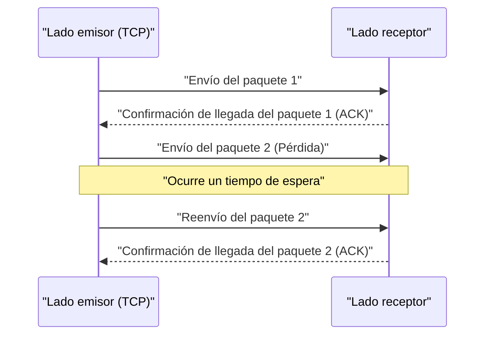

## 1. ¿Velocidad o precisión? El dilema definitivo de Internet

Cuando intercambiamos datos a través de Internet, existen principalmente dos protagonistas entre los protocolos (reglas de comunicación) que funcionan en la base (capa de transporte).
Uno es el "**TCP (Transmission Control Protocol)**", que maneja la mayor parte de las comunicaciones de Internet, como la navegación de sitios web y la descarga de archivos.
Y el otro es el "**UDP (User Datagram Protocol)**", que es el protagonista de este artículo.

Si TCP es un "repartidor cuidadoso como un correo certificado que nunca pierde un paquete", UDP es como una "máquina lanzapelotas súper rápida que lanza paquetes uno tras otro y no mira atrás aunque no lleguen".

¿Por qué necesita Internet un protocolo que "no garantice la entrega"?

## 2. Los límites de TCP: El retardo que trae consigo la "precisión"

Para comprender la necesidad de UDP, primero echemos un vistazo a cómo funciona su rival, TCP.

TCP es un protocolo "**orientado a la conexión**". Antes de enviar datos, siempre realiza una verificación previa (saludo de 3 vías) con el destinatario: "¿Puedo empezar a enviar ahora?" y "Sí, puede".
Además, cuando envía datos en pequeños fragmentos (paquetes), asigna un número secuencial a todos los paquetes y espera un acuse de recibo (ACK) del destinatario diciendo "El número 1 llegó", "El número 2 llegó". Si el paquete número 3 se pierde en la red y no llega el acuse de recibo, TCP lo detecta con un temporizador e intenta de nuevo, diciendo: "Reenviaré el número 3".

Gracias a este mecanismo, podemos ver imágenes nítidas o descargar programas sin perder ni un solo byte.
Sin embargo, este proceso de "confirmación" y "reenvío" genera un **retardo de tiempo fatal (latencia)**.

## 3. La filosofía de UDP: "No importa si no llega, envíalo ahora mismo"

En aplicaciones donde el tiempo real es extremadamente importante, como "juegos en línea (FPS y juegos de lucha)", "videollamadas como Zoom" o "transmisiones deportivas en vivo", la cortesía de TCP resulta contraproducente.

Supongamos que los datos de audio se interrumpen por un instante durante una videollamada. Si estuviéramos usando TCP, el sistema procesaría lo siguiente: "Los datos de audio de hace 0.5 segundos no han llegado, así que los reenviaré. Hasta entonces, pausaré todo el video". Como resultado, la pantalla se congelaría de forma abrupta.
Para los humanos, en una llamada en tiempo real, es mucho más importante "seguir reproduciendo el audio actual tal cual, incluso con algo de ruido", que "recibir el audio de hace 0.5 segundos con retraso pero de forma nítida".

Aquí es donde entra en juego UDP, que es de tipo "**sin conexión**".

UDP no comprueba en absoluto si la otra parte está lista para recibir. No numera los paquetes, ni verifica si han llegado, ni realiza procesos de reenvío.
Simplemente toma los datos pasados por la aplicación, les añade una cabecera (metadatos mínimos como la información de destino) y los "lanza" al mar de la red.

### La cabecera de UDP es extremadamente ligera
Mientras que la cabecera de TCP normalmente tiene 20 bytes de información de control variada, la cabecera de UDP tiene solo "**8 bytes**".
1. Número de puerto de origen (2 bytes)
2. Número de puerto de destino (2 bytes)
3. Longitud del paquete (2 bytes)
4. Suma de comprobación (2 bytes: comprobación mínima de que los datos no están corruptos)

Esta abrumadora ligereza y simplicidad de procesamiento reducen la latencia de comunicación al mínimo, haciendo posible una experiencia en tiempo real.

## 4. Dónde se destaca UDP

La característica de UDP de ser "ligero y rápido, pero poco confiable" se utiliza en todas partes en la infraestructura moderna de Internet.

* **DNS (Domain Name System)**
  Es un sistema que convierte las URL (ej. google.com) en direcciones IP. Las consultas al DNS son datos muy pequeños, y si no se recibe respuesta, basta con volver a consultar, por lo que se utiliza el veloz UDP.
* **NTP (Network Time Protocol)**
  Es la comunicación para sincronizar con precisión el reloj de las PC y los teléfonos inteligentes. Como la información de tiempo pierde sentido si se vuelve antigua, UDP es óptimo ya que evita los retardos causados por los reenvíos.
* **Transmisión de streaming y VoIP**
  Las transmisiones en vivo de YouTube, las llamadas de LINE y las llamadas de voz de Discord logran una comunicación UDP sin retardo compensando (prediciendo y rellenando) la pérdida de algunos paquetes mediante software.

## 5. Una nueva evolución: El protocolo "QUIC"

Durante muchos años, Internet se ha dividido en el "TCP preciso" y el "UDP rápido", pero en los últimos años, se ha producido una revolución que cambia esta historia.
Se trata de "**QUIC**", un protocolo desarrollado por Google que sirve de base para el actual "HTTP/3".

Google, que quería acelerar aún más la visualización de los sitios web, se dio cuenta de que "el retardo causado por el saludo inicial (handshake)" de TCP había llegado a su límite. Por lo tanto, en lugar de mejorar TCP, **¡increíblemente utilizaron UDP como base y construyeron sobre él un procedimiento de comunicación propio "rápido y preciso" controlado por software!**

Dado que QUIC está basado en UDP, puede omitir el complejo control de TCP en el kernel del sistema operativo, y al realizar el saludo de comunicación cifrada (TLS) al mismo tiempo, acortó drásticamente el tiempo hasta el inicio de la comunicación. Actualmente, cuando vemos YouTube o usamos los servicios de Google, detrás de escena no es TCP, sino QUIC basado en UDP el que transporta los datos a una velocidad explosiva.

El hecho de que el UDP, del que se decía que "no era confiable", haya logrado ascender hasta convertirse en la base de la infraestructura web más avanzada de la actualidad, demuestra cuán poderosa puede ser un arma la "ligereza y simplicidad" en el diseño de redes informáticas.
