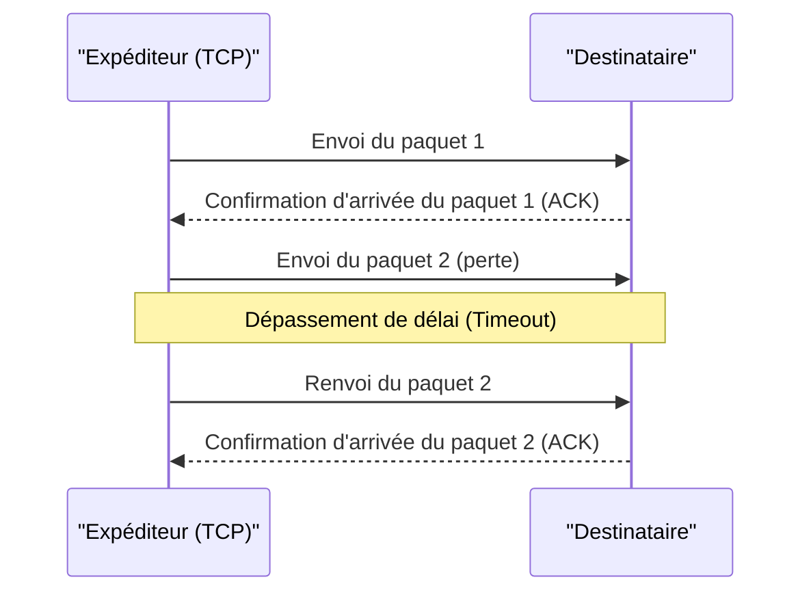

## 1. Vitesse ou précision. Le choix ultime d'Internet

Lorsque nous échangeons des données via Internet, deux acteurs majeurs se distinguent parmi les protocoles (règles de communication) fonctionnant à la base (couche transport).
L'un d'eux est le **TCP (Transmission Control Protocol)**, qui prend en charge la majeure partie des communications sur Internet, telles que la navigation sur des sites Web et le téléchargement de fichiers.
Et l'autre, qui est le sujet principal de cet article, est l'**UDP (User Datagram Protocol)**.

Si TCP est « un livreur méticuleux comme un courrier recommandé qui ne perd absolument jamais de colis », UDP est comparable à « une machine à lancer des balles ultra-rapide qui jette les colis les uns après les autres et ne regarde pas en arrière même s'ils n'arrivent pas ».

Pourquoi Internet a-t-il besoin d'un protocole sans « garantie de livraison » ?

## 2. Les limites de TCP : Le retard causé par la « précision »

Pour comprendre la nécessité d'UDP, observons d'abord le fonctionnement de son rival, TCP.

TCP est un protocole **orienté connexion**. Avant d'envoyer des données, il vérifie toujours au préalable avec le destinataire : « Puis-je envoyer maintenant ? » et attend la réponse « Oui, vous pouvez » (poignée de main à trois voies).
De plus, lors de l'envoi de données sous forme de petits morceaux (paquets), il attribue un numéro d'ordre à tous les paquets et attend un accusé de réception (ACK) de l'autre partie disant : « J'ai reçu le numéro 1 », « J'ai reçu le numéro 2 ». Si, en cours de route, le paquet numéro 3 se perd sur le réseau et qu'aucun accusé de réception n'arrive, TCP le détecte grâce à un minuteur et recommence en disant : « Je renvoie le numéro 3 ».

Grâce à ce mechanism, nous pouvons voir de belles images ou télécharger des programmes sans perdre un seul octet.
Cependant, ce processus de « confirmation » et de « renvoi » crée un **retard temporel fatal (latence)**.

## 3. La philosophie d'UDP : « Peu importe si ça n'arrive pas, envoie-le tout de suite »

Pour les applications où le temps réel est extrêmement important, telles que les « jeux en ligne (FPS ou jeux de combat) », les « appels vidéo comme Zoom » ou la « diffusion de sports en direct », la minutie de TCP devient au contraire un handicap.

Supposons qu'il y ait une brève interruption des données audio lors d'un appel vidéo. Si le système utilisait TCP, il dirait : « Les données audio d'il y a 0,5 seconde ne sont pas arrivées, je les renvoie. Je mettrai toute la vidéo en pause d'ici là. » En conséquence, l'écran se figerait de manière saccadée.
Pour les humains, lors d'un appel en temps réel, il est bien plus important de « laisser l'audio actuel continuer à jouer tel quel, même s'il y a un peu de bruit » que d'avoir « l'audio d'il y a 0,5 seconde qui arrive proprement mais en retard ».

C'est ici qu'intervient UDP, qui est de type **sans connexion**.

UDP ne vérifie absolument pas si le destinataire est prêt à recevoir. Il ne numérote pas les paquets, ne vérifie pas s'ils sont arrivés et ne les renvoie pas.
Il se contente de prendre les données fournies par l'application, d'y attacher un en-tête (une petite quantité de métadonnées comme l'information de destination), et de les « jeter » dans la mer du réseau.

### L'en-tête d'UDP est extrêmement léger
Alors que l'en-tête de TCP contient généralement 20 octets d'informations de contrôle diverses, l'en-tête d'UDP ne fait que **8 octets**.
1. Numéro de port source (2 octets)
2. Numéro de port de destination (2 octets)
3. Longueur du paquet (2 octets)
4. Somme de contrôle (2 octets : vérification minimale de l'absence de corruption des données)

Cette légèreté écrasante et cette simplicité de traitement réduisent considérablement la latence de la communication, rendant ainsi possible une expérience en temps réel.

## 4. Les domaines d'utilisation d'UDP

La caractéristique d'UDP d'être « léger et rapide, mais sans fiabilité » est utilisée partout dans l'infrastructure Internet moderne.

* **DNS (Domain Name System)**
  Il s'agit d'un système qui convertit les URL (par exemple, google.com) en adresses IP. La requête adressée au DNS représente une très petite quantité de données, et s'il n'y a pas de réponse, il suffit de refaire la requête. C'est pourquoi le protocole UDP, très rapide, est utilisé.
* **NTP (Network Time Protocol)**
  Il s'agit d'une communication destinée à régler avec précision l'horloge des PC et des smartphones. Les informations temporelles n'ayant aucun sens si elles sont obsolètes, UDP est idéal car il évite les retards dus aux renvois.
* **Diffusion en continu (Streaming) et VoIP**
  Les diffusions en direct sur YouTube, les appels LINE, les appels vocaux sur Discord, etc., réalisent des communications UDP sans délai en compensant (interpolation prédictive) par voie logicielle certaines pertes de paquets.

## 5. Une nouvelle évolution : Le protocole « QUIC »

Pendant de nombreuses années, Internet a été divisé entre un « TCP précis » et un « UDP rapide », mais ces dernières années, une révolution a eu lieu pour changer cette histoire.
Il s'agit du protocole **QUIC**, développé par Google, qui est la base de l'actuel « HTTP/3 ».

Google, souhaitant accélérer davantage l'affichage des sites Web, a réalisé que le retard causé par la « première salutation (poignée de main) » de TCP avait atteint ses limites. Ils n'ont donc pas amélioré TCP, mais **étonnamment, en se basant sur UDP, ils ont créé par-dessus une « procédure de communication rapide et précise » exclusive et contrôlée par logiciel**.

QUIC étant basé sur UDP, il peut contourner le contrôle TCP complexe du noyau de l'OS. En effectuant simultanément la poignée de main de sa propre communication chiffrée (TLS), il a considérablement réduit le temps avant le début de la communication. Actuellement, lorsque nous regardons YouTube ou utilisons les services Google, en coulisses, ce n'est pas TCP mais QUIC, basé sur UDP, qui transporte les données à une vitesse fulgurante.

Le fait qu'UDP, longtemps qualifié de « non fiable », ait été promu au rang de fondation de l'infrastructure Web moderne la plus avancée grâce à de l'ingéniosité, montre à quel point la « légèreté et la simplicité » peuvent être des armes puissantes dans la conception des réseaux informatiques.
