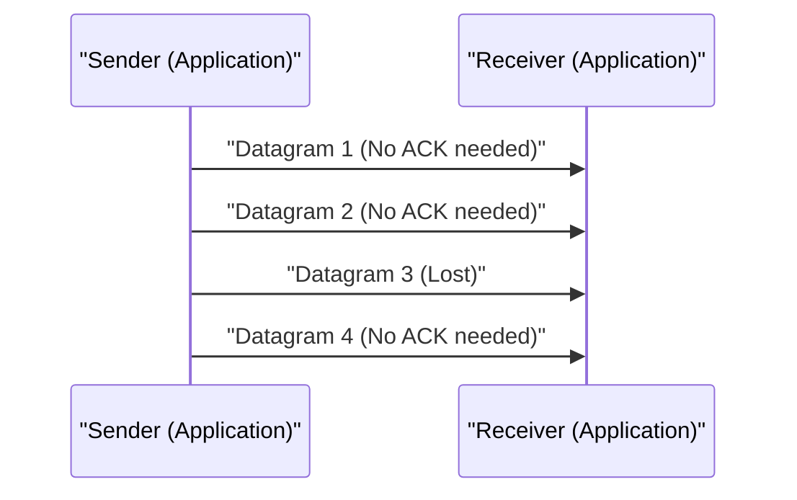

# Explication technique d'UDP

User Datagram Protocol (UDP) est l'un des membres principaux de la suite de protocoles Internet.

## La force du mode sans connexion

UDP ne procède pas à un handshake (poignée de main) comme TCP et transmet les données telles quelles. Cela permet de minimiser la latence.

## Modélisation du taux de transmission

Si le taux de perte de paquets est $p$ et le taux de transmission est $R$, le débit effectif $T$ est approximé comme suit (dans le cas d'UDP, puisqu'il n'y a pas de contrôle de retransmission, ils sont perdus tels quels).

$$ T = R 	imes (1 - p) $$
