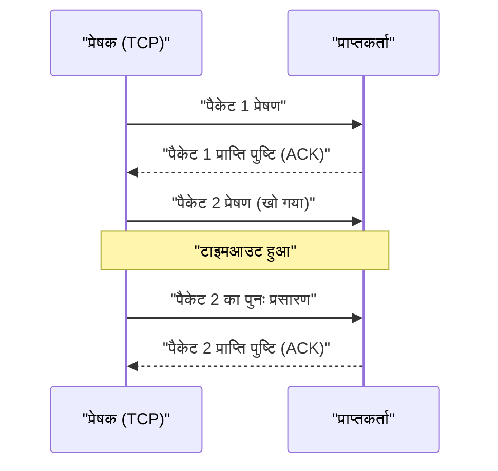

## 1. गति या सटीकता? इंटरनेट का अंतिम विकल्प

जब हम इंटरनेट के माध्यम से डेटा का आदान-प्रदान करते हैं, तो इसके आधार (ट्रांसपोर्ट लेयर) पर काम करने वाले प्रोटोकॉल (संचार नियम) में मुख्य रूप से दो प्रमुख भूमिकाएँ होती हैं।
एक है "**TCP (Transmission Control Protocol)**", जो वेबसाइट ब्राउज़ करने और फ़ाइलें डाउनलोड करने जैसे अधिकांश इंटरनेट संचार को संभालता है।
और दूसरा, जो इस लेख का मुख्य विषय है, वह है "**UDP (User Datagram Protocol)**"।

यदि TCP एक "सावधान डाकिया है जो कभी भी पैकेज नहीं खोता, बिल्कुल एक पंजीकृत डाक की तरह", तो UDP एक "अत्यंत तेज़ पिचिंग मशीन की तरह है जो एक के बाद एक पैकेज फेंकता है, और अगर वे नहीं पहुँचते हैं तो भी पीछे मुड़कर नहीं देखता"।

इंटरनेट को ऐसे प्रोटोकॉल की आवश्यकता क्यों है जिसकी "डिलीवरी की कोई गारंटी नहीं" है?

## 2. TCP की सीमाएँ: "सटीकता" के कारण होने वाली देरी

UDP की आवश्यकता को समझने के लिए, आइए पहले इसके प्रतिद्वंद्वी, TCP के काम करने के तरीके को देखें।

TCP एक "**कनेक्शन-ओरिएंटेड**" प्रोटोकॉल है। डेटा भेजने से पहले, यह हमेशा दूसरे पक्ष के साथ एक पूर्व-पुष्टि (3-वे हैंडशेक) करता है, यह पूछते हुए, "क्या मैं अभी भेज सकता हूँ?" और जवाब का इंतज़ार करता है, "हाँ, आप भेज सकते हैं।"
इसके अलावा, जब डेटा को छोटे टुकड़ों (पैकेट) में भेजा जाता है, तो सभी पैकेटों को एक क्रम संख्या दी जाती है, और यह दूसरे पक्ष से प्राप्ति की पुष्टि (ACK) की प्रतीक्षा करता है, जैसे "नंबर 1 प्राप्त हुआ" और "नंबर 2 प्राप्त हुआ"। यदि रास्ते में 3 नंबर का पैकेट नेटवर्क पर खो जाता है और कोई प्राप्ति की पुष्टि नहीं आती है, तो TCP टाइमर के माध्यम से इसका पता लगाता है, और "मैं 3 नंबर को फिर से भेजूंगा" कहकर प्रक्रिया को दोहराता है।

इस प्रणाली की बदौलत, हम बिना एक बाइट के नुकसान के साफ चित्र देख सकते हैं और प्रोग्राम डाउनलोड कर सकते हैं।
हालाँकि, यह "पुष्टि" और "पुनः प्रसारण" की प्रक्रिया **गंभीर समय की देरी (लेटेंसी)** पैदा करती है।

## 3. UDP का दर्शन: "भले ही यह न पहुँचे, इसे अभी भेजें"

जिन अनुप्रयोगों के लिए रीयल-टाइम संचार अत्यंत महत्वपूर्ण है, जैसे "ऑनलाइन गेम (FPS या फाइटिंग गेम)", "Zoom जैसे वीडियो कॉल" या "लाइव स्पोर्ट्स स्ट्रीमिंग", उनमें TCP की सावधानी वास्तव में एक बाधा बन जाती है।

मान लीजिए कि वीडियो कॉल के दौरान ऑडियो डेटा एक पल के लिए कट जाता है। यदि आप TCP का उपयोग कर रहे हैं, तो सिस्टम कहेगा, "0.5 सेकंड पहले का ऑडियो डेटा नहीं पहुँचा है, इसलिए मैं इसे फिर से भेजूंगा। तब तक, मैं पूरे वीडियो को रोक दूंगा।" परिणामस्वरूप, आपकी स्क्रीन अटक जाएगी।
मनुष्यों के लिए, रीयल-टाइम कॉल में, "थोड़े शोर के साथ वर्तमान ऑडियो को चलने देना" इस बात से कहीं अधिक महत्वपूर्ण है कि "0.5 सेकंड पहले का ऑडियो थोड़ी देरी से स्पष्ट रूप से आए।"

यहीं पर "**कनेक्शनलेस**" UDP की महत्वपूर्ण भूमिका आती है।

UDP यह जाँच नहीं करता कि दूसरा पक्ष डेटा प्राप्त करने के लिए तैयार है या नहीं। यह पैकेटों को कोई क्रम संख्या भी नहीं देता है, न ही यह जाँच करता है कि वे पहुँचे हैं या नहीं, और न ही कोई पुनः प्रसारण करता है।
यह बस एप्लिकेशन द्वारा दिए गए डेटा में एक हेडर (गंतव्य जानकारी जैसे न्यूनतम मेटाडेटा) जोड़ता है, और इसे नेटवर्क के महासागर में "फेंक" देता है।

### UDP का हेडर अत्यंत हल्का होता है
जबकि TCP के हेडर में आमतौर पर विभिन्न नियंत्रण जानकारी के 20 बाइट होते हैं, UDP का हेडर केवल "**8 बाइट**" का होता है।
1. स्रोत पोर्ट नंबर (2 बाइट)
2. गंतव्य पोर्ट नंबर (2 बाइट)
3. पैकेट की लंबाई (2 बाइट)
4. चेकसम (2 बाइट: यह सुनिश्चित करने के लिए न्यूनतम जाँच कि डेटा दूषित नहीं है)

यह अत्यधिक हल्कापन और प्रसंस्करण की सरलता संचार की लेटेंसी को न्यूनतम तक कम कर देती है, जिससे एक रीयल-टाइम अनुभव संभव हो पाता है।

## 4. UDP के उपयोग के क्षेत्र

UDP की विशेषता "हल्का और तेज़, लेकिन अविश्वसनीय" आधुनिक इंटरनेट बुनियादी ढांचे में हर जगह उपयोग की जाती है।

* **DNS (Domain Name System)**
  यह एक ऐसी प्रणाली है जो URL (जैसे: google.com) को IP पते में परिवर्तित करती है। DNS को की जाने वाली पूछताछ बहुत छोटा डेटा होता है, और यदि कोई उत्तर नहीं मिलता है, तो बस फिर से पूछना पर्याप्त होता है, इसलिए तेज़ UDP का उपयोग किया जाता है।
* **NTP (Network Time Protocol)**
  यह पीसी और स्मार्टफोन की घड़ियों को सटीक रूप से सेट करने के लिए संचार है। समय की जानकारी पुरानी होने पर बेकार हो जाती है, इसलिए UDP, जो पुनः प्रसारण के कारण होने वाली देरी से बचता है, सबसे उपयुक्त है।
* **स्ट्रीमिंग और VoIP**
  YouTube की लाइव स्ट्रीमिंग, LINE कॉल, Discord के वॉइस कॉल आदि, सॉफ़्टवेयर साइड पर कुछ छूटे हुए पैकेटों की भरपाई (भविष्यवाणी करके भरना) करते हैं, जिससे बिना किसी देरी के UDP संचार संभव हो जाता है।

## 5. एक नया विकास: "QUIC" प्रोटोकॉल

कई वर्षों तक, इंटरनेट दो हिस्सों में बंटा रहा है: "सटीक TCP" और "तेज़ UDP", लेकिन हाल के वर्षों में इस इतिहास को बदलने वाली एक क्रांति हुई है।
वह प्रोटोकॉल है "**QUIC (क्विक)**", जिसे Google द्वारा विकसित किया गया है, और जो वर्तमान "HTTP/3" का आधार है।

Google, जो वेबसाइटों के प्रदर्शन को और तेज़ करना चाहता था, ने महसूस किया कि TCP के "शुरुआती अभिवादन (हैंडशेक) में होने वाली देरी" अपनी सीमा तक पहुँच गई थी। इसलिए, उन्होंने TCP में सुधार करने के बजाय, **UDP को आधार बनाया और सॉफ़्टवेयर नियंत्रण के माध्यम से उस पर अपनी खुद की "तेज़ और सटीक संचार प्रक्रिया" बनाई**।

चूँकि QUIC UDP पर आधारित है, यह OS कर्नेल के जटिल TCP नियंत्रण को बायपास कर सकता है, और अपना खुद का एन्क्रिप्टेड संचार (TLS) हैंडशेक एक साथ करके, संचार शुरू होने तक के समय को नाटकीय रूप से कम कर देता है। वर्तमान में, जब हम YouTube देखते हैं या Google की सेवाओं का उपयोग करते हैं, तो पृष्ठभूमि में डेटा को अत्यधिक गति से ले जाने के लिए TCP का नहीं, बल्कि UDP-आधारित QUIC का उपयोग किया जा रहा है।

यह तथ्य कि UDP, जिसे हमेशा "अविश्वसनीय" कहा जाता था, अपनी सरलता और आधुनिक अनुकूलन के साथ अत्याधुनिक वेब बुनियादी ढांचे का आधार बन गया है, यह दर्शाता है कि कंप्यूटर नेटवर्क डिज़ाइन में "हल्कापन और सरलता" कितने शक्तिशाली हथियार हो सकते हैं।
