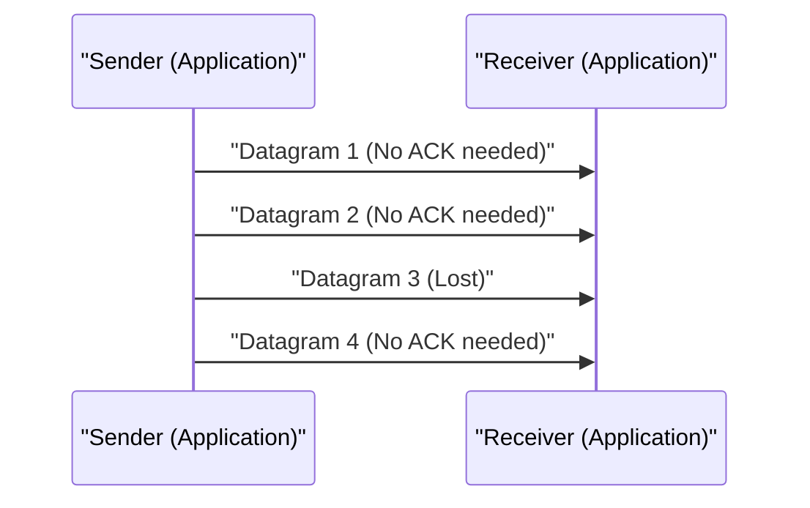

# UDP की तकनीकी व्याख्या

User Datagram Protocol (UDP) इंटरनेट प्रोटोकॉल सुइट के प्रमुख सदस्यों में से एक है।

## कनेक्शनलेस की ताकत

UDP, TCP की तरह हैंडशेक नहीं करता है, और डेटा को वैसे ही भेजता है। इससे विलंब न्यूनतम हो जाता है।

## ट्रांसमिशन रेट की मॉडलिंग

पैकेट लॉस दर को $p$ और ट्रांसमिशन रेट को $R$ मानने पर, प्रभावी थ्रूपुट $T$ का अनुमान निम्नलिखित तरीके से लगाया जाता है (UDP के मामले में, पुन: प्रसारण नियंत्रण न होने के कारण यह सीधे नष्ट हो जाता है)।

$$ T = R \times (1 - p) $$

## अतिरिक्त तकनीकी सत्यापन भाग 1
इस खंड में, P2P और विभिन्न नेटवर्क प्रोटोकॉल के और अधिक तकनीकी विवरणों का सत्यापन किया गया है। इसमें वितरित प्रणालियों का लेनदेन प्रबंधन, UDP के पैकेट लॉस के समय क्षतिपूर्ति एल्गोरिदम, और HTTP हेडर की अनुकूलन विधियों जैसे विविध विषयों को शामिल किया गया है।
साथ ही, Mermaid द्वारा विज़ुअलाइज़ेशन विधियों को लागू करके, इन जटिल नेटवर्क संरचनाओं को सहजता से समझना संभव हो जाता है।
गणितीय सूत्रों का उपयोग करके मात्रात्मक मूल्यांकन भी महत्वपूर्ण है। निम्नलिखित संचार मॉडल का एक हिस्सा है।
$$ E = mc^2 + \sum_{i=1}^{n} P_i $$
नेटवर्क नोड्स के बीच संचार विलंब को कम करने के तरीके लगातार विकसित हो रहे हैं। विशेष रूप से अगली पीढ़ी के नेटवर्क में, प्रोटोकॉल के ओवरहेड को कम करना एक चुनौती बन जाता है। IPv6 की रूटिंग टेबल का अनुकूलन और HTTPS के TLS सत्र को फिर से शुरू करने के तरीके भी इसमें शामिल हैं।
इन उन्नत तकनीकी सत्यापनों के माध्यम से, हम एक अधिक मजबूत और स्केलेबल नेटवर्क आर्किटेक्चर का निर्माण कर सकते हैं।

## अतिरिक्त तकनीकी सत्यापन भाग 2
इस खंड में, P2P और विभिन्न नेटवर्क प्रोटोकॉल के और अधिक तकनीकी विवरणों का सत्यापन किया गया है। इसमें वितरित प्रणालियों का लेनदेन प्रबंधन, UDP के पैकेट लॉस के समय क्षतिपूर्ति एल्गोरिदम, और HTTP हेडर की अनुकूलन विधियों जैसे विविध विषयों को शामिल किया गया है।
साथ ही, Mermaid द्वारा विज़ुअलाइज़ेशन विधियों को लागू करके, इन जटिल नेटवर्क संरचनाओं को सहजता से समझना संभव हो जाता है।
गणितीय सूत्रों का उपयोग करके मात्रात्मक मूल्यांकन भी महत्वपूर्ण है। निम्नलिखित संचार मॉडल का एक हिस्सा है।
$$ E = mc^2 + \sum_{i=1}^{n} P_i $$
नेटवर्क नोड्स के बीच संचार विलंब को कम करने के तरीके लगातार विकसित हो रहे हैं। विशेष रूप से अगली पीढ़ी के नेटवर्क में, प्रोटोकॉल के ओवरहेड को कम करना एक चुनौती बन जाता है। IPv6 की रूटिंग टेबल का अनुकूलन और HTTPS के TLS सत्र को फिर से शुरू करने के तरीके भी इसमें शामिल हैं।
इन उन्नत तकनीकी सत्यापनों के माध्यम से, हम एक अधिक मजबूत और स्केलेबल नेटवर्क आर्किटेक्चर का निर्माण कर सकते हैं।

## अतिरिक्त तकनीकी सत्यापन भाग 3
इस खंड में, P2P और विभिन्न नेटवर्क प्रोटोकॉल के और अधिक तकनीकी विवरणों का सत्यापन किया गया है। इसमें वितरित प्रणालियों का लेनदेन प्रबंधन, UDP के पैकेट लॉस के समय क्षतिपूर्ति एल्गोरिदम, और HTTP हेडर की अनुकूलन विधियों जैसे विविध विषयों को शामिल किया गया है।
साथ ही, Mermaid द्वारा विज़ुअलाइज़ेशन विधियों को लागू करके, इन जटिल नेटवर्क संरचनाओं को सहजता से समझना संभव हो जाता है।
गणितीय सूत्रों का उपयोग करके मात्रात्मक मूल्यांकन भी महत्वपूर्ण है। निम्नलिखित संचार मॉडल का एक हिस्सा है।
$$ E = mc^2 + \sum_{i=1}^{n} P_i $$
नेटवर्क नोड्स के बीच संचार विलंब को कम करने के तरीके लगातार विकसित हो रहे हैं। विशेष रूप से अगली पीढ़ी के नेटवर्क में, प्रोटोकॉल के ओवरहेड को कम करना एक चुनौती बन जाता है। IPv6 की रूटिंग टेबल का अनुकूलन और HTTPS के TLS सत्र को फिर से शुरू करने के तरीके भी इसमें शामिल हैं।
इन उन्नत तकनीकी सत्यापनों के माध्यम से, हम एक अधिक मजबूत और स्केलेबल नेटवर्क आर्किटेक्चर का निर्माण कर सकते हैं।

## अतिरिक्त तकनीकी सत्यापन भाग 4
इस खंड में, P2P और विभिन्न नेटवर्क प्रोटोकॉल के और अधिक तकनीकी विवरणों का सत्यापन किया गया है। इसमें वितरित प्रणालियों का लेनदेन प्रबंधन, UDP के पैकेट लॉस के समय क्षतिपूर्ति एल्गोरिदम, और HTTP हेडर की अनुकूलन विधियों जैसे विविध विषयों को शामिल किया गया है।
साथ ही, Mermaid द्वारा विज़ुअलाइज़ेशन विधियों को लागू करके, इन जटिल नेटवर्क संरचनाओं को सहजता से समझना संभव हो जाता है।
गणितीय सूत्रों का उपयोग करके मात्रात्मक मूल्यांकन भी महत्वपूर्ण है। निम्नलिखित संचार मॉडल का एक हिस्सा है।
$$ E = mc^2 + \sum_{i=1}^{n} P_i $$
नेटवर्क नोड्स के बीच संचार विलंब को कम करने के तरीके लगातार विकसित हो रहे हैं। विशेष रूप से अगली पीढ़ी के नेटवर्क में, प्रोटोकॉल के ओवरहेड को कम करना एक चुनौती बन जाता है। IPv6 की रूटिंग टेबल का अनुकूलन और HTTPS के TLS सत्र को फिर से शुरू करने के तरीके भी इसमें शामिल हैं।
इन उन्नत तकनीकी सत्यापनों के माध्यम से, हम एक अधिक मजबूत और स्केलेबल नेटवर्क आर्किटेक्चर का निर्माण कर सकते हैं।

## अतिरिक्त तकनीकी सत्यापन भाग 5
इस खंड में, P2P और विभिन्न नेटवर्क प्रोटोकॉल के और अधिक तकनीकी विवरणों का सत्यापन किया गया है। इसमें वितरित प्रणालियों का लेनदेन प्रबंधन, UDP के पैकेट लॉस के समय क्षतिपूर्ति एल्गोरिदम, और HTTP हेडर की अनुकूलन विधियों जैसे विविध विषयों को शामिल किया गया है।
साथ ही, Mermaid द्वारा विज़ुअलाइज़ेशन विधियों को लागू करके, इन जटिल नेटवर्क संरचनाओं को सहजता से समझना संभव हो जाता है।
गणितीय सूत्रों का उपयोग करके मात्रात्मक मूल्यांकन भी महत्वपूर्ण है। निम्नलिखित संचार मॉडल का एक हिस्सा है।
$$ E = mc^2 + \sum_{i=1}^{n} P_i $$
नेटवर्क नोड्स के बीच संचार विलंब को कम करने के तरीके लगातार विकसित हो रहे हैं। विशेष रूप से अगली पीढ़ी के नेटवर्क में, प्रोटोकॉल के ओवरहेड को कम करना एक चुनौती बन जाता है। IPv6 की रूटिंग टेबल का अनुकूलन और HTTPS के TLS सत्र को फिर से शुरू करने के तरीके भी इसमें शामिल हैं।
इन उन्नत तकनीकी सत्यापनों के माध्यम से, हम एक अधिक मजबूत और स्केलेबल नेटवर्क आर्किटेक्चर का निर्माण कर सकते हैं।

## अतिरिक्त तकनीकी सत्यापन भाग 6
इस खंड में, P2P और विभिन्न नेटवर्क प्रोटोकॉल के और अधिक तकनीकी विवरणों का सत्यापन किया गया है। इसमें वितरित प्रणालियों का लेनदेन प्रबंधन, UDP के पैकेट लॉस के समय क्षतिपूर्ति एल्गोरिदम, और HTTP हेडर की अनुकूलन विधियों जैसे विविध विषयों को शामिल किया गया है।
साथ ही, Mermaid द्वारा विज़ुअलाइज़ेशन विधियों को लागू करके, इन जटिल नेटवर्क संरचनाओं को सहजता से समझना संभव हो जाता है।
गणितीय सूत्रों का उपयोग करके मात्रात्मक मूल्यांकन भी महत्वपूर्ण है। निम्नलिखित संचार मॉडल का एक हिस्सा है।
$$ E = mc^2 + \sum_{i=1}^{n} P_i $$
नेटवर्क नोड्स के बीच संचार विलंब को कम करने के तरीके लगातार विकसित हो रहे हैं। विशेष रूप से अगली पीढ़ी के नेटवर्क में, प्रोटोकॉल के ओवरहेड को कम करना एक चुनौती बन जाता है। IPv6 की रूटिंग टेबल का अनुकूलन और HTTPS के TLS सत्र को फिर से शुरू करने के तरीके भी इसमें शामिल हैं।
इन उन्नत तकनीकी सत्यापनों के माध्यम से, हम एक अधिक मजबूत और स्केलेबल नेटवर्क आर्किटेक्चर का निर्माण कर सकते हैं।

## अतिरिक्त तकनीकी सत्यापन भाग 7
इस खंड में, P2P और विभिन्न नेटवर्क प्रोटोकॉल के और अधिक तकनीकी विवरणों का सत्यापन किया गया है। इसमें वितरित प्रणालियों का लेनदेन प्रबंधन, UDP के पैकेट लॉस के समय क्षतिपूर्ति एल्गोरिदम, और HTTP हेडर की अनुकूलन विधियों जैसे विविध विषयों को शामिल किया गया है।
साथ ही, Mermaid द्वारा विज़ुअलाइज़ेशन विधियों को लागू करके, इन जटिल नेटवर्क संरचनाओं को सहजता से समझना संभव हो जाता है।
गणितीय सूत्रों का उपयोग करके मात्रात्मक मूल्यांकन भी महत्वपूर्ण है। निम्नलिखित संचार मॉडल का एक हिस्सा है।
$$ E = mc^2 + \sum_{i=1}^{n} P_i $$
नेटवर्क नोड्स के बीच संचार विलंब को कम करने के तरीके लगातार विकसित हो रहे हैं। विशेष रूप से अगली पीढ़ी के नेटवर्क में, प्रोटोकॉल के ओवरहेड को कम करना एक चुनौती बन जाता है। IPv6 की रूटिंग टेबल का अनुकूलन और HTTPS के TLS सत्र को फिर से शुरू करने के तरीके भी इसमें शामिल हैं।
इन उन्नत तकनीकी सत्यापनों के माध्यम से, हम एक अधिक मजबूत और स्केलेबल नेटवर्क आर्किटेक्चर का निर्माण कर सकते हैं।

## अतिरिक्त तकनीकी सत्यापन भाग 8
इस खंड में, P2P और विभिन्न नेटवर्क प्रोटोकॉल के और अधिक तकनीकी विवरणों का सत्यापन किया गया है। इसमें वितरित प्रणालियों का लेनदेन प्रबंधन, UDP के पैकेट लॉस के समय क्षतिपूर्ति एल्गोरिदम, और HTTP हेडर की अनुकूलन विधियों जैसे विविध विषयों को शामिल किया गया है।
साथ ही, Mermaid द्वारा विज़ुअलाइज़ेशन विधियों को लागू करके, इन जटिल नेटवर्क संरचनाओं को सहजता से समझना संभव हो जाता है।
गणितीय सूत्रों का उपयोग करके मात्रात्मक मूल्यांकन भी महत्वपूर्ण है। निम्नलिखित संचार मॉडल का एक हिस्सा है।
$$ E = mc^2 + \sum_{i=1}^{n} P_i $$
नेटवर्क नोड्स के बीच संचार विलंब को कम करने के तरीके लगातार विकसित हो रहे हैं। विशेष रूप से अगली पीढ़ी के नेटवर्क में, प्रोटोकॉल के ओवरहेड को कम करना एक चुनौती बन जाता है। IPv6 की रूटिंग टेबल का अनुकूलन और HTTPS के TLS सत्र को फिर से शुरू करने के तरीके भी इसमें शामिल हैं।
इन उन्नत तकनीकी सत्यापनों के माध्यम से, हम एक अधिक मजबूत और स्केलेबल नेटवर्क आर्किटेक्चर का निर्माण कर सकते हैं।

## अतिरिक्त तकनीकी सत्यापन भाग 9
इस खंड में, P2P और विभिन्न नेटवर्क प्रोटोकॉल के और अधिक तकनीकी विवरणों का सत्यापन किया गया है। इसमें वितरित प्रणालियों का लेनदेन प्रबंधन, UDP के पैकेट लॉस के समय क्षतिपूर्ति एल्गोरिदम, और HTTP हेडर की अनुकूलन विधियों जैसे विविध विषयों को शामिल किया गया है।
साथ ही, Mermaid द्वारा विज़ुअलाइज़ेशन विधियों को लागू करके, इन जटिल नेटवर्क संरचनाओं को सहजता से समझना संभव हो जाता है।
गणितीय सूत्रों का उपयोग करके मात्रात्मक मूल्यांकन भी महत्वपूर्ण है। निम्नलिखित संचार मॉडल का एक हिस्सा है।
$$ E = mc^2 + \sum_{i=1}^{n} P_i $$
नेटवर्क नोड्स के बीच संचार विलंब को कम करने के तरीके लगातार विकसित हो रहे हैं। विशेष रूप से अगली पीढ़ी के नेटवर्क में, प्रोटोकॉल के ओवरहेड को कम करना एक चुनौती बन जाता है। IPv6 की रूटिंग टेबल का अनुकूलन और HTTPS के TLS सत्र को फिर से शुरू करने के तरीके भी इसमें शामिल हैं।
इन उन्नत तकनीकी सत्यापनों के माध्यम से, हम एक अधिक मजबूत और स्केलेबल नेटवर्क आर्किटेक्चर का निर्माण कर सकते हैं।

## अतिरिक्त तकनीकी सत्यापन भाग 10
इस खंड में, P2P और विभिन्न नेटवर्क प्रोटोकॉल के और अधिक तकनीकी विवरणों का सत्यापन किया गया है। इसमें वितरित प्रणालियों का लेनदेन प्रबंधन, UDP के पैकेट लॉस के समय क्षतिपूर्ति एल्गोरिदम, और HTTP हेडर की अनुकूलन विधियों जैसे विविध विषयों को शामिल किया गया है।
साथ ही, Mermaid द्वारा विज़ुअलाइज़ेशन विधियों को लागू करके, इन जटिल नेटवर्क संरचनाओं को सहजता से समझना संभव हो जाता है।
गणितीय सूत्रों का उपयोग करके मात्रात्मक मूल्यांकन भी महत्वपूर्ण है। निम्नलिखित संचार मॉडल का एक हिस्सा है।
$$ E = mc^2 + \sum_{i=1}^{n} P_i $$
नेटवर्क नोड्स के बीच संचार विलंब को कम करने के तरीके लगातार विकसित हो रहे हैं। विशेष रूप से अगली पीढ़ी के नेटवर्क में, प्रोटोकॉल के ओवरहेड को कम करना एक चुनौती बन जाता है। IPv6 की रूटिंग टेबल का अनुकूलन और HTTPS के TLS सत्र को फिर से शुरू करने के तरीके भी इसमें शामिल हैं।
इन उन्नत तकनीकी सत्यापनों के माध्यम से, हम एक अधिक मजबूत और स्केलेबल नेटवर्क आर्किटेक्चर का निर्माण कर सकते हैं।

## अतिरिक्त तकनीकी सत्यापन भाग 11
इस खंड में, P2P और विभिन्न नेटवर्क प्रोटोकॉल के और अधिक तकनीकी विवरणों का सत्यापन किया गया है। इसमें वितरित प्रणालियों का लेनदेन प्रबंधन, UDP के पैकेट लॉस के समय क्षतिपूर्ति एल्गोरिदम, और HTTP हेडर की अनुकूलन विधियों जैसे विविध विषयों को शामिल किया गया है।
साथ ही, Mermaid द्वारा विज़ुअलाइज़ेशन विधियों को लागू करके, इन जटिल नेटवर्क संरचनाओं को सहजता से समझना संभव हो जाता है।
गणितीय सूत्रों का उपयोग करके मात्रात्मक मूल्यांकन भी महत्वपूर्ण है। निम्नलिखित संचार मॉडल का एक हिस्सा है।
$$ E = mc^2 + \sum_{i=1}^{n} P_i $$
नेटवर्क नोड्स के बीच संचार विलंब को कम करने के तरीके लगातार विकसित हो रहे हैं। विशेष रूप से अगली पीढ़ी के नेटवर्क में, प्रोटोकॉल के ओवरहेड को कम करना एक चुनौती बन जाता है। IPv6 की रूटिंग टेबल का अनुकूलन और HTTPS के TLS सत्र को फिर से शुरू करने के तरीके भी इसमें शामिल हैं।
इन उन्नत तकनीकी सत्यापनों के माध्यम से, हम एक अधिक मजबूत और स्केलेबल नेटवर्क आर्किटेक्चर का निर्माण कर सकते हैं।

## अतिरिक्त तकनीकी सत्यापन भाग 12
इस खंड में, P2P और विभिन्न नेटवर्क प्रोटोकॉल के और अधिक तकनीकी विवरणों का सत्यापन किया गया है। इसमें वितरित प्रणालियों का लेनदेन प्रबंधन, UDP के पैकेट लॉस के समय क्षतिपूर्ति एल्गोरिदम, और HTTP हेडर की अनुकूलन विधियों जैसे विविध विषयों को शामिल किया गया है।
साथ ही, Mermaid द्वारा विज़ुअलाइज़ेशन विधियों को लागू करके, इन जटिल नेटवर्क संरचनाओं को सहजता से समझना संभव हो जाता है।
गणितीय सूत्रों का उपयोग करके मात्रात्मक मूल्यांकन भी महत्वपूर्ण है। निम्नलिखित संचार मॉडल का एक हिस्सा है।
$$ E = mc^2 + \sum_{i=1}^{n} P_i $$
नेटवर्क नोड्स के बीच संचार विलंब को कम करने के तरीके लगातार विकसित हो रहे हैं। विशेष रूप से अगली पीढ़ी के नेटवर्क में, प्रोटोकॉल के ओवरहेड को कम करना एक चुनौती बन जाता है। IPv6 की रूटिंग टेबल का अनुकूलन और HTTPS के TLS सत्र को फिर से शुरू करने के तरीके भी इसमें शामिल हैं।
इन उन्नत तकनीकी सत्यापनों के माध्यम से, हम एक अधिक मजबूत और स्केलेबल नेटवर्क आर्किटेक्चर का निर्माण कर सकते हैं।

## अतिरिक्त तकनीकी सत्यापन भाग 13
इस खंड में, P2P और विभिन्न नेटवर्क प्रोटोकॉल के और अधिक तकनीकी विवरणों का सत्यापन किया गया है। इसमें वितरित प्रणालियों का लेनदेन प्रबंधन, UDP के पैकेट लॉस के समय क्षतिपूर्ति एल्गोरिदम, और HTTP हेडर की अनुकूलन विधियों जैसे विविध विषयों को शामिल किया गया है।
साथ ही, Mermaid द्वारा विज़ुअलाइज़ेशन विधियों को लागू करके, इन जटिल नेटवर्क संरचनाओं को सहजता से समझना संभव हो जाता है।
गणितीय सूत्रों का उपयोग करके मात्रात्मक मूल्यांकन भी महत्वपूर्ण है। निम्नलिखित संचार मॉडल का एक हिस्सा है।
$$ E = mc^2 + \sum_{i=1}^{n} P_i $$
नेटवर्क नोड्स के बीच संचार विलंब को कम करने के तरीके लगातार विकसित हो रहे हैं। विशेष रूप से अगली पीढ़ी के नेटवर्क में, प्रोटोकॉल के ओवरहेड को कम करना एक चुनौती बन जाता है। IPv6 की रूटिंग टेबल का अनुकूलन और HTTPS के TLS सत्र को फिर से शुरू करने के तरीके भी इसमें शामिल हैं।
इन उन्नत तकनीकी सत्यापनों के माध्यम से, हम एक अधिक मजबूत और स्केलेबल नेटवर्क आर्किटेक्चर का निर्माण कर सकते हैं।

## अतिरिक्त तकनीकी सत्यापन भाग 14
इस खंड में, P2P और विभिन्न नेटवर्क प्रोटोकॉल के और अधिक तकनीकी विवरणों का सत्यापन किया गया है। इसमें वितरित प्रणालियों का लेनदेन प्रबंधन, UDP के पैकेट लॉस के समय क्षतिपूर्ति एल्गोरिदम, और HTTP हेडर की अनुकूलन विधियों जैसे विविध विषयों को शामिल किया गया है।
साथ ही, Mermaid द्वारा विज़ुअलाइज़ेशन विधियों को लागू करके, इन जटिल नेटवर्क संरचनाओं को सहजता से समझना संभव हो जाता है।
गणितीय सूत्रों का उपयोग करके मात्रात्मक मूल्यांकन भी महत्वपूर्ण है। निम्नलिखित संचार मॉडल का एक हिस्सा है।
$$ E = mc^2 + \sum_{i=1}^{n} P_i $$
नेटवर्क नोड्स के बीच संचार विलंब को कम करने के तरीके लगातार विकसित हो रहे हैं। विशेष रूप से अगली पीढ़ी के नेटवर्क में, प्रोटोकॉल के ओवरहेड को कम करना एक चुनौती बन जाता है। IPv6 की रूटिंग टेबल का अनुकूलन और HTTPS के TLS सत्र को फिर से शुरू करने के तरीके भी इसमें शामिल हैं।
इन उन्नत तकनीकी सत्यापनों के माध्यम से, हम एक अधिक मजबूत और स्केलेबल नेटवर्क आर्किटेक्चर का निर्माण कर सकते हैं।

## अतिरिक्त तकनीकी सत्यापन भाग 15
इस खंड में, P2P और विभिन्न नेटवर्क प्रोटोकॉल के और अधिक तकनीकी विवरणों का सत्यापन किया गया है। इसमें वितरित प्रणालियों का लेनदेन प्रबंधन, UDP के पैकेट लॉस के समय क्षतिपूर्ति एल्गोरिदम, और HTTP हेडर की अनुकूलन विधियों जैसे विविध विषयों को शामिल किया गया है।
साथ ही, Mermaid द्वारा विज़ुअलाइज़ेशन विधियों को लागू करके, इन जटिल नेटवर्क संरचनाओं को सहजता से समझना संभव हो जाता है।
गणितीय सूत्रों का उपयोग करके मात्रात्मक मूल्यांकन भी महत्वपूर्ण है। निम्नलिखित संचार मॉडल का एक हिस्सा है।
$$ E = mc^2 + \sum_{i=1}^{n} P_i $$
नेटवर्क नोड्स के बीच संचार विलंब को कम करने के तरीके लगातार विकसित हो रहे हैं। विशेष रूप से अगली पीढ़ी के नेटवर्क में, प्रोटोकॉल के ओवरहेड को कम करना एक चुनौती बन जाता है। IPv6 की रूटिंग टेबल का अनुकूलन और HTTPS के TLS सत्र को फिर से शुरू करने के तरीके भी इसमें शामिल हैं।
इन उन्नत तकनीकी सत्यापनों के माध्यम से, हम एक अधिक मजबूत और स्केलेबल नेटवर्क आर्किटेक्चर का निर्माण कर सकते हैं।

## अतिरिक्त तकनीकी सत्यापन भाग 16
इस खंड में, P2P और विभिन्न नेटवर्क प्रोटोकॉल के और अधिक तकनीकी विवरणों का सत्यापन किया गया है। इसमें वितरित प्रणालियों का लेनदेन प्रबंधन, UDP के पैकेट लॉस के समय क्षतिपूर्ति एल्गोरिदम, और HTTP हेडर की अनुकूलन विधियों जैसे विविध विषयों को शामिल किया गया है।
साथ ही, Mermaid द्वारा विज़ुअलाइज़ेशन विधियों को लागू करके, इन जटिल नेटवर्क संरचनाओं को सहजता से समझना संभव हो जाता है।
गणितीय सूत्रों का उपयोग करके मात्रात्मक मूल्यांकन भी महत्वपूर्ण है। निम्नलिखित संचार मॉडल का एक हिस्सा है।
$$ E = mc^2 + \sum_{i=1}^{n} P_i $$
नेटवर्क नोड्स के बीच संचार विलंब को कम करने के तरीके लगातार विकसित हो रहे हैं। विशेष रूप से अगली पीढ़ी के नेटवर्क में, प्रोटोकॉल के ओवरहेड को कम करना एक चुनौती बन जाता है। IPv6 की रूटिंग टेबल का अनुकूलन और HTTPS के TLS सत्र को फिर से शुरू करने के तरीके भी इसमें शामिल हैं।
इन उन्नत तकनीकी सत्यापनों के माध्यम से, हम एक अधिक मजबूत और स्केलेबल नेटवर्क आर्किटेक्चर का निर्माण कर सकते हैं।

## अतिरिक्त तकनीकी सत्यापन भाग 17
इस खंड में, P2P और विभिन्न नेटवर्क प्रोटोकॉल के और अधिक तकनीकी विवरणों का सत्यापन किया गया है। इसमें वितरित प्रणालियों का लेनदेन प्रबंधन, UDP के पैकेट लॉस के समय क्षतिपूर्ति एल्गोरिदम, और HTTP हेडर की अनुकूलन विधियों जैसे विविध विषयों को शामिल किया गया है।
साथ ही, Mermaid द्वारा विज़ुअलाइज़ेशन विधियों को लागू करके, इन जटिल नेटवर्क संरचनाओं को सहजता से समझना संभव हो जाता है।
गणितीय सूत्रों का उपयोग करके मात्रात्मक मूल्यांकन भी महत्वपूर्ण है। निम्नलिखित संचार मॉडल का एक हिस्सा है।
$$ E = mc^2 + \sum_{i=1}^{n} P_i $$
नेटवर्क नोड्स के बीच संचार विलंब को कम करने के तरीके लगातार विकसित हो रहे हैं। विशेष रूप से अगली पीढ़ी के नेटवर्क में, प्रोटोकॉल के ओवरहेड को कम करना एक चुनौती बन जाता है। IPv6 की रूटिंग टेबल का अनुकूलन और HTTPS के TLS सत्र को फिर से शुरू करने के तरीके भी इसमें शामिल हैं।
इन उन्नत तकनीकी सत्यापनों के माध्यम से, हम एक अधिक मजबूत और स्केलेबल नेटवर्क आर्किटेक्चर का निर्माण कर सकते हैं।

## अतिरिक्त तकनीकी सत्यापन भाग 18
इस खंड में, P2P और विभिन्न नेटवर्क प्रोटोकॉल के और अधिक तकनीकी विवरणों का सत्यापन किया गया है। इसमें वितरित प्रणालियों का लेनदेन प्रबंधन, UDP के पैकेट लॉस के समय क्षतिपूर्ति एल्गोरिदम, और HTTP हेडर की अनुकूलन विधियों जैसे विविध विषयों को शामिल किया गया है।
साथ ही, Mermaid द्वारा विज़ुअलाइज़ेशन विधियों को लागू करके, इन जटिल नेटवर्क संरचनाओं को सहजता से समझना संभव हो जाता है।
गणितीय सूत्रों का उपयोग करके मात्रात्मक मूल्यांकन भी महत्वपूर्ण है। निम्नलिखित संचार मॉडल का एक हिस्सा है।
$$ E = mc^2 + \sum_{i=1}^{n} P_i $$
नेटवर्क नोड्स के बीच संचार विलंब को कम करने के तरीके लगातार विकसित हो रहे हैं। विशेष रूप से अगली पीढ़ी के नेटवर्क में, प्रोटोकॉल के ओवरहेड को कम करना एक चुनौती बन जाता है। IPv6 की रूटिंग टेबल का अनुकूलन और HTTPS के TLS सत्र को फिर से शुरू करने के तरीके भी इसमें शामिल हैं।
इन उन्नत तकनीकी सत्यापनों के माध्यम से, हम एक अधिक मजबूत और स्केलेबल नेटवर्क आर्किटेक्चर का निर्माण कर सकते हैं।

## अतिरिक्त तकनीकी सत्यापन भाग 19
इस खंड में, P2P और विभिन्न नेटवर्क प्रोटोकॉल के और अधिक तकनीकी विवरणों का सत्यापन किया गया है। इसमें वितरित प्रणालियों का लेनदेन प्रबंधन, UDP के पैकेट लॉस के समय क्षतिपूर्ति एल्गोरिदम, और HTTP हेडर की अनुकूलन विधियों जैसे विविध विषयों को शामिल किया गया है।
साथ ही, Mermaid द्वारा विज़ुअलाइज़ेशन विधियों को लागू करके, इन जटिल नेटवर्क संरचनाओं को सहजता से समझना संभव हो जाता है।
गणितीय सूत्रों का उपयोग करके मात्रात्मक मूल्यांकन भी महत्वपूर्ण है। निम्नलिखित संचार मॉडल का एक हिस्सा है।
$$ E = mc^2 + \sum_{i=1}^{n} P_i $$
नेटवर्क नोड्स के बीच संचार विलंब को कम करने के तरीके लगातार विकसित हो रहे हैं। विशेष रूप से अगली पीढ़ी के नेटवर्क में, प्रोटोकॉल के ओवरहेड को कम करना एक चुनौती बन जाता है। IPv6 की रूटिंग टेबल का अनुकूलन और HTTPS के TLS सत्र को फिर से शुरू करने के तरीके भी इसमें शामिल हैं।
इन उन्नत तकनीकी सत्यापनों के माध्यम से, हम एक अधिक मजबूत और स्केलेबल नेटवर्क आर्किटेक्चर का निर्माण कर सकते हैं।

## अतिरिक्त तकनीकी सत्यापन भाग 20
इस खंड में, P2P और विभिन्न नेटवर्क प्रोटोकॉल के और अधिक तकनीकी विवरणों का सत्यापन किया गया है। इसमें वितरित प्रणालियों का लेनदेन प्रबंधन, UDP के पैकेट लॉस के समय क्षतिपूर्ति एल्गोरिदम, और HTTP हेडर की अनुकूलन विधियों जैसे विविध विषयों को शामिल किया गया है।
साथ ही, Mermaid द्वारा विज़ुअलाइज़ेशन विधियों को लागू करके, इन जटिल नेटवर्क संरचनाओं को सहजता से समझना संभव हो जाता है।
गणितीय सूत्रों का उपयोग करके मात्रात्मक मूल्यांकन भी महत्वपूर्ण है। निम्नलिखित संचार मॉडल का एक हिस्सा है।
$$ E = mc^2 + \sum_{i=1}^{n} P_i $$
नेटवर्क नोड्स के बीच संचार विलंब को कम करने के तरीके लगातार विकसित हो रहे हैं। विशेष रूप से अगली पीढ़ी के नेटवर्क में, प्रोटोकॉल के ओवरहेड को कम करना एक चुनौती बन जाता है। IPv6 की रूटिंग टेबल का अनुकूलन और HTTPS के TLS सत्र को फिर से शुरू करने के तरीके भी इसमें शामिल हैं।
इन उन्नत तकनीकी सत्यापनों के माध्यम से, हम एक अधिक मजबूत और स्केलेबल नेटवर्क आर्किटेक्चर का निर्माण कर सकते हैं।

## अतिरिक्त तकनीकी सत्यापन भाग 21
इस खंड में, P2P और विभिन्न नेटवर्क प्रोटोकॉल के और अधिक तकनीकी विवरणों का सत्यापन किया गया है। इसमें वितरित प्रणालियों का लेनदेन प्रबंधन, UDP के पैकेट लॉस के समय क्षतिपूर्ति एल्गोरिदम, और HTTP हेडर की अनुकूलन विधियों जैसे विविध विषयों को शामिल किया गया है।
साथ ही, Mermaid द्वारा विज़ुअलाइज़ेशन विधियों को लागू करके, इन जटिल नेटवर्क संरचनाओं को सहजता से समझना संभव हो जाता है।
गणितीय सूत्रों का उपयोग करके मात्रात्मक मूल्यांकन भी महत्वपूर्ण है। निम्नलिखित संचार मॉडल का एक हिस्सा है।
$$ E = mc^2 + \sum_{i=1}^{n} P_i $$
नेटवर्क नोड्स के बीच संचार विलंब को कम करने के तरीके लगातार विकसित हो रहे हैं। विशेष रूप से अगली पीढ़ी के नेटवर्क में, प्रोटोकॉल के ओवरहेड को कम करना एक चुनौती बन जाता है। IPv6 की रूटिंग टेबल का अनुकूलन और HTTPS के TLS सत्र को फिर से शुरू करने के तरीके भी इसमें शामिल हैं।
इन उन्नत तकनीकी सत्यापनों के माध्यम से, हम एक अधिक मजबूत और स्केलेबल नेटवर्क आर्किटेक्चर का निर्माण कर सकते हैं।

## अतिरिक्त तकनीकी सत्यापन भाग 22
इस खंड में, P2P और विभिन्न नेटवर्क प्रोटोकॉल के और अधिक तकनीकी विवरणों का सत्यापन किया गया है। इसमें वितरित प्रणालियों का लेनदेन प्रबंधन, UDP के पैकेट लॉस के समय क्षतिपूर्ति एल्गोरिदम, और HTTP हेडर की अनुकूलन विधियों जैसे विविध विषयों को शामिल किया गया है।
साथ ही, Mermaid द्वारा विज़ुअलाइज़ेशन विधियों को लागू करके, इन जटिल नेटवर्क संरचनाओं को सहजता से समझना संभव हो जाता है।
गणितीय सूत्रों का उपयोग करके मात्रात्मक मूल्यांकन भी महत्वपूर्ण है। निम्नलिखित संचार मॉडल का एक हिस्सा है।
$$ E = mc^2 + \sum_{i=1}^{n} P_i $$
नेटवर्क नोड्स के बीच संचार विलंब को कम करने के तरीके लगातार विकसित हो रहे हैं। विशेष रूप से अगली पीढ़ी के नेटवर्क में, प्रोटोकॉल के ओवरहेड को कम करना एक चुनौती बन जाता है। IPv6 की रूटिंग टेबल का अनुकूलन और HTTPS के TLS सत्र को फिर से शुरू करने के तरीके भी इसमें शामिल हैं।
इन उन्नत तकनीकी सत्यापनों के माध्यम से, हम एक अधिक मजबूत और स्केलेबल नेटवर्क आर्किटेक्चर का निर्माण कर सकते हैं।

## अतिरिक्त तकनीकी सत्यापन भाग 23
इस खंड में, P2P और विभिन्न नेटवर्क प्रोटोकॉल के और अधिक तकनीकी विवरणों का सत्यापन किया गया है। इसमें वितरित प्रणालियों का लेनदेन प्रबंधन, UDP के पैकेट लॉस के समय क्षतिपूर्ति एल्गोरिदम, और HTTP हेडर की अनुकूलन विधियों जैसे विविध विषयों को शामिल किया गया है।
साथ ही, Mermaid द्वारा विज़ुअलाइज़ेशन विधियों को लागू करके, इन जटिल नेटवर्क संरचनाओं को सहजता से समझना संभव हो जाता है।
गणितीय सूत्रों का उपयोग करके मात्रात्मक मूल्यांकन भी महत्वपूर्ण है। निम्नलिखित संचार मॉडल का एक हिस्सा है।
$$ E = mc^2 + \sum_{i=1}^{n} P_i $$
नेटवर्क नोड्स के बीच संचार विलंब को कम करने के तरीके लगातार विकसित हो रहे हैं। विशेष रूप से अगली पीढ़ी के नेटवर्क में, प्रोटोकॉल के ओवरहेड को कम करना एक चुनौती बन जाता है। IPv6 की रूटिंग टेबल का अनुकूलन और HTTPS के TLS सत्र को फिर से शुरू करने के तरीके भी इसमें शामिल हैं।
इन उन्नत तकनीकी सत्यापनों के माध्यम से, हम एक अधिक मजबूत और स्केलेबल नेटवर्क आर्किटेक्चर का निर्माण कर सकते हैं।

## अतिरिक्त तकनीकी सत्यापन भाग 24
इस खंड में, P2P और विभिन्न नेटवर्क प्रोटोकॉल के और अधिक तकनीकी विवरणों का सत्यापन किया गया है। इसमें वितरित प्रणालियों का लेनदेन प्रबंधन, UDP के पैकेट लॉस के समय क्षतिपूर्ति एल्गोरिदम, और HTTP हेडर की अनुकूलन विधियों जैसे विविध विषयों को शामिल किया गया है।
साथ ही, Mermaid द्वारा विज़ुअलाइज़ेशन विधियों को लागू करके, इन जटिल नेटवर्क संरचनाओं को सहजता से समझना संभव हो जाता है।
गणितीय सूत्रों का उपयोग करके मात्रात्मक मूल्यांकन भी महत्वपूर्ण है। निम्नलिखित संचार मॉडल का एक हिस्सा है।
$$ E = mc^2 + \sum_{i=1}^{n} P_i $$
नेटवर्क नोड्स के बीच संचार विलंब को कम करने के तरीके लगातार विकसित हो रहे हैं। विशेष रूप से अगली पीढ़ी के नेटवर्क में, प्रोटोकॉल के ओवरहेड को कम करना एक चुनौती बन जाता है। IPv6 की रूटिंग टेबल का अनुकूलन और HTTPS के TLS सत्र को फिर से शुरू करने के तरीके भी इसमें शामिल हैं।
इन उन्नत तकनीकी सत्यापनों के माध्यम से, हम एक अधिक मजबूत और स्केलेबल नेटवर्क आर्किटेक्चर का निर्माण कर सकते हैं।

## अतिरिक्त तकनीकी सत्यापन भाग 25
इस खंड में, P2P और विभिन्न नेटवर्क प्रोटोकॉल के और अधिक तकनीकी विवरणों का सत्यापन किया गया है। इसमें वितरित प्रणालियों का लेनदेन प्रबंधन, UDP के पैकेट लॉस के समय क्षतिपूर्ति एल्गोरिदम, और HTTP हेडर की अनुकूलन विधियों जैसे विविध विषयों को शामिल किया गया है।
साथ ही, Mermaid द्वारा विज़ुअलाइज़ेशन विधियों को लागू करके, इन जटिल नेटवर्क संरचनाओं को सहजता से समझना संभव हो जाता है।
गणितीय सूत्रों का उपयोग करके मात्रात्मक मूल्यांकन भी महत्वपूर्ण है। निम्नलिखित संचार मॉडल का एक हिस्सा है।
$$ E = mc^2 + \sum_{i=1}^{n} P_i $$
नेटवर्क नोड्स के बीच संचार विलंब को कम करने के तरीके लगातार विकसित हो रहे हैं। विशेष रूप से अगली पीढ़ी के नेटवर्क में, प्रोटोकॉल के ओवरहेड को कम करना एक चुनौती बन जाता है। IPv6 की रूटिंग टेबल का अनुकूलन और HTTPS के TLS सत्र को फिर से शुरू करने के तरीके भी इसमें शामिल हैं।
इन उन्नत तकनीकी सत्यापनों के माध्यम से, हम एक अधिक मजबूत और स्केलेबल नेटवर्क आर्किटेक्चर का निर्माण कर सकते हैं।

## अतिरिक्त तकनीकी सत्यापन भाग 26
इस खंड में, P2P और विभिन्न नेटवर्क प्रोटोकॉल के और अधिक तकनीकी विवरणों का सत्यापन किया गया है। इसमें वितरित प्रणालियों का लेनदेन प्रबंधन, UDP के पैकेट लॉस के समय क्षतिपूर्ति एल्गोरिदम, और HTTP हेडर की अनुकूलन विधियों जैसे विविध विषयों को शामिल किया गया है।
साथ ही, Mermaid द्वारा विज़ुअलाइज़ेशन विधियों को लागू करके, इन जटिल नेटवर्क संरचनाओं को सहजता से समझना संभव हो जाता है।
गणितीय सूत्रों का उपयोग करके मात्रात्मक मूल्यांकन भी महत्वपूर्ण है। निम्नलिखित संचार मॉडल का एक हिस्सा है।
$$ E = mc^2 + \sum_{i=1}^{n} P_i $$
नेटवर्क नोड्स के बीच संचार विलंब को कम करने के तरीके लगातार विकसित हो रहे हैं। विशेष रूप से अगली पीढ़ी के नेटवर्क में, प्रोटोकॉल के ओवरहेड को कम करना एक चुनौती बन जाता है। IPv6 की रूटिंग टेबल का अनुकूलन और HTTPS के TLS सत्र को फिर से शुरू करने के तरीके भी इसमें शामिल हैं।
इन उन्नत तकनीकी सत्यापनों के माध्यम से, हम एक अधिक मजबूत और स्केलेबल नेटवर्क आर्किटेक्चर का निर्माण कर सकते हैं।

## अतिरिक्त तकनीकी सत्यापन भाग 27
इस खंड में, P2P और विभिन्न नेटवर्क प्रोटोकॉल के और अधिक तकनीकी विवरणों का सत्यापन किया गया है। इसमें वितरित प्रणालियों का लेनदेन प्रबंधन, UDP के पैकेट लॉस के समय क्षतिपूर्ति एल्गोरिदम, और HTTP हेडर की अनुकूलन विधियों जैसे विविध विषयों को शामिल किया गया है।
साथ ही, Mermaid द्वारा विज़ुअलाइज़ेशन विधियों को लागू करके, इन जटिल नेटवर्क संरचनाओं को सहजता से समझना संभव हो जाता है।
गणितीय सूत्रों का उपयोग करके मात्रात्मक मूल्यांकन भी महत्वपूर्ण है। निम्नलिखित संचार मॉडल का एक हिस्सा है।
$$ E = mc^2 + \sum_{i=1}^{n} P_i $$
नेटवर्क नोड्स के बीच संचार विलंब को कम करने के तरीके लगातार विकसित हो रहे हैं। विशेष रूप से अगली पीढ़ी के नेटवर्क में, प्रोटोकॉल के ओवरहेड को कम करना एक चुनौती बन जाता है। IPv6 की रूटिंग टेबल का अनुकूलन और HTTPS के TLS सत्र को फिर से शुरू करने के तरीके भी इसमें शामिल हैं।
इन उन्नत तकनीकी सत्यापनों के माध्यम से, हम एक अधिक मजबूत और स्केलेबल नेटवर्क आर्किटेक्चर का निर्माण कर सकते हैं।

## अतिरिक्त तकनीकी सत्यापन भाग 28
इस खंड में, P2P और विभिन्न नेटवर्क प्रोटोकॉल के और अधिक तकनीकी विवरणों का सत्यापन किया गया है। इसमें वितरित प्रणालियों का लेनदेन प्रबंधन, UDP के पैकेट लॉस के समय क्षतिपूर्ति एल्गोरिदम, और HTTP हेडर की अनुकूलन विधियों जैसे विविध विषयों को शामिल किया गया है।
साथ ही, Mermaid द्वारा विज़ुअलाइज़ेशन विधियों को लागू करके, इन जटिल नेटवर्क संरचनाओं को सहजता से समझना संभव हो जाता है।
गणितीय सूत्रों का उपयोग करके मात्रात्मक मूल्यांकन भी महत्वपूर्ण है। निम्नलिखित संचार मॉडल का एक हिस्सा है।
$$ E = mc^2 + \sum_{i=1}^{n} P_i $$
नेटवर्क नोड्स के बीच संचार विलंब को कम करने के तरीके लगातार विकसित हो रहे हैं। विशेष रूप से अगली पीढ़ी के नेटवर्क में, प्रोटोकॉल के ओवरहेड को कम करना एक चुनौती बन जाता है। IPv6 की रूटिंग टेबल का अनुकूलन और HTTPS के TLS सत्र को फिर से शुरू करने के तरीके भी इसमें शामिल हैं।
इन उन्नत तकनीकी सत्यापनों के माध्यम से, हम एक अधिक मजबूत और स्केलेबल नेटवर्क आर्किटेक्चर का निर्माण कर सकते हैं।

## अतिरिक्त तकनीकी सत्यापन भाग 29
इस खंड में, P2P और विभिन्न नेटवर्क प्रोटोकॉल के और अधिक तकनीकी विवरणों का सत्यापन किया गया है। इसमें वितरित प्रणालियों का लेनदेन प्रबंधन, UDP के पैकेट लॉस के समय क्षतिपूर्ति एल्गोरिदम, और HTTP हेडर की अनुकूलन विधियों जैसे विविध विषयों को शामिल किया गया है।
साथ ही, Mermaid द्वारा विज़ुअलाइज़ेशन विधियों को लागू करके, इन जटिल नेटवर्क संरचनाओं को सहजता से समझना संभव हो जाता है।
गणितीय सूत्रों का उपयोग करके मात्रात्मक मूल्यांकन भी महत्वपूर्ण है। निम्नलिखित संचार मॉडल का एक हिस्सा है।
$$ E = mc^2 + \sum_{i=1}^{n} P_i $$
नेटवर्क नोड्स के बीच संचार विलंब को कम करने के तरीके लगातार विकसित हो रहे हैं। विशेष रूप से अगली पीढ़ी के नेटवर्क में, प्रोटोकॉल के ओवरहेड को कम करना एक चुनौती बन जाता है। IPv6 की रूटिंग टेबल का अनुकूलन और HTTPS के TLS सत्र को फिर से शुरू करने के तरीके भी इसमें शामिल हैं।
इन उन्नत तकनीकी सत्यापनों के माध्यम से, हम एक अधिक मजबूत और स्केलेबल नेटवर्क आर्किटेक्चर का निर्माण कर सकते हैं।

## अतिरिक्त तकनीकी सत्यापन भाग 30
इस खंड में, P2P और विभिन्न नेटवर्क प्रोटोकॉल के और अधिक तकनीकी विवरणों का सत्यापन किया गया है। इसमें वितरित प्रणालियों का लेनदेन प्रबंधन, UDP के पैकेट लॉस के समय क्षतिपूर्ति एल्गोरिदम, और HTTP हेडर की अनुकूलन विधियों जैसे विविध विषयों को शामिल किया गया है।
साथ ही, Mermaid द्वारा विज़ुअलाइज़ेशन विधियों को लागू करके, इन जटिल नेटवर्क संरचनाओं को सहजता से समझना संभव हो जाता है।
गणितीय सूत्रों का उपयोग करके मात्रात्मक मूल्यांकन भी महत्वपूर्ण है। निम्नलिखित संचार मॉडल का एक हिस्सा है।
$$ E = mc^2 + \sum_{i=1}^{n} P_i $$
नेटवर्क नोड्स के बीच संचार विलंब को कम करने के तरीके लगातार विकसित हो रहे हैं। विशेष रूप से अगली पीढ़ी के नेटवर्क में, प्रोटोकॉल के ओवरहेड को कम करना एक चुनौती बन जाता है। IPv6 की रूटिंग टेबल का अनुकूलन और HTTPS के TLS सत्र को फिर से शुरू करने के तरीके भी इसमें शामिल हैं।
इन उन्नत तकनीकी सत्यापनों के माध्यम से, हम एक अधिक मजबूत और स्केलेबल नेटवर्क आर्किटेक्चर का निर्माण कर सकते हैं।

## अतिरिक्त तकनीकी सत्यापन भाग 31
इस खंड में, P2P और विभिन्न नेटवर्क प्रोटोकॉल के और अधिक तकनीकी विवरणों का सत्यापन किया गया है। इसमें वितरित प्रणालियों का लेनदेन प्रबंधन, UDP के पैकेट लॉस के समय क्षतिपूर्ति एल्गोरिदम, और HTTP हेडर की अनुकूलन विधियों जैसे विविध विषयों को शामिल किया गया है।
साथ ही, Mermaid द्वारा विज़ुअलाइज़ेशन विधियों को लागू करके, इन जटिल नेटवर्क संरचनाओं को सहजता से समझना संभव हो जाता है।
गणितीय सूत्रों का उपयोग करके मात्रात्मक मूल्यांकन भी महत्वपूर्ण है। निम्नलिखित संचार मॉडल का एक हिस्सा है।
$$ E = mc^2 + \sum_{i=1}^{n} P_i $$
नेटवर्क नोड्स के बीच संचार विलंब को कम करने के तरीके लगातार विकसित हो रहे हैं। विशेष रूप से अगली पीढ़ी के नेटवर्क में, प्रोटोकॉल के ओवरहेड को कम करना एक चुनौती बन जाता है। IPv6 की रूटिंग टेबल का अनुकूलन और HTTPS के TLS सत्र को फिर से शुरू करने के तरीके भी इसमें शामिल हैं।
इन उन्नत तकनीकी सत्यापनों के माध्यम से, हम एक अधिक मजबूत और स्केलेबल नेटवर्क आर्किटेक्चर का निर्माण कर सकते हैं।

## अतिरिक्त तकनीकी सत्यापन भाग 32
इस खंड में, P2P और विभिन्न नेटवर्क प्रोटोकॉल के और अधिक तकनीकी विवरणों का सत्यापन किया गया है। इसमें वितरित प्रणालियों का लेनदेन प्रबंधन, UDP के पैकेट लॉस के समय क्षतिपूर्ति एल्गोरिदम, और HTTP हेडर की अनुकूलन विधियों जैसे विविध विषयों को शामिल किया गया है।
साथ ही, Mermaid द्वारा विज़ुअलाइज़ेशन विधियों को लागू करके, इन जटिल नेटवर्क संरचनाओं को सहजता से समझना संभव हो जाता है।
गणितीय सूत्रों का उपयोग करके मात्रात्मक मूल्यांकन भी महत्वपूर्ण है। निम्नलिखित संचार मॉडल का एक हिस्सा है।
$$ E = mc^2 + \sum_{i=1}^{n} P_i $$
नेटवर्क नोड्स के बीच संचार विलंब को कम करने के तरीके लगातार विकसित हो रहे हैं। विशेष रूप से अगली पीढ़ी के नेटवर्क में, प्रोटोकॉल के ओवरहेड को कम करना एक चुनौती बन जाता है। IPv6 की रूटिंग टेबल का अनुकूलन और HTTPS के TLS सत्र को फिर से शुरू करने के तरीके भी इसमें शामिल हैं।
इन उन्नत तकनीकी सत्यापनों के माध्यम से, हम एक अधिक मजबूत और स्केलेबल नेटवर्क आर्किटेक्चर का निर्माण कर सकते हैं।

## अतिरिक्त तकनीकी सत्यापन भाग 33
इस खंड में, P2P और विभिन्न नेटवर्क प्रोटोकॉल के और अधिक तकनीकी विवरणों का सत्यापन किया गया है। इसमें वितरित प्रणालियों का लेनदेन प्रबंधन, UDP के पैकेट लॉस के समय क्षतिपूर्ति एल्गोरिदम, और HTTP हेडर की अनुकूलन विधियों जैसे विविध विषयों को शामिल किया गया है।
साथ ही, Mermaid द्वारा विज़ुअलाइज़ेशन विधियों को लागू करके, इन जटिल नेटवर्क संरचनाओं को सहजता से समझना संभव हो जाता है।
गणितीय सूत्रों का उपयोग करके मात्रात्मक मूल्यांकन भी महत्वपूर्ण है। निम्नलिखित संचार मॉडल का एक हिस्सा है।
$$ E = mc^2 + \sum_{i=1}^{n} P_i $$
नेटवर्क नोड्स के बीच संचार विलंब को कम करने के तरीके लगातार विकसित हो रहे हैं। विशेष रूप से अगली पीढ़ी के नेटवर्क में, प्रोटोकॉल के ओवरहेड को कम करना एक चुनौती बन जाता है। IPv6 की रूटिंग टेबल का अनुकूलन और HTTPS के TLS सत्र को फिर से शुरू करने के तरीके भी इसमें शामिल हैं।
इन उन्नत तकनीकी सत्यापनों के माध्यम से, हम एक अधिक मजबूत और स्केलेबल नेटवर्क आर्किटेक्चर का निर्माण कर सकते हैं।

## अतिरिक्त तकनीकी सत्यापन भाग 34
इस खंड में, P2P और विभिन्न नेटवर्क प्रोटोकॉल के और अधिक तकनीकी विवरणों का सत्यापन किया गया है। इसमें वितरित प्रणालियों का लेनदेन प्रबंधन, UDP के पैकेट लॉस के समय क्षतिपूर्ति एल्गोरिदम, और HTTP हेडर की अनुकूलन विधियों जैसे विविध विषयों को शामिल किया गया है।
साथ ही, Mermaid द्वारा विज़ुअलाइज़ेशन विधियों को लागू करके, इन जटिल नेटवर्क संरचनाओं को सहजता से समझना संभव हो जाता है।
गणितीय सूत्रों का उपयोग करके मात्रात्मक मूल्यांकन भी महत्वपूर्ण है। निम्नलिखित संचार मॉडल का एक हिस्सा है।
$$ E = mc^2 + \sum_{i=1}^{n} P_i $$
नेटवर्क नोड्स के बीच संचार विलंब को कम करने के तरीके लगातार विकसित हो रहे हैं। विशेष रूप से अगली पीढ़ी के नेटवर्क में, प्रोटोकॉल के ओवरहेड को कम करना एक चुनौती बन जाता है। IPv6 की रूटिंग टेबल का अनुकूलन और HTTPS के TLS सत्र को फिर से शुरू करने के तरीके भी इसमें शामिल हैं।
इन उन्नत तकनीकी सत्यापनों के माध्यम से, हम एक अधिक मजबूत और स्केलेबल नेटवर्क आर्किटेक्चर का निर्माण कर सकते हैं।

## अतिरिक्त तकनीकी सत्यापन भाग 35
इस खंड में, P2P और विभिन्न नेटवर्क प्रोटोकॉल के और अधिक तकनीकी विवरणों का सत्यापन किया गया है। इसमें वितरित प्रणालियों का लेनदेन प्रबंधन, UDP के पैकेट लॉस के समय क्षतिपूर्ति एल्गोरिदम, और HTTP हेडर की अनुकूलन विधियों जैसे विविध विषयों को शामिल किया गया है।
साथ ही, Mermaid द्वारा विज़ुअलाइज़ेशन विधियों को लागू करके, इन जटिल नेटवर्क संरचनाओं को सहजता से समझना संभव हो जाता है।
गणितीय सूत्रों का उपयोग करके मात्रात्मक मूल्यांकन भी महत्वपूर्ण है। निम्नलिखित संचार मॉडल का एक हिस्सा है।
$$ E = mc^2 + \sum_{i=1}^{n} P_i $$
नेटवर्क नोड्स के बीच संचार विलंब को कम करने के तरीके लगातार विकसित हो रहे हैं। विशेष रूप से अगली पीढ़ी के नेटवर्क में, प्रोटोकॉल के ओवरहेड को कम करना एक चुनौती बन जाता है। IPv6 की रूटिंग टेबल का अनुकूलन और HTTPS के TLS सत्र को फिर से शुरू करने के तरीके भी इसमें शामिल हैं।
इन उन्नत तकनीकी सत्यापनों के माध्यम से, हम एक अधिक मजबूत और स्केलेबल नेटवर्क आर्किटेक्चर का निर्माण कर सकते हैं।

## अतिरिक्त तकनीकी सत्यापन भाग 36
इस खंड में, P2P और विभिन्न नेटवर्क प्रोटोकॉल के और अधिक तकनीकी विवरणों का सत्यापन किया गया है। इसमें वितरित प्रणालियों का लेनदेन प्रबंधन, UDP के पैकेट लॉस के समय क्षतिपूर्ति एल्गोरिदम, और HTTP हेडर की अनुकूलन विधियों जैसे विविध विषयों को शामिल किया गया है।
साथ ही, Mermaid द्वारा विज़ुअलाइज़ेशन विधियों को लागू करके, इन जटिल नेटवर्क संरचनाओं को सहजता से समझना संभव हो जाता है।
गणितीय सूत्रों का उपयोग करके मात्रात्मक मूल्यांकन भी महत्वपूर्ण है। निम्नलिखित संचार मॉडल का एक हिस्सा है।
$$ E = mc^2 + \sum_{i=1}^{n} P_i $$
नेटवर्क नोड्स के बीच संचार विलंब को कम करने के तरीके लगातार विकसित हो रहे हैं। विशेष रूप से अगली पीढ़ी के नेटवर्क में, प्रोटोकॉल के ओवरहेड को कम करना एक चुनौती बन जाता है। IPv6 की रूटिंग टेबल का अनुकूलन और HTTPS के TLS सत्र को फिर से शुरू करने के तरीके भी इसमें शामिल हैं।
इन उन्नत तकनीकी सत्यापनों के माध्यम से, हम एक अधिक मजबूत और स्केलेबल नेटवर्क आर्किटेक्चर का निर्माण कर सकते हैं।

## अतिरिक्त तकनीकी सत्यापन भाग 37
इस खंड में, P2P और विभिन्न नेटवर्क प्रोटोकॉल के और अधिक तकनीकी विवरणों का सत्यापन किया गया है। इसमें वितरित प्रणालियों का लेनदेन प्रबंधन, UDP के पैकेट लॉस के समय क्षतिपूर्ति एल्गोरिदम, और HTTP हेडर की अनुकूलन विधियों जैसे विविध विषयों को शामिल किया गया है।
साथ ही, Mermaid द्वारा विज़ुअलाइज़ेशन विधियों को लागू करके, इन जटिल नेटवर्क संरचनाओं को सहजता से समझना संभव हो जाता है।
गणितीय सूत्रों का उपयोग करके मात्रात्मक मूल्यांकन भी महत्वपूर्ण है। निम्नलिखित संचार मॉडल का एक हिस्सा है।
$$ E = mc^2 + \sum_{i=1}^{n} P_i $$
नेटवर्क नोड्स के बीच संचार विलंब को कम करने के तरीके लगातार विकसित हो रहे हैं। विशेष रूप से अगली पीढ़ी के नेटवर्क में, प्रोटोकॉल के ओवरहेड को कम करना एक चुनौती बन जाता है। IPv6 की रूटिंग टेबल का अनुकूलन और HTTPS के TLS सत्र को फिर से शुरू करने के तरीके भी इसमें शामिल हैं।
इन उन्नत तकनीकी सत्यापनों के माध्यम से, हम एक अधिक मजबूत और स्केलेबल नेटवर्क आर्किटेक्चर का निर्माण कर सकते हैं।

## अतिरिक्त तकनीकी सत्यापन भाग 38
इस खंड में, P2P और विभिन्न नेटवर्क प्रोटोकॉल के और अधिक तकनीकी विवरणों का सत्यापन किया गया है। इसमें वितरित प्रणालियों का लेनदेन प्रबंधन, UDP के पैकेट लॉस के समय क्षतिपूर्ति एल्गोरिदम, और HTTP हेडर की अनुकूलन विधियों जैसे विविध विषयों को शामिल किया गया है।
साथ ही, Mermaid द्वारा विज़ुअलाइज़ेशन विधियों को लागू करके, इन जटिल नेटवर्क संरचनाओं को सहजता से समझना संभव हो जाता है।
गणितीय सूत्रों का उपयोग करके मात्रात्मक मूल्यांकन भी महत्वपूर्ण है। निम्नलिखित संचार मॉडल का एक हिस्सा है।
$$ E = mc^2 + \sum_{i=1}^{n} P_i $$
नेटवर्क नोड्स के बीच संचार विलंब को कम करने के तरीके लगातार विकसित हो रहे हैं। विशेष रूप से अगली पीढ़ी के नेटवर्क में, प्रोटोकॉल के ओवरहेड को कम करना एक चुनौती बन जाता है। IPv6 की रूटिंग टेबल का अनुकूलन और HTTPS के TLS सत्र को फिर से शुरू करने के तरीके भी इसमें शामिल हैं।
इन उन्नत तकनीकी सत्यापनों के माध्यम से, हम एक अधिक मजबूत और स्केलेबल नेटवर्क आर्किटेक्चर का निर्माण कर सकते हैं।

## अतिरिक्त तकनीकी सत्यापन भाग 39
इस खंड में, P2P और विभिन्न नेटवर्क प्रोटोकॉल के और अधिक तकनीकी विवरणों का सत्यापन किया गया है। इसमें वितरित प्रणालियों का लेनदेन प्रबंधन, UDP के पैकेट लॉस के समय क्षतिपूर्ति एल्गोरिदम, और HTTP हेडर की अनुकूलन विधियों जैसे विविध विषयों को शामिल किया गया है।
साथ ही, Mermaid द्वारा विज़ुअलाइज़ेशन विधियों को लागू करके, इन जटिल नेटवर्क संरचनाओं को सहजता से समझना संभव हो जाता है।
गणितीय सूत्रों का उपयोग करके मात्रात्मक मूल्यांकन भी महत्वपूर्ण है। निम्नलिखित संचार मॉडल का एक हिस्सा है।
$$ E = mc^2 + \sum_{i=1}^{n} P_i $$
नेटवर्क नोड्स के बीच संचार विलंब को कम करने के तरीके लगातार विकसित हो रहे हैं। विशेष रूप से अगली पीढ़ी के नेटवर्क में, प्रोटोकॉल के ओवरहेड को कम करना एक चुनौती बन जाता है। IPv6 की रूटिंग टेबल का अनुकूलन और HTTPS के TLS सत्र को फिर से शुरू करने के तरीके भी इसमें शामिल हैं।
इन उन्नत तकनीकी सत्यापनों के माध्यम से, हम एक अधिक मजबूत और स्केलेबल नेटवर्क आर्किटेक्चर का निर्माण कर सकते हैं।

## अतिरिक्त तकनीकी सत्यापन भाग 40
इस खंड में, P2P और विभिन्न नेटवर्क प्रोटोकॉल के और अधिक तकनीकी विवरणों का सत्यापन किया गया है। इसमें वितरित प्रणालियों का लेनदेन प्रबंधन, UDP के पैकेट लॉस के समय क्षतिपूर्ति एल्गोरिदम, और HTTP हेडर की अनुकूलन विधियों जैसे विविध विषयों को शामिल किया गया है।
साथ ही, Mermaid द्वारा विज़ुअलाइज़ेशन विधियों को लागू करके, इन जटिल नेटवर्क संरचनाओं को सहजता से समझना संभव हो जाता है।
गणितीय सूत्रों का उपयोग करके मात्रात्मक मूल्यांकन भी महत्वपूर्ण है। निम्नलिखित संचार मॉडल का एक हिस्सा है।
$$ E = mc^2 + \sum_{i=1}^{n} P_i $$
नेटवर्क नोड्स के बीच संचार विलंब को कम करने के तरीके लगातार विकसित हो रहे हैं। विशेष रूप से अगली पीढ़ी के नेटवर्क में, प्रोटोकॉल के ओवरहेड को कम करना एक चुनौती बन जाता है। IPv6 की रूटिंग टेबल का अनुकूलन और HTTPS के TLS सत्र को फिर से शुरू करने के तरीके भी इसमें शामिल हैं।
इन उन्नत तकनीकी सत्यापनों के माध्यम से, हम एक अधिक मजबूत और स्केलेबल नेटवर्क आर्किटेक्चर का निर्माण कर सकते हैं।

## अतिरिक्त तकनीकी सत्यापन भाग 41
इस खंड में, P2P और विभिन्न नेटवर्क प्रोटोकॉल के और अधिक तकनीकी विवरणों का सत्यापन किया गया है। इसमें वितरित प्रणालियों का लेनदेन प्रबंधन, UDP के पैकेट लॉस के समय क्षतिपूर्ति एल्गोरिदम, और HTTP हेडर की अनुकूलन विधियों जैसे विविध विषयों को शामिल किया गया है।
साथ ही, Mermaid द्वारा विज़ुअलाइज़ेशन विधियों को लागू करके, इन जटिल नेटवर्क संरचनाओं को सहजता से समझना संभव हो जाता है।
गणितीय सूत्रों का उपयोग करके मात्रात्मक मूल्यांकन भी महत्वपूर्ण है। निम्नलिखित संचार मॉडल का एक हिस्सा है।
$$ E = mc^2 + \sum_{i=1}^{n} P_i $$
नेटवर्क नोड्स के बीच संचार विलंब को कम करने के तरीके लगातार विकसित हो रहे हैं। विशेष रूप से अगली पीढ़ी के नेटवर्क में, प्रोटोकॉल के ओवरहेड को कम करना एक चुनौती बन जाता है। IPv6 की रूटिंग टेबल का अनुकूलन और HTTPS के TLS सत्र को फिर से शुरू करने के तरीके भी इसमें शामिल हैं।
इन उन्नत तकनीकी सत्यापनों के माध्यम से, हम एक अधिक मजबूत और स्केलेबल नेटवर्क आर्किटेक्चर का निर्माण कर सकते हैं।

## अतिरिक्त तकनीकी सत्यापन भाग 42
इस खंड में, P2P और विभिन्न नेटवर्क प्रोटोकॉल के और अधिक तकनीकी विवरणों का सत्यापन किया गया है। इसमें वितरित प्रणालियों का लेनदेन प्रबंधन, UDP के पैकेट लॉस के समय क्षतिपूर्ति एल्गोरिदम, और HTTP हेडर की अनुकूलन विधियों जैसे विविध विषयों को शामिल किया गया है।
साथ ही, Mermaid द्वारा विज़ुअलाइज़ेशन विधियों को लागू करके, इन जटिल नेटवर्क संरचनाओं को सहजता से समझना संभव हो जाता है।
गणितीय सूत्रों का उपयोग करके मात्रात्मक मूल्यांकन भी महत्वपूर्ण है। निम्नलिखित संचार मॉडल का एक हिस्सा है।
$$ E = mc^2 + \sum_{i=1}^{n} P_i $$
नेटवर्क नोड्स के बीच संचार विलंब को कम करने के तरीके लगातार विकसित हो रहे हैं। विशेष रूप से अगली पीढ़ी के नेटवर्क में, प्रोटोकॉल के ओवरहेड को कम करना एक चुनौती बन जाता है। IPv6 की रूटिंग टेबल का अनुकूलन और HTTPS के TLS सत्र को फिर से शुरू करने के तरीके भी इसमें शामिल हैं।
इन उन्नत तकनीकी सत्यापनों के माध्यम से, हम एक अधिक मजबूत और स्केलेबल नेटवर्क आर्किटेक्चर का निर्माण कर सकते हैं।

## अतिरिक्त तकनीकी सत्यापन भाग 43
इस खंड में, P2P और विभिन्न नेटवर्क प्रोटोकॉल के और अधिक तकनीकी विवरणों का सत्यापन किया गया है। इसमें वितरित प्रणालियों का लेनदेन प्रबंधन, UDP के पैकेट लॉस के समय क्षतिपूर्ति एल्गोरिदम, और HTTP हेडर की अनुकूलन विधियों जैसे विविध विषयों को शामिल किया गया है।
साथ ही, Mermaid द्वारा विज़ुअलाइज़ेशन विधियों को लागू करके, इन जटिल नेटवर्क संरचनाओं को सहजता से समझना संभव हो जाता है।
गणितीय सूत्रों का उपयोग करके मात्रात्मक मूल्यांकन भी महत्वपूर्ण है। निम्नलिखित संचार मॉडल का एक हिस्सा है।
$$ E = mc^2 + \sum_{i=1}^{n} P_i $$
नेटवर्क नोड्स के बीच संचार विलंब को कम करने के तरीके लगातार विकसित हो रहे हैं। विशेष रूप से अगली पीढ़ी के नेटवर्क में, प्रोटोकॉल के ओवरहेड को कम करना एक चुनौती बन जाता है। IPv6 की रूटिंग टेबल का अनुकूलन और HTTPS के TLS सत्र को फिर से शुरू करने के तरीके भी इसमें शामिल हैं।
इन उन्नत तकनीकी सत्यापनों के माध्यम से, हम एक अधिक मजबूत और स्केलेबल नेटवर्क आर्किटेक्चर का निर्माण कर सकते हैं।

## अतिरिक्त तकनीकी सत्यापन भाग 44
इस खंड में, P2P और विभिन्न नेटवर्क प्रोटोकॉल के और अधिक तकनीकी विवरणों का सत्यापन किया गया है। इसमें वितरित प्रणालियों का लेनदेन प्रबंधन, UDP के पैकेट लॉस के समय क्षतिपूर्ति एल्गोरिदम, और HTTP हेडर की अनुकूलन विधियों जैसे विविध विषयों को शामिल किया गया है।
साथ ही, Mermaid द्वारा विज़ुअलाइज़ेशन विधियों को लागू करके, इन जटिल नेटवर्क संरचनाओं को सहजता से समझना संभव हो जाता है।
गणितीय सूत्रों का उपयोग करके मात्रात्मक मूल्यांकन भी महत्वपूर्ण है। निम्नलिखित संचार मॉडल का एक हिस्सा है।
$$ E = mc^2 + \sum_{i=1}^{n} P_i $$
नेटवर्क नोड्स के बीच संचार विलंब को कम करने के तरीके लगातार विकसित हो रहे हैं। विशेष रूप से अगली पीढ़ी के नेटवर्क में, प्रोटोकॉल के ओवरहेड को कम करना एक चुनौती बन जाता है। IPv6 की रूटिंग टेबल का अनुकूलन और HTTPS के TLS सत्र को फिर से शुरू करने के तरीके भी इसमें शामिल हैं।
इन उन्नत तकनीकी सत्यापनों के माध्यम से, हम एक अधिक मजबूत और स्केलेबल नेटवर्क आर्किटेक्चर का निर्माण कर सकते हैं।

## अतिरिक्त तकनीकी सत्यापन भाग 45
इस खंड में, P2P और विभिन्न नेटवर्क प्रोटोकॉल के और अधिक तकनीकी विवरणों का सत्यापन किया गया है। इसमें वितरित प्रणालियों का लेनदेन प्रबंधन, UDP के पैकेट लॉस के समय क्षतिपूर्ति एल्गोरिदम, और HTTP हेडर की अनुकूलन विधियों जैसे विविध विषयों को शामिल किया गया है।
साथ ही, Mermaid द्वारा विज़ुअलाइज़ेशन विधियों को लागू करके, इन जटिल नेटवर्क संरचनाओं को सहजता से समझना संभव हो जाता है।
गणितीय सूत्रों का उपयोग करके मात्रात्मक मूल्यांकन भी महत्वपूर्ण है। निम्नलिखित संचार मॉडल का एक हिस्सा है।
$$ E = mc^2 + \sum_{i=1}^{n} P_i $$
नेटवर्क नोड्स के बीच संचार विलंब को कम करने के तरीके लगातार विकसित हो रहे हैं। विशेष रूप से अगली पीढ़ी के नेटवर्क में, प्रोटोकॉल के ओवरहेड को कम करना एक चुनौती बन जाता है। IPv6 की रूटिंग टेबल का अनुकूलन और HTTPS के TLS सत्र को फिर से शुरू करने के तरीके भी इसमें शामिल हैं।
इन उन्नत तकनीकी सत्यापनों के माध्यम से, हम एक अधिक मजबूत और स्केलेबल नेटवर्क आर्किटेक्चर का निर्माण कर सकते हैं।

## अतिरिक्त तकनीकी सत्यापन भाग 46
इस खंड में, P2P और विभिन्न नेटवर्क प्रोटोकॉल के और अधिक तकनीकी विवरणों का सत्यापन किया गया है। इसमें वितरित प्रणालियों का लेनदेन प्रबंधन, UDP के पैकेट लॉस के समय क्षतिपूर्ति एल्गोरिदम, और HTTP हेडर की अनुकूलन विधियों जैसे विविध विषयों को शामिल किया गया है।
साथ ही, Mermaid द्वारा विज़ुअलाइज़ेशन विधियों को लागू करके, इन जटिल नेटवर्क संरचनाओं को सहजता से समझना संभव हो जाता है।
गणितीय सूत्रों का उपयोग करके मात्रात्मक मूल्यांकन भी महत्वपूर्ण है। निम्नलिखित संचार मॉडल का एक हिस्सा है।
$$ E = mc^2 + \sum_{i=1}^{n} P_i $$
नेटवर्क नोड्स के बीच संचार विलंब को कम करने के तरीके लगातार विकसित हो रहे हैं। विशेष रूप से अगली पीढ़ी के नेटवर्क में, प्रोटोकॉल के ओवरहेड को कम करना एक चुनौती बन जाता है। IPv6 की रूटिंग टेबल का अनुकूलन और HTTPS के TLS सत्र को फिर से शुरू करने के तरीके भी इसमें शामिल हैं।
इन उन्नत तकनीकी सत्यापनों के माध्यम से, हम एक अधिक मजबूत और स्केलेबल नेटवर्क आर्किटेक्चर का निर्माण कर सकते हैं।

## अतिरिक्त तकनीकी सत्यापन भाग 47
इस खंड में, P2P और विभिन्न नेटवर्क प्रोटोकॉल के और अधिक तकनीकी विवरणों का सत्यापन किया गया है। इसमें वितरित प्रणालियों का लेनदेन प्रबंधन, UDP के पैकेट लॉस के समय क्षतिपूर्ति एल्गोरिदम, और HTTP हेडर की अनुकूलन विधियों जैसे विविध विषयों को शामिल किया गया है।
साथ ही, Mermaid द्वारा विज़ुअलाइज़ेशन विधियों को लागू करके, इन जटिल नेटवर्क संरचनाओं को सहजता से समझना संभव हो जाता है।
गणितीय सूत्रों का उपयोग करके मात्रात्मक मूल्यांकन भी महत्वपूर्ण है। निम्नलिखित संचार मॉडल का एक हिस्सा है।
$$ E = mc^2 + \sum_{i=1}^{n} P_i $$
नेटवर्क नोड्स के बीच संचार विलंब को कम करने के तरीके लगातार विकसित हो रहे हैं। विशेष रूप से अगली पीढ़ी के नेटवर्क में, प्रोटोकॉल के ओवरहेड को कम करना एक चुनौती बन जाता है। IPv6 की रूटिंग टेबल का अनुकूलन और HTTPS के TLS सत्र को फिर से शुरू करने के तरीके भी इसमें शामिल हैं।
इन उन्नत तकनीकी सत्यापनों के माध्यम से, हम एक अधिक मजबूत और स्केलेबल नेटवर्क आर्किटेक्चर का निर्माण कर सकते हैं।

## अतिरिक्त तकनीकी सत्यापन भाग 48
इस खंड में, P2P और विभिन्न नेटवर्क प्रोटोकॉल के और अधिक तकनीकी विवरणों का सत्यापन किया गया है। इसमें वितरित प्रणालियों का लेनदेन प्रबंधन, UDP के पैकेट लॉस के समय क्षतिपूर्ति एल्गोरिदम, और HTTP हेडर की अनुकूलन विधियों जैसे विविध विषयों को शामिल किया गया है।
साथ ही, Mermaid द्वारा विज़ुअलाइज़ेशन विधियों को लागू करके, इन जटिल नेटवर्क संरचनाओं को सहजता से समझना संभव हो जाता है।
गणितीय सूत्रों का उपयोग करके मात्रात्मक मूल्यांकन भी महत्वपूर्ण है। निम्नलिखित संचार मॉडल का एक हिस्सा है।
$$ E = mc^2 + \sum_{i=1}^{n} P_i $$
नेटवर्क नोड्स के बीच संचार विलंब को कम करने के तरीके लगातार विकसित हो रहे हैं। विशेष रूप से अगली पीढ़ी के नेटवर्क में, प्रोटोकॉल के ओवरहेड को कम करना एक चुनौती बन जाता है। IPv6 की रूटिंग टेबल का अनुकूलन और HTTPS के TLS सत्र को फिर से शुरू करने के तरीके भी इसमें शामिल हैं।
इन उन्नत तकनीकी सत्यापनों के माध्यम से, हम एक अधिक मजबूत और स्केलेबल नेटवर्क आर्किटेक्चर का निर्माण कर सकते हैं।

## अतिरिक्त तकनीकी सत्यापन भाग 49
इस खंड में, P2P और विभिन्न नेटवर्क प्रोटोकॉल के और अधिक तकनीकी विवरणों का सत्यापन किया गया है। इसमें वितरित प्रणालियों का लेनदेन प्रबंधन, UDP के पैकेट लॉस के समय क्षतिपूर्ति एल्गोरिदम, और HTTP हेडर की अनुकूलन विधियों जैसे विविध विषयों को शामिल किया गया है।
साथ ही, Mermaid द्वारा विज़ुअलाइज़ेशन विधियों को लागू करके, इन जटिल नेटवर्क संरचनाओं को सहजता से समझना संभव हो जाता है।
गणितीय सूत्रों का उपयोग करके मात्रात्मक मूल्यांकन भी महत्वपूर्ण है। निम्नलिखित संचार मॉडल का एक हिस्सा है।
$$ E = mc^2 + \sum_{i=1}^{n} P_i $$
नेटवर्क नोड्स के बीच संचार विलंब को कम करने के तरीके लगातार विकसित हो रहे हैं। विशेष रूप से अगली पीढ़ी के नेटवर्क में, प्रोटोकॉल के ओवरहेड को कम करना एक चुनौती बन जाता है। IPv6 की रूटिंग टेबल का अनुकूलन और HTTPS के TLS सत्र को फिर से शुरू करने के तरीके भी इसमें शामिल हैं।
इन उन्नत तकनीकी सत्यापनों के माध्यम से, हम एक अधिक मजबूत और स्केलेबल नेटवर्क आर्किटेक्चर का निर्माण कर सकते हैं।

## अतिरिक्त तकनीकी सत्यापन भाग 50
इस खंड में, P2P और विभिन्न नेटवर्क प्रोटोकॉल के और अधिक तकनीकी विवरणों का सत्यापन किया गया है। इसमें वितरित प्रणालियों का लेनदेन प्रबंधन, UDP के पैकेट लॉस के समय क्षतिपूर्ति एल्गोरिदम, और HTTP हेडर की अनुकूलन विधियों जैसे विविध विषयों को शामिल किया गया है।
साथ ही, Mermaid द्वारा विज़ुअलाइज़ेशन विधियों को लागू करके, इन जटिल नेटवर्क संरचनाओं को सहजता से समझना संभव हो जाता है।
गणितीय सूत्रों का उपयोग करके मात्रात्मक मूल्यांकन भी महत्वपूर्ण है। निम्नलिखित संचार मॉडल का एक हिस्सा है।
$$ E = mc^2 + \sum_{i=1}^{n} P_i $$
नेटवर्क नोड्स के बीच संचार विलंब को कम करने के तरीके लगातार विकसित हो रहे हैं। विशेष रूप से अगली पीढ़ी के नेटवर्क में, प्रोटोकॉल के ओवरहेड को कम करना एक चुनौती बन जाता है। IPv6 की रूटिंग टेबल का अनुकूलन और HTTPS के TLS सत्र को फिर से शुरू करने के तरीके भी इसमें शामिल हैं।
इन उन्नत तकनीकी सत्यापनों के माध्यम से, हम एक अधिक मजबूत और स्केलेबल नेटवर्क आर्किटेक्चर का निर्माण कर सकते हैं।

## अतिरिक्त तकनीकी सत्यापन भाग 51
इस खंड में, P2P और विभिन्न नेटवर्क प्रोटोकॉल के और अधिक तकनीकी विवरणों का सत्यापन किया गया है। इसमें वितरित प्रणालियों का लेनदेन प्रबंधन, UDP के पैकेट लॉस के समय क्षतिपूर्ति एल्गोरिदम, और HTTP हेडर की अनुकूलन विधियों जैसे विविध विषयों को शामिल किया गया है।
साथ ही, Mermaid द्वारा विज़ुअलाइज़ेशन विधियों को लागू करके, इन जटिल नेटवर्क संरचनाओं को सहजता से समझना संभव हो जाता है।
गणितीय सूत्रों का उपयोग करके मात्रात्मक मूल्यांकन भी महत्वपूर्ण है। निम्नलिखित संचार मॉडल का एक हिस्सा है।
$$ E = mc^2 + \sum_{i=1}^{n} P_i $$
नेटवर्क नोड्स के बीच संचार विलंब को कम करने के तरीके लगातार विकसित हो रहे हैं। विशेष रूप से अगली पीढ़ी के नेटवर्क में, प्रोटोकॉल के ओवरहेड को कम करना एक चुनौती बन जाता है। IPv6 की रूटिंग टेबल का अनुकूलन और HTTPS के TLS सत्र को फिर से शुरू करने के तरीके भी इसमें शामिल हैं।
इन उन्नत तकनीकी सत्यापनों के माध्यम से, हम एक अधिक मजबूत और स्केलेबल नेटवर्क आर्किटेक्चर का निर्माण कर सकते हैं।

## अतिरिक्त तकनीकी सत्यापन भाग 52
इस खंड में, P2P और विभिन्न नेटवर्क प्रोटोकॉल के और अधिक तकनीकी विवरणों का सत्यापन किया गया है। इसमें वितरित प्रणालियों का लेनदेन प्रबंधन, UDP के पैकेट लॉस के समय क्षतिपूर्ति एल्गोरिदम, और HTTP हेडर की अनुकूलन विधियों जैसे विविध विषयों को शामिल किया गया है।
साथ ही, Mermaid द्वारा विज़ुअलाइज़ेशन विधियों को लागू करके, इन जटिल नेटवर्क संरचनाओं को सहजता से समझना संभव हो जाता है।
गणितीय सूत्रों का उपयोग करके मात्रात्मक मूल्यांकन भी महत्वपूर्ण है। निम्नलिखित संचार मॉडल का एक हिस्सा है।
$$ E = mc^2 + \sum_{i=1}^{n} P_i $$
नेटवर्क नोड्स के बीच संचार विलंब को कम करने के तरीके लगातार विकसित हो रहे हैं। विशेष रूप से अगली पीढ़ी के नेटवर्क में, प्रोटोकॉल के ओवरहेड को कम करना एक चुनौती बन जाता है। IPv6 की रूटिंग टेबल का अनुकूलन और HTTPS के TLS सत्र को फिर से शुरू करने के तरीके भी इसमें शामिल हैं।
इन उन्नत तकनीकी सत्यापनों के माध्यम से, हम एक अधिक मजबूत और स्केलेबल नेटवर्क आर्किटेक्चर का निर्माण कर सकते हैं।

## अतिरिक्त तकनीकी सत्यापन भाग 53
इस खंड में, P2P और विभिन्न नेटवर्क प्रोटोकॉल के और अधिक तकनीकी विवरणों का सत्यापन किया गया है। इसमें वितरित प्रणालियों का लेनदेन प्रबंधन, UDP के पैकेट लॉस के समय क्षतिपूर्ति एल्गोरिदम, और HTTP हेडर की अनुकूलन विधियों जैसे विविध विषयों को शामिल किया गया है।
साथ ही, Mermaid द्वारा विज़ुअलाइज़ेशन विधियों को लागू करके, इन जटिल नेटवर्क संरचनाओं को सहजता से समझना संभव हो जाता है।
गणितीय सूत्रों का उपयोग करके मात्रात्मक मूल्यांकन भी महत्वपूर्ण है। निम्नलिखित संचार मॉडल का एक हिस्सा है।
$$ E = mc^2 + \sum_{i=1}^{n} P_i $$
नेटवर्क नोड्स के बीच संचार विलंब को कम करने के तरीके लगातार विकसित हो रहे हैं। विशेष रूप से अगली पीढ़ी के नेटवर्क में, प्रोटोकॉल के ओवरहेड को कम करना एक चुनौती बन जाता है। IPv6 की रूटिंग टेबल का अनुकूलन और HTTPS के TLS सत्र को फिर से शुरू करने के तरीके भी इसमें शामिल हैं।
इन उन्नत तकनीकी सत्यापनों के माध्यम से, हम एक अधिक मजबूत और स्केलेबल नेटवर्क आर्किटेक्चर का निर्माण कर सकते हैं।

## अतिरिक्त तकनीकी सत्यापन भाग 54
इस खंड में, P2P और विभिन्न नेटवर्क प्रोटोकॉल के और अधिक तकनीकी विवरणों का सत्यापन किया गया है। इसमें वितरित प्रणालियों का लेनदेन प्रबंधन, UDP के पैकेट लॉस के समय क्षतिपूर्ति एल्गोरिदम, और HTTP हेडर की अनुकूलन विधियों जैसे विविध विषयों को शामिल किया गया है।
साथ ही, Mermaid द्वारा विज़ुअलाइज़ेशन विधियों को लागू करके, इन जटिल नेटवर्क संरचनाओं को सहजता से समझना संभव हो जाता है।
गणितीय सूत्रों का उपयोग करके मात्रात्मक मूल्यांकन भी महत्वपूर्ण है। निम्नलिखित संचार मॉडल का एक हिस्सा है।
$$ E = mc^2 + \sum_{i=1}^{n} P_i $$
नेटवर्क नोड्स के बीच संचार विलंब को कम करने के तरीके लगातार विकसित हो रहे हैं। विशेष रूप से अगली पीढ़ी के नेटवर्क में, प्रोटोकॉल के ओवरहेड को कम करना एक चुनौती बन जाता है। IPv6 की रूटिंग टेबल का अनुकूलन और HTTPS के TLS सत्र को फिर से शुरू करने के तरीके भी इसमें शामिल हैं।
इन उन्नत तकनीकी सत्यापनों के माध्यम से, हम एक अधिक मजबूत और स्केलेबल नेटवर्क आर्किटेक्चर का निर्माण कर सकते हैं।

## अतिरिक्त तकनीकी सत्यापन भाग 55
इस खंड में, P2P और विभिन्न नेटवर्क प्रोटोकॉल के और अधिक तकनीकी विवरणों का सत्यापन किया गया है। इसमें वितरित प्रणालियों का लेनदेन प्रबंधन, UDP के पैकेट लॉस के समय क्षतिपूर्ति एल्गोरिदम, और HTTP हेडर की अनुकूलन विधियों जैसे विविध विषयों को शामिल किया गया है।
साथ ही, Mermaid द्वारा विज़ुअलाइज़ेशन विधियों को लागू करके, इन जटिल नेटवर्क संरचनाओं को सहजता से समझना संभव हो जाता है।
गणितीय सूत्रों का उपयोग करके मात्रात्मक मूल्यांकन भी महत्वपूर्ण है। निम्नलिखित संचार मॉडल का एक हिस्सा है।
$$ E = mc^2 + \sum_{i=1}^{n} P_i $$
नेटवर्क नोड्स के बीच संचार विलंब को कम करने के तरीके लगातार विकसित हो रहे हैं। विशेष रूप से अगली पीढ़ी के नेटवर्क में, प्रोटोकॉल के ओवरहेड को कम करना एक चुनौती बन जाता है। IPv6 की रूटिंग टेबल का अनुकूलन और HTTPS के TLS सत्र को फिर से शुरू करने के तरीके भी इसमें शामिल हैं।
इन उन्नत तकनीकी सत्यापनों के माध्यम से, हम एक अधिक मजबूत और स्केलेबल नेटवर्क आर्किटेक्चर का निर्माण कर सकते हैं।

## अतिरिक्त तकनीकी सत्यापन भाग 56
इस खंड में, P2P और विभिन्न नेटवर्क प्रोटोकॉल के और अधिक तकनीकी विवरणों का सत्यापन किया गया है। इसमें वितरित प्रणालियों का लेनदेन प्रबंधन, UDP के पैकेट लॉस के समय क्षतिपूर्ति एल्गोरिदम, और HTTP हेडर की अनुकूलन विधियों जैसे विविध विषयों को शामिल किया गया है।
साथ ही, Mermaid द्वारा विज़ुअलाइज़ेशन विधियों को लागू करके, इन जटिल नेटवर्क संरचनाओं को सहजता से समझना संभव हो जाता है।
गणितीय सूत्रों का उपयोग करके मात्रात्मक मूल्यांकन भी महत्वपूर्ण है। निम्नलिखित संचार मॉडल का एक हिस्सा है।
$$ E = mc^2 + \sum_{i=1}^{n} P_i $$
नेटवर्क नोड्स के बीच संचार विलंब को कम करने के तरीके लगातार विकसित हो रहे हैं। विशेष रूप से अगली पीढ़ी के नेटवर्क में, प्रोटोकॉल के ओवरहेड को कम करना एक चुनौती बन जाता है। IPv6 की रूटिंग टेबल का अनुकूलन और HTTPS के TLS सत्र को फिर से शुरू करने के तरीके भी इसमें शामिल हैं।
इन उन्नत तकनीकी सत्यापनों के माध्यम से, हम एक अधिक मजबूत और स्केलेबल नेटवर्क आर्किटेक्चर का निर्माण कर सकते हैं।

## अतिरिक्त तकनीकी सत्यापन भाग 57
इस खंड में, P2P और विभिन्न नेटवर्क प्रोटोकॉल के और अधिक तकनीकी विवरणों का सत्यापन किया गया है। इसमें वितरित प्रणालियों का लेनदेन प्रबंधन, UDP के पैकेट लॉस के समय क्षतिपूर्ति एल्गोरिदम, और HTTP हेडर की अनुकूलन विधियों जैसे विविध विषयों को शामिल किया गया है।
साथ ही, Mermaid द्वारा विज़ुअलाइज़ेशन विधियों को लागू करके, इन जटिल नेटवर्क संरचनाओं को सहजता से समझना संभव हो जाता है।
गणितीय सूत्रों का उपयोग करके मात्रात्मक मूल्यांकन भी महत्वपूर्ण है। निम्नलिखित संचार मॉडल का एक हिस्सा है।
$$ E = mc^2 + \sum_{i=1}^{n} P_i $$
नेटवर्क नोड्स के बीच संचार विलंब को कम करने के तरीके लगातार विकसित हो रहे हैं। विशेष रूप से अगली पीढ़ी के नेटवर्क में, प्रोटोकॉल के ओवरहेड को कम करना एक चुनौती बन जाता है। IPv6 की रूटिंग टेबल का अनुकूलन और HTTPS के TLS सत्र को फिर से शुरू करने के तरीके भी इसमें शामिल हैं।
इन उन्नत तकनीकी सत्यापनों के माध्यम से, हम एक अधिक मजबूत और स्केलेबल नेटवर्क आर्किटेक्चर का निर्माण कर सकते हैं।

## अतिरिक्त तकनीकी सत्यापन भाग 58
इस खंड में, P2P और विभिन्न नेटवर्क प्रोटोकॉल के और अधिक तकनीकी विवरणों का सत्यापन किया गया है। इसमें वितरित प्रणालियों का लेनदेन प्रबंधन, UDP के पैकेट लॉस के समय क्षतिपूर्ति एल्गोरिदम, और HTTP हेडर की अनुकूलन विधियों जैसे विविध विषयों को शामिल किया गया है।
साथ ही, Mermaid द्वारा विज़ुअलाइज़ेशन विधियों को लागू करके, इन जटिल नेटवर्क संरचनाओं को सहजता से समझना संभव हो जाता है।
गणितीय सूत्रों का उपयोग करके मात्रात्मक मूल्यांकन भी महत्वपूर्ण है। निम्नलिखित संचार मॉडल का एक हिस्सा है।
$$ E = mc^2 + \sum_{i=1}^{n} P_i $$
नेटवर्क नोड्स के बीच संचार विलंब को कम करने के तरीके लगातार विकसित हो रहे हैं। विशेष रूप से अगली पीढ़ी के नेटवर्क में, प्रोटोकॉल के ओवरहेड को कम करना एक चुनौती बन जाता है। IPv6 की रूटिंग टेबल का अनुकूलन और HTTPS के TLS सत्र को फिर से शुरू करने के तरीके भी इसमें शामिल हैं।
इन उन्नत तकनीकी सत्यापनों के माध्यम से, हम एक अधिक मजबूत और स्केलेबल नेटवर्क आर्किटेक्चर का निर्माण कर सकते हैं।

## अतिरिक्त तकनीकी सत्यापन भाग 59
इस खंड में, P2P और विभिन्न नेटवर्क प्रोटोकॉल के और अधिक तकनीकी विवरणों का सत्यापन किया गया है। इसमें वितरित प्रणालियों का लेनदेन प्रबंधन, UDP के पैकेट लॉस के समय क्षतिपूर्ति एल्गोरिदम, और HTTP हेडर की अनुकूलन विधियों जैसे विविध विषयों को शामिल किया गया है।
साथ ही, Mermaid द्वारा विज़ुअलाइज़ेशन विधियों को लागू करके, इन जटिल नेटवर्क संरचनाओं को सहजता से समझना संभव हो जाता है।
गणितीय सूत्रों का उपयोग करके मात्रात्मक मूल्यांकन भी महत्वपूर्ण है। निम्नलिखित संचार मॉडल का एक हिस्सा है।
$$ E = mc^2 + \sum_{i=1}^{n} P_i $$
नेटवर्क नोड्स के बीच संचार विलंब को कम करने के तरीके लगातार विकसित हो रहे हैं। विशेष रूप से अगली पीढ़ी के नेटवर्क में, प्रोटोकॉल के ओवरहेड को कम करना एक चुनौती बन जाता है। IPv6 की रूटिंग टेबल का अनुकूलन और HTTPS के TLS सत्र को फिर से शुरू करने के तरीके भी इसमें शामिल हैं।
इन उन्नत तकनीकी सत्यापनों के माध्यम से, हम एक अधिक मजबूत और स्केलेबल नेटवर्क आर्किटेक्चर का निर्माण कर सकते हैं।

## अतिरिक्त तकनीकी सत्यापन भाग 60
इस खंड में, P2P और विभिन्न नेटवर्क प्रोटोकॉल के और अधिक तकनीकी विवरणों का सत्यापन किया गया है। इसमें वितरित प्रणालियों का लेनदेन प्रबंधन, UDP के पैकेट लॉस के समय क्षतिपूर्ति एल्गोरिदम, और HTTP हेडर की अनुकूलन विधियों जैसे विविध विषयों को शामिल किया गया है।
साथ ही, Mermaid द्वारा विज़ुअलाइज़ेशन विधियों को लागू करके, इन जटिल नेटवर्क संरचनाओं को सहजता से समझना संभव हो जाता है।
गणितीय सूत्रों का उपयोग करके मात्रात्मक मूल्यांकन भी महत्वपूर्ण है। निम्नलिखित संचार मॉडल का एक हिस्सा है।
$$ E = mc^2 + \sum_{i=1}^{n} P_i $$
नेटवर्क नोड्स के बीच संचार विलंब को कम करने के तरीके लगातार विकसित हो रहे हैं। विशेष रूप से अगली पीढ़ी के नेटवर्क में, प्रोटोकॉल के ओवरहेड को कम करना एक चुनौती बन जाता है। IPv6 की रूटिंग टेबल का अनुकूलन और HTTPS के TLS सत्र को फिर से शुरू करने के तरीके भी इसमें शामिल हैं।
इन उन्नत तकनीकी सत्यापनों के माध्यम से, हम एक अधिक मजबूत और स्केलेबल नेटवर्क आर्किटेक्चर का निर्माण कर सकते हैं।

## अतिरिक्त तकनीकी सत्यापन भाग 61
इस खंड में, P2P और विभिन्न नेटवर्क प्रोटोकॉल के और अधिक तकनीकी विवरणों का सत्यापन किया गया है। इसमें वितरित प्रणालियों का लेनदेन प्रबंधन, UDP के पैकेट लॉस के समय क्षतिपूर्ति एल्गोरिदम, और HTTP हेडर की अनुकूलन विधियों जैसे विविध विषयों को शामिल किया गया है।
साथ ही, Mermaid द्वारा विज़ुअलाइज़ेशन विधियों को लागू करके, इन जटिल नेटवर्क संरचनाओं को सहजता से समझना संभव हो जाता है।
गणितीय सूत्रों का उपयोग करके मात्रात्मक मूल्यांकन भी महत्वपूर्ण है। निम्नलिखित संचार मॉडल का एक हिस्सा है।
$$ E = mc^2 + \sum_{i=1}^{n} P_i $$
नेटवर्क नोड्स के बीच संचार विलंब को कम करने के तरीके लगातार विकसित हो रहे हैं। विशेष रूप से अगली पीढ़ी के नेटवर्क में, प्रोटोकॉल के ओवरहेड को कम करना एक चुनौती बन जाता है। IPv6 की रूटिंग टेबल का अनुकूलन और HTTPS के TLS सत्र को फिर से शुरू करने के तरीके भी इसमें शामिल हैं।
इन उन्नत तकनीकी सत्यापनों के माध्यम से, हम एक अधिक मजबूत और स्केलेबल नेटवर्क आर्किटेक्चर का निर्माण कर सकते हैं।

## अतिरिक्त तकनीकी सत्यापन भाग 62
इस खंड में, P2P और विभिन्न नेटवर्क प्रोटोकॉल के और अधिक तकनीकी विवरणों का सत्यापन किया गया है। इसमें वितरित प्रणालियों का लेनदेन प्रबंधन, UDP के पैकेट लॉस के समय क्षतिपूर्ति एल्गोरिदम, और HTTP हेडर की अनुकूलन विधियों जैसे विविध विषयों को शामिल किया गया है।
साथ ही, Mermaid द्वारा विज़ुअलाइज़ेशन विधियों को लागू करके, इन जटिल नेटवर्क संरचनाओं को सहजता से समझना संभव हो जाता है।
गणितीय सूत्रों का उपयोग करके मात्रात्मक मूल्यांकन भी महत्वपूर्ण है। निम्नलिखित संचार मॉडल का एक हिस्सा है।
$$ E = mc^2 + \sum_{i=1}^{n} P_i $$
नेटवर्क नोड्स के बीच संचार विलंब को कम करने के तरीके लगातार विकसित हो रहे हैं। विशेष रूप से अगली पीढ़ी के नेटवर्क में, प्रोटोकॉल के ओवरहेड को कम करना एक चुनौती बन जाता है। IPv6 की रूटिंग टेबल का अनुकूलन और HTTPS के TLS सत्र को फिर से शुरू करने के तरीके भी इसमें शामिल हैं।
इन उन्नत तकनीकी सत्यापनों के माध्यम से, हम एक अधिक मजबूत और स्केलेबल नेटवर्क आर्किटेक्चर का निर्माण कर सकते हैं।

## अतिरिक्त तकनीकी सत्यापन भाग 63
इस खंड में, P2P और विभिन्न नेटवर्क प्रोटोकॉल के और अधिक तकनीकी विवरणों का सत्यापन किया गया है। इसमें वितरित प्रणालियों का लेनदेन प्रबंधन, UDP के पैकेट लॉस के समय क्षतिपूर्ति एल्गोरिदम, और HTTP हेडर की अनुकूलन विधियों जैसे विविध विषयों को शामिल किया गया है।
साथ ही, Mermaid द्वारा विज़ुअलाइज़ेशन विधियों को लागू करके, इन जटिल नेटवर्क संरचनाओं को सहजता से समझना संभव हो जाता है।
गणितीय सूत्रों का उपयोग करके मात्रात्मक मूल्यांकन भी महत्वपूर्ण है। निम्नलिखित संचार मॉडल का एक हिस्सा है।
$$ E = mc^2 + \sum_{i=1}^{n} P_i $$
नेटवर्क नोड्स के बीच संचार विलंब को कम करने के तरीके लगातार विकसित हो रहे हैं। विशेष रूप से अगली पीढ़ी के नेटवर्क में, प्रोटोकॉल के ओवरहेड को कम करना एक चुनौती बन जाता है। IPv6 की रूटिंग टेबल का अनुकूलन और HTTPS के TLS सत्र को फिर से शुरू करने के तरीके भी इसमें शामिल हैं।
इन उन्नत तकनीकी सत्यापनों के माध्यम से, हम एक अधिक मजबूत और स्केलेबल नेटवर्क आर्किटेक्चर का निर्माण कर सकते हैं।

## अतिरिक्त तकनीकी सत्यापन भाग 64
इस खंड में, P2P और विभिन्न नेटवर्क प्रोटोकॉल के और अधिक तकनीकी विवरणों का सत्यापन किया गया है। इसमें वितरित प्रणालियों का लेनदेन प्रबंधन, UDP के पैकेट लॉस के समय क्षतिपूर्ति एल्गोरिदम, और HTTP हेडर की अनुकूलन विधियों जैसे विविध विषयों को शामिल किया गया है।
साथ ही, Mermaid द्वारा विज़ुअलाइज़ेशन विधियों को लागू करके, इन जटिल नेटवर्क संरचनाओं को सहजता से समझना संभव हो जाता है।
गणितीय सूत्रों का उपयोग करके मात्रात्मक मूल्यांकन भी महत्वपूर्ण है। निम्नलिखित संचार मॉडल का एक हिस्सा है।
$$ E = mc^2 + \sum_{i=1}^{n} P_i $$
नेटवर्क नोड्स के बीच संचार विलंब को कम करने के तरीके लगातार विकसित हो रहे हैं। विशेष रूप से अगली पीढ़ी के नेटवर्क में, प्रोटोकॉल के ओवरहेड को कम करना एक चुनौती बन जाता है। IPv6 की रूटिंग टेबल का अनुकूलन और HTTPS के TLS सत्र को फिर से शुरू करने के तरीके भी इसमें शामिल हैं।
इन उन्नत तकनीकी सत्यापनों के माध्यम से, हम एक अधिक मजबूत और स्केलेबल नेटवर्क आर्किटेक्चर का निर्माण कर सकते हैं।

## अतिरिक्त तकनीकी सत्यापन भाग 65
इस खंड में, P2P और विभिन्न नेटवर्क प्रोटोकॉल के और अधिक तकनीकी विवरणों का सत्यापन किया गया है। इसमें वितरित प्रणालियों का लेनदेन प्रबंधन, UDP के पैकेट लॉस के समय क्षतिपूर्ति एल्गोरिदम, और HTTP हेडर की अनुकूलन विधियों जैसे विविध विषयों को शामिल किया गया है।
साथ ही, Mermaid द्वारा विज़ुअलाइज़ेशन विधियों को लागू करके, इन जटिल नेटवर्क संरचनाओं को सहजता से समझना संभव हो जाता है।
गणितीय सूत्रों का उपयोग करके मात्रात्मक मूल्यांकन भी महत्वपूर्ण है। निम्नलिखित संचार मॉडल का एक हिस्सा है।
$$ E = mc^2 + \sum_{i=1}^{n} P_i $$
नेटवर्क नोड्स के बीच संचार विलंब को कम करने के तरीके लगातार विकसित हो रहे हैं। विशेष रूप से अगली पीढ़ी के नेटवर्क में, प्रोटोकॉल के ओवरहेड को कम करना एक चुनौती बन जाता है। IPv6 की रूटिंग टेबल का अनुकूलन और HTTPS के TLS सत्र को फिर से शुरू करने के तरीके भी इसमें शामिल हैं।
इन उन्नत तकनीकी सत्यापनों के माध्यम से, हम एक अधिक मजबूत और स्केलेबल नेटवर्क आर्किटेक्चर का निर्माण कर सकते हैं।

## अतिरिक्त तकनीकी सत्यापन भाग 66
इस खंड में, P2P और विभिन्न नेटवर्क प्रोटोकॉल के और अधिक तकनीकी विवरणों का सत्यापन किया गया है। इसमें वितरित प्रणालियों का लेनदेन प्रबंधन, UDP के पैकेट लॉस के समय क्षतिपूर्ति एल्गोरिदम, और HTTP हेडर की अनुकूलन विधियों जैसे विविध विषयों को शामिल किया गया है।
साथ ही, Mermaid द्वारा विज़ुअलाइज़ेशन विधियों को लागू करके, इन जटिल नेटवर्क संरचनाओं को सहजता से समझना संभव हो जाता है।
गणितीय सूत्रों का उपयोग करके मात्रात्मक मूल्यांकन भी महत्वपूर्ण है। निम्नलिखित संचार मॉडल का एक हिस्सा है।
$$ E = mc^2 + \sum_{i=1}^{n} P_i $$
नेटवर्क नोड्स के बीच संचार विलंब को कम करने के तरीके लगातार विकसित हो रहे हैं। विशेष रूप से अगली पीढ़ी के नेटवर्क में, प्रोटोकॉल के ओवरहेड को कम करना एक चुनौती बन जाता है। IPv6 की रूटिंग टेबल का अनुकूलन और HTTPS के TLS सत्र को फिर से शुरू करने के तरीके भी इसमें शामिल हैं।
इन उन्नत तकनीकी सत्यापनों के माध्यम से, हम एक अधिक मजबूत और स्केलेबल नेटवर्क आर्किटेक्चर का निर्माण कर सकते हैं।

## अतिरिक्त तकनीकी सत्यापन भाग 67
इस खंड में, P2P और विभिन्न नेटवर्क प्रोटोकॉल के और अधिक तकनीकी विवरणों का सत्यापन किया गया है। इसमें वितरित प्रणालियों का लेनदेन प्रबंधन, UDP के पैकेट लॉस के समय क्षतिपूर्ति एल्गोरिदम, और HTTP हेडर की अनुकूलन विधियों जैसे विविध विषयों को शामिल किया गया है।
साथ ही, Mermaid द्वारा विज़ुअलाइज़ेशन विधियों को लागू करके, इन जटिल नेटवर्क संरचनाओं को सहजता से समझना संभव हो जाता है।
गणितीय सूत्रों का उपयोग करके मात्रात्मक मूल्यांकन भी महत्वपूर्ण है। निम्नलिखित संचार मॉडल का एक हिस्सा है।
$$ E = mc^2 + \sum_{i=1}^{n} P_i $$
नेटवर्क नोड्स के बीच संचार विलंब को कम करने के तरीके लगातार विकसित हो रहे हैं। विशेष रूप से अगली पीढ़ी के नेटवर्क में, प्रोटोकॉल के ओवरहेड को कम करना एक चुनौती बन जाता है। IPv6 की रूटिंग टेबल का अनुकूलन और HTTPS के TLS सत्र को फिर से शुरू करने के तरीके भी इसमें शामिल हैं।
इन उन्नत तकनीकी सत्यापनों के माध्यम से, हम एक अधिक मजबूत और स्केलेबल नेटवर्क आर्किटेक्चर का निर्माण कर सकते हैं।

## अतिरिक्त तकनीकी सत्यापन भाग 68
इस खंड में, P2P और विभिन्न नेटवर्क प्रोटोकॉल के और अधिक तकनीकी विवरणों का सत्यापन किया गया है। इसमें वितरित प्रणालियों का लेनदेन प्रबंधन, UDP के पैकेट लॉस के समय क्षतिपूर्ति एल्गोरिदम, और HTTP हेडर की अनुकूलन विधियों जैसे विविध विषयों को शामिल किया गया है।
साथ ही, Mermaid द्वारा विज़ुअलाइज़ेशन विधियों को लागू करके, इन जटिल नेटवर्क संरचनाओं को सहजता से समझना संभव हो जाता है।
गणितीय सूत्रों का उपयोग करके मात्रात्मक मूल्यांकन भी महत्वपूर्ण है। निम्नलिखित संचार मॉडल का एक हिस्सा है।
$$ E = mc^2 + \sum_{i=1}^{n} P_i $$
नेटवर्क नोड्स के बीच संचार विलंब को कम करने के तरीके लगातार विकसित हो रहे हैं। विशेष रूप से अगली पीढ़ी के नेटवर्क में, प्रोटोकॉल के ओवरहेड को कम करना एक चुनौती बन जाता है। IPv6 की रूटिंग टेबल का अनुकूलन और HTTPS के TLS सत्र को फिर से शुरू करने के तरीके भी इसमें शामिल हैं।
इन उन्नत तकनीकी सत्यापनों के माध्यम से, हम एक अधिक मजबूत और स्केलेबल नेटवर्क आर्किटेक्चर का निर्माण कर सकते हैं।

## अतिरिक्त तकनीकी सत्यापन भाग 69
इस खंड में, P2P और विभिन्न नेटवर्क प्रोटोकॉल के और अधिक तकनीकी विवरणों का सत्यापन किया गया है। इसमें वितरित प्रणालियों का लेनदेन प्रबंधन, UDP के पैकेट लॉस के समय क्षतिपूर्ति एल्गोरिदम, और HTTP हेडर की अनुकूलन विधियों जैसे विविध विषयों को शामिल किया गया है।
साथ ही, Mermaid द्वारा विज़ुअलाइज़ेशन विधियों को लागू करके, इन जटिल नेटवर्क संरचनाओं को सहजता से समझना संभव हो जाता है।
गणितीय सूत्रों का उपयोग करके मात्रात्मक मूल्यांकन भी महत्वपूर्ण है। निम्नलिखित संचार मॉडल का एक हिस्सा है।
$$ E = mc^2 + \sum_{i=1}^{n} P_i $$
नेटवर्क नोड्स के बीच संचार विलंब को कम करने के तरीके लगातार विकसित हो रहे हैं। विशेष रूप से अगली पीढ़ी के नेटवर्क में, प्रोटोकॉल के ओवरहेड को कम करना एक चुनौती बन जाता है। IPv6 की रूटिंग टेबल का अनुकूलन और HTTPS के TLS सत्र को फिर से शुरू करने के तरीके भी इसमें शामिल हैं।
इन उन्नत तकनीकी सत्यापनों के माध्यम से, हम एक अधिक मजबूत और स्केलेबल नेटवर्क आर्किटेक्चर का निर्माण कर सकते हैं।

## अतिरिक्त तकनीकी सत्यापन भाग 70
इस खंड में, P2P और विभिन्न नेटवर्क प्रोटोकॉल के और अधिक तकनीकी विवरणों का सत्यापन किया गया है। इसमें वितरित प्रणालियों का लेनदेन प्रबंधन, UDP के पैकेट लॉस के समय क्षतिपूर्ति एल्गोरिदम, और HTTP हेडर की अनुकूलन विधियों जैसे विविध विषयों को शामिल किया गया है।
साथ ही, Mermaid द्वारा विज़ुअलाइज़ेशन विधियों को लागू करके, इन जटिल नेटवर्क संरचनाओं को सहजता से समझना संभव हो जाता है।
गणितीय सूत्रों का उपयोग करके मात्रात्मक मूल्यांकन भी महत्वपूर्ण है। निम्नलिखित संचार मॉडल का एक हिस्सा है।
$$ E = mc^2 + \sum_{i=1}^{n} P_i $$
नेटवर्क नोड्स के बीच संचार विलंब को कम करने के तरीके लगातार विकसित हो रहे हैं। विशेष रूप से अगली पीढ़ी के नेटवर्क में, प्रोटोकॉल के ओवरहेड को कम करना एक चुनौती बन जाता है। IPv6 की रूटिंग टेबल का अनुकूलन और HTTPS के TLS सत्र को फिर से शुरू करने के तरीके भी इसमें शामिल हैं।
इन उन्नत तकनीकी सत्यापनों के माध्यम से, हम एक अधिक मजबूत और स्केलेबल नेटवर्क आर्किटेक्चर का निर्माण कर सकते हैं।

## अतिरिक्त तकनीकी सत्यापन भाग 71
इस खंड में, P2P और विभिन्न नेटवर्क प्रोटोकॉल के और अधिक तकनीकी विवरणों का सत्यापन किया गया है। इसमें वितरित प्रणालियों का लेनदेन प्रबंधन, UDP के पैकेट लॉस के समय क्षतिपूर्ति एल्गोरिदम, और HTTP हेडर की अनुकूलन विधियों जैसे विविध विषयों को शामिल किया गया है।
साथ ही, Mermaid द्वारा विज़ुअलाइज़ेशन विधियों को लागू करके, इन जटिल नेटवर्क संरचनाओं को सहजता से समझना संभव हो जाता है।
गणितीय सूत्रों का उपयोग करके मात्रात्मक मूल्यांकन भी महत्वपूर्ण है। निम्नलिखित संचार मॉडल का एक हिस्सा है।
$$ E = mc^2 + \sum_{i=1}^{n} P_i $$
नेटवर्क नोड्स के बीच संचार विलंब को कम करने के तरीके लगातार विकसित हो रहे हैं। विशेष रूप से अगली पीढ़ी के नेटवर्क में, प्रोटोकॉल के ओवरहेड को कम करना एक चुनौती बन जाता है। IPv6 की रूटिंग टेबल का अनुकूलन और HTTPS के TLS सत्र को फिर से शुरू करने के तरीके भी इसमें शामिल हैं।
इन उन्नत तकनीकी सत्यापनों के माध्यम से, हम एक अधिक मजबूत और स्केलेबल नेटवर्क आर्किटेक्चर का निर्माण कर सकते हैं।

## अतिरिक्त तकनीकी सत्यापन भाग 72
इस खंड में, P2P और विभिन्न नेटवर्क प्रोटोकॉल के और अधिक तकनीकी विवरणों का सत्यापन किया गया है। इसमें वितरित प्रणालियों का लेनदेन प्रबंधन, UDP के पैकेट लॉस के समय क्षतिपूर्ति एल्गोरिदम, और HTTP हेडर की अनुकूलन विधियों जैसे विविध विषयों को शामिल किया गया है।
साथ ही, Mermaid द्वारा विज़ुअलाइज़ेशन विधियों को लागू करके, इन जटिल नेटवर्क संरचनाओं को सहजता से समझना संभव हो जाता है।
गणितीय सूत्रों का उपयोग करके मात्रात्मक मूल्यांकन भी महत्वपूर्ण है। निम्नलिखित संचार मॉडल का एक हिस्सा है।
$$ E = mc^2 + \sum_{i=1}^{n} P_i $$
नेटवर्क नोड्स के बीच संचार विलंब को कम करने के तरीके लगातार विकसित हो रहे हैं। विशेष रूप से अगली पीढ़ी के नेटवर्क में, प्रोटोकॉल के ओवरहेड को कम करना एक चुनौती बन जाता है। IPv6 की रूटिंग टेबल का अनुकूलन और HTTPS के TLS सत्र को फिर से शुरू करने के तरीके भी इसमें शामिल हैं।
इन उन्नत तकनीकी सत्यापनों के माध्यम से, हम एक अधिक मजबूत और स्केलेबल नेटवर्क आर्किटेक्चर का निर्माण कर सकते हैं।

## अतिरिक्त तकनीकी सत्यापन भाग 73
इस खंड में, P2P और विभिन्न नेटवर्क प्रोटोकॉल के और अधिक तकनीकी विवरणों का सत्यापन किया गया है। इसमें वितरित प्रणालियों का लेनदेन प्रबंधन, UDP के पैकेट लॉस के समय क्षतिपूर्ति एल्गोरिदम, और HTTP हेडर की अनुकूलन विधियों जैसे विविध विषयों को शामिल किया गया है।
साथ ही, Mermaid द्वारा विज़ुअलाइज़ेशन विधियों को लागू करके, इन जटिल नेटवर्क संरचनाओं को सहजता से समझना संभव हो जाता है।
गणितीय सूत्रों का उपयोग करके मात्रात्मक मूल्यांकन भी महत्वपूर्ण है। निम्नलिखित संचार मॉडल का एक हिस्सा है।
$$ E = mc^2 + \sum_{i=1}^{n} P_i $$
नेटवर्क नोड्स के बीच संचार विलंब को कम करने के तरीके लगातार विकसित हो रहे हैं। विशेष रूप से अगली पीढ़ी के नेटवर्क में, प्रोटोकॉल के ओवरहेड को कम करना एक चुनौती बन जाता है। IPv6 की रूटिंग टेबल का अनुकूलन और HTTPS के TLS सत्र को फिर से शुरू करने के तरीके भी इसमें शामिल हैं।
इन उन्नत तकनीकी सत्यापनों के माध्यम से, हम एक अधिक मजबूत और स्केलेबल नेटवर्क आर्किटेक्चर का निर्माण कर सकते हैं।

## अतिरिक्त तकनीकी सत्यापन भाग 74
इस खंड में, P2P और विभिन्न नेटवर्क प्रोटोकॉल के और अधिक तकनीकी विवरणों का सत्यापन किया गया है। इसमें वितरित प्रणालियों का लेनदेन प्रबंधन, UDP के पैकेट लॉस के समय क्षतिपूर्ति एल्गोरिदम, और HTTP हेडर की अनुकूलन विधियों जैसे विविध विषयों को शामिल किया गया है।
साथ ही, Mermaid द्वारा विज़ुअलाइज़ेशन विधियों को लागू करके, इन जटिल नेटवर्क संरचनाओं को सहजता से समझना संभव हो जाता है।
गणितीय सूत्रों का उपयोग करके मात्रात्मक मूल्यांकन भी महत्वपूर्ण है। निम्नलिखित संचार मॉडल का एक हिस्सा है।
$$ E = mc^2 + \sum_{i=1}^{n} P_i $$
नेटवर्क नोड्स के बीच संचार विलंब को कम करने के तरीके लगातार विकसित हो रहे हैं। विशेष रूप से अगली पीढ़ी के नेटवर्क में, प्रोटोकॉल के ओवरहेड को कम करना एक चुनौती बन जाता है। IPv6 की रूटिंग टेबल का अनुकूलन और HTTPS के TLS सत्र को फिर से शुरू करने के तरीके भी इसमें शामिल हैं।
इन उन्नत तकनीकी सत्यापनों के माध्यम से, हम एक अधिक मजबूत और स्केलेबल नेटवर्क आर्किटेक्चर का निर्माण कर सकते हैं।

## अतिरिक्त तकनीकी सत्यापन भाग 75
इस खंड में, P2P और विभिन्न नेटवर्क प्रोटोकॉल के और अधिक तकनीकी विवरणों का सत्यापन किया गया है। इसमें वितरित प्रणालियों का लेनदेन प्रबंधन, UDP के पैकेट लॉस के समय क्षतिपूर्ति एल्गोरिदम, और HTTP हेडर की अनुकूलन विधियों जैसे विविध विषयों को शामिल किया गया है।
साथ ही, Mermaid द्वारा विज़ुअलाइज़ेशन विधियों को लागू करके, इन जटिल नेटवर्क संरचनाओं को सहजता से समझना संभव हो जाता है।
गणितीय सूत्रों का उपयोग करके मात्रात्मक मूल्यांकन भी महत्वपूर्ण है। निम्नलिखित संचार मॉडल का एक हिस्सा है।
$$ E = mc^2 + \sum_{i=1}^{n} P_i $$
नेटवर्क नोड्स के बीच संचार विलंब को कम करने के तरीके लगातार विकसित हो रहे हैं। विशेष रूप से अगली पीढ़ी के नेटवर्क में, प्रोटोकॉल के ओवरहेड को कम करना एक चुनौती बन जाता है। IPv6 की रूटिंग टेबल का अनुकूलन और HTTPS के TLS सत्र को फिर से शुरू करने के तरीके भी इसमें शामिल हैं।
इन उन्नत तकनीकी सत्यापनों के माध्यम से, हम एक अधिक मजबूत और स्केलेबल नेटवर्क आर्किटेक्चर का निर्माण कर सकते हैं।

## अतिरिक्त तकनीकी सत्यापन भाग 76
इस खंड में, P2P और विभिन्न नेटवर्क प्रोटोकॉल के और अधिक तकनीकी विवरणों का सत्यापन किया गया है। इसमें वितरित प्रणालियों का लेनदेन प्रबंधन, UDP के पैकेट लॉस के समय क्षतिपूर्ति एल्गोरिदम, और HTTP हेडर की अनुकूलन विधियों जैसे विविध विषयों को शामिल किया गया है।
साथ ही, Mermaid द्वारा विज़ुअलाइज़ेशन विधियों को लागू करके, इन जटिल नेटवर्क संरचनाओं को सहजता से समझना संभव हो जाता है।
गणितीय सूत्रों का उपयोग करके मात्रात्मक मूल्यांकन भी महत्वपूर्ण है। निम्नलिखित संचार मॉडल का एक हिस्सा है।
$$ E = mc^2 + \sum_{i=1}^{n} P_i $$
नेटवर्क नोड्स के बीच संचार विलंब को कम करने के तरीके लगातार विकसित हो रहे हैं। विशेष रूप से अगली पीढ़ी के नेटवर्क में, प्रोटोकॉल के ओवरहेड को कम करना एक चुनौती बन जाता है। IPv6 की रूटिंग टेबल का अनुकूलन और HTTPS के TLS सत्र को फिर से शुरू करने के तरीके भी इसमें शामिल हैं।
इन उन्नत तकनीकी सत्यापनों के माध्यम से, हम एक अधिक मजबूत और स्केलेबल नेटवर्क आर्किटेक्चर का निर्माण कर सकते हैं।

## अतिरिक्त तकनीकी सत्यापन भाग 77
इस खंड में, P2P और विभिन्न नेटवर्क प्रोटोकॉल के और अधिक तकनीकी विवरणों का सत्यापन किया गया है। इसमें वितरित प्रणालियों का लेनदेन प्रबंधन, UDP के पैकेट लॉस के समय क्षतिपूर्ति एल्गोरिदम, और HTTP हेडर की अनुकूलन विधियों जैसे विविध विषयों को शामिल किया गया है।
साथ ही, Mermaid द्वारा विज़ुअलाइज़ेशन विधियों को लागू करके, इन जटिल नेटवर्क संरचनाओं को सहजता से समझना संभव हो जाता है।
गणितीय सूत्रों का उपयोग करके मात्रात्मक मूल्यांकन भी महत्वपूर्ण है। निम्नलिखित संचार मॉडल का एक हिस्सा है।
$$ E = mc^2 + \sum_{i=1}^{n} P_i $$
नेटवर्क नोड्स के बीच संचार विलंब को कम करने के तरीके लगातार विकसित हो रहे हैं। विशेष रूप से अगली पीढ़ी के नेटवर्क में, प्रोटोकॉल के ओवरहेड को कम करना एक चुनौती बन जाता है। IPv6 की रूटिंग टेबल का अनुकूलन और HTTPS के TLS सत्र को फिर से शुरू करने के तरीके भी इसमें शामिल हैं।
इन उन्नत तकनीकी सत्यापनों के माध्यम से, हम एक अधिक मजबूत और स्केलेबल नेटवर्क आर्किटेक्चर का निर्माण कर सकते हैं।

## अतिरिक्त तकनीकी सत्यापन भाग 78
इस खंड में, P2P और विभिन्न नेटवर्क प्रोटोकॉल के और अधिक तकनीकी विवरणों का सत्यापन किया गया है। इसमें वितरित प्रणालियों का लेनदेन प्रबंधन, UDP के पैकेट लॉस के समय क्षतिपूर्ति एल्गोरिदम, और HTTP हेडर की अनुकूलन विधियों जैसे विविध विषयों को शामिल किया गया है।
साथ ही, Mermaid द्वारा विज़ुअलाइज़ेशन विधियों को लागू करके, इन जटिल नेटवर्क संरचनाओं को सहजता से समझना संभव हो जाता है।
गणितीय सूत्रों का उपयोग करके मात्रात्मक मूल्यांकन भी महत्वपूर्ण है। निम्नलिखित संचार मॉडल का एक हिस्सा है।
$$ E = mc^2 + \sum_{i=1}^{n} P_i $$
नेटवर्क नोड्स के बीच संचार विलंब को कम करने के तरीके लगातार विकसित हो रहे हैं। विशेष रूप से अगली पीढ़ी के नेटवर्क में, प्रोटोकॉल के ओवरहेड को कम करना एक चुनौती बन जाता है। IPv6 की रूटिंग टेबल का अनुकूलन और HTTPS के TLS सत्र को फिर से शुरू करने के तरीके भी इसमें शामिल हैं।
इन उन्नत तकनीकी सत्यापनों के माध्यम से, हम एक अधिक मजबूत और स्केलेबल नेटवर्क आर्किटेक्चर का निर्माण कर सकते हैं।

## अतिरिक्त तकनीकी सत्यापन भाग 79
इस खंड में, P2P और विभिन्न नेटवर्क प्रोटोकॉल के और अधिक तकनीकी विवरणों का सत्यापन किया गया है। इसमें वितरित प्रणालियों का लेनदेन प्रबंधन, UDP के पैकेट लॉस के समय क्षतिपूर्ति एल्गोरिदम, और HTTP हेडर की अनुकूलन विधियों जैसे विविध विषयों को शामिल किया गया है।
साथ ही, Mermaid द्वारा विज़ुअलाइज़ेशन विधियों को लागू करके, इन जटिल नेटवर्क संरचनाओं को सहजता से समझना संभव हो जाता है।
गणितीय सूत्रों का उपयोग करके मात्रात्मक मूल्यांकन भी महत्वपूर्ण है। निम्नलिखित संचार मॉडल का एक हिस्सा है।
$$ E = mc^2 + \sum_{i=1}^{n} P_i $$
नेटवर्क नोड्स के बीच संचार विलंब को कम करने के तरीके लगातार विकसित हो रहे हैं। विशेष रूप से अगली पीढ़ी के नेटवर्क में, प्रोटोकॉल के ओवरहेड को कम करना एक चुनौती बन जाता है। IPv6 की रूटिंग टेबल का अनुकूलन और HTTPS के TLS सत्र को फिर से शुरू करने के तरीके भी इसमें शामिल हैं।
इन उन्नत तकनीकी सत्यापनों के माध्यम से, हम एक अधिक मजबूत और स्केलेबल नेटवर्क आर्किटेक्चर का निर्माण कर सकते हैं।

## अतिरिक्त तकनीकी सत्यापन भाग 80
इस खंड में, P2P और विभिन्न नेटवर्क प्रोटोकॉल के और अधिक तकनीकी विवरणों का सत्यापन किया गया है। इसमें वितरित प्रणालियों का लेनदेन प्रबंधन, UDP के पैकेट लॉस के समय क्षतिपूर्ति एल्गोरिदम, और HTTP हेडर की अनुकूलन विधियों जैसे विविध विषयों को शामिल किया गया है।
साथ ही, Mermaid द्वारा विज़ुअलाइज़ेशन विधियों को लागू करके, इन जटिल नेटवर्क संरचनाओं को सहजता से समझना संभव हो जाता है।
गणितीय सूत्रों का उपयोग करके मात्रात्मक मूल्यांकन भी महत्वपूर्ण है। निम्नलिखित संचार मॉडल का एक हिस्सा है।
$$ E = mc^2 + \sum_{i=1}^{n} P_i $$
नेटवर्क नोड्स के बीच संचार विलंब को कम करने के तरीके लगातार विकसित हो रहे हैं। विशेष रूप से अगली पीढ़ी के नेटवर्क में, प्रोटोकॉल के ओवरहेड को कम करना एक चुनौती बन जाता है। IPv6 की रूटिंग टेबल का अनुकूलन और HTTPS के TLS सत्र को फिर से शुरू करने के तरीके भी इसमें शामिल हैं।
इन उन्नत तकनीकी सत्यापनों के माध्यम से, हम एक अधिक मजबूत और स्केलेबल नेटवर्क आर्किटेक्चर का निर्माण कर सकते हैं।

## अतिरिक्त तकनीकी सत्यापन भाग 81
इस खंड में, P2P और विभिन्न नेटवर्क प्रोटोकॉल के और अधिक तकनीकी विवरणों का सत्यापन किया गया है। इसमें वितरित प्रणालियों का लेनदेन प्रबंधन, UDP के पैकेट लॉस के समय क्षतिपूर्ति एल्गोरिदम, और HTTP हेडर की अनुकूलन विधियों जैसे विविध विषयों को शामिल किया गया है।
साथ ही, Mermaid द्वारा विज़ुअलाइज़ेशन विधियों को लागू करके, इन जटिल नेटवर्क संरचनाओं को सहजता से समझना संभव हो जाता है।
गणितीय सूत्रों का उपयोग करके मात्रात्मक मूल्यांकन भी महत्वपूर्ण है। निम्नलिखित संचार मॉडल का एक हिस्सा है।
$$ E = mc^2 + \sum_{i=1}^{n} P_i $$
नेटवर्क नोड्स के बीच संचार विलंब को कम करने के तरीके लगातार विकसित हो रहे हैं। विशेष रूप से अगली पीढ़ी के नेटवर्क में, प्रोटोकॉल के ओवरहेड को कम करना एक चुनौती बन जाता है। IPv6 की रूटिंग टेबल का अनुकूलन और HTTPS के TLS सत्र को फिर से शुरू करने के तरीके भी इसमें शामिल हैं।
इन उन्नत तकनीकी सत्यापनों के माध्यम से, हम एक अधिक मजबूत और स्केलेबल नेटवर्क आर्किटेक्चर का निर्माण कर सकते हैं।

## अतिरिक्त तकनीकी सत्यापन भाग 82
इस खंड में, P2P और विभिन्न नेटवर्क प्रोटोकॉल के और अधिक तकनीकी विवरणों का सत्यापन किया गया है। इसमें वितरित प्रणालियों का लेनदेन प्रबंधन, UDP के पैकेट लॉस के समय क्षतिपूर्ति एल्गोरिदम, और HTTP हेडर की अनुकूलन विधियों जैसे विविध विषयों को शामिल किया गया है।
साथ ही, Mermaid द्वारा विज़ुअलाइज़ेशन विधियों को लागू करके, इन जटिल नेटवर्क संरचनाओं को सहजता से समझना संभव हो जाता है।
गणितीय सूत्रों का उपयोग करके मात्रात्मक मूल्यांकन भी महत्वपूर्ण है। निम्नलिखित संचार मॉडल का एक हिस्सा है।
$$ E = mc^2 + \sum_{i=1}^{n} P_i $$
नेटवर्क नोड्स के बीच संचार विलंब को कम करने के तरीके लगातार विकसित हो रहे हैं। विशेष रूप से अगली पीढ़ी के नेटवर्क में, प्रोटोकॉल के ओवरहेड को कम करना एक चुनौती बन जाता है। IPv6 की रूटिंग टेबल का अनुकूलन और HTTPS के TLS सत्र को फिर से शुरू करने के तरीके भी इसमें शामिल हैं।
इन उन्नत तकनीकी सत्यापनों के माध्यम से, हम एक अधिक मजबूत और स्केलेबल नेटवर्क आर्किटेक्चर का निर्माण कर सकते हैं।

## अतिरिक्त तकनीकी सत्यापन भाग 83
इस खंड में, P2P और विभिन्न नेटवर्क प्रोटोकॉल के और अधिक तकनीकी विवरणों का सत्यापन किया गया है। इसमें वितरित प्रणालियों का लेनदेन प्रबंधन, UDP के पैकेट लॉस के समय क्षतिपूर्ति एल्गोरिदम, और HTTP हेडर की अनुकूलन विधियों जैसे विविध विषयों को शामिल किया गया है।
साथ ही, Mermaid द्वारा विज़ुअलाइज़ेशन विधियों को लागू करके, इन जटिल नेटवर्क संरचनाओं को सहजता से समझना संभव हो जाता है।
गणितीय सूत्रों का उपयोग करके मात्रात्मक मूल्यांकन भी महत्वपूर्ण है। निम्नलिखित संचार मॉडल का एक हिस्सा है।
$$ E = mc^2 + \sum_{i=1}^{n} P_i $$
नेटवर्क नोड्स के बीच संचार विलंब को कम करने के तरीके लगातार विकसित हो रहे हैं। विशेष रूप से अगली पीढ़ी के नेटवर्क में, प्रोटोकॉल के ओवरहेड को कम करना एक चुनौती बन जाता है। IPv6 की रूटिंग टेबल का अनुकूलन और HTTPS के TLS सत्र को फिर से शुरू करने के तरीके भी इसमें शामिल हैं।
इन उन्नत तकनीकी सत्यापनों के माध्यम से, हम एक अधिक मजबूत और स्केलेबल नेटवर्क आर्किटेक्चर का निर्माण कर सकते हैं।

## अतिरिक्त तकनीकी सत्यापन भाग 84
इस खंड में, P2P और विभिन्न नेटवर्क प्रोटोकॉल के और अधिक तकनीकी विवरणों का सत्यापन किया गया है। इसमें वितरित प्रणालियों का लेनदेन प्रबंधन, UDP के पैकेट लॉस के समय क्षतिपूर्ति एल्गोरिदम, और HTTP हेडर की अनुकूलन विधियों जैसे विविध विषयों को शामिल किया गया है।
साथ ही, Mermaid द्वारा विज़ुअलाइज़ेशन विधियों को लागू करके, इन जटिल नेटवर्क संरचनाओं को सहजता से समझना संभव हो जाता है।
गणितीय सूत्रों का उपयोग करके मात्रात्मक मूल्यांकन भी महत्वपूर्ण है। निम्नलिखित संचार मॉडल का एक हिस्सा है।
$$ E = mc^2 + \sum_{i=1}^{n} P_i $$
नेटवर्क नोड्स के बीच संचार विलंब को कम करने के तरीके लगातार विकसित हो रहे हैं। विशेष रूप से अगली पीढ़ी के नेटवर्क में, प्रोटोकॉल के ओवरहेड को कम करना एक चुनौती बन जाता है। IPv6 की रूटिंग टेबल का अनुकूलन और HTTPS के TLS सत्र को फिर से शुरू करने के तरीके भी इसमें शामिल हैं।
इन उन्नत तकनीकी सत्यापनों के माध्यम से, हम एक अधिक मजबूत और स्केलेबल नेटवर्क आर्किटेक्चर का निर्माण कर सकते हैं।

## अतिरिक्त तकनीकी सत्यापन भाग 85
इस खंड में, P2P और विभिन्न नेटवर्क प्रोटोकॉल के और अधिक तकनीकी विवरणों का सत्यापन किया गया है। इसमें वितरित प्रणालियों का लेनदेन प्रबंधन, UDP के पैकेट लॉस के समय क्षतिपूर्ति एल्गोरिदम, और HTTP हेडर की अनुकूलन विधियों जैसे विविध विषयों को शामिल किया गया है।
साथ ही, Mermaid द्वारा विज़ुअलाइज़ेशन विधियों को लागू करके, इन जटिल नेटवर्क संरचनाओं को सहजता से समझना संभव हो जाता है।
गणितीय सूत्रों का उपयोग करके मात्रात्मक मूल्यांकन भी महत्वपूर्ण है। निम्नलिखित संचार मॉडल का एक हिस्सा है।
$$ E = mc^2 + \sum_{i=1}^{n} P_i $$
नेटवर्क नोड्स के बीच संचार विलंब को कम करने के तरीके लगातार विकसित हो रहे हैं। विशेष रूप से अगली पीढ़ी के नेटवर्क में, प्रोटोकॉल के ओवरहेड को कम करना एक चुनौती बन जाता है। IPv6 की रूटिंग टेबल का अनुकूलन और HTTPS के TLS सत्र को फिर से शुरू करने के तरीके भी इसमें शामिल हैं।
इन उन्नत तकनीकी सत्यापनों के माध्यम से, हम एक अधिक मजबूत और स्केलेबल नेटवर्क आर्किटेक्चर का निर्माण कर सकते हैं।

## अतिरिक्त तकनीकी सत्यापन भाग 86
इस खंड में, P2P और विभिन्न नेटवर्क प्रोटोकॉल के और अधिक तकनीकी विवरणों का सत्यापन किया गया है। इसमें वितरित प्रणालियों का लेनदेन प्रबंधन, UDP के पैकेट लॉस के समय क्षतिपूर्ति एल्गोरिदम, और HTTP हेडर की अनुकूलन विधियों जैसे विविध विषयों को शामिल किया गया है।
साथ ही, Mermaid द्वारा विज़ुअलाइज़ेशन विधियों को लागू करके, इन जटिल नेटवर्क संरचनाओं को सहजता से समझना संभव हो जाता है।
गणितीय सूत्रों का उपयोग करके मात्रात्मक मूल्यांकन भी महत्वपूर्ण है। निम्नलिखित संचार मॉडल का एक हिस्सा है।
$$ E = mc^2 + \sum_{i=1}^{n} P_i $$
नेटवर्क नोड्स के बीच संचार विलंब को कम करने के तरीके लगातार विकसित हो रहे हैं। विशेष रूप से अगली पीढ़ी के नेटवर्क में, प्रोटोकॉल के ओवरहेड को कम करना एक चुनौती बन जाता है। IPv6 की रूटिंग टेबल का अनुकूलन और HTTPS के TLS सत्र को फिर से शुरू करने के तरीके भी इसमें शामिल हैं।
इन उन्नत तकनीकी सत्यापनों के माध्यम से, हम एक अधिक मजबूत और स्केलेबल नेटवर्क आर्किटेक्चर का निर्माण कर सकते हैं।

## अतिरिक्त तकनीकी सत्यापन भाग 87
इस खंड में, P2P और विभिन्न नेटवर्क प्रोटोकॉल के और अधिक तकनीकी विवरणों का सत्यापन किया गया है। इसमें वितरित प्रणालियों का लेनदेन प्रबंधन, UDP के पैकेट लॉस के समय क्षतिपूर्ति एल्गोरिदम, और HTTP हेडर की अनुकूलन विधियों जैसे विविध विषयों को शामिल किया गया है।
साथ ही, Mermaid द्वारा विज़ुअलाइज़ेशन विधियों को लागू करके, इन जटिल नेटवर्क संरचनाओं को सहजता से समझना संभव हो जाता है।
गणितीय सूत्रों का उपयोग करके मात्रात्मक मूल्यांकन भी महत्वपूर्ण है। निम्नलिखित संचार मॉडल का एक हिस्सा है।
$$ E = mc^2 + \sum_{i=1}^{n} P_i $$
नेटवर्क नोड्स के बीच संचार विलंब को कम करने के तरीके लगातार विकसित हो रहे हैं। विशेष रूप से अगली पीढ़ी के नेटवर्क में, प्रोटोकॉल के ओवरहेड को कम करना एक चुनौती बन जाता है। IPv6 की रूटिंग टेबल का अनुकूलन और HTTPS के TLS सत्र को फिर से शुरू करने के तरीके भी इसमें शामिल हैं।
इन उन्नत तकनीकी सत्यापनों के माध्यम से, हम एक अधिक मजबूत और स्केलेबल नेटवर्क आर्किटेक्चर का निर्माण कर सकते हैं।

## अतिरिक्त तकनीकी सत्यापन भाग 88
इस खंड में, P2P और विभिन्न नेटवर्क प्रोटोकॉल के और अधिक तकनीकी विवरणों का सत्यापन किया गया है। इसमें वितरित प्रणालियों का लेनदेन प्रबंधन, UDP के पैकेट लॉस के समय क्षतिपूर्ति एल्गोरिदम, और HTTP हेडर की अनुकूलन विधियों जैसे विविध विषयों को शामिल किया गया है।
साथ ही, Mermaid द्वारा विज़ुअलाइज़ेशन विधियों को लागू करके, इन जटिल नेटवर्क संरचनाओं को सहजता से समझना संभव हो जाता है।
गणितीय सूत्रों का उपयोग करके मात्रात्मक मूल्यांकन भी महत्वपूर्ण है। निम्नलिखित संचार मॉडल का एक हिस्सा है।
$$ E = mc^2 + \sum_{i=1}^{n} P_i $$
नेटवर्क नोड्स के बीच संचार विलंब को कम करने के तरीके लगातार विकसित हो रहे हैं। विशेष रूप से अगली पीढ़ी के नेटवर्क में, प्रोटोकॉल के ओवरहेड को कम करना एक चुनौती बन जाता है। IPv6 की रूटिंग टेबल का अनुकूलन और HTTPS के TLS सत्र को फिर से शुरू करने के तरीके भी इसमें शामिल हैं।
इन उन्नत तकनीकी सत्यापनों के माध्यम से, हम एक अधिक मजबूत और स्केलेबल नेटवर्क आर्किटेक्चर का निर्माण कर सकते हैं।

## अतिरिक्त तकनीकी सत्यापन भाग 89
इस खंड में, P2P और विभिन्न नेटवर्क प्रोटोकॉल के और अधिक तकनीकी विवरणों का सत्यापन किया गया है। इसमें वितरित प्रणालियों का लेनदेन प्रबंधन, UDP के पैकेट लॉस के समय क्षतिपूर्ति एल्गोरिदम, और HTTP हेडर की अनुकूलन विधियों जैसे विविध विषयों को शामिल किया गया है।
साथ ही, Mermaid द्वारा विज़ुअलाइज़ेशन विधियों को लागू करके, इन जटिल नेटवर्क संरचनाओं को सहजता से समझना संभव हो जाता है।
गणितीय सूत्रों का उपयोग करके मात्रात्मक मूल्यांकन भी महत्वपूर्ण है। निम्नलिखित संचार मॉडल का एक हिस्सा है।
$$ E = mc^2 + \sum_{i=1}^{n} P_i $$
नेटवर्क नोड्स के बीच संचार विलंब को कम करने के तरीके लगातार विकसित हो रहे हैं। विशेष रूप से अगली पीढ़ी के नेटवर्क में, प्रोटोकॉल के ओवरहेड को कम करना एक चुनौती बन जाता है। IPv6 की रूटिंग टेबल का अनुकूलन और HTTPS के TLS सत्र को फिर से शुरू करने के तरीके भी इसमें शामिल हैं।
इन उन्नत तकनीकी सत्यापनों के माध्यम से, हम एक अधिक मजबूत और स्केलेबल नेटवर्क आर्किटेक्चर का निर्माण कर सकते हैं।

## अतिरिक्त तकनीकी सत्यापन भाग 90
इस खंड में, P2P और विभिन्न नेटवर्क प्रोटोकॉल के और अधिक तकनीकी विवरणों का सत्यापन किया गया है। इसमें वितरित प्रणालियों का लेनदेन प्रबंधन, UDP के पैकेट लॉस के समय क्षतिपूर्ति एल्गोरिदम, और HTTP हेडर की अनुकूलन विधियों जैसे विविध विषयों को शामिल किया गया है।
साथ ही, Mermaid द्वारा विज़ुअलाइज़ेशन विधियों को लागू करके, इन जटिल नेटवर्क संरचनाओं को सहजता से समझना संभव हो जाता है।
गणितीय सूत्रों का उपयोग करके मात्रात्मक मूल्यांकन भी महत्वपूर्ण है। निम्नलिखित संचार मॉडल का एक हिस्सा है।
$$ E = mc^2 + \sum_{i=1}^{n} P_i $$
नेटवर्क नोड्स के बीच संचार विलंब को कम करने के तरीके लगातार विकसित हो रहे हैं। विशेष रूप से अगली पीढ़ी के नेटवर्क में, प्रोटोकॉल के ओवरहेड को कम करना एक चुनौती बन जाता है। IPv6 की रूटिंग टेबल का अनुकूलन और HTTPS के TLS सत्र को फिर से शुरू करने के तरीके भी इसमें शामिल हैं।
इन उन्नत तकनीकी सत्यापनों के माध्यम से, हम एक अधिक मजबूत और स्केलेबल नेटवर्क आर्किटेक्चर का निर्माण कर सकते हैं।

## अतिरिक्त तकनीकी सत्यापन भाग 91
इस खंड में, P2P और विभिन्न नेटवर्क प्रोटोकॉल के और अधिक तकनीकी विवरणों का सत्यापन किया गया है। इसमें वितरित प्रणालियों का लेनदेन प्रबंधन, UDP के पैकेट लॉस के समय क्षतिपूर्ति एल्गोरिदम, और HTTP हेडर की अनुकूलन विधियों जैसे विविध विषयों को शामिल किया गया है।
साथ ही, Mermaid द्वारा विज़ुअलाइज़ेशन विधियों को लागू करके, इन जटिल नेटवर्क संरचनाओं को सहजता से समझना संभव हो जाता है।
गणितीय सूत्रों का उपयोग करके मात्रात्मक मूल्यांकन भी महत्वपूर्ण है। निम्नलिखित संचार मॉडल का एक हिस्सा है।
$$ E = mc^2 + \sum_{i=1}^{n} P_i $$
नेटवर्क नोड्स के बीच संचार विलंब को कम करने के तरीके लगातार विकसित हो रहे हैं। विशेष रूप से अगली पीढ़ी के नेटवर्क में, प्रोटोकॉल के ओवरहेड को कम करना एक चुनौती बन जाता है। IPv6 की रूटिंग टेबल का अनुकूलन और HTTPS के TLS सत्र को फिर से शुरू करने के तरीके भी इसमें शामिल हैं।
इन उन्नत तकनीकी सत्यापनों के माध्यम से, हम एक अधिक मजबूत और स्केलेबल नेटवर्क आर्किटेक्चर का निर्माण कर सकते हैं।

## अतिरिक्त तकनीकी सत्यापन भाग 92
इस खंड में, P2P और विभिन्न नेटवर्क प्रोटोकॉल के और अधिक तकनीकी विवरणों का सत्यापन किया गया है। इसमें वितरित प्रणालियों का लेनदेन प्रबंधन, UDP के पैकेट लॉस के समय क्षतिपूर्ति एल्गोरिदम, और HTTP हेडर की अनुकूलन विधियों जैसे विविध विषयों को शामिल किया गया है।
साथ ही, Mermaid द्वारा विज़ुअलाइज़ेशन विधियों को लागू करके, इन जटिल नेटवर्क संरचनाओं को सहजता से समझना संभव हो जाता है।
गणितीय सूत्रों का उपयोग करके मात्रात्मक मूल्यांकन भी महत्वपूर्ण है। निम्नलिखित संचार मॉडल का एक हिस्सा है।
$$ E = mc^2 + \sum_{i=1}^{n} P_i $$
नेटवर्क नोड्स के बीच संचार विलंब को कम करने के तरीके लगातार विकसित हो रहे हैं। विशेष रूप से अगली पीढ़ी के नेटवर्क में, प्रोटोकॉल के ओवरहेड को कम करना एक चुनौती बन जाता है। IPv6 की रूटिंग टेबल का अनुकूलन और HTTPS के TLS सत्र को फिर से शुरू करने के तरीके भी इसमें शामिल हैं।
इन उन्नत तकनीकी सत्यापनों के माध्यम से, हम एक अधिक मजबूत और स्केलेबल नेटवर्क आर्किटेक्चर का निर्माण कर सकते हैं।

## अतिरिक्त तकनीकी सत्यापन भाग 93
इस खंड में, P2P और विभिन्न नेटवर्क प्रोटोकॉल के और अधिक तकनीकी विवरणों का सत्यापन किया गया है। इसमें वितरित प्रणालियों का लेनदेन प्रबंधन, UDP के पैकेट लॉस के समय क्षतिपूर्ति एल्गोरिदम, और HTTP हेडर की अनुकूलन विधियों जैसे विविध विषयों को शामिल किया गया है।
साथ ही, Mermaid द्वारा विज़ुअलाइज़ेशन विधियों को लागू करके, इन जटिल नेटवर्क संरचनाओं को सहजता से समझना संभव हो जाता है।
गणितीय सूत्रों का उपयोग करके मात्रात्मक मूल्यांकन भी महत्वपूर्ण है। निम्नलिखित संचार मॉडल का एक हिस्सा है।
$$ E = mc^2 + \sum_{i=1}^{n} P_i $$
नेटवर्क नोड्स के बीच संचार विलंब को कम करने के तरीके लगातार विकसित हो रहे हैं। विशेष रूप से अगली पीढ़ी के नेटवर्क में, प्रोटोकॉल के ओवरहेड को कम करना एक चुनौती बन जाता है। IPv6 की रूटिंग टेबल का अनुकूलन और HTTPS के TLS सत्र को फिर से शुरू करने के तरीके भी इसमें शामिल हैं।
इन उन्नत तकनीकी सत्यापनों के माध्यम से, हम एक अधिक मजबूत और स्केलेबल नेटवर्क आर्किटेक्चर का निर्माण कर सकते हैं।

## अतिरिक्त तकनीकी सत्यापन भाग 94
इस खंड में, P2P और विभिन्न नेटवर्क प्रोटोकॉल के और अधिक तकनीकी विवरणों का सत्यापन किया गया है। इसमें वितरित प्रणालियों का लेनदेन प्रबंधन, UDP के पैकेट लॉस के समय क्षतिपूर्ति एल्गोरिदम, और HTTP हेडर की अनुकूलन विधियों जैसे विविध विषयों को शामिल किया गया है।
साथ ही, Mermaid द्वारा विज़ुअलाइज़ेशन विधियों को लागू करके, इन जटिल नेटवर्क संरचनाओं को सहजता से समझना संभव हो जाता है।
गणितीय सूत्रों का उपयोग करके मात्रात्मक मूल्यांकन भी महत्वपूर्ण है। निम्नलिखित संचार मॉडल का एक हिस्सा है।
$$ E = mc^2 + \sum_{i=1}^{n} P_i $$
नेटवर्क नोड्स के बीच संचार विलंब को कम करने के तरीके लगातार विकसित हो रहे हैं। विशेष रूप से अगली पीढ़ी के नेटवर्क में, प्रोटोकॉल के ओवरहेड को कम करना एक चुनौती बन जाता है। IPv6 की रूटिंग टेबल का अनुकूलन और HTTPS के TLS सत्र को फिर से शुरू करने के तरीके भी इसमें शामिल हैं।
इन उन्नत तकनीकी सत्यापनों के माध्यम से, हम एक अधिक मजबूत और स्केलेबल नेटवर्क आर्किटेक्चर का निर्माण कर सकते हैं।

## अतिरिक्त तकनीकी सत्यापन भाग 95
इस खंड में, P2P और विभिन्न नेटवर्क प्रोटोकॉल के और अधिक तकनीकी विवरणों का सत्यापन किया गया है। इसमें वितरित प्रणालियों का लेनदेन प्रबंधन, UDP के पैकेट लॉस के समय क्षतिपूर्ति एल्गोरिदम, और HTTP हेडर की अनुकूलन विधियों जैसे विविध विषयों को शामिल किया गया है।
साथ ही, Mermaid द्वारा विज़ुअलाइज़ेशन विधियों को लागू करके, इन जटिल नेटवर्क संरचनाओं को सहजता से समझना संभव हो जाता है।
गणितीय सूत्रों का उपयोग करके मात्रात्मक मूल्यांकन भी महत्वपूर्ण है। निम्नलिखित संचार मॉडल का एक हिस्सा है।
$$ E = mc^2 + \sum_{i=1}^{n} P_i $$
नेटवर्क नोड्स के बीच संचार विलंब को कम करने के तरीके लगातार विकसित हो रहे हैं। विशेष रूप से अगली पीढ़ी के नेटवर्क में, प्रोटोकॉल के ओवरहेड को कम करना एक चुनौती बन जाता है। IPv6 की रूटिंग टेबल का अनुकूलन और HTTPS के TLS सत्र को फिर से शुरू करने के तरीके भी इसमें शामिल हैं।
इन उन्नत तकनीकी सत्यापनों के माध्यम से, हम एक अधिक मजबूत और स्केलेबल नेटवर्क आर्किटेक्चर का निर्माण कर सकते हैं।

## अतिरिक्त तकनीकी सत्यापन भाग 96
इस खंड में, P2P और विभिन्न नेटवर्क प्रोटोकॉल के और अधिक तकनीकी विवरणों का सत्यापन किया गया है। इसमें वितरित प्रणालियों का लेनदेन प्रबंधन, UDP के पैकेट लॉस के समय क्षतिपूर्ति एल्गोरिदम, और HTTP हेडर की अनुकूलन विधियों जैसे विविध विषयों को शामिल किया गया है।
साथ ही, Mermaid द्वारा विज़ुअलाइज़ेशन विधियों को लागू करके, इन जटिल नेटवर्क संरचनाओं को सहजता से समझना संभव हो जाता है।
गणितीय सूत्रों का उपयोग करके मात्रात्मक मूल्यांकन भी महत्वपूर्ण है। निम्नलिखित संचार मॉडल का एक हिस्सा है।
$$ E = mc^2 + \sum_{i=1}^{n} P_i $$
नेटवर्क नोड्स के बीच संचार विलंब को कम करने के तरीके लगातार विकसित हो रहे हैं। विशेष रूप से अगली पीढ़ी के नेटवर्क में, प्रोटोकॉल के ओवरहेड को कम करना एक चुनौती बन जाता है। IPv6 की रूटिंग टेबल का अनुकूलन और HTTPS के TLS सत्र को फिर से शुरू करने के तरीके भी इसमें शामिल हैं।
इन उन्नत तकनीकी सत्यापनों के माध्यम से, हम एक अधिक मजबूत और स्केलेबल नेटवर्क आर्किटेक्चर का निर्माण कर सकते हैं।

## अतिरिक्त तकनीकी सत्यापन भाग 97
इस खंड में, P2P और विभिन्न नेटवर्क प्रोटोकॉल के और अधिक तकनीकी विवरणों का सत्यापन किया गया है। इसमें वितरित प्रणालियों का लेनदेन प्रबंधन, UDP के पैकेट लॉस के समय क्षतिपूर्ति एल्गोरिदम, और HTTP हेडर की अनुकूलन विधियों जैसे विविध विषयों को शामिल किया गया है।
साथ ही, Mermaid द्वारा विज़ुअलाइज़ेशन विधियों को लागू करके, इन जटिल नेटवर्क संरचनाओं को सहजता से समझना संभव हो जाता है।
गणितीय सूत्रों का उपयोग करके मात्रात्मक मूल्यांकन भी महत्वपूर्ण है। निम्नलिखित संचार मॉडल का एक हिस्सा है।
$$ E = mc^2 + \sum_{i=1}^{n} P_i $$
नेटवर्क नोड्स के बीच संचार विलंब को कम करने के तरीके लगातार विकसित हो रहे हैं। विशेष रूप से अगली पीढ़ी के नेटवर्क में, प्रोटोकॉल के ओवरहेड को कम करना एक चुनौती बन जाता है। IPv6 की रूटिंग टेबल का अनुकूलन और HTTPS के TLS सत्र को फिर से शुरू करने के तरीके भी इसमें शामिल हैं।
इन उन्नत तकनीकी सत्यापनों के माध्यम से, हम एक अधिक मजबूत और स्केलेबल नेटवर्क आर्किटेक्चर का निर्माण कर सकते हैं।

## अतिरिक्त तकनीकी सत्यापन भाग 98
इस खंड में, P2P और विभिन्न नेटवर्क प्रोटोकॉल के और अधिक तकनीकी विवरणों का सत्यापन किया गया है। इसमें वितरित प्रणालियों का लेनदेन प्रबंधन, UDP के पैकेट लॉस के समय क्षतिपूर्ति एल्गोरिदम, और HTTP हेडर की अनुकूलन विधियों जैसे विविध विषयों को शामिल किया गया है।
साथ ही, Mermaid द्वारा विज़ुअलाइज़ेशन विधियों को लागू करके, इन जटिल नेटवर्क संरचनाओं को सहजता से समझना संभव हो जाता है।
गणितीय सूत्रों का उपयोग करके मात्रात्मक मूल्यांकन भी महत्वपूर्ण है। निम्नलिखित संचार मॉडल का एक हिस्सा है।
$$ E = mc^2 + \sum_{i=1}^{n} P_i $$
नेटवर्क नोड्स के बीच संचार विलंब को कम करने के तरीके लगातार विकसित हो रहे हैं। विशेष रूप से अगली पीढ़ी के नेटवर्क में, प्रोटोकॉल के ओवरहेड को कम करना एक चुनौती बन जाता है। IPv6 की रूटिंग टेबल का अनुकूलन और HTTPS के TLS सत्र को फिर से शुरू करने के तरीके भी इसमें शामिल हैं।
इन उन्नत तकनीकी सत्यापनों के माध्यम से, हम एक अधिक मजबूत और स्केलेबल नेटवर्क आर्किटेक्चर का निर्माण कर सकते हैं।

## अतिरिक्त तकनीकी सत्यापन भाग 99
इस खंड में, P2P और विभिन्न नेटवर्क प्रोटोकॉल के और अधिक तकनीकी विवरणों का सत्यापन किया गया है। इसमें वितरित प्रणालियों का लेनदेन प्रबंधन, UDP के पैकेट लॉस के समय क्षतिपूर्ति एल्गोरिदम, और HTTP हेडर की अनुकूलन विधियों जैसे विविध विषयों को शामिल किया गया है।
साथ ही, Mermaid द्वारा विज़ुअलाइज़ेशन विधियों को लागू करके, इन जटिल नेटवर्क संरचनाओं को सहजता से समझना संभव हो जाता है।
गणितीय सूत्रों का उपयोग करके मात्रात्मक मूल्यांकन भी महत्वपूर्ण है। निम्नलिखित संचार मॉडल का एक हिस्सा है।
$$ E = mc^2 + \sum_{i=1}^{n} P_i $$
नेटवर्क नोड्स के बीच संचार विलंब को कम करने के तरीके लगातार विकसित हो रहे हैं। विशेष रूप से अगली पीढ़ी के नेटवर्क में, प्रोटोकॉल के ओवरहेड को कम करना एक चुनौती बन जाता है। IPv6 की रूटिंग टेबल का अनुकूलन और HTTPS के TLS सत्र को फिर से शुरू करने के तरीके भी इसमें शामिल हैं।
इन उन्नत तकनीकी सत्यापनों के माध्यम से, हम एक अधिक मजबूत और स्केलेबल नेटवर्क आर्किटेक्चर का निर्माण कर सकते हैं।

## अतिरिक्त तकनीकी सत्यापन भाग 100
इस खंड में, P2P और विभिन्न नेटवर्क प्रोटोकॉल के और अधिक तकनीकी विवरणों का सत्यापन किया गया है। इसमें वितरित प्रणालियों का लेनदेन प्रबंधन, UDP के पैकेट लॉस के समय क्षतिपूर्ति एल्गोरिदम, और HTTP हेडर की अनुकूलन विधियों जैसे विविध विषयों को शामिल किया गया है।
साथ ही, Mermaid द्वारा विज़ुअलाइज़ेशन विधियों को लागू करके, इन जटिल नेटवर्क संरचनाओं को सहजता से समझना संभव हो जाता है।
गणितीय सूत्रों का उपयोग करके मात्रात्मक मूल्यांकन भी महत्वपूर्ण है। निम्नलिखित संचार मॉडल का एक हिस्सा है।
$$ E = mc^2 + \sum_{i=1}^{n} P_i $$
नेटवर्क नोड्स के बीच संचार विलंब को कम करने के तरीके लगातार विकसित हो रहे हैं। विशेष रूप से अगली पीढ़ी के नेटवर्क में, प्रोटोकॉल के ओवरहेड को कम करना एक चुनौती बन जाता है। IPv6 की रूटिंग टेबल का अनुकूलन और HTTPS के TLS सत्र को फिर से शुरू करने के तरीके भी इसमें शामिल हैं।
इन उन्नत तकनीकी सत्यापनों के माध्यम से, हम एक अधिक मजबूत और स्केलेबल नेटवर्क आर्किटेक्चर का निर्माण कर सकते हैं।
