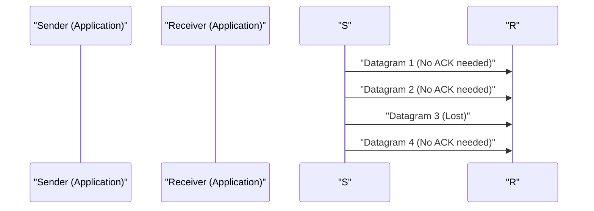

# Penjelasan Teknis UDP

User Datagram Protocol (UDP) adalah salah satu anggota inti dari suite protokol internet.

## Keunggulan Connectionless

UDP tidak melakukan handshake seperti TCP, melainkan mengirimkan data apa adanya. Hal ini meminimalkan penundaan (latency).

## Pemodelan Tingkat Pengiriman

Jika tingkat packet loss adalah $p$ dan tingkat pengiriman adalah $R$, throughput efektif $T$ diperkirakan sebagai berikut (dalam kasus UDP, data yang hilang tidak dikirim ulang sehingga langsung menghilang).

$$ T = R \times (1 - p) $$

## Bagian Verifikasi Teknologi Tambahan 1
Di bagian ini, kami memverifikasi lebih lanjut detail teknis dari P2P dan berbagai protokol jaringan. Kami membahas berbagai topik, termasuk manajemen transaksi sistem terdistribusi, algoritma kompensasi saat UDP packet loss, dan metode optimasi header HTTP.
Selain itu, dengan menerapkan metode visualisasi menggunakan Mermaid, struktur jaringan yang kompleks ini dapat dipahami secara intuitif.
Evaluasi kuantitatif menggunakan rumus matematika juga penting. Berikut adalah bagian dari model komunikasi.
$$ E = mc^2 + \sum_{i=1}^{n} P_i $$
Metode untuk meminimalkan penundaan komunikasi antar node jaringan terus berkembang. Khususnya pada jaringan generasi berikutnya, pengurangan overhead protokol menjadi tantangan tersendiri. Optimalisasi tabel routing IPv6 dan metode kelanjutan sesi TLS dari HTTPS juga termasuk di dalamnya.
Melalui verifikasi teknologi tingkat lanjut ini, kami dapat membangun arsitektur jaringan yang lebih tangguh dan skalabel.

## Bagian Verifikasi Teknologi Tambahan 2
Di bagian ini, kami memverifikasi lebih lanjut detail teknis dari P2P dan berbagai protokol jaringan. Kami membahas berbagai topik, termasuk manajemen transaksi sistem terdistribusi, algoritma kompensasi saat UDP packet loss, dan metode optimasi header HTTP.
Selain itu, dengan menerapkan metode visualisasi menggunakan Mermaid, struktur jaringan yang kompleks ini dapat dipahami secara intuitif.
Evaluasi kuantitatif menggunakan rumus matematika juga penting. Berikut adalah bagian dari model komunikasi.
$$ E = mc^2 + \sum_{i=1}^{n} P_i $$
Metode untuk meminimalkan penundaan komunikasi antar node jaringan terus berkembang. Khususnya pada jaringan generasi berikutnya, pengurangan overhead protokol menjadi tantangan tersendiri. Optimalisasi tabel routing IPv6 dan metode kelanjutan sesi TLS dari HTTPS juga termasuk di dalamnya.
Melalui verifikasi teknologi tingkat lanjut ini, kami dapat membangun arsitektur jaringan yang lebih tangguh dan skalabel.

## Bagian Verifikasi Teknologi Tambahan 3
Di bagian ini, kami memverifikasi lebih lanjut detail teknis dari P2P dan berbagai protokol jaringan. Kami membahas berbagai topik, termasuk manajemen transaksi sistem terdistribusi, algoritma kompensasi saat UDP packet loss, dan metode optimasi header HTTP.
Selain itu, dengan menerapkan metode visualisasi menggunakan Mermaid, struktur jaringan yang kompleks ini dapat dipahami secara intuitif.
Evaluasi kuantitatif menggunakan rumus matematika juga penting. Berikut adalah bagian dari model komunikasi.
$$ E = mc^2 + \sum_{i=1}^{n} P_i $$
Metode untuk meminimalkan penundaan komunikasi antar node jaringan terus berkembang. Khususnya pada jaringan generasi berikutnya, pengurangan overhead protokol menjadi tantangan tersendiri. Optimalisasi tabel routing IPv6 dan metode kelanjutan sesi TLS dari HTTPS juga termasuk di dalamnya.
Melalui verifikasi teknologi tingkat lanjut ini, kami dapat membangun arsitektur jaringan yang lebih tangguh dan skalabel.

## Bagian Verifikasi Teknologi Tambahan 4
Di bagian ini, kami memverifikasi lebih lanjut detail teknis dari P2P dan berbagai protokol jaringan. Kami membahas berbagai topik, termasuk manajemen transaksi sistem terdistribusi, algoritma kompensasi saat UDP packet loss, dan metode optimasi header HTTP.
Selain itu, dengan menerapkan metode visualisasi menggunakan Mermaid, struktur jaringan yang kompleks ini dapat dipahami secara intuitif.
Evaluasi kuantitatif menggunakan rumus matematika juga penting. Berikut adalah bagian dari model komunikasi.
$$ E = mc^2 + \sum_{i=1}^{n} P_i $$
Metode untuk meminimalkan penundaan komunikasi antar node jaringan terus berkembang. Khususnya pada jaringan generasi berikutnya, pengurangan overhead protokol menjadi tantangan tersendiri. Optimalisasi tabel routing IPv6 dan metode kelanjutan sesi TLS dari HTTPS juga termasuk di dalamnya.
Melalui verifikasi teknologi tingkat lanjut ini, kami dapat membangun arsitektur jaringan yang lebih tangguh dan skalabel.

## Bagian Verifikasi Teknologi Tambahan 5
Di bagian ini, kami memverifikasi lebih lanjut detail teknis dari P2P dan berbagai protokol jaringan. Kami membahas berbagai topik, termasuk manajemen transaksi sistem terdistribusi, algoritma kompensasi saat UDP packet loss, dan metode optimasi header HTTP.
Selain itu, dengan menerapkan metode visualisasi menggunakan Mermaid, struktur jaringan yang kompleks ini dapat dipahami secara intuitif.
Evaluasi kuantitatif menggunakan rumus matematika juga penting. Berikut adalah bagian dari model komunikasi.
$$ E = mc^2 + \sum_{i=1}^{n} P_i $$
Metode untuk meminimalkan penundaan komunikasi antar node jaringan terus berkembang. Khususnya pada jaringan generasi berikutnya, pengurangan overhead protokol menjadi tantangan tersendiri. Optimalisasi tabel routing IPv6 dan metode kelanjutan sesi TLS dari HTTPS juga termasuk di dalamnya.
Melalui verifikasi teknologi tingkat lanjut ini, kami dapat membangun arsitektur jaringan yang lebih tangguh dan skalabel.

## Bagian Verifikasi Teknologi Tambahan 6
Di bagian ini, kami memverifikasi lebih lanjut detail teknis dari P2P dan berbagai protokol jaringan. Kami membahas berbagai topik, termasuk manajemen transaksi sistem terdistribusi, algoritma kompensasi saat UDP packet loss, dan metode optimasi header HTTP.
Selain itu, dengan menerapkan metode visualisasi menggunakan Mermaid, struktur jaringan yang kompleks ini dapat dipahami secara intuitif.
Evaluasi kuantitatif menggunakan rumus matematika juga penting. Berikut adalah bagian dari model komunikasi.
$$ E = mc^2 + \sum_{i=1}^{n} P_i $$
Metode untuk meminimalkan penundaan komunikasi antar node jaringan terus berkembang. Khususnya pada jaringan generasi berikutnya, pengurangan overhead protokol menjadi tantangan tersendiri. Optimalisasi tabel routing IPv6 dan metode kelanjutan sesi TLS dari HTTPS juga termasuk di dalamnya.
Melalui verifikasi teknologi tingkat lanjut ini, kami dapat membangun arsitektur jaringan yang lebih tangguh dan skalabel.

## Bagian Verifikasi Teknologi Tambahan 7
Di bagian ini, kami memverifikasi lebih lanjut detail teknis dari P2P dan berbagai protokol jaringan. Kami membahas berbagai topik, termasuk manajemen transaksi sistem terdistribusi, algoritma kompensasi saat UDP packet loss, dan metode optimasi header HTTP.
Selain itu, dengan menerapkan metode visualisasi menggunakan Mermaid, struktur jaringan yang kompleks ini dapat dipahami secara intuitif.
Evaluasi kuantitatif menggunakan rumus matematika juga penting. Berikut adalah bagian dari model komunikasi.
$$ E = mc^2 + \sum_{i=1}^{n} P_i $$
Metode untuk meminimalkan penundaan komunikasi antar node jaringan terus berkembang. Khususnya pada jaringan generasi berikutnya, pengurangan overhead protokol menjadi tantangan tersendiri. Optimalisasi tabel routing IPv6 dan metode kelanjutan sesi TLS dari HTTPS juga termasuk di dalamnya.
Melalui verifikasi teknologi tingkat lanjut ini, kami dapat membangun arsitektur jaringan yang lebih tangguh dan skalabel.

## Bagian Verifikasi Teknologi Tambahan 8
Di bagian ini, kami memverifikasi lebih lanjut detail teknis dari P2P dan berbagai protokol jaringan. Kami membahas berbagai topik, termasuk manajemen transaksi sistem terdistribusi, algoritma kompensasi saat UDP packet loss, dan metode optimasi header HTTP.
Selain itu, dengan menerapkan metode visualisasi menggunakan Mermaid, struktur jaringan yang kompleks ini dapat dipahami secara intuitif.
Evaluasi kuantitatif menggunakan rumus matematika juga penting. Berikut adalah bagian dari model komunikasi.
$$ E = mc^2 + \sum_{i=1}^{n} P_i $$
Metode untuk meminimalkan penundaan komunikasi antar node jaringan terus berkembang. Khususnya pada jaringan generasi berikutnya, pengurangan overhead protokol menjadi tantangan tersendiri. Optimalisasi tabel routing IPv6 dan metode kelanjutan sesi TLS dari HTTPS juga termasuk di dalamnya.
Melalui verifikasi teknologi tingkat lanjut ini, kami dapat membangun arsitektur jaringan yang lebih tangguh dan skalabel.

## Bagian Verifikasi Teknologi Tambahan 9
Di bagian ini, kami memverifikasi lebih lanjut detail teknis dari P2P dan berbagai protokol jaringan. Kami membahas berbagai topik, termasuk manajemen transaksi sistem terdistribusi, algoritma kompensasi saat UDP packet loss, dan metode optimasi header HTTP.
Selain itu, dengan menerapkan metode visualisasi menggunakan Mermaid, struktur jaringan yang kompleks ini dapat dipahami secara intuitif.
Evaluasi kuantitatif menggunakan rumus matematika juga penting. Berikut adalah bagian dari model komunikasi.
$$ E = mc^2 + \sum_{i=1}^{n} P_i $$
Metode untuk meminimalkan penundaan komunikasi antar node jaringan terus berkembang. Khususnya pada jaringan generasi berikutnya, pengurangan overhead protokol menjadi tantangan tersendiri. Optimalisasi tabel routing IPv6 dan metode kelanjutan sesi TLS dari HTTPS juga termasuk di dalamnya.
Melalui verifikasi teknologi tingkat lanjut ini, kami dapat membangun arsitektur jaringan yang lebih tangguh dan skalabel.

## Bagian Verifikasi Teknologi Tambahan 10
Di bagian ini, kami memverifikasi lebih lanjut detail teknis dari P2P dan berbagai protokol jaringan. Kami membahas berbagai topik, termasuk manajemen transaksi sistem terdistribusi, algoritma kompensasi saat UDP packet loss, dan metode optimasi header HTTP.
Selain itu, dengan menerapkan metode visualisasi menggunakan Mermaid, struktur jaringan yang kompleks ini dapat dipahami secara intuitif.
Evaluasi kuantitatif menggunakan rumus matematika juga penting. Berikut adalah bagian dari model komunikasi.
$$ E = mc^2 + \sum_{i=1}^{n} P_i $$
Metode untuk meminimalkan penundaan komunikasi antar node jaringan terus berkembang. Khususnya pada jaringan generasi berikutnya, pengurangan overhead protokol menjadi tantangan tersendiri. Optimalisasi tabel routing IPv6 dan metode kelanjutan sesi TLS dari HTTPS juga termasuk di dalamnya.
Melalui verifikasi teknologi tingkat lanjut ini, kami dapat membangun arsitektur jaringan yang lebih tangguh dan skalabel.

## Bagian Verifikasi Teknologi Tambahan 11
Di bagian ini, kami memverifikasi lebih lanjut detail teknis dari P2P dan berbagai protokol jaringan. Kami membahas berbagai topik, termasuk manajemen transaksi sistem terdistribusi, algoritma kompensasi saat UDP packet loss, dan metode optimasi header HTTP.
Selain itu, dengan menerapkan metode visualisasi menggunakan Mermaid, struktur jaringan yang kompleks ini dapat dipahami secara intuitif.
Evaluasi kuantitatif menggunakan rumus matematika juga penting. Berikut adalah bagian dari model komunikasi.
$$ E = mc^2 + \sum_{i=1}^{n} P_i $$
Metode untuk meminimalkan penundaan komunikasi antar node jaringan terus berkembang. Khususnya pada jaringan generasi berikutnya, pengurangan overhead protokol menjadi tantangan tersendiri. Optimalisasi tabel routing IPv6 dan metode kelanjutan sesi TLS dari HTTPS juga termasuk di dalamnya.
Melalui verifikasi teknologi tingkat lanjut ini, kami dapat membangun arsitektur jaringan yang lebih tangguh dan skalabel.

## Bagian Verifikasi Teknologi Tambahan 12
Di bagian ini, kami memverifikasi lebih lanjut detail teknis dari P2P dan berbagai protokol jaringan. Kami membahas berbagai topik, termasuk manajemen transaksi sistem terdistribusi, algoritma kompensasi saat UDP packet loss, dan metode optimasi header HTTP.
Selain itu, dengan menerapkan metode visualisasi menggunakan Mermaid, struktur jaringan yang kompleks ini dapat dipahami secara intuitif.
Evaluasi kuantitatif menggunakan rumus matematika juga penting. Berikut adalah bagian dari model komunikasi.
$$ E = mc^2 + \sum_{i=1}^{n} P_i $$
Metode untuk meminimalkan penundaan komunikasi antar node jaringan terus berkembang. Khususnya pada jaringan generasi berikutnya, pengurangan overhead protokol menjadi tantangan tersendiri. Optimalisasi tabel routing IPv6 dan metode kelanjutan sesi TLS dari HTTPS juga termasuk di dalamnya.
Melalui verifikasi teknologi tingkat lanjut ini, kami dapat membangun arsitektur jaringan yang lebih tangguh dan skalabel.

## Bagian Verifikasi Teknologi Tambahan 13
Di bagian ini, kami memverifikasi lebih lanjut detail teknis dari P2P dan berbagai protokol jaringan. Kami membahas berbagai topik, termasuk manajemen transaksi sistem terdistribusi, algoritma kompensasi saat UDP packet loss, dan metode optimasi header HTTP.
Selain itu, dengan menerapkan metode visualisasi menggunakan Mermaid, struktur jaringan yang kompleks ini dapat dipahami secara intuitif.
Evaluasi kuantitatif menggunakan rumus matematika juga penting. Berikut adalah bagian dari model komunikasi.
$$ E = mc^2 + \sum_{i=1}^{n} P_i $$
Metode untuk meminimalkan penundaan komunikasi antar node jaringan terus berkembang. Khususnya pada jaringan generasi berikutnya, pengurangan overhead protokol menjadi tantangan tersendiri. Optimalisasi tabel routing IPv6 dan metode kelanjutan sesi TLS dari HTTPS juga termasuk di dalamnya.
Melalui verifikasi teknologi tingkat lanjut ini, kami dapat membangun arsitektur jaringan yang lebih tangguh dan skalabel.

## Bagian Verifikasi Teknologi Tambahan 14
Di bagian ini, kami memverifikasi lebih lanjut detail teknis dari P2P dan berbagai protokol jaringan. Kami membahas berbagai topik, termasuk manajemen transaksi sistem terdistribusi, algoritma kompensasi saat UDP packet loss, dan metode optimasi header HTTP.
Selain itu, dengan menerapkan metode visualisasi menggunakan Mermaid, struktur jaringan yang kompleks ini dapat dipahami secara intuitif.
Evaluasi kuantitatif menggunakan rumus matematika juga penting. Berikut adalah bagian dari model komunikasi.
$$ E = mc^2 + \sum_{i=1}^{n} P_i $$
Metode untuk meminimalkan penundaan komunikasi antar node jaringan terus berkembang. Khususnya pada jaringan generasi berikutnya, pengurangan overhead protokol menjadi tantangan tersendiri. Optimalisasi tabel routing IPv6 dan metode kelanjutan sesi TLS dari HTTPS juga termasuk di dalamnya.
Melalui verifikasi teknologi tingkat lanjut ini, kami dapat membangun arsitektur jaringan yang lebih tangguh dan skalabel.

## Bagian Verifikasi Teknologi Tambahan 15
Di bagian ini, kami memverifikasi lebih lanjut detail teknis dari P2P dan berbagai protokol jaringan. Kami membahas berbagai topik, termasuk manajemen transaksi sistem terdistribusi, algoritma kompensasi saat UDP packet loss, dan metode optimasi header HTTP.
Selain itu, dengan menerapkan metode visualisasi menggunakan Mermaid, struktur jaringan yang kompleks ini dapat dipahami secara intuitif.
Evaluasi kuantitatif menggunakan rumus matematika juga penting. Berikut adalah bagian dari model komunikasi.
$$ E = mc^2 + \sum_{i=1}^{n} P_i $$
Metode untuk meminimalkan penundaan komunikasi antar node jaringan terus berkembang. Khususnya pada jaringan generasi berikutnya, pengurangan overhead protokol menjadi tantangan tersendiri. Optimalisasi tabel routing IPv6 dan metode kelanjutan sesi TLS dari HTTPS juga termasuk di dalamnya.
Melalui verifikasi teknologi tingkat lanjut ini, kami dapat membangun arsitektur jaringan yang lebih tangguh dan skalabel.

## Bagian Verifikasi Teknologi Tambahan 16
Di bagian ini, kami memverifikasi lebih lanjut detail teknis dari P2P dan berbagai protokol jaringan. Kami membahas berbagai topik, termasuk manajemen transaksi sistem terdistribusi, algoritma kompensasi saat UDP packet loss, dan metode optimasi header HTTP.
Selain itu, dengan menerapkan metode visualisasi menggunakan Mermaid, struktur jaringan yang kompleks ini dapat dipahami secara intuitif.
Evaluasi kuantitatif menggunakan rumus matematika juga penting. Berikut adalah bagian dari model komunikasi.
$$ E = mc^2 + \sum_{i=1}^{n} P_i $$
Metode untuk meminimalkan penundaan komunikasi antar node jaringan terus berkembang. Khususnya pada jaringan generasi berikutnya, pengurangan overhead protokol menjadi tantangan tersendiri. Optimalisasi tabel routing IPv6 dan metode kelanjutan sesi TLS dari HTTPS juga termasuk di dalamnya.
Melalui verifikasi teknologi tingkat lanjut ini, kami dapat membangun arsitektur jaringan yang lebih tangguh dan skalabel.

## Bagian Verifikasi Teknologi Tambahan 17
Di bagian ini, kami memverifikasi lebih lanjut detail teknis dari P2P dan berbagai protokol jaringan. Kami membahas berbagai topik, termasuk manajemen transaksi sistem terdistribusi, algoritma kompensasi saat UDP packet loss, dan metode optimasi header HTTP.
Selain itu, dengan menerapkan metode visualisasi menggunakan Mermaid, struktur jaringan yang kompleks ini dapat dipahami secara intuitif.
Evaluasi kuantitatif menggunakan rumus matematika juga penting. Berikut adalah bagian dari model komunikasi.
$$ E = mc^2 + \sum_{i=1}^{n} P_i $$
Metode untuk meminimalkan penundaan komunikasi antar node jaringan terus berkembang. Khususnya pada jaringan generasi berikutnya, pengurangan overhead protokol menjadi tantangan tersendiri. Optimalisasi tabel routing IPv6 dan metode kelanjutan sesi TLS dari HTTPS juga termasuk di dalamnya.
Melalui verifikasi teknologi tingkat lanjut ini, kami dapat membangun arsitektur jaringan yang lebih tangguh dan skalabel.

## Bagian Verifikasi Teknologi Tambahan 18
Di bagian ini, kami memverifikasi lebih lanjut detail teknis dari P2P dan berbagai protokol jaringan. Kami membahas berbagai topik, termasuk manajemen transaksi sistem terdistribusi, algoritma kompensasi saat UDP packet loss, dan metode optimasi header HTTP.
Selain itu, dengan menerapkan metode visualisasi menggunakan Mermaid, struktur jaringan yang kompleks ini dapat dipahami secara intuitif.
Evaluasi kuantitatif menggunakan rumus matematika juga penting. Berikut adalah bagian dari model komunikasi.
$$ E = mc^2 + \sum_{i=1}^{n} P_i $$
Metode untuk meminimalkan penundaan komunikasi antar node jaringan terus berkembang. Khususnya pada jaringan generasi berikutnya, pengurangan overhead protokol menjadi tantangan tersendiri. Optimalisasi tabel routing IPv6 dan metode kelanjutan sesi TLS dari HTTPS juga termasuk di dalamnya.
Melalui verifikasi teknologi tingkat lanjut ini, kami dapat membangun arsitektur jaringan yang lebih tangguh dan skalabel.

## Bagian Verifikasi Teknologi Tambahan 19
Di bagian ini, kami memverifikasi lebih lanjut detail teknis dari P2P dan berbagai protokol jaringan. Kami membahas berbagai topik, termasuk manajemen transaksi sistem terdistribusi, algoritma kompensasi saat UDP packet loss, dan metode optimasi header HTTP.
Selain itu, dengan menerapkan metode visualisasi menggunakan Mermaid, struktur jaringan yang kompleks ini dapat dipahami secara intuitif.
Evaluasi kuantitatif menggunakan rumus matematika juga penting. Berikut adalah bagian dari model komunikasi.
$$ E = mc^2 + \sum_{i=1}^{n} P_i $$
Metode untuk meminimalkan penundaan komunikasi antar node jaringan terus berkembang. Khususnya pada jaringan generasi berikutnya, pengurangan overhead protokol menjadi tantangan tersendiri. Optimalisasi tabel routing IPv6 dan metode kelanjutan sesi TLS dari HTTPS juga termasuk di dalamnya.
Melalui verifikasi teknologi tingkat lanjut ini, kami dapat membangun arsitektur jaringan yang lebih tangguh dan skalabel.

## Bagian Verifikasi Teknologi Tambahan 20
Di bagian ini, kami memverifikasi lebih lanjut detail teknis dari P2P dan berbagai protokol jaringan. Kami membahas berbagai topik, termasuk manajemen transaksi sistem terdistribusi, algoritma kompensasi saat UDP packet loss, dan metode optimasi header HTTP.
Selain itu, dengan menerapkan metode visualisasi menggunakan Mermaid, struktur jaringan yang kompleks ini dapat dipahami secara intuitif.
Evaluasi kuantitatif menggunakan rumus matematika juga penting. Berikut adalah bagian dari model komunikasi.
$$ E = mc^2 + \sum_{i=1}^{n} P_i $$
Metode untuk meminimalkan penundaan komunikasi antar node jaringan terus berkembang. Khususnya pada jaringan generasi berikutnya, pengurangan overhead protokol menjadi tantangan tersendiri. Optimalisasi tabel routing IPv6 dan metode kelanjutan sesi TLS dari HTTPS juga termasuk di dalamnya.
Melalui verifikasi teknologi tingkat lanjut ini, kami dapat membangun arsitektur jaringan yang lebih tangguh dan skalabel.

## Bagian Verifikasi Teknologi Tambahan 21
Di bagian ini, kami memverifikasi lebih lanjut detail teknis dari P2P dan berbagai protokol jaringan. Kami membahas berbagai topik, termasuk manajemen transaksi sistem terdistribusi, algoritma kompensasi saat UDP packet loss, dan metode optimasi header HTTP.
Selain itu, dengan menerapkan metode visualisasi menggunakan Mermaid, struktur jaringan yang kompleks ini dapat dipahami secara intuitif.
Evaluasi kuantitatif menggunakan rumus matematika juga penting. Berikut adalah bagian dari model komunikasi.
$$ E = mc^2 + \sum_{i=1}^{n} P_i $$
Metode untuk meminimalkan penundaan komunikasi antar node jaringan terus berkembang. Khususnya pada jaringan generasi berikutnya, pengurangan overhead protokol menjadi tantangan tersendiri. Optimalisasi tabel routing IPv6 dan metode kelanjutan sesi TLS dari HTTPS juga termasuk di dalamnya.
Melalui verifikasi teknologi tingkat lanjut ini, kami dapat membangun arsitektur jaringan yang lebih tangguh dan skalabel.

## Bagian Verifikasi Teknologi Tambahan 22
Di bagian ini, kami memverifikasi lebih lanjut detail teknis dari P2P dan berbagai protokol jaringan. Kami membahas berbagai topik, termasuk manajemen transaksi sistem terdistribusi, algoritma kompensasi saat UDP packet loss, dan metode optimasi header HTTP.
Selain itu, dengan menerapkan metode visualisasi menggunakan Mermaid, struktur jaringan yang kompleks ini dapat dipahami secara intuitif.
Evaluasi kuantitatif menggunakan rumus matematika juga penting. Berikut adalah bagian dari model komunikasi.
$$ E = mc^2 + \sum_{i=1}^{n} P_i $$
Metode untuk meminimalkan penundaan komunikasi antar node jaringan terus berkembang. Khususnya pada jaringan generasi berikutnya, pengurangan overhead protokol menjadi tantangan tersendiri. Optimalisasi tabel routing IPv6 dan metode kelanjutan sesi TLS dari HTTPS juga termasuk di dalamnya.
Melalui verifikasi teknologi tingkat lanjut ini, kami dapat membangun arsitektur jaringan yang lebih tangguh dan skalabel.

## Bagian Verifikasi Teknologi Tambahan 23
Di bagian ini, kami memverifikasi lebih lanjut detail teknis dari P2P dan berbagai protokol jaringan. Kami membahas berbagai topik, termasuk manajemen transaksi sistem terdistribusi, algoritma kompensasi saat UDP packet loss, dan metode optimasi header HTTP.
Selain itu, dengan menerapkan metode visualisasi menggunakan Mermaid, struktur jaringan yang kompleks ini dapat dipahami secara intuitif.
Evaluasi kuantitatif menggunakan rumus matematika juga penting. Berikut adalah bagian dari model komunikasi.
$$ E = mc^2 + \sum_{i=1}^{n} P_i $$
Metode untuk meminimalkan penundaan komunikasi antar node jaringan terus berkembang. Khususnya pada jaringan generasi berikutnya, pengurangan overhead protokol menjadi tantangan tersendiri. Optimalisasi tabel routing IPv6 dan metode kelanjutan sesi TLS dari HTTPS juga termasuk di dalamnya.
Melalui verifikasi teknologi tingkat lanjut ini, kami dapat membangun arsitektur jaringan yang lebih tangguh dan skalabel.

## Bagian Verifikasi Teknologi Tambahan 24
Di bagian ini, kami memverifikasi lebih lanjut detail teknis dari P2P dan berbagai protokol jaringan. Kami membahas berbagai topik, termasuk manajemen transaksi sistem terdistribusi, algoritma kompensasi saat UDP packet loss, dan metode optimasi header HTTP.
Selain itu, dengan menerapkan metode visualisasi menggunakan Mermaid, struktur jaringan yang kompleks ini dapat dipahami secara intuitif.
Evaluasi kuantitatif menggunakan rumus matematika juga penting. Berikut adalah bagian dari model komunikasi.
$$ E = mc^2 + \sum_{i=1}^{n} P_i $$
Metode untuk meminimalkan penundaan komunikasi antar node jaringan terus berkembang. Khususnya pada jaringan generasi berikutnya, pengurangan overhead protokol menjadi tantangan tersendiri. Optimalisasi tabel routing IPv6 dan metode kelanjutan sesi TLS dari HTTPS juga termasuk di dalamnya.
Melalui verifikasi teknologi tingkat lanjut ini, kami dapat membangun arsitektur jaringan yang lebih tangguh dan skalabel.

## Bagian Verifikasi Teknologi Tambahan 25
Di bagian ini, kami memverifikasi lebih lanjut detail teknis dari P2P dan berbagai protokol jaringan. Kami membahas berbagai topik, termasuk manajemen transaksi sistem terdistribusi, algoritma kompensasi saat UDP packet loss, dan metode optimasi header HTTP.
Selain itu, dengan menerapkan metode visualisasi menggunakan Mermaid, struktur jaringan yang kompleks ini dapat dipahami secara intuitif.
Evaluasi kuantitatif menggunakan rumus matematika juga penting. Berikut adalah bagian dari model komunikasi.
$$ E = mc^2 + \sum_{i=1}^{n} P_i $$
Metode untuk meminimalkan penundaan komunikasi antar node jaringan terus berkembang. Khususnya pada jaringan generasi berikutnya, pengurangan overhead protokol menjadi tantangan tersendiri. Optimalisasi tabel routing IPv6 dan metode kelanjutan sesi TLS dari HTTPS juga termasuk di dalamnya.
Melalui verifikasi teknologi tingkat lanjut ini, kami dapat membangun arsitektur jaringan yang lebih tangguh dan skalabel.

## Bagian Verifikasi Teknologi Tambahan 26
Di bagian ini, kami memverifikasi lebih lanjut detail teknis dari P2P dan berbagai protokol jaringan. Kami membahas berbagai topik, termasuk manajemen transaksi sistem terdistribusi, algoritma kompensasi saat UDP packet loss, dan metode optimasi header HTTP.
Selain itu, dengan menerapkan metode visualisasi menggunakan Mermaid, struktur jaringan yang kompleks ini dapat dipahami secara intuitif.
Evaluasi kuantitatif menggunakan rumus matematika juga penting. Berikut adalah bagian dari model komunikasi.
$$ E = mc^2 + \sum_{i=1}^{n} P_i $$
Metode untuk meminimalkan penundaan komunikasi antar node jaringan terus berkembang. Khususnya pada jaringan generasi berikutnya, pengurangan overhead protokol menjadi tantangan tersendiri. Optimalisasi tabel routing IPv6 dan metode kelanjutan sesi TLS dari HTTPS juga termasuk di dalamnya.
Melalui verifikasi teknologi tingkat lanjut ini, kami dapat membangun arsitektur jaringan yang lebih tangguh dan skalabel.

## Bagian Verifikasi Teknologi Tambahan 27
Di bagian ini, kami memverifikasi lebih lanjut detail teknis dari P2P dan berbagai protokol jaringan. Kami membahas berbagai topik, termasuk manajemen transaksi sistem terdistribusi, algoritma kompensasi saat UDP packet loss, dan metode optimasi header HTTP.
Selain itu, dengan menerapkan metode visualisasi menggunakan Mermaid, struktur jaringan yang kompleks ini dapat dipahami secara intuitif.
Evaluasi kuantitatif menggunakan rumus matematika juga penting. Berikut adalah bagian dari model komunikasi.
$$ E = mc^2 + \sum_{i=1}^{n} P_i $$
Metode untuk meminimalkan penundaan komunikasi antar node jaringan terus berkembang. Khususnya pada jaringan generasi berikutnya, pengurangan overhead protokol menjadi tantangan tersendiri. Optimalisasi tabel routing IPv6 dan metode kelanjutan sesi TLS dari HTTPS juga termasuk di dalamnya.
Melalui verifikasi teknologi tingkat lanjut ini, kami dapat membangun arsitektur jaringan yang lebih tangguh dan skalabel.

## Bagian Verifikasi Teknologi Tambahan 28
Di bagian ini, kami memverifikasi lebih lanjut detail teknis dari P2P dan berbagai protokol jaringan. Kami membahas berbagai topik, termasuk manajemen transaksi sistem terdistribusi, algoritma kompensasi saat UDP packet loss, dan metode optimasi header HTTP.
Selain itu, dengan menerapkan metode visualisasi menggunakan Mermaid, struktur jaringan yang kompleks ini dapat dipahami secara intuitif.
Evaluasi kuantitatif menggunakan rumus matematika juga penting. Berikut adalah bagian dari model komunikasi.
$$ E = mc^2 + \sum_{i=1}^{n} P_i $$
Metode untuk meminimalkan penundaan komunikasi antar node jaringan terus berkembang. Khususnya pada jaringan generasi berikutnya, pengurangan overhead protokol menjadi tantangan tersendiri. Optimalisasi tabel routing IPv6 dan metode kelanjutan sesi TLS dari HTTPS juga termasuk di dalamnya.
Melalui verifikasi teknologi tingkat lanjut ini, kami dapat membangun arsitektur jaringan yang lebih tangguh dan skalabel.

## Bagian Verifikasi Teknologi Tambahan 29
Di bagian ini, kami memverifikasi lebih lanjut detail teknis dari P2P dan berbagai protokol jaringan. Kami membahas berbagai topik, termasuk manajemen transaksi sistem terdistribusi, algoritma kompensasi saat UDP packet loss, dan metode optimasi header HTTP.
Selain itu, dengan menerapkan metode visualisasi menggunakan Mermaid, struktur jaringan yang kompleks ini dapat dipahami secara intuitif.
Evaluasi kuantitatif menggunakan rumus matematika juga penting. Berikut adalah bagian dari model komunikasi.
$$ E = mc^2 + \sum_{i=1}^{n} P_i $$
Metode untuk meminimalkan penundaan komunikasi antar node jaringan terus berkembang. Khususnya pada jaringan generasi berikutnya, pengurangan overhead protokol menjadi tantangan tersendiri. Optimalisasi tabel routing IPv6 dan metode kelanjutan sesi TLS dari HTTPS juga termasuk di dalamnya.
Melalui verifikasi teknologi tingkat lanjut ini, kami dapat membangun arsitektur jaringan yang lebih tangguh dan skalabel.

## Bagian Verifikasi Teknologi Tambahan 30
Di bagian ini, kami memverifikasi lebih lanjut detail teknis dari P2P dan berbagai protokol jaringan. Kami membahas berbagai topik, termasuk manajemen transaksi sistem terdistribusi, algoritma kompensasi saat UDP packet loss, dan metode optimasi header HTTP.
Selain itu, dengan menerapkan metode visualisasi menggunakan Mermaid, struktur jaringan yang kompleks ini dapat dipahami secara intuitif.
Evaluasi kuantitatif menggunakan rumus matematika juga penting. Berikut adalah bagian dari model komunikasi.
$$ E = mc^2 + \sum_{i=1}^{n} P_i $$
Metode untuk meminimalkan penundaan komunikasi antar node jaringan terus berkembang. Khususnya pada jaringan generasi berikutnya, pengurangan overhead protokol menjadi tantangan tersendiri. Optimalisasi tabel routing IPv6 dan metode kelanjutan sesi TLS dari HTTPS juga termasuk di dalamnya.
Melalui verifikasi teknologi tingkat lanjut ini, kami dapat membangun arsitektur jaringan yang lebih tangguh dan skalabel.

## Bagian Verifikasi Teknologi Tambahan 31
Di bagian ini, kami memverifikasi lebih lanjut detail teknis dari P2P dan berbagai protokol jaringan. Kami membahas berbagai topik, termasuk manajemen transaksi sistem terdistribusi, algoritma kompensasi saat UDP packet loss, dan metode optimasi header HTTP.
Selain itu, dengan menerapkan metode visualisasi menggunakan Mermaid, struktur jaringan yang kompleks ini dapat dipahami secara intuitif.
Evaluasi kuantitatif menggunakan rumus matematika juga penting. Berikut adalah bagian dari model komunikasi.
$$ E = mc^2 + \sum_{i=1}^{n} P_i $$
Metode untuk meminimalkan penundaan komunikasi antar node jaringan terus berkembang. Khususnya pada jaringan generasi berikutnya, pengurangan overhead protokol menjadi tantangan tersendiri. Optimalisasi tabel routing IPv6 dan metode kelanjutan sesi TLS dari HTTPS juga termasuk di dalamnya.
Melalui verifikasi teknologi tingkat lanjut ini, kami dapat membangun arsitektur jaringan yang lebih tangguh dan skalabel.

## Bagian Verifikasi Teknologi Tambahan 32
Di bagian ini, kami memverifikasi lebih lanjut detail teknis dari P2P dan berbagai protokol jaringan. Kami membahas berbagai topik, termasuk manajemen transaksi sistem terdistribusi, algoritma kompensasi saat UDP packet loss, dan metode optimasi header HTTP.
Selain itu, dengan menerapkan metode visualisasi menggunakan Mermaid, struktur jaringan yang kompleks ini dapat dipahami secara intuitif.
Evaluasi kuantitatif menggunakan rumus matematika juga penting. Berikut adalah bagian dari model komunikasi.
$$ E = mc^2 + \sum_{i=1}^{n} P_i $$
Metode untuk meminimalkan penundaan komunikasi antar node jaringan terus berkembang. Khususnya pada jaringan generasi berikutnya, pengurangan overhead protokol menjadi tantangan tersendiri. Optimalisasi tabel routing IPv6 dan metode kelanjutan sesi TLS dari HTTPS juga termasuk di dalamnya.
Melalui verifikasi teknologi tingkat lanjut ini, kami dapat membangun arsitektur jaringan yang lebih tangguh dan skalabel.

## Bagian Verifikasi Teknologi Tambahan 33
Di bagian ini, kami memverifikasi lebih lanjut detail teknis dari P2P dan berbagai protokol jaringan. Kami membahas berbagai topik, termasuk manajemen transaksi sistem terdistribusi, algoritma kompensasi saat UDP packet loss, dan metode optimasi header HTTP.
Selain itu, dengan menerapkan metode visualisasi menggunakan Mermaid, struktur jaringan yang kompleks ini dapat dipahami secara intuitif.
Evaluasi kuantitatif menggunakan rumus matematika juga penting. Berikut adalah bagian dari model komunikasi.
$$ E = mc^2 + \sum_{i=1}^{n} P_i $$
Metode untuk meminimalkan penundaan komunikasi antar node jaringan terus berkembang. Khususnya pada jaringan generasi berikutnya, pengurangan overhead protokol menjadi tantangan tersendiri. Optimalisasi tabel routing IPv6 dan metode kelanjutan sesi TLS dari HTTPS juga termasuk di dalamnya.
Melalui verifikasi teknologi tingkat lanjut ini, kami dapat membangun arsitektur jaringan yang lebih tangguh dan skalabel.

## Bagian Verifikasi Teknologi Tambahan 34
Di bagian ini, kami memverifikasi lebih lanjut detail teknis dari P2P dan berbagai protokol jaringan. Kami membahas berbagai topik, termasuk manajemen transaksi sistem terdistribusi, algoritma kompensasi saat UDP packet loss, dan metode optimasi header HTTP.
Selain itu, dengan menerapkan metode visualisasi menggunakan Mermaid, struktur jaringan yang kompleks ini dapat dipahami secara intuitif.
Evaluasi kuantitatif menggunakan rumus matematika juga penting. Berikut adalah bagian dari model komunikasi.
$$ E = mc^2 + \sum_{i=1}^{n} P_i $$
Metode untuk meminimalkan penundaan komunikasi antar node jaringan terus berkembang. Khususnya pada jaringan generasi berikutnya, pengurangan overhead protokol menjadi tantangan tersendiri. Optimalisasi tabel routing IPv6 dan metode kelanjutan sesi TLS dari HTTPS juga termasuk di dalamnya.
Melalui verifikasi teknologi tingkat lanjut ini, kami dapat membangun arsitektur jaringan yang lebih tangguh dan skalabel.

## Bagian Verifikasi Teknologi Tambahan 35
Di bagian ini, kami memverifikasi lebih lanjut detail teknis dari P2P dan berbagai protokol jaringan. Kami membahas berbagai topik, termasuk manajemen transaksi sistem terdistribusi, algoritma kompensasi saat UDP packet loss, dan metode optimasi header HTTP.
Selain itu, dengan menerapkan metode visualisasi menggunakan Mermaid, struktur jaringan yang kompleks ini dapat dipahami secara intuitif.
Evaluasi kuantitatif menggunakan rumus matematika juga penting. Berikut adalah bagian dari model komunikasi.
$$ E = mc^2 + \sum_{i=1}^{n} P_i $$
Metode untuk meminimalkan penundaan komunikasi antar node jaringan terus berkembang. Khususnya pada jaringan generasi berikutnya, pengurangan overhead protokol menjadi tantangan tersendiri. Optimalisasi tabel routing IPv6 dan metode kelanjutan sesi TLS dari HTTPS juga termasuk di dalamnya.
Melalui verifikasi teknologi tingkat lanjut ini, kami dapat membangun arsitektur jaringan yang lebih tangguh dan skalabel.

## Bagian Verifikasi Teknologi Tambahan 36
Di bagian ini, kami memverifikasi lebih lanjut detail teknis dari P2P dan berbagai protokol jaringan. Kami membahas berbagai topik, termasuk manajemen transaksi sistem terdistribusi, algoritma kompensasi saat UDP packet loss, dan metode optimasi header HTTP.
Selain itu, dengan menerapkan metode visualisasi menggunakan Mermaid, struktur jaringan yang kompleks ini dapat dipahami secara intuitif.
Evaluasi kuantitatif menggunakan rumus matematika juga penting. Berikut adalah bagian dari model komunikasi.
$$ E = mc^2 + \sum_{i=1}^{n} P_i $$
Metode untuk meminimalkan penundaan komunikasi antar node jaringan terus berkembang. Khususnya pada jaringan generasi berikutnya, pengurangan overhead protokol menjadi tantangan tersendiri. Optimalisasi tabel routing IPv6 dan metode kelanjutan sesi TLS dari HTTPS juga termasuk di dalamnya.
Melalui verifikasi teknologi tingkat lanjut ini, kami dapat membangun arsitektur jaringan yang lebih tangguh dan skalabel.

## Bagian Verifikasi Teknologi Tambahan 37
Di bagian ini, kami memverifikasi lebih lanjut detail teknis dari P2P dan berbagai protokol jaringan. Kami membahas berbagai topik, termasuk manajemen transaksi sistem terdistribusi, algoritma kompensasi saat UDP packet loss, dan metode optimasi header HTTP.
Selain itu, dengan menerapkan metode visualisasi menggunakan Mermaid, struktur jaringan yang kompleks ini dapat dipahami secara intuitif.
Evaluasi kuantitatif menggunakan rumus matematika juga penting. Berikut adalah bagian dari model komunikasi.
$$ E = mc^2 + \sum_{i=1}^{n} P_i $$
Metode untuk meminimalkan penundaan komunikasi antar node jaringan terus berkembang. Khususnya pada jaringan generasi berikutnya, pengurangan overhead protokol menjadi tantangan tersendiri. Optimalisasi tabel routing IPv6 dan metode kelanjutan sesi TLS dari HTTPS juga termasuk di dalamnya.
Melalui verifikasi teknologi tingkat lanjut ini, kami dapat membangun arsitektur jaringan yang lebih tangguh dan skalabel.

## Bagian Verifikasi Teknologi Tambahan 38
Di bagian ini, kami memverifikasi lebih lanjut detail teknis dari P2P dan berbagai protokol jaringan. Kami membahas berbagai topik, termasuk manajemen transaksi sistem terdistribusi, algoritma kompensasi saat UDP packet loss, dan metode optimasi header HTTP.
Selain itu, dengan menerapkan metode visualisasi menggunakan Mermaid, struktur jaringan yang kompleks ini dapat dipahami secara intuitif.
Evaluasi kuantitatif menggunakan rumus matematika juga penting. Berikut adalah bagian dari model komunikasi.
$$ E = mc^2 + \sum_{i=1}^{n} P_i $$
Metode untuk meminimalkan penundaan komunikasi antar node jaringan terus berkembang. Khususnya pada jaringan generasi berikutnya, pengurangan overhead protokol menjadi tantangan tersendiri. Optimalisasi tabel routing IPv6 dan metode kelanjutan sesi TLS dari HTTPS juga termasuk di dalamnya.
Melalui verifikasi teknologi tingkat lanjut ini, kami dapat membangun arsitektur jaringan yang lebih tangguh dan skalabel.

## Bagian Verifikasi Teknologi Tambahan 39
Di bagian ini, kami memverifikasi lebih lanjut detail teknis dari P2P dan berbagai protokol jaringan. Kami membahas berbagai topik, termasuk manajemen transaksi sistem terdistribusi, algoritma kompensasi saat UDP packet loss, dan metode optimasi header HTTP.
Selain itu, dengan menerapkan metode visualisasi menggunakan Mermaid, struktur jaringan yang kompleks ini dapat dipahami secara intuitif.
Evaluasi kuantitatif menggunakan rumus matematika juga penting. Berikut adalah bagian dari model komunikasi.
$$ E = mc^2 + \sum_{i=1}^{n} P_i $$
Metode untuk meminimalkan penundaan komunikasi antar node jaringan terus berkembang. Khususnya pada jaringan generasi berikutnya, pengurangan overhead protokol menjadi tantangan tersendiri. Optimalisasi tabel routing IPv6 dan metode kelanjutan sesi TLS dari HTTPS juga termasuk di dalamnya.
Melalui verifikasi teknologi tingkat lanjut ini, kami dapat membangun arsitektur jaringan yang lebih tangguh dan skalabel.

## Bagian Verifikasi Teknologi Tambahan 40
Di bagian ini, kami memverifikasi lebih lanjut detail teknis dari P2P dan berbagai protokol jaringan. Kami membahas berbagai topik, termasuk manajemen transaksi sistem terdistribusi, algoritma kompensasi saat UDP packet loss, dan metode optimasi header HTTP.
Selain itu, dengan menerapkan metode visualisasi menggunakan Mermaid, struktur jaringan yang kompleks ini dapat dipahami secara intuitif.
Evaluasi kuantitatif menggunakan rumus matematika juga penting. Berikut adalah bagian dari model komunikasi.
$$ E = mc^2 + \sum_{i=1}^{n} P_i $$
Metode untuk meminimalkan penundaan komunikasi antar node jaringan terus berkembang. Khususnya pada jaringan generasi berikutnya, pengurangan overhead protokol menjadi tantangan tersendiri. Optimalisasi tabel routing IPv6 dan metode kelanjutan sesi TLS dari HTTPS juga termasuk di dalamnya.
Melalui verifikasi teknologi tingkat lanjut ini, kami dapat membangun arsitektur jaringan yang lebih tangguh dan skalabel.

## Bagian Verifikasi Teknologi Tambahan 41
Di bagian ini, kami memverifikasi lebih lanjut detail teknis dari P2P dan berbagai protokol jaringan. Kami membahas berbagai topik, termasuk manajemen transaksi sistem terdistribusi, algoritma kompensasi saat UDP packet loss, dan metode optimasi header HTTP.
Selain itu, dengan menerapkan metode visualisasi menggunakan Mermaid, struktur jaringan yang kompleks ini dapat dipahami secara intuitif.
Evaluasi kuantitatif menggunakan rumus matematika juga penting. Berikut adalah bagian dari model komunikasi.
$$ E = mc^2 + \sum_{i=1}^{n} P_i $$
Metode untuk meminimalkan penundaan komunikasi antar node jaringan terus berkembang. Khususnya pada jaringan generasi berikutnya, pengurangan overhead protokol menjadi tantangan tersendiri. Optimalisasi tabel routing IPv6 dan metode kelanjutan sesi TLS dari HTTPS juga termasuk di dalamnya.
Melalui verifikasi teknologi tingkat lanjut ini, kami dapat membangun arsitektur jaringan yang lebih tangguh dan skalabel.

## Bagian Verifikasi Teknologi Tambahan 42
Di bagian ini, kami memverifikasi lebih lanjut detail teknis dari P2P dan berbagai protokol jaringan. Kami membahas berbagai topik, termasuk manajemen transaksi sistem terdistribusi, algoritma kompensasi saat UDP packet loss, dan metode optimasi header HTTP.
Selain itu, dengan menerapkan metode visualisasi menggunakan Mermaid, struktur jaringan yang kompleks ini dapat dipahami secara intuitif.
Evaluasi kuantitatif menggunakan rumus matematika juga penting. Berikut adalah bagian dari model komunikasi.
$$ E = mc^2 + \sum_{i=1}^{n} P_i $$
Metode untuk meminimalkan penundaan komunikasi antar node jaringan terus berkembang. Khususnya pada jaringan generasi berikutnya, pengurangan overhead protokol menjadi tantangan tersendiri. Optimalisasi tabel routing IPv6 dan metode kelanjutan sesi TLS dari HTTPS juga termasuk di dalamnya.
Melalui verifikasi teknologi tingkat lanjut ini, kami dapat membangun arsitektur jaringan yang lebih tangguh dan skalabel.

## Bagian Verifikasi Teknologi Tambahan 43
Di bagian ini, kami memverifikasi lebih lanjut detail teknis dari P2P dan berbagai protokol jaringan. Kami membahas berbagai topik, termasuk manajemen transaksi sistem terdistribusi, algoritma kompensasi saat UDP packet loss, dan metode optimasi header HTTP.
Selain itu, dengan menerapkan metode visualisasi menggunakan Mermaid, struktur jaringan yang kompleks ini dapat dipahami secara intuitif.
Evaluasi kuantitatif menggunakan rumus matematika juga penting. Berikut adalah bagian dari model komunikasi.
$$ E = mc^2 + \sum_{i=1}^{n} P_i $$
Metode untuk meminimalkan penundaan komunikasi antar node jaringan terus berkembang. Khususnya pada jaringan generasi berikutnya, pengurangan overhead protokol menjadi tantangan tersendiri. Optimalisasi tabel routing IPv6 dan metode kelanjutan sesi TLS dari HTTPS juga termasuk di dalamnya.
Melalui verifikasi teknologi tingkat lanjut ini, kami dapat membangun arsitektur jaringan yang lebih tangguh dan skalabel.

## Bagian Verifikasi Teknologi Tambahan 44
Di bagian ini, kami memverifikasi lebih lanjut detail teknis dari P2P dan berbagai protokol jaringan. Kami membahas berbagai topik, termasuk manajemen transaksi sistem terdistribusi, algoritma kompensasi saat UDP packet loss, dan metode optimasi header HTTP.
Selain itu, dengan menerapkan metode visualisasi menggunakan Mermaid, struktur jaringan yang kompleks ini dapat dipahami secara intuitif.
Evaluasi kuantitatif menggunakan rumus matematika juga penting. Berikut adalah bagian dari model komunikasi.
$$ E = mc^2 + \sum_{i=1}^{n} P_i $$
Metode untuk meminimalkan penundaan komunikasi antar node jaringan terus berkembang. Khususnya pada jaringan generasi berikutnya, pengurangan overhead protokol menjadi tantangan tersendiri. Optimalisasi tabel routing IPv6 dan metode kelanjutan sesi TLS dari HTTPS juga termasuk di dalamnya.
Melalui verifikasi teknologi tingkat lanjut ini, kami dapat membangun arsitektur jaringan yang lebih tangguh dan skalabel.

## Bagian Verifikasi Teknologi Tambahan 45
Di bagian ini, kami memverifikasi lebih lanjut detail teknis dari P2P dan berbagai protokol jaringan. Kami membahas berbagai topik, termasuk manajemen transaksi sistem terdistribusi, algoritma kompensasi saat UDP packet loss, dan metode optimasi header HTTP.
Selain itu, dengan menerapkan metode visualisasi menggunakan Mermaid, struktur jaringan yang kompleks ini dapat dipahami secara intuitif.
Evaluasi kuantitatif menggunakan rumus matematika juga penting. Berikut adalah bagian dari model komunikasi.
$$ E = mc^2 + \sum_{i=1}^{n} P_i $$
Metode untuk meminimalkan penundaan komunikasi antar node jaringan terus berkembang. Khususnya pada jaringan generasi berikutnya, pengurangan overhead protokol menjadi tantangan tersendiri. Optimalisasi tabel routing IPv6 dan metode kelanjutan sesi TLS dari HTTPS juga termasuk di dalamnya.
Melalui verifikasi teknologi tingkat lanjut ini, kami dapat membangun arsitektur jaringan yang lebih tangguh dan skalabel.

## Bagian Verifikasi Teknologi Tambahan 46
Di bagian ini, kami memverifikasi lebih lanjut detail teknis dari P2P dan berbagai protokol jaringan. Kami membahas berbagai topik, termasuk manajemen transaksi sistem terdistribusi, algoritma kompensasi saat UDP packet loss, dan metode optimasi header HTTP.
Selain itu, dengan menerapkan metode visualisasi menggunakan Mermaid, struktur jaringan yang kompleks ini dapat dipahami secara intuitif.
Evaluasi kuantitatif menggunakan rumus matematika juga penting. Berikut adalah bagian dari model komunikasi.
$$ E = mc^2 + \sum_{i=1}^{n} P_i $$
Metode untuk meminimalkan penundaan komunikasi antar node jaringan terus berkembang. Khususnya pada jaringan generasi berikutnya, pengurangan overhead protokol menjadi tantangan tersendiri. Optimalisasi tabel routing IPv6 dan metode kelanjutan sesi TLS dari HTTPS juga termasuk di dalamnya.
Melalui verifikasi teknologi tingkat lanjut ini, kami dapat membangun arsitektur jaringan yang lebih tangguh dan skalabel.

## Bagian Verifikasi Teknologi Tambahan 47
Di bagian ini, kami memverifikasi lebih lanjut detail teknis dari P2P dan berbagai protokol jaringan. Kami membahas berbagai topik, termasuk manajemen transaksi sistem terdistribusi, algoritma kompensasi saat UDP packet loss, dan metode optimasi header HTTP.
Selain itu, dengan menerapkan metode visualisasi menggunakan Mermaid, struktur jaringan yang kompleks ini dapat dipahami secara intuitif.
Evaluasi kuantitatif menggunakan rumus matematika juga penting. Berikut adalah bagian dari model komunikasi.
$$ E = mc^2 + \sum_{i=1}^{n} P_i $$
Metode untuk meminimalkan penundaan komunikasi antar node jaringan terus berkembang. Khususnya pada jaringan generasi berikutnya, pengurangan overhead protokol menjadi tantangan tersendiri. Optimalisasi tabel routing IPv6 dan metode kelanjutan sesi TLS dari HTTPS juga termasuk di dalamnya.
Melalui verifikasi teknologi tingkat lanjut ini, kami dapat membangun arsitektur jaringan yang lebih tangguh dan skalabel.

## Bagian Verifikasi Teknologi Tambahan 48
Di bagian ini, kami memverifikasi lebih lanjut detail teknis dari P2P dan berbagai protokol jaringan. Kami membahas berbagai topik, termasuk manajemen transaksi sistem terdistribusi, algoritma kompensasi saat UDP packet loss, dan metode optimasi header HTTP.
Selain itu, dengan menerapkan metode visualisasi menggunakan Mermaid, struktur jaringan yang kompleks ini dapat dipahami secara intuitif.
Evaluasi kuantitatif menggunakan rumus matematika juga penting. Berikut adalah bagian dari model komunikasi.
$$ E = mc^2 + \sum_{i=1}^{n} P_i $$
Metode untuk meminimalkan penundaan komunikasi antar node jaringan terus berkembang. Khususnya pada jaringan generasi berikutnya, pengurangan overhead protokol menjadi tantangan tersendiri. Optimalisasi tabel routing IPv6 dan metode kelanjutan sesi TLS dari HTTPS juga termasuk di dalamnya.
Melalui verifikasi teknologi tingkat lanjut ini, kami dapat membangun arsitektur jaringan yang lebih tangguh dan skalabel.

## Bagian Verifikasi Teknologi Tambahan 49
Di bagian ini, kami memverifikasi lebih lanjut detail teknis dari P2P dan berbagai protokol jaringan. Kami membahas berbagai topik, termasuk manajemen transaksi sistem terdistribusi, algoritma kompensasi saat UDP packet loss, dan metode optimasi header HTTP.
Selain itu, dengan menerapkan metode visualisasi menggunakan Mermaid, struktur jaringan yang kompleks ini dapat dipahami secara intuitif.
Evaluasi kuantitatif menggunakan rumus matematika juga penting. Berikut adalah bagian dari model komunikasi.
$$ E = mc^2 + \sum_{i=1}^{n} P_i $$
Metode untuk meminimalkan penundaan komunikasi antar node jaringan terus berkembang. Khususnya pada jaringan generasi berikutnya, pengurangan overhead protokol menjadi tantangan tersendiri. Optimalisasi tabel routing IPv6 dan metode kelanjutan sesi TLS dari HTTPS juga termasuk di dalamnya.
Melalui verifikasi teknologi tingkat lanjut ini, kami dapat membangun arsitektur jaringan yang lebih tangguh dan skalabel.

## Bagian Verifikasi Teknologi Tambahan 50
Di bagian ini, kami memverifikasi lebih lanjut detail teknis dari P2P dan berbagai protokol jaringan. Kami membahas berbagai topik, termasuk manajemen transaksi sistem terdistribusi, algoritma kompensasi saat UDP packet loss, dan metode optimasi header HTTP.
Selain itu, dengan menerapkan metode visualisasi menggunakan Mermaid, struktur jaringan yang kompleks ini dapat dipahami secara intuitif.
Evaluasi kuantitatif menggunakan rumus matematika juga penting. Berikut adalah bagian dari model komunikasi.
$$ E = mc^2 + \sum_{i=1}^{n} P_i $$
Metode untuk meminimalkan penundaan komunikasi antar node jaringan terus berkembang. Khususnya pada jaringan generasi berikutnya, pengurangan overhead protokol menjadi tantangan tersendiri. Optimalisasi tabel routing IPv6 dan metode kelanjutan sesi TLS dari HTTPS juga termasuk di dalamnya.
Melalui verifikasi teknologi tingkat lanjut ini, kami dapat membangun arsitektur jaringan yang lebih tangguh dan skalabel.

## Bagian Verifikasi Teknologi Tambahan 51
Di bagian ini, kami memverifikasi lebih lanjut detail teknis dari P2P dan berbagai protokol jaringan. Kami membahas berbagai topik, termasuk manajemen transaksi sistem terdistribusi, algoritma kompensasi saat UDP packet loss, dan metode optimasi header HTTP.
Selain itu, dengan menerapkan metode visualisasi menggunakan Mermaid, struktur jaringan yang kompleks ini dapat dipahami secara intuitif.
Evaluasi kuantitatif menggunakan rumus matematika juga penting. Berikut adalah bagian dari model komunikasi.
$$ E = mc^2 + \sum_{i=1}^{n} P_i $$
Metode untuk meminimalkan penundaan komunikasi antar node jaringan terus berkembang. Khususnya pada jaringan generasi berikutnya, pengurangan overhead protokol menjadi tantangan tersendiri. Optimalisasi tabel routing IPv6 dan metode kelanjutan sesi TLS dari HTTPS juga termasuk di dalamnya.
Melalui verifikasi teknologi tingkat lanjut ini, kami dapat membangun arsitektur jaringan yang lebih tangguh dan skalabel.

## Bagian Verifikasi Teknologi Tambahan 52
Di bagian ini, kami memverifikasi lebih lanjut detail teknis dari P2P dan berbagai protokol jaringan. Kami membahas berbagai topik, termasuk manajemen transaksi sistem terdistribusi, algoritma kompensasi saat UDP packet loss, dan metode optimasi header HTTP.
Selain itu, dengan menerapkan metode visualisasi menggunakan Mermaid, struktur jaringan yang kompleks ini dapat dipahami secara intuitif.
Evaluasi kuantitatif menggunakan rumus matematika juga penting. Berikut adalah bagian dari model komunikasi.
$$ E = mc^2 + \sum_{i=1}^{n} P_i $$
Metode untuk meminimalkan penundaan komunikasi antar node jaringan terus berkembang. Khususnya pada jaringan generasi berikutnya, pengurangan overhead protokol menjadi tantangan tersendiri. Optimalisasi tabel routing IPv6 dan metode kelanjutan sesi TLS dari HTTPS juga termasuk di dalamnya.
Melalui verifikasi teknologi tingkat lanjut ini, kami dapat membangun arsitektur jaringan yang lebih tangguh dan skalabel.

## Bagian Verifikasi Teknologi Tambahan 53
Di bagian ini, kami memverifikasi lebih lanjut detail teknis dari P2P dan berbagai protokol jaringan. Kami membahas berbagai topik, termasuk manajemen transaksi sistem terdistribusi, algoritma kompensasi saat UDP packet loss, dan metode optimasi header HTTP.
Selain itu, dengan menerapkan metode visualisasi menggunakan Mermaid, struktur jaringan yang kompleks ini dapat dipahami secara intuitif.
Evaluasi kuantitatif menggunakan rumus matematika juga penting. Berikut adalah bagian dari model komunikasi.
$$ E = mc^2 + \sum_{i=1}^{n} P_i $$
Metode untuk meminimalkan penundaan komunikasi antar node jaringan terus berkembang. Khususnya pada jaringan generasi berikutnya, pengurangan overhead protokol menjadi tantangan tersendiri. Optimalisasi tabel routing IPv6 dan metode kelanjutan sesi TLS dari HTTPS juga termasuk di dalamnya.
Melalui verifikasi teknologi tingkat lanjut ini, kami dapat membangun arsitektur jaringan yang lebih tangguh dan skalabel.

## Bagian Verifikasi Teknologi Tambahan 54
Di bagian ini, kami memverifikasi lebih lanjut detail teknis dari P2P dan berbagai protokol jaringan. Kami membahas berbagai topik, termasuk manajemen transaksi sistem terdistribusi, algoritma kompensasi saat UDP packet loss, dan metode optimasi header HTTP.
Selain itu, dengan menerapkan metode visualisasi menggunakan Mermaid, struktur jaringan yang kompleks ini dapat dipahami secara intuitif.
Evaluasi kuantitatif menggunakan rumus matematika juga penting. Berikut adalah bagian dari model komunikasi.
$$ E = mc^2 + \sum_{i=1}^{n} P_i $$
Metode untuk meminimalkan penundaan komunikasi antar node jaringan terus berkembang. Khususnya pada jaringan generasi berikutnya, pengurangan overhead protokol menjadi tantangan tersendiri. Optimalisasi tabel routing IPv6 dan metode kelanjutan sesi TLS dari HTTPS juga termasuk di dalamnya.
Melalui verifikasi teknologi tingkat lanjut ini, kami dapat membangun arsitektur jaringan yang lebih tangguh dan skalabel.

## Bagian Verifikasi Teknologi Tambahan 55
Di bagian ini, kami memverifikasi lebih lanjut detail teknis dari P2P dan berbagai protokol jaringan. Kami membahas berbagai topik, termasuk manajemen transaksi sistem terdistribusi, algoritma kompensasi saat UDP packet loss, dan metode optimasi header HTTP.
Selain itu, dengan menerapkan metode visualisasi menggunakan Mermaid, struktur jaringan yang kompleks ini dapat dipahami secara intuitif.
Evaluasi kuantitatif menggunakan rumus matematika juga penting. Berikut adalah bagian dari model komunikasi.
$$ E = mc^2 + \sum_{i=1}^{n} P_i $$
Metode untuk meminimalkan penundaan komunikasi antar node jaringan terus berkembang. Khususnya pada jaringan generasi berikutnya, pengurangan overhead protokol menjadi tantangan tersendiri. Optimalisasi tabel routing IPv6 dan metode kelanjutan sesi TLS dari HTTPS juga termasuk di dalamnya.
Melalui verifikasi teknologi tingkat lanjut ini, kami dapat membangun arsitektur jaringan yang lebih tangguh dan skalabel.

## Bagian Verifikasi Teknologi Tambahan 56
Di bagian ini, kami memverifikasi lebih lanjut detail teknis dari P2P dan berbagai protokol jaringan. Kami membahas berbagai topik, termasuk manajemen transaksi sistem terdistribusi, algoritma kompensasi saat UDP packet loss, dan metode optimasi header HTTP.
Selain itu, dengan menerapkan metode visualisasi menggunakan Mermaid, struktur jaringan yang kompleks ini dapat dipahami secara intuitif.
Evaluasi kuantitatif menggunakan rumus matematika juga penting. Berikut adalah bagian dari model komunikasi.
$$ E = mc^2 + \sum_{i=1}^{n} P_i $$
Metode untuk meminimalkan penundaan komunikasi antar node jaringan terus berkembang. Khususnya pada jaringan generasi berikutnya, pengurangan overhead protokol menjadi tantangan tersendiri. Optimalisasi tabel routing IPv6 dan metode kelanjutan sesi TLS dari HTTPS juga termasuk di dalamnya.
Melalui verifikasi teknologi tingkat lanjut ini, kami dapat membangun arsitektur jaringan yang lebih tangguh dan skalabel.

## Bagian Verifikasi Teknologi Tambahan 57
Di bagian ini, kami memverifikasi lebih lanjut detail teknis dari P2P dan berbagai protokol jaringan. Kami membahas berbagai topik, termasuk manajemen transaksi sistem terdistribusi, algoritma kompensasi saat UDP packet loss, dan metode optimasi header HTTP.
Selain itu, dengan menerapkan metode visualisasi menggunakan Mermaid, struktur jaringan yang kompleks ini dapat dipahami secara intuitif.
Evaluasi kuantitatif menggunakan rumus matematika juga penting. Berikut adalah bagian dari model komunikasi.
$$ E = mc^2 + \sum_{i=1}^{n} P_i $$
Metode untuk meminimalkan penundaan komunikasi antar node jaringan terus berkembang. Khususnya pada jaringan generasi berikutnya, pengurangan overhead protokol menjadi tantangan tersendiri. Optimalisasi tabel routing IPv6 dan metode kelanjutan sesi TLS dari HTTPS juga termasuk di dalamnya.
Melalui verifikasi teknologi tingkat lanjut ini, kami dapat membangun arsitektur jaringan yang lebih tangguh dan skalabel.

## Bagian Verifikasi Teknologi Tambahan 58
Di bagian ini, kami memverifikasi lebih lanjut detail teknis dari P2P dan berbagai protokol jaringan. Kami membahas berbagai topik, termasuk manajemen transaksi sistem terdistribusi, algoritma kompensasi saat UDP packet loss, dan metode optimasi header HTTP.
Selain itu, dengan menerapkan metode visualisasi menggunakan Mermaid, struktur jaringan yang kompleks ini dapat dipahami secara intuitif.
Evaluasi kuantitatif menggunakan rumus matematika juga penting. Berikut adalah bagian dari model komunikasi.
$$ E = mc^2 + \sum_{i=1}^{n} P_i $$
Metode untuk meminimalkan penundaan komunikasi antar node jaringan terus berkembang. Khususnya pada jaringan generasi berikutnya, pengurangan overhead protokol menjadi tantangan tersendiri. Optimalisasi tabel routing IPv6 dan metode kelanjutan sesi TLS dari HTTPS juga termasuk di dalamnya.
Melalui verifikasi teknologi tingkat lanjut ini, kami dapat membangun arsitektur jaringan yang lebih tangguh dan skalabel.

## Bagian Verifikasi Teknologi Tambahan 59
Di bagian ini, kami memverifikasi lebih lanjut detail teknis dari P2P dan berbagai protokol jaringan. Kami membahas berbagai topik, termasuk manajemen transaksi sistem terdistribusi, algoritma kompensasi saat UDP packet loss, dan metode optimasi header HTTP.
Selain itu, dengan menerapkan metode visualisasi menggunakan Mermaid, struktur jaringan yang kompleks ini dapat dipahami secara intuitif.
Evaluasi kuantitatif menggunakan rumus matematika juga penting. Berikut adalah bagian dari model komunikasi.
$$ E = mc^2 + \sum_{i=1}^{n} P_i $$
Metode untuk meminimalkan penundaan komunikasi antar node jaringan terus berkembang. Khususnya pada jaringan generasi berikutnya, pengurangan overhead protokol menjadi tantangan tersendiri. Optimalisasi tabel routing IPv6 dan metode kelanjutan sesi TLS dari HTTPS juga termasuk di dalamnya.
Melalui verifikasi teknologi tingkat lanjut ini, kami dapat membangun arsitektur jaringan yang lebih tangguh dan skalabel.

## Bagian Verifikasi Teknologi Tambahan 60
Di bagian ini, kami memverifikasi lebih lanjut detail teknis dari P2P dan berbagai protokol jaringan. Kami membahas berbagai topik, termasuk manajemen transaksi sistem terdistribusi, algoritma kompensasi saat UDP packet loss, dan metode optimasi header HTTP.
Selain itu, dengan menerapkan metode visualisasi menggunakan Mermaid, struktur jaringan yang kompleks ini dapat dipahami secara intuitif.
Evaluasi kuantitatif menggunakan rumus matematika juga penting. Berikut adalah bagian dari model komunikasi.
$$ E = mc^2 + \sum_{i=1}^{n} P_i $$
Metode untuk meminimalkan penundaan komunikasi antar node jaringan terus berkembang. Khususnya pada jaringan generasi berikutnya, pengurangan overhead protokol menjadi tantangan tersendiri. Optimalisasi tabel routing IPv6 dan metode kelanjutan sesi TLS dari HTTPS juga termasuk di dalamnya.
Melalui verifikasi teknologi tingkat lanjut ini, kami dapat membangun arsitektur jaringan yang lebih tangguh dan skalabel.

## Bagian Verifikasi Teknologi Tambahan 61
Di bagian ini, kami memverifikasi lebih lanjut detail teknis dari P2P dan berbagai protokol jaringan. Kami membahas berbagai topik, termasuk manajemen transaksi sistem terdistribusi, algoritma kompensasi saat UDP packet loss, dan metode optimasi header HTTP.
Selain itu, dengan menerapkan metode visualisasi menggunakan Mermaid, struktur jaringan yang kompleks ini dapat dipahami secara intuitif.
Evaluasi kuantitatif menggunakan rumus matematika juga penting. Berikut adalah bagian dari model komunikasi.
$$ E = mc^2 + \sum_{i=1}^{n} P_i $$
Metode untuk meminimalkan penundaan komunikasi antar node jaringan terus berkembang. Khususnya pada jaringan generasi berikutnya, pengurangan overhead protokol menjadi tantangan tersendiri. Optimalisasi tabel routing IPv6 dan metode kelanjutan sesi TLS dari HTTPS juga termasuk di dalamnya.
Melalui verifikasi teknologi tingkat lanjut ini, kami dapat membangun arsitektur jaringan yang lebih tangguh dan skalabel.

## Bagian Verifikasi Teknologi Tambahan 62
Di bagian ini, kami memverifikasi lebih lanjut detail teknis dari P2P dan berbagai protokol jaringan. Kami membahas berbagai topik, termasuk manajemen transaksi sistem terdistribusi, algoritma kompensasi saat UDP packet loss, dan metode optimasi header HTTP.
Selain itu, dengan menerapkan metode visualisasi menggunakan Mermaid, struktur jaringan yang kompleks ini dapat dipahami secara intuitif.
Evaluasi kuantitatif menggunakan rumus matematika juga penting. Berikut adalah bagian dari model komunikasi.
$$ E = mc^2 + \sum_{i=1}^{n} P_i $$
Metode untuk meminimalkan penundaan komunikasi antar node jaringan terus berkembang. Khususnya pada jaringan generasi berikutnya, pengurangan overhead protokol menjadi tantangan tersendiri. Optimalisasi tabel routing IPv6 dan metode kelanjutan sesi TLS dari HTTPS juga termasuk di dalamnya.
Melalui verifikasi teknologi tingkat lanjut ini, kami dapat membangun arsitektur jaringan yang lebih tangguh dan skalabel.

## Bagian Verifikasi Teknologi Tambahan 63
Di bagian ini, kami memverifikasi lebih lanjut detail teknis dari P2P dan berbagai protokol jaringan. Kami membahas berbagai topik, termasuk manajemen transaksi sistem terdistribusi, algoritma kompensasi saat UDP packet loss, dan metode optimasi header HTTP.
Selain itu, dengan menerapkan metode visualisasi menggunakan Mermaid, struktur jaringan yang kompleks ini dapat dipahami secara intuitif.
Evaluasi kuantitatif menggunakan rumus matematika juga penting. Berikut adalah bagian dari model komunikasi.
$$ E = mc^2 + \sum_{i=1}^{n} P_i $$
Metode untuk meminimalkan penundaan komunikasi antar node jaringan terus berkembang. Khususnya pada jaringan generasi berikutnya, pengurangan overhead protokol menjadi tantangan tersendiri. Optimalisasi tabel routing IPv6 dan metode kelanjutan sesi TLS dari HTTPS juga termasuk di dalamnya.
Melalui verifikasi teknologi tingkat lanjut ini, kami dapat membangun arsitektur jaringan yang lebih tangguh dan skalabel.

## Bagian Verifikasi Teknologi Tambahan 64
Di bagian ini, kami memverifikasi lebih lanjut detail teknis dari P2P dan berbagai protokol jaringan. Kami membahas berbagai topik, termasuk manajemen transaksi sistem terdistribusi, algoritma kompensasi saat UDP packet loss, dan metode optimasi header HTTP.
Selain itu, dengan menerapkan metode visualisasi menggunakan Mermaid, struktur jaringan yang kompleks ini dapat dipahami secara intuitif.
Evaluasi kuantitatif menggunakan rumus matematika juga penting. Berikut adalah bagian dari model komunikasi.
$$ E = mc^2 + \sum_{i=1}^{n} P_i $$
Metode untuk meminimalkan penundaan komunikasi antar node jaringan terus berkembang. Khususnya pada jaringan generasi berikutnya, pengurangan overhead protokol menjadi tantangan tersendiri. Optimalisasi tabel routing IPv6 dan metode kelanjutan sesi TLS dari HTTPS juga termasuk di dalamnya.
Melalui verifikasi teknologi tingkat lanjut ini, kami dapat membangun arsitektur jaringan yang lebih tangguh dan skalabel.

## Bagian Verifikasi Teknologi Tambahan 65
Di bagian ini, kami memverifikasi lebih lanjut detail teknis dari P2P dan berbagai protokol jaringan. Kami membahas berbagai topik, termasuk manajemen transaksi sistem terdistribusi, algoritma kompensasi saat UDP packet loss, dan metode optimasi header HTTP.
Selain itu, dengan menerapkan metode visualisasi menggunakan Mermaid, struktur jaringan yang kompleks ini dapat dipahami secara intuitif.
Evaluasi kuantitatif menggunakan rumus matematika juga penting. Berikut adalah bagian dari model komunikasi.
$$ E = mc^2 + \sum_{i=1}^{n} P_i $$
Metode untuk meminimalkan penundaan komunikasi antar node jaringan terus berkembang. Khususnya pada jaringan generasi berikutnya, pengurangan overhead protokol menjadi tantangan tersendiri. Optimalisasi tabel routing IPv6 dan metode kelanjutan sesi TLS dari HTTPS juga termasuk di dalamnya.
Melalui verifikasi teknologi tingkat lanjut ini, kami dapat membangun arsitektur jaringan yang lebih tangguh dan skalabel.

## Bagian Verifikasi Teknologi Tambahan 66
Di bagian ini, kami memverifikasi lebih lanjut detail teknis dari P2P dan berbagai protokol jaringan. Kami membahas berbagai topik, termasuk manajemen transaksi sistem terdistribusi, algoritma kompensasi saat UDP packet loss, dan metode optimasi header HTTP.
Selain itu, dengan menerapkan metode visualisasi menggunakan Mermaid, struktur jaringan yang kompleks ini dapat dipahami secara intuitif.
Evaluasi kuantitatif menggunakan rumus matematika juga penting. Berikut adalah bagian dari model komunikasi.
$$ E = mc^2 + \sum_{i=1}^{n} P_i $$
Metode untuk meminimalkan penundaan komunikasi antar node jaringan terus berkembang. Khususnya pada jaringan generasi berikutnya, pengurangan overhead protokol menjadi tantangan tersendiri. Optimalisasi tabel routing IPv6 dan metode kelanjutan sesi TLS dari HTTPS juga termasuk di dalamnya.
Melalui verifikasi teknologi tingkat lanjut ini, kami dapat membangun arsitektur jaringan yang lebih tangguh dan skalabel.

## Bagian Verifikasi Teknologi Tambahan 67
Di bagian ini, kami memverifikasi lebih lanjut detail teknis dari P2P dan berbagai protokol jaringan. Kami membahas berbagai topik, termasuk manajemen transaksi sistem terdistribusi, algoritma kompensasi saat UDP packet loss, dan metode optimasi header HTTP.
Selain itu, dengan menerapkan metode visualisasi menggunakan Mermaid, struktur jaringan yang kompleks ini dapat dipahami secara intuitif.
Evaluasi kuantitatif menggunakan rumus matematika juga penting. Berikut adalah bagian dari model komunikasi.
$$ E = mc^2 + \sum_{i=1}^{n} P_i $$
Metode untuk meminimalkan penundaan komunikasi antar node jaringan terus berkembang. Khususnya pada jaringan generasi berikutnya, pengurangan overhead protokol menjadi tantangan tersendiri. Optimalisasi tabel routing IPv6 dan metode kelanjutan sesi TLS dari HTTPS juga termasuk di dalamnya.
Melalui verifikasi teknologi tingkat lanjut ini, kami dapat membangun arsitektur jaringan yang lebih tangguh dan skalabel.

## Bagian Verifikasi Teknologi Tambahan 68
Di bagian ini, kami memverifikasi lebih lanjut detail teknis dari P2P dan berbagai protokol jaringan. Kami membahas berbagai topik, termasuk manajemen transaksi sistem terdistribusi, algoritma kompensasi saat UDP packet loss, dan metode optimasi header HTTP.
Selain itu, dengan menerapkan metode visualisasi menggunakan Mermaid, struktur jaringan yang kompleks ini dapat dipahami secara intuitif.
Evaluasi kuantitatif menggunakan rumus matematika juga penting. Berikut adalah bagian dari model komunikasi.
$$ E = mc^2 + \sum_{i=1}^{n} P_i $$
Metode untuk meminimalkan penundaan komunikasi antar node jaringan terus berkembang. Khususnya pada jaringan generasi berikutnya, pengurangan overhead protokol menjadi tantangan tersendiri. Optimalisasi tabel routing IPv6 dan metode kelanjutan sesi TLS dari HTTPS juga termasuk di dalamnya.
Melalui verifikasi teknologi tingkat lanjut ini, kami dapat membangun arsitektur jaringan yang lebih tangguh dan skalabel.

## Bagian Verifikasi Teknologi Tambahan 69
Di bagian ini, kami memverifikasi lebih lanjut detail teknis dari P2P dan berbagai protokol jaringan. Kami membahas berbagai topik, termasuk manajemen transaksi sistem terdistribusi, algoritma kompensasi saat UDP packet loss, dan metode optimasi header HTTP.
Selain itu, dengan menerapkan metode visualisasi menggunakan Mermaid, struktur jaringan yang kompleks ini dapat dipahami secara intuitif.
Evaluasi kuantitatif menggunakan rumus matematika juga penting. Berikut adalah bagian dari model komunikasi.
$$ E = mc^2 + \sum_{i=1}^{n} P_i $$
Metode untuk meminimalkan penundaan komunikasi antar node jaringan terus berkembang. Khususnya pada jaringan generasi berikutnya, pengurangan overhead protokol menjadi tantangan tersendiri. Optimalisasi tabel routing IPv6 dan metode kelanjutan sesi TLS dari HTTPS juga termasuk di dalamnya.
Melalui verifikasi teknologi tingkat lanjut ini, kami dapat membangun arsitektur jaringan yang lebih tangguh dan skalabel.

## Bagian Verifikasi Teknologi Tambahan 70
Di bagian ini, kami memverifikasi lebih lanjut detail teknis dari P2P dan berbagai protokol jaringan. Kami membahas berbagai topik, termasuk manajemen transaksi sistem terdistribusi, algoritma kompensasi saat UDP packet loss, dan metode optimasi header HTTP.
Selain itu, dengan menerapkan metode visualisasi menggunakan Mermaid, struktur jaringan yang kompleks ini dapat dipahami secara intuitif.
Evaluasi kuantitatif menggunakan rumus matematika juga penting. Berikut adalah bagian dari model komunikasi.
$$ E = mc^2 + \sum_{i=1}^{n} P_i $$
Metode untuk meminimalkan penundaan komunikasi antar node jaringan terus berkembang. Khususnya pada jaringan generasi berikutnya, pengurangan overhead protokol menjadi tantangan tersendiri. Optimalisasi tabel routing IPv6 dan metode kelanjutan sesi TLS dari HTTPS juga termasuk di dalamnya.
Melalui verifikasi teknologi tingkat lanjut ini, kami dapat membangun arsitektur jaringan yang lebih tangguh dan skalabel.

## Bagian Verifikasi Teknologi Tambahan 71
Di bagian ini, kami memverifikasi lebih lanjut detail teknis dari P2P dan berbagai protokol jaringan. Kami membahas berbagai topik, termasuk manajemen transaksi sistem terdistribusi, algoritma kompensasi saat UDP packet loss, dan metode optimasi header HTTP.
Selain itu, dengan menerapkan metode visualisasi menggunakan Mermaid, struktur jaringan yang kompleks ini dapat dipahami secara intuitif.
Evaluasi kuantitatif menggunakan rumus matematika juga penting. Berikut adalah bagian dari model komunikasi.
$$ E = mc^2 + \sum_{i=1}^{n} P_i $$
Metode untuk meminimalkan penundaan komunikasi antar node jaringan terus berkembang. Khususnya pada jaringan generasi berikutnya, pengurangan overhead protokol menjadi tantangan tersendiri. Optimalisasi tabel routing IPv6 dan metode kelanjutan sesi TLS dari HTTPS juga termasuk di dalamnya.
Melalui verifikasi teknologi tingkat lanjut ini, kami dapat membangun arsitektur jaringan yang lebih tangguh dan skalabel.

## Bagian Verifikasi Teknologi Tambahan 72
Di bagian ini, kami memverifikasi lebih lanjut detail teknis dari P2P dan berbagai protokol jaringan. Kami membahas berbagai topik, termasuk manajemen transaksi sistem terdistribusi, algoritma kompensasi saat UDP packet loss, dan metode optimasi header HTTP.
Selain itu, dengan menerapkan metode visualisasi menggunakan Mermaid, struktur jaringan yang kompleks ini dapat dipahami secara intuitif.
Evaluasi kuantitatif menggunakan rumus matematika juga penting. Berikut adalah bagian dari model komunikasi.
$$ E = mc^2 + \sum_{i=1}^{n} P_i $$
Metode untuk meminimalkan penundaan komunikasi antar node jaringan terus berkembang. Khususnya pada jaringan generasi berikutnya, pengurangan overhead protokol menjadi tantangan tersendiri. Optimalisasi tabel routing IPv6 dan metode kelanjutan sesi TLS dari HTTPS juga termasuk di dalamnya.
Melalui verifikasi teknologi tingkat lanjut ini, kami dapat membangun arsitektur jaringan yang lebih tangguh dan skalabel.

## Bagian Verifikasi Teknologi Tambahan 73
Di bagian ini, kami memverifikasi lebih lanjut detail teknis dari P2P dan berbagai protokol jaringan. Kami membahas berbagai topik, termasuk manajemen transaksi sistem terdistribusi, algoritma kompensasi saat UDP packet loss, dan metode optimasi header HTTP.
Selain itu, dengan menerapkan metode visualisasi menggunakan Mermaid, struktur jaringan yang kompleks ini dapat dipahami secara intuitif.
Evaluasi kuantitatif menggunakan rumus matematika juga penting. Berikut adalah bagian dari model komunikasi.
$$ E = mc^2 + \sum_{i=1}^{n} P_i $$
Metode untuk meminimalkan penundaan komunikasi antar node jaringan terus berkembang. Khususnya pada jaringan generasi berikutnya, pengurangan overhead protokol menjadi tantangan tersendiri. Optimalisasi tabel routing IPv6 dan metode kelanjutan sesi TLS dari HTTPS juga termasuk di dalamnya.
Melalui verifikasi teknologi tingkat lanjut ini, kami dapat membangun arsitektur jaringan yang lebih tangguh dan skalabel.

## Bagian Verifikasi Teknologi Tambahan 74
Di bagian ini, kami memverifikasi lebih lanjut detail teknis dari P2P dan berbagai protokol jaringan. Kami membahas berbagai topik, termasuk manajemen transaksi sistem terdistribusi, algoritma kompensasi saat UDP packet loss, dan metode optimasi header HTTP.
Selain itu, dengan menerapkan metode visualisasi menggunakan Mermaid, struktur jaringan yang kompleks ini dapat dipahami secara intuitif.
Evaluasi kuantitatif menggunakan rumus matematika juga penting. Berikut adalah bagian dari model komunikasi.
$$ E = mc^2 + \sum_{i=1}^{n} P_i $$
Metode untuk meminimalkan penundaan komunikasi antar node jaringan terus berkembang. Khususnya pada jaringan generasi berikutnya, pengurangan overhead protokol menjadi tantangan tersendiri. Optimalisasi tabel routing IPv6 dan metode kelanjutan sesi TLS dari HTTPS juga termasuk di dalamnya.
Melalui verifikasi teknologi tingkat lanjut ini, kami dapat membangun arsitektur jaringan yang lebih tangguh dan skalabel.

## Bagian Verifikasi Teknologi Tambahan 75
Di bagian ini, kami memverifikasi lebih lanjut detail teknis dari P2P dan berbagai protokol jaringan. Kami membahas berbagai topik, termasuk manajemen transaksi sistem terdistribusi, algoritma kompensasi saat UDP packet loss, dan metode optimasi header HTTP.
Selain itu, dengan menerapkan metode visualisasi menggunakan Mermaid, struktur jaringan yang kompleks ini dapat dipahami secara intuitif.
Evaluasi kuantitatif menggunakan rumus matematika juga penting. Berikut adalah bagian dari model komunikasi.
$$ E = mc^2 + \sum_{i=1}^{n} P_i $$
Metode untuk meminimalkan penundaan komunikasi antar node jaringan terus berkembang. Khususnya pada jaringan generasi berikutnya, pengurangan overhead protokol menjadi tantangan tersendiri. Optimalisasi tabel routing IPv6 dan metode kelanjutan sesi TLS dari HTTPS juga termasuk di dalamnya.
Melalui verifikasi teknologi tingkat lanjut ini, kami dapat membangun arsitektur jaringan yang lebih tangguh dan skalabel.

## Bagian Verifikasi Teknologi Tambahan 76
Di bagian ini, kami memverifikasi lebih lanjut detail teknis dari P2P dan berbagai protokol jaringan. Kami membahas berbagai topik, termasuk manajemen transaksi sistem terdistribusi, algoritma kompensasi saat UDP packet loss, dan metode optimasi header HTTP.
Selain itu, dengan menerapkan metode visualisasi menggunakan Mermaid, struktur jaringan yang kompleks ini dapat dipahami secara intuitif.
Evaluasi kuantitatif menggunakan rumus matematika juga penting. Berikut adalah bagian dari model komunikasi.
$$ E = mc^2 + \sum_{i=1}^{n} P_i $$
Metode untuk meminimalkan penundaan komunikasi antar node jaringan terus berkembang. Khususnya pada jaringan generasi berikutnya, pengurangan overhead protokol menjadi tantangan tersendiri. Optimalisasi tabel routing IPv6 dan metode kelanjutan sesi TLS dari HTTPS juga termasuk di dalamnya.
Melalui verifikasi teknologi tingkat lanjut ini, kami dapat membangun arsitektur jaringan yang lebih tangguh dan skalabel.

## Bagian Verifikasi Teknologi Tambahan 77
Di bagian ini, kami memverifikasi lebih lanjut detail teknis dari P2P dan berbagai protokol jaringan. Kami membahas berbagai topik, termasuk manajemen transaksi sistem terdistribusi, algoritma kompensasi saat UDP packet loss, dan metode optimasi header HTTP.
Selain itu, dengan menerapkan metode visualisasi menggunakan Mermaid, struktur jaringan yang kompleks ini dapat dipahami secara intuitif.
Evaluasi kuantitatif menggunakan rumus matematika juga penting. Berikut adalah bagian dari model komunikasi.
$$ E = mc^2 + \sum_{i=1}^{n} P_i $$
Metode untuk meminimalkan penundaan komunikasi antar node jaringan terus berkembang. Khususnya pada jaringan generasi berikutnya, pengurangan overhead protokol menjadi tantangan tersendiri. Optimalisasi tabel routing IPv6 dan metode kelanjutan sesi TLS dari HTTPS juga termasuk di dalamnya.
Melalui verifikasi teknologi tingkat lanjut ini, kami dapat membangun arsitektur jaringan yang lebih tangguh dan skalabel.

## Bagian Verifikasi Teknologi Tambahan 78
Di bagian ini, kami memverifikasi lebih lanjut detail teknis dari P2P dan berbagai protokol jaringan. Kami membahas berbagai topik, termasuk manajemen transaksi sistem terdistribusi, algoritma kompensasi saat UDP packet loss, dan metode optimasi header HTTP.
Selain itu, dengan menerapkan metode visualisasi menggunakan Mermaid, struktur jaringan yang kompleks ini dapat dipahami secara intuitif.
Evaluasi kuantitatif menggunakan rumus matematika juga penting. Berikut adalah bagian dari model komunikasi.
$$ E = mc^2 + \sum_{i=1}^{n} P_i $$
Metode untuk meminimalkan penundaan komunikasi antar node jaringan terus berkembang. Khususnya pada jaringan generasi berikutnya, pengurangan overhead protokol menjadi tantangan tersendiri. Optimalisasi tabel routing IPv6 dan metode kelanjutan sesi TLS dari HTTPS juga termasuk di dalamnya.
Melalui verifikasi teknologi tingkat lanjut ini, kami dapat membangun arsitektur jaringan yang lebih tangguh dan skalabel.

## Bagian Verifikasi Teknologi Tambahan 79
Di bagian ini, kami memverifikasi lebih lanjut detail teknis dari P2P dan berbagai protokol jaringan. Kami membahas berbagai topik, termasuk manajemen transaksi sistem terdistribusi, algoritma kompensasi saat UDP packet loss, dan metode optimasi header HTTP.
Selain itu, dengan menerapkan metode visualisasi menggunakan Mermaid, struktur jaringan yang kompleks ini dapat dipahami secara intuitif.
Evaluasi kuantitatif menggunakan rumus matematika juga penting. Berikut adalah bagian dari model komunikasi.
$$ E = mc^2 + \sum_{i=1}^{n} P_i $$
Metode untuk meminimalkan penundaan komunikasi antar node jaringan terus berkembang. Khususnya pada jaringan generasi berikutnya, pengurangan overhead protokol menjadi tantangan tersendiri. Optimalisasi tabel routing IPv6 dan metode kelanjutan sesi TLS dari HTTPS juga termasuk di dalamnya.
Melalui verifikasi teknologi tingkat lanjut ini, kami dapat membangun arsitektur jaringan yang lebih tangguh dan skalabel.

## Bagian Verifikasi Teknologi Tambahan 80
Di bagian ini, kami memverifikasi lebih lanjut detail teknis dari P2P dan berbagai protokol jaringan. Kami membahas berbagai topik, termasuk manajemen transaksi sistem terdistribusi, algoritma kompensasi saat UDP packet loss, dan metode optimasi header HTTP.
Selain itu, dengan menerapkan metode visualisasi menggunakan Mermaid, struktur jaringan yang kompleks ini dapat dipahami secara intuitif.
Evaluasi kuantitatif menggunakan rumus matematika juga penting. Berikut adalah bagian dari model komunikasi.
$$ E = mc^2 + \sum_{i=1}^{n} P_i $$
Metode untuk meminimalkan penundaan komunikasi antar node jaringan terus berkembang. Khususnya pada jaringan generasi berikutnya, pengurangan overhead protokol menjadi tantangan tersendiri. Optimalisasi tabel routing IPv6 dan metode kelanjutan sesi TLS dari HTTPS juga termasuk di dalamnya.
Melalui verifikasi teknologi tingkat lanjut ini, kami dapat membangun arsitektur jaringan yang lebih tangguh dan skalabel.

## Bagian Verifikasi Teknologi Tambahan 81
Di bagian ini, kami memverifikasi lebih lanjut detail teknis dari P2P dan berbagai protokol jaringan. Kami membahas berbagai topik, termasuk manajemen transaksi sistem terdistribusi, algoritma kompensasi saat UDP packet loss, dan metode optimasi header HTTP.
Selain itu, dengan menerapkan metode visualisasi menggunakan Mermaid, struktur jaringan yang kompleks ini dapat dipahami secara intuitif.
Evaluasi kuantitatif menggunakan rumus matematika juga penting. Berikut adalah bagian dari model komunikasi.
$$ E = mc^2 + \sum_{i=1}^{n} P_i $$
Metode untuk meminimalkan penundaan komunikasi antar node jaringan terus berkembang. Khususnya pada jaringan generasi berikutnya, pengurangan overhead protokol menjadi tantangan tersendiri. Optimalisasi tabel routing IPv6 dan metode kelanjutan sesi TLS dari HTTPS juga termasuk di dalamnya.
Melalui verifikasi teknologi tingkat lanjut ini, kami dapat membangun arsitektur jaringan yang lebih tangguh dan skalabel.

## Bagian Verifikasi Teknologi Tambahan 82
Di bagian ini, kami memverifikasi lebih lanjut detail teknis dari P2P dan berbagai protokol jaringan. Kami membahas berbagai topik, termasuk manajemen transaksi sistem terdistribusi, algoritma kompensasi saat UDP packet loss, dan metode optimasi header HTTP.
Selain itu, dengan menerapkan metode visualisasi menggunakan Mermaid, struktur jaringan yang kompleks ini dapat dipahami secara intuitif.
Evaluasi kuantitatif menggunakan rumus matematika juga penting. Berikut adalah bagian dari model komunikasi.
$$ E = mc^2 + \sum_{i=1}^{n} P_i $$
Metode untuk meminimalkan penundaan komunikasi antar node jaringan terus berkembang. Khususnya pada jaringan generasi berikutnya, pengurangan overhead protokol menjadi tantangan tersendiri. Optimalisasi tabel routing IPv6 dan metode kelanjutan sesi TLS dari HTTPS juga termasuk di dalamnya.
Melalui verifikasi teknologi tingkat lanjut ini, kami dapat membangun arsitektur jaringan yang lebih tangguh dan skalabel.

## Bagian Verifikasi Teknologi Tambahan 83
Di bagian ini, kami memverifikasi lebih lanjut detail teknis dari P2P dan berbagai protokol jaringan. Kami membahas berbagai topik, termasuk manajemen transaksi sistem terdistribusi, algoritma kompensasi saat UDP packet loss, dan metode optimasi header HTTP.
Selain itu, dengan menerapkan metode visualisasi menggunakan Mermaid, struktur jaringan yang kompleks ini dapat dipahami secara intuitif.
Evaluasi kuantitatif menggunakan rumus matematika juga penting. Berikut adalah bagian dari model komunikasi.
$$ E = mc^2 + \sum_{i=1}^{n} P_i $$
Metode untuk meminimalkan penundaan komunikasi antar node jaringan terus berkembang. Khususnya pada jaringan generasi berikutnya, pengurangan overhead protokol menjadi tantangan tersendiri. Optimalisasi tabel routing IPv6 dan metode kelanjutan sesi TLS dari HTTPS juga termasuk di dalamnya.
Melalui verifikasi teknologi tingkat lanjut ini, kami dapat membangun arsitektur jaringan yang lebih tangguh dan skalabel.

## Bagian Verifikasi Teknologi Tambahan 84
Di bagian ini, kami memverifikasi lebih lanjut detail teknis dari P2P dan berbagai protokol jaringan. Kami membahas berbagai topik, termasuk manajemen transaksi sistem terdistribusi, algoritma kompensasi saat UDP packet loss, dan metode optimasi header HTTP.
Selain itu, dengan menerapkan metode visualisasi menggunakan Mermaid, struktur jaringan yang kompleks ini dapat dipahami secara intuitif.
Evaluasi kuantitatif menggunakan rumus matematika juga penting. Berikut adalah bagian dari model komunikasi.
$$ E = mc^2 + \sum_{i=1}^{n} P_i $$
Metode untuk meminimalkan penundaan komunikasi antar node jaringan terus berkembang. Khususnya pada jaringan generasi berikutnya, pengurangan overhead protokol menjadi tantangan tersendiri. Optimalisasi tabel routing IPv6 dan metode kelanjutan sesi TLS dari HTTPS juga termasuk di dalamnya.
Melalui verifikasi teknologi tingkat lanjut ini, kami dapat membangun arsitektur jaringan yang lebih tangguh dan skalabel.

## Bagian Verifikasi Teknologi Tambahan 85
Di bagian ini, kami memverifikasi lebih lanjut detail teknis dari P2P dan berbagai protokol jaringan. Kami membahas berbagai topik, termasuk manajemen transaksi sistem terdistribusi, algoritma kompensasi saat UDP packet loss, dan metode optimasi header HTTP.
Selain itu, dengan menerapkan metode visualisasi menggunakan Mermaid, struktur jaringan yang kompleks ini dapat dipahami secara intuitif.
Evaluasi kuantitatif menggunakan rumus matematika juga penting. Berikut adalah bagian dari model komunikasi.
$$ E = mc^2 + \sum_{i=1}^{n} P_i $$
Metode untuk meminimalkan penundaan komunikasi antar node jaringan terus berkembang. Khususnya pada jaringan generasi berikutnya, pengurangan overhead protokol menjadi tantangan tersendiri. Optimalisasi tabel routing IPv6 dan metode kelanjutan sesi TLS dari HTTPS juga termasuk di dalamnya.
Melalui verifikasi teknologi tingkat lanjut ini, kami dapat membangun arsitektur jaringan yang lebih tangguh dan skalabel.

## Bagian Verifikasi Teknologi Tambahan 86
Di bagian ini, kami memverifikasi lebih lanjut detail teknis dari P2P dan berbagai protokol jaringan. Kami membahas berbagai topik, termasuk manajemen transaksi sistem terdistribusi, algoritma kompensasi saat UDP packet loss, dan metode optimasi header HTTP.
Selain itu, dengan menerapkan metode visualisasi menggunakan Mermaid, struktur jaringan yang kompleks ini dapat dipahami secara intuitif.
Evaluasi kuantitatif menggunakan rumus matematika juga penting. Berikut adalah bagian dari model komunikasi.
$$ E = mc^2 + \sum_{i=1}^{n} P_i $$
Metode untuk meminimalkan penundaan komunikasi antar node jaringan terus berkembang. Khususnya pada jaringan generasi berikutnya, pengurangan overhead protokol menjadi tantangan tersendiri. Optimalisasi tabel routing IPv6 dan metode kelanjutan sesi TLS dari HTTPS juga termasuk di dalamnya.
Melalui verifikasi teknologi tingkat lanjut ini, kami dapat membangun arsitektur jaringan yang lebih tangguh dan skalabel.

## Bagian Verifikasi Teknologi Tambahan 87
Di bagian ini, kami memverifikasi lebih lanjut detail teknis dari P2P dan berbagai protokol jaringan. Kami membahas berbagai topik, termasuk manajemen transaksi sistem terdistribusi, algoritma kompensasi saat UDP packet loss, dan metode optimasi header HTTP.
Selain itu, dengan menerapkan metode visualisasi menggunakan Mermaid, struktur jaringan yang kompleks ini dapat dipahami secara intuitif.
Evaluasi kuantitatif menggunakan rumus matematika juga penting. Berikut adalah bagian dari model komunikasi.
$$ E = mc^2 + \sum_{i=1}^{n} P_i $$
Metode untuk meminimalkan penundaan komunikasi antar node jaringan terus berkembang. Khususnya pada jaringan generasi berikutnya, pengurangan overhead protokol menjadi tantangan tersendiri. Optimalisasi tabel routing IPv6 dan metode kelanjutan sesi TLS dari HTTPS juga termasuk di dalamnya.
Melalui verifikasi teknologi tingkat lanjut ini, kami dapat membangun arsitektur jaringan yang lebih tangguh dan skalabel.

## Bagian Verifikasi Teknologi Tambahan 88
Di bagian ini, kami memverifikasi lebih lanjut detail teknis dari P2P dan berbagai protokol jaringan. Kami membahas berbagai topik, termasuk manajemen transaksi sistem terdistribusi, algoritma kompensasi saat UDP packet loss, dan metode optimasi header HTTP.
Selain itu, dengan menerapkan metode visualisasi menggunakan Mermaid, struktur jaringan yang kompleks ini dapat dipahami secara intuitif.
Evaluasi kuantitatif menggunakan rumus matematika juga penting. Berikut adalah bagian dari model komunikasi.
$$ E = mc^2 + \sum_{i=1}^{n} P_i $$
Metode untuk meminimalkan penundaan komunikasi antar node jaringan terus berkembang. Khususnya pada jaringan generasi berikutnya, pengurangan overhead protokol menjadi tantangan tersendiri. Optimalisasi tabel routing IPv6 dan metode kelanjutan sesi TLS dari HTTPS juga termasuk di dalamnya.
Melalui verifikasi teknologi tingkat lanjut ini, kami dapat membangun arsitektur jaringan yang lebih tangguh dan skalabel.

## Bagian Verifikasi Teknologi Tambahan 89
Di bagian ini, kami memverifikasi lebih lanjut detail teknis dari P2P dan berbagai protokol jaringan. Kami membahas berbagai topik, termasuk manajemen transaksi sistem terdistribusi, algoritma kompensasi saat UDP packet loss, dan metode optimasi header HTTP.
Selain itu, dengan menerapkan metode visualisasi menggunakan Mermaid, struktur jaringan yang kompleks ini dapat dipahami secara intuitif.
Evaluasi kuantitatif menggunakan rumus matematika juga penting. Berikut adalah bagian dari model komunikasi.
$$ E = mc^2 + \sum_{i=1}^{n} P_i $$
Metode untuk meminimalkan penundaan komunikasi antar node jaringan terus berkembang. Khususnya pada jaringan generasi berikutnya, pengurangan overhead protokol menjadi tantangan tersendiri. Optimalisasi tabel routing IPv6 dan metode kelanjutan sesi TLS dari HTTPS juga termasuk di dalamnya.
Melalui verifikasi teknologi tingkat lanjut ini, kami dapat membangun arsitektur jaringan yang lebih tangguh dan skalabel.

## Bagian Verifikasi Teknologi Tambahan 90
Di bagian ini, kami memverifikasi lebih lanjut detail teknis dari P2P dan berbagai protokol jaringan. Kami membahas berbagai topik, termasuk manajemen transaksi sistem terdistribusi, algoritma kompensasi saat UDP packet loss, dan metode optimasi header HTTP.
Selain itu, dengan menerapkan metode visualisasi menggunakan Mermaid, struktur jaringan yang kompleks ini dapat dipahami secara intuitif.
Evaluasi kuantitatif menggunakan rumus matematika juga penting. Berikut adalah bagian dari model komunikasi.
$$ E = mc^2 + \sum_{i=1}^{n} P_i $$
Metode untuk meminimalkan penundaan komunikasi antar node jaringan terus berkembang. Khususnya pada jaringan generasi berikutnya, pengurangan overhead protokol menjadi tantangan tersendiri. Optimalisasi tabel routing IPv6 dan metode kelanjutan sesi TLS dari HTTPS juga termasuk di dalamnya.
Melalui verifikasi teknologi tingkat lanjut ini, kami dapat membangun arsitektur jaringan yang lebih tangguh dan skalabel.

## Bagian Verifikasi Teknologi Tambahan 91
Di bagian ini, kami memverifikasi lebih lanjut detail teknis dari P2P dan berbagai protokol jaringan. Kami membahas berbagai topik, termasuk manajemen transaksi sistem terdistribusi, algoritma kompensasi saat UDP packet loss, dan metode optimasi header HTTP.
Selain itu, dengan menerapkan metode visualisasi menggunakan Mermaid, struktur jaringan yang kompleks ini dapat dipahami secara intuitif.
Evaluasi kuantitatif menggunakan rumus matematika juga penting. Berikut adalah bagian dari model komunikasi.
$$ E = mc^2 + \sum_{i=1}^{n} P_i $$
Metode untuk meminimalkan penundaan komunikasi antar node jaringan terus berkembang. Khususnya pada jaringan generasi berikutnya, pengurangan overhead protokol menjadi tantangan tersendiri. Optimalisasi tabel routing IPv6 dan metode kelanjutan sesi TLS dari HTTPS juga termasuk di dalamnya.
Melalui verifikasi teknologi tingkat lanjut ini, kami dapat membangun arsitektur jaringan yang lebih tangguh dan skalabel.

## Bagian Verifikasi Teknologi Tambahan 92
Di bagian ini, kami memverifikasi lebih lanjut detail teknis dari P2P dan berbagai protokol jaringan. Kami membahas berbagai topik, termasuk manajemen transaksi sistem terdistribusi, algoritma kompensasi saat UDP packet loss, dan metode optimasi header HTTP.
Selain itu, dengan menerapkan metode visualisasi menggunakan Mermaid, struktur jaringan yang kompleks ini dapat dipahami secara intuitif.
Evaluasi kuantitatif menggunakan rumus matematika juga penting. Berikut adalah bagian dari model komunikasi.
$$ E = mc^2 + \sum_{i=1}^{n} P_i $$
Metode untuk meminimalkan penundaan komunikasi antar node jaringan terus berkembang. Khususnya pada jaringan generasi berikutnya, pengurangan overhead protokol menjadi tantangan tersendiri. Optimalisasi tabel routing IPv6 dan metode kelanjutan sesi TLS dari HTTPS juga termasuk di dalamnya.
Melalui verifikasi teknologi tingkat lanjut ini, kami dapat membangun arsitektur jaringan yang lebih tangguh dan skalabel.

## Bagian Verifikasi Teknologi Tambahan 93
Di bagian ini, kami memverifikasi lebih lanjut detail teknis dari P2P dan berbagai protokol jaringan. Kami membahas berbagai topik, termasuk manajemen transaksi sistem terdistribusi, algoritma kompensasi saat UDP packet loss, dan metode optimasi header HTTP.
Selain itu, dengan menerapkan metode visualisasi menggunakan Mermaid, struktur jaringan yang kompleks ini dapat dipahami secara intuitif.
Evaluasi kuantitatif menggunakan rumus matematika juga penting. Berikut adalah bagian dari model komunikasi.
$$ E = mc^2 + \sum_{i=1}^{n} P_i $$
Metode untuk meminimalkan penundaan komunikasi antar node jaringan terus berkembang. Khususnya pada jaringan generasi berikutnya, pengurangan overhead protokol menjadi tantangan tersendiri. Optimalisasi tabel routing IPv6 dan metode kelanjutan sesi TLS dari HTTPS juga termasuk di dalamnya.
Melalui verifikasi teknologi tingkat lanjut ini, kami dapat membangun arsitektur jaringan yang lebih tangguh dan skalabel.

## Bagian Verifikasi Teknologi Tambahan 94
Di bagian ini, kami memverifikasi lebih lanjut detail teknis dari P2P dan berbagai protokol jaringan. Kami membahas berbagai topik, termasuk manajemen transaksi sistem terdistribusi, algoritma kompensasi saat UDP packet loss, dan metode optimasi header HTTP.
Selain itu, dengan menerapkan metode visualisasi menggunakan Mermaid, struktur jaringan yang kompleks ini dapat dipahami secara intuitif.
Evaluasi kuantitatif menggunakan rumus matematika juga penting. Berikut adalah bagian dari model komunikasi.
$$ E = mc^2 + \sum_{i=1}^{n} P_i $$
Metode untuk meminimalkan penundaan komunikasi antar node jaringan terus berkembang. Khususnya pada jaringan generasi berikutnya, pengurangan overhead protokol menjadi tantangan tersendiri. Optimalisasi tabel routing IPv6 dan metode kelanjutan sesi TLS dari HTTPS juga termasuk di dalamnya.
Melalui verifikasi teknologi tingkat lanjut ini, kami dapat membangun arsitektur jaringan yang lebih tangguh dan skalabel.

## Bagian Verifikasi Teknologi Tambahan 95
Di bagian ini, kami memverifikasi lebih lanjut detail teknis dari P2P dan berbagai protokol jaringan. Kami membahas berbagai topik, termasuk manajemen transaksi sistem terdistribusi, algoritma kompensasi saat UDP packet loss, dan metode optimasi header HTTP.
Selain itu, dengan menerapkan metode visualisasi menggunakan Mermaid, struktur jaringan yang kompleks ini dapat dipahami secara intuitif.
Evaluasi kuantitatif menggunakan rumus matematika juga penting. Berikut adalah bagian dari model komunikasi.
$$ E = mc^2 + \sum_{i=1}^{n} P_i $$
Metode untuk meminimalkan penundaan komunikasi antar node jaringan terus berkembang. Khususnya pada jaringan generasi berikutnya, pengurangan overhead protokol menjadi tantangan tersendiri. Optimalisasi tabel routing IPv6 dan metode kelanjutan sesi TLS dari HTTPS juga termasuk di dalamnya.
Melalui verifikasi teknologi tingkat lanjut ini, kami dapat membangun arsitektur jaringan yang lebih tangguh dan skalabel.

## Bagian Verifikasi Teknologi Tambahan 96
Di bagian ini, kami memverifikasi lebih lanjut detail teknis dari P2P dan berbagai protokol jaringan. Kami membahas berbagai topik, termasuk manajemen transaksi sistem terdistribusi, algoritma kompensasi saat UDP packet loss, dan metode optimasi header HTTP.
Selain itu, dengan menerapkan metode visualisasi menggunakan Mermaid, struktur jaringan yang kompleks ini dapat dipahami secara intuitif.
Evaluasi kuantitatif menggunakan rumus matematika juga penting. Berikut adalah bagian dari model komunikasi.
$$ E = mc^2 + \sum_{i=1}^{n} P_i $$
Metode untuk meminimalkan penundaan komunikasi antar node jaringan terus berkembang. Khususnya pada jaringan generasi berikutnya, pengurangan overhead protokol menjadi tantangan tersendiri. Optimalisasi tabel routing IPv6 dan metode kelanjutan sesi TLS dari HTTPS juga termasuk di dalamnya.
Melalui verifikasi teknologi tingkat lanjut ini, kami dapat membangun arsitektur jaringan yang lebih tangguh dan skalabel.

## Bagian Verifikasi Teknologi Tambahan 97
Di bagian ini, kami memverifikasi lebih lanjut detail teknis dari P2P dan berbagai protokol jaringan. Kami membahas berbagai topik, termasuk manajemen transaksi sistem terdistribusi, algoritma kompensasi saat UDP packet loss, dan metode optimasi header HTTP.
Selain itu, dengan menerapkan metode visualisasi menggunakan Mermaid, struktur jaringan yang kompleks ini dapat dipahami secara intuitif.
Evaluasi kuantitatif menggunakan rumus matematika juga penting. Berikut adalah bagian dari model komunikasi.
$$ E = mc^2 + \sum_{i=1}^{n} P_i $$
Metode untuk meminimalkan penundaan komunikasi antar node jaringan terus berkembang. Khususnya pada jaringan generasi berikutnya, pengurangan overhead protokol menjadi tantangan tersendiri. Optimalisasi tabel routing IPv6 dan metode kelanjutan sesi TLS dari HTTPS juga termasuk di dalamnya.
Melalui verifikasi teknologi tingkat lanjut ini, kami dapat membangun arsitektur jaringan yang lebih tangguh dan skalabel.

## Bagian Verifikasi Teknologi Tambahan 98
Di bagian ini, kami memverifikasi lebih lanjut detail teknis dari P2P dan berbagai protokol jaringan. Kami membahas berbagai topik, termasuk manajemen transaksi sistem terdistribusi, algoritma kompensasi saat UDP packet loss, dan metode optimasi header HTTP.
Selain itu, dengan menerapkan metode visualisasi menggunakan Mermaid, struktur jaringan yang kompleks ini dapat dipahami secara intuitif.
Evaluasi kuantitatif menggunakan rumus matematika juga penting. Berikut adalah bagian dari model komunikasi.
$$ E = mc^2 + \sum_{i=1}^{n} P_i $$
Metode untuk meminimalkan penundaan komunikasi antar node jaringan terus berkembang. Khususnya pada jaringan generasi berikutnya, pengurangan overhead protokol menjadi tantangan tersendiri. Optimalisasi tabel routing IPv6 dan metode kelanjutan sesi TLS dari HTTPS juga termasuk di dalamnya.
Melalui verifikasi teknologi tingkat lanjut ini, kami dapat membangun arsitektur jaringan yang lebih tangguh dan skalabel.

## Bagian Verifikasi Teknologi Tambahan 99
Di bagian ini, kami memverifikasi lebih lanjut detail teknis dari P2P dan berbagai protokol jaringan. Kami membahas berbagai topik, termasuk manajemen transaksi sistem terdistribusi, algoritma kompensasi saat UDP packet loss, dan metode optimasi header HTTP.
Selain itu, dengan menerapkan metode visualisasi menggunakan Mermaid, struktur jaringan yang kompleks ini dapat dipahami secara intuitif.
Evaluasi kuantitatif menggunakan rumus matematika juga penting. Berikut adalah bagian dari model komunikasi.
$$ E = mc^2 + \sum_{i=1}^{n} P_i $$
Metode untuk meminimalkan penundaan komunikasi antar node jaringan terus berkembang. Khususnya pada jaringan generasi berikutnya, pengurangan overhead protokol menjadi tantangan tersendiri. Optimalisasi tabel routing IPv6 dan metode kelanjutan sesi TLS dari HTTPS juga termasuk di dalamnya.
Melalui verifikasi teknologi tingkat lanjut ini, kami dapat membangun arsitektur jaringan yang lebih tangguh dan skalabel.

## Bagian Verifikasi Teknologi Tambahan 100
Di bagian ini, kami memverifikasi lebih lanjut detail teknis dari P2P dan berbagai protokol jaringan. Kami membahas berbagai topik, termasuk manajemen transaksi sistem terdistribusi, algoritma kompensasi saat UDP packet loss, dan metode optimasi header HTTP.
Selain itu, dengan menerapkan metode visualisasi menggunakan Mermaid, struktur jaringan yang kompleks ini dapat dipahami secara intuitif.
Evaluasi kuantitatif menggunakan rumus matematika juga penting. Berikut adalah bagian dari model komunikasi.
$$ E = mc^2 + \sum_{i=1}^{n} P_i $$
Metode untuk meminimalkan penundaan komunikasi antar node jaringan terus berkembang. Khususnya pada jaringan generasi berikutnya, pengurangan overhead protokol menjadi tantangan tersendiri. Optimalisasi tabel routing IPv6 dan metode kelanjutan sesi TLS dari HTTPS juga termasuk di dalamnya.
Melalui verifikasi teknologi tingkat lanjut ini, kami dapat membangun arsitektur jaringan yang lebih tangguh dan skalabel.

