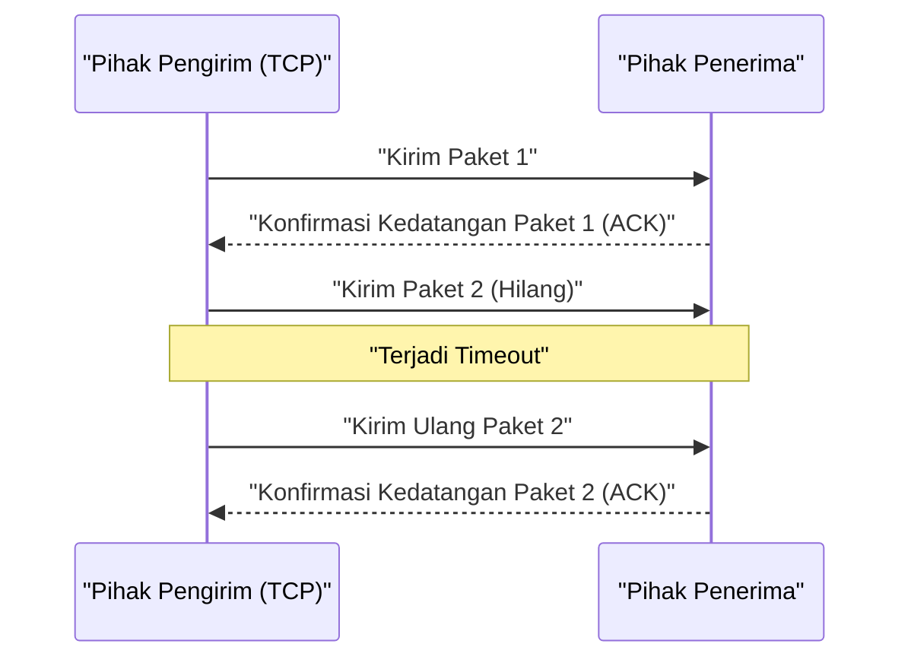

## 1. Kecepatan atau Akurasi. Pilihan Utama di Internet

Ketika kita bertukar data melalui internet, ada dua pemain utama dalam protokol (aturan komunikasi) yang bekerja di fondasinya (lapisan transport).
Salah satunya adalah "**TCP (Transmission Control Protocol)**", yang menangani sebagian besar komunikasi internet, seperti menjelajahi situs web dan mengunduh file.
Dan yang satu lagi adalah tokoh utama artikel ini, "**UDP (User Datagram Protocol)**".

Jika TCP adalah "pengantar barang yang sopan seperti pos tercatat yang tidak akan pernah menghilangkan paket Anda", maka UDP seperti "mesin pelempar bola super cepat yang terus-menerus melemparkan paket dan tidak pernah menoleh ke belakang meskipun paketnya tidak sampai".

Mengapa internet membutuhkan protokol yang "tidak memiliki jaminan pengiriman"?

## 2. Keterbatasan TCP: Keterlambatan yang Disebabkan oleh "Akurasi"

Untuk memahami perlunya UDP, pertama-tama mari kita lihat bagaimana rivalnya, TCP, bekerja.

TCP adalah protokol "**berorientasi koneksi** (connection-oriented)". Sebelum mengirim data, ia selalu melakukan konfirmasi awal (3-way handshake) dengan penerima: "Bolehkah saya mengirim sekarang?" "Ya, silakan."
Selain itu, ketika mengirim data dalam potongan-potongan kecil (paket), ia memberikan nomor urut ke semua paket dan menunggu konfirmasi penerimaan (ACK) dari pihak lain seperti "Nomor 1 diterima" dan "Nomor 2 diterima". Jika paket nomor 3 hilang di jaringan dan tidak ada konfirmasi penerimaan yang masuk, TCP mendeteksinya dengan timer dan memulai ulang dengan mengatakan, "Mengirim ulang nomor 3."

Berkat mekanisme ini, kita dapat melihat gambar yang indah atau mengunduh program tanpa kehilangan satu byte pun.
Namun, proses "konfirmasi" dan "pengiriman ulang" ini menciptakan **keterlambatan waktu (latensi) yang fatal**.

## 3. Filosofi UDP: "Tidak Apa-Apa Jika Tidak Sampai, Kirim Sekarang Juga"

Dalam aplikasi di mana real-time sangat penting, seperti "game online (FPS dan game fighting)", "panggilan video seperti Zoom", dan "siaran langsung olahraga", kesopanan TCP justru menjadi bumerang.

Misalkan data audio terputus sesaat selama panggilan video. Jika menggunakan TCP, sistem akan memproses, "Data audio dari 0,5 detik yang lalu belum sampai, jadi kami akan mengirimnya ulang. Sampai saat itu, seluruh video akan dijeda sementara." Akibatnya, layar akan terhenti dan patah-patah.
Bagi manusia, dalam panggilan real-time, jauh lebih penting untuk "membiarkan audio saat ini terus mengalir, meskipun ada sedikit noise" daripada "menerima audio masa lalu yang tertunda selama 0,5 detik dengan bersih".

Di sinilah UDP, yang bertipe "**tanpa koneksi** (connectionless)", bersinar.

UDP sama sekali tidak memeriksa apakah pihak lain siap menerima. Ia tidak memberikan nomor urut ke paket, tidak memeriksa apakah paket telah tiba, dan tidak melakukan proses pengiriman ulang.
Ia hanya terus-menerus melemparkan data yang diterima dari aplikasi ke lautan jaringan hanya dengan menambahkan header (sejumlah kecil metadata seperti informasi tujuan).

### Header UDP Sangat Ringan
Sementara header TCP biasanya membawa 20 byte berbagai informasi kontrol, header UDP hanya berukuran "**8 byte**".
1. Nomor port sumber (2 byte)
2. Nomor port tujuan (2 byte)
3. Panjang paket (2 byte)
4. Checksum (2 byte: konfirmasi minimal untuk memastikan tidak ada kerusakan data)

Keringanan dan kesederhanaan pemrosesan yang luar biasa inilah yang memangkas latensi komunikasi hingga batas maksimal dan memungkinkan pengalaman real-time.

## 4. Tempat UDP Beraksi

Karakteristik UDP yang "ringan dan cepat, tetapi tidak dapat diandalkan" digunakan di seluruh infrastruktur internet modern.

* **DNS (Domain Name System)**
  Ini adalah sistem yang mengubah URL (misalnya: google.com) menjadi alamat IP. Permintaan ke DNS adalah data yang sangat kecil, dan jika tidak ada balasan, Anda cukup bertanya lagi, sehingga UDP berkecepatan tinggi digunakan.
* **NTP (Network Time Protocol)**
  Ini adalah komunikasi untuk menyinkronkan jam PC atau ponsel cerdas secara akurat. Karena informasi waktu tidak ada artinya jika sudah usang, UDP, yang menghindari penundaan akibat pengiriman ulang, sangat ideal.
* **Distribusi Streaming dan VoIP**
  Siaran langsung YouTube, panggilan LINE, panggilan suara Discord, dll., mencapai komunikasi UDP tanpa jeda dengan menginterpolasi (memprediksi dan mengisi) beberapa paket yang hilang di sisi perangkat lunak.

## 5. Evolusi Baru: Protokol "QUIC"

Selama bertahun-tahun, internet telah terbagi menjadi "TCP yang akurat" dan "UDP yang cepat", tetapi dalam beberapa tahun terakhir, sebuah revolusi telah terjadi yang mengubah sejarah ini.
Itu adalah protokol "**QUIC**", yang dikembangkan oleh Google dan menjadi fondasi "HTTP/3" saat ini.

Ingin mempercepat tampilan situs web, Google menyadari bahwa TCP telah mencapai batasnya dalam "penundaan yang diperlukan untuk sapaan awal (handshake)". Oleh karena itu, alih-alih meningkatkan TCP, mereka **secara mengejutkan menggunakan UDP sebagai basis, dan di atasnya membangun "prosedur komunikasi yang cepat dan akurat" milik mereka sendiri yang dikendalikan oleh perangkat lunak**.

Karena basisnya adalah UDP, QUIC dapat memotong kontrol TCP yang rumit di kernel OS, dan dengan secara bersamaan melakukan handshake komunikasi terenkripsi (TLS) miliknya sendiri, QUIC secara dramatis mengurangi waktu hingga komunikasi dimulai. Saat ini, ketika kita menonton YouTube atau menggunakan layanan Google, di balik layar, bukan TCP yang dengan cepat membawa data, melainkan QUIC berbasis UDP.

Fakta bahwa UDP, yang terus disebut "tidak dapat diandalkan", telah berhasil dipromosikan menjadi fondasi infrastruktur web mutakhir saat ini dengan kecerdikan, menceritakan betapa kuatnya senjata "keringanan dan kesederhanaan" dalam desain jaringan komputer.
