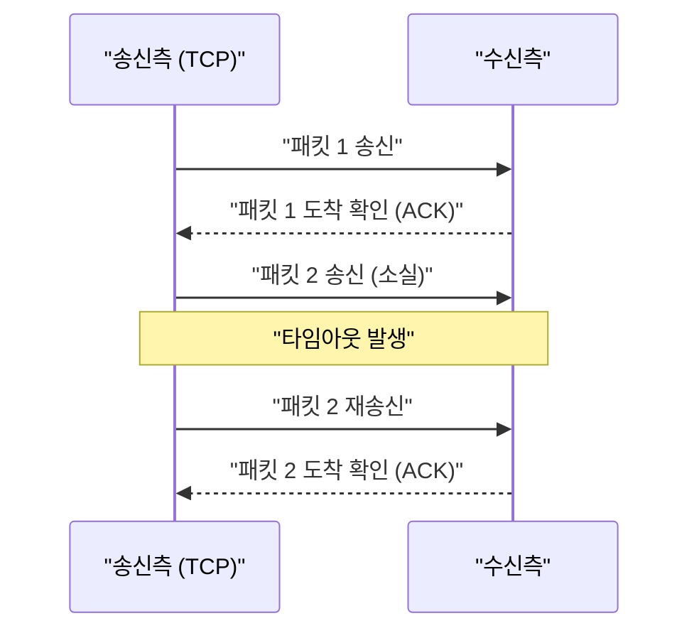

## 1. 속도인가, 정확성인가. 인터넷의 궁극적인 선택

우리가 인터넷을 통해 데이터를 주고받을 때, 그 토대(전송 계층)에서 일하는 프로토콜(통신 규약)에는 크게 두 명의 주역이 존재합니다.
하나는 웹 사이트 열람이나 파일 다운로드 등 인터넷 통신의 대부분을 담당하는 「 **TCP (Transmission Control Protocol)** 」.
그리고 또 다른 하나가 본 기사의 주역인 「 **UDP (User Datagram Protocol)** 」 입니다.

TCP가 '절대로 수화물을 분실하지 않는, 등기 우편과 같은 정중한 배달원'이라고 한다면, UDP는 '수화물을 차례차례 던지며, 닿지 않아도 뒤돌아보지 않는 초고속 피칭 머신'과 같은 존재입니다.

왜 인터넷에는 '도달 보장'이 없는 프로토콜이 필요한 것일까요?

## 2. TCP의 한계: '정확성'이 가져오는 지연

UDP의 필요성을 이해하기 위해, 우선 라이벌인 TCP의 움직임을 살펴보겠습니다.

TCP는 「 **연결 지향** 」 프로토콜입니다. 데이터를 보내기 전에 상대방에게 '지금부터 보내도 될까요?', '좋습니다'라는 사전 확인(3-way 핸드셰이크)을 반드시 수행합니다.
게다가 데이터를 잘게 나누어(패킷) 보낼 때, 모든 패킷에 순서 번호를 부여하고 상대방으로부터 '1번 도착했습니다', '2번 도착했습니다'라는 수신 확인(ACK)을 기다립니다. 만약 도중에 3번 패킷이 네트워크 상에서 길을 잃어 수신 확인이 오지 않는다면, TCP는 타이머로 이를 감지하고 '3번을 재송신합니다'라며 다시 시도합니다.

이러한 구조 덕분에, 우리는 1바이트의 누락도 없이 깨끗한 이미지를 보거나 프로그램을 다운로드할 수 있습니다.
그러나 이 '확인'과 '재송신'의 프로세스는 **치명적인 시간적 지연 (레이턴시)** 을 발생시킵니다.

## 3. UDP의 철학: '닿지 않아도 좋으니, 지금 당장 보내라'

실시간성이 극히 중요한 애플리케이션, 예를 들어 '온라인 게임 (FPS나 격투 게임)'이나 'Zoom 등의 비디오 통화', '스포츠 라이브 스트리밍'에서 TCP의 정중함은 오히려 독이 됩니다.

비디오 통화 중에 아주 잠깐 음성 데이터가 끊겼다고 가정해 봅시다. 만약 TCP를 사용하고 있다면 시스템은 '방금 전 0.5초 전의 음성 데이터가 도착하지 않았으므로 재송신합니다. 그때까지 영상 전체를 일시 정지시키겠습니다'라는 처리를 수행합니다. 결과적으로 화면이 뚝뚝 끊기며 멈춰버립니다.
인간에게 있어 실시간 통화에서는 '0.5초 전 과거의 음성이 늦더라도 깨끗하게 전달되는' 것보다 '약간의 노이즈가 들어가도 괜찮으니, 지금의 음성을 그대로 계속 내보내는' 것이 훨씬 더 중요합니다.

여기서 활약하는 것이 「 **비연결형** 」 인 UDP입니다.

UDP는 상대방이 받을 준비가 되어 있는지 확인을 전혀 하지 않습니다. 패킷에 순서도 부여하지 않고, 도착했는지 확인도, 재송신 처리도 하지 않습니다.
그저 묵묵히 애플리케이션으로부터 전달받은 데이터를 헤더(목적지 정보 등의 약간의 메타데이터)만 붙여 네트워크의 바다로 '내던져버릴' 뿐입니다.

### UDP 헤더는 극한까지 가볍다
TCP 헤더가 통상 20바이트의 다양한 제어 정보를 가지는 것에 비해, UDP 헤더는 불과 「 **8바이트** 」 밖에 되지 않습니다.
1. 송신지 포트 번호 (2바이트)
2. 목적지 포트 번호 (2바이트)
3. 패킷 길이 (2바이트)
4. 체크섬 (2바이트: 데이터 파손이 없는지에 대한 최소한의 확인)

이 압도적인 가벼움과 처리의 단순함이 통신 레이턴시를 극한까지 깎아내려, 실시간 경험을 가능하게 하는 것입니다.

## 4. UDP의 활약 장소

UDP의 '가볍고 빠르지만, 신뢰성이 없다'는 특성은 현대 인터넷 인프라 곳곳에서 이용되고 있습니다.

* **DNS (Domain Name System)**
  URL(예: google.com)을 IP 주소로 변환하는 시스템입니다. DNS에 대한 질의는 매우 작은 데이터이며, 만약 응답이 오지 않으면 다시 한 번 질의하면 되기 때문에 고속의 UDP가 사용됩니다.
* **NTP (Network Time Protocol)**
  PC나 스마트폰의 시계를 정확하게 맞추기 위한 통신입니다. 시간 정보는 오래되면 의미가 없으므로 재송신에 의한 지연을 꺼리는 UDP가 최적입니다.
* **스트리밍 서비스와 VoIP**
  YouTube의 라이브 스트리밍이나 LINE 통화, Discord의 음성 통화 등은 일부 패킷 누락을 소프트웨어 측에서 보간(예측하여 채움)함으로써 지연 없는 UDP 통신을 실현하고 있습니다.

## 5. 새로운 진화: 'QUIC' 프로토콜

오랜 세월 인터넷은 '정확한 TCP'와 '빠른 UDP'로 양분되어 왔습니다만, 최근 이 역사를 바꾸는 혁명이 일어났습니다.
그것이 바로 Google이 개발하여 현재 'HTTP/3'의 기반이 된 프로토콜 「 **QUIC (퀵)** 」 입니다.

웹 사이트 표시를 더욱 고속화하고 싶었던 Google은 TCP의 '첫인사(핸드셰이크)에 걸리는 지연'이 한계에 달했음을 깨달았습니다. 그래서 그들은 TCP를 개량하는 것이 아니라, **무려 UDP를 기반으로 그 위에 소프트웨어 제어에 의한 독자적인 '빠르고 정확한 통신 절차'를 만들어낸** 것입니다.

QUIC는 기반이 UDP이기 때문에 OS 커널의 복잡한 TCP 제어를 우회할 수 있으며, 독자적인 암호화 통신(TLS)의 핸드셰이크를 동시에 수행함으로써 통신 개시까지의 시간을 극적으로 단축했습니다. 현재 우리가 YouTube를 보거나 Google의 서비스를 사용할 때, 그 이면에서는 TCP가 아니라 UDP 기반의 QUIC가 폭발적인 속도로 데이터를 나르고 있습니다.

'신뢰할 수 없다'는 말을 계속 듣던 UDP가 아이디어에 따라 현대의 최첨단 웹 인프라의 토대로 크게 출세한 사실은, 컴퓨터 네트워크 설계에서 '가벼움과 단순함'이 얼마나 강력한 무기가 되는지를 이야기해 줍니다.
