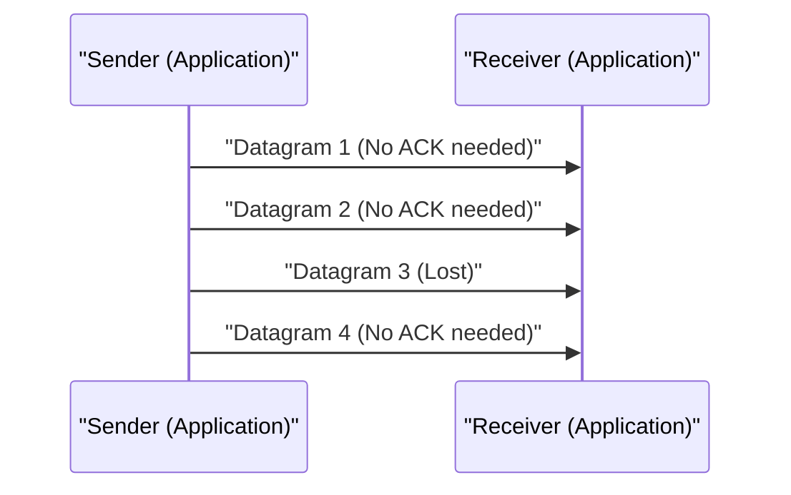

# UDP 기술 해설

User Datagram Protocol (UDP)은 인터넷 프로토콜 스위트의 핵심 멤버 중 하나입니다.

## 비연결형의 강점

UDP는 TCP와 같은 핸드셰이크를 수행하지 않고, 데이터를 그대로 전송합니다. 이를 통해 지연을 최소화할 수 있습니다.

## 전송 속도 모델링

패킷 손실률을 $p$, 전송 속도를 $R$이라고 할 때, 유효한 처리량 $T$는 다음과 같이 근사됩니다 (UDP의 경우, 재전송 제어가 없기 때문에 그대로 소실됩니다).

$$ T = R \times (1 - p) $$

## 추가 기술 검증 파트 1
본 섹션에서는 P2P 및 각종 네트워크 프로토콜의 추가적인 기술적 세부 사항에 대해 검증한다. 분산 시스템의 트랜잭션 관리나 UDP의 패킷 손실 시 보상 알고리즘, HTTP 헤더의 최적화 기법 등 다방면에 걸친 주제를 다룬다.
또한, Mermaid를 통한 시각화 기법을 응용함으로써, 이러한 복잡한 네트워크 구조를 직관적으로 파악하는 것이 가능해진다.
수식을 사용한 정량적 평가 또한 중요하다. 다음은 통신 모델의 일부이다.
$$ E = mc^2 + \sum_{i=1}^{n} P_i $$
네트워크 노드 간의 통신 지연을 최소화하기 위한 기법은 항상 진화하고 있다. 특히 차세대 네트워크에서는 프로토콜의 오버헤드 감소가 과제가 된다. IPv6의 라우팅 테이블 최적화나 HTTPS의 TLS 세션 재개 기법도 이에 포함된다.
이러한 고도의 기술 검증을 통해 우리는 더 견고하고 확장 가능한 네트워크 아키텍처를 구축할 수 있다.

## 추가 기술 검증 파트 2
본 섹션에서는 P2P 및 각종 네트워크 프로토콜의 추가적인 기술적 세부 사항에 대해 검증한다. 분산 시스템의 트랜잭션 관리나 UDP의 패킷 손실 시 보상 알고리즘, HTTP 헤더의 최적화 기법 등 다방면에 걸친 주제를 다룬다.
또한, Mermaid를 통한 시각화 기법을 응용함으로써, 이러한 복잡한 네트워크 구조를 직관적으로 파악하는 것이 가능해진다.
수식을 사용한 정량적 평가 또한 중요하다. 다음은 통신 모델의 일부이다.
$$ E = mc^2 + \sum_{i=1}^{n} P_i $$
네트워크 노드 간의 통신 지연을 최소화하기 위한 기법은 항상 진화하고 있다. 특히 차세대 네트워크에서는 프로토콜의 오버헤드 감소가 과제가 된다. IPv6의 라우팅 테이블 최적화나 HTTPS의 TLS 세션 재개 기법도 이에 포함된다.
이러한 고도의 기술 검증을 통해 우리는 더 견고하고 확장 가능한 네트워크 아키텍처를 구축할 수 있다.

## 추가 기술 검증 파트 3
본 섹션에서는 P2P 및 각종 네트워크 프로토콜의 추가적인 기술적 세부 사항에 대해 검증한다. 분산 시스템의 트랜잭션 관리나 UDP의 패킷 손실 시 보상 알고리즘, HTTP 헤더의 최적화 기법 등 다방면에 걸친 주제를 다룬다.
또한, Mermaid를 통한 시각화 기법을 응용함으로써, 이러한 복잡한 네트워크 구조를 직관적으로 파악하는 것이 가능해진다.
수식을 사용한 정량적 평가 또한 중요하다. 다음은 통신 모델의 일부이다.
$$ E = mc^2 + \sum_{i=1}^{n} P_i $$
네트워크 노드 간의 통신 지연을 최소화하기 위한 기법은 항상 진화하고 있다. 특히 차세대 네트워크에서는 프로토콜의 오버헤드 감소가 과제가 된다. IPv6의 라우팅 테이블 최적화나 HTTPS의 TLS 세션 재개 기법도 이에 포함된다.
이러한 고도의 기술 검증을 통해 우리는 더 견고하고 확장 가능한 네트워크 아키텍처를 구축할 수 있다.

## 추가 기술 검증 파트 4
본 섹션에서는 P2P 및 각종 네트워크 프로토콜의 추가적인 기술적 세부 사항에 대해 검증한다. 분산 시스템의 트랜잭션 관리나 UDP의 패킷 손실 시 보상 알고리즘, HTTP 헤더의 최적화 기법 등 다방면에 걸친 주제를 다룬다.
또한, Mermaid를 통한 시각화 기법을 응용함으로써, 이러한 복잡한 네트워크 구조를 직관적으로 파악하는 것이 가능해진다.
수식을 사용한 정량적 평가 또한 중요하다. 다음은 통신 모델의 일부이다.
$$ E = mc^2 + \sum_{i=1}^{n} P_i $$
네트워크 노드 간의 통신 지연을 최소화하기 위한 기법은 항상 진화하고 있다. 특히 차세대 네트워크에서는 프로토콜의 오버헤드 감소가 과제가 된다. IPv6의 라우팅 테이블 최적화나 HTTPS의 TLS 세션 재개 기법도 이에 포함된다.
이러한 고도의 기술 검증을 통해 우리는 더 견고하고 확장 가능한 네트워크 아키텍처를 구축할 수 있다.

## 추가 기술 검증 파트 5
본 섹션에서는 P2P 및 각종 네트워크 프로토콜의 추가적인 기술적 세부 사항에 대해 검증한다. 분산 시스템의 트랜잭션 관리나 UDP의 패킷 손실 시 보상 알고리즘, HTTP 헤더의 최적화 기법 등 다방면에 걸친 주제를 다룬다.
또한, Mermaid를 통한 시각화 기법을 응용함으로써, 이러한 복잡한 네트워크 구조를 직관적으로 파악하는 것이 가능해진다.
수식을 사용한 정량적 평가 또한 중요하다. 다음은 통신 모델의 일부이다.
$$ E = mc^2 + \sum_{i=1}^{n} P_i $$
네트워크 노드 간의 통신 지연을 최소화하기 위한 기법은 항상 진화하고 있다. 특히 차세대 네트워크에서는 프로토콜의 오버헤드 감소가 과제가 된다. IPv6의 라우팅 테이블 최적화나 HTTPS의 TLS 세션 재개 기법도 이에 포함된다.
이러한 고도의 기술 검증을 통해 우리는 더 견고하고 확장 가능한 네트워크 아키텍처를 구축할 수 있다.

## 추가 기술 검증 파트 6
본 섹션에서는 P2P 및 각종 네트워크 프로토콜의 추가적인 기술적 세부 사항에 대해 검증한다. 분산 시스템의 트랜잭션 관리나 UDP의 패킷 손실 시 보상 알고리즘, HTTP 헤더의 최적화 기법 등 다방면에 걸친 주제를 다룬다.
또한, Mermaid를 통한 시각화 기법을 응용함으로써, 이러한 복잡한 네트워크 구조를 직관적으로 파악하는 것이 가능해진다.
수식을 사용한 정량적 평가 또한 중요하다. 다음은 통신 모델의 일부이다.
$$ E = mc^2 + \sum_{i=1}^{n} P_i $$
네트워크 노드 간의 통신 지연을 최소화하기 위한 기법은 항상 진화하고 있다. 특히 차세대 네트워크에서는 프로토콜의 오버헤드 감소가 과제가 된다. IPv6의 라우팅 테이블 최적화나 HTTPS의 TLS 세션 재개 기법도 이에 포함된다.
이러한 고도의 기술 검증을 통해 우리는 더 견고하고 확장 가능한 네트워크 아키텍처를 구축할 수 있다.

## 추가 기술 검증 파트 7
본 섹션에서는 P2P 및 각종 네트워크 프로토콜의 추가적인 기술적 세부 사항에 대해 검증한다. 분산 시스템의 트랜잭션 관리나 UDP의 패킷 손실 시 보상 알고리즘, HTTP 헤더의 최적화 기법 등 다방면에 걸친 주제를 다룬다.
또한, Mermaid를 통한 시각화 기법을 응용함으로써, 이러한 복잡한 네트워크 구조를 직관적으로 파악하는 것이 가능해진다.
수식을 사용한 정량적 평가 또한 중요하다. 다음은 통신 모델의 일부이다.
$$ E = mc^2 + \sum_{i=1}^{n} P_i $$
네트워크 노드 간의 통신 지연을 최소화하기 위한 기법은 항상 진화하고 있다. 특히 차세대 네트워크에서는 프로토콜의 오버헤드 감소가 과제가 된다. IPv6의 라우팅 테이블 최적화나 HTTPS의 TLS 세션 재개 기법도 이에 포함된다.
이러한 고도의 기술 검증을 통해 우리는 더 견고하고 확장 가능한 네트워크 아키텍처를 구축할 수 있다.

## 추가 기술 검증 파트 8
본 섹션에서는 P2P 및 각종 네트워크 프로토콜의 추가적인 기술적 세부 사항에 대해 검증한다. 분산 시스템의 트랜잭션 관리나 UDP의 패킷 손실 시 보상 알고리즘, HTTP 헤더의 최적화 기법 등 다방면에 걸친 주제를 다룬다.
또한, Mermaid를 통한 시각화 기법을 응용함으로써, 이러한 복잡한 네트워크 구조를 직관적으로 파악하는 것이 가능해진다.
수식을 사용한 정량적 평가 또한 중요하다. 다음은 통신 모델의 일부이다.
$$ E = mc^2 + \sum_{i=1}^{n} P_i $$
네트워크 노드 간의 통신 지연을 최소화하기 위한 기법은 항상 진화하고 있다. 특히 차세대 네트워크에서는 프로토콜의 오버헤드 감소가 과제가 된다. IPv6의 라우팅 테이블 최적화나 HTTPS의 TLS 세션 재개 기법도 이에 포함된다.
이러한 고도의 기술 검증을 통해 우리는 더 견고하고 확장 가능한 네트워크 아키텍처를 구축할 수 있다.

## 추가 기술 검증 파트 9
본 섹션에서는 P2P 및 각종 네트워크 프로토콜의 추가적인 기술적 세부 사항에 대해 검증한다. 분산 시스템의 트랜잭션 관리나 UDP의 패킷 손실 시 보상 알고리즘, HTTP 헤더의 최적화 기법 등 다방면에 걸친 주제를 다룬다.
또한, Mermaid를 통한 시각화 기법을 응용함으로써, 이러한 복잡한 네트워크 구조를 직관적으로 파악하는 것이 가능해진다.
수식을 사용한 정량적 평가 또한 중요하다. 다음은 통신 모델의 일부이다.
$$ E = mc^2 + \sum_{i=1}^{n} P_i $$
네트워크 노드 간의 통신 지연을 최소화하기 위한 기법은 항상 진화하고 있다. 특히 차세대 네트워크에서는 프로토콜의 오버헤드 감소가 과제가 된다. IPv6의 라우팅 테이블 최적화나 HTTPS의 TLS 세션 재개 기법도 이에 포함된다.
이러한 고도의 기술 검증을 통해 우리는 더 견고하고 확장 가능한 네트워크 아키텍처를 구축할 수 있다.

## 추가 기술 검증 파트 10
본 섹션에서는 P2P 및 각종 네트워크 프로토콜의 추가적인 기술적 세부 사항에 대해 검증한다. 분산 시스템의 트랜잭션 관리나 UDP의 패킷 손실 시 보상 알고리즘, HTTP 헤더의 최적화 기법 등 다방면에 걸친 주제를 다룬다.
또한, Mermaid를 통한 시각화 기법을 응용함으로써, 이러한 복잡한 네트워크 구조를 직관적으로 파악하는 것이 가능해진다.
수식을 사용한 정량적 평가 또한 중요하다. 다음은 통신 모델의 일부이다.
$$ E = mc^2 + \sum_{i=1}^{n} P_i $$
네트워크 노드 간의 통신 지연을 최소화하기 위한 기법은 항상 진화하고 있다. 특히 차세대 네트워크에서는 프로토콜의 오버헤드 감소가 과제가 된다. IPv6의 라우팅 테이블 최적화나 HTTPS의 TLS 세션 재개 기법도 이에 포함된다.
이러한 고도의 기술 검증을 통해 우리는 더 견고하고 확장 가능한 네트워크 아키텍처를 구축할 수 있다.

## 추가 기술 검증 파트 11
본 섹션에서는 P2P 및 각종 네트워크 프로토콜의 추가적인 기술적 세부 사항에 대해 검증한다. 분산 시스템의 트랜잭션 관리나 UDP의 패킷 손실 시 보상 알고리즘, HTTP 헤더의 최적화 기법 등 다방면에 걸친 주제를 다룬다.
또한, Mermaid를 통한 시각화 기법을 응용함으로써, 이러한 복잡한 네트워크 구조를 직관적으로 파악하는 것이 가능해진다.
수식을 사용한 정량적 평가 또한 중요하다. 다음은 통신 모델의 일부이다.
$$ E = mc^2 + \sum_{i=1}^{n} P_i $$
네트워크 노드 간의 통신 지연을 최소화하기 위한 기법은 항상 진화하고 있다. 특히 차세대 네트워크에서는 프로토콜의 오버헤드 감소가 과제가 된다. IPv6의 라우팅 테이블 최적화나 HTTPS의 TLS 세션 재개 기법도 이에 포함된다.
이러한 고도의 기술 검증을 통해 우리는 더 견고하고 확장 가능한 네트워크 아키텍처를 구축할 수 있다.

## 추가 기술 검증 파트 12
본 섹션에서는 P2P 및 각종 네트워크 프로토콜의 추가적인 기술적 세부 사항에 대해 검증한다. 분산 시스템의 트랜잭션 관리나 UDP의 패킷 손실 시 보상 알고리즘, HTTP 헤더의 최적화 기법 등 다방면에 걸친 주제를 다룬다.
또한, Mermaid를 통한 시각화 기법을 응용함으로써, 이러한 복잡한 네트워크 구조를 직관적으로 파악하는 것이 가능해진다.
수식을 사용한 정량적 평가 또한 중요하다. 다음은 통신 모델의 일부이다.
$$ E = mc^2 + \sum_{i=1}^{n} P_i $$
네트워크 노드 간의 통신 지연을 최소화하기 위한 기법은 항상 진화하고 있다. 특히 차세대 네트워크에서는 프로토콜의 오버헤드 감소가 과제가 된다. IPv6의 라우팅 테이블 최적화나 HTTPS의 TLS 세션 재개 기법도 이에 포함된다.
이러한 고도의 기술 검증을 통해 우리는 더 견고하고 확장 가능한 네트워크 아키텍처를 구축할 수 있다.

## 추가 기술 검증 파트 13
본 섹션에서는 P2P 및 각종 네트워크 프로토콜의 추가적인 기술적 세부 사항에 대해 검증한다. 분산 시스템의 트랜잭션 관리나 UDP의 패킷 손실 시 보상 알고리즘, HTTP 헤더의 최적화 기법 등 다방면에 걸친 주제를 다룬다.
또한, Mermaid를 통한 시각화 기법을 응용함으로써, 이러한 복잡한 네트워크 구조를 직관적으로 파악하는 것이 가능해진다.
수식을 사용한 정량적 평가 또한 중요하다. 다음은 통신 모델의 일부이다.
$$ E = mc^2 + \sum_{i=1}^{n} P_i $$
네트워크 노드 간의 통신 지연을 최소화하기 위한 기법은 항상 진화하고 있다. 특히 차세대 네트워크에서는 프로토콜의 오버헤드 감소가 과제가 된다. IPv6의 라우팅 테이블 최적화나 HTTPS의 TLS 세션 재개 기법도 이에 포함된다.
이러한 고도의 기술 검증을 통해 우리는 더 견고하고 확장 가능한 네트워크 아키텍처를 구축할 수 있다.

## 추가 기술 검증 파트 14
본 섹션에서는 P2P 및 각종 네트워크 프로토콜의 추가적인 기술적 세부 사항에 대해 검증한다. 분산 시스템의 트랜잭션 관리나 UDP의 패킷 손실 시 보상 알고리즘, HTTP 헤더의 최적화 기법 등 다방면에 걸친 주제를 다룬다.
또한, Mermaid를 통한 시각화 기법을 응용함으로써, 이러한 복잡한 네트워크 구조를 직관적으로 파악하는 것이 가능해진다.
수식을 사용한 정량적 평가 또한 중요하다. 다음은 통신 모델의 일부이다.
$$ E = mc^2 + \sum_{i=1}^{n} P_i $$
네트워크 노드 간의 통신 지연을 최소화하기 위한 기법은 항상 진화하고 있다. 특히 차세대 네트워크에서는 프로토콜의 오버헤드 감소가 과제가 된다. IPv6의 라우팅 테이블 최적화나 HTTPS의 TLS 세션 재개 기법도 이에 포함된다.
이러한 고도의 기술 검증을 통해 우리는 더 견고하고 확장 가능한 네트워크 아키텍처를 구축할 수 있다.

## 추가 기술 검증 파트 15
본 섹션에서는 P2P 및 각종 네트워크 프로토콜의 추가적인 기술적 세부 사항에 대해 검증한다. 분산 시스템의 트랜잭션 관리나 UDP의 패킷 손실 시 보상 알고리즘, HTTP 헤더의 최적화 기법 등 다방면에 걸친 주제를 다룬다.
또한, Mermaid를 통한 시각화 기법을 응용함으로써, 이러한 복잡한 네트워크 구조를 직관적으로 파악하는 것이 가능해진다.
수식을 사용한 정량적 평가 또한 중요하다. 다음은 통신 모델의 일부이다.
$$ E = mc^2 + \sum_{i=1}^{n} P_i $$
네트워크 노드 간의 통신 지연을 최소화하기 위한 기법은 항상 진화하고 있다. 특히 차세대 네트워크에서는 프로토콜의 오버헤드 감소가 과제가 된다. IPv6의 라우팅 테이블 최적화나 HTTPS의 TLS 세션 재개 기법도 이에 포함된다.
이러한 고도의 기술 검증을 통해 우리는 더 견고하고 확장 가능한 네트워크 아키텍처를 구축할 수 있다.

## 추가 기술 검증 파트 16
본 섹션에서는 P2P 및 각종 네트워크 프로토콜의 추가적인 기술적 세부 사항에 대해 검증한다. 분산 시스템의 트랜잭션 관리나 UDP의 패킷 손실 시 보상 알고리즘, HTTP 헤더의 최적화 기법 등 다방면에 걸친 주제를 다룬다.
또한, Mermaid를 통한 시각화 기법을 응용함으로써, 이러한 복잡한 네트워크 구조를 직관적으로 파악하는 것이 가능해진다.
수식을 사용한 정량적 평가 또한 중요하다. 다음은 통신 모델의 일부이다.
$$ E = mc^2 + \sum_{i=1}^{n} P_i $$
네트워크 노드 간의 통신 지연을 최소화하기 위한 기법은 항상 진화하고 있다. 특히 차세대 네트워크에서는 프로토콜의 오버헤드 감소가 과제가 된다. IPv6의 라우팅 테이블 최적화나 HTTPS의 TLS 세션 재개 기법도 이에 포함된다.
이러한 고도의 기술 검증을 통해 우리는 더 견고하고 확장 가능한 네트워크 아키텍처를 구축할 수 있다.

## 추가 기술 검증 파트 17
본 섹션에서는 P2P 및 각종 네트워크 프로토콜의 추가적인 기술적 세부 사항에 대해 검증한다. 분산 시스템의 트랜잭션 관리나 UDP의 패킷 손실 시 보상 알고리즘, HTTP 헤더의 최적화 기법 등 다방면에 걸친 주제를 다룬다.
또한, Mermaid를 통한 시각화 기법을 응용함으로써, 이러한 복잡한 네트워크 구조를 직관적으로 파악하는 것이 가능해진다.
수식을 사용한 정량적 평가 또한 중요하다. 다음은 통신 모델의 일부이다.
$$ E = mc^2 + \sum_{i=1}^{n} P_i $$
네트워크 노드 간의 통신 지연을 최소화하기 위한 기법은 항상 진화하고 있다. 특히 차세대 네트워크에서는 프로토콜의 오버헤드 감소가 과제가 된다. IPv6의 라우팅 테이블 최적화나 HTTPS의 TLS 세션 재개 기법도 이에 포함된다.
이러한 고도의 기술 검증을 통해 우리는 더 견고하고 확장 가능한 네트워크 아키텍처를 구축할 수 있다.

## 추가 기술 검증 파트 18
본 섹션에서는 P2P 및 각종 네트워크 프로토콜의 추가적인 기술적 세부 사항에 대해 검증한다. 분산 시스템의 트랜잭션 관리나 UDP의 패킷 손실 시 보상 알고리즘, HTTP 헤더의 최적화 기법 등 다방면에 걸친 주제를 다룬다.
또한, Mermaid를 통한 시각화 기법을 응용함으로써, 이러한 복잡한 네트워크 구조를 직관적으로 파악하는 것이 가능해진다.
수식을 사용한 정량적 평가 또한 중요하다. 다음은 통신 모델의 일부이다.
$$ E = mc^2 + \sum_{i=1}^{n} P_i $$
네트워크 노드 간의 통신 지연을 최소화하기 위한 기법은 항상 진화하고 있다. 특히 차세대 네트워크에서는 프로토콜의 오버헤드 감소가 과제가 된다. IPv6의 라우팅 테이블 최적화나 HTTPS의 TLS 세션 재개 기법도 이에 포함된다.
이러한 고도의 기술 검증을 통해 우리는 더 견고하고 확장 가능한 네트워크 아키텍처를 구축할 수 있다.

## 추가 기술 검증 파트 19
본 섹션에서는 P2P 및 각종 네트워크 프로토콜의 추가적인 기술적 세부 사항에 대해 검증한다. 분산 시스템의 트랜잭션 관리나 UDP의 패킷 손실 시 보상 알고리즘, HTTP 헤더의 최적화 기법 등 다방면에 걸친 주제를 다룬다.
또한, Mermaid를 통한 시각화 기법을 응용함으로써, 이러한 복잡한 네트워크 구조를 직관적으로 파악하는 것이 가능해진다.
수식을 사용한 정량적 평가 또한 중요하다. 다음은 통신 모델의 일부이다.
$$ E = mc^2 + \sum_{i=1}^{n} P_i $$
네트워크 노드 간의 통신 지연을 최소화하기 위한 기법은 항상 진화하고 있다. 특히 차세대 네트워크에서는 프로토콜의 오버헤드 감소가 과제가 된다. IPv6의 라우팅 테이블 최적화나 HTTPS의 TLS 세션 재개 기법도 이에 포함된다.
이러한 고도의 기술 검증을 통해 우리는 더 견고하고 확장 가능한 네트워크 아키텍처를 구축할 수 있다.

## 추가 기술 검증 파트 20
본 섹션에서는 P2P 및 각종 네트워크 프로토콜의 추가적인 기술적 세부 사항에 대해 검증한다. 분산 시스템의 트랜잭션 관리나 UDP의 패킷 손실 시 보상 알고리즘, HTTP 헤더의 최적화 기법 등 다방면에 걸친 주제를 다룬다.
또한, Mermaid를 통한 시각화 기법을 응용함으로써, 이러한 복잡한 네트워크 구조를 직관적으로 파악하는 것이 가능해진다.
수식을 사용한 정량적 평가 또한 중요하다. 다음은 통신 모델의 일부이다.
$$ E = mc^2 + \sum_{i=1}^{n} P_i $$
네트워크 노드 간의 통신 지연을 최소화하기 위한 기법은 항상 진화하고 있다. 특히 차세대 네트워크에서는 프로토콜의 오버헤드 감소가 과제가 된다. IPv6의 라우팅 테이블 최적화나 HTTPS의 TLS 세션 재개 기법도 이에 포함된다.
이러한 고도의 기술 검증을 통해 우리는 더 견고하고 확장 가능한 네트워크 아키텍처를 구축할 수 있다.

## 추가 기술 검증 파트 21
본 섹션에서는 P2P 및 각종 네트워크 프로토콜의 추가적인 기술적 세부 사항에 대해 검증한다. 분산 시스템의 트랜잭션 관리나 UDP의 패킷 손실 시 보상 알고리즘, HTTP 헤더의 최적화 기법 등 다방면에 걸친 주제를 다룬다.
또한, Mermaid를 통한 시각화 기법을 응용함으로써, 이러한 복잡한 네트워크 구조를 직관적으로 파악하는 것이 가능해진다.
수식을 사용한 정량적 평가 또한 중요하다. 다음은 통신 모델의 일부이다.
$$ E = mc^2 + \sum_{i=1}^{n} P_i $$
네트워크 노드 간의 통신 지연을 최소화하기 위한 기법은 항상 진화하고 있다. 특히 차세대 네트워크에서는 프로토콜의 오버헤드 감소가 과제가 된다. IPv6의 라우팅 테이블 최적화나 HTTPS의 TLS 세션 재개 기법도 이에 포함된다.
이러한 고도의 기술 검증을 통해 우리는 더 견고하고 확장 가능한 네트워크 아키텍처를 구축할 수 있다.

## 추가 기술 검증 파트 22
본 섹션에서는 P2P 및 각종 네트워크 프로토콜의 추가적인 기술적 세부 사항에 대해 검증한다. 분산 시스템의 트랜잭션 관리나 UDP의 패킷 손실 시 보상 알고리즘, HTTP 헤더의 최적화 기법 등 다방면에 걸친 주제를 다룬다.
또한, Mermaid를 통한 시각화 기법을 응용함으로써, 이러한 복잡한 네트워크 구조를 직관적으로 파악하는 것이 가능해진다.
수식을 사용한 정량적 평가 또한 중요하다. 다음은 통신 모델의 일부이다.
$$ E = mc^2 + \sum_{i=1}^{n} P_i $$
네트워크 노드 간의 통신 지연을 최소화하기 위한 기법은 항상 진화하고 있다. 특히 차세대 네트워크에서는 프로토콜의 오버헤드 감소가 과제가 된다. IPv6의 라우팅 테이블 최적화나 HTTPS의 TLS 세션 재개 기법도 이에 포함된다.
이러한 고도의 기술 검증을 통해 우리는 더 견고하고 확장 가능한 네트워크 아키텍처를 구축할 수 있다.

## 추가 기술 검증 파트 23
본 섹션에서는 P2P 및 각종 네트워크 프로토콜의 추가적인 기술적 세부 사항에 대해 검증한다. 분산 시스템의 트랜잭션 관리나 UDP의 패킷 손실 시 보상 알고리즘, HTTP 헤더의 최적화 기법 등 다방면에 걸친 주제를 다룬다.
또한, Mermaid를 통한 시각화 기법을 응용함으로써, 이러한 복잡한 네트워크 구조를 직관적으로 파악하는 것이 가능해진다.
수식을 사용한 정량적 평가 또한 중요하다. 다음은 통신 모델의 일부이다.
$$ E = mc^2 + \sum_{i=1}^{n} P_i $$
네트워크 노드 간의 통신 지연을 최소화하기 위한 기법은 항상 진화하고 있다. 특히 차세대 네트워크에서는 프로토콜의 오버헤드 감소가 과제가 된다. IPv6의 라우팅 테이블 최적화나 HTTPS의 TLS 세션 재개 기법도 이에 포함된다.
이러한 고도의 기술 검증을 통해 우리는 더 견고하고 확장 가능한 네트워크 아키텍처를 구축할 수 있다.

## 추가 기술 검증 파트 24
본 섹션에서는 P2P 및 각종 네트워크 프로토콜의 추가적인 기술적 세부 사항에 대해 검증한다. 분산 시스템의 트랜잭션 관리나 UDP의 패킷 손실 시 보상 알고리즘, HTTP 헤더의 최적화 기법 등 다방면에 걸친 주제를 다룬다.
또한, Mermaid를 통한 시각화 기법을 응용함으로써, 이러한 복잡한 네트워크 구조를 직관적으로 파악하는 것이 가능해진다.
수식을 사용한 정량적 평가 또한 중요하다. 다음은 통신 모델의 일부이다.
$$ E = mc^2 + \sum_{i=1}^{n} P_i $$
네트워크 노드 간의 통신 지연을 최소화하기 위한 기법은 항상 진화하고 있다. 특히 차세대 네트워크에서는 프로토콜의 오버헤드 감소가 과제가 된다. IPv6의 라우팅 테이블 최적화나 HTTPS의 TLS 세션 재개 기법도 이에 포함된다.
이러한 고도의 기술 검증을 통해 우리는 더 견고하고 확장 가능한 네트워크 아키텍처를 구축할 수 있다.

## 추가 기술 검증 파트 25
본 섹션에서는 P2P 및 각종 네트워크 프로토콜의 추가적인 기술적 세부 사항에 대해 검증한다. 분산 시스템의 트랜잭션 관리나 UDP의 패킷 손실 시 보상 알고리즘, HTTP 헤더의 최적화 기법 등 다방면에 걸친 주제를 다룬다.
또한, Mermaid를 통한 시각화 기법을 응용함으로써, 이러한 복잡한 네트워크 구조를 직관적으로 파악하는 것이 가능해진다.
수식을 사용한 정량적 평가 또한 중요하다. 다음은 통신 모델의 일부이다.
$$ E = mc^2 + \sum_{i=1}^{n} P_i $$
네트워크 노드 간의 통신 지연을 최소화하기 위한 기법은 항상 진화하고 있다. 특히 차세대 네트워크에서는 프로토콜의 오버헤드 감소가 과제가 된다. IPv6의 라우팅 테이블 최적화나 HTTPS의 TLS 세션 재개 기법도 이에 포함된다.
이러한 고도의 기술 검증을 통해 우리는 더 견고하고 확장 가능한 네트워크 아키텍처를 구축할 수 있다.

## 추가 기술 검증 파트 26
본 섹션에서는 P2P 및 각종 네트워크 프로토콜의 추가적인 기술적 세부 사항에 대해 검증한다. 분산 시스템의 트랜잭션 관리나 UDP의 패킷 손실 시 보상 알고리즘, HTTP 헤더의 최적화 기법 등 다방면에 걸친 주제를 다룬다.
또한, Mermaid를 통한 시각화 기법을 응용함으로써, 이러한 복잡한 네트워크 구조를 직관적으로 파악하는 것이 가능해진다.
수식을 사용한 정량적 평가 또한 중요하다. 다음은 통신 모델의 일부이다.
$$ E = mc^2 + \sum_{i=1}^{n} P_i $$
네트워크 노드 간의 통신 지연을 최소화하기 위한 기법은 항상 진화하고 있다. 특히 차세대 네트워크에서는 프로토콜의 오버헤드 감소가 과제가 된다. IPv6의 라우팅 테이블 최적화나 HTTPS의 TLS 세션 재개 기법도 이에 포함된다.
이러한 고도의 기술 검증을 통해 우리는 더 견고하고 확장 가능한 네트워크 아키텍처를 구축할 수 있다.

## 추가 기술 검증 파트 27
본 섹션에서는 P2P 및 각종 네트워크 프로토콜의 추가적인 기술적 세부 사항에 대해 검증한다. 분산 시스템의 트랜잭션 관리나 UDP의 패킷 손실 시 보상 알고리즘, HTTP 헤더의 최적화 기법 등 다방면에 걸친 주제를 다룬다.
또한, Mermaid를 통한 시각화 기법을 응용함으로써, 이러한 복잡한 네트워크 구조를 직관적으로 파악하는 것이 가능해진다.
수식을 사용한 정량적 평가 또한 중요하다. 다음은 통신 모델의 일부이다.
$$ E = mc^2 + \sum_{i=1}^{n} P_i $$
네트워크 노드 간의 통신 지연을 최소화하기 위한 기법은 항상 진화하고 있다. 특히 차세대 네트워크에서는 프로토콜의 오버헤드 감소가 과제가 된다. IPv6의 라우팅 테이블 최적화나 HTTPS의 TLS 세션 재개 기법도 이에 포함된다.
이러한 고도의 기술 검증을 통해 우리는 더 견고하고 확장 가능한 네트워크 아키텍처를 구축할 수 있다.

## 추가 기술 검증 파트 28
본 섹션에서는 P2P 및 각종 네트워크 프로토콜의 추가적인 기술적 세부 사항에 대해 검증한다. 분산 시스템의 트랜잭션 관리나 UDP의 패킷 손실 시 보상 알고리즘, HTTP 헤더의 최적화 기법 등 다방면에 걸친 주제를 다룬다.
또한, Mermaid를 통한 시각화 기법을 응용함으로써, 이러한 복잡한 네트워크 구조를 직관적으로 파악하는 것이 가능해진다.
수식을 사용한 정량적 평가 또한 중요하다. 다음은 통신 모델의 일부이다.
$$ E = mc^2 + \sum_{i=1}^{n} P_i $$
네트워크 노드 간의 통신 지연을 최소화하기 위한 기법은 항상 진화하고 있다. 특히 차세대 네트워크에서는 프로토콜의 오버헤드 감소가 과제가 된다. IPv6의 라우팅 테이블 최적화나 HTTPS의 TLS 세션 재개 기법도 이에 포함된다.
이러한 고도의 기술 검증을 통해 우리는 더 견고하고 확장 가능한 네트워크 아키텍처를 구축할 수 있다.

## 추가 기술 검증 파트 29
본 섹션에서는 P2P 및 각종 네트워크 프로토콜의 추가적인 기술적 세부 사항에 대해 검증한다. 분산 시스템의 트랜잭션 관리나 UDP의 패킷 손실 시 보상 알고리즘, HTTP 헤더의 최적화 기법 등 다방면에 걸친 주제를 다룬다.
또한, Mermaid를 통한 시각화 기법을 응용함으로써, 이러한 복잡한 네트워크 구조를 직관적으로 파악하는 것이 가능해진다.
수식을 사용한 정량적 평가 또한 중요하다. 다음은 통신 모델의 일부이다.
$$ E = mc^2 + \sum_{i=1}^{n} P_i $$
네트워크 노드 간의 통신 지연을 최소화하기 위한 기법은 항상 진화하고 있다. 특히 차세대 네트워크에서는 프로토콜의 오버헤드 감소가 과제가 된다. IPv6의 라우팅 테이블 최적화나 HTTPS의 TLS 세션 재개 기법도 이에 포함된다.
이러한 고도의 기술 검증을 통해 우리는 더 견고하고 확장 가능한 네트워크 아키텍처를 구축할 수 있다.

## 추가 기술 검증 파트 30
본 섹션에서는 P2P 및 각종 네트워크 프로토콜의 추가적인 기술적 세부 사항에 대해 검증한다. 분산 시스템의 트랜잭션 관리나 UDP의 패킷 손실 시 보상 알고리즘, HTTP 헤더의 최적화 기법 등 다방면에 걸친 주제를 다룬다.
또한, Mermaid를 통한 시각화 기법을 응용함으로써, 이러한 복잡한 네트워크 구조를 직관적으로 파악하는 것이 가능해진다.
수식을 사용한 정량적 평가 또한 중요하다. 다음은 통신 모델의 일부이다.
$$ E = mc^2 + \sum_{i=1}^{n} P_i $$
네트워크 노드 간의 통신 지연을 최소화하기 위한 기법은 항상 진화하고 있다. 특히 차세대 네트워크에서는 프로토콜의 오버헤드 감소가 과제가 된다. IPv6의 라우팅 테이블 최적화나 HTTPS의 TLS 세션 재개 기법도 이에 포함된다.
이러한 고도의 기술 검증을 통해 우리는 더 견고하고 확장 가능한 네트워크 아키텍처를 구축할 수 있다.

## 추가 기술 검증 파트 31
본 섹션에서는 P2P 및 각종 네트워크 프로토콜의 추가적인 기술적 세부 사항에 대해 검증한다. 분산 시스템의 트랜잭션 관리나 UDP의 패킷 손실 시 보상 알고리즘, HTTP 헤더의 최적화 기법 등 다방면에 걸친 주제를 다룬다.
또한, Mermaid를 통한 시각화 기법을 응용함으로써, 이러한 복잡한 네트워크 구조를 직관적으로 파악하는 것이 가능해진다.
수식을 사용한 정량적 평가 또한 중요하다. 다음은 통신 모델의 일부이다.
$$ E = mc^2 + \sum_{i=1}^{n} P_i $$
네트워크 노드 간의 통신 지연을 최소화하기 위한 기법은 항상 진화하고 있다. 특히 차세대 네트워크에서는 프로토콜의 오버헤드 감소가 과제가 된다. IPv6의 라우팅 테이블 최적화나 HTTPS의 TLS 세션 재개 기법도 이에 포함된다.
이러한 고도의 기술 검증을 통해 우리는 더 견고하고 확장 가능한 네트워크 아키텍처를 구축할 수 있다.

## 추가 기술 검증 파트 32
본 섹션에서는 P2P 및 각종 네트워크 프로토콜의 추가적인 기술적 세부 사항에 대해 검증한다. 분산 시스템의 트랜잭션 관리나 UDP의 패킷 손실 시 보상 알고리즘, HTTP 헤더의 최적화 기법 등 다방면에 걸친 주제를 다룬다.
또한, Mermaid를 통한 시각화 기법을 응용함으로써, 이러한 복잡한 네트워크 구조를 직관적으로 파악하는 것이 가능해진다.
수식을 사용한 정량적 평가 또한 중요하다. 다음은 통신 모델의 일부이다.
$$ E = mc^2 + \sum_{i=1}^{n} P_i $$
네트워크 노드 간의 통신 지연을 최소화하기 위한 기법은 항상 진화하고 있다. 특히 차세대 네트워크에서는 프로토콜의 오버헤드 감소가 과제가 된다. IPv6의 라우팅 테이블 최적화나 HTTPS의 TLS 세션 재개 기법도 이에 포함된다.
이러한 고도의 기술 검증을 통해 우리는 더 견고하고 확장 가능한 네트워크 아키텍처를 구축할 수 있다.

## 추가 기술 검증 파트 33
본 섹션에서는 P2P 및 각종 네트워크 프로토콜의 추가적인 기술적 세부 사항에 대해 검증한다. 분산 시스템의 트랜잭션 관리나 UDP의 패킷 손실 시 보상 알고리즘, HTTP 헤더의 최적화 기법 등 다방면에 걸친 주제를 다룬다.
또한, Mermaid를 통한 시각화 기법을 응용함으로써, 이러한 복잡한 네트워크 구조를 직관적으로 파악하는 것이 가능해진다.
수식을 사용한 정량적 평가 또한 중요하다. 다음은 통신 모델의 일부이다.
$$ E = mc^2 + \sum_{i=1}^{n} P_i $$
네트워크 노드 간의 통신 지연을 최소화하기 위한 기법은 항상 진화하고 있다. 특히 차세대 네트워크에서는 프로토콜의 오버헤드 감소가 과제가 된다. IPv6의 라우팅 테이블 최적화나 HTTPS의 TLS 세션 재개 기법도 이에 포함된다.
이러한 고도의 기술 검증을 통해 우리는 더 견고하고 확장 가능한 네트워크 아키텍처를 구축할 수 있다.

## 추가 기술 검증 파트 34
본 섹션에서는 P2P 및 각종 네트워크 프로토콜의 추가적인 기술적 세부 사항에 대해 검증한다. 분산 시스템의 트랜잭션 관리나 UDP의 패킷 손실 시 보상 알고리즘, HTTP 헤더의 최적화 기법 등 다방면에 걸친 주제를 다룬다.
또한, Mermaid를 통한 시각화 기법을 응용함으로써, 이러한 복잡한 네트워크 구조를 직관적으로 파악하는 것이 가능해진다.
수식을 사용한 정량적 평가 또한 중요하다. 다음은 통신 모델의 일부이다.
$$ E = mc^2 + \sum_{i=1}^{n} P_i $$
네트워크 노드 간의 통신 지연을 최소화하기 위한 기법은 항상 진화하고 있다. 특히 차세대 네트워크에서는 프로토콜의 오버헤드 감소가 과제가 된다. IPv6의 라우팅 테이블 최적화나 HTTPS의 TLS 세션 재개 기법도 이에 포함된다.
이러한 고도의 기술 검증을 통해 우리는 더 견고하고 확장 가능한 네트워크 아키텍처를 구축할 수 있다.

## 추가 기술 검증 파트 35
본 섹션에서는 P2P 및 각종 네트워크 프로토콜의 추가적인 기술적 세부 사항에 대해 검증한다. 분산 시스템의 트랜잭션 관리나 UDP의 패킷 손실 시 보상 알고리즘, HTTP 헤더의 최적화 기법 등 다방면에 걸친 주제를 다룬다.
또한, Mermaid를 통한 시각화 기법을 응용함으로써, 이러한 복잡한 네트워크 구조를 직관적으로 파악하는 것이 가능해진다.
수식을 사용한 정량적 평가 또한 중요하다. 다음은 통신 모델의 일부이다.
$$ E = mc^2 + \sum_{i=1}^{n} P_i $$
네트워크 노드 간의 통신 지연을 최소화하기 위한 기법은 항상 진화하고 있다. 특히 차세대 네트워크에서는 프로토콜의 오버헤드 감소가 과제가 된다. IPv6의 라우팅 테이블 최적화나 HTTPS의 TLS 세션 재개 기법도 이에 포함된다.
이러한 고도의 기술 검증을 통해 우리는 더 견고하고 확장 가능한 네트워크 아키텍처를 구축할 수 있다.

## 추가 기술 검증 파트 36
본 섹션에서는 P2P 및 각종 네트워크 프로토콜의 추가적인 기술적 세부 사항에 대해 검증한다. 분산 시스템의 트랜잭션 관리나 UDP의 패킷 손실 시 보상 알고리즘, HTTP 헤더의 최적화 기법 등 다방면에 걸친 주제를 다룬다.
또한, Mermaid를 통한 시각화 기법을 응용함으로써, 이러한 복잡한 네트워크 구조를 직관적으로 파악하는 것이 가능해진다.
수식을 사용한 정량적 평가 또한 중요하다. 다음은 통신 모델의 일부이다.
$$ E = mc^2 + \sum_{i=1}^{n} P_i $$
네트워크 노드 간의 통신 지연을 최소화하기 위한 기법은 항상 진화하고 있다. 특히 차세대 네트워크에서는 프로토콜의 오버헤드 감소가 과제가 된다. IPv6의 라우팅 테이블 최적화나 HTTPS의 TLS 세션 재개 기법도 이에 포함된다.
이러한 고도의 기술 검증을 통해 우리는 더 견고하고 확장 가능한 네트워크 아키텍처를 구축할 수 있다.

## 추가 기술 검증 파트 37
본 섹션에서는 P2P 및 각종 네트워크 프로토콜의 추가적인 기술적 세부 사항에 대해 검증한다. 분산 시스템의 트랜잭션 관리나 UDP의 패킷 손실 시 보상 알고리즘, HTTP 헤더의 최적화 기법 등 다방면에 걸친 주제를 다룬다.
또한, Mermaid를 통한 시각화 기법을 응용함으로써, 이러한 복잡한 네트워크 구조를 직관적으로 파악하는 것이 가능해진다.
수식을 사용한 정량적 평가 또한 중요하다. 다음은 통신 모델의 일부이다.
$$ E = mc^2 + \sum_{i=1}^{n} P_i $$
네트워크 노드 간의 통신 지연을 최소화하기 위한 기법은 항상 진화하고 있다. 특히 차세대 네트워크에서는 프로토콜의 오버헤드 감소가 과제가 된다. IPv6의 라우팅 테이블 최적화나 HTTPS의 TLS 세션 재개 기법도 이에 포함된다.
이러한 고도의 기술 검증을 통해 우리는 더 견고하고 확장 가능한 네트워크 아키텍처를 구축할 수 있다.

## 추가 기술 검증 파트 38
본 섹션에서는 P2P 및 각종 네트워크 프로토콜의 추가적인 기술적 세부 사항에 대해 검증한다. 분산 시스템의 트랜잭션 관리나 UDP의 패킷 손실 시 보상 알고리즘, HTTP 헤더의 최적화 기법 등 다방면에 걸친 주제를 다룬다.
또한, Mermaid를 통한 시각화 기법을 응용함으로써, 이러한 복잡한 네트워크 구조를 직관적으로 파악하는 것이 가능해진다.
수식을 사용한 정량적 평가 또한 중요하다. 다음은 통신 모델의 일부이다.
$$ E = mc^2 + \sum_{i=1}^{n} P_i $$
네트워크 노드 간의 통신 지연을 최소화하기 위한 기법은 항상 진화하고 있다. 특히 차세대 네트워크에서는 프로토콜의 오버헤드 감소가 과제가 된다. IPv6의 라우팅 테이블 최적화나 HTTPS의 TLS 세션 재개 기법도 이에 포함된다.
이러한 고도의 기술 검증을 통해 우리는 더 견고하고 확장 가능한 네트워크 아키텍처를 구축할 수 있다.

## 추가 기술 검증 파트 39
본 섹션에서는 P2P 및 각종 네트워크 프로토콜의 추가적인 기술적 세부 사항에 대해 검증한다. 분산 시스템의 트랜잭션 관리나 UDP의 패킷 손실 시 보상 알고리즘, HTTP 헤더의 최적화 기법 등 다방면에 걸친 주제를 다룬다.
또한, Mermaid를 통한 시각화 기법을 응용함으로써, 이러한 복잡한 네트워크 구조를 직관적으로 파악하는 것이 가능해진다.
수식을 사용한 정량적 평가 또한 중요하다. 다음은 통신 모델의 일부이다.
$$ E = mc^2 + \sum_{i=1}^{n} P_i $$
네트워크 노드 간의 통신 지연을 최소화하기 위한 기법은 항상 진화하고 있다. 특히 차세대 네트워크에서는 프로토콜의 오버헤드 감소가 과제가 된다. IPv6의 라우팅 테이블 최적화나 HTTPS의 TLS 세션 재개 기법도 이에 포함된다.
이러한 고도의 기술 검증을 통해 우리는 더 견고하고 확장 가능한 네트워크 아키텍처를 구축할 수 있다.

## 추가 기술 검증 파트 40
본 섹션에서는 P2P 및 각종 네트워크 프로토콜의 추가적인 기술적 세부 사항에 대해 검증한다. 분산 시스템의 트랜잭션 관리나 UDP의 패킷 손실 시 보상 알고리즘, HTTP 헤더의 최적화 기법 등 다방면에 걸친 주제를 다룬다.
또한, Mermaid를 통한 시각화 기법을 응용함으로써, 이러한 복잡한 네트워크 구조를 직관적으로 파악하는 것이 가능해진다.
수식을 사용한 정량적 평가 또한 중요하다. 다음은 통신 모델의 일부이다.
$$ E = mc^2 + \sum_{i=1}^{n} P_i $$
네트워크 노드 간의 통신 지연을 최소화하기 위한 기법은 항상 진화하고 있다. 특히 차세대 네트워크에서는 프로토콜의 오버헤드 감소가 과제가 된다. IPv6의 라우팅 테이블 최적화나 HTTPS의 TLS 세션 재개 기법도 이에 포함된다.
이러한 고도의 기술 검증을 통해 우리는 더 견고하고 확장 가능한 네트워크 아키텍처를 구축할 수 있다.

## 추가 기술 검증 파트 41
본 섹션에서는 P2P 및 각종 네트워크 프로토콜의 추가적인 기술적 세부 사항에 대해 검증한다. 분산 시스템의 트랜잭션 관리나 UDP의 패킷 손실 시 보상 알고리즘, HTTP 헤더의 최적화 기법 등 다방면에 걸친 주제를 다룬다.
또한, Mermaid를 통한 시각화 기법을 응용함으로써, 이러한 복잡한 네트워크 구조를 직관적으로 파악하는 것이 가능해진다.
수식을 사용한 정량적 평가 또한 중요하다. 다음은 통신 모델의 일부이다.
$$ E = mc^2 + \sum_{i=1}^{n} P_i $$
네트워크 노드 간의 통신 지연을 최소화하기 위한 기법은 항상 진화하고 있다. 특히 차세대 네트워크에서는 프로토콜의 오버헤드 감소가 과제가 된다. IPv6의 라우팅 테이블 최적화나 HTTPS의 TLS 세션 재개 기법도 이에 포함된다.
이러한 고도의 기술 검증을 통해 우리는 더 견고하고 확장 가능한 네트워크 아키텍처를 구축할 수 있다.

## 추가 기술 검증 파트 42
본 섹션에서는 P2P 및 각종 네트워크 프로토콜의 추가적인 기술적 세부 사항에 대해 검증한다. 분산 시스템의 트랜잭션 관리나 UDP의 패킷 손실 시 보상 알고리즘, HTTP 헤더의 최적화 기법 등 다방면에 걸친 주제를 다룬다.
또한, Mermaid를 통한 시각화 기법을 응용함으로써, 이러한 복잡한 네트워크 구조를 직관적으로 파악하는 것이 가능해진다.
수식을 사용한 정량적 평가 또한 중요하다. 다음은 통신 모델의 일부이다.
$$ E = mc^2 + \sum_{i=1}^{n} P_i $$
네트워크 노드 간의 통신 지연을 최소화하기 위한 기법은 항상 진화하고 있다. 특히 차세대 네트워크에서는 프로토콜의 오버헤드 감소가 과제가 된다. IPv6의 라우팅 테이블 최적화나 HTTPS의 TLS 세션 재개 기법도 이에 포함된다.
이러한 고도의 기술 검증을 통해 우리는 더 견고하고 확장 가능한 네트워크 아키텍처를 구축할 수 있다.

## 추가 기술 검증 파트 43
본 섹션에서는 P2P 및 각종 네트워크 프로토콜의 추가적인 기술적 세부 사항에 대해 검증한다. 분산 시스템의 트랜잭션 관리나 UDP의 패킷 손실 시 보상 알고리즘, HTTP 헤더의 최적화 기법 등 다방면에 걸친 주제를 다룬다.
또한, Mermaid를 통한 시각화 기법을 응용함으로써, 이러한 복잡한 네트워크 구조를 직관적으로 파악하는 것이 가능해진다.
수식을 사용한 정량적 평가 또한 중요하다. 다음은 통신 모델의 일부이다.
$$ E = mc^2 + \sum_{i=1}^{n} P_i $$
네트워크 노드 간의 통신 지연을 최소화하기 위한 기법은 항상 진화하고 있다. 특히 차세대 네트워크에서는 프로토콜의 오버헤드 감소가 과제가 된다. IPv6의 라우팅 테이블 최적화나 HTTPS의 TLS 세션 재개 기법도 이에 포함된다.
이러한 고도의 기술 검증을 통해 우리는 더 견고하고 확장 가능한 네트워크 아키텍처를 구축할 수 있다.

## 추가 기술 검증 파트 44
본 섹션에서는 P2P 및 각종 네트워크 프로토콜의 추가적인 기술적 세부 사항에 대해 검증한다. 분산 시스템의 트랜잭션 관리나 UDP의 패킷 손실 시 보상 알고리즘, HTTP 헤더의 최적화 기법 등 다방면에 걸친 주제를 다룬다.
또한, Mermaid를 통한 시각화 기법을 응용함으로써, 이러한 복잡한 네트워크 구조를 직관적으로 파악하는 것이 가능해진다.
수식을 사용한 정량적 평가 또한 중요하다. 다음은 통신 모델의 일부이다.
$$ E = mc^2 + \sum_{i=1}^{n} P_i $$
네트워크 노드 간의 통신 지연을 최소화하기 위한 기법은 항상 진화하고 있다. 특히 차세대 네트워크에서는 프로토콜의 오버헤드 감소가 과제가 된다. IPv6의 라우팅 테이블 최적화나 HTTPS의 TLS 세션 재개 기법도 이에 포함된다.
이러한 고도의 기술 검증을 통해 우리는 더 견고하고 확장 가능한 네트워크 아키텍처를 구축할 수 있다.

## 추가 기술 검증 파트 45
본 섹션에서는 P2P 및 각종 네트워크 프로토콜의 추가적인 기술적 세부 사항에 대해 검증한다. 분산 시스템의 트랜잭션 관리나 UDP의 패킷 손실 시 보상 알고리즘, HTTP 헤더의 최적화 기법 등 다방면에 걸친 주제를 다룬다.
또한, Mermaid를 통한 시각화 기법을 응용함으로써, 이러한 복잡한 네트워크 구조를 직관적으로 파악하는 것이 가능해진다.
수식을 사용한 정량적 평가 또한 중요하다. 다음은 통신 모델의 일부이다.
$$ E = mc^2 + \sum_{i=1}^{n} P_i $$
네트워크 노드 간의 통신 지연을 최소화하기 위한 기법은 항상 진화하고 있다. 특히 차세대 네트워크에서는 프로토콜의 오버헤드 감소가 과제가 된다. IPv6의 라우팅 테이블 최적화나 HTTPS의 TLS 세션 재개 기법도 이에 포함된다.
이러한 고도의 기술 검증을 통해 우리는 더 견고하고 확장 가능한 네트워크 아키텍처를 구축할 수 있다.

## 추가 기술 검증 파트 46
본 섹션에서는 P2P 및 각종 네트워크 프로토콜의 추가적인 기술적 세부 사항에 대해 검증한다. 분산 시스템의 트랜잭션 관리나 UDP의 패킷 손실 시 보상 알고리즘, HTTP 헤더의 최적화 기법 등 다방면에 걸친 주제를 다룬다.
또한, Mermaid를 통한 시각화 기법을 응용함으로써, 이러한 복잡한 네트워크 구조를 직관적으로 파악하는 것이 가능해진다.
수식을 사용한 정량적 평가 또한 중요하다. 다음은 통신 모델의 일부이다.
$$ E = mc^2 + \sum_{i=1}^{n} P_i $$
네트워크 노드 간의 통신 지연을 최소화하기 위한 기법은 항상 진화하고 있다. 특히 차세대 네트워크에서는 프로토콜의 오버헤드 감소가 과제가 된다. IPv6의 라우팅 테이블 최적화나 HTTPS의 TLS 세션 재개 기법도 이에 포함된다.
이러한 고도의 기술 검증을 통해 우리는 더 견고하고 확장 가능한 네트워크 아키텍처를 구축할 수 있다.

## 추가 기술 검증 파트 47
본 섹션에서는 P2P 및 각종 네트워크 프로토콜의 추가적인 기술적 세부 사항에 대해 검증한다. 분산 시스템의 트랜잭션 관리나 UDP의 패킷 손실 시 보상 알고리즘, HTTP 헤더의 최적화 기법 등 다방면에 걸친 주제를 다룬다.
또한, Mermaid를 통한 시각화 기법을 응용함으로써, 이러한 복잡한 네트워크 구조를 직관적으로 파악하는 것이 가능해진다.
수식을 사용한 정량적 평가 또한 중요하다. 다음은 통신 모델의 일부이다.
$$ E = mc^2 + \sum_{i=1}^{n} P_i $$
네트워크 노드 간의 통신 지연을 최소화하기 위한 기법은 항상 진화하고 있다. 특히 차세대 네트워크에서는 프로토콜의 오버헤드 감소가 과제가 된다. IPv6의 라우팅 테이블 최적화나 HTTPS의 TLS 세션 재개 기법도 이에 포함된다.
이러한 고도의 기술 검증을 통해 우리는 더 견고하고 확장 가능한 네트워크 아키텍처를 구축할 수 있다.

## 추가 기술 검증 파트 48
본 섹션에서는 P2P 및 각종 네트워크 프로토콜의 추가적인 기술적 세부 사항에 대해 검증한다. 분산 시스템의 트랜잭션 관리나 UDP의 패킷 손실 시 보상 알고리즘, HTTP 헤더의 최적화 기법 등 다방면에 걸친 주제를 다룬다.
또한, Mermaid를 통한 시각화 기법을 응용함으로써, 이러한 복잡한 네트워크 구조를 직관적으로 파악하는 것이 가능해진다.
수식을 사용한 정량적 평가 또한 중요하다. 다음은 통신 모델의 일부이다.
$$ E = mc^2 + \sum_{i=1}^{n} P_i $$
네트워크 노드 간의 통신 지연을 최소화하기 위한 기법은 항상 진화하고 있다. 특히 차세대 네트워크에서는 프로토콜의 오버헤드 감소가 과제가 된다. IPv6의 라우팅 테이블 최적화나 HTTPS의 TLS 세션 재개 기법도 이에 포함된다.
이러한 고도의 기술 검증을 통해 우리는 더 견고하고 확장 가능한 네트워크 아키텍처를 구축할 수 있다.

## 추가 기술 검증 파트 49
본 섹션에서는 P2P 및 각종 네트워크 프로토콜의 추가적인 기술적 세부 사항에 대해 검증한다. 분산 시스템의 트랜잭션 관리나 UDP의 패킷 손실 시 보상 알고리즘, HTTP 헤더의 최적화 기법 등 다방면에 걸친 주제를 다룬다.
또한, Mermaid를 통한 시각화 기법을 응용함으로써, 이러한 복잡한 네트워크 구조를 직관적으로 파악하는 것이 가능해진다.
수식을 사용한 정량적 평가 또한 중요하다. 다음은 통신 모델의 일부이다.
$$ E = mc^2 + \sum_{i=1}^{n} P_i $$
네트워크 노드 간의 통신 지연을 최소화하기 위한 기법은 항상 진화하고 있다. 특히 차세대 네트워크에서는 프로토콜의 오버헤드 감소가 과제가 된다. IPv6의 라우팅 테이블 최적화나 HTTPS의 TLS 세션 재개 기법도 이에 포함된다.
이러한 고도의 기술 검증을 통해 우리는 더 견고하고 확장 가능한 네트워크 아키텍처를 구축할 수 있다.

## 추가 기술 검증 파트 50
본 섹션에서는 P2P 및 각종 네트워크 프로토콜의 추가적인 기술적 세부 사항에 대해 검증한다. 분산 시스템의 트랜잭션 관리나 UDP의 패킷 손실 시 보상 알고리즘, HTTP 헤더의 최적화 기법 등 다방면에 걸친 주제를 다룬다.
또한, Mermaid를 통한 시각화 기법을 응용함으로써, 이러한 복잡한 네트워크 구조를 직관적으로 파악하는 것이 가능해진다.
수식을 사용한 정량적 평가 또한 중요하다. 다음은 통신 모델의 일부이다.
$$ E = mc^2 + \sum_{i=1}^{n} P_i $$
네트워크 노드 간의 통신 지연을 최소화하기 위한 기법은 항상 진화하고 있다. 특히 차세대 네트워크에서는 프로토콜의 오버헤드 감소가 과제가 된다. IPv6의 라우팅 테이블 최적화나 HTTPS의 TLS 세션 재개 기법도 이에 포함된다.
이러한 고도의 기술 검증을 통해 우리는 더 견고하고 확장 가능한 네트워크 아키텍처를 구축할 수 있다.

## 추가 기술 검증 파트 51
본 섹션에서는 P2P 및 각종 네트워크 프로토콜의 추가적인 기술적 세부 사항에 대해 검증한다. 분산 시스템의 트랜잭션 관리나 UDP의 패킷 손실 시 보상 알고리즘, HTTP 헤더의 최적화 기법 등 다방면에 걸친 주제를 다룬다.
또한, Mermaid를 통한 시각화 기법을 응용함으로써, 이러한 복잡한 네트워크 구조를 직관적으로 파악하는 것이 가능해진다.
수식을 사용한 정량적 평가 또한 중요하다. 다음은 통신 모델의 일부이다.
$$ E = mc^2 + \sum_{i=1}^{n} P_i $$
네트워크 노드 간의 통신 지연을 최소화하기 위한 기법은 항상 진화하고 있다. 특히 차세대 네트워크에서는 프로토콜의 오버헤드 감소가 과제가 된다. IPv6의 라우팅 테이블 최적화나 HTTPS의 TLS 세션 재개 기법도 이에 포함된다.
이러한 고도의 기술 검증을 통해 우리는 더 견고하고 확장 가능한 네트워크 아키텍처를 구축할 수 있다.

## 추가 기술 검증 파트 52
본 섹션에서는 P2P 및 각종 네트워크 프로토콜의 추가적인 기술적 세부 사항에 대해 검증한다. 분산 시스템의 트랜잭션 관리나 UDP의 패킷 손실 시 보상 알고리즘, HTTP 헤더의 최적화 기법 등 다방면에 걸친 주제를 다룬다.
또한, Mermaid를 통한 시각화 기법을 응용함으로써, 이러한 복잡한 네트워크 구조를 직관적으로 파악하는 것이 가능해진다.
수식을 사용한 정량적 평가 또한 중요하다. 다음은 통신 모델의 일부이다.
$$ E = mc^2 + \sum_{i=1}^{n} P_i $$
네트워크 노드 간의 통신 지연을 최소화하기 위한 기법은 항상 진화하고 있다. 특히 차세대 네트워크에서는 프로토콜의 오버헤드 감소가 과제가 된다. IPv6의 라우팅 테이블 최적화나 HTTPS의 TLS 세션 재개 기법도 이에 포함된다.
이러한 고도의 기술 검증을 통해 우리는 더 견고하고 확장 가능한 네트워크 아키텍처를 구축할 수 있다.

## 추가 기술 검증 파트 53
본 섹션에서는 P2P 및 각종 네트워크 프로토콜의 추가적인 기술적 세부 사항에 대해 검증한다. 분산 시스템의 트랜잭션 관리나 UDP의 패킷 손실 시 보상 알고리즘, HTTP 헤더의 최적화 기법 등 다방면에 걸친 주제를 다룬다.
또한, Mermaid를 통한 시각화 기법을 응용함으로써, 이러한 복잡한 네트워크 구조를 직관적으로 파악하는 것이 가능해진다.
수식을 사용한 정량적 평가 또한 중요하다. 다음은 통신 모델의 일부이다.
$$ E = mc^2 + \sum_{i=1}^{n} P_i $$
네트워크 노드 간의 통신 지연을 최소화하기 위한 기법은 항상 진화하고 있다. 특히 차세대 네트워크에서는 프로토콜의 오버헤드 감소가 과제가 된다. IPv6의 라우팅 테이블 최적화나 HTTPS의 TLS 세션 재개 기법도 이에 포함된다.
이러한 고도의 기술 검증을 통해 우리는 더 견고하고 확장 가능한 네트워크 아키텍처를 구축할 수 있다.

## 추가 기술 검증 파트 54
본 섹션에서는 P2P 및 각종 네트워크 프로토콜의 추가적인 기술적 세부 사항에 대해 검증한다. 분산 시스템의 트랜잭션 관리나 UDP의 패킷 손실 시 보상 알고리즘, HTTP 헤더의 최적화 기법 등 다방면에 걸친 주제를 다룬다.
또한, Mermaid를 통한 시각화 기법을 응용함으로써, 이러한 복잡한 네트워크 구조를 직관적으로 파악하는 것이 가능해진다.
수식을 사용한 정량적 평가 또한 중요하다. 다음은 통신 모델의 일부이다.
$$ E = mc^2 + \sum_{i=1}^{n} P_i $$
네트워크 노드 간의 통신 지연을 최소화하기 위한 기법은 항상 진화하고 있다. 특히 차세대 네트워크에서는 프로토콜의 오버헤드 감소가 과제가 된다. IPv6의 라우팅 테이블 최적화나 HTTPS의 TLS 세션 재개 기법도 이에 포함된다.
이러한 고도의 기술 검증을 통해 우리는 더 견고하고 확장 가능한 네트워크 아키텍처를 구축할 수 있다.

## 추가 기술 검증 파트 55
본 섹션에서는 P2P 및 각종 네트워크 프로토콜의 추가적인 기술적 세부 사항에 대해 검증한다. 분산 시스템의 트랜잭션 관리나 UDP의 패킷 손실 시 보상 알고리즘, HTTP 헤더의 최적화 기법 등 다방면에 걸친 주제를 다룬다.
또한, Mermaid를 통한 시각화 기법을 응용함으로써, 이러한 복잡한 네트워크 구조를 직관적으로 파악하는 것이 가능해진다.
수식을 사용한 정량적 평가 또한 중요하다. 다음은 통신 모델의 일부이다.
$$ E = mc^2 + \sum_{i=1}^{n} P_i $$
네트워크 노드 간의 통신 지연을 최소화하기 위한 기법은 항상 진화하고 있다. 특히 차세대 네트워크에서는 프로토콜의 오버헤드 감소가 과제가 된다. IPv6의 라우팅 테이블 최적화나 HTTPS의 TLS 세션 재개 기법도 이에 포함된다.
이러한 고도의 기술 검증을 통해 우리는 더 견고하고 확장 가능한 네트워크 아키텍처를 구축할 수 있다.

## 추가 기술 검증 파트 56
본 섹션에서는 P2P 및 각종 네트워크 프로토콜의 추가적인 기술적 세부 사항에 대해 검증한다. 분산 시스템의 트랜잭션 관리나 UDP의 패킷 손실 시 보상 알고리즘, HTTP 헤더의 최적화 기법 등 다방면에 걸친 주제를 다룬다.
또한, Mermaid를 통한 시각화 기법을 응용함으로써, 이러한 복잡한 네트워크 구조를 직관적으로 파악하는 것이 가능해진다.
수식을 사용한 정량적 평가 또한 중요하다. 다음은 통신 모델의 일부이다.
$$ E = mc^2 + \sum_{i=1}^{n} P_i $$
네트워크 노드 간의 통신 지연을 최소화하기 위한 기법은 항상 진화하고 있다. 특히 차세대 네트워크에서는 프로토콜의 오버헤드 감소가 과제가 된다. IPv6의 라우팅 테이블 최적화나 HTTPS의 TLS 세션 재개 기법도 이에 포함된다.
이러한 고도의 기술 검증을 통해 우리는 더 견고하고 확장 가능한 네트워크 아키텍처를 구축할 수 있다.

## 추가 기술 검증 파트 57
본 섹션에서는 P2P 및 각종 네트워크 프로토콜의 추가적인 기술적 세부 사항에 대해 검증한다. 분산 시스템의 트랜잭션 관리나 UDP의 패킷 손실 시 보상 알고리즘, HTTP 헤더의 최적화 기법 등 다방면에 걸친 주제를 다룬다.
또한, Mermaid를 통한 시각화 기법을 응용함으로써, 이러한 복잡한 네트워크 구조를 직관적으로 파악하는 것이 가능해진다.
수식을 사용한 정량적 평가 또한 중요하다. 다음은 통신 모델의 일부이다.
$$ E = mc^2 + \sum_{i=1}^{n} P_i $$
네트워크 노드 간의 통신 지연을 최소화하기 위한 기법은 항상 진화하고 있다. 특히 차세대 네트워크에서는 프로토콜의 오버헤드 감소가 과제가 된다. IPv6의 라우팅 테이블 최적화나 HTTPS의 TLS 세션 재개 기법도 이에 포함된다.
이러한 고도의 기술 검증을 통해 우리는 더 견고하고 확장 가능한 네트워크 아키텍처를 구축할 수 있다.

## 추가 기술 검증 파트 58
본 섹션에서는 P2P 및 각종 네트워크 프로토콜의 추가적인 기술적 세부 사항에 대해 검증한다. 분산 시스템의 트랜잭션 관리나 UDP의 패킷 손실 시 보상 알고리즘, HTTP 헤더의 최적화 기법 등 다방면에 걸친 주제를 다룬다.
또한, Mermaid를 통한 시각화 기법을 응용함으로써, 이러한 복잡한 네트워크 구조를 직관적으로 파악하는 것이 가능해진다.
수식을 사용한 정량적 평가 또한 중요하다. 다음은 통신 모델의 일부이다.
$$ E = mc^2 + \sum_{i=1}^{n} P_i $$
네트워크 노드 간의 통신 지연을 최소화하기 위한 기법은 항상 진화하고 있다. 특히 차세대 네트워크에서는 프로토콜의 오버헤드 감소가 과제가 된다. IPv6의 라우팅 테이블 최적화나 HTTPS의 TLS 세션 재개 기법도 이에 포함된다.
이러한 고도의 기술 검증을 통해 우리는 더 견고하고 확장 가능한 네트워크 아키텍처를 구축할 수 있다.

## 추가 기술 검증 파트 59
본 섹션에서는 P2P 및 각종 네트워크 프로토콜의 추가적인 기술적 세부 사항에 대해 검증한다. 분산 시스템의 트랜잭션 관리나 UDP의 패킷 손실 시 보상 알고리즘, HTTP 헤더의 최적화 기법 등 다방면에 걸친 주제를 다룬다.
또한, Mermaid를 통한 시각화 기법을 응용함으로써, 이러한 복잡한 네트워크 구조를 직관적으로 파악하는 것이 가능해진다.
수식을 사용한 정량적 평가 또한 중요하다. 다음은 통신 모델의 일부이다.
$$ E = mc^2 + \sum_{i=1}^{n} P_i $$
네트워크 노드 간의 통신 지연을 최소화하기 위한 기법은 항상 진화하고 있다. 특히 차세대 네트워크에서는 프로토콜의 오버헤드 감소가 과제가 된다. IPv6의 라우팅 테이블 최적화나 HTTPS의 TLS 세션 재개 기법도 이에 포함된다.
이러한 고도의 기술 검증을 통해 우리는 더 견고하고 확장 가능한 네트워크 아키텍처를 구축할 수 있다.

## 추가 기술 검증 파트 60
본 섹션에서는 P2P 및 각종 네트워크 프로토콜의 추가적인 기술적 세부 사항에 대해 검증한다. 분산 시스템의 트랜잭션 관리나 UDP의 패킷 손실 시 보상 알고리즘, HTTP 헤더의 최적화 기법 등 다방면에 걸친 주제를 다룬다.
또한, Mermaid를 통한 시각화 기법을 응용함으로써, 이러한 복잡한 네트워크 구조를 직관적으로 파악하는 것이 가능해진다.
수식을 사용한 정량적 평가 또한 중요하다. 다음은 통신 모델의 일부이다.
$$ E = mc^2 + \sum_{i=1}^{n} P_i $$
네트워크 노드 간의 통신 지연을 최소화하기 위한 기법은 항상 진화하고 있다. 특히 차세대 네트워크에서는 프로토콜의 오버헤드 감소가 과제가 된다. IPv6의 라우팅 테이블 최적화나 HTTPS의 TLS 세션 재개 기법도 이에 포함된다.
이러한 고도의 기술 검증을 통해 우리는 더 견고하고 확장 가능한 네트워크 아키텍처를 구축할 수 있다.

## 추가 기술 검증 파트 61
본 섹션에서는 P2P 및 각종 네트워크 프로토콜의 추가적인 기술적 세부 사항에 대해 검증한다. 분산 시스템의 트랜잭션 관리나 UDP의 패킷 손실 시 보상 알고리즘, HTTP 헤더의 최적화 기법 등 다방면에 걸친 주제를 다룬다.
또한, Mermaid를 통한 시각화 기법을 응용함으로써, 이러한 복잡한 네트워크 구조를 직관적으로 파악하는 것이 가능해진다.
수식을 사용한 정량적 평가 또한 중요하다. 다음은 통신 모델의 일부이다.
$$ E = mc^2 + \sum_{i=1}^{n} P_i $$
네트워크 노드 간의 통신 지연을 최소화하기 위한 기법은 항상 진화하고 있다. 특히 차세대 네트워크에서는 프로토콜의 오버헤드 감소가 과제가 된다. IPv6의 라우팅 테이블 최적화나 HTTPS의 TLS 세션 재개 기법도 이에 포함된다.
이러한 고도의 기술 검증을 통해 우리는 더 견고하고 확장 가능한 네트워크 아키텍처를 구축할 수 있다.

## 추가 기술 검증 파트 62
본 섹션에서는 P2P 및 각종 네트워크 프로토콜의 추가적인 기술적 세부 사항에 대해 검증한다. 분산 시스템의 트랜잭션 관리나 UDP의 패킷 손실 시 보상 알고리즘, HTTP 헤더의 최적화 기법 등 다방면에 걸친 주제를 다룬다.
또한, Mermaid를 통한 시각화 기법을 응용함으로써, 이러한 복잡한 네트워크 구조를 직관적으로 파악하는 것이 가능해진다.
수식을 사용한 정량적 평가 또한 중요하다. 다음은 통신 모델의 일부이다.
$$ E = mc^2 + \sum_{i=1}^{n} P_i $$
네트워크 노드 간의 통신 지연을 최소화하기 위한 기법은 항상 진화하고 있다. 특히 차세대 네트워크에서는 프로토콜의 오버헤드 감소가 과제가 된다. IPv6의 라우팅 테이블 최적화나 HTTPS의 TLS 세션 재개 기법도 이에 포함된다.
이러한 고도의 기술 검증을 통해 우리는 더 견고하고 확장 가능한 네트워크 아키텍처를 구축할 수 있다.

## 추가 기술 검증 파트 63
본 섹션에서는 P2P 및 각종 네트워크 프로토콜의 추가적인 기술적 세부 사항에 대해 검증한다. 분산 시스템의 트랜잭션 관리나 UDP의 패킷 손실 시 보상 알고리즘, HTTP 헤더의 최적화 기법 등 다방면에 걸친 주제를 다룬다.
또한, Mermaid를 통한 시각화 기법을 응용함으로써, 이러한 복잡한 네트워크 구조를 직관적으로 파악하는 것이 가능해진다.
수식을 사용한 정량적 평가 또한 중요하다. 다음은 통신 모델의 일부이다.
$$ E = mc^2 + \sum_{i=1}^{n} P_i $$
네트워크 노드 간의 통신 지연을 최소화하기 위한 기법은 항상 진화하고 있다. 특히 차세대 네트워크에서는 프로토콜의 오버헤드 감소가 과제가 된다. IPv6의 라우팅 테이블 최적화나 HTTPS의 TLS 세션 재개 기법도 이에 포함된다.
이러한 고도의 기술 검증을 통해 우리는 더 견고하고 확장 가능한 네트워크 아키텍처를 구축할 수 있다.

## 추가 기술 검증 파트 64
본 섹션에서는 P2P 및 각종 네트워크 프로토콜의 추가적인 기술적 세부 사항에 대해 검증한다. 분산 시스템의 트랜잭션 관리나 UDP의 패킷 손실 시 보상 알고리즘, HTTP 헤더의 최적화 기법 등 다방면에 걸친 주제를 다룬다.
또한, Mermaid를 통한 시각화 기법을 응용함으로써, 이러한 복잡한 네트워크 구조를 직관적으로 파악하는 것이 가능해진다.
수식을 사용한 정량적 평가 또한 중요하다. 다음은 통신 모델의 일부이다.
$$ E = mc^2 + \sum_{i=1}^{n} P_i $$
네트워크 노드 간의 통신 지연을 최소화하기 위한 기법은 항상 진화하고 있다. 특히 차세대 네트워크에서는 프로토콜의 오버헤드 감소가 과제가 된다. IPv6의 라우팅 테이블 최적화나 HTTPS의 TLS 세션 재개 기법도 이에 포함된다.
이러한 고도의 기술 검증을 통해 우리는 더 견고하고 확장 가능한 네트워크 아키텍처를 구축할 수 있다.

## 추가 기술 검증 파트 65
본 섹션에서는 P2P 및 각종 네트워크 프로토콜의 추가적인 기술적 세부 사항에 대해 검증한다. 분산 시스템의 트랜잭션 관리나 UDP의 패킷 손실 시 보상 알고리즘, HTTP 헤더의 최적화 기법 등 다방면에 걸친 주제를 다룬다.
또한, Mermaid를 통한 시각화 기법을 응용함으로써, 이러한 복잡한 네트워크 구조를 직관적으로 파악하는 것이 가능해진다.
수식을 사용한 정량적 평가 또한 중요하다. 다음은 통신 모델의 일부이다.
$$ E = mc^2 + \sum_{i=1}^{n} P_i $$
네트워크 노드 간의 통신 지연을 최소화하기 위한 기법은 항상 진화하고 있다. 특히 차세대 네트워크에서는 프로토콜의 오버헤드 감소가 과제가 된다. IPv6의 라우팅 테이블 최적화나 HTTPS의 TLS 세션 재개 기법도 이에 포함된다.
이러한 고도의 기술 검증을 통해 우리는 더 견고하고 확장 가능한 네트워크 아키텍처를 구축할 수 있다.

## 추가 기술 검증 파트 66
본 섹션에서는 P2P 및 각종 네트워크 프로토콜의 추가적인 기술적 세부 사항에 대해 검증한다. 분산 시스템의 트랜잭션 관리나 UDP의 패킷 손실 시 보상 알고리즘, HTTP 헤더의 최적화 기법 등 다방면에 걸친 주제를 다룬다.
또한, Mermaid를 통한 시각화 기법을 응용함으로써, 이러한 복잡한 네트워크 구조를 직관적으로 파악하는 것이 가능해진다.
수식을 사용한 정량적 평가 또한 중요하다. 다음은 통신 모델의 일부이다.
$$ E = mc^2 + \sum_{i=1}^{n} P_i $$
네트워크 노드 간의 통신 지연을 최소화하기 위한 기법은 항상 진화하고 있다. 특히 차세대 네트워크에서는 프로토콜의 오버헤드 감소가 과제가 된다. IPv6의 라우팅 테이블 최적화나 HTTPS의 TLS 세션 재개 기법도 이에 포함된다.
이러한 고도의 기술 검증을 통해 우리는 더 견고하고 확장 가능한 네트워크 아키텍처를 구축할 수 있다.

## 추가 기술 검증 파트 67
본 섹션에서는 P2P 및 각종 네트워크 프로토콜의 추가적인 기술적 세부 사항에 대해 검증한다. 분산 시스템의 트랜잭션 관리나 UDP의 패킷 손실 시 보상 알고리즘, HTTP 헤더의 최적화 기법 등 다방면에 걸친 주제를 다룬다.
또한, Mermaid를 통한 시각화 기법을 응용함으로써, 이러한 복잡한 네트워크 구조를 직관적으로 파악하는 것이 가능해진다.
수식을 사용한 정량적 평가 또한 중요하다. 다음은 통신 모델의 일부이다.
$$ E = mc^2 + \sum_{i=1}^{n} P_i $$
네트워크 노드 간의 통신 지연을 최소화하기 위한 기법은 항상 진화하고 있다. 특히 차세대 네트워크에서는 프로토콜의 오버헤드 감소가 과제가 된다. IPv6의 라우팅 테이블 최적화나 HTTPS의 TLS 세션 재개 기법도 이에 포함된다.
이러한 고도의 기술 검증을 통해 우리는 더 견고하고 확장 가능한 네트워크 아키텍처를 구축할 수 있다.

## 추가 기술 검증 파트 68
본 섹션에서는 P2P 및 각종 네트워크 프로토콜의 추가적인 기술적 세부 사항에 대해 검증한다. 분산 시스템의 트랜잭션 관리나 UDP의 패킷 손실 시 보상 알고리즘, HTTP 헤더의 최적화 기법 등 다방면에 걸친 주제를 다룬다.
또한, Mermaid를 통한 시각화 기법을 응용함으로써, 이러한 복잡한 네트워크 구조를 직관적으로 파악하는 것이 가능해진다.
수식을 사용한 정량적 평가 또한 중요하다. 다음은 통신 모델의 일부이다.
$$ E = mc^2 + \sum_{i=1}^{n} P_i $$
네트워크 노드 간의 통신 지연을 최소화하기 위한 기법은 항상 진화하고 있다. 특히 차세대 네트워크에서는 프로토콜의 오버헤드 감소가 과제가 된다. IPv6의 라우팅 테이블 최적화나 HTTPS의 TLS 세션 재개 기법도 이에 포함된다.
이러한 고도의 기술 검증을 통해 우리는 더 견고하고 확장 가능한 네트워크 아키텍처를 구축할 수 있다.

## 추가 기술 검증 파트 69
본 섹션에서는 P2P 및 각종 네트워크 프로토콜의 추가적인 기술적 세부 사항에 대해 검증한다. 분산 시스템의 트랜잭션 관리나 UDP의 패킷 손실 시 보상 알고리즘, HTTP 헤더의 최적화 기법 등 다방면에 걸친 주제를 다룬다.
또한, Mermaid를 통한 시각화 기법을 응용함으로써, 이러한 복잡한 네트워크 구조를 직관적으로 파악하는 것이 가능해진다.
수식을 사용한 정량적 평가 또한 중요하다. 다음은 통신 모델의 일부이다.
$$ E = mc^2 + \sum_{i=1}^{n} P_i $$
네트워크 노드 간의 통신 지연을 최소화하기 위한 기법은 항상 진화하고 있다. 특히 차세대 네트워크에서는 프로토콜의 오버헤드 감소가 과제가 된다. IPv6의 라우팅 테이블 최적화나 HTTPS의 TLS 세션 재개 기법도 이에 포함된다.
이러한 고도의 기술 검증을 통해 우리는 더 견고하고 확장 가능한 네트워크 아키텍처를 구축할 수 있다.

## 추가 기술 검증 파트 70
본 섹션에서는 P2P 및 각종 네트워크 프로토콜의 추가적인 기술적 세부 사항에 대해 검증한다. 분산 시스템의 트랜잭션 관리나 UDP의 패킷 손실 시 보상 알고리즘, HTTP 헤더의 최적화 기법 등 다방면에 걸친 주제를 다룬다.
또한, Mermaid를 통한 시각화 기법을 응용함으로써, 이러한 복잡한 네트워크 구조를 직관적으로 파악하는 것이 가능해진다.
수식을 사용한 정량적 평가 또한 중요하다. 다음은 통신 모델의 일부이다.
$$ E = mc^2 + \sum_{i=1}^{n} P_i $$
네트워크 노드 간의 통신 지연을 최소화하기 위한 기법은 항상 진화하고 있다. 특히 차세대 네트워크에서는 프로토콜의 오버헤드 감소가 과제가 된다. IPv6의 라우팅 테이블 최적화나 HTTPS의 TLS 세션 재개 기법도 이에 포함된다.
이러한 고도의 기술 검증을 통해 우리는 더 견고하고 확장 가능한 네트워크 아키텍처를 구축할 수 있다.

## 추가 기술 검증 파트 71
본 섹션에서는 P2P 및 각종 네트워크 프로토콜의 추가적인 기술적 세부 사항에 대해 검증한다. 분산 시스템의 트랜잭션 관리나 UDP의 패킷 손실 시 보상 알고리즘, HTTP 헤더의 최적화 기법 등 다방면에 걸친 주제를 다룬다.
또한, Mermaid를 통한 시각화 기법을 응용함으로써, 이러한 복잡한 네트워크 구조를 직관적으로 파악하는 것이 가능해진다.
수식을 사용한 정량적 평가 또한 중요하다. 다음은 통신 모델의 일부이다.
$$ E = mc^2 + \sum_{i=1}^{n} P_i $$
네트워크 노드 간의 통신 지연을 최소화하기 위한 기법은 항상 진화하고 있다. 특히 차세대 네트워크에서는 프로토콜의 오버헤드 감소가 과제가 된다. IPv6의 라우팅 테이블 최적화나 HTTPS의 TLS 세션 재개 기법도 이에 포함된다.
이러한 고도의 기술 검증을 통해 우리는 더 견고하고 확장 가능한 네트워크 아키텍처를 구축할 수 있다.

## 추가 기술 검증 파트 72
본 섹션에서는 P2P 및 각종 네트워크 프로토콜의 추가적인 기술적 세부 사항에 대해 검증한다. 분산 시스템의 트랜잭션 관리나 UDP의 패킷 손실 시 보상 알고리즘, HTTP 헤더의 최적화 기법 등 다방면에 걸친 주제를 다룬다.
또한, Mermaid를 통한 시각화 기법을 응용함으로써, 이러한 복잡한 네트워크 구조를 직관적으로 파악하는 것이 가능해진다.
수식을 사용한 정량적 평가 또한 중요하다. 다음은 통신 모델의 일부이다.
$$ E = mc^2 + \sum_{i=1}^{n} P_i $$
네트워크 노드 간의 통신 지연을 최소화하기 위한 기법은 항상 진화하고 있다. 특히 차세대 네트워크에서는 프로토콜의 오버헤드 감소가 과제가 된다. IPv6의 라우팅 테이블 최적화나 HTTPS의 TLS 세션 재개 기법도 이에 포함된다.
이러한 고도의 기술 검증을 통해 우리는 더 견고하고 확장 가능한 네트워크 아키텍처를 구축할 수 있다.

## 추가 기술 검증 파트 73
본 섹션에서는 P2P 및 각종 네트워크 프로토콜의 추가적인 기술적 세부 사항에 대해 검증한다. 분산 시스템의 트랜잭션 관리나 UDP의 패킷 손실 시 보상 알고리즘, HTTP 헤더의 최적화 기법 등 다방면에 걸친 주제를 다룬다.
또한, Mermaid를 통한 시각화 기법을 응용함으로써, 이러한 복잡한 네트워크 구조를 직관적으로 파악하는 것이 가능해진다.
수식을 사용한 정량적 평가 또한 중요하다. 다음은 통신 모델의 일부이다.
$$ E = mc^2 + \sum_{i=1}^{n} P_i $$
네트워크 노드 간의 통신 지연을 최소화하기 위한 기법은 항상 진화하고 있다. 특히 차세대 네트워크에서는 프로토콜의 오버헤드 감소가 과제가 된다. IPv6의 라우팅 테이블 최적화나 HTTPS의 TLS 세션 재개 기법도 이에 포함된다.
이러한 고도의 기술 검증을 통해 우리는 더 견고하고 확장 가능한 네트워크 아키텍처를 구축할 수 있다.

## 추가 기술 검증 파트 74
본 섹션에서는 P2P 및 각종 네트워크 프로토콜의 추가적인 기술적 세부 사항에 대해 검증한다. 분산 시스템의 트랜잭션 관리나 UDP의 패킷 손실 시 보상 알고리즘, HTTP 헤더의 최적화 기법 등 다방면에 걸친 주제를 다룬다.
또한, Mermaid를 통한 시각화 기법을 응용함으로써, 이러한 복잡한 네트워크 구조를 직관적으로 파악하는 것이 가능해진다.
수식을 사용한 정량적 평가 또한 중요하다. 다음은 통신 모델의 일부이다.
$$ E = mc^2 + \sum_{i=1}^{n} P_i $$
네트워크 노드 간의 통신 지연을 최소화하기 위한 기법은 항상 진화하고 있다. 특히 차세대 네트워크에서는 프로토콜의 오버헤드 감소가 과제가 된다. IPv6의 라우팅 테이블 최적화나 HTTPS의 TLS 세션 재개 기법도 이에 포함된다.
이러한 고도의 기술 검증을 통해 우리는 더 견고하고 확장 가능한 네트워크 아키텍처를 구축할 수 있다.

## 추가 기술 검증 파트 75
본 섹션에서는 P2P 및 각종 네트워크 프로토콜의 추가적인 기술적 세부 사항에 대해 검증한다. 분산 시스템의 트랜잭션 관리나 UDP의 패킷 손실 시 보상 알고리즘, HTTP 헤더의 최적화 기법 등 다방면에 걸친 주제를 다룬다.
또한, Mermaid를 통한 시각화 기법을 응용함으로써, 이러한 복잡한 네트워크 구조를 직관적으로 파악하는 것이 가능해진다.
수식을 사용한 정량적 평가 또한 중요하다. 다음은 통신 모델의 일부이다.
$$ E = mc^2 + \sum_{i=1}^{n} P_i $$
네트워크 노드 간의 통신 지연을 최소화하기 위한 기법은 항상 진화하고 있다. 특히 차세대 네트워크에서는 프로토콜의 오버헤드 감소가 과제가 된다. IPv6의 라우팅 테이블 최적화나 HTTPS의 TLS 세션 재개 기법도 이에 포함된다.
이러한 고도의 기술 검증을 통해 우리는 더 견고하고 확장 가능한 네트워크 아키텍처를 구축할 수 있다.

## 추가 기술 검증 파트 76
본 섹션에서는 P2P 및 각종 네트워크 프로토콜의 추가적인 기술적 세부 사항에 대해 검증한다. 분산 시스템의 트랜잭션 관리나 UDP의 패킷 손실 시 보상 알고리즘, HTTP 헤더의 최적화 기법 등 다방면에 걸친 주제를 다룬다.
또한, Mermaid를 통한 시각화 기법을 응용함으로써, 이러한 복잡한 네트워크 구조를 직관적으로 파악하는 것이 가능해진다.
수식을 사용한 정량적 평가 또한 중요하다. 다음은 통신 모델의 일부이다.
$$ E = mc^2 + \sum_{i=1}^{n} P_i $$
네트워크 노드 간의 통신 지연을 최소화하기 위한 기법은 항상 진화하고 있다. 특히 차세대 네트워크에서는 프로토콜의 오버헤드 감소가 과제가 된다. IPv6의 라우팅 테이블 최적화나 HTTPS의 TLS 세션 재개 기법도 이에 포함된다.
이러한 고도의 기술 검증을 통해 우리는 더 견고하고 확장 가능한 네트워크 아키텍처를 구축할 수 있다.

## 추가 기술 검증 파트 77
본 섹션에서는 P2P 및 각종 네트워크 프로토콜의 추가적인 기술적 세부 사항에 대해 검증한다. 분산 시스템의 트랜잭션 관리나 UDP의 패킷 손실 시 보상 알고리즘, HTTP 헤더의 최적화 기법 등 다방면에 걸친 주제를 다룬다.
또한, Mermaid를 통한 시각화 기법을 응용함으로써, 이러한 복잡한 네트워크 구조를 직관적으로 파악하는 것이 가능해진다.
수식을 사용한 정량적 평가 또한 중요하다. 다음은 통신 모델의 일부이다.
$$ E = mc^2 + \sum_{i=1}^{n} P_i $$
네트워크 노드 간의 통신 지연을 최소화하기 위한 기법은 항상 진화하고 있다. 특히 차세대 네트워크에서는 프로토콜의 오버헤드 감소가 과제가 된다. IPv6의 라우팅 테이블 최적화나 HTTPS의 TLS 세션 재개 기법도 이에 포함된다.
이러한 고도의 기술 검증을 통해 우리는 더 견고하고 확장 가능한 네트워크 아키텍처를 구축할 수 있다.

## 추가 기술 검증 파트 78
본 섹션에서는 P2P 및 각종 네트워크 프로토콜의 추가적인 기술적 세부 사항에 대해 검증한다. 분산 시스템의 트랜잭션 관리나 UDP의 패킷 손실 시 보상 알고리즘, HTTP 헤더의 최적화 기법 등 다방면에 걸친 주제를 다룬다.
또한, Mermaid를 통한 시각화 기법을 응용함으로써, 이러한 복잡한 네트워크 구조를 직관적으로 파악하는 것이 가능해진다.
수식을 사용한 정량적 평가 또한 중요하다. 다음은 통신 모델의 일부이다.
$$ E = mc^2 + \sum_{i=1}^{n} P_i $$
네트워크 노드 간의 통신 지연을 최소화하기 위한 기법은 항상 진화하고 있다. 특히 차세대 네트워크에서는 프로토콜의 오버헤드 감소가 과제가 된다. IPv6의 라우팅 테이블 최적화나 HTTPS의 TLS 세션 재개 기법도 이에 포함된다.
이러한 고도의 기술 검증을 통해 우리는 더 견고하고 확장 가능한 네트워크 아키텍처를 구축할 수 있다.

## 추가 기술 검증 파트 79
본 섹션에서는 P2P 및 각종 네트워크 프로토콜의 추가적인 기술적 세부 사항에 대해 검증한다. 분산 시스템의 트랜잭션 관리나 UDP의 패킷 손실 시 보상 알고리즘, HTTP 헤더의 최적화 기법 등 다방면에 걸친 주제를 다룬다.
또한, Mermaid를 통한 시각화 기법을 응용함으로써, 이러한 복잡한 네트워크 구조를 직관적으로 파악하는 것이 가능해진다.
수식을 사용한 정량적 평가 또한 중요하다. 다음은 통신 모델의 일부이다.
$$ E = mc^2 + \sum_{i=1}^{n} P_i $$
네트워크 노드 간의 통신 지연을 최소화하기 위한 기법은 항상 진화하고 있다. 특히 차세대 네트워크에서는 프로토콜의 오버헤드 감소가 과제가 된다. IPv6의 라우팅 테이블 최적화나 HTTPS의 TLS 세션 재개 기법도 이에 포함된다.
이러한 고도의 기술 검증을 통해 우리는 더 견고하고 확장 가능한 네트워크 아키텍처를 구축할 수 있다.

## 추가 기술 검증 파트 80
본 섹션에서는 P2P 및 각종 네트워크 프로토콜의 추가적인 기술적 세부 사항에 대해 검증한다. 분산 시스템의 트랜잭션 관리나 UDP의 패킷 손실 시 보상 알고리즘, HTTP 헤더의 최적화 기법 등 다방면에 걸친 주제를 다룬다.
또한, Mermaid를 통한 시각화 기법을 응용함으로써, 이러한 복잡한 네트워크 구조를 직관적으로 파악하는 것이 가능해진다.
수식을 사용한 정량적 평가 또한 중요하다. 다음은 통신 모델의 일부이다.
$$ E = mc^2 + \sum_{i=1}^{n} P_i $$
네트워크 노드 간의 통신 지연을 최소화하기 위한 기법은 항상 진화하고 있다. 특히 차세대 네트워크에서는 프로토콜의 오버헤드 감소가 과제가 된다. IPv6의 라우팅 테이블 최적화나 HTTPS의 TLS 세션 재개 기법도 이에 포함된다.
이러한 고도의 기술 검증을 통해 우리는 더 견고하고 확장 가능한 네트워크 아키텍처를 구축할 수 있다.

## 추가 기술 검증 파트 81
본 섹션에서는 P2P 및 각종 네트워크 프로토콜의 추가적인 기술적 세부 사항에 대해 검증한다. 분산 시스템의 트랜잭션 관리나 UDP의 패킷 손실 시 보상 알고리즘, HTTP 헤더의 최적화 기법 등 다방면에 걸친 주제를 다룬다.
또한, Mermaid를 통한 시각화 기법을 응용함으로써, 이러한 복잡한 네트워크 구조를 직관적으로 파악하는 것이 가능해진다.
수식을 사용한 정량적 평가 또한 중요하다. 다음은 통신 모델의 일부이다.
$$ E = mc^2 + \sum_{i=1}^{n} P_i $$
네트워크 노드 간의 통신 지연을 최소화하기 위한 기법은 항상 진화하고 있다. 특히 차세대 네트워크에서는 프로토콜의 오버헤드 감소가 과제가 된다. IPv6의 라우팅 테이블 최적화나 HTTPS의 TLS 세션 재개 기법도 이에 포함된다.
이러한 고도의 기술 검증을 통해 우리는 더 견고하고 확장 가능한 네트워크 아키텍처를 구축할 수 있다.

## 추가 기술 검증 파트 82
본 섹션에서는 P2P 및 각종 네트워크 프로토콜의 추가적인 기술적 세부 사항에 대해 검증한다. 분산 시스템의 트랜잭션 관리나 UDP의 패킷 손실 시 보상 알고리즘, HTTP 헤더의 최적화 기법 등 다방면에 걸친 주제를 다룬다.
또한, Mermaid를 통한 시각화 기법을 응용함으로써, 이러한 복잡한 네트워크 구조를 직관적으로 파악하는 것이 가능해진다.
수식을 사용한 정량적 평가 또한 중요하다. 다음은 통신 모델의 일부이다.
$$ E = mc^2 + \sum_{i=1}^{n} P_i $$
네트워크 노드 간의 통신 지연을 최소화하기 위한 기법은 항상 진화하고 있다. 특히 차세대 네트워크에서는 프로토콜의 오버헤드 감소가 과제가 된다. IPv6의 라우팅 테이블 최적화나 HTTPS의 TLS 세션 재개 기법도 이에 포함된다.
이러한 고도의 기술 검증을 통해 우리는 더 견고하고 확장 가능한 네트워크 아키텍처를 구축할 수 있다.

## 추가 기술 검증 파트 83
본 섹션에서는 P2P 및 각종 네트워크 프로토콜의 추가적인 기술적 세부 사항에 대해 검증한다. 분산 시스템의 트랜잭션 관리나 UDP의 패킷 손실 시 보상 알고리즘, HTTP 헤더의 최적화 기법 등 다방면에 걸친 주제를 다룬다.
또한, Mermaid를 통한 시각화 기법을 응용함으로써, 이러한 복잡한 네트워크 구조를 직관적으로 파악하는 것이 가능해진다.
수식을 사용한 정량적 평가 또한 중요하다. 다음은 통신 모델의 일부이다.
$$ E = mc^2 + \sum_{i=1}^{n} P_i $$
네트워크 노드 간의 통신 지연을 최소화하기 위한 기법은 항상 진화하고 있다. 특히 차세대 네트워크에서는 프로토콜의 오버헤드 감소가 과제가 된다. IPv6의 라우팅 테이블 최적화나 HTTPS의 TLS 세션 재개 기법도 이에 포함된다.
이러한 고도의 기술 검증을 통해 우리는 더 견고하고 확장 가능한 네트워크 아키텍처를 구축할 수 있다.

## 추가 기술 검증 파트 84
본 섹션에서는 P2P 및 각종 네트워크 프로토콜의 추가적인 기술적 세부 사항에 대해 검증한다. 분산 시스템의 트랜잭션 관리나 UDP의 패킷 손실 시 보상 알고리즘, HTTP 헤더의 최적화 기법 등 다방면에 걸친 주제를 다룬다.
또한, Mermaid를 통한 시각화 기법을 응용함으로써, 이러한 복잡한 네트워크 구조를 직관적으로 파악하는 것이 가능해진다.
수식을 사용한 정량적 평가 또한 중요하다. 다음은 통신 모델의 일부이다.
$$ E = mc^2 + \sum_{i=1}^{n} P_i $$
네트워크 노드 간의 통신 지연을 최소화하기 위한 기법은 항상 진화하고 있다. 특히 차세대 네트워크에서는 프로토콜의 오버헤드 감소가 과제가 된다. IPv6의 라우팅 테이블 최적화나 HTTPS의 TLS 세션 재개 기법도 이에 포함된다.
이러한 고도의 기술 검증을 통해 우리는 더 견고하고 확장 가능한 네트워크 아키텍처를 구축할 수 있다.

## 추가 기술 검증 파트 85
본 섹션에서는 P2P 및 각종 네트워크 프로토콜의 추가적인 기술적 세부 사항에 대해 검증한다. 분산 시스템의 트랜잭션 관리나 UDP의 패킷 손실 시 보상 알고리즘, HTTP 헤더의 최적화 기법 등 다방면에 걸친 주제를 다룬다.
또한, Mermaid를 통한 시각화 기법을 응용함으로써, 이러한 복잡한 네트워크 구조를 직관적으로 파악하는 것이 가능해진다.
수식을 사용한 정량적 평가 또한 중요하다. 다음은 통신 모델의 일부이다.
$$ E = mc^2 + \sum_{i=1}^{n} P_i $$
네트워크 노드 간의 통신 지연을 최소화하기 위한 기법은 항상 진화하고 있다. 특히 차세대 네트워크에서는 프로토콜의 오버헤드 감소가 과제가 된다. IPv6의 라우팅 테이블 최적화나 HTTPS의 TLS 세션 재개 기법도 이에 포함된다.
이러한 고도의 기술 검증을 통해 우리는 더 견고하고 확장 가능한 네트워크 아키텍처를 구축할 수 있다.

## 추가 기술 검증 파트 86
본 섹션에서는 P2P 및 각종 네트워크 프로토콜의 추가적인 기술적 세부 사항에 대해 검증한다. 분산 시스템의 트랜잭션 관리나 UDP의 패킷 손실 시 보상 알고리즘, HTTP 헤더의 최적화 기법 등 다방면에 걸친 주제를 다룬다.
또한, Mermaid를 통한 시각화 기법을 응용함으로써, 이러한 복잡한 네트워크 구조를 직관적으로 파악하는 것이 가능해진다.
수식을 사용한 정량적 평가 또한 중요하다. 다음은 통신 모델의 일부이다.
$$ E = mc^2 + \sum_{i=1}^{n} P_i $$
네트워크 노드 간의 통신 지연을 최소화하기 위한 기법은 항상 진화하고 있다. 특히 차세대 네트워크에서는 프로토콜의 오버헤드 감소가 과제가 된다. IPv6의 라우팅 테이블 최적화나 HTTPS의 TLS 세션 재개 기법도 이에 포함된다.
이러한 고도의 기술 검증을 통해 우리는 더 견고하고 확장 가능한 네트워크 아키텍처를 구축할 수 있다.

## 추가 기술 검증 파트 87
본 섹션에서는 P2P 및 각종 네트워크 프로토콜의 추가적인 기술적 세부 사항에 대해 검증한다. 분산 시스템의 트랜잭션 관리나 UDP의 패킷 손실 시 보상 알고리즘, HTTP 헤더의 최적화 기법 등 다방면에 걸친 주제를 다룬다.
또한, Mermaid를 통한 시각화 기법을 응용함으로써, 이러한 복잡한 네트워크 구조를 직관적으로 파악하는 것이 가능해진다.
수식을 사용한 정량적 평가 또한 중요하다. 다음은 통신 모델의 일부이다.
$$ E = mc^2 + \sum_{i=1}^{n} P_i $$
네트워크 노드 간의 통신 지연을 최소화하기 위한 기법은 항상 진화하고 있다. 특히 차세대 네트워크에서는 프로토콜의 오버헤드 감소가 과제가 된다. IPv6의 라우팅 테이블 최적화나 HTTPS의 TLS 세션 재개 기법도 이에 포함된다.
이러한 고도의 기술 검증을 통해 우리는 더 견고하고 확장 가능한 네트워크 아키텍처를 구축할 수 있다.

## 추가 기술 검증 파트 88
본 섹션에서는 P2P 및 각종 네트워크 프로토콜의 추가적인 기술적 세부 사항에 대해 검증한다. 분산 시스템의 트랜잭션 관리나 UDP의 패킷 손실 시 보상 알고리즘, HTTP 헤더의 최적화 기법 등 다방면에 걸친 주제를 다룬다.
또한, Mermaid를 통한 시각화 기법을 응용함으로써, 이러한 복잡한 네트워크 구조를 직관적으로 파악하는 것이 가능해진다.
수식을 사용한 정량적 평가 또한 중요하다. 다음은 통신 모델의 일부이다.
$$ E = mc^2 + \sum_{i=1}^{n} P_i $$
네트워크 노드 간의 통신 지연을 최소화하기 위한 기법은 항상 진화하고 있다. 특히 차세대 네트워크에서는 프로토콜의 오버헤드 감소가 과제가 된다. IPv6의 라우팅 테이블 최적화나 HTTPS의 TLS 세션 재개 기법도 이에 포함된다.
이러한 고도의 기술 검증을 통해 우리는 더 견고하고 확장 가능한 네트워크 아키텍처를 구축할 수 있다.

## 추가 기술 검증 파트 89
본 섹션에서는 P2P 및 각종 네트워크 프로토콜의 추가적인 기술적 세부 사항에 대해 검증한다. 분산 시스템의 트랜잭션 관리나 UDP의 패킷 손실 시 보상 알고리즘, HTTP 헤더의 최적화 기법 등 다방면에 걸친 주제를 다룬다.
또한, Mermaid를 통한 시각화 기법을 응용함으로써, 이러한 복잡한 네트워크 구조를 직관적으로 파악하는 것이 가능해진다.
수식을 사용한 정량적 평가 또한 중요하다. 다음은 통신 모델의 일부이다.
$$ E = mc^2 + \sum_{i=1}^{n} P_i $$
네트워크 노드 간의 통신 지연을 최소화하기 위한 기법은 항상 진화하고 있다. 특히 차세대 네트워크에서는 프로토콜의 오버헤드 감소가 과제가 된다. IPv6의 라우팅 테이블 최적화나 HTTPS의 TLS 세션 재개 기법도 이에 포함된다.
이러한 고도의 기술 검증을 통해 우리는 더 견고하고 확장 가능한 네트워크 아키텍처를 구축할 수 있다.

## 추가 기술 검증 파트 90
본 섹션에서는 P2P 및 각종 네트워크 프로토콜의 추가적인 기술적 세부 사항에 대해 검증한다. 분산 시스템의 트랜잭션 관리나 UDP의 패킷 손실 시 보상 알고리즘, HTTP 헤더의 최적화 기법 등 다방면에 걸친 주제를 다룬다.
또한, Mermaid를 통한 시각화 기법을 응용함으로써, 이러한 복잡한 네트워크 구조를 직관적으로 파악하는 것이 가능해진다.
수식을 사용한 정량적 평가 또한 중요하다. 다음은 통신 모델의 일부이다.
$$ E = mc^2 + \sum_{i=1}^{n} P_i $$
네트워크 노드 간의 통신 지연을 최소화하기 위한 기법은 항상 진화하고 있다. 특히 차세대 네트워크에서는 프로토콜의 오버헤드 감소가 과제가 된다. IPv6의 라우팅 테이블 최적화나 HTTPS의 TLS 세션 재개 기법도 이에 포함된다.
이러한 고도의 기술 검증을 통해 우리는 더 견고하고 확장 가능한 네트워크 아키텍처를 구축할 수 있다.

## 추가 기술 검증 파트 91
본 섹션에서는 P2P 및 각종 네트워크 프로토콜의 추가적인 기술적 세부 사항에 대해 검증한다. 분산 시스템의 트랜잭션 관리나 UDP의 패킷 손실 시 보상 알고리즘, HTTP 헤더의 최적화 기법 등 다방면에 걸친 주제를 다룬다.
또한, Mermaid를 통한 시각화 기법을 응용함으로써, 이러한 복잡한 네트워크 구조를 직관적으로 파악하는 것이 가능해진다.
수식을 사용한 정량적 평가 또한 중요하다. 다음은 통신 모델의 일부이다.
$$ E = mc^2 + \sum_{i=1}^{n} P_i $$
네트워크 노드 간의 통신 지연을 최소화하기 위한 기법은 항상 진화하고 있다. 특히 차세대 네트워크에서는 프로토콜의 오버헤드 감소가 과제가 된다. IPv6의 라우팅 테이블 최적화나 HTTPS의 TLS 세션 재개 기법도 이에 포함된다.
이러한 고도의 기술 검증을 통해 우리는 더 견고하고 확장 가능한 네트워크 아키텍처를 구축할 수 있다.

## 추가 기술 검증 파트 92
본 섹션에서는 P2P 및 각종 네트워크 프로토콜의 추가적인 기술적 세부 사항에 대해 검증한다. 분산 시스템의 트랜잭션 관리나 UDP의 패킷 손실 시 보상 알고리즘, HTTP 헤더의 최적화 기법 등 다방면에 걸친 주제를 다룬다.
또한, Mermaid를 통한 시각화 기법을 응용함으로써, 이러한 복잡한 네트워크 구조를 직관적으로 파악하는 것이 가능해진다.
수식을 사용한 정량적 평가 또한 중요하다. 다음은 통신 모델의 일부이다.
$$ E = mc^2 + \sum_{i=1}^{n} P_i $$
네트워크 노드 간의 통신 지연을 최소화하기 위한 기법은 항상 진화하고 있다. 특히 차세대 네트워크에서는 프로토콜의 오버헤드 감소가 과제가 된다. IPv6의 라우팅 테이블 최적화나 HTTPS의 TLS 세션 재개 기법도 이에 포함된다.
이러한 고도의 기술 검증을 통해 우리는 더 견고하고 확장 가능한 네트워크 아키텍처를 구축할 수 있다.

## 추가 기술 검증 파트 93
본 섹션에서는 P2P 및 각종 네트워크 프로토콜의 추가적인 기술적 세부 사항에 대해 검증한다. 분산 시스템의 트랜잭션 관리나 UDP의 패킷 손실 시 보상 알고리즘, HTTP 헤더의 최적화 기법 등 다방면에 걸친 주제를 다룬다.
또한, Mermaid를 통한 시각화 기법을 응용함으로써, 이러한 복잡한 네트워크 구조를 직관적으로 파악하는 것이 가능해진다.
수식을 사용한 정량적 평가 또한 중요하다. 다음은 통신 모델의 일부이다.
$$ E = mc^2 + \sum_{i=1}^{n} P_i $$
네트워크 노드 간의 통신 지연을 최소화하기 위한 기법은 항상 진화하고 있다. 특히 차세대 네트워크에서는 프로토콜의 오버헤드 감소가 과제가 된다. IPv6의 라우팅 테이블 최적화나 HTTPS의 TLS 세션 재개 기법도 이에 포함된다.
이러한 고도의 기술 검증을 통해 우리는 더 견고하고 확장 가능한 네트워크 아키텍처를 구축할 수 있다.

## 추가 기술 검증 파트 94
본 섹션에서는 P2P 및 각종 네트워크 프로토콜의 추가적인 기술적 세부 사항에 대해 검증한다. 분산 시스템의 트랜잭션 관리나 UDP의 패킷 손실 시 보상 알고리즘, HTTP 헤더의 최적화 기법 등 다방면에 걸친 주제를 다룬다.
또한, Mermaid를 통한 시각화 기법을 응용함으로써, 이러한 복잡한 네트워크 구조를 직관적으로 파악하는 것이 가능해진다.
수식을 사용한 정량적 평가 또한 중요하다. 다음은 통신 모델의 일부이다.
$$ E = mc^2 + \sum_{i=1}^{n} P_i $$
네트워크 노드 간의 통신 지연을 최소화하기 위한 기법은 항상 진화하고 있다. 특히 차세대 네트워크에서는 프로토콜의 오버헤드 감소가 과제가 된다. IPv6의 라우팅 테이블 최적화나 HTTPS의 TLS 세션 재개 기법도 이에 포함된다.
이러한 고도의 기술 검증을 통해 우리는 더 견고하고 확장 가능한 네트워크 아키텍처를 구축할 수 있다.

## 추가 기술 검증 파트 95
본 섹션에서는 P2P 및 각종 네트워크 프로토콜의 추가적인 기술적 세부 사항에 대해 검증한다. 분산 시스템의 트랜잭션 관리나 UDP의 패킷 손실 시 보상 알고리즘, HTTP 헤더의 최적화 기법 등 다방면에 걸친 주제를 다룬다.
또한, Mermaid를 통한 시각화 기법을 응용함으로써, 이러한 복잡한 네트워크 구조를 직관적으로 파악하는 것이 가능해진다.
수식을 사용한 정량적 평가 또한 중요하다. 다음은 통신 모델의 일부이다.
$$ E = mc^2 + \sum_{i=1}^{n} P_i $$
네트워크 노드 간의 통신 지연을 최소화하기 위한 기법은 항상 진화하고 있다. 특히 차세대 네트워크에서는 프로토콜의 오버헤드 감소가 과제가 된다. IPv6의 라우팅 테이블 최적화나 HTTPS의 TLS 세션 재개 기법도 이에 포함된다.
이러한 고도의 기술 검증을 통해 우리는 더 견고하고 확장 가능한 네트워크 아키텍처를 구축할 수 있다.

## 추가 기술 검증 파트 96
본 섹션에서는 P2P 및 각종 네트워크 프로토콜의 추가적인 기술적 세부 사항에 대해 검증한다. 분산 시스템의 트랜잭션 관리나 UDP의 패킷 손실 시 보상 알고리즘, HTTP 헤더의 최적화 기법 등 다방면에 걸친 주제를 다룬다.
또한, Mermaid를 통한 시각화 기법을 응용함으로써, 이러한 복잡한 네트워크 구조를 직관적으로 파악하는 것이 가능해진다.
수식을 사용한 정량적 평가 또한 중요하다. 다음은 통신 모델의 일부이다.
$$ E = mc^2 + \sum_{i=1}^{n} P_i $$
네트워크 노드 간의 통신 지연을 최소화하기 위한 기법은 항상 진화하고 있다. 특히 차세대 네트워크에서는 프로토콜의 오버헤드 감소가 과제가 된다. IPv6의 라우팅 테이블 최적화나 HTTPS의 TLS 세션 재개 기법도 이에 포함된다.
이러한 고도의 기술 검증을 통해 우리는 더 견고하고 확장 가능한 네트워크 아키텍처를 구축할 수 있다.

## 추가 기술 검증 파트 97
본 섹션에서는 P2P 및 각종 네트워크 프로토콜의 추가적인 기술적 세부 사항에 대해 검증한다. 분산 시스템의 트랜잭션 관리나 UDP의 패킷 손실 시 보상 알고리즘, HTTP 헤더의 최적화 기법 등 다방면에 걸친 주제를 다룬다.
또한, Mermaid를 통한 시각화 기법을 응용함으로써, 이러한 복잡한 네트워크 구조를 직관적으로 파악하는 것이 가능해진다.
수식을 사용한 정량적 평가 또한 중요하다. 다음은 통신 모델의 일부이다.
$$ E = mc^2 + \sum_{i=1}^{n} P_i $$
네트워크 노드 간의 통신 지연을 최소화하기 위한 기법은 항상 진화하고 있다. 특히 차세대 네트워크에서는 프로토콜의 오버헤드 감소가 과제가 된다. IPv6의 라우팅 테이블 최적화나 HTTPS의 TLS 세션 재개 기법도 이에 포함된다.
이러한 고도의 기술 검증을 통해 우리는 더 견고하고 확장 가능한 네트워크 아키텍처를 구축할 수 있다.

## 추가 기술 검증 파트 98
본 섹션에서는 P2P 및 각종 네트워크 프로토콜의 추가적인 기술적 세부 사항에 대해 검증한다. 분산 시스템의 트랜잭션 관리나 UDP의 패킷 손실 시 보상 알고리즘, HTTP 헤더의 최적화 기법 등 다방면에 걸친 주제를 다룬다.
또한, Mermaid를 통한 시각화 기법을 응용함으로써, 이러한 복잡한 네트워크 구조를 직관적으로 파악하는 것이 가능해진다.
수식을 사용한 정량적 평가 또한 중요하다. 다음은 통신 모델의 일부이다.
$$ E = mc^2 + \sum_{i=1}^{n} P_i $$
네트워크 노드 간의 통신 지연을 최소화하기 위한 기법은 항상 진화하고 있다. 특히 차세대 네트워크에서는 프로토콜의 오버헤드 감소가 과제가 된다. IPv6의 라우팅 테이블 최적화나 HTTPS의 TLS 세션 재개 기법도 이에 포함된다.
이러한 고도의 기술 검증을 통해 우리는 더 견고하고 확장 가능한 네트워크 아키텍처를 구축할 수 있다.

## 추가 기술 검증 파트 99
본 섹션에서는 P2P 및 각종 네트워크 프로토콜의 추가적인 기술적 세부 사항에 대해 검증한다. 분산 시스템의 트랜잭션 관리나 UDP의 패킷 손실 시 보상 알고리즘, HTTP 헤더의 최적화 기법 등 다방면에 걸친 주제를 다룬다.
또한, Mermaid를 통한 시각화 기법을 응용함으로써, 이러한 복잡한 네트워크 구조를 직관적으로 파악하는 것이 가능해진다.
수식을 사용한 정량적 평가 또한 중요하다. 다음은 통신 모델의 일부이다.
$$ E = mc^2 + \sum_{i=1}^{n} P_i $$
네트워크 노드 간의 통신 지연을 최소화하기 위한 기법은 항상 진화하고 있다. 특히 차세대 네트워크에서는 프로토콜의 오버헤드 감소가 과제가 된다. IPv6의 라우팅 테이블 최적화나 HTTPS의 TLS 세션 재개 기법도 이에 포함된다.
이러한 고도의 기술 검증을 통해 우리는 더 견고하고 확장 가능한 네트워크 아키텍처를 구축할 수 있다.

## 추가 기술 검증 파트 100
본 섹션에서는 P2P 및 각종 네트워크 프로토콜의 추가적인 기술적 세부 사항에 대해 검증한다. 분산 시스템의 트랜잭션 관리나 UDP의 패킷 손실 시 보상 알고리즘, HTTP 헤더의 최적화 기법 등 다방면에 걸친 주제를 다룬다.
또한, Mermaid를 통한 시각화 기법을 응용함으로써, 이러한 복잡한 네트워크 구조를 직관적으로 파악하는 것이 가능해진다.
수식을 사용한 정량적 평가 또한 중요하다. 다음은 통신 모델의 일부이다.
$$ E = mc^2 + \sum_{i=1}^{n} P_i $$
네트워크 노드 간의 통신 지연을 최소화하기 위한 기법은 항상 진화하고 있다. 특히 차세대 네트워크에서는 프로토콜의 오버헤드 감소가 과제가 된다. IPv6의 라우팅 테이블 최적화나 HTTPS의 TLS 세션 재개 기법도 이에 포함된다.
이러한 고도의 기술 검증을 통해 우리는 더 견고하고 확장 가능한 네트워크 아키텍처를 구축할 수 있다.
